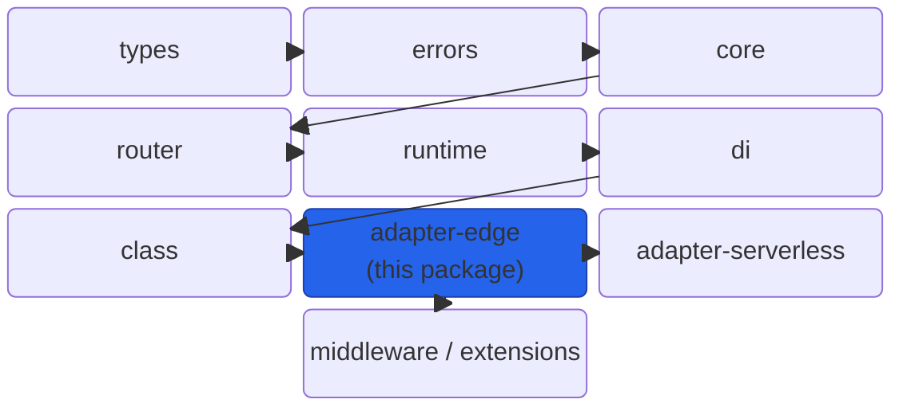
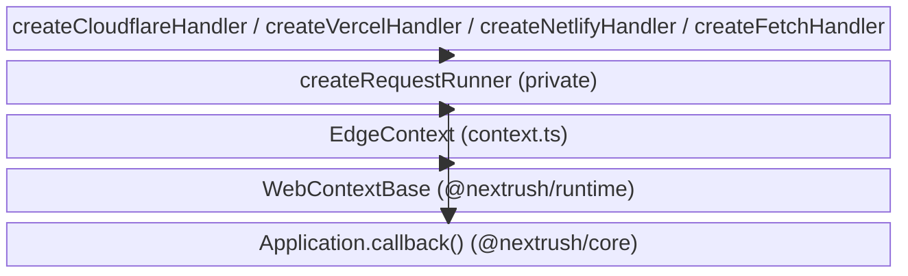
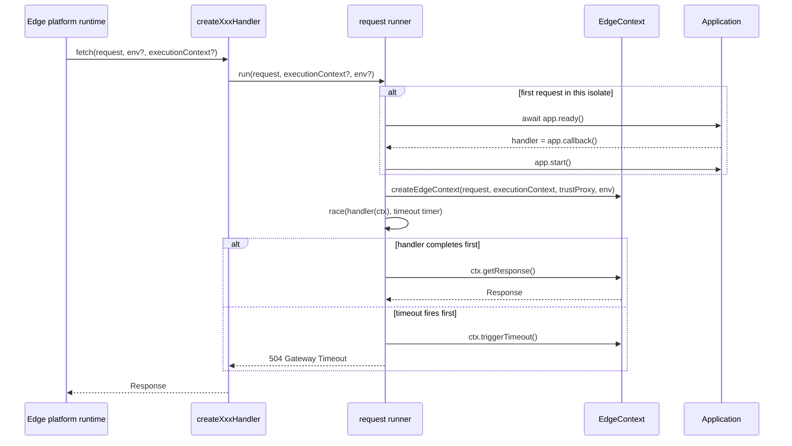

# @nextrush/adapter-edge — Architecture

> Internal design of the shared Fetch-API request runner and the platform-specific wrappers
> (Cloudflare, Vercel, Netlify) built on top of it.

## At a glance

|  |  |
| --- | --- |
| **Package** | `@nextrush/adapter-edge` |
| **Layer** | adapter |
| **Depends on** | `@nextrush/core`, `@nextrush/errors`, `@nextrush/runtime`, `@nextrush/stream`, `@nextrush/types` |
| **Depended on by** | `@nextrush/adapter-serverless` (builds its own handler on top of this package's fetch runner) |
| **Public entry** | `src/index.ts` (barrel — exports only) |
| **Internal modules** | 4 files (`adapter.ts`, `context.ts`, `body-source.ts`, `utils.ts`) — largest ~300 lines (`adapter.ts`) |
| **On the request hot path?** | yes — this package IS the request path on edge |
| **Runtime coupling** | none — Web-standard `Request`/`Response`/`fetch` only |
| **State model** | per-request `EdgeContext`; one memoized boot promise shared across all requests in an isolate |

## Responsibilities

**This package owns:**
- ✓ Translating a platform's Fetch-API entry point (`fetch(request, env, ctx)` on Cloudflare,
  `(request) => Response` on Vercel/Netlify) into a call against a NextRush `Application`.
- ✓ `EdgeContext` — the `Context` implementation used for every edge request, including
  `waitUntil` and Cloudflare `env` binding access.
- ✓ Lazily booting the `Application` on the first request in an isolate and reusing that boot
  for every subsequent request (edge has no `listen()`/`serve()` phase).
- ✓ Racing the handler against a request timeout and returning a `504` on expiry.

**This package does NOT own:**
- ✗ Routing — owned by `@nextrush/router`; this package only calls `Application.callback()`.
- ✗ Body parsing — owned by `@nextrush/body-parser`; this package only exposes the raw
  `bodySource` (from `@nextrush/runtime`'s shared `WebBodySource`).
- ✗ FaaS event-format translation (API Gateway, Cloud Functions triggers) — owned by
  `@nextrush/adapter-serverless`, which wraps this package's fetch handler.
- ✗ Response body construction mechanics (`json`/`send`/`html`/`redirect`, header handling) —
  owned by `@nextrush/runtime`'s shared `WebContextBase`/`WebResponseBuilder`, which
  `EdgeContext` extends rather than reimplements.

## Non-goals

- Does not run on Node.js — that is `@nextrush/adapter-node`'s job.
- Does not implement its own client-IP resolution policy — delegates to
  `@nextrush/runtime`'s shared `getEdgeClientIp`, which already encodes Cloudflare's
  `cf-connecting-ip` header precedence.
- Does not maintain a server lifetime — `close()`/teardown hooks are intentionally never
  invoked on edge; there is no server process to shut down.

## Constraints

Must remain:
- Runtime-independent at the Web-Fetch-API level — no `node:*`, `process` (beyond feature
  probes), `Deno`, or `Bun` APIs outside of platform-detection checks.
- Zero external runtime dependencies — only workspace packages
  (`@nextrush/{core,errors,runtime,stream,types}`).
- ESM-only, side-effect-free (`sideEffects: false` in `package.json`).
- Conformant to the shared adapter contract (`ServerAdapter`/`FetchAdapter`,
  `AdapterContextFactory` from `@nextrush/types`) — enforced at compile time in `adapter.ts`,
  not just documented.

## Position in the package hierarchy



> [!IMPORTANT]
> Imports flow downward only. `@nextrush/adapter-edge` may import from the layers below it
> (`core`, `runtime`, `errors`, `types`, `stream`) and must not be imported by them — enforced
> in review (project-rules §1). `@nextrush/adapter-serverless` sits above this package and
> imports it, not the reverse.

**Dependency rules:**
- **Allowed:** `@nextrush/adapter-edge -> @nextrush/{core,errors,runtime,stream,types}`
- **Forbidden:** `@nextrush/adapter-edge -> @nextrush/adapter-serverless` (that direction is
  reversed — serverless depends on edge)

---

## Overview

The package centers on one internal function, `createRequestRunner` (private to `adapter.ts`),
that every public `createXxxHandler` delegates to. It closes over the `Application`, the
resolved `timeout` (`options.timeout ?? DEFAULT_EDGE_TIMEOUT_MS`), and a memoized `bootPromise`,
then returns an async function of `(request, executionContext?, env?) => Promise<Response>`.
`createFetchHandler`, `createCloudflareHandler`, `createVercelHandler`, and
`createNetlifyHandler` differ only in the shape of what they hand back to the platform — a bare
function for Vercel/Netlify, a `{ fetch }` object with the Cloudflare `env` parameter threaded
through for Cloudflare Workers.

The organizing idea: platform differences are surface-shape differences only. There is exactly
one place — the shared runner — where booting, timeout racing, error handling, and response
finalization happen, so the three platform wrappers cannot independently drift.

### Design principles

1. **One runner, many wrappers.** Enforced structurally — `createCloudflareHandler`,
   `createVercelHandler`, and `createNetlifyHandler` all call `createRequestRunner` internally;
   there is no second implementation to keep in sync.
2. **Compile-time contract conformance.** `adapter.ts` declares `_edgeConformance:
   FetchAdapter<Application, EdgeExecutionContext>` and `_edgeContextFactory:
   AdapterContextFactory<...>` — a shape drift from the shared cross-adapter contract
   (`@nextrush/types`) fails `tsc`, not a runtime check.
3. **Shared context base over duplication.** `EdgeContext` extends `@nextrush/runtime`'s
   `WebContextBase`, which owns response building, streaming, and header helpers once across
   the Bun/Deno/Edge Web adapters — `EdgeContext` supplies only what is genuinely edge-specific
   (`env`, `waitUntil`, edge-flavored IP resolution).

---

## Module structure

```text
src/
├── index.ts          # Public API exports (barrel only, no implementation)
├── adapter.ts         # createFetchHandler / createCloudflareHandler / createVercelHandler /
│                      # createNetlifyHandler / createHandler + the shared request runner
├── context.ts         # EdgeContext (extends WebContextBase) + createEdgeContext
├── body-source.ts     # Re-exports @nextrush/runtime's shared WebBodySource/EmptyBodySource
└── utils.ts           # Re-exports detectEdgeRuntime/parseQueryString from @nextrush/runtime;
                        # deprecated getContentType/getContentLength kept for compatibility
```

### Module responsibilities

| Module | Responsibility (the one thing it owns) |
| ------ | ---------------------------------------- |
| `adapter.ts` | The shared request runner and every platform-specific handler factory |
| `context.ts` | `EdgeContext` — the per-request `Context` implementation for edge runtimes, including `ctx.platform` resolution (explicit value wins, else `detectPlatform()`) and the development-mode `ctx.waitUntil()` no-op warning |
| `body-source.ts` | Re-export point for the cross-runtime body-reading implementation |
| `utils.ts` | Re-export point for edge runtime detection; two deprecated header helpers |

## Component relationships



---

## Lifecycle



The non-obvious ordering: the boot barrier (`app.ready()` + `app.callback()` + `app.start()`)
runs lazily on the *first* request rather than eagerly at module load, because edge runtimes
have no `listen()`/`serve()` phase to hook into. The resulting `bootPromise` is memoized, so
every request after the first awaits the same cached promise instead of re-running setup.

### Platform identity and diagnostics on this path

Two things ride along the same construction path, both added after the original design:

- **`ctx.platform` (RFC-026).** The runner passes `options.platform` into `createEdgeContext`, and
  `EdgeContext` resolves `platform ?? detectPlatform().platform`. `detectPlatform()` recognizes only
  Cloudflare Workers, Vercel Edge, and Netlify Edge — the same three probes as
  `detectEdgeRuntime()`, cached the same way. Serverless platforms are never detected: they arrive
  only as an explicit literal from `@nextrush/adapter-serverless`'s Tier-1 handlers. `ctx.runtime` is
  untouched by this.
- **Boot-reuse detection.** Module-scope `bootedApps` (a `WeakSet<Application>`), `hasBootedAnyApp`,
  and `warnedBootReuse` let the boot barrier notice that a *different* `Application` booted in this
  isolate than the one that booted first — the mechanical signature of `createApp()` being called
  inside the exported handler. It warns once, outside production only, and never changes behavior.
  The timeout path additionally records `timeoutSource` (`'default'` vs
  `'explicit options.timeout'`) so a 504 is attributable from the log alone. Exact message text is
  in `README.md`'s Diagnostics section.

## State ownership

| Owner | State it owns | Scope |
| ----- | -------------- | ----- |
| `createRequestRunner`'s closure | `bootPromise` (the memoized boot barrier) | isolate-lifetime, shared across requests |
| `EdgeContext` | request/response state, `params`, `env`, `executionContext`, `platform`, the once-per-context `waitUntil` warning flag | per-request |
| Module scope in `adapter.ts` | `bootedApps` (WeakSet), `hasBootedAnyApp`, `warnedBootReuse` — the once-per-module-instance boot-reuse warning bookkeeping | module instance (isolate) |
| `@nextrush/runtime`'s `WebResponseBuilder` (composed into `EdgeContext`) | accumulated response headers/body/status | per-request |

---

## Concurrency & edge behaviour

- **Shared, immutable after boot:** the `bootPromise` and the resolved request handler
  (`Application.callback()`'s return value) — reused across every request in the isolate.
- **Per-request, never shared:** `EdgeContext` and everything it owns (headers, body source,
  `env`, `executionContext`).
- **Abort / disconnect / timeout:** the timeout race clears its timer in a `finally` block on
  both the handler-wins and timeout-wins paths; on timeout, `ctx.triggerTimeout()` aborts
  `ctx.signal` so a handler awaiting that signal can cooperatively stop work. `timeout: 0`
  disables the framework-level race entirely (the platform's own CPU/wall-time limit still
  applies).

> [!WARNING]
> Edge has no server lifetime — `close()`/teardown hooks that a Node deployment relies on are
> never called here. A handler that assumes teardown will run on every request path (e.g. to
> release a per-request resource) will leak on edge; use `ctx.waitUntil()` for anything that
> must finish after the response is returned.

## Trust boundaries

```text
Edge platform ──▶ Fetch Request ──▶ EdgeContext ──▶ Application middleware chain
                                        ▲
                                        └─ this package treats the platform's Request as
                                           already-network-terminated; it does not re-validate
                                           TLS or platform auth — that is the platform's job
```

This package treats the incoming `Request` as coming from the edge platform's own network
termination (already TLS-terminated, already routed to this isolate). It does not perform
additional network-level validation. Client-IP trust is explicit and opt-in:
`trustProxy` defaults to `false`, in which case `ctx.ip` is `''` rather than trusting any
forwarded-IP header by default — the caller must explicitly pass `trustProxy: true` (via the
`Application`'s `proxy` option) before Cloudflare's `cf-connecting-ip` or standard
`x-forwarded-for`/`x-real-ip` headers are consulted.

## Extension points

**Supported extension points:**
- `FetchHandlerOptions.onError` — override the default JSON 500 error response.
- `FetchHandlerOptions.timeout` — override the default 24s framework timeout, including
  disabling it (`0`).
- The generic `createFetchHandler`/`createHandler` — usable directly on any Fetch-API host not
  named Cloudflare, Vercel, or Netlify.

**Forbidden (sealed):**
- The private `createRequestRunner` — not exported; platform wrappers must go through the
  public `createXxxHandler` factories rather than reimplementing boot/timeout/response logic.
- `EdgeContext`'s inherited response-building internals (`WebResponseBuilder` composition) —
  owned by `@nextrush/runtime`, shared across all Web adapters; changing it here would break
  Bun/Deno parity.

---

## Architectural invariants

The following are part of the package architecture. They do not change without an RFC:

- Every platform-specific handler delegates to the same internal request runner — no
  independent per-platform boot/timeout/error-handling logic.
- `EdgeContext` extends the shared `WebContextBase` rather than reimplementing response
  building — parity with the Bun/Deno Web adapters is structural, not just tested.
- The adapter's exported shape conforms to `FetchAdapter`/`AdapterContextFactory`
  (`@nextrush/types`) at compile time (RFC-013).
- The package imports no Node-only, Deno-only, or Bun-only API outside of the narrow feature
  probes used by `detectEdgeRuntime()`.
- `detectEdgeRuntime()` has exactly three named-platform branches (Cloudflare, Vercel,
  Netlify) and no fourth branch for any FaaS platform; downstream packages built on this one
  (e.g. `@nextrush/adapter-serverless`) inherit that same detection rather than this package
  growing FaaS-specific branches itself.

## Engineering decisions

| Decision | Chosen | Trade-off accepted | Reference |
| -------- | ------ | -------------------- | --------- |
| Default request timeout when unspecified | `24_000` ms (`DEFAULT_EDGE_TIMEOUT_MS`) | Below both Cloudflare Workers' ~30s CPU limit and Vercel Edge's 25s wall limit, with margin on the latter — the framework's `504` fires before the platform's own kill on either | [ADR-0010](../../../docs/adr/ADR-0010-cross-runtime-parity-hardening.md) |
| Context implementation shared with Bun/Deno adapters | Extend `WebContextBase` from `@nextrush/runtime` rather than a bespoke `EdgeContext` implementation | Edge-specific behavior (env bindings, waitUntil) must be layered on top of a shared base rather than written in full isolation | [ADR-0010](../../../docs/adr/ADR-0010-cross-runtime-parity-hardening.md) |
| Compile-time adapter-contract conformance | `satisfies`-style guard variables (`_edgeConformance`, `_edgeContextFactory`) in `adapter.ts` | Adds two unused-looking module-level `const`s that exist purely to fail the build on drift | [RFC-013](../../../docs/RFC/runtime-adapters/013-adapter-contract.md) |

## Rejected alternatives

### Separate handler implementations per platform
An earlier shape (still visible in the exported function names) implied Cloudflare, Vercel, and
Netlify each had their own handler logic. This was collapsed into one shared runner
(`createRequestRunner`) because three independent implementations of boot/timeout/error
handling is exactly the kind of drift the adapter-contract RFC (RFC-013) and cross-runtime
parity hardening (ADR-0010) exist to prevent.

---

## Testing strategy

- **Unit:** `adapter.test.ts` (handler factories), `context.test.ts` (`EdgeContext` behavior),
  `body-source.test.ts`, `utils.test.ts` (runtime detection re-exports).
- **Invariant tests:** `public-surface.test.ts` locks the exported surface;
  `default-timeout.test.ts` locks the `24_000` ms default and its override behavior.
- **Conformance / cross-adapter parity:** `packages/adapters/conformance` (out of scope for
  this document — private, internal test infrastructure) exercises this adapter alongside
  node/bun/deno for observable-behavior parity.
- **Coverage:** >=90% lines/functions (CI-enforced).

## Evolution strategy

- **Stable (semver-guarded within the Internal tier):** the exported function/type names
  listed in the README's API overview.
- **May change without notice:** this package's Internal support tier means its surface may
  change without a major version bump, per [ADR-0005](../../../docs/adr/ADR-0005-package-tiers-sealed-surface-deprecation.md)
  — until the package is declared GA.
- **Changes only via RFC:** the shared-runner architecture and the compile-time adapter-contract
  guard.

## Contributor notes

Before changing this package, read
[RFC-013 (adapter contract)](../../../docs/RFC/runtime-adapters/013-adapter-contract.md) and
[ADR-0010 (cross-runtime parity hardening)](../../../docs/adr/ADR-0010-cross-runtime-parity-hardening.md).
Any change to timeout behavior, context construction, or the exported handler shapes should be
checked against `packages/adapters/conformance`'s parity suite before merging.

## Architecture checklist

Before changing this package, confirm:
- [ ] Does this preserve the "one runner, many wrappers" invariant?
- [ ] Does this increase coupling to a specific platform (Cloudflare/Vercel/Netlify) beyond
      the existing `env`/`executionContext` threading?
- [ ] Does this affect the request hot path (allocations, the timeout race)?
- [ ] Does this change the public API — and if so, does it stay within the Internal tier's
      "may change without a major" allowance, or does it need to be flagged as a breaking
      change regardless?
- [ ] Does it need an RFC?

---

## References & see also

- **README (how to use it):** [`./README.md`](./README.md)
- **Governing RFC:** [`docs/RFC/runtime-adapters/013-adapter-contract.md`](../../../docs/RFC/runtime-adapters/013-adapter-contract.md)
- **ADR:** [`docs/adr/ADR-0010-cross-runtime-parity-hardening.md`](../../../docs/adr/ADR-0010-cross-runtime-parity-hardening.md), [`docs/adr/ADR-0005-package-tiers-sealed-surface-deprecation.md`](../../../docs/adr/ADR-0005-package-tiers-sealed-surface-deprecation.md)
- **Benchmarks:** [`apps/benchmark`](https://github.com/0xTanzim/nextRush/tree/main/apps/benchmark)
