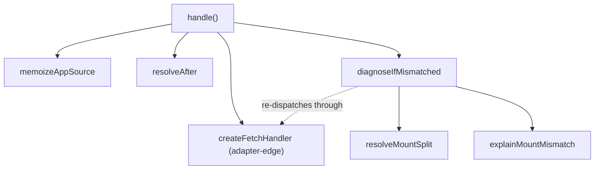
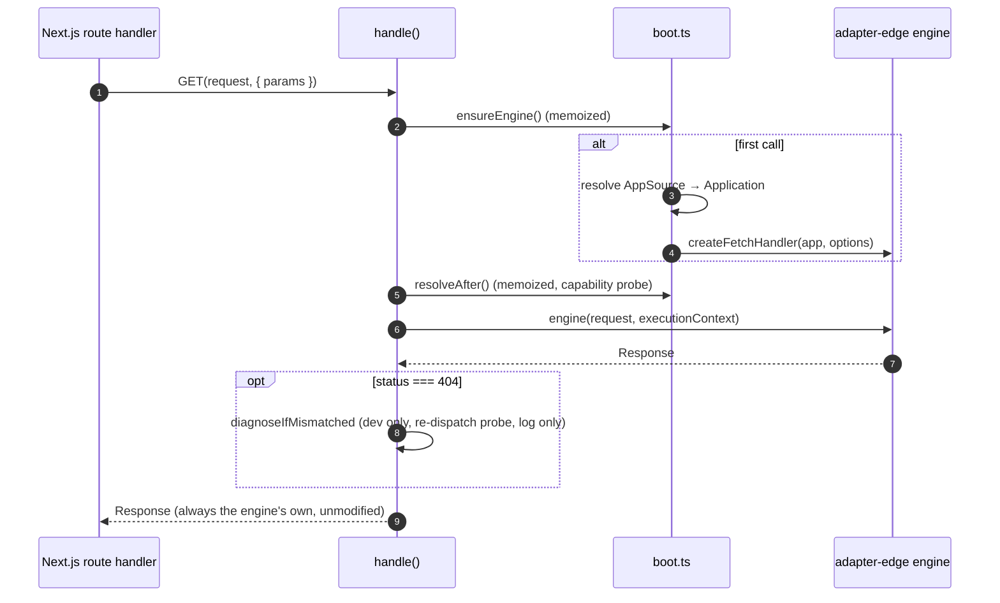

# @nextrush/adapter-nextjs — Architecture

> The internal design of the Next.js App Router bridge: why the request is never rewritten, how
> the mount-mismatch diagnostic works without serving an alternate response, and why the Pages
> Router is a permanent non-goal.

## At a glance

|  |  |
| --- | --- |
| **Package** | `@nextrush/adapter-nextjs` |
| **Layer** | `adapter` |
| **Depends on** | `@nextrush/adapter-edge` (sibling), `@nextrush/core`, `@nextrush/types` |
| **Depended on by** | Next.js App Router applications (via `nextrush/nextjs`) |
| **Public entry** | `src/index.ts` (barrel — one function, five types) |
| **Internal modules** | 3 files · largest ~120 LOC (cap 300) |
| **On the request hot path?** | Yes — every dispatched request passes through `handle()` |
| **Runtime coupling** | None — Web-standard only (`Request`, `Response`, `Headers`, `URL`, dynamic `import()`) |
| **State model** | App-scoped: one memoized `Application` and one memoized `after` resolution per `handle()` call |

## Responsibilities

**This package owns:**
- ✓ Wiring the seven Next.js route-handler exports (`GET`…`OPTIONS`) to one underlying `Application`
- ✓ Memoizing an `AppSource` (app or factory) into a single resolved `Application`
- ✓ Resolving Next's `after()` as a capability probe and wiring it to `ctx.waitUntil()`
- ✓ Diagnosing a mount-prefix mismatch in development, without ever serving an alternate response

**This package does NOT own:**
- ✗ The request/response execution model — owned by `@nextrush/adapter-edge`'s `createFetchHandler`
- ✗ Routing or mount-prefix declaration — owned by the application itself (`app.route(prefix, router)`)
- ✗ Timeout, error handling, or header finalization — inherited unmodified from the edge engine

## Non-goals

- The Pages Router (see [Rejected alternatives](#rejected-alternatives))
- Stripping or rewriting the request path under any circumstance
- A `basePath` configuration option — there is no path semantics to configure
- Typed RPC client generation

## Constraints

Must remain:
- Fully Web-standard — no `node:*`, `process`, `Buffer`, or runtime global (enforced by lint)
- Zero-dependency at the runtime level — `next` is a lazily-imported optional peer, never required to load
- Behaviorally identical to `@nextrush/adapter-edge` for every request it forwards — proven by the shared conformance suite, not asserted

## Position in the package hierarchy

```mermaid
flowchart TB
    types --> errors --> core --> router --> runtime --> di --> class
    class --> adapters["adapter-edge / adapter-node / adapter-serverless"]
    THIS["@nextrush/adapter-nextjs — this package"]:::here
    adapters --> THIS
    classDef here fill:#2563eb,color:#fff,stroke:#1e40af;
```

> [!IMPORTANT]
> Imports flow **downward only**. `@nextrush/adapter-nextjs` may import from `@nextrush/adapter-edge`
> and the layers below it, and MUST NOT be imported by them (project-rules §1).

**Dependency rules:**
- **Allowed:** `@nextrush/adapter-nextjs → @nextrush/adapter-edge` · `→ @nextrush/core` · `→ @nextrush/types`
- **Forbidden:** `@nextrush/adapter-nextjs → @nextrush/adapter-node` (that dependency is what would force a Pages Router split — see below)

---

## Overview

This package is deliberately almost nothing. `handle()` resolves an `Application`, builds a
`createFetchHandler` engine over it exactly once, and returns seven functions that all call the
same dispatch path. It adds no execution model, no context type, and no error handling of its
own — every one of those is inherited from `@nextrush/adapter-edge` unmodified, which is also why
this package cannot drift from Cloudflare/Vercel/Netlify behavior: underneath, it is the same
function.

The one organizing idea is **the request is sacred**. Every design choice here — prepend instead
of strip, a diagnostic instead of a rewrite, no `basePath` option — exists to keep `ctx.path`,
`ctx.url`, and `ctx.raw.req` meaning the same thing inside Next as they do under `listen()`.

### Design principles

1. **The bridge owns no path semantics.** Enforced by the public surface itself: `handle()` takes
   no prefix-related option. Mount configuration is `app.route(prefix, router)` — ordinary
   NextRush code, not a new concept.
2. **Diagnose, never rescue.** Enforced structurally: `diagnoseIfMismatched` only ever calls
   `resolvedApp.logger.warn(...)`; nothing in `handle()`'s dispatch path can return the
   diagnostic's probe response to the caller.
3. **Capabilities, never runtime identity.** Enforced by construction: `resolveAfter()` probes
   whether `next/server` exports a callable `after`, and nothing anywhere branches on
   `process.platform`/`Deno`/`Bun` (there is no such branch possible — the package imports none
   of those globals).

---

## Module structure

```text
src/
├── index.ts        # Public API — handle(), the seven-method wiring, the diagnostic call site
├── boot.ts          # AppSource memoization; after() capability probe (both process-lifetime caches)
└── diagnose.ts      # Pure mount-prefix-mismatch math and message — no Request, no I/O
```

### Module responsibilities

| Module | Responsibility (the one thing it owns) |
| ------ | -------------------------------------- |
| `index.ts` | Wires `boot.ts` + `diagnose.ts` + `@nextrush/adapter-edge` into the seven exported handlers |
| `boot.ts` | Turns an `AppSource` into a resolved `Application` exactly once; resolves `after` exactly once |
| `diagnose.ts` | `resolveMountSplit` (segment-count prefix inference) and `explainMountMismatch` (the log message) |

## Component relationships



---

## Lifecycle



Two memoizations happen once per `handle()` call and persist for the life of the module
instance: the resolved `Application` (and the engine built over it), and the `after` capability
probe. A factory that throws is the one exception — its memo is cleared so the next request
retries the factory rather than being permanently poisoned.

## State ownership

| Owner | State it owns | Scope |
| ----- | ------------- | ----- |
| `boot.ts`'s `memoizeAppSource` closure | The resolved `Application` (or the pending/failed promise) | one per `handle()` call, for the life of the module instance |
| `boot.ts`'s module-level `afterPromise` | The resolved `after` function or `undefined` | process-lifetime, shared across every `handle()` call |
| `@nextrush/adapter-edge`'s engine | Request/response execution, timeout, boot barrier | delegated entirely — this package holds no execution state |

---

## Concurrency & edge behaviour

- **Shared, immutable after first resolution:** the memoized `Application` and the memoized `after` probe.
- **Per-request, never shared:** the `Request`/`Response` pair itself — never mutated or reconstructed.
- **Abort / disconnect / timeout:** inherited from `@nextrush/adapter-edge` unchanged — this package adds no timer of its own.

> [!WARNING]
> `ctx.waitUntil()`'s wrapper swallows a synchronous throw from `after()` itself (e.g. Next's real
> "called outside a request scope" error). This is intentional — `EdgeContext.waitUntil` is
> documented never to throw from the caller's perspective, and this package preserves that
> contract even when the underlying `after()` implementation violates it.

## Trust boundaries

```text
Client request ──▶ Request (untouched) ──▶ createFetchHandler ──▶ Application
                                              ▲
                                              └─ the boundary THIS package forwards across, unmodified
```

This package introduces no new trust boundary — it forwards the request exactly as received, with
no header added except (in the mount-mismatch diagnostic's internal probe only) a synthetic
same-origin `Request` that is never returned to the caller. `x-forwarded-for`/proxy trust remains
`@nextrush/core`'s `proxy` option, unchanged.

## Extension points

**Supported extension points:**
- The `onError` option — a full replacement for the engine's default error handler
- The `AppSource` factory form — anything that can produce an `Application` (sync or async)

**Forbidden (sealed):**
- No `basePath`/path-rewriting option will be added here — see [Rejected alternatives](#rejected-alternatives)
- The seven-method shape of `NextRouteHandlers` is fixed to match Next's own supported methods

---

## Architectural invariants

The following are part of the package architecture. They do not change without an RFC:

- The request forwarded to `createFetchHandler` is never modified — no `Request` reconstruction, ever.
- Mount prefixes are declared by the application (`app.route()`), never inferred or configured by this package.
- This package imports no runtime-specific API (`node:*`, `process`, `Buffer`, a `Deno`/`Bun` global).
- The mount-mismatch diagnostic (`diagnoseIfMismatched`) only logs; it never serves its probe response to the caller.
- `next` is an optional peer, resolved lazily — never a hard runtime dependency.

## Engineering decisions

| Decision | Chosen | Trade-off accepted | Reference |
| -------- | ------ | ------------------- | --------- |
| Prepend vs. strip the mount prefix | Prepend — the request is never modified | The prefix is written in two places (folder + `app.route()`) instead of one | [RFC-024 §9.3](../../../docs/RFC/runtime-adapters/024-adapter-nextjs.md#93-strip-the-mount-prefix-by-rewriting-the-request-v2s-design) |
| Support the Pages Router | No — App Router only | Pages Router users must migrate their route file | [RFC-024 §9.2](../../../docs/RFC/runtime-adapters/024-adapter-nextjs.md#92-support-the-pages-router) |
| `ctx.waitUntil()` → `after()` wiring | Capability probe, swallows a synchronous throw from `after()` itself | An `after()` failure is invisible rather than surfaced | [RFC-024 §8.3](../../../docs/RFC/runtime-adapters/024-adapter-nextjs.md#83-waituntil--after) |
| Mount-mismatch diagnostic | Re-dispatch through the same engine, log only, dev-only | One extra dispatch per 404 in development | [RFC-024 §8.4](../../../docs/RFC/runtime-adapters/024-adapter-nextjs.md#84-mount-mismatch-diagnostic-development-only) |
| Second handler parameter typing | Required, `params: Promise<...>` (matches Next's generated `RouteContext`) | Cannot be called with `context` omitted at the type level from user code | Discovered via the Next 15 `next build` fixture — see [`packages/adapters/conformance/deploy-verification/nextjs-app-15`](../conformance/deploy-verification/nextjs-app-15) |

## Rejected alternatives

### The Pages Router
Rejected because it is the only reason this package would import `node:*` or depend on
`@nextrush/adapter-node` — Pages hands `(req, res)`, not a `Request`. Supporting it would force a
two-subpath split to keep that dependency out of Web-runtime bundles, and it would drag in an
unrelated `@nextrush/adapter-node` boot-barrier defect as a prerequisite. See RFC-024 §9.2/§17.

### Stripping the mount prefix by rewriting the request
Rejected on correctness grounds: `@nextrush/runtime`'s `WebContextBase` computes `url`/`path`/
`query` eagerly from `request.url` in its constructor, so a rewritten request makes the mount
prefix permanently unrecoverable inside the handler — breaking relative redirects and any
generated OpenAPI paths. The original design mitigated this with an `x-forwarded-prefix` header
and a `getMountPath()` helper; both were deleted once prepend was adopted, because there was
nothing left to undo. See RFC-024 §9.3.

### The adapter injecting the mount prefix at boot
Rejected because `@nextrush/core`'s `Application._boot()` mounts the app-owned router once, and
an app shared between a Next route file and a standalone `listen()` call would then route
differently depending on which host booted it first. Mount configuration belongs to the
application, never to the adapter serving it. See RFC-024 §9.4.

---

## Testing strategy

- **Unit:** `resolveMountSplit`/`explainMountMismatch` (pure, every edge case in a table);
  `memoizeAppSource`/`resolveAfter` (memoization, retry-after-failure, capability absence)
- **Integration:** `handle()` end to end against a real `Application` — GET/POST dispatch, timeout
  racing, `onError`, the mount-mismatch diagnostic's logging (not just its math)
- **Invariant tests:** an object-identity assertion proving the forwarded `Request` is the same
  object handed to `createFetchHandler`, not a reconstruction
- **Conformance / cross-adapter parity:** yes — `packages/adapters/conformance`'s `nextjs` driver runs the full shared suite
- **Type-level proof:** three real `next build` fixtures (Next 14, 15, 16) under
  `packages/adapters/conformance/deploy-verification/nextjs-app-{14,15,16}/`
- **Coverage:** ≥90% lines/functions (CI-enforced)

## Evolution strategy

- **Stable (semver-guarded):** `handle()`'s signature, `NextRouteHandlers`' seven-key shape, `NextHandlerOptions`
- **May change without notice:** the internal split between `boot.ts`/`diagnose.ts`/`index.ts`
- **Changes only via RFC:** any of the architectural invariants above, especially "the request is never modified"

**Timeline:** `1.0.0-beta.0` — App Router only, Next 14/15/16. A `basePath` option on
`@nextrush/adapter-edge`, and a `ctx.mountPath`/`ctx.originalUrl` addition to the shared `Context`
contract, are both deferred future work (RFC-024 §17) — neither is planned for this package.

## Contributor notes

Before changing this package, read: [RFC-024](../../../docs/RFC/runtime-adapters/024-adapter-nextjs.md)
(especially §9.3 on why the request is never rewritten), [ADR-0014](../../../docs/adr/ADR-0014-adapter-nextjs-prepend-only.md),
and the `nextjs` driver in `packages/adapters/conformance/src/drivers/nextjs-driver.ts`.

## Architecture checklist

Before changing this package, confirm:
- [ ] Does this preserve "the request is never modified"?
- [ ] Does this add a runtime-specific import (`node:*`, `process`, `Buffer`, a runtime global)?
- [ ] Does this affect the request hot path (allocations)?
- [ ] Does this change `handle()`'s public signature (semver)?
- [ ] Does it need an RFC?

---

## References & see also

- **README (how to use it):** [`./README.md`](./README.md)
- **Governing RFC:** [`docs/RFC/runtime-adapters/024-adapter-nextjs.md`](../../../docs/RFC/runtime-adapters/024-adapter-nextjs.md)
- **ADR:** [`docs/adr/ADR-0014-adapter-nextjs-prepend-only.md`](../../../docs/adr/ADR-0014-adapter-nextjs-prepend-only.md)
- **OpenSpec capability:** [`openspec/specs/web-adapters`](../../../openspec/specs/web-adapters/spec.md)
- **Benchmarks:** [`apps/benchmark`](https://github.com/0xTanzim/nextRush/tree/main/apps/benchmark)
