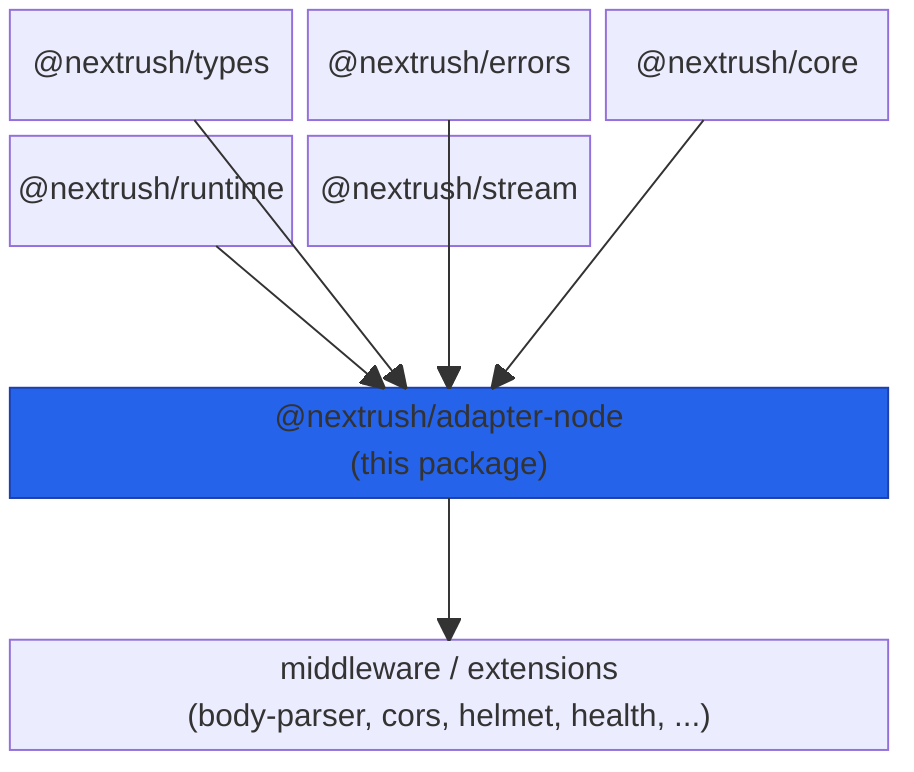
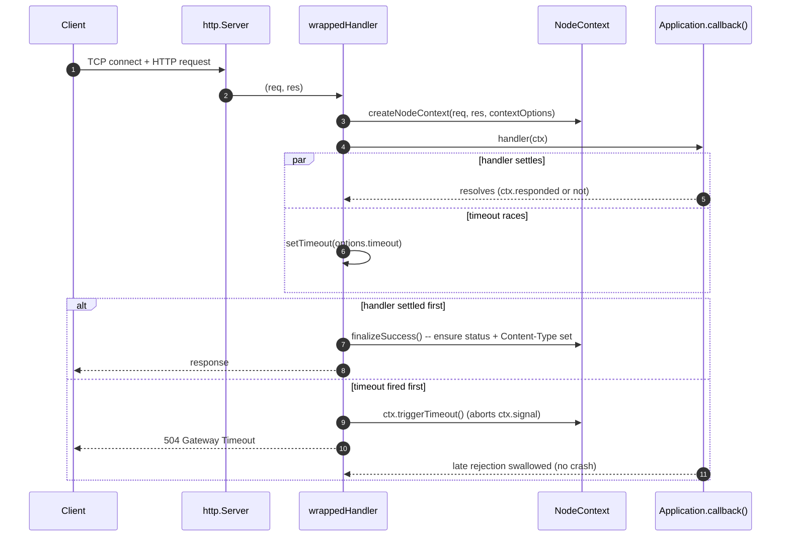
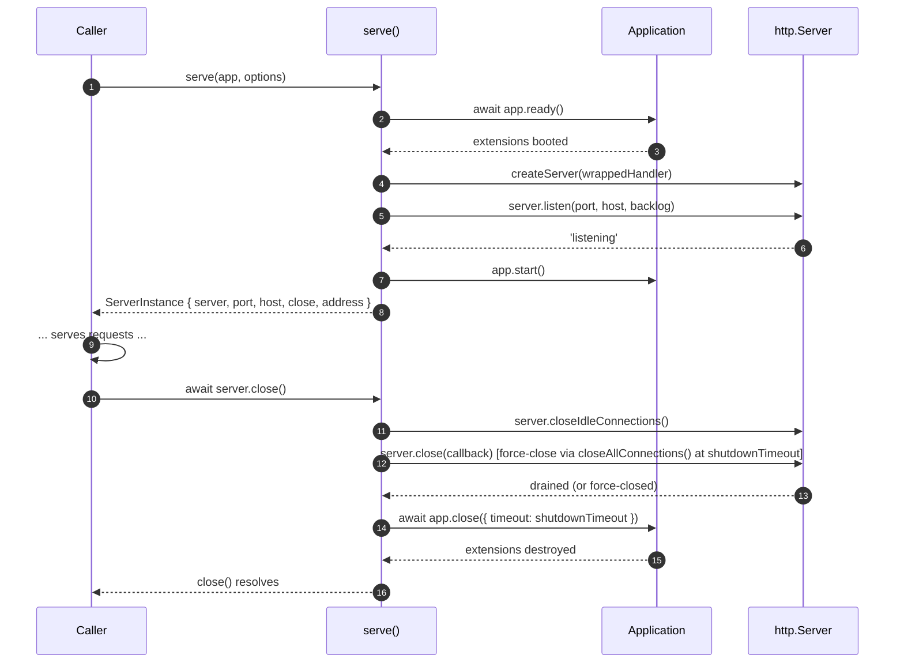
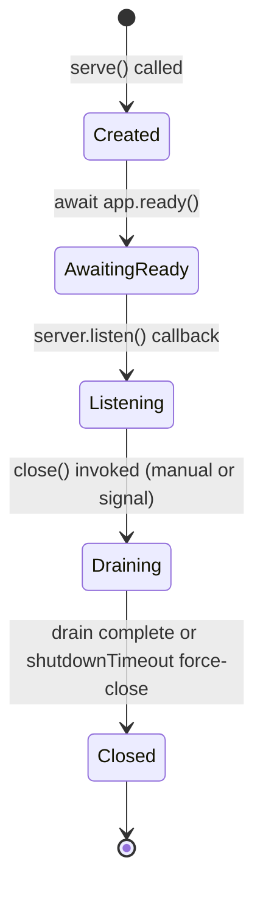

# @nextrush/adapter-node -- Architecture

> The internal design of the Node.js HTTP adapter: how a request travels from `http.Server` to
> an `Application` and back, and how graceful shutdown drains in-flight connections.

## At a glance

|  |  |
| --- | --- |
| **Package** | `@nextrush/adapter-node` |
| **Layer** | adapter |
| **Depends on** | `@nextrush/core`, `@nextrush/errors`, `@nextrush/runtime`, `@nextrush/stream`, `@nextrush/types` |
| **Depended on by** | `nextrush` (meta package, Node target), application code that imports it directly |
| **Public entry** | `src/index.ts` (barrel -- exports only) |
| **Internal modules** | 3 files -- `adapter.ts` (~500 LOC), `context.ts` (~640 LOC), `body-source.ts` (~300 LOC) |
| **On the request hot path?** | Yes -- every request passes through `createHandler()`'s returned function |
| **Runtime coupling** | Node-only by design -- imports `node:http` directly; this package IS the Node binding, not something that hides Node behind a further abstraction |
| **State model** | Per-server `DrainState` flag (shutdown only); otherwise per-request (`NodeContext`) |

## Responsibilities

**This package owns:**
- Starting and stopping a Node `http.Server` for a NextRush `Application` (`serve`, `listen`)
- Translating a Node `(req, res)` pair into the shared `Context` contract (`NodeContext`)
- Reading a Node `IncomingMessage` body into the shared `BodySource` contract (`NodeBodySource`)
- The handler-level request timeout (races the handler, returns `504`) and the socket-level
  `server.timeout` slow-client guard
- Graceful shutdown: draining in-flight connections, optionally wired to OS signals

**This package does NOT own:**
- Routing -- owned by `@nextrush/router`, consumed through `Application`
- Middleware composition -- owned by `@nextrush/core`
- Body *parsing* (JSON/form/multipart) -- owned by `@nextrush/body-parser` / `@nextrush/form-data`,
  which consume the `BodySource` this package produces
- Cross-adapter behavioral parity proofs -- owned by `packages/adapters/conformance` (private,
  out of scope for this document)

## Non-goals

- Supporting any runtime other than Node.js -- Bun/Deno/Edge/Serverless each get their own adapter
- HTTP/2 or HTTPS server creation -- `createHandler()` returns a plain `(req, res)` function so the
  caller can hand it to any Node-compatible server (see the README's HTTPS example), but this
  package never creates that server itself
- Load balancing or clustering -- out of scope for a single-process HTTP binding

## Constraints

Must remain:
- Behaviorally identical to the other adapters for every conformance-tested code path (timeouts,
  error responses, graceful shutdown semantics) -- proven by `packages/adapters/conformance`
- Backward compatible on its sealed public surface (ADR-0005) -- `serve`/`listen`/`createHandler`
  and their option/return types are a long-term contract
- Free of a second graceful-shutdown implementation -- the signal-triggered path and the
  manually-called `close()` path must invoke the exact same drain logic

## Position in the package hierarchy



> [!IMPORTANT]
> Imports flow **downward only**. `@nextrush/adapter-node` may import from the layers above it
> in this diagram (its dependencies) and MUST NOT be imported by them -- enforced in review
> (project-rules SS1).

**Dependency rules:**
- **Allowed:** `@nextrush/adapter-node -> @nextrush/core, @nextrush/errors, @nextrush/runtime, @nextrush/stream, @nextrush/types`
- **Forbidden:** `@nextrush/adapter-node -> @nextrush/adapter-bun` (or any sibling adapter, or `nextrush`, the meta package)

---

## Overview

`@nextrush/adapter-node` is the thinnest possible bridge between Node's `http` module and the
runtime-independent `Application`/`Context` contracts the rest of NextRush is built on. It has
exactly two jobs: turn a Node request into a `Context` the framework understands (`context.ts` +
`body-source.ts`), and manage the `http.Server` lifecycle around that translation (`adapter.ts`).

The organizing idea is that `createHandler()` and `serve()` are deliberately separable.
`createHandler()` alone is enough to run a NextRush app on any Node-compatible server (HTTPS,
HTTP/2, a test harness) -- `serve()` is a specific, opinionated composition of `createHandler()`
with a plain `http.Server`, sensible timeouts, and an optional graceful-shutdown wiring. Neither
function duplicates the other's logic.

### Design principles

1. **One drain implementation, two triggers.** `drainAndClose()` is the only code path that
   actually closes idle connections, waits out `shutdownTimeout`, and tears down extensions.
   Both a manually-called `close()` and a `gracefulShutdown`-installed signal handler call this
   exact function -- enforced by `buildCloseWithGracefulShutdown()` having no second
   implementation to drift out of sync.
2. **The handler-level timeout and the socket-level timeout are independent guards.**
   `server.timeout` (Node's socket-level slow-client guard) is set unconditionally in `serve()`;
   `createHandler()`'s explicit settled-flag race against `options.timeout` is what actually
   produces the clean `504` response body. Passing `timeout: 0` disables only the second guard.
3. **Per-server-lifetime state is hoisted out of the hot path.** `NodeContextOptions` (currently
   `{ trustProxy }`) is built once per `createHandler()` call and frozen, not reconstructed on
   every request -- enforced by the object literal appearing once, outside the returned closure.

---

## Module structure

```text
src/
|-- index.ts          # Public API exports (barrel only, no implementation)
|-- adapter.ts         # serve(), listen(), createHandler(), graceful shutdown
|-- context.ts         # NodeContext -- the Node Context implementation
|-- body-source.ts     # NodeBodySource / EmptyBodySource -- the Node BodySource implementation
`-- utils.ts           # parseQueryString re-export + deprecated header helpers
```

### Module responsibilities

| Module | Responsibility (the one thing it owns) |
| ------ | ---------------------------------------- |
| `adapter.ts` | The `http.Server` lifecycle: listen, request-handler wiring, timeouts, graceful shutdown |
| `context.ts` | Translating `(IncomingMessage, ServerResponse)` into the shared `Context` contract |
| `body-source.ts` | Streaming a request body into the shared `BodySource` contract, with a size limit |
| `utils.ts` | Query-string parsing re-export and two deprecated header-reading helpers |

## Component relationships



The diagram covers the steady-state path. During a drain (see Lifecycle below), the same
`wrappedHandler` additionally intercepts `res.writeHead` to advertise `Connection: close` on any
response that completes while `DrainState.draining` is `true`.

---

## Lifecycle





The non-obvious ordering: `app.ready()` runs **before** the server starts listening, so extension
setup failures surface before any client can connect -- and `app.close()` runs **after** the
server itself has fully stopped accepting/draining connections, not concurrently with it, so an
extension's `destroy()` never races an in-flight request.

## State ownership

| Owner | State it owns | Scope |
| ----- | -------------- | ----- |
| `Application` | Extension lifecycle, middleware chain, router | app |
| `serve()`'s `DrainState` | The single `draining` boolean flag | app (one per `serve()` call) |
| `NodeContext` | Request/response wrapper, params, body source | per-request |
| Node `http.Server` | Open sockets, listen state | app |

---

## Data structures

```ts
// The shape returned by serve()/listen() -- the caller's only handle on the running server.
export interface ServerInstance {
  server: Server;
  port: number;
  host: string;
  close(): Promise<void>;
  address(): { port: number; host: string; hostname: string };
}
```

`address()` returns `hostname` as an alias of `host` for compatibility with code written against
an earlier shape; both fields always carry the same value. `close` is a bound function, not a
method requiring `this` -- callers can destructure it (`const { close } = server`) safely.

## Performance characteristics

| Path | Complexity | Allocations | Notes |
| ---- | ---------- | ----------- | ----- |
| Per-request context creation | O(1) | one `NodeContext`, no `NodeBodySource` unless the body is read | `contextOptions` is hoisted and frozen once per `createHandler()` call, not per request |
| `server.listen()` backlog | O(1) | -- | fixed at `1024` (Node's own default is `511`); a deliberate, bounded increase to absorb connection bursts, not a "maximize the queue" choice |
| Graceful shutdown drain | O(open connections) | -- | `closeIdleConnections()` releases idle sockets immediately; in-flight requests finish and pick up `Connection: close` via the `writeHead` interception |

**Memory model:**
- **Shared (one copy):** the frozen `NodeContextOptions`, the `DrainState` flag, the `http.Server`
- **Per request:** `NodeContext`, and (only if the body is actually read) a `NodeBodySource`

## Concurrency & edge behaviour

- **Shared, immutable after startup:** `NodeContextOptions` (frozen at `createHandler()` call time)
- **Per-request, never shared:** `NodeContext`, `NodeBodySource`
- **Abort / disconnect / timeout:** a handler that exceeds `options.timeout` is cancelled
  cooperatively via `ctx.signal` (`ctx.triggerTimeout()`); its eventual settlement (resolve or
  reject) is swallowed rather than crashing the process, since the `504` has already been sent

> [!WARNING]
> `drainAndClose()` is the single source of truth for shutdown behavior. Adding a second drain
> path (e.g. a bespoke shutdown routine for a specific signal) would let the two diverge silently
> -- always route new shutdown triggers through `buildCloseWithGracefulShutdown()`.

## Trust boundaries

```text
Client (untrusted) --> http.Server --> NodeContext --> Application middleware chain
                                          ^
                                          `-- this package enforces: header-injection safety
                                              (assertHeaderSafe), body size limits (BodySource
                                              limit), and IP trust (ctx.ip only reads
                                              X-Forwarded-For when app.options.proxy is true)
```

This package treats every incoming header, body byte, and socket address as untrusted. It does
not decide *what* is valid (that is `@nextrush/body-parser`'s and application code's job) --
it enforces the structural boundary: a body over its configured limit throws before the handler
ever sees it, and `ctx.ip` never reads a spoofable proxy header unless the application explicitly
opted in via `{ proxy: true }`.

## Extension points

**Supported extension points:**
- `createHandler()` accepts `HandlerOptions` and returns a plain function -- safe to wrap or hand
  to any Node-compatible server
- `ServeOptions.onListen` / `onError` -- observe server lifecycle events without modifying them

**Forbidden (sealed):**
- `drainAndClose()` and `buildCloseWithGracefulShutdown()` are internal, not exported -- graceful
  shutdown has exactly one implementation
- `NodeContext`'s internal fields (`_bodySource`, the raw `req`/`res`) are private; consume the
  `Context` contract, not the Node-specific internals

---

## Architectural invariants

The following are part of the package architecture. They do not change without an RFC:

- There is exactly one connection-drain implementation (`drainAndClose`); the signal-triggered
  path and the manually-called `close()` path both invoke it, never a parallel copy.
- `app.ready()` always runs before the server starts listening; `app.close()` always runs after
  the server has fully stopped accepting/draining connections.
- The handler-level timeout and the socket-level `server.timeout` are independent guards; neither
  silently replaces the other.
- Repeated `serve()`/`close()` cycles in one process never accumulate duplicate signal listeners.
- The public API (`serve`, `listen`, `createHandler`, and their option/return types) is sealed per
  ADR-0005.

## Engineering decisions

| Decision | Chosen | Trade-off accepted | Reference |
| -------- | ------ | ------------------- | --------- |
| Listen backlog | Fixed `1024`, not read from live `net.core.somaxconn` | Portable across hosts, but not tuned to any specific host's actual OS ceiling | `report/router-highload-saturation-findings.md` |
| Handler timeout | An explicit `settled` flag races the handler against a `setTimeout`, cancelling via `ctx.signal` | Requires handlers to cooperate with `ctx.signal` to actually stop work early; a non-cooperative handler still runs to completion in the background | ADR-0010 |
| Graceful shutdown | Opt-in (`gracefulShutdown` option), not installed by default | No signal handler exists unless explicitly requested -- avoids silently changing process exit behavior for apps that don't ask for it | docs/RFC graceful-shutdown design notes |
| Extension teardown timing | Bounded by the same `shutdownTimeout` budget as connection drain | A slow extension `destroy()` can consume the whole shutdown budget rather than getting an independent allowance | RFC-022 / ADR-0012 |

## Rejected alternatives

### A second, signal-specific drain routine
Considered writing a separate, simpler drain path for the signal-triggered case (skip the
`DrainState.draining` flag, call `server.close()` directly). Rejected because it would create
exactly the two-implementations-that-drift risk the current design avoids -- the manually-called
`close()` and the signal path must observe identical behavior for conformance testing to mean
anything.

### Reading the live socket backlog from the OS
Considered querying `net.core.somaxconn` at startup and using it as the listen backlog. Rejected
because it varies across deployment environments (bare metal vs. container vs. serverless-adjacent
hosts), which would make the same application code behave differently per host with no code
change to explain why -- a fixed, documented default is more predictable.

---

## Testing strategy

- **Unit:** `context.test.ts`, `body-source.test.ts`, `utils.test.ts` -- pure translation logic
- **Integration:** `streaming.integration.test.ts`, `handler-timeout.test.ts`,
  `graceful-shutdown.integration.test.ts`, `idle-keepalive-drain.integration.test.ts` -- real
  `http.Server` instances, real sockets
- **Invariant tests:** `listen-backlog.test.ts` (backlog value), `public-surface.test.ts` (sealed
  export shape)
- **Conformance / cross-adapter parity:** yes -- `packages/adapters/conformance` (private, out of
  scope for this document)
- **Benchmark / regression:** hot-path allocation checks live in `per-request-work-trim.test.ts`
  and `context-response-microtrims.test.ts`
- **Coverage:** >=90% lines/functions (CI-enforced)

## Evolution strategy

- **Stable (semver-guarded):** `serve`, `listen`, `createHandler`, `NodeContext`,
  `createNodeContext`, `NodeBodySource`, `createNodeBodySource`, `createEmptyBodySource`, and all
  exported option/return types
- **May change without notice:** internal helpers (`drainAndClose`, `buildCloseWithGracefulShutdown`,
  `waitForDrainOrDisconnect`) and the module layout within `src/`
- **Changes only via RFC:** the architectural invariants listed above; any change to the
  graceful-shutdown contract or the timeout-vs-socket-guard split

## Contributor notes

Before changing this package, read: the graceful-shutdown design notes referenced from
`ServeOptions.gracefulShutdown`'s doc comment, ADR-0010 (handler timeout), ADR-0012 / RFC-022
(extension teardown budget), and `packages/adapters/conformance`'s shared behavioral suite (to
understand what a change here must keep identical across all adapters).

## Architecture checklist

Before changing this package, confirm:
- [ ] Does this preserve the single-drain-implementation invariant?
- [ ] Does this increase coupling to a specific Node version's `http` behavior beyond `>=22`?
- [ ] Does this affect the request hot path (allocations / complexity)?
- [ ] Does this change the public API (semver / ADR-0005)?
- [ ] Does it need an RFC?

---

## References & see also

- **README (how to use it):** [`./README.md`](./README.md)
- **Benchmarks:** [`apps/benchmark`](https://github.com/0xTanzim/nextRush/tree/main/apps/benchmark)
- **Conformance suite (parity across adapters):** `packages/adapters/conformance`
