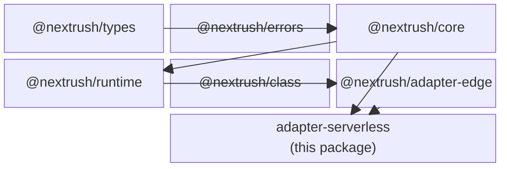
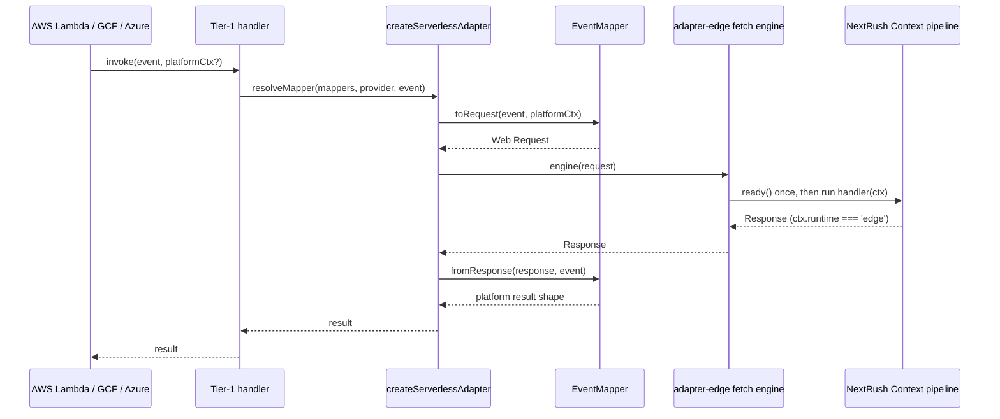

# @nextrush/adapter-serverless -- Architecture

> How a serverless platform event becomes a NextRush `Context` and back, and why this package
> owns only event translation while the request-execution model lives in `@nextrush/adapter-edge`.

## At a glance

|  |  |
| --- | --- |
| **Package** | `@nextrush/adapter-serverless` |
| **Layer** | adapter |
| **Depends on** | `@nextrush/adapter-edge` (fetch engine), `@nextrush/core`, `@nextrush/errors`, `@nextrush/runtime`, `@nextrush/stream`, `@nextrush/types` |
| **Depended on by** | application code deployed to AWS Lambda, Google Cloud Functions, or Azure Functions |
| **Public entry** | `src/index.ts` (barrel -- exports only) |
| **Internal modules** | 9 files (adapter, 3 platform handlers, types, 5 mappers) . largest ~120 LOC |
| **On the request hot path?** | Yes -- every invocation flows through this package's `toRequest`/`fromResponse` translation |
| **Runtime coupling** | None directly -- delegates all Web/Node-specific execution to `@nextrush/adapter-edge` |
| **State model** | Stateless per invocation; the booted `Application` is memoized at module scope across warm invocations |

## Responsibilities

**This package owns:**
- Translating a serverless platform's native event shape (Lambda, GCF, Azure) into a Web-standard
  `Request`, and translating the resulting `Response` back into that platform's expected result shape
- The `EventMapper` plugin contract and the built-in mappers for AWS (Function URL, API Gateway v1/v2),
  Google Cloud Functions, and Azure Functions v4
- Mapper selection: an explicit `provider` name, or `detect()` run against the incoming event
- The AWS Lambda Function URL true-streaming path (`createLambdaStreamingHandler`), which writes
  response chunks to the platform's `responseStream` as they are produced

**This package does NOT own:**
- Request execution, `ready()` boot memoization, or the timeout-to-504 race -- owned by
  `@nextrush/adapter-edge`'s `createFetchHandler`, which this package calls directly
- Runtime/platform detection surfaced on `ctx.runtime` -- owned by `@nextrush/runtime`'s
  `detectEdgeRuntime()`, inherited unchanged through the edge engine
- The Cloudflare Workers one-line handler -- owned by `@nextrush/adapter-edge`
  (`createCloudflareHandler`), since Cloudflare is a Fetch-API runtime, not a serverless-event one

## Non-goals

- A generic serverless framework, cron/queue triggers, or non-HTTP event sources (S3, SQS, EventBridge)
- A global, mutable mapper registry -- every adapter instance gets its own immutable mapper list
- Reimplementing request execution, timeouts, or context construction -- those are the edge engine's job

## Constraints

Must remain:
- Free of a provider `switch` statement -- a new platform is a new `EventMapper`, never a branch
  added to `createServerlessAdapter`
- Consistent with `@nextrush/adapter-edge`'s observable behavior for anything it delegates to
  (timeout handling, `ctx.runtime`, warm-boot reuse) -- this package must not silently diverge

## Position in the package hierarchy



The rest of the framework flows downward (`types` -> `errors` -> `core` -> `runtime` -> ... ->
adapters); this package sits at the adapter layer and imports `@nextrush/adapter-edge` directly --
the only adapter that depends on a sibling adapter, because it reuses edge's fetch engine rather
than reimplementing request execution.

> [!IMPORTANT]
> Imports flow downward only. `@nextrush/adapter-serverless` may import from `@nextrush/adapter-edge`
> and the layers below it, and must not be imported back by them (project-rules SS1).

## Overview

Every serverless platform delivers an HTTP-shaped request as a JSON event (or an SDK request
object) and expects a JSON-shaped result back -- not a Web `Request`/`Response` pair. NextRush's
execution model, however, is built entirely on the Web Fetch API through `@nextrush/adapter-edge`.
This package's single organizing idea is: **translate at the edges, execute in the middle.** An
`EventMapper` converts the platform's native event into a `Request`, the edge engine runs the
app's full `Context` pipeline against that `Request` and produces a `Response`, and the same mapper
converts the `Response` back into the platform's result shape.

Splitting the concern this way means the actual request-handling behavior -- warm-instance reuse,
the per-invocation timeout race, `ctx.runtime` detection -- is defined once, in the edge adapter,
and every serverless provider inherits it identically rather than reimplementing it per platform.

### Design principles

1. **No provider `switch`.** Enforced structurally: `createServerlessAdapter` takes a `mappers`
   array and a `resolveMapper` lookup -- there is no code path that branches on a hardcoded provider
   name, so adding AWS/GCP/Azure required only new `EventMapper` values, not new adapter logic.
2. **Execution is borrowed, not reimplemented.** `createServerlessAdapter` and
   `createLambdaStreamingHandler` both call `createFetchHandler` from `@nextrush/adapter-edge`
   directly; there is no parallel boot/timeout/context implementation in this package to drift.

## Module structure

```text
src/
|-- index.ts               # Public API exports (barrel only, no implementation)
|-- types.ts                # EventMapper, ServerlessAdapterOptions, ServerlessHandlerOptions
|-- adapter.ts               # createServerlessAdapter -- mapper resolution + edge engine wiring
|-- lambda.ts                # createLambdaHandler -- AWS Lambda Tier-1 handler
|-- lambda-streaming.ts      # createLambdaStreamingHandler -- Function URL true streaming
|-- google.ts                # createGoogleHandler -- GCF Tier-1 handler
|-- azure.ts                 # createAzureHandler -- Azure Functions v4 Tier-1 handler
`-- mappers/
    |-- _v2.ts                # Shared API Gateway v2 payload-format translation
    |-- lambda-function-url.ts # Lambda Function URL mapper (thin wrapper over _v2)
    |-- apigw-v1.ts            # API Gateway REST (payload format 1.0) mapper
    |-- apigw-v2.ts            # API Gateway HTTP API (payload format 2.0) mapper
    |-- gcf.ts                 # Google Cloud Functions mapper
    `-- azure.ts               # Azure Functions v4 mapper
```

### Module responsibilities

| Module | Responsibility (the one thing it owns) |
| --- | --- |
| `adapter.ts` | Resolves an `EventMapper` for an invocation (explicit `provider` or `detect()`), then wraps `@nextrush/adapter-edge`'s fetch engine |
| `types.ts` | The `EventMapper` contract and the two options shapes (Tier-1 tuning vs. Tier-3 adapter config) |
| `lambda.ts` / `google.ts` / `azure.ts` | Fix a `createServerlessAdapter` call to the right built-in mapper(s) so application code never touches `EventMapper` |
| `lambda-streaming.ts` | The one handler that does not go through `createServerlessAdapter` -- it drives `@nextrush/adapter-edge`'s engine directly to get a raw `Response` it can stream chunk-by-chunk |
| `mappers/_v2.ts` | The shared translation `lambda-function-url.ts` and `apigw-v2.ts` both delegate to, so the two cannot drift |

## Request lifecycle



`ready()` runs at most once per warm instance -- the edge engine memoizes the boot promise, so a
second invocation on the same warm instance skips straight to `handler(ctx)`. `ctx.runtime` is
`'edge'` on every invocation regardless of provider, because `EdgeContext` (constructed inside the
edge engine) calls `detectEdgeRuntime()`, which has no AWS/GCP/Azure branch and defaults to
`'edge'` when it recognizes none of Cloudflare, Vercel, or Netlify.

## State ownership

| Owner | State it owns | Scope |
| --- | --- | --- |
| Module scope (caller's code) | The `Application` instance and the exported handler | Process (warm instance) |
| `@nextrush/adapter-edge`'s engine | The memoized boot promise (`app.ready()` result) | Process (warm instance) |
| `EdgeContext` | `ctx.state`, request/response data, `ctx.runtime` | Per invocation |

## Concurrency & edge behaviour

- **Shared, immutable after cold start:** the booted `Application` and its middleware chain --
  built once per warm instance, reused across every subsequent invocation on that instance
- **Per-invocation, never shared:** the `Context` built from each event; no invocation can observe
  another's `ctx.state` on the same warm instance
- **Timeout / cancellation:** delegated entirely to the edge engine's `Promise.race` against the
  `timeout` option; on expiry, `ctx.signal` is triggered and a 504 result is produced

> [!WARNING]
> Calling `createApp()` or a Tier-1 handler factory (`createLambdaHandler`, etc.) *inside* the
> exported handler function rebuilds and reboots the app on every invocation, defeating warm-instance
> reuse. Both must be called once, at module scope.

## Trust boundaries

```text
Platform event (untrusted) --> EventMapper.toRequest --> Web Request --> Context pipeline
                                                                          |
                                                                          `-- app's own middleware/validation
```

This package treats every field of the incoming platform event as untrusted input and only
performs structural translation (method, path, headers, body) -- it does not validate or sanitize
request content. That responsibility belongs to the application's own middleware, exactly as it
would on any other adapter.

## Extension points

**Supported extension points:**
- A new `EventMapper` passed to `createServerlessAdapter`, to support a platform this package does
  not ship a Tier-1 handler for

**Forbidden (sealed):**
- Adding a provider-name branch to `createServerlessAdapter` or `resolveMapper` -- new platform
  support is always a new mapper value, never new adapter logic

## Architectural invariants

The following are part of the package architecture. They do not change without an RFC:

- `createServerlessAdapter` never branches on a provider name in its own logic -- mapper selection
  is the only provider-specific step, and it is fully data-driven from the `mappers` array
- The mapper list passed to `createServerlessAdapter` is immutable and adapter-scoped; there is no
  global mutable mapper registry
- Request execution (boot, timeout, `Context` construction, `ctx.runtime`) is never reimplemented
  in this package -- it is always delegated to `@nextrush/adapter-edge`'s fetch engine
- `ctx.runtime` is `'edge'` on this adapter, on every provider, by inheritance from
  `@nextrush/adapter-edge` -- this package must not special-case it to report `'node'` or a provider name

## Engineering decisions

| Decision | Chosen | Trade-off accepted | Reference |
| --- | --- | --- | --- |
| Reuse the edge engine for execution instead of a Node-native runner | `createFetchHandler` from `@nextrush/adapter-edge` | This package cannot diverge edge's timeout/boot/context behavior even if a provider's semantics differ slightly | `src/adapter.ts` |
| Mapper-based provider extensibility instead of a provider enum/switch | `EventMapper` interface + array | Runtime authors write more code (a full mapper) than a config value, in exchange for zero adapter-side branching | `src/types.ts` |
| A separate, non-`createServerlessAdapter` path for Lambda streaming | `createLambdaStreamingHandler` drives the edge engine directly | Duplicates the "call the edge engine" step outside `resolveMapper`, because streaming needs the raw `Response` body, not a mapper's collected result | `src/lambda-streaming.ts` |

## Testing strategy

- **Unit:** each mapper (`apigw-v1`, `_v2`, `gcf`, `azure`) tested as a pure `Request`/`Response`
  transform against fixture events in `fixtures/`
- **Integration:** `src/__tests__/adapter.test.ts`, `handlers.test.ts`, `lambda-streaming.test.ts`
  exercise the full event-to-result path through the real edge engine
- **Fixture-based regression:** `fixtures/{apigw-v1,apigw-v2,gcf,azure}/{event,expected-result}.json`
  pin each mapper's exact output shape
- **Warm-reuse test:** `container-reuse.test.ts` asserts `ready()` runs once across concurrent
  invocations on the same handler instance
- **Coverage:** >=90% lines/functions (CI-enforced)

## Evolution strategy

- **Stable (semver-guarded):** the three Tier-1 handlers, `createServerlessAdapter`, `EventMapper`
- **May change without notice:** the internal mapper implementations, as long as fixture output stays identical
- **Changes only via RFC:** the no-provider-switch invariant and the edge-engine delegation model

## Contributor notes

Before changing this package, read `@nextrush/adapter-edge`'s `ARCHITECTURE.md` (the engine this
package wraps) and `bench/README.md` (cold-start baseline and the functional-vs-class/DI delta).

## Architecture checklist

Before changing this package, confirm:
- [ ] Does this preserve the no-provider-switch invariant?
- [ ] Does this keep execution delegated to `@nextrush/adapter-edge` rather than reimplementing it?
- [ ] Does this affect a hot path (invocation-time allocations)?
- [ ] Does this change the public API (semver / ADR-0005)?
- [ ] Does it need an RFC?

## References & see also

- **README (how to use it):** [`./README.md`](./README.md)
- **Depends on:** [`@nextrush/adapter-edge`](../edge/ARCHITECTURE.md)
- **Benchmarks:** [`bench/README.md`](./bench/README.md)
