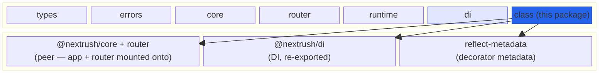
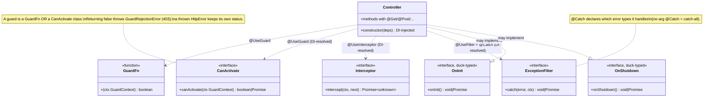
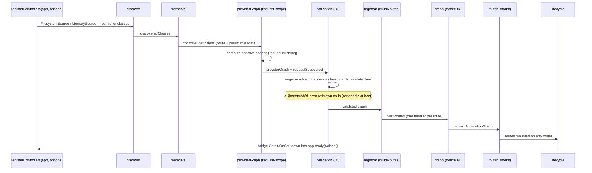
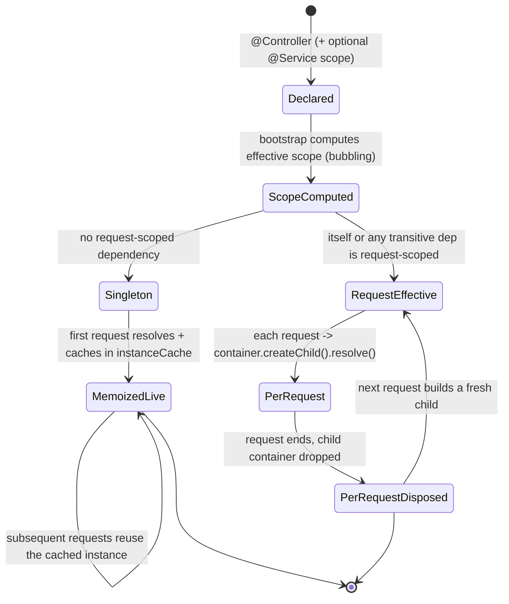

# @nextrush/class — Architecture

> Internal design of the unified class runtime: how decorators record metadata, how the bootstrap pipeline turns that metadata into an immutable route graph, how each request flows through guards -> controller resolution -> parameter binding -> the interceptor onion -> the handler -> exception filters, and how request scope bubbles through the dependency graph. Dependency-injection internals are **not** redefined here — this package re-exports [`@nextrush/di`](../di), whose `ARCHITECTURE.md` is the canonical home for DI-scope facts.

## At a glance

|  |  |
| --- | --- |
| **Package** | `@nextrush/class` |
| **Layer** | `class` (top of the core stack — above `di`, below adapters/middleware/apps) |
| **Depends on** | [`@nextrush/core`](../core) · [`@nextrush/router`](../router) (peer) · [`@nextrush/di`](../di) · [`@nextrush/errors`](../errors) · [`@nextrush/types`](../types) · `reflect-metadata` |
| **Depended on by** | [`nextrush`](../nextrush) (the `nextrush/class` subpath) and application code |
| **Public entry** | `src/index.ts` (barrel — exports only) |
| **Internal modules** | 57 files · 6,224 LOC · largest `discovery/discovery.ts` 281 LOC (under the 300 cap) |
| **On the request hot path?** | **Yes** — built route handlers run per request (guards -> params -> interceptors -> handler -> filters); **zero reflection** on the request path (metadata is read once at bootstrap) |
| **Runtime coupling** | Filesystem auto-discovery (`FilesystemSource`) and debug logging use Node APIs (`fs`, `process.stderr`); the decorator, DI, and request pipeline are runtime-agnostic |
| **State model** | App-scoped — an immutable route graph + a controller-instance cache built at bootstrap, plus per-request child containers for `request` scope |

## Responsibilities

**This package owns:**

- ✓ The **decorator surface** — `@Controller`, the route decorators (`@Get`/`@Post`/…), parameter decorators (`@Body`/`@Param`/`@Query`/`@Header`/`@Ctx`/`@Req`/`@Res` + `createCustomParamDecorator`), response decorators (`@HttpCode`/`@Redirect`/`@SetHeader`), and the cross-cutting decorators (`@UseGuard`/`@UseInterceptor`/`@UseFilter`/`@Catch`)
- ✓ **Metadata storage and reading** — writing decorator metadata via `reflect-metadata` and reading it back for registration, introspection, and renderers (e.g. OpenAPI)
- ✓ The **bootstrap pipeline** — discovery -> metadata extraction -> request-scope computation -> DI validation -> route building -> immutable graph -> router mount -> lifecycle bridging
- ✓ The **per-request handler pipeline** — running guards, resolving the controller, binding parameters, running the interceptor onion, invoking the method, applying response metadata, and wrapping the whole thing in exception filters
- ✓ **Request-scope bubbling** — computing each class's *effective* scope and choosing per-request-child vs memoized-singleton controller resolution
- ✓ The **`@Module` grouping model** and `registerModule` graph walk (provider registration + flattened controller registration)
- ✓ **Discovery** (`FilesystemSource` / `MemorySource`), **lifecycle bridging** (`OnInit`/`OnShutdown` into `app.ready()`/`app.close()`), and **opt-in diagnostics**
- ✓ The **class-runtime error hierarchy** (`ControllerResolutionError`, `GuardRejectionError`, `MissingParameterError`, …)

**This package does NOT own:**

- ✗ The **DI container, decorators, scopes, and resolution** — owned by [`@nextrush/di`](../di) and re-exported here; scope semantics are defined there, not redefined here
- ✗ The **`Application`, middleware composition, and `Context`** — owned by [`@nextrush/core`](../core); this package reads `app.router` / `app.container` and mounts routes
- ✗ **Route matching / the segment trie** — owned by [`@nextrush/router`](../router)
- ✗ The **HTTP error base classes** — owned by [`@nextrush/errors`](../errors); the class errors extend them
- ✗ **Serving / the runtime adapter** — owned by [`@nextrush/runtime`](../runtime) and the adapters

## Non-goals

The package intentionally does not:

- Replace the functional API — it is an additive authoring style on the same `Application`/router, not a fork
- Enforce **module encapsulation** — `@Module.exports` is recorded but not yet enforced; every provider is visible through the shared container (see RFC-NEXTRUSH-MODULES)
- Implement its own DI — it re-exports and drives [`@nextrush/di`](../di)
- Read decorator metadata **on the request path** — all reflection happens once at bootstrap
- Provide validation/serialization schemas — parameter `transform` is a hook, not a schema engine (use [`@nextrush/validation`](../middleware/validation))

## Constraints

Must remain:

- **Additive to the functional core** — never patch or fork `@nextrush/core`; only read `app.router` / `app.container` and register
- **Zero reflection on the request path** — metadata is baked into an immutable graph at bootstrap; requests execute pre-built handlers
- **Fail-loud at boot** — with `validate: true` (default) an unresolvable/circular controller or class guard throws at registration, not as a first-request 500
- **DI facts live in `@nextrush/di`** — this package re-exports and links, never redefines scope semantics
- **ESM-only**, public API sealed (ADR-0005)

## Position in the package hierarchy

`class` sits at the top of the core stack. It is the one core package that composes several lower layers — the router it mounts onto, the container it resolves from, the errors it extends, and the shared types — plus `reflect-metadata` for decorator metadata.



> [!IMPORTANT]
> Imports flow **downward only**. `@nextrush/class` imports from `core`, `router`, `di`, `errors`,
> and `types`, and MUST NOT be imported by any of them (project-rules §1). It sits at the top of the
> core stack precisely so it can compose all of them; adapters, middleware, and apps sit above it.

**Dependency rules:**
- **Allowed:** `class -> core / router / di / errors / types` · `class -> reflect-metadata`
- **Forbidden:** `class -> adapters / middleware / extensions / nextrush` (any higher layer)

---

## Overview

The package answers one question end to end: *given classes annotated with decorators, how do we turn them into mounted routes whose handlers run guards, inject parameters, invoke the method, and map errors — without reading a single piece of decorator metadata on the request path?* The single organizing idea is a **two-phase split**: a **bootstrap phase** reads all reflection once and bakes an immutable route graph, and a **request phase** executes pre-built handlers with zero reflection.

Decorators are deliberately inert. `@Controller`, `@Get`, `@Body`, `@UseGuard`, and the rest only write `reflect-metadata` onto the class or method (and `markInjectable` from [`@nextrush/di`](../di) so `@Controller` needs no `@Service`). Nothing executes until `registerControllers` (or `registerModule`) runs the bootstrap pipeline: it discovers controllers, extracts their metadata, computes each class's *effective* DI scope (request-scope bubbling), validates the DI graph, builds one handler per route, freezes an `ApplicationGraph`, mounts the routes on `app.router`, and bridges any `OnInit`/`OnShutdown` hooks into the app lifecycle.

At request time the built handler runs a fixed pipeline. Guards run first (per request, never hoisted); the controller is resolved (a memoized singleton by default, or from a fresh per-request child container when the controller is effectively request-scoped); parameters are bound from a plan computed at build time; the method is invoked through the interceptor onion when interceptors are declared; and response metadata (`@SetHeader`, `@HttpCode`, `@Redirect`) is applied. If the route declares exception filters, the whole handler is wrapped so a thrown error — from a guard, parameter binding, or the method — flows to the first matching `@Catch` filter, and an unmatched error propagates to the global error middleware.

### Design principles

1. **Decorators declare; the registrar builds.** Decorators only write metadata — no route exists until the bootstrap pipeline reads it (`decorators/*`, `bootstrap/pipeline.ts`).
2. **Read reflection once, at bootstrap.** The pipeline freezes an `ApplicationGraph` and the router registers from it; the request handler reads only baked route data (`bootstrap/graph.ts`, `runtime/handler.ts`).
3. **Additive, never a fork.** `registerControllers` reads `app.router` + `app.container` and registers — it patches nothing in `@nextrush/core` (`registrar/registrar.ts`).
4. **Fail at boot, not on the first request.** `validate: true` eagerly resolves every controller and class guard; a `@nextrush/di` error is rethrown as-is (`registrar/registrar.ts` `validateControllers`/`validateGuards`).
5. **Pay for request scope only when used.** A pure-singleton controller keeps the memoized fast path; request scope bubbles from a dependency and switches only that controller to per-request-child resolution (`request/scope.ts`, `runtime/handler.ts`).
6. **DI is re-exported, not reimplemented.** Scope semantics, the container, and resolution belong to [`@nextrush/di`](../di); this package drives them (`index.ts` re-exports).

---

## Module structure

```text
src/
├── index.ts            # Public API barrel (exports only); loads reflect-metadata
├── types.ts            # Type barrel re-exporting the per-concern type modules
├── errors.ts           # Class-runtime error hierarchy (extends @nextrush/errors)
├── path-utils.ts       # Path normalization for controller/route paths
├── decorators/         # @Controller, route decorators (@Get/…), @HttpCode/@Redirect/@SetHeader
├── binding/            # Parameter decorators (@Body/@Param/…), param plan + resolver, custom params
├── guards/             # @UseGuard, guard types (GuardFn/CanActivate), guard runner
├── interceptors/       # @UseInterceptor, interceptor contract, onion runner
├── filters/            # @Catch/@UseFilter, filter contract, filter runner (wrapWithFilters)
├── lifecycle/          # OnInit/OnShutdown duck-typed hooks + app-lifecycle bridge
├── modules/            # @Module, module graph walk, registerModule provider registration
├── request/            # Request-scope bubbling (scope.ts) + isolated-container graph (isolation.ts)
├── registrar/          # registerControllers, ControllerRegistry, buildRoutes, options types
├── discovery/          # DiscoverySource + FilesystemSource / MemorySource, filesystem scan
├── diagnostics/        # Opt-in diagnostics report + getClassDiagnostics
├── bootstrap/          # The bootstrap pipeline + its ordered stages + the immutable graph IR
├── metadata/           # Metadata key constants + readers (getControllerDefinition, …)
├── reflection/         # Centralized Reflect.* helpers (defineMetadata/getMetadata)
└── runtime/            # createRouteHandler — the per-request handler pipeline
```

### Module responsibilities

| Module | Responsibility (the one thing it owns) |
| ------ | -------------------------------------- |
| `decorators/` | Class/route/response decorators that record metadata (no behavior at decoration time). |
| `binding/` | Parameter decorators + the build-time param plan and its per-request resolver. |
| `guards/` · `interceptors/` · `filters/` | Each cross-cutting concern's decorator, contract type, and per-request runner. |
| `lifecycle/` | Duck-typed `OnInit`/`OnShutdown` detection and the bridge into `app.ready()`/`app.close()`. |
| `modules/` | `@Module` metadata, the import-graph walk, and provider registration for `registerModule`. |
| `request/` | Effective-scope computation (request-scope bubbling) and isolated-container graph registration. |
| `registrar/` | `registerControllers`, the registry, the route builder, options, and eager validation. |
| `discovery/` | The `DiscoverySource` abstraction and its filesystem/in-memory implementations. |
| `bootstrap/` | The ordered pipeline and the immutable `ApplicationGraph` the router mounts from. |
| `runtime/` | `createRouteHandler` — assembles and runs the per-request pipeline. |
| `metadata/` · `reflection/` | Metadata key constants + readers, and the single `Reflect.*` seam. |

## Component relationships

The extension contracts a controller opts into are small, DI-resolvable interfaces (or plain functions). This is what `@UseGuard` / `@UseInterceptor` / `@UseFilter` accept and what the runners resolve from the container:



A guard is either a `GuardFn` or a `CanActivate` class; interceptors and filters are always DI-resolved classes; and lifecycle hooks are duck-typed (a service opts in purely by declaring `onInit`/`onShutdown` — there is no decorator). Everything class-based here is resolved from the [`@nextrush/di`](../di) container, so guards, interceptors, and filters can inject their own dependencies.

---

## Lifecycle

### Bootstrap — decorators to mounted routes (execution)

`registerControllers` runs an ordered pipeline once; each stage populates a shared `BootstrapContext`. The router mounts from the frozen graph, so nothing reflective survives into the request path:



The ordering a reader would otherwise get wrong: **request-scope computation runs before validation and route building**, because whether a controller resolves per-request-child or as a memoized singleton is decided here and baked into its handler. And **the graph is frozen before the router stage** — the router registers from immutable, baked route data, which is what guarantees zero reflection at request time.

### Request — the per-route handler pipeline (execution)

Each mounted handler runs the same pipeline. When the route declares filters, the entire pipeline is wrapped so errors from any stage reach a matching `@Catch` filter:

```mermaid
sequenceDiagram
    participant Req as Request
    participant Filter as Exception filters (wrap)
    participant Guard as Guards
    participant DI as Container / child container
    participant Param as Param resolver
    participant Intc as Interceptor onion
    participant Method as Controller method
    participant Res as Response

    Req->>Filter: enter (only if @UseFilter present)
    Filter->>Guard: run guards (per request)
    alt a guard returns false / throws
        Guard-->>Filter: GuardRejectionError (403) or thrown HttpError
        Filter-->>Res: first matching @Catch handles, else rethrow
    else guards pass
        Guard->>DI: resolve controller
        Note over DI: memoized singleton (default) OR fresh per-request child (request-scoped)
        DI->>Param: controller instance
        Param->>Intc: bound args (from build-time plan)
        Intc->>Method: next() through the onion (outer=class, inner=method interceptors)
        Method-->>Intc: return value
        Intc->>Res: apply @SetHeader, @HttpCode, @Redirect; json/send result
    end
```

Guards run **before** controller resolution and are never hoisted out of the request. Interceptors wrap only the method call (the onion), so a guard rejection never reaches them, but a thrown error anywhere inside the wrapped handler still reaches the exception filters — which is why filters wrap the outermost layer.

### Controller resolution & request scope (state)

Whether a controller is memoized once or built fresh per request is decided at bootstrap by its *effective* scope, then applied on every request:



> [!NOTE]
> Request-scope bubbling is mandatory: a singleton controller that depends on a `request`-scoped
> service would otherwise cache one request's instances forever. The full scope-to-lifecycle mapping
> (`singleton`/`transient`/`request` -> `tsyringe` lifecycles, and the per-request child container)
> lives in [`@nextrush/di`](../di) — this package only decides *which* controllers become
> request-effective and drives the child-container resolution.

## State ownership

| Owner | State it owns | Scope |
| ----- | ------------- | ----- |
| `Application` (`@nextrush/core`) | extensions, `ready`/`running` flags, the router + container references | app |
| `ApplicationGraph` (frozen IR) | the immutable built-route data the router mounts from | app (built + frozen at bootstrap) |
| `instanceCache` (per registration) | memoized singleton controller instances | app |
| Root/`app` container ([`@nextrush/di`](../di)) | singleton service instances | app / process |
| Per-request child container | request-scoped controller + service instances | per request |
| Decorator metadata (`reflect-metadata`) | route/param/guard/filter/interceptor/module metadata on classes | per class, at definition time |
| Diagnostics `WeakMap` | the opt-in `DiagnosticsReport`, keyed by app | app (only when `diagnostics: true`) |

There is no cross-request shared mutable state except the intentionally-shared singletons and the immutable route graph; request-scoped instances live only as long as their child container.

## Data structures

```ts
// A route the registrar builds — a baked handler plus the data the router needs.
// No reflection is read from this on the request path; the handler is precompiled.
interface BuiltRoute {
  readonly method: string;              // GET/POST/...
  readonly path: string;                // full path incl. controller prefix
  readonly handler: RouteHandler;       // the per-request pipeline (createRouteHandler)
  readonly middleware: Middleware[];    // controller + route middleware
  readonly controller: Function;        // owning controller class
  readonly methodName: string;
  readonly metadata?: MetadataContribution; // @Controller tags / @Get description — for OpenAPI etc.
}

// Guard accepts either shape; the runner branches on isGuardClass().
type Guard = GuardFn | Constructor<CanActivate>;
```

The shape choices are deliberate: `BuiltRoute` carries a **fully built `handler`** rather than raw metadata, so the request path never touches `reflect-metadata`; and `Guard` is a **union of a function and a class constructor** so the same `@UseGuard` accepts a quick inline check or a DI-injected class, with the runner narrowing structurally.

## Performance characteristics

`class` is on the request hot path — it builds the handler every request runs — so its design is shaped around moving cost to bootstrap.

| Path | Complexity | Allocations | Notes |
| ---- | ---------- | ----------- | ----- |
| Bootstrap (per app) | O(routes + graph) | one-time | Discovery, metadata read, scope computation, validation, route build — all once. |
| Request, singleton controller | O(guards + params + interceptors) | none for resolution (memoized) | Default fast path; controller resolved once and cached. |
| Request, request-scoped controller | O(graph resolve) per request | one child container per request | Only for controllers whose graph declares `request` scope. |

**Memory model:**
- **Shared (one copy):** the frozen `ApplicationGraph`, the memoized singleton instances, and decorator metadata on classes.
- **Per request:** bound parameter args, and (only for request-effective controllers) a child container plus its request-scoped instances.

Metadata is read **zero times** on the request path — the key allocation/complexity guarantee, enforced by baking handlers at bootstrap.

## Concurrency & edge behaviour

- **Shared, immutable after bootstrap:** the `ApplicationGraph` and mounted routes. Node's single-threaded model means no locking is needed; the graph is deep-frozen once.
- **Per-request, isolated:** request-effective controllers resolve from a fresh child container per request; two requests never share their request-scoped instances.
- **Guard data flow:** the `GuardContext` handed to guards shares the **live** `ctx.state` (the supported channel to pass data forward), but `method`/`path`/`params`/`query`/`headers`/`body` are captured **by value** at guard time — a guard cannot mutate the real request through them.
- **Error propagation:** a guard that throws propagates its error unchanged (a typed `HttpError` keeps its status); a `false` return becomes `GuardRejectionError` (403). Errors are never swallowed or downgraded.
- **Filter fall-through:** an error no `@Catch` filter matches is rethrown so the global error middleware still runs — filter-free routes keep their original, unwrapped behavior.

> [!WARNING]
> `registerControllers` / `registerModule` must run **before** `serve()`/`listen()`/`ready()`. After
> the app is booted its configuration is frozen, and the lifecycle-hook bridge (`app.extend(...)`)
> throws with actionable guidance rather than silently skipping `onInit`/`onShutdown`.

## Trust boundaries

```text
decorated classes + registration options   (application code — trusted authoring surface)
   │  @Controller / @UseGuard / options.root ...
   ▼
registerControllers()  ── validates the graph (eager resolve) ──▶ ControllerResolutionError / DI errors at boot
   │
   ▼
per-request handler    ── guards run BEFORE the handler ──▶ GuardRejectionError (403) / thrown HttpError
   │                    ── @Body/@Param binding ──▶ MissingParameterError / ParameterInjectionError (400)
   ▼
controller method      (business logic — runs only after guards pass and params bind)
```

The class runtime treats **authorization as a pipeline stage that runs before business logic** (guards first, always per request) and **parameter presence/shape as a boundary** (missing/invalid params throw `400`s before the method runs). It does not itself parse or sanitize bodies — that is middleware ([`@nextrush/body-parser`](../middleware/body-parser), [`@nextrush/validation`](../middleware/validation)); it guards the *ordering* (auth before handler) and the *resolvability* of the controller graph.

> [!CAUTION]
> `options.root` auto-discovery dynamically `import()`s every matched file, running its top-level
> module code. Point `root` only at trusted source directories, and keep `include` scoped to the
> `*.controller.*` convention (the default) rather than scanning an entire tree of untrusted files.

## Extension points

**Supported extension points:**

- **Custom parameter decorators** — `createCustomParamDecorator(extractor, options?)` for app-specific injection (e.g. `@CurrentUser`).
- **Guards / interceptors / filters** — bring your own `GuardFn`/`CanActivate`, `Interceptor`, and `@Catch` `ExceptionFilter` classes; all are DI-resolved.
- **Discovery sources** — implement the `DiscoverySource` interface (or use `MemorySource`) to feed controllers from somewhere other than the filesystem.
- **Lifecycle hooks** — declare `onInit`/`onShutdown` on any DI-managed class to participate in app boot/shutdown.
- **Diagnostics** — `diagnostics: true` + `getClassDiagnostics(app)` for tooling.

**Forbidden (sealed):**

- **Reading decorator metadata on the request path** — reflection is a bootstrap-only concern; the request handler reads baked data.
- **Patching `@nextrush/core`** — the registrar composes the app additively; it never mutates core internals.
- **Redefining DI scope semantics** — scopes belong to [`@nextrush/di`](../di); this package only computes effective scope and drives the container.

---

## Architectural invariants

These are part of the package's architecture. They do not change without an RFC:

- **Decorators only record metadata** — no route or behavior exists until the bootstrap pipeline reads it.
- **Zero reflection on the request path** — metadata is read once at bootstrap and baked into an immutable, frozen `ApplicationGraph`.
- **`registerControllers` is additive** — it reads `app.router` / `app.container` and registers; it never forks or patches `@nextrush/core`.
- **Guards run before the handler, always per request** — authentication/authorization precede business logic and are never hoisted.
- **Errors are never swallowed** — a `false` guard is a 403, a thrown `HttpError` keeps its status, and an unmatched filtered error is rethrown to the global middleware.
- **Request scope bubbles** — a controller with any transitively request-scoped dependency resolves per request; pure-singleton graphs keep the memoized fast path.
- **DI is re-exported, not reimplemented** — scope-to-lifecycle mapping and the container live in [`@nextrush/di`](../di).
- **The public API is explicit and sealed** (ADR-0005); the package imports no higher layer.

## Engineering decisions

| Decision | Chosen | Trade-off accepted | Reference |
| -------- | ------ | ------------------ | --------- |
| Consolidation | Merge `@nextrush/decorators` + `@nextrush/controllers` into one `class` package | Two deprecated shims to maintain during migration | [RFC-NEXTRUSH-CLASS-CONSOLIDATION](https://github.com/0xTanzim/nextRush/tree/main/docs/RFC) |
| Registration style | A **registrar** function, not a plugin/extension | Caller must `await` it before `serve()` | `registrar/registrar.ts` |
| Reflection timing | Read metadata once at bootstrap; freeze an IR | Extra bootstrap work + a frozen graph to build | `bootstrap/graph.ts` · `runtime/handler.ts` |
| Boot-time validation | Eagerly resolve controllers + class guards (`validate: true`) | Slower boot; resolves the graph twice (boot + first request shares the cache) | `registrar/registrar.ts` |
| Request scope | Bubble effective scope; per-request child container only when needed | A scope computation pass at bootstrap | `request/scope.ts` · [RFC-NEXTRUSH-REQUEST-SCOPE](https://github.com/0xTanzim/nextRush/tree/main/docs/RFC) |
| Lifecycle hooks | Duck-typed `OnInit`/`OnShutdown`, no decorator | Detection by method presence rather than an explicit marker | `lifecycle/lifecycle-types.ts` |
| Modules | Group-only (`exports` recorded, not enforced) | No true encapsulation yet | [RFC-NEXTRUSH-MODULES](https://github.com/0xTanzim/nextRush/tree/main/docs/RFC) |

## Rejected alternatives

### A plugin/extension instead of a registrar
Rejected: modeling controller registration as a long-lived `app.extend(...)` extension would give it a boot/teardown lifecycle it does not need — registration is a one-shot, synchronous-to-author step. A plain awaited registrar that reads `app.router`/`app.container` is simpler, has no hidden lifecycle, and keeps the functional core unaware of classes. (The one lifecycle it *does* need — bridging `OnInit`/`OnShutdown` — is a small internal extension registered only when hooks exist.)

### Reading decorator metadata per request
Rejected: resolving route/param/guard metadata from `reflect-metadata` on every request would put reflection on the hot path and allocate per request. Baking an immutable `ApplicationGraph` at bootstrap moves all of that to startup, so the request path executes a precompiled handler — the difference between an O(1) baked lookup and repeated reflective reads under load.

### Reimplementing DI inside `class`
Rejected: the container, scopes, and resolution already exist in [`@nextrush/di`](../di). Reimplementing them here would duplicate the scope-to-lifecycle mapping and the circular-dependency detection, and split the DI contract across two packages. `class` re-exports `di` and drives it (computing effective scope, creating child containers), keeping one source of truth for DI.

---

## Testing strategy

- **Unit:** decorator metadata writes (routes, params, guards, filters, interceptors, `@Module`), path derivation, scope-bubbling computation, and error message shape.
- **Pipeline:** route building (`builder.*` tests), parameter resolution, guard/interceptor/filter execution order, response-metadata application, and request-scope resolution.
- **Integration:** `registerControllers` / `registerModule` end to end against a real `Application` + router, including isolate/container selection and eager-validation failure paths.
- **Characterization:** `characterization.test.ts` pins observable behavior across the consolidation.
- **Public surface:** `public-surface.test.ts` guards the sealed barrel (ADR-0005).
- **Cross-adapter parity:** N/A directly — the request pipeline is adapter-agnostic; adapter parity is proven in [`packages/adapters/conformance`](https://github.com/0xTanzim/nextRush/tree/main/packages/adapters/conformance).
- **Coverage:** ≥90% lines/functions (CI-enforced).

## Evolution strategy

- **Stable (semver-guarded):** the sealed public surface — the decorators, `registerControllers`/`registerModule`, the discovery sources, `getClassDiagnostics`, the metadata readers, the error classes, and the re-exported DI (ADR-0005).
- **May change without notice:** internal module layout, the bootstrap-stage internals, the `ApplicationGraph` IR shape, and the request-scope computation internals.
- **Changes only via RFC:** the two-phase bootstrap/request split, the "zero reflection on the request path" invariant, the guards-before-handler ordering, module semantics (`exports` enforcement), and any change that redefines DI scope in this package rather than `@nextrush/di`.

**Timeline:** `3.0` — decorators + controllers as separate packages (routes, params, guards, DI) -> `3.1` — consolidated into `@nextrush/class`, adding `@Module` + `registerModule`, request-scope bubbling, the immutable `ApplicationGraph`, discovery sources, and opt-in diagnostics -> future: enforced module encapsulation (RFC-NEXTRUSH-MODULES §5).

## Contributor notes

Before changing this package, read: [RFC-NEXTRUSH-CLASS-CONSOLIDATION, RFC-NEXTRUSH-MODULES, RFC-NEXTRUSH-REQUEST-SCOPE](https://github.com/0xTanzim/nextRush/tree/main/docs/RFC), [ADR-0005](https://github.com/0xTanzim/nextRush/blob/main/docs/adr/ADR-0005-package-tiers-sealed-surface-deprecation.md), and — for DI internals — [`@nextrush/di`'s `ARCHITECTURE.md`](../di/ARCHITECTURE.md). The two load-bearing files are `bootstrap/pipeline.ts` (stage ordering) and `runtime/handler.ts` (the per-request pipeline); `request/scope.ts` owns request-scope bubbling. When touching the pipeline order or scope computation, run `registrar.test.ts`, `request-scope.test.ts`, `isolation.test.ts`, and the guard/interceptor/filter suites; when touching the barrel, `public-surface.test.ts` guards the sealed surface.

## Architecture checklist

Before changing this package, confirm:

- [ ] Does this preserve the architectural invariants (especially "zero reflection on the request path" and "guards before the handler")?
- [ ] Does it keep registration additive — no patching of `@nextrush/core`?
- [ ] Does it keep DI scope semantics in `@nextrush/di` rather than redefining them here?
- [ ] Does it affect the request hot path (allocations / per-request work)?
- [ ] Does this change the sealed public API (semver / ADR-0005)? Does it need an RFC?

---

## References & see also

- **README (how to use it):** [`./README.md`](./README.md)
- **DI internals (re-exported, canonical DI-scope home):** [`@nextrush/di` — `ARCHITECTURE.md`](../di/ARCHITECTURE.md)
- **Application / middleware / Context:** [`@nextrush/core`](../core)
- **Routing (segment trie):** [`@nextrush/router`](../router)
- **Governing RFCs:** [`docs/RFC`](https://github.com/0xTanzim/nextRush/tree/main/docs/RFC) (class consolidation, modules, request scope)
- **ADR:** [`ADR-0005 — package tiers & sealed surface`](https://github.com/0xTanzim/nextRush/blob/main/docs/adr/ADR-0005-package-tiers-sealed-surface-deprecation.md)
