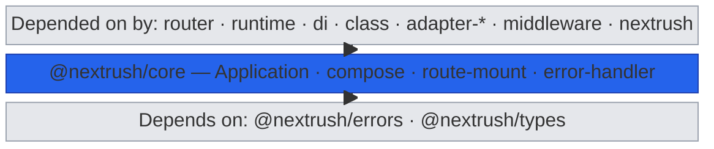
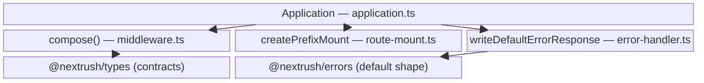
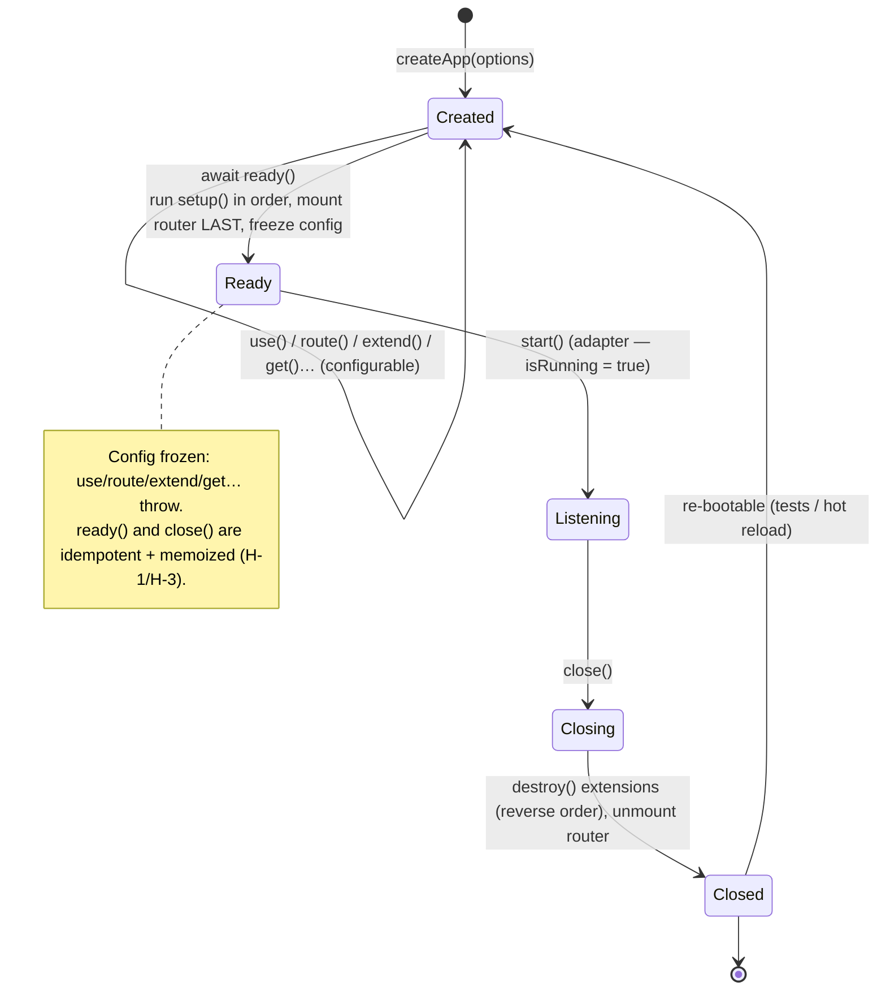
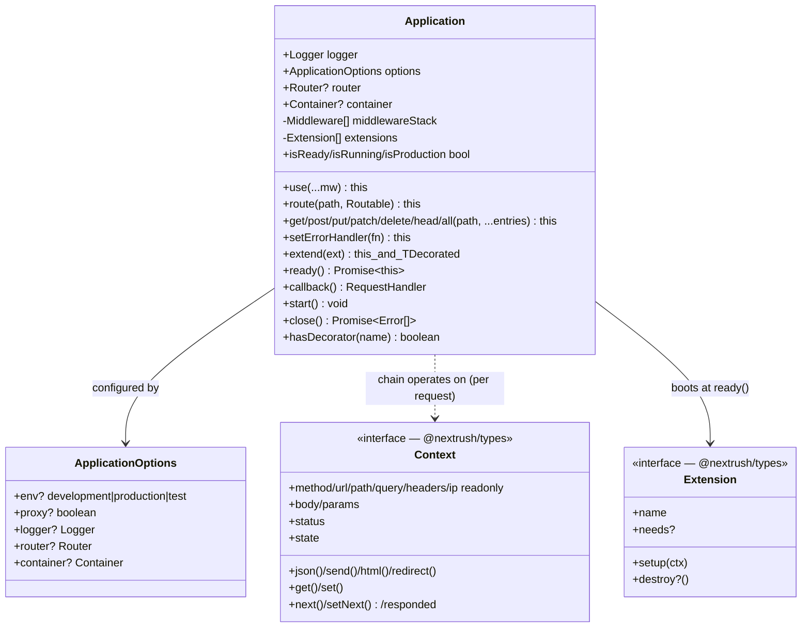

# @nextrush/core — Architecture

> Internal design of the `Application` object, the Koa-style `compose()` dispatcher and its fast paths, prefix-mounting, the extension boot/teardown lifecycle, and the default error path — how `@nextrush/core` turns a list of middleware into one request handler with a frozen-after-boot lifecycle.

## At a glance

|  |  |
| --- | --- |
| **Package** | `@nextrush/core` |
| **Layer** | `core` (above `errors`, below `router`) |
| **Depends on** | `@nextrush/errors` (default error serializer) · `@nextrush/types` (contracts, erased at build) — no third-party runtime deps |
| **Depended on by** | `@nextrush/router`, `@nextrush/runtime`, `@nextrush/class`, adapters, the `nextrush` meta package |
| **Public entry** | `src/index.ts` (barrel — exports only) |
| **Internal modules** | 6 files · 1,100 LOC · largest `application.ts` 676 LOC (above the 300 target — see Contributor notes) |
| **On the request hot path?** | **Yes** — `callback()` wraps every request; `compose()` dispatches it |
| **Runtime coupling** | None — Web-standard JavaScript only; no `node:*` / `process`. Dev warnings use `console` |
| **State model** | App-scoped: middleware stack + extensions + decorations, mutated at registration, frozen after `ready()`. Per-request state lives in `Context` (owned by adapters) |

## Responsibilities

**This package owns:**

- ✓ The **`Application` object** — middleware registration, router mounting, and the boot/serve/shutdown lifecycle
- ✓ **Middleware composition** — `compose()`, the Koa-style dispatcher with single-call `next()` semantics
- ✓ **Prefix mounting** — `app.route(prefix, router)`, rewriting `ctx.path` for a sub-router and restoring it
- ✓ The **extension lifecycle** — `extend()` queueing, `setup()` at `ready()`, `destroy()` at `close()`, decoration collision detection
- ✓ The **default error path** — catching a thrown error and serializing it through the `@nextrush/errors` contract
- ✓ **Config freezing** — making `use`/`route`/`extend`/route-shortcuts throw once the app has booted

**This package does NOT own:**

- ✗ **Route matching** — resolving `METHOD path` to a handler → [`@nextrush/router`](../router) (core only *mounts* a router)
- ✗ The **`Context` implementation** — the concrete request/response object is built by [`@nextrush/adapter-*`](../adapters); core only re-exports the `Context` *type* and operates on it
- ✗ The **HTTP server / socket lifecycle** and `listen()` → `@nextrush/adapter-*` / [`@nextrush/runtime`](../runtime)
- ✗ The **error type hierarchy** — `HttpError` / `NextRushError` live in [`@nextrush/errors`](../errors); core re-exports and reuses them

## Non-goals

The package intentionally does not:

- Match routes, parse request bodies, negotiate content, or manage sessions
- Create sockets, read `process.env`, or touch any runtime-specific API
- Provide a DI container of its own — it merely carries an optional `container` for extensions/registrars
- Auto-sort extensions by dependency — `needs` is *asserted* in registration order, never reordered

## Constraints

Must remain:

- **Runtime-independent** — no `node:*` / `process` / `Deno` / `Bun`; Web-standard JavaScript only, so every adapter behaves identically
- **Zero third-party dependency** — only `@nextrush/errors` + `@nextrush/types` (workspace)
- **ESM-only** — no CommonJS build
- **Public API sealed** — the exported surface is semver-guarded (ADR-0005)
- **≤1,500 LOC** for the package (per-package cap, architecture.instructions.md)

## Position in the package hierarchy

The layer stack, with `@nextrush/core` highlighted — imports flow **downward only**:



> [!NOTE]
> This is a `block-beta` diagram (not a flowchart) — it shows a fixed three-tier *position*, not a
> process. The arrows read "the tier above imports the tier below": consumers import `core`, and
> `core` imports `errors` + `types`.

> [!IMPORTANT]
> `@nextrush/core` imports from `@nextrush/errors` and `@nextrush/types` and MUST NOT be imported by
> them (project-rules §1). It sits low so every higher package — `router`, `runtime`, `class`,
> adapters, middleware — can build on the same `Application` and middleware contract.

**Dependency rules:**
- **Allowed:** `core → errors` · `core → types`
- **Forbidden:** `core → router / runtime / di / class / adapters / middleware` (any higher or sibling layer)

---

## Overview

`@nextrush/core` answers one question: *given a list of middleware and a lifecycle, how do you turn an incoming request into a response, exactly once, in order, without leaking errors?* The single organizing idea is that **an application is a middleware list plus a boot lifecycle** — everything else (routing, the server, the `Context` object) belongs to a neighbouring package, and core coordinates them.

Two components carry that idea. `compose()` (in `middleware.ts`) is the pure heart: it takes a `Middleware[]` and returns one `ComposedMiddleware` where each layer can `await ctx.next()` to run and then unwind around the layers after it — the Koa model. It has no lifecycle and no app knowledge, which is why it's independently usable and testable. `Application` (in `application.ts`) is the stateful shell around it: it accumulates middleware and extensions during a *configuration* phase, then `ready()` boots the extensions, mounts the app-owned router **last**, and freezes the config; `callback()` composes the snapshot and wraps it in the error path; `close()` tears extensions down in reverse.

The remaining modules are deliberately small and single-purpose: `route-mount.ts` builds the prefix-rewriting middleware that `app.route()` uses; `error-handler.ts` writes the default error response by delegating to `@nextrush/errors` so there is one error contract framework-wide; and `errors.ts` is a thin re-export of the common error classes for convenience.

### Design principles

1. **Composition is pure; the app is stateful.** `compose()` holds no lifecycle state, so it's reusable and unit-testable in isolation (`__tests__/middleware.test.ts`, `compose-ctx-next.test.ts`).
2. **Configure, then freeze.** `assertConfigurable()` throws if `use`/`route`/`extend`/route-shortcuts run after `ready()`/`start()`, so an app can't gain middleware or extensions that never boot.
3. **One error contract.** The default handler delegates to `@nextrush/errors` via `writeDefaultErrorResponse`, so core's default response is byte-identical to `errorHandler()` (audit C-1).
4. **The hot path allocates as little as possible.** Dedicated zero- and single-middleware fast paths avoid the recursive `dispatch` closure; the array is snapshotted at compose time (design D2/D3/D7).
5. **Boot and shutdown are idempotent and concurrency-safe.** `ready()` and `close()` memoize their in-flight promise, so racing callers share one boot/teardown (H-1/H-3).
6. **No runtime coupling.** Core reads no `process.env`; `warnDoubleResponse` is an explicit option the `Application` passes from its own `env`, never sniffed (audit C-4).

---

## Module structure

```text
src/
├── index.ts          # Public API barrel (exports only, no implementation)
├── application.ts    # Application class + createApp; middleware/route/extension registration, lifecycle, error dispatch
├── middleware.ts     # compose() + fast paths, isMiddleware, flattenMiddleware; ComposeOptions/ComposedMiddleware
├── route-mount.ts    # createPrefixMount — the prefix-rewriting mount middleware used by app.route()
├── error-handler.ts  # writeDefaultErrorResponse — default error serialization (delegates to @nextrush/errors)
└── errors.ts         # Convenience re-export of the common error classes from @nextrush/errors
```

### Module responsibilities

| Module | Responsibility (the one thing it owns) |
| ------ | -------------------------------------- |
| `application.ts` | The stateful shell: registration, the boot/serve/shutdown lifecycle, and error dispatch. |
| `middleware.ts` | The pure composer: order, single-call `next()`, and the zero/one/many fast paths. |
| `route-mount.ts` | Rewriting `ctx.path` under a prefix while a mounted sub-router runs, then restoring it. |
| `error-handler.ts` | Writing the one default error response, delegating serialization to `@nextrush/errors`. |
| `errors.ts` | Re-exporting the common error classes so app authors can import them from core. |

## Component relationships

How the `Application` shell delegates to the focused sibling modules and the two lower packages:



> [!NOTE]
> Also a `block-beta` diagram — it maps *which module owns what* and the two cross-package edges
> (`compose` reads the `Middleware`/`Context` contracts from `types`; the error handler serializes
> through `errors`). It is a structural map, not a control-flow chart.

---

## Lifecycle

### Request / execution lifecycle

How a request travels from the adapter to a handler and back, including the error path:

```mermaid
sequenceDiagram
    participant Adapter as adapter-* (builds Context)
    participant CB as app.callback()
    participant Chain as composed chain
    participant MW as middleware[i]
    participant Router as app-owned router (mounted last)
    participant EH as handleError

    Adapter->>CB: ctx  (Context built from the platform request)
    CB->>Chain: fn(ctx)  (compose() over the snapshot)
    Chain->>MW: mw(ctx, next)
    MW->>MW: await ctx.next()
    Note over Chain,MW: index-based dispatch;<br/>a second next() rejects: "next() called multiple times"
    Chain->>Router: router.routes()  (runs after all middleware)
    Router-->>Chain: handler writes response (ctx.json / send / html)
    alt a middleware or handler throws
        Chain-->>CB: rejected promise
        CB->>EH: handleError(err, ctx)
        EH->>EH: custom handler, else writeDefaultErrorResponse (@nextrush/errors shape)
    end
    CB-->>Adapter: Promise<void> resolves
```

The ordering a reader would otherwise get wrong: the app-owned router is mounted **last**, at `ready()`, so it runs *after* every user- and extension-registered middleware. `callback()` snapshots the middleware stack at call time, so you must `await ready()` before `callback()` for extension-registered middleware to be included (adapters do this). And errors are caught at the top of `callback()` — a throw anywhere in the chain unwinds to `handleError`, which never re-throws out of `callback()` (audit H-2).

### Application lifecycle (state)



`Created -> Ready -> Listening -> Closing -> Closed` is the full arc. The non-obvious parts: `ready()` is idempotent (a second call returns the same memoized boot), config freezes at `Ready` (not at `Listening`), and `close()` resets the decorations, extension registry, and boot/shutdown memos so the *same* instance can be booted again — which is what makes hot-reload and test re-use safe.

## State ownership

| Owner | State it owns | Scope |
| ----- | ------------- | ----- |
| `Application` | `middlewareStack`, `extensions`, `extensionNames`, `decorations`, `_errorHandler`, lifecycle flags (`_isReady`/`_isRunning`), boot/close memos | app — mutated at registration, frozen after `ready()` |
| `Application` (readonly) | `logger`, `options`, `router`, `container` | app — set at construction |
| `compose()` closure | per-invocation `index` / `called` guard | per request — never shared across requests |
| `Context` (owned by adapters) | request/response, `ctx.params`, `ctx.state`, `ctx.path` | per request |

There is no shared mutable *per-request* state inside core: the composed function keeps its call-guard state in a variable declared inside the returned function, so concurrent requests can't corrupt each other. All app-scoped state is frozen once `ready()` completes.

## Data structures

The relationship between the `Application` shell, its options, the `Context` it operates on, and the `Extension` it boots — the last two are contracts owned by `@nextrush/types`, not implemented here:



`Application` is the only class core implements; `Context` and `Extension` are `@nextrush/types` interfaces (drawn with `<<interface>>`) that core operates on but does not build. The dashed edge to `Context` is deliberate — core never constructs a `Context`; an adapter does, then hands it to `callback()`.

```ts
// The composed handler compose() returns — callable with a Context alone.
type ComposedMiddleware = (ctx: Context, next?: Next) => Promise<void>;

// Application options (application.ts). Every field is optional; env drives dev-only behaviour.
interface ApplicationOptions {
  env?: 'development' | 'production' | 'test'; // default 'development'
  proxy?: boolean;                             // default false — trust proxy headers only when true
  logger?: Logger;                             // default: silent no-op logger
  router?: Router;                             // the app-owned router app.get(...) delegates to
  container?: Container;                        // per-app DI container for extensions/registrars
}

// The extension contract core drives (defined in @nextrush/types).
interface Extension<TDecorated = Record<string, never>> {
  readonly name: string;                 // unique — collision-checked at extend()
  readonly needs?: readonly string[];    // asserted at ready() in registration order (no auto-sort)
  setup(ctx: ExtensionContext): void | Promise<void>; // runs once at ready()
  destroy?(): void | Promise<void>;      // runs at close() in reverse order
}
```

The shape choices are deliberate: `ComposedMiddleware` accepts an optional trailing `next` so a composed chain can itself be nested inside another chain; `ApplicationOptions` is all-optional so `createApp()` needs no arguments; and `Extension` carries a phantom `TDecorated` type parameter (never present at runtime) purely so `extend()` can return `this & TDecorated` and give `app.events`-style decorations static inference with no `declare module` augmentation.

## Performance characteristics

| Path | Complexity | Allocations | Notes |
| ---- | ---------- | ----------- | ----- |
| Compose, 0 middleware | O(1) | none | Returns a trivial pass-through thunk. |
| Compose, 1 middleware | O(1) | one guard var per request | Flat closure; skips the recursive `dispatch` (the common single-router case). |
| Compose, n middleware | O(n) over the chain | one `dispatch` per request | Index-based dispatch; array snapshotted once at compose time. |
| `callback()` per request | O(n) chain length | none beyond the chain | Snapshots the stack, wraps it in one try/catch. |
| `ready()` / `close()` | O(e) extensions | memoized promise | Runs each `setup()`/`destroy()` once, concurrency-guarded. |

**Memory model:**
- **Shared (one copy, app-scoped):** the middleware stack, the extension list, decorations, and the composed function built at `callback()`.
- **Per request:** whatever the middleware and handler allocate, plus the per-invocation `next()` guard — nothing else from core.

> [!NOTE]
> Point throughput numbers are intentionally omitted — the repo's published benchmarks are being
> re-measured on a hardened harness. Run [`apps/benchmark`](https://github.com/0xTanzim/nextRush/tree/main/apps/benchmark)
> for figures on your own hardware. Fast-path allocation behaviour is regression-tested by
> `__tests__/middleware-single-fastpath.test.ts` and its boundary/integration siblings.

## Concurrency & edge behaviour

- **Shared, immutable after startup:** the middleware stack, extension list, and decorations are mutated only during configuration; after `ready()` they are read-only, so concurrent requests read them without locks.
- **Per-request, never shared:** the `compose()` call-guard (`called` / `index`) is declared inside the returned function per invocation — two concurrent requests can't corrupt each other's `next()` state.
- **Idempotent boot/shutdown:** `ready()` and `close()` memoize their in-flight promise (`_readyPromise` / `_closePromise`), so two racing `await app.ready()` calls run `setup()` exactly once (H-1), and two signal handlers calling `close()` destroy each extension exactly once (H-3).
- **Error containment:** a throw in the chain is caught by `callback()`; a throwing custom error handler is logged and falls back; even the default handler's throw is swallowed-and-logged so the request settles instead of rejecting into the adapter (H-2).
- **`close()` failure isolation:** extensions are destroyed with `Promise.allSettled`, so one failing `destroy()` never strands the others; failures are returned as an `Error[]`.

> [!WARNING]
> `callback()` snapshots the middleware stack at call time. Calling `callback()` before `await
> app.ready()` when extensions are registered means their `setup()` never ran and anything they
> would decorate (e.g. `app.events`) is missing — core logs a warning, but adapters avoid this by
> calling `ready()` first. Do not mutate registration after boot; the config is frozen for this reason.

## Trust boundaries

```text
adapter builds Context from an untrusted platform request
   │
   ▼
compose() runs middleware in order  ── auth/validation middleware runs BEFORE the handler
   │                                    (ordering is the app author's responsibility)
   ▼
handler                                ← core relies on upstream middleware for the boundary
   │
   ▼
a thrown error ── handleError ── writeDefaultErrorResponse ── expose gate (5xx internals hidden)
```

Core does not itself validate request input — it provides the *ordering guarantee* that makes a security boundary possible: middleware runs in registration order, so authentication/validation registered before the handler runs first. The one boundary core enforces directly is on the **error path**: `writeDefaultErrorResponse` delegates to `@nextrush/errors`, so a non-exposed `5xx`'s internal message and stack never reach the client (they go to the logger instead).

## Extension points

**Supported extension points:**

- **Middleware** (`app.use`) — the primary seam; ~99% of capability is added here.
- **Extensions** (`app.extend`) — the rare (~0.1%) long-lived, app-scoped service with a `setup()`/`destroy()` lifecycle; `ctx.decorate(name, value)` is the sanctioned way to expose app-level surface.
- **Custom error handler** (`app.setErrorHandler`) — replace the default serialization wholesale.
- **`compose()`** — reusable on its own to build sub-pipelines or a custom runtime.

**Forbidden (sealed):**

- **A public `app.decorate()`** — decoration is intentionally extension-only, invoked through `ExtensionContext.decorate` (RFC §6.1); there is no public app-level decorate.
- **An `app.options()` verb** — deliberately absent (it would collide with the `app.options` config property); register OPTIONS via `app.all()` or CORS middleware.
- **The `compose()` dispatch internals** — the fast-path structure and guard placement are tuned; not an extension surface.

---

## Architectural invariants

These are part of the package's architecture. They do not change without an RFC:

- **`compose()` runs each middleware in registration order** and each layer may wrap the next via `await ctx.next()`.
- **`next()` may be called at most once per dispatch** — a second call rejects with `next() called multiple times`, on both the fast and general paths (the message is defined once so they can't drift).
- **The app-owned router is mounted last, at `ready()`** — routes run after all middleware.
- **Configuration is frozen after `ready()`/`start()`** — `use`/`route`/`extend`/route-shortcuts throw.
- **`ready()` and `close()` are idempotent and memoized** — concurrent callers share one boot/teardown.
- **Extensions boot in registration order and tear down in reverse** — `needs` is asserted, never auto-sorted.
- **The default error response matches `@nextrush/errors`' `errorHandler()`** — one error contract framework-wide.
- **Core imports no runtime API** — Web-standard JavaScript only, so every adapter behaves identically.

## Engineering decisions

| Decision | Chosen | Trade-off accepted | Reference |
| -------- | ------ | ------------------ | --------- |
| Composition model | Koa-style `compose()` with `ctx.next()` | Middleware must `await next()` correctly; a double-call must be guarded | `middleware.ts` (design D4) |
| Compose fast paths | Dedicated 0- and 1-middleware paths | Two extra code paths to keep semantically identical to the general one | `middleware.ts` (design D2/D3/D7) |
| Router injection | App is router-agnostic; router passed via options | `@nextrush/core`'s `createApp` needs an explicit router; the `nextrush` one injects it | `application.ts` |
| Config freezing | Throw on mutation after `ready()`/`start()` | Slightly stricter API; late registration is an error, not a silent no-op | `application.ts` `assertConfigurable` |
| Default error path | Delegate to `@nextrush/errors` serializer | Core depends on `errors` (one layer down) | `error-handler.ts` (audit C-1) |
| Boot/shutdown | Memoized in-flight promises | Extra promise fields; re-boot requires resetting the memos | `application.ts` (H-1/H-3) |
| Decoration | Extension-only, no public `app.decorate()` | App authors can't decorate directly; must go through an extension | `application.ts` (RFC §6.1) |

## Rejected alternatives

### A public `app.decorate(name, value)`
Rejected: exposing decoration on the app would let application code attach app-level state outside the extension lifecycle, bypassing collision detection and the boot ordering. Keeping `decorate` behind `ExtensionContext` means every decoration is owned by a named extension with a `destroy()`.

### Reading `process.env` inside `compose()` to toggle warnings
Rejected: core must stay runtime-independent (no `process`). Instead, `warnDoubleResponse` is an explicit `ComposeOptions` field the `Application` sets from its own `env`, so the composer never sniffs the environment (audit C-4).

### An `app.options()` route verb
Rejected: it would collide with the `app.options` configuration property. OPTIONS routes are registered via `app.all()`, the router directly, or handled by CORS preflight middleware.

### Rebuilding the middleware chain per request
Rejected: composing on every request would allocate the dispatch closure and re-validate the array on the hot path. `callback()` composes once over a snapshot, and the single-middleware fast path avoids even the recursive closure.

---

## Testing strategy

- **Unit:** `compose()` ordering and unwinding, single-call `next()` rejection, the 0/1/n fast paths (`middleware.test.ts`, `middleware-single-fastpath.test.ts`, `compose-ctx-next.test.ts`), prefix mounting (`route.test.ts`).
- **Lifecycle:** `application.test.ts` — registration, config-freeze-after-`ready()`, extension boot order, `needs` assertion, idempotent `ready()`/`close()`, reverse-order teardown, decoration collision.
- **Hardening / audit:** `core-hardening.test.ts` and `audit-fixes.test.ts` cover the H-1/H-2/H-3 concurrency guards and the C-1 default-error-shape parity with `@nextrush/errors`.
- **Public surface:** `public-surface.test.ts` locks the sealed export set (ADR-0005).
- **Cross-adapter parity:** N/A directly — core uses no runtime API; adapter parity is proven in `packages/adapters/conformance`.
- **Coverage:** ≥90% lines/functions (CI-enforced).

## Evolution strategy

- **Stable (semver-guarded):** the sealed public surface — `createApp`, the `Application` methods, `compose`, `isMiddleware`, `flattenMiddleware`, and the re-exported contracts/error classes (ADR-0005).
- **May change without notice:** internal module layout, the `compose()` fast-path structure, private lifecycle fields, and the exact dev-warning text (beyond the asserted `next() called multiple times` message).
- **Changes only via RFC:** the composition model, the freeze-after-boot rule, the extension lifecycle contract, and the default-error-shape parity with `@nextrush/errors`.

**Timeline:** `3.0` — `Application`, `compose()`, prefix mounting, the extension model → `3.1` — audit hardening: memoized idempotent `ready()`/`close()` (H-1/H-3), swallow-and-log default-handler safety (H-2), `@nextrush/errors` default-shape parity (C-1), the single-middleware fast path, extracted `route-mount`/`error-handler` modules (C-5).

## Contributor notes

Before changing this package, read: the [extension-model RFC](https://github.com/0xTanzim/nextRush/tree/main/docs/RFC/class-runtime), [ADR-0005 (package tiers & sealed surface)](https://github.com/0xTanzim/nextRush/blob/main/docs/adr/ADR-0005-package-tiers-sealed-surface-deprecation.md), the `middleware.ts` fast-path invariants, and the `application.ts` lifecycle guards. `application.ts` (676 LOC) sits above the 300-LOC file target: it concentrates the lifecycle state machine and its concurrency guards, which the invariants depend on being read together — the sanctioned split, if it grows, is to extract registration or the extension boot sequence into a sibling module (as `route-mount.ts` and `error-handler.ts` already were), not to scatter the guards. Anything touching `compose()` must keep the single-middleware fast path semantically identical to the general dispatcher and its allocation tests green.

## Architecture checklist

Before changing this package, confirm:

- [ ] Does this preserve the architectural invariants above (compose ordering, single-call `next()`, freeze-after-boot, router-mounted-last)?
- [ ] Does the change keep core runtime-independent (no `node:*` / `process`)?
- [ ] Does it affect the hot path (`compose` / `callback`) — allocations or fast-path parity? Do the fast-path tests still pass?
- [ ] Does it increase coupling or cross a dependency rule (`core → errors / types` only)?
- [ ] Does this change the sealed public API (semver / ADR-0005)? Does it need an RFC?

---

## References & see also

- **README (how to use it):** [`./README.md`](./README.md)
- **Governing RFC(s):** [extension / plugin model](https://github.com/0xTanzim/nextRush/tree/main/docs/RFC/class-runtime)
- **ADR:** [`ADR-0005 — package tiers & sealed surface`](https://github.com/0xTanzim/nextRush/blob/main/docs/adr/ADR-0005-package-tiers-sealed-surface-deprecation.md)
- **Sibling packages:** [`@nextrush/errors`](../errors) · [`@nextrush/router`](../router) · [`@nextrush/types`](../types) · [`@nextrush/runtime`](../runtime)
- **Benchmarks:** [`apps/benchmark`](https://github.com/0xTanzim/nextRush/tree/main/apps/benchmark)
