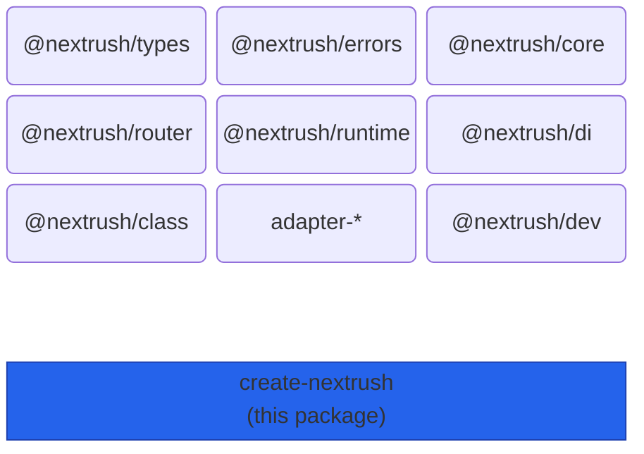
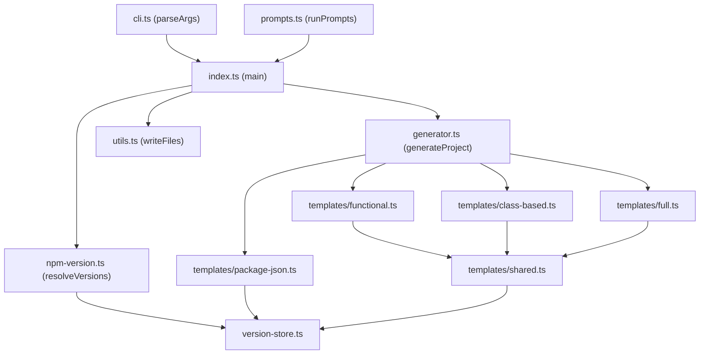
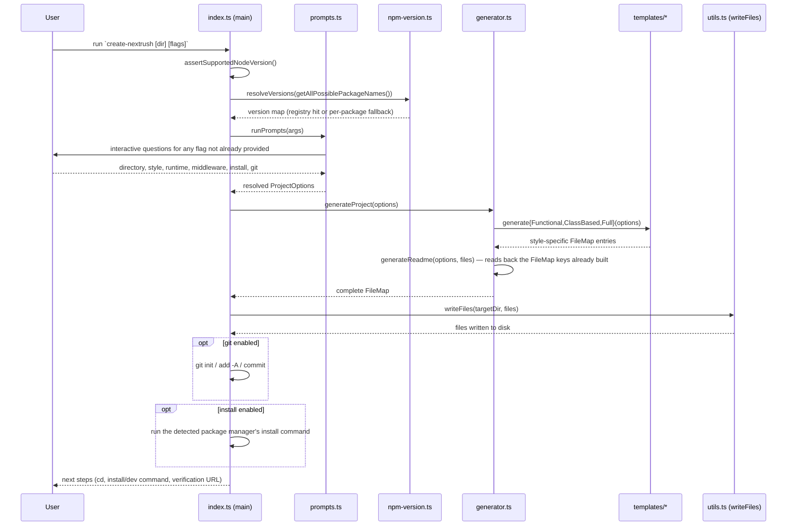

# create-nextrush — Architecture

> The scaffolder's internal design: a pure file-generation pipeline (prompts/flags to
> `ProjectOptions` to an in-memory `FileMap`) wrapped in a thin, isolated I/O shell.

## At a glance

|  |  |
| --- | --- |
| **Package** | `create-nextrush` |
| **Layer** | Tooling (standalone CLI, not part of the runtime package graph) |
| **Depends on** | `@clack/prompts` (interactive prompts) — no other runtime dependency |
| **Depended on by** | Nothing in the framework — it is an entry point, not a library other packages import |
| **Public entry** | `bin/create-nextrush.js` (imports `dist/index.js`); `src/index.ts` is also a library-shaped export for tests |
| **Internal modules** | 8 `src/*.ts` files + 7 `src/templates/*.ts` files, largest (`full.ts`) ~150 LOC |
| **On the request hot path?** | No — this is a one-shot CLI, not a running server |
| **Runtime coupling** | Node-only by design — uses `node:child_process`, `node:fs`, `node:path` directly; it scaffolds projects that target other runtimes, but the CLI itself only runs on Node |
| **State model** | Stateless across runs; one module-level `version-store.ts` map, set once per process at startup |

## Responsibilities

**This package owns:**
- ✓ Parsing CLI flags and running the interactive prompt flow
- ✓ Resolving each emitted `@nextrush/*` package's version independently against the npm registry
- ✓ Generating the in-memory file tree for the three project styles (`functional`, `class-based`, `full`)
- ✓ Writing that file tree to disk, then optionally running `git init`/commit and a package-manager install

**This package does NOT own:**
- ✗ The framework runtime itself — owned by `nextrush` and the packages it re-exports
- ✗ The dev server / build toolchain the generated project uses at `nextrush dev` / `nextrush build` — owned by [`@nextrush/dev`](../dev)
- ✗ Cross-runtime adapter behavior — owned by `@nextrush/adapter-{bun,deno}`; this package only emits the correct import and dependency for the chosen runtime

## Non-goals

- Templating with a placeholder-substitution engine (Handlebars/EJS/etc.) — every generated
  file is a plain TypeScript template-literal function, so its output is type-checkable and
  testable like any other function
- Supporting arbitrary custom templates or a plugin system for new styles — the three styles
  are a fixed, curated set
- Watching or re-scaffolding an existing project — this is a one-shot generator, not a codemod

## Constraints

Must remain:
- **A pure generator up to the write boundary** — `generateProject()` takes a `ProjectOptions`
  value and returns a `FileMap`, with zero I/O, so every style/runtime/middleware combination
  is testable without touching a real filesystem
- **Per-package version resolution** — every emitted dependency resolves against its own
  registry entry (or its own fallback), never proxied through another package's version
- **Node-only** — the CLI's own execution environment is Node `>=22`, enforced at startup
  before anything else runs

## Position in the package hierarchy



> [!IMPORTANT]
> `create-nextrush` sits outside the runtime dependency graph entirely — it does not import
> any `@nextrush/*` package. It only *writes* a `package.json` that depends on them. Nothing
> in the framework imports `create-nextrush` back.

**Dependency rules:**
- **Allowed:** `create-nextrush → @clack/prompts` (its only runtime dependency)
- **Forbidden:** any `@nextrush/*` package importing `create-nextrush`

---

## Overview

`create-nextrush` is a small, deliberately non-magical scaffolder. Its entire job is to turn
four resolved answers — directory, style, runtime, middleware preset — into a set of files on
disk that compile and run without further editing. The organizing idea is a strict split
between **decision** (prompts/flags, network version probing) and **generation** (pure
functions producing strings), with disk I/O confined to the single `writeFiles()` call at the
end of `main()` in `src/index.ts`.

Three style templates (`templates/functional.ts`, `templates/class-based.ts`,
`templates/full.ts`) each export one `generate<Style>()` function that returns a `FileMap`
(`Map<string, string>` of relative path to file content). `templates/shared.ts` and
`templates/package-json.ts` hold everything common across styles: the runtime-specific import
lines, the port declaration, `tsconfig.json`/`package.json` generation, and — notably — the
per-project `README.md`, which is generated *last*, after the style's files are known, by
reading the actual keys of the `FileMap` rather than a hardcoded listing. This is why the
generated project's own README can never claim a file that was not actually written.

### Design principles

1. **Generation is pure; I/O is isolated.** `generateProject()` in `src/generator.ts` performs
   no disk or network access — enforced by its own doc comment and exercised directly in
   `src/__tests__/generator.test.ts` without touching a real directory.
2. **Every dependency resolves independently.** `version-store.ts`'s `getPackageRange()`
   throws if a template asks for a package that was never included in the startup
   `resolveVersions()` call — a missing fallback fails loudly at generation time, not silently
   with a wrong version.
3. **The generated README is derived, not authored.** `generateReadme()` in
   `templates/shared.ts` takes the already-built `FileMap` and renders its `src/` keys
   directly into the "Project Structure" section — the same mechanism this document's own
   generated-tree claims below were verified against.

---

## Module structure

```text
src/
├── index.ts             # main(): CLI entry — orchestrates prompts, generation, write, git, install
├── cli.ts               # parseArgs() / printHelp() — flag parsing, no prompt logic
├── prompts.ts           # runPrompts() — interactive @clack/prompts flow, merges with CLI flags
├── generator.ts         # generateProject() — pure FileMap builder, dispatches to a style template
├── types.ts             # Style / Runtime / MiddlewarePreset / ProjectOptions / FileMap types
├── constants.ts         # STYLES/RUNTIMES/MIDDLEWARE_PRESETS, defaults, middleware import/setup tables
├── utils.ts             # writeFiles(), package-manager/name helpers, project-name validation
├── npm-version.ts        # resolveVersions() — per-package npm registry probe with fallback
├── version-store.ts      # module-level version map; getPackageRange() read by every template
└── templates/
    ├── index.ts          # barrel — re-exports every generate*() function
    ├── shared.ts          # runtime import/port helpers, generateReadme(), .gitignore, env.d.ts
    ├── package-json.ts    # getDependencies(), getRuntimeScripts(), getPackageMetadata()
    ├── tsconfig.ts         # generateTsconfig()
    ├── functional.ts       # generateFunctional() — the `functional` style's files
    ├── class-based.ts      # generateClassBased() — the `class-based` style's files
    └── full.ts             # generateFull() — the `full` style's files
```

### Module responsibilities

| Module | Responsibility (the one thing it owns) |
| ------ | -------------------------------------- |
| `index.ts` | Process orchestration: Node-version check, prompt/flag resolution, write, git, install, next-steps |
| `cli.ts` | Turning `process.argv` into a `ParsedArgs` — no side effects, no prompt UI |
| `prompts.ts` | Merging CLI flags with `@clack/prompts` answers into a final `ProjectOptions` |
| `generator.ts` | Dispatching a resolved `ProjectOptions` to the right style template and assembling the shared files |
| `npm-version.ts` | Probing the npm registry per package, with a per-package build-time fallback |
| `version-store.ts` | Holding the resolved version map so templates can read a range without threading it as a parameter |
| `templates/shared.ts` | Everything every style needs: runtime imports, port line, README, `.gitignore`, `env.d.ts` |
| `templates/{functional,class-based,full}.ts` | One style's own entrypoint + source files |

## Component relationships



---

## Lifecycle

The full scaffold-generation flow, from process start to the printed next steps:



The version probe (`resolveVersions`) always runs before prompts, using every package name any
style/runtime/middleware combination could possibly need — the answers that narrow that set
down are not yet known at that point, so the CLI resolves the full superset up front rather
than probing again after the user's choices are in.

## State ownership

| Owner | State it owns | Scope |
| ----- | ------------- | ----- |
| `version-store.ts` | The resolved `Map<string, string>` of package name to version range | Process-lifetime, set once by `setVersionMap()` at startup |
| `generator.ts` | The in-memory `FileMap` for one scaffold run | Local to one `generateProject()` call |
| The generated project's own files | Everything under the target directory | Owned by the user after the CLI exits — the CLI never revisits it |

---

## Data structures

```ts
// The load-bearing pipeline type — a plain Map, not a custom tree structure, because every
// consumer (writeFiles, generateReadme's file-tree renderer) only needs path -> content pairs
// and iteration order, both of which Map already gives for free.
export type FileMap = Map<string, string>;

export interface ProjectOptions {
  readonly name: string;
  readonly directory: string;
  readonly style: 'functional' | 'class-based' | 'full';
  readonly runtime: 'node' | 'bun' | 'deno';
  readonly middleware: 'minimal' | 'api' | 'full';
  readonly packageManager: 'pnpm' | 'npm' | 'yarn' | 'bun';
  readonly git: boolean;
  readonly install: boolean;
}
```

### Generated file trees (verified against the real template source, not assumed)

**`functional`** (`templates/functional.ts`):

```text
src/
├── index.ts
└── routes/
    ├── health.ts
    ├── health-status.ts
    └── __tests__/
        └── health-status.test.ts
```

**`class-based`** (`templates/class-based.ts`):

```text
src/
├── index.ts
├── controllers/
│   └── health.controller.ts
└── services/
    ├── app.service.ts
    └── __tests__/
        └── app.service.test.ts
```

**`full`** (`templates/full.ts`):

```text
src/
├── index.ts
├── routes/
│   └── health.ts
├── controllers/
│   └── hello.controller.ts
├── services/
│   ├── hello.service.ts
│   └── __tests__/
│       └── hello.service.test.ts
└── middleware/
    └── error-handler.ts
```

All three styles additionally get `tsconfig.json`, `package.json`, `src/env.d.ts`,
`.gitignore`, and `README.md` from `generator.ts`'s shared step. No style emits a
`not-found.ts` or any other 404-handler file — there is no such generator function in
`templates/`. The health payload built by `functional`'s `health-status.ts` and
`class-based`'s `app.service.ts` both include a real `uptime: process.uptime()` field
alongside `status` and `timestamp` — confirmed directly in `templates/functional.ts` and
`templates/class-based.ts`.

## Performance characteristics

Not applicable — this package has no hot path. It runs once per scaffold invocation and exits.

## Concurrency & edge behaviour

- **Shared, immutable after startup:** the resolved version map (`version-store.ts`), read by
  every template during one `generateProject()` call
- **Per-run, never shared:** the `FileMap` built by `generateProject()` — a fresh `Map` every
  invocation
- **Abort / disconnect / timeout:** each npm registry probe in `resolveVersions()` is bounded
  by a 5-second `AbortSignal.timeout()`; a timed-out or failing probe falls back to that
  package's own build-time version, it never blocks the whole batch or throws for one bad probe

> [!WARNING]
> `getPackageRange()` in `version-store.ts` throws if a template requests a package name that
> was not included in the startup `resolveVersions()` call. Adding a new `@nextrush/*`
> dependency to a template requires adding its name to `getAllPossiblePackageNames()` in
> `templates/package-json.ts` in the same change, or generation fails for that style.

## Trust boundaries

```text
User input (CLI flags, prompt answers, target directory) ──▶ validateProjectName() / isValidStyle() etc. ──▶ generateProject()
                                                                        ▲
                                                                        └─ the boundary this package enforces
```

Flag values are validated against fixed allow-lists (`STYLES`, `RUNTIMES`,
`MIDDLEWARE_PRESETS`, `PACKAGE_NAME_REGEX`) before they reach any template — an invalid style
or runtime flag is silently ignored rather than passed through, and an invalid project name
cancels the run with an explicit error. Shell commands (`git`, the package manager) are run
via `execFileSync` with an argv array, never a concatenated shell string, so a project
directory or name cannot inject additional shell arguments.

## Extension points

**Supported extension points:**
- A new middleware preset or its package list — add to `MIDDLEWARE_PRESETS` and
  `MIDDLEWARE_PACKAGE_NAMES` in `constants.ts`
- A new package manager — extend the `PackageManager` union and the `getInstallArgv()` /
  `getRunCommand()` switch statements in `utils.ts`

**Forbidden (sealed):**
- Adding I/O inside `generateProject()` or any `templates/*` function — the pure-generator
  guarantee (Design principle 1) is what makes every style directly unit-testable
- Hardcoding a generated project's file list anywhere outside `generateReadme()`'s
  `FileMap`-driven renderer — that duplication is exactly what caused this package's own
  README to previously drift from what the generator emitted

---

## Architectural invariants

The following are part of the package architecture. They do not change without an RFC:

- `generateProject()` and every `templates/*` `generate*()` function perform no disk or
  network I/O — all I/O is confined to `writeFiles()`, `git`, and the install step in
  `index.ts`'s `main()`.
- Every emitted `@nextrush/*` (or `nextrush`) dependency version is resolved from its own
  registry entry or its own fallback — never proxied through another package's version.
- The generated project's `README.md` "Project Structure" listing is rendered from the actual
  `FileMap` the generator built, not a separately maintained string.
- Shell commands (`git`, package-manager install) run through `execFileSync` with an argv
  array — never through a shell string built by concatenation.

## Engineering decisions

| Decision | Chosen | Trade-off accepted | Reference |
| -------- | ------ | ------------------- | --------- |
| Version resolution | Live npm registry probe per package, with a build-time fallback | Every scaffold does a network round-trip (bounded to 5s per package) unless offline, in which case it falls back to potentially-stale pinned versions | `src/npm-version.ts` |
| README generation | Derive the file tree from the real `FileMap` instead of a hand-written listing | Slightly more indirection in `generateReadme()`'s signature (it takes the whole `FileMap`) | `templates/shared.ts` |
| Deno script routing | Route `dev`/`build` through `nextrush dev`/`nextrush build` under `deno run`, not a raw `deno run` on the entry file | Requires an explicit, longer permission flag list in the generated `package.json` scripts | `templates/package-json.ts` (`getRuntimeScripts`) |

## Rejected alternatives

### A template-substitution engine ({{ }} placeholders)
Rejected in favor of plain TypeScript functions returning strings. A placeholder engine adds a
second syntax to learn and cannot be type-checked or unit-tested the way a function that
returns a string literal can.

### A single "everything" style instead of three curated styles
Rejected — collapsing functional and class-based into one default would force every new
project to carry decorator/DI machinery even for a small route-only API, and force a router-
only project to skip the class-based path entirely for anyone who wanted it.

---

## Testing strategy

- **Unit:** `src/__tests__/generator.test.ts`, `templates/*` behavior — asserts on the exact
  `FileMap` keys/content each style produces
- **Integration:** `src/__tests__/integration.test.ts`, `cli.test.ts`, `bin-entry.test.ts` —
  exercise the CLI's argument parsing and entry point together
- **Invariant tests:** `generated-readme-structure.test.ts` (README matches the real tree),
  `generated-package-metadata.test.ts`, `generated-tsconfig-isolation.test.ts`,
  `generated-toolchain-versions.test.ts`
- **Conformance / cross-adapter parity:** N/A — this package does not touch
  `packages/adapters/conformance`; `cross-runtime-parity-smoke.test.ts`,
  `bun-runtime-config.test.ts`, and `deno-runtime-smoke.test.ts` cover this package's own
  per-runtime scaffold output instead
- **Benchmark / regression:** N/A — no hot path
- **Coverage:** >=90% lines/functions (CI-enforced)

## Evolution strategy

- **Stable (semver-guarded):** the CLI flag surface (`--style`, `--runtime`, `--middleware`,
  `--pm`, `--install`/`--no-install`, `--git`/`--no-git`, `--yes`)
- **May change without notice:** the internal module layout under `src/templates/`, the exact
  generated file content within a style (as long as it keeps compiling and passing its
  generated test)
- **Changes only via RFC:** adding or removing one of the three project styles; the
  pure-generator / isolated-I/O split described above

## Contributor notes

Before changing this package, read the generated-output invariant tests listed under Testing
strategy above — they are the executable specification for what each style must emit, and any
change to a template's file list or content must keep them green or update them deliberately,
never silently.

## Architecture checklist

Before changing this package, confirm:
- [ ] Does this preserve the pure-generator / isolated-I/O split?
- [ ] Does a new dependency get added to `getAllPossiblePackageNames()` if a template needs it?
- [ ] Does this change what a generated project's own README claims about its file tree?
- [ ] Does this change the CLI flag surface (a public, semver-guarded contract)?
- [ ] Does it need an RFC?

---

## References & see also

- **README (how to use it):** [`./README.md`](./README.md)
- **ADR(s):** [ADR-0005 — package tiers & sealed-surface deprecation](../../docs/adr/ADR-0005-package-tiers-sealed-surface-deprecation.md)
- **Benchmarks:** N/A — no hot path
