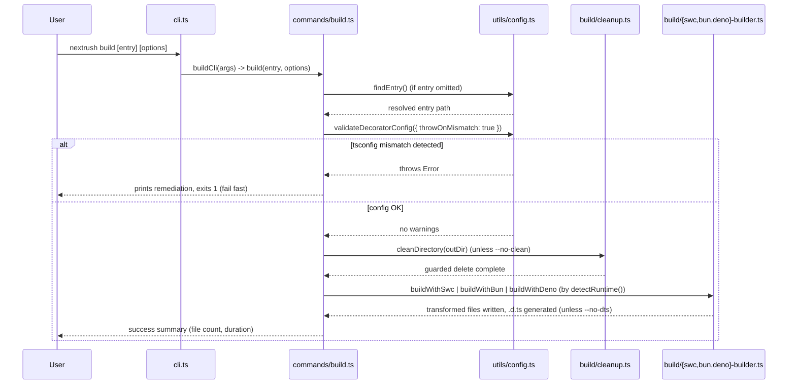
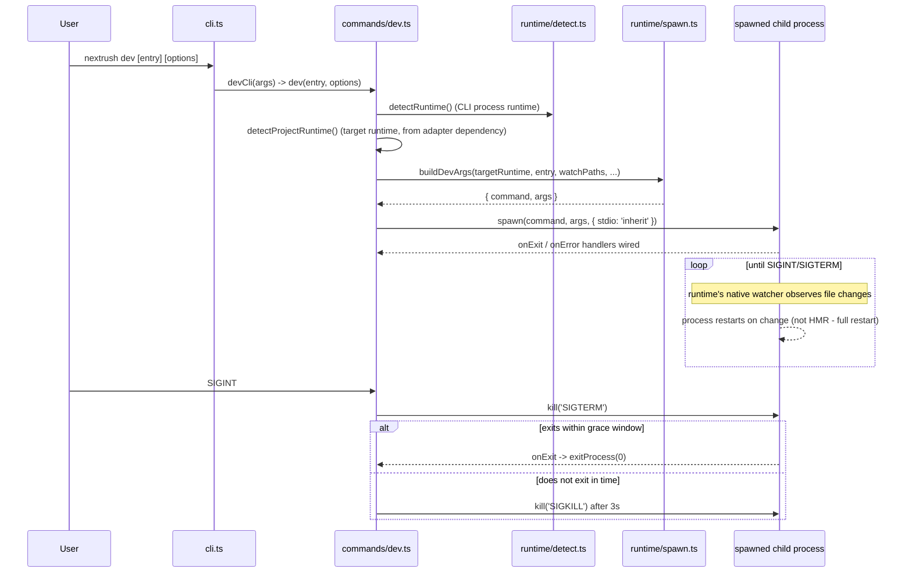

# @nextrush/dev — Architecture

> Internal design of the NextRush CLI: how `nextrush dev`/`build`/`generate`/`codemod` detect
> the runtime, and why production builds go through SWC instead of a bundler like `esbuild`.

## At a glance

|  |  |
| --- | --- |
| **Package** | `@nextrush/dev` |
| **Layer** | `tooling` — a standalone CLI, not part of the request hot path |
| **Depends on** | `@swc/core`, `@swc-node/register` (runtime dependencies — the only Tier-3 tooling package with them; see Constraints) |
| **Depended on by** | Application `package.json` `devDependencies`; not depended on by any other `@nextrush/*` package |
| **Public entry** | `src/index.ts` (barrel — exports only) + `bin/nextrush.js` (CLI entry) |
| **Internal modules** | ~30 files across `cli.ts`, `commands/`, `commands/build/`, `runtime/`, `generators/`, `codemods/`, `utils/` |
| **On the request hot path?** | No — this is a build-time/dev-time tool; nothing here runs inside a deployed application |
| **Runtime coupling** | Deliberately runtime-aware, not runtime-independent — the whole package exists to branch on Node/Bun/Deno and pick the right toolchain per runtime |
| **State model** | Stateless between invocations; a per-build incremental cache is the only persisted state (`.nextrush-cache.json` under the output directory) |

## Responsibilities

**This package owns:**

- ✓ Detecting the current JavaScript runtime (Node, Bun, or Deno) and picking the matching dev/build toolchain
- ✓ Running a development server that restarts on file change, using each runtime's native watcher
- ✓ Producing a production build that emits TypeScript decorator metadata (`design:paramtypes`), which DI containers like `@nextrush/di` (tsyringe) require and most bundlers strip
- ✓ Scaffolding controllers/services/middleware/guards/routes/adapters (`nextrush generate`)
- ✓ Running one-shot source codemods (`nextrush codemod`)
- ✓ Loading and validating `nextrush.config.ts` (currently: Deno permission extensions)

**This package does NOT own:**

- ✗ Decorator/DI semantics themselves → `@nextrush/di`, `@nextrush/class`
- ✗ Running the application at request time → the application's own entry file, executed under the runtime this package spawned
- ✗ Adapter contract conformance testing → `packages/adapters/conformance` (out of scope for this wave; `nextrush generate adapter` only scaffolds a skeleton that *uses* that suite)
- ✗ Test running → `@nextrush/testing`, `vitest`

## Non-goals

- Hot module replacement (state-preserving reload). `nextrush dev` restarts the process on
  every change — simpler and correct by construction, at the cost of losing in-memory state.
- Bundling for browsers or edge runtimes. `nextrush build` targets server-side Node/Bun/Deno
  output; there is no browser bundle mode.
- Being a general-purpose bundler replacement. It exists specifically to solve the decorator-
  metadata gap that `esbuild`/`tsup`/`tsx` leave open — not to compete with them on features.

## Constraints

Must remain:

- **The `emitDecoratorMetadata` guarantee holds on every runtime `nextrush build` targets** —
  Node (`@swc/core`), Bun (native `Bun.build()`), Deno (`npm:@swc/core`). A build that silently
  drops decorator metadata breaks every consuming application's DI without warning.
- **Safe by default on destructive operations** — `cleanDirectory()` refuses to delete the
  project root, an ancestor, the source directory, or any path outside the project (`build/cleanup.ts`).
- **Deno permissions are extend-only** — a project's `nextrush.config.ts` can add permission
  flags but can never narrow or replace the default sandbox (`--allow-net --allow-read --allow-env`).
- **Cross-platform** — no reliance on `npx`/PATH shims; the SWC dev loader resolves as a
  `file://` URL and Node child processes spawn via the running Node binary.

> [!IMPORTANT]
> This package is the one documented, approved exception to "no runtime API in core/middleware"
> — it is tooling, not framework surface that ships inside a deployed application. Its `eslint-disable
> nextrush/no-runtime-identity-capability` comments (in `dev.ts`, `build.ts`, `detect.ts`) mark this
> deliberately: the CLI's job *is* runtime-identity branching, unlike a request-path decision.

## Position in the package hierarchy

```mermaid
block-beta
  columns 3
  types["@nextrush/types"] errors["@nextrush/errors"] core["@nextrush/core"]
  router["@nextrush/router"] runtime["@nextrush/runtime"] di["@nextrush/di"]
  class["@nextrush/class"] adapters["adapter-node/bun/deno/edge"] space
  THIS["@nextrush/dev\n(this package)"]:::here space:2

  types --> errors
  errors --> core
  core --> router
  router --> runtime
  runtime --> di
  di --> class
  class --> adapters
  adapters --> THIS

  classDef here fill:#2563eb,color:#fff,stroke:#1e40af;
```

> [!IMPORTANT]
> `@nextrush/dev` sits outside the request-serving dependency chain entirely — it is a
> `devDependency` a project runs at dev-time/build-time, never imported by application runtime
> code. It reads (does not import) adapter/class conventions to detect a project's target
> runtime (`detectProjectRuntime()`), but has no compile-time dependency on any `@nextrush/*`
> package below it.

**Dependency rules:**
- **Allowed:** `@nextrush/dev → @swc/core`, `@swc-node/register` (its only runtime deps)
- **Forbidden:** any `@nextrush/*` package importing `@nextrush/dev` — it is a leaf, dev-time-only tool

---

## Overview

`@nextrush/dev` solves one specific problem: TypeScript's `emitDecoratorMetadata` compiler
option — required for `@nextrush/di`'s constructor injection to resolve parameter types at
runtime — is not emitted by the fast bundlers most projects reach for (`esbuild`, `tsup`, `tsx`).
Only `tsc` (slow) and SWC (fast, Rust-based) emit it. The package exists to give every supported
runtime a fast path that still emits correct decorator metadata.

The CLI is a thin dispatcher (`cli.ts`) over four commands — `dev`, `build`, `generate`,
`codemod` — each of which detects the current runtime once (`detectRuntime()`) and branches to
a Node/Bun/Deno-specific implementation. `dev` and `build` are asymmetric in urgency: `dev`
warns and continues on a decorator-config mismatch (a broken dev loop shouldn't block iteration),
while `build` fails fast (`validateDecoratorConfig({ throwOnMismatch: true })`) because a silently
broken production build is worse than a blocked one.

### Design principles

1. **Decorator metadata correctness is enforced on every runtime, not assumed.** Each runtime's
   build path (`swc-builder.ts`, `bun-builder.ts`, `deno-builder.ts`) is covered by a dedicated
   integration test asserting `design:paramtypes` literally appears in that runtime's output —
   not merely that the build succeeded.
2. **Destructive filesystem operations are guarded structurally, not by convention.** `cleanDirectory()`
   (`build/cleanup.ts`) computes the resolved path relative to `cwd` and throws before deleting
   if it resolves to `.`, the cwd itself, an ancestor, or outside the project — the guard is a
   function every build path goes through, not a comment telling contributors to be careful.
3. **Sandbox extension is additive-only by construction.** `nextrush.config.ts`'s
   `dev.deno.permissions` is merged into (never replaces) the fixed default permission set;
   `validateDenoPermissions()` rejects any value not starting with `--allow-`/`--deny-` before
   Deno is ever spawned.

---

## Module structure

```text
src/
├── index.ts               # Public API barrel (cli, dev, build, generate, runtime helpers)
├── cli.ts                 # Command dispatch: dev | build | generate/g | codemod
├── commands/
│   ├── dev.ts              # dev() - spawns the runtime's watch process, wires signal/exit handling
│   ├── dev-cli.ts          # CLI arg parsing + help for `nextrush dev`
│   ├── dev-helpers.ts      # detectProjectRuntime() - infers target runtime from adapter deps
│   ├── build.ts            # build() - orchestrates clean -> transform -> declarations
│   ├── codemod.ts          # codemod CLI dispatch (consolidate-imports today)
│   └── build/              # Build implementation, split by runtime and concern
│       ├── config.ts        # resolveBuildOptions(), parseBuildTarget()
│       ├── swc-builder.ts   # Node build path: @swc/core transform + .d.ts generation
│       ├── bun-builder.ts   # Bun build path: native Bun.build()
│       ├── deno-builder.ts  # Deno build path: npm:@swc/core
│       ├── file-scanner.ts  # Workspace-boundary-aware TypeScript file discovery
│       ├── cache.ts         # Content-hash incremental build cache
│       ├── cleanup.ts       # Guarded output-directory cleaning
│       ├── atomic-write.ts  # Atomic file writes (temp file + rename)
│       └── concurrency.ts   # Bounded-concurrency file transform runner
├── runtime/
│   ├── detect.ts            # detectRuntime(), getRuntimeInfo(), exitProcess(), onSignal()
│   ├── spawn.ts             # Cross-runtime process spawning; buildDevArgs(); Deno permission validation
│   ├── fs.ts                 # Cross-runtime filesystem helpers
│   └── node-modules.ts       # Node built-in module specifiers (Deno-npm-compatible)
├── generators/
│   ├── generate.ts           # Single-file generators + generateAdapter() multi-file scaffold
│   ├── templates.ts          # controller/service/middleware/guard/route templates
│   └── adapter-templates.ts  # Adapter Development Kit scaffold templates
├── codemods/
│   └── consolidate-imports.ts # Surgical import-statement rewrite (decorators/controllers -> class)
└── utils/
    ├── config.ts              # findEntry(), loadConfig(), validateDecoratorConfig()
    └── logger.ts               # CLI output formatting
```

### Module responsibilities

| Module | Responsibility (the one thing it owns) |
| ------ | -------------------------------------- |
| `cli.ts` | Parses the top-level command name and routes to the matching command module |
| `commands/dev.ts` | Owns the dev-server process lifecycle: spawn, signal handling, watch-path fallback |
| `commands/build.ts` | Owns build orchestration order: validate config -> clean -> transform -> report |
| `commands/build/*.ts` | Each file owns exactly one runtime's transform path or one cross-cutting build concern (cache, cleanup, atomic writes) |
| `commands/codemod.ts` | Owns codemod CLI parsing and dispatch to a named codemod |
| `codemods/consolidate-imports.ts` | The one codemod implementation: pure, deterministic import rewriting |
| `runtime/detect.ts` | The single source of truth for "which runtime am I running under" |
| `runtime/spawn.ts` | Builds the exact `argv` for each runtime's dev process and validates Deno permission flags |
| `generators/generate.ts` | Single-file scaffolding + the multi-file adapter scaffold |
| `utils/config.ts` | Entry-file detection, `nextrush.config.ts` loading, decorator-config validation |

---

## Lifecycle

### `nextrush build` execution sequence

The path a single `build` invocation takes, from CLI dispatch to the runtime-specific transform:



The decision this diagram makes explicit: **`build` never writes partial output past a
decorator-config mismatch.** Unlike `dev`, which warns and keeps running, a misconfigured
`tsconfig.json` stops the build before the output directory is even cleaned.

### `nextrush dev` execution sequence



The non-obvious detail neither diagram shows on its own: **the CLI's own runtime (`detectRuntime()`)
and the project's target runtime (`detectProjectRuntime()`, inferred from the adapter dependency
in `package.json`) can differ** — e.g. running `nextrush dev` under Node for a project that
targets Bun. `dev.ts` logs this mismatch but proceeds using the *target* runtime's watch command.

## State ownership

| Owner | State it owns | Scope |
| ----- | -------------- | ----- |
| `commands/build/cache.ts` | The incremental build cache (`sourceHash` per file, keyed by an options hash) | persisted to disk under the output directory, read/written once per `build` invocation |
| `commands/dev.ts` (closure) | The spawned child process handle, shutdown flag, watch-fallback-attempted flag | one dev-server process lifetime |
| — | No package-level or cross-invocation in-memory state exists | each CLI invocation is a fresh process |

---

## Concurrency & edge behaviour

- **Shared, immutable per invocation:** the resolved build/dev options — computed once at the
  start of `build()`/`dev()`, then read-only for that invocation.
- **Per-file, isolated:** the incremental cache lookup and atomic write for each transformed
  file — `build/concurrency.ts` runs file transforms with bounded concurrency, and
  `build/atomic-write.ts` writes via a temp file + rename so a killed process never leaves a
  half-written output file.
- **Process signals:** `SIGINT`/`SIGTERM` trigger a graceful shutdown of the spawned dev
  process (`SIGTERM`, then `SIGKILL` after a 3-second grace window) rather than an immediate exit.

> [!WARNING]
> `commands/build/cleanup.ts`'s path guards are the only thing preventing `--outDir` from
> resolving to something destructive (the project root, an ancestor, or outside the project).
> Any change to `resolveBuildOptions()`'s output-directory resolution must be re-verified
> against `build-cleanup.test.ts` — this is the one place in the package where a bug has a
> real-data-loss blast radius.

## Trust boundaries

```text
nextrush.config.ts (project-authored) --> loadConfig() --> dev.deno.permissions
                                                                  |
                                                                  v
                                          validateDenoPermissions() -- rejects any value not
                                          starting with --allow-/--deny- BEFORE Deno is spawned
                                                                  |
                                                                  v
                                          merged into the fixed default set (--allow-net
                                          --allow-read --allow-env) -- extend-only, never replaces
```

`nextrush.config.ts` is project-authored, trusted input (it runs as a dynamic `import()` inside
the developer's own project) — the boundary this package enforces is narrower: even a
well-intentioned misconfiguration (a typo'd flag, an attempt to widen the sandbox unexpectedly)
fails fast with a named offending value, rather than being passed through to `deno run` unchecked.

## Extension points

**Supported extension points:**

- **`nextrush.config.ts`** — `dev.deno.permissions`, and the `dev`/`build` option shapes in
  `NextRushConfig` (`utils/config.ts`) are the sanctioned way to customize behavior per project.
- **`nextrush codemod`** — new codemods are added by implementing a pure `(source: string) => string`
  transform (see `consolidateImports()`) and registering it in `codemodCli()`'s dispatch switch.
- **`nextrush generate`** — new generator types are added via `GENERATORS`/`GENERATOR_ALIASES`
  in `generators/templates.ts`; the adapter scaffold is a separate multi-file path (`generateAdapter()`).

**Forbidden (sealed):**

- **Widening the default Deno permission set beyond extend-only.** Any change letting project
  config *remove* a default permission, or letting the CLI itself add `--allow-all`, reopens the
  sandboxing guarantee this package exists to preserve.
- **Skipping the decorator-metadata assertion on any runtime's build path.** A runtime added to
  `nextrush build` without a `design:paramtypes`-asserting integration test (per the Testing
  strategy below) is not done, regardless of whether the build itself succeeds.

---

## Architectural invariants

The following are part of the package architecture. They do not change without an RFC:

- **`nextrush build` emits decorator metadata identically on Node, Bun, and Deno** — verified by
  a dedicated integration test per runtime, not asserted.
- **`cleanDirectory()` never deletes the project root, an ancestor, the source directory, or a
  path outside the project.**
- **Deno permissions granted via `nextrush.config.ts` are additive only** — they extend the
  fixed default set (`--allow-net --allow-read --allow-env`), never replace or narrow it, and the
  CLI never adds `--allow-all` automatically.
- **`nextrush dev` restarts the process on change; it does not attempt state-preserving HMR.**
- **`nextrush build` fails fast on a decorator-config mismatch; `nextrush dev` warns and continues.**

## Engineering decisions

| Decision | Chosen | Trade-off accepted | Reference |
| -------- | ------ | ------------------- | --------- |
| Toolchain for decorator metadata | SWC (`@swc/core`, `@swc-node/register`) over `esbuild`/`tsup`/`tsx` | The package carries two runtime dependencies (the only Tier-3 tooling package that does) | `package.json` dependencies |
| Node dev-time TypeScript loader | `@swc-node/register` via `--import`, not `tsx`/`--experimental-strip-types` | Slightly slower dev-server startup than a bare type-strip loader | `commands/dev.ts`, `runtime/spawn.ts` |
| Default watch mode (no explicit `--watch <path>`) | Bare `--watch` (watch imported files) over `--watch-path` | Less precise than path-scoped watching, in exchange for portability — Node documents `--watch-path` as macOS/Windows-only | `commands/dev.ts` |
| Build cache fingerprint | A pure-JS cyrb53-derived hash, not `node:crypto` | Not cryptographically strong, but collision-resistance for a project's file count doesn't need to be; keeps the bundle free of a static `node:*` import that would block Deno loading | `commands/build/cache.ts` |
| Deno permission extension model | Additive-only merge, validated before spawn | A project cannot narrow the sandbox below the CLI's defaults through config — must run `deno` directly for that | `utils/config.ts`, `runtime/spawn.ts` |

## Rejected alternatives

### Using `esbuild`/`tsup` as the default toolchain
Rejected: neither emits `design:paramtypes`/`Reflect.metadata`, so any project using
`@nextrush/di`'s constructor injection would see DI silently fail at runtime with no build-time
warning. SWC was chosen specifically because it is the only fast (Rust-based) compiler that
supports `emitDecoratorMetadata`.

### `node --watch-path` as the unconditional default watch mode
Rejected: Node documents `--watch-path` as unsupported on some platform/Node-version
combinations, which would make the default `nextrush dev` experience non-portable. Bare
`--watch` (watching imported files) is the default; `--watch-path` is used only when the
developer passes explicit `--watch <path>` arguments, with a one-time fallback to bare `--watch`
if the platform rejects it (see `dev-restart-on-change.test.ts`).

---

## Testing strategy

- **Unit:** runtime detection, config loading/validation, logger formatting, codemod transform
  logic (`consolidate-imports.test.ts`) — all pure-function coverage independent of a real process.
- **Integration, real runtime:** `dev-http-liveness.test.ts` (real HTTP response from a spawned
  dev server), `dev-restart-on-change.test.ts` (real `--watch` restart), `build-e2e-integration.test.ts`,
  `swc-builder-integration.test.ts` (cache, `.d.ts`, nested workspace layout), `build-bun-decorator-integration.test.ts`
  (asserts `design:paramtypes` literally appears in Bun output), `build-deno-integration.test.ts`
  (asserts correctly-mapped `.js` output under real Deno).
- **Conformance / cross-adapter parity:** N/A — this package is not itself an adapter; Bun/Deno
  build and dev regression tests run in CI against real Bun/Deno binaries via the
  `dev-tooling-cross-runtime` job in `runtime-conformance.yml` (pinned Deno 2.6.3 / Bun 1.3.14).
- **Coverage:** >=90% lines/functions (CI-enforced).

## Evolution strategy

- **Stable (semver-guarded):** `dev()`, `build()`, `generate()`, `generateAdapter()`, `cli()`,
  runtime-detection exports, and their option types (ADR-0005).
- **May change without notice:** the internal `build/*.ts` module split, cache file format
  internals, and codemod implementation details.
- **Changes only via RFC:** the decorator-metadata-on-every-runtime invariant, and the
  extend-only Deno permission model.

**Timeline:** 1.0 — `dev`/`build`/`generate` across Node/Bun/Deno with verified decorator
metadata; `codemod consolidate-imports` and `generate adapter` added as the class-model
migration and Adapter Development Kit needs emerged.

## Contributor notes

Before changing this package, read the SWC transform options in `commands/build/swc-transform-options.ts`
(`decoratorMetadata: true` and `keepClassNames: true` are both load-bearing for DI resolution) and
the guard logic in `commands/build/cleanup.ts` before touching output-directory resolution — a
regression there has a real data-loss blast radius, not just a broken build.

## Architecture checklist

Before changing this package, confirm:

- [ ] Does this preserve decorator-metadata emission identically on Node, Bun, and Deno?
- [ ] Does this add or change a destructive filesystem path — does it still route through the `cleanDirectory()` guards?
- [ ] Does this change the Deno permission model's additive-only guarantee?
- [ ] Does this change the public API (semver / ADR-0005)? Does it need an RFC?
- [ ] If this adds a runtime code path, does it have a dedicated real-runtime integration test, not just a mock?

---

## References & see also

- **README (how to use it):** [`./README.md`](./README.md)
- **RFC:** [`docs/RFC/RFC-019`](../../docs/RFC/) — dev-server watch strategy and Deno permissions
- **ADR:** [`ADR-0005 — package tiers & sealed surface`](https://github.com/0xTanzim/nextRush/blob/main/docs/adr/ADR-0005-package-tiers-sealed-surface-deprecation.md)
- **Runtime conformance:** [`.github/workflows/runtime-conformance.yml`](https://github.com/0xTanzim/nextRush/blob/main/.github/workflows/runtime-conformance.yml)
- **Repository:** [`packages/dev`](https://github.com/0xTanzim/nextRush/tree/main/packages/dev)
