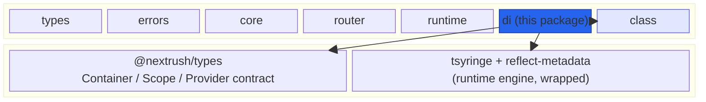
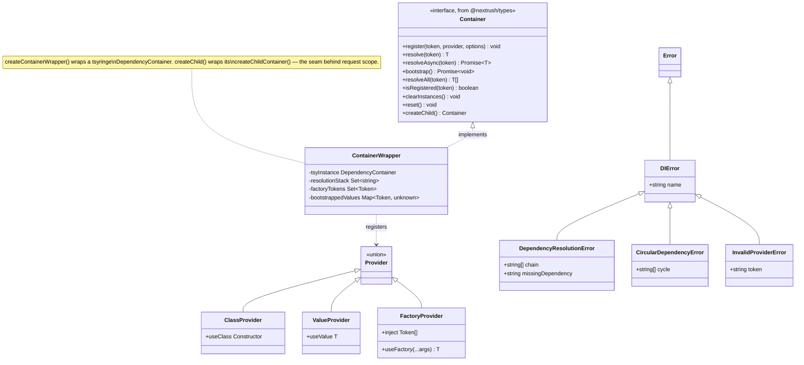
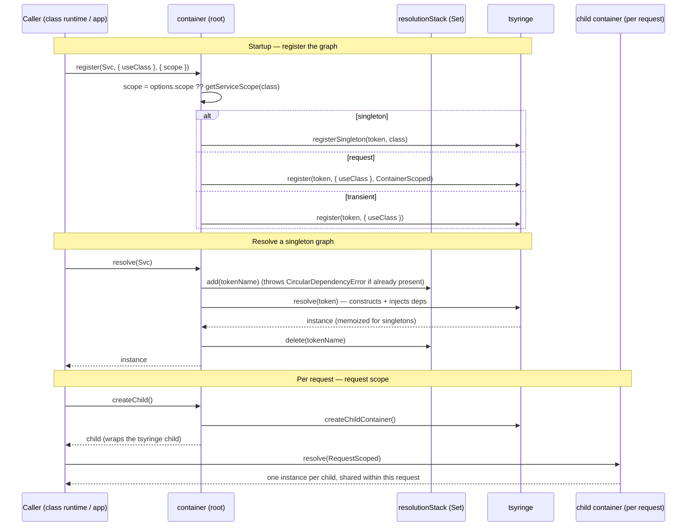
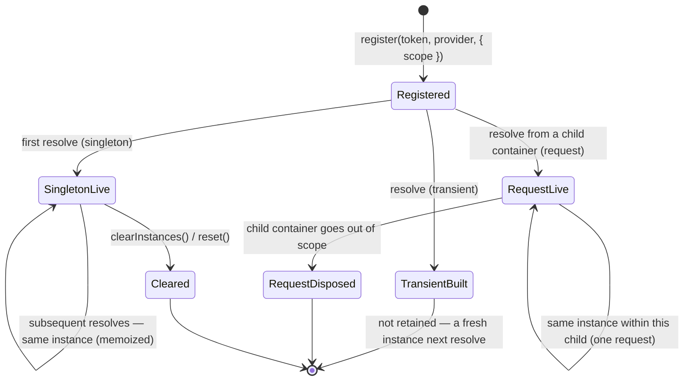

# @nextrush/di — Architecture

> Internal design of the DI container: how it wraps `tsyringe`, maps the three scopes to lifecycles, backs `request` scope with a per-request child container, and turns resolution failures into actionable errors. This is the **canonical home for DI-scope facts** — `@nextrush/class` re-exports this package rather than redefining them.

## At a glance

|  |  |
| --- | --- |
| **Package** | `@nextrush/di` |
| **Layer** | `di` (above `runtime`, below `class`) |
| **Depends on** | `@nextrush/types` (contract, types only) · `tsyringe` · `reflect-metadata` (runtime) |
| **Depended on by** | `@nextrush/class` (re-exports it), and any app resolving from a container |
| **Public entry** | `src/index.ts` (barrel — exports only) |
| **Internal modules** | 9 files · 987 LOC · largest `container.ts` 290 LOC (under the 300 cap) |
| **On the request hot path?** | **Partial** — singleton graphs resolve once at startup; `request`-scoped services resolve per request via a child container |
| **Runtime coupling** | None — `tsyringe` + `reflect-metadata` only; no `node:*` / runtime globals |
| **State model** | App-scoped — the container holds singleton instances + per-request child containers for `request` scope |

## Responsibilities

**This package owns:**

- ✓ The **container implementation** — a `tsyringe` wrapper implementing the `Container` contract (`register` / `resolve` / `bootstrap` / `createChild` / …)
- ✓ The **service decorators** — `@Service`, `@Repository`, `@Config`, `@Injectable`, and the parameter decorators `@inject`, `@Optional`, plus `delay()`
- ✓ The **scope model** — mapping `singleton` / `transient` / `request` onto `tsyringe` lifecycles (the canonical DI-scope reference)
- ✓ **Resolution safety** — O(1) circular-dependency detection and classification of `tsyringe` failures into typed errors
- ✓ **Metadata read/write** — writing service/scope/optional metadata via `reflect-metadata` and reading it back for discovery
- ✓ The **DI error hierarchy** — `DIError`, `DependencyResolutionError`, `CircularDependencyError`, `InvalidProviderError`

**This package does NOT own:**

- ✗ The `Container` / `Scope` / `Provider` **type contract** — that lives in [`@nextrush/types`](../types) (the lowest package) so any layer can reference it
- ✗ **Route/controller decorators** and the registration pipeline → [`@nextrush/class`](../class)
- ✗ **Per-request child-container orchestration in the request lifecycle** — `class` decides *when* to create a child and resolve request-scoped controllers; `di` only provides `createChild()`
- ✗ The `tsyringe` engine itself — construction, `design:paramtypes` reflection, and the lifecycle primitives are `tsyringe`'s

## Non-goals

The package intentionally does not:

- Provide a module/encapsulation system (module-private providers) — that is `@nextrush/class`'s `@Module`
- Auto-discover or scan the filesystem for services — discovery lives in `@nextrush/class`
- Replace `tsyringe` with a bespoke resolver — it wraps it, adding contract, scopes, and error quality
- Manage async service *lifecycles* (init/shutdown hooks) — only async *factory* resolution via `bootstrap()`

## Constraints

Must remain:

- **Runtime-independent** — no `node:*` / `process` / runtime globals, so every adapter resolves identically
- **Contract-driven** — implements the `Container` interface owned by `@nextrush/types`; the shape is shared, not local
- **ESM-only** — no CommonJS build
- **Fail-loud on bad graphs** — a cycle or a missing token throws a typed, actionable error; it never resolves to a silent wrong value
- **Public API sealed** — the exported surface is semver-guarded (ADR-0005)

## Position in the package hierarchy

`di` sits above `runtime` and below `class`. It is the only package in the core stack that carries runtime dependencies (`tsyringe` + `reflect-metadata`) — a sanctioned exception to the zero-dependency rule.



> [!IMPORTANT]
> Imports flow **downward only**. `@nextrush/di` imports from `@nextrush/types` (plus its two runtime
> deps) and MUST NOT import from `class`, adapters, middleware, or any higher layer (project-rules §1).
> It sits below `class` precisely so `class` can re-export it and drive the container.

**Dependency rules:**
- **Allowed:** `di → @nextrush/types` · `di → tsyringe` · `di → reflect-metadata`
- **Forbidden:** `di → class / adapters / middleware / extensions` (any higher or sibling layer)

---

## Overview

The package answers one question on the resolution path: *given a token, what instance should the caller get, built with its dependencies, shared according to its scope — and if that's impossible, what actionable error explains why?* The single organizing idea is that **`di` is a thin, opinionated wrapper around `tsyringe`**: `tsyringe` does the construction and `design:paramtypes` reflection; `di` owns the *contract*, the *scope semantics*, and the *error quality* that `tsyringe` alone does not provide.

Three concerns are layered on top of `tsyringe`. First, **a shared contract**: the `Container` / `Scope` / `Provider` types live in `@nextrush/types` (the lowest package) so `core` and `class` can reference "a container" without depending on `di`; `di` implements that interface. Second, **scope semantics**: the decorators write a `di:scope` metadata value, and `register()` maps `singleton` → `tsyringe`'s `registerSingleton`, `transient` → a plain registration, and `request` → `ContainerScoped` — which only yields a per-request instance when resolved from a child container. Third, **error quality**: `resolve()` tracks an O(1) resolution stack to catch cycles before the JS stack overflows, and classifies `tsyringe`'s opaque failure messages into `CircularDependencyError` vs `DependencyResolutionError`.

The decorators are deliberately small. `@Service()` / `@Repository()` / `@Config()` write two pieces of metadata (service *type* and *scope*) and apply the matching `tsyringe` decorator; `@Injectable()` makes a class resolvable without service metadata; `markInjectable()` is the internal seam `@Controller` uses so `@nextrush/class` never touches `tsyringe` directly.

### Design principles

1. **Wrap, don't reinvent.** `tsyringe` is the resolution engine; `di` adds only contract, scopes, and errors — verified by `container.ts` delegating construction to `tsyInstance.resolve`.
2. **The contract lives below the implementation.** The `Container` interface is in `@nextrush/types`, so higher packages depend on the contract, not on `di` — enforced by the package hierarchy.
3. **The class declares its own scope.** `register()` prefers an explicit `options.scope`, else reads the class's `di:scope` metadata (`getServiceScope`, defaulting to `singleton`) — the call site doesn't decide lifecycle.
4. **Fail loud, fail clearly.** Cycles and missing tokens throw typed errors whose messages list concrete fixes (`errors.ts`), never a silent `undefined`.
5. **Detect cycles cheaply.** A `Set`-based resolution stack gives O(1) cycle detection *before* recursion blows the native stack (`container.ts`).
6. **Isolate the one unstable coupling.** `@Optional()`'s reach into `tsyringe`'s private `injectionTokens` descriptor is confined to a single guarded adapter that degrades to a no-op if the descriptor shape changes (`injection.ts`).

---

## Module structure

```text
src/
├── index.ts             # Public API barrel (exports only); loads reflect-metadata
├── container.ts         # createContainerWrapper() — the tsyringe wrapper; container, createContainer
├── service-decorators.ts# @Service, @Repository, @Config — write service/scope metadata
├── injection.ts         # @inject, @Optional, delay, Injectable, markInjectable + the tsyringe optional-descriptor adapter
├── service-metadata.ts  # metadata readers: hasServiceMetadata / getServiceType / getServiceScope / getConfigPrefix
├── decorators.ts        # re-export barrel combining service + injection + metadata-reader decorators
├── errors.ts            # DIError, DependencyResolutionError, CircularDependencyError, InvalidProviderError
├── types.ts             # METADATA_KEYS + ConfigOptions; re-exports the container contract from @nextrush/types
└── reflection.ts        # anchor module for centralized Reflect.* usage (currently a placeholder)
```

### Module responsibilities

| Module | Responsibility (the one thing it owns) |
| ------ | -------------------------------------- |
| `container.ts` | The `tsyringe` wrapper — scope mapping, resolution, cycle detection, factory bootstrap, child containers. |
| `service-decorators.ts` | Class decorators that record service type + scope and apply the matching `tsyringe` decorator. |
| `injection.ts` | Parameter injection (`@inject`, `@Optional`, `delay`), `Injectable`/`markInjectable`, and the isolated `tsyringe` optional-descriptor adapter. |
| `service-metadata.ts` | Reading back the metadata decorators write (for discovery/diagnostics). |
| `errors.ts` | The DI error hierarchy with actionable, fix-listing messages. |
| `types.ts` | The metadata key constants + `ConfigOptions`; re-exports the shared container contract. |
| `decorators.ts` | A single barrel that re-composes the decorator surface for `index.ts`. |

## Component relationships

The container contract, its provider inputs, the decorator surface, and the error hierarchy:



The `Container` interface is defined in `@nextrush/types`; `ContainerWrapper` (built by `createContainerWrapper()`) is the `di` implementation. A `Provider` is a discriminated union — `register()` narrows it (`useClass` / `useValue` / `useFactory`) and throws `InvalidProviderError` if it matches none.

---

## Lifecycle

### Resolution — singleton vs request-scoped child (execution)

How `resolve()` builds an instance, including the per-request child container that realizes `request` scope:



The ordering a reader would otherwise get wrong: the resolution stack is pushed **before** delegating to `tsyringe` and popped in a `finally`-style path on both success and failure, so a re-entrant token is caught as a cycle *before* `tsyringe` recurses into a stack overflow. And `request` scope is inert on the root container — the *same* `ContainerScoped` registration yields one instance per **child**, which is why the class runtime creates a child per request.

### Instance lifecycle per scope (state)



> [!NOTE]
> `transient` instances are never retained by the container — each `resolve()` constructs a new one,
> so they leave no state to clear. `request`-scoped instances live only as long as their child
> container; when the request ends and the child is dropped, they become eligible for GC.

## State ownership

| Owner | State it owns | Scope |
| ----- | ------------- | ----- |
| Root `container` | singleton instances (via `tsyringe`), `factoryTokens`, `bootstrappedValues` cache | app / process |
| Child container (`createChild`) | its own `ContainerScoped` (request) instances; singletons stay on the parent | per request |
| `resolutionStack` (per wrapper) | the in-flight resolution chain — transient, cleared after each `resolve()` | per resolve call |
| `ERROR`/decorator metadata | `di:type` / `di:scope` / `di:optional` on the class (via `reflect-metadata`) | per class, at definition time |
| `@nextrush/types` | the `Container` / `Scope` / `Provider` type contract | compile-time only |

Singletons are shared and long-lived; request-scoped instances are isolated per child container; the resolution stack is short-lived per call. There is no cross-request shared mutable state except the intentionally-shared singletons.

## Data structures

```ts
// The container contract (owned by @nextrush/types, implemented here). Kept in the lowest package
// so `core` and `class` can reference "a container" without depending on `di`.
interface Container {
  register<T>(token: Token<T>, provider: Provider<T>, options?: RegisterOptions): void;
  resolve<T>(token: Token<T>): T;
  resolveAsync<T>(token: Token<T>): Promise<T>;
  bootstrap(): Promise<void>;          // resolves + caches async factory providers
  resolveAll<T>(token: Token<T>): T[]; // returns [] for an unregistered token (not a throw)
  isRegistered<T>(token: Token<T>): boolean;
  clearInstances(): void;              // drop instances, keep registrations (testing)
  reset(): void;                       // drop everything (testing)
  createChild(): Container;            // the seam behind request scope
}

// A provider is a discriminated union — register() narrows on the present key.
type Provider<T> = ClassProvider<T> | FactoryProvider<T> | ValueProvider<T>;

// Scope drives the tsyringe lifecycle mapping in register().
type Scope = 'singleton' | 'transient' | 'request';
```

The shape choices are deliberate: the contract is an **interface in `@nextrush/types`**, not a class in `di`, so the dependency arrow points down (higher packages depend on the contract, `di` implements it); `Provider` is a **discriminated union** so `register()` narrows structurally and rejects anything that isn't a class/value/factory with a typed `InvalidProviderError`; and `Scope` is a **string union** rather than an enum so it crosses the package boundary as a plain, tree-shakable type.

## Concurrency & edge behaviour

- **Shared, long-lived:** singleton instances and the module-level metadata keys. Node's single-threaded model means no locking is needed; construction happens once and is memoized by `tsyringe`.
- **Per-request, isolated:** each child container (`createChild()`) owns its `request`-scoped instances; two requests never share them.
- **Cycle safety:** `resolve()` pushes onto an O(1) `Set` resolution stack before delegating and pops it on every exit path, so a re-entrant token throws `CircularDependencyError` before `tsyringe` recurses into a `RangeError`.
- **Async factories:** `bootstrap()` is idempotent and re-runnable — it iterates a snapshot of `factoryTokens`, skips already-cached values, and awaits async factory results into `bootstrappedValues`, so a shared global container survives multiple registration cycles.
- **Missing multi-registrations:** `resolveAll()` returns `[]` for an unregistered token rather than throwing — the one place an "unregistered" signal is deliberately swallowed.

> [!WARNING]
> The `@Optional()` implementation reaches into `tsyringe`'s private `injectionTokens` descriptor to
> flip its `isOptional` flag — there is no public API for it. This coupling is confined to one guarded
> adapter in `injection.ts` that degrades to a no-op if the descriptor shape changes; a `tsyringe`
> upgrade that alters it is caught by the end-to-end `@Optional()` resolution test, not silently.

## Trust boundaries

```text
class constructor + decorators  (application code — trusted authoring surface)
   │  @Service / @inject / provider config
   ▼
container.register()  ── validates the provider shape ──▶ InvalidProviderError on a bad provider
   │
   ▼
container.resolve()   ── cycle guard + missing-token classification ──▶ typed DI errors, never a silent undefined
   │
   ▼
constructed instance  (returned to the caller)
```

`di` treats provider *configuration* as the boundary to validate: a `register()` call with no `useClass` / `useValue` / `useFactory` throws `InvalidProviderError`, and `resolve()` classifies every `tsyringe` failure into a typed error rather than propagating an opaque message or returning `undefined`. It does not sanitize request input — that is not `di`'s layer; it guards the *shape and resolvability* of the dependency graph.

## Extension points

**Supported extension points:**

- **Provider kinds** — `useClass` / `useValue` / `useFactory` (with `inject`) cover class, constant, and computed dependencies, including async factories via `bootstrap()`.
- **Custom tokens** — string/symbol tokens via `@inject('TOKEN')` for interfaces and values that have no runtime type.
- **Child containers** — `createContainer()` / `createChild()` for test isolation and request scoping.
- **`markInjectable()`** — the sanctioned seam for a higher package (like `@Controller`) to make a class resolvable without service metadata, so it need not import `tsyringe`.

**Forbidden (sealed):**

- **Direct `tsyringe` access from higher packages** — everything goes through the `Container` contract and `markInjectable()`, so the engine stays swappable.
- **The scope→lifecycle mapping** — changing which `tsyringe` lifecycle a scope maps to would silently change sharing semantics for every service; RFC-gated.
- **Reaching into `tsyringe` internals outside the one `@Optional()` adapter** — the descriptor coupling is deliberately isolated.

---

## Architectural invariants

These are part of the package's architecture. They do not change without an RFC:

- **The `Container` contract lives in `@nextrush/types`**, not in `di` — higher packages depend on the contract, `di` implements it.
- **`di` wraps `tsyringe`; it does not expose it** — `tsyringe` types never cross the public surface, so the engine stays replaceable.
- **Scope maps to lifecycle deterministically** — `singleton` → `registerSingleton`, `transient` → plain registration, `request` → `ContainerScoped` (per-child).
- **The declared scope wins over the call site** — `register()` prefers `options.scope`, else the class's `di:scope` metadata (default `singleton`).
- **`request` scope requires a child container** — the root container never yields per-request instances.
- **Cycles and missing tokens throw typed, actionable errors** — never a silent `undefined`; cycles are caught before the native stack overflows.
- **The `@Optional()` `tsyringe`-internal coupling stays in one guarded adapter** — and is guarded by an e2e test.
- **The package imports no runtime API** — only `tsyringe` + `reflect-metadata`, so every adapter resolves identically.

## Engineering decisions

| Decision | Chosen | Trade-off accepted | Reference |
| -------- | ------ | ------------------ | --------- |
| Resolution engine | Wrap `tsyringe` rather than build a resolver | A runtime dependency (a sanctioned exception to zero-dep) | `container.ts` · [RFC-NEXTRUSH-REQUEST-SCOPE](https://github.com/0xTanzim/nextRush/tree/main/docs/RFC) |
| Contract location | `Container` type in `@nextrush/types` | An extra package hop for the type; keeps the dependency arrow pointing down | `types.ts` |
| `request` scope | `tsyringe` `ContainerScoped` + per-request child container | Callers must resolve from a child; inert on the root | `container.ts` · `container.scope.test.ts` |
| Cycle detection | O(1) `Set` resolution stack + message heuristics | Duplicates a check `tsyringe` also does, to fail earlier and clearer | `container.ts` |
| `@Optional()` | Flip `tsyringe`'s private `isOptional` descriptor flag | Couples to a `tsyringe` internal — isolated + e2e-guarded | `injection.ts` |
| Scope default | Unify on `singleton` for decorated classes | Differs from `RegisterOptions`' documented `transient` default; the class metadata wins | `service-metadata.ts` |

## Rejected alternatives

### A hand-rolled resolver instead of `tsyringe`
Rejected: `tsyringe`'s `design:paramtypes` reflection, lifecycle primitives, and child containers are mature and battle-tested. Reimplementing them would add substantial surface area and risk for no user-visible benefit — the value `di` adds (contract, scope semantics, error quality) is a thin, testable layer on top. The accepted cost is one sanctioned runtime dependency.

### Defining the `Container` type inside `@nextrush/di`
Rejected: if the contract lived in `di`, then `@nextrush/core` (which owns a container) and `@nextrush/class` would have to depend on `di` only for the *type*, inverting the intended dependency direction. Placing the interface in the lowest package (`@nextrush/types`) lets any layer reference "a container" while `di` remains a leaf implementation.

### Realizing `request` scope on the root container
Rejected: a per-request instance on a shared root container would leak across requests or require manual reset between them. Backing `request` scope with a short-lived child container makes isolation structural — the child is created per request and discarded with it, so there is no cross-request bleed to police.

---

## Testing strategy

- **Unit:** decorator metadata writes (`di:type` / `di:scope`), scope defaults, `@Optional()` marking, provider narrowing, and error message shape.
- **Container core:** `register` / `resolve` / `resolveAll` / `isRegistered` / `clearInstances` / `reset`, and factory (`useFactory`, `inject`, async) resolution via `bootstrap()`.
- **Scope behavior:** `container.scope.test.ts` proves a `request`-scoped token gives one instance per child and shares it between collaborators within a child.
- **Error paths:** circular-dependency detection (including the `tsyringe` stack-overflow signal), unregistered-token classification, and invalid-provider rejection.
- **Cross-adapter parity:** N/A directly — the package uses no runtime API; adapter parity is proven in `packages/adapters/conformance`.
- **Coverage:** ≥90% lines/functions (CI-enforced).

## Evolution strategy

- **Stable (semver-guarded):** the sealed public surface — `container`, `createContainer`, the decorators, the error classes, `METADATA_KEYS`, and the re-exported contract types (ADR-0005).
- **May change without notice:** internal module layout, the `tsyringe` message-classification heuristics, the private `@Optional()` descriptor adapter, and the `bootstrappedValues` caching internals.
- **Changes only via RFC:** the scope→lifecycle mapping, the location of the `Container` contract, the "declared scope wins" rule, and any change that exposes `tsyringe` types on the public surface.

**Timeline:** `3.0` — container wrapper, `@Service`/`@Repository`/`@Config`, singleton/transient scopes, circular detection → `3.1` — per-app container (contract moved to `@nextrush/types`, `ContainerInterface` alias removed in favor of `Container`), `request` scope backed by a child container, idempotent `bootstrap()` for shared containers.

## Contributor notes

Before changing this package, read: [ADR-0005 (package tiers & sealed surface)](https://github.com/0xTanzim/nextRush/blob/main/docs/adr/ADR-0005-package-tiers-sealed-surface-deprecation.md), the request-scope RFC, `container.ts` (the wrapper + scope mapping + cycle detection), and the `@Optional()` adapter in `injection.ts` — the one deliberate `tsyringe`-internal coupling. When touching resolution or scopes, run `container.scope.test.ts` and the circular-dependency suite; when touching `@Optional()`, the e2e `decorators.test.ts` guards the `tsyringe` descriptor flag.

## Architecture checklist

Before changing this package, confirm:

- [ ] Does this preserve the architectural invariants above (especially the scope→lifecycle mapping and "declared scope wins")?
- [ ] Does it keep `tsyringe` types off the public surface (the engine stays swappable)?
- [ ] Does it keep the `Container` contract in `@nextrush/types` and the dependency arrow pointing down?
- [ ] Does it keep the `@Optional()` `tsyringe`-internal coupling isolated + e2e-guarded?
- [ ] Does this change the sealed public API (semver / ADR-0005)? Does it need an RFC?

---

## References & see also

- **README (how to use it):** [`./README.md`](./README.md)
- **Container contract:** [`@nextrush/types` — `src/container.ts`](../types)
- **Class runtime (re-exports this package):** [`@nextrush/class`](../class)
- **ADR:** [`ADR-0005 — package tiers & sealed surface`](https://github.com/0xTanzim/nextRush/blob/main/docs/adr/ADR-0005-package-tiers-sealed-surface-deprecation.md)
- **RFCs:** [`docs/RFC`](https://github.com/0xTanzim/nextRush/tree/main/docs/RFC) (request scope, class consolidation)
