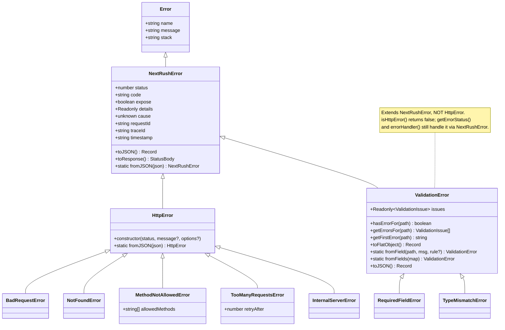
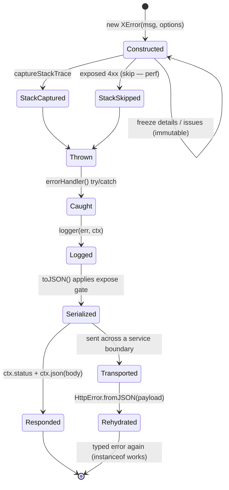

# @nextrush/errors — Architecture

> Internal design of the `NextRushError` → `HttpError` / `ValidationError` hierarchy, the `expose` privacy boundary, `cause`-chain serialization, and the middleware that turns a thrown error into a consistent, client-safe JSON response.

## At a glance

|  |  |
| --- | --- |
| **Package** | `@nextrush/errors` |
| **Layer** | `errors` (above `types`, below `core`) |
| **Depends on** | `@nextrush/types` (types only, used by the middleware; erased at build) — no third-party runtime deps |
| **Depended on by** | `@nextrush/core`, `@nextrush/router`, `@nextrush/class`, `@nextrush/*` middleware, adapters, the `nextrush` meta package |
| **Public entry** | `src/index.ts` (barrel — exports only) |
| **Internal modules** | 7 files · 1,518 LOC · largest `http-errors.ts` 415 LOC, `base.ts` 307 LOC (both a flat catalog of one-liner classes — above the 300 target; see Contributor notes) |
| **On the request hot path?** | **Partial** — `errorHandler()` wraps every request in a `try/catch`; error *construction* only happens on the failure path |
| **Runtime coupling** | None — native `Error` + Web-standard JavaScript; `Error.captureStackTrace` is feature-detected |
| **State model** | Stateless — errors are per-throw value objects; the middleware holds only closed-over options |

## Responsibilities

**This package owns:**

- ✓ The **error type hierarchy** — `NextRushError`, `HttpError`, the 39 concrete HTTP classes, and the `ValidationError` family
- ✓ **Serialization** — `toJSON()` / `toResponse()` and the exposure rules that decide what reaches the client
- ✓ The **`expose` privacy boundary** — hiding 5xx messages, `details`, and `cause` from clients by default
- ✓ The **canonical code registry** (`ERROR_CODES` / `codeForStatus`) — one machine code per status
- ✓ **Error-handling middleware** — `errorHandler()` (catch + log + serialize) and `notFoundHandler()`
- ✓ **Cross-boundary transport** — `fromJSON()` rehydration of a typed error from a serialized payload

**This package does NOT own:**

- ✗ Sending the response — it builds the body; `ctx.json()` / the adapter writes it (`@nextrush/core`, `@nextrush/adapter-*`)
- ✗ The middleware **execution engine** (`compose`, `ctx.next()`) → `@nextrush/core`
- ✗ Deciding *when* to throw — that's the application handler's business logic
- ✗ Producing validation issues from a schema → `@nextrush/validation` (it may throw a `ValidationError`, but the schema logic lives there)

## Non-goals

The package intentionally does not:

- Log to a transport of its own — `errorHandler()` calls a pluggable `logger`; it does not own a logging stack
- Retry, circuit-break, or otherwise recover from errors — it classifies and serializes them
- Map framework-external error types (ORM/driver errors) automatically — the handler maps those to an `HttpError`
- Localize or template messages — messages are plain strings

## Constraints

Must remain:

- **Runtime-independent** — native `Error` and Web-standard JavaScript only; no `node:*` / `process` / runtime globals
- **Zero third-party dependency** — a types-only dependency on `@nextrush/types`
- **ESM-only** — no CommonJS build
- **Client-safe by default** — a new 5xx error must not leak its message or internals without an explicit `expose`
- **Public API sealed** — the exported surface is semver-guarded (ADR-0005)

## Position in the package hierarchy

```mermaid
flowchart TB
    types --> errors --> core --> router --> runtime --> di --> class
    class --> adapters["adapter-*"] --> middleware["middleware / extensions"]
    errors:::here
    classDef here fill:#2563eb,color:#fff,stroke:#1e40af;
```

> [!IMPORTANT]
> Imports flow **downward only**. `@nextrush/errors` imports from `@nextrush/types` and MUST NOT be
> imported by `types` (project-rules §1). It sits low in the stack precisely so every higher
> package — `core`, `router`, middleware, adapters — can throw and recognize the same error types.

**Dependency rules:**
- **Allowed:** `errors → types`
- **Forbidden:** `errors → core / router / runtime / di / class / adapters / middleware` (any higher or sibling layer)

---

## Overview

The package answers one question consistently on the error path: *given something was thrown, what status, body, and log entry should result — without leaking anything the client shouldn't see?* The single organizing idea is that **an error is a value object that carries its own HTTP contract**. A thrown error already knows its `status`, its machine `code`, whether its message is safe to `expose`, and how to serialize itself — so the middleware that catches it is a thin coordinator, not a decision engine.

Two inheritance roots express that idea. `NextRushError` is the base value object: it holds the contract fields and owns `toJSON()` / `toResponse()` / `fromJSON()`. `HttpError` specializes it with a status-first constructor and code resolution through the registry, and the 39 concrete status classes are one-line subclasses of `HttpError` that fix a status, a default message, and a canonical code. `ValidationError` is the deliberate exception: it extends `NextRushError` **directly** — not `HttpError` — because a validation failure is a structured, multi-issue error whose serialization differs (it emits an `issues` array and strips `received`), and modeling it as one more 4xx would force the wrong shape.

`errorHandler()` closes the loop. It wraps the downstream chain in a `try/catch`, logs through a pluggable logger (5xx as errors, 4xx as warnings), and — critically — delegates the response body to the error's own `toJSON()` rather than re-deriving the shape, so a subclass override (like `ValidationError`'s) can never drift out of sync with the middleware.

### Design principles

1. **The error carries its own contract.** `status` / `code` / `expose` / `details` are set at construction and are `readonly`; the middleware reads them rather than deciding them.
2. **Client-safe by default.** `expose` defaults to `status < 500`, so 5xx messages, `details`, and `cause` are hidden unless explicitly opted in — enforced in `toJSON()`, not by handler discipline.
3. **The error owns its serialization.** `errorHandler()` calls `err.toJSON()` for any `NextRushError`; subclass overrides (`ValidationError`) are the single source of truth for their shape.
4. **Immutable after construction.** `details` and validation `issues` are `Object.freeze`d snapshots, so a thrown error can't be mutated downstream (audit E-6).
5. **One code per status.** Both the typed classes and `createError()` resolve codes through the frozen `ERROR_CODES` registry; a CI test asserts they never diverge (audit E-4).
6. **Bounded, defensive `cause` walking.** `cause` chains are serialized to a fixed depth (`MAX_CAUSE_DEPTH = 5`) with a cycle guard, surfacing only `name`/`message`/`code` — and only on exposed errors (audit E-2).

---

## Module structure

```text
src/
├── index.ts        # Public API barrel (exports only, no implementation)
├── base.ts         # NextRushError + HttpError bases; toJSON/fromJSON/toResponse; cause serialization; status-message table
├── codes.ts        # ERROR_CODES registry, codeForStatus(), GENERIC_ERROR_CODE, VALIDATION_ERROR_CODE
├── http-errors.ts  # 39 concrete 4xx/5xx HttpError subclasses + the HttpErrorOptions type
├── validation.ts   # ValidationError + 7 field-specific subclasses; the ValidationIssue type
├── factory.ts      # createError() + per-status factory helpers; isHttpError / getErrorStatus / getSafeErrorMessage
└── middleware.ts   # errorHandler() + notFoundHandler(); ErrorHandlerOptions
```

### Module responsibilities

| Module | Responsibility (the one thing it owns) |
| ------ | -------------------------------------- |
| `base.ts` | The base value objects and all serialization — the exposure rules live here. |
| `codes.ts` | The single status→code mapping every construction path resolves through. |
| `http-errors.ts` | The concrete status classes; each fixes a status, default message, and code. |
| `validation.ts` | Structured, multi-issue validation errors with their own JSON shape. |
| `factory.ts` | Ergonomic construction (`createError`, `notFound()`) and the classification guards. |
| `middleware.ts` | The catch→log→serialize coordinator and the 404 fallback. |

## Component relationships

The inheritance graph — and the one deliberate asymmetry a contributor must not "fix":



`BadRequestError` … `NetworkAuthRequiredError` (39 classes total) all sit under `HttpError`; only a representative few are drawn. The validation subclasses (`RequiredFieldError`, `TypeMismatchError`, `RangeValidationError`, `LengthError`, `PatternError`, `InvalidEmailError`, `InvalidUrlError`) all preset a single-issue `ValidationError`.

---

## Lifecycle

### Throw → response (execution)

How a thrown error travels from a handler to the serialized body:

```mermaid
sequenceDiagram
    participant H as Route handler
    participant EH as errorHandler() middleware
    participant Log as logger
    participant Err as thrown error
    participant Ctx as Context

    H-->>EH: throw (propagates up the chain)
    EH->>EH: normalize to Error (wrap non-Error throws)
    EH->>Log: logger(err, ctx)  (5xx→error, 4xx→warn)
    opt custom handlers map
        EH->>EH: first instanceof match runs, then return
    end
    alt err is NextRushError (incl. HttpError, ValidationError)
        EH->>Err: err.toJSON()
        Err-->>EH: body (expose gate applied inside)
    else transform provided
        EH->>EH: transform(err, ctx)
    else unknown error
        EH->>EH: build generic body (status 500, hidden message)
    end
    opt includeStack
        EH->>EH: append err.stack lines to body
    end
    EH->>Ctx: ctx.status = status; ctx.json(body)
```

The ordering a reader would otherwise get wrong: `errorHandler()` **logs before it serializes**, so even a fully-hidden 5xx is observable server-side; and it delegates the body to `toJSON()` **before** falling back to a generic shape, so a subclass's serialization always wins. `notFoundHandler()` is the mirror image — it runs `await next()` first and only responds when nothing else did and `ctx.status === 404`.

### Error object lifecycle (state)



> [!NOTE]
> The `StackSkipped` transition is deliberate: `NextRushError` skips `Error.captureStackTrace` for
> exposed 4xx errors, because those are expected control-flow signals, not bugs — capturing a stack
> for every `404` adds cost with no diagnostic value.

## State ownership

| Owner | State it owns | Scope |
| ----- | ------------- | ----- |
| The error instance | `status`, `code`, `expose`, `details` (frozen), `cause`, `requestId`, `traceId`, `timestamp`, `issues` (frozen) | per-throw value object |
| `errorHandler` closure | `includeStack`, `logger`, `transform`, `handlers` | app — set once at registration |
| `Context` (owned by `core`) | `ctx.status`, the written response body | per request |
| `ERROR_CODES` (module) | the frozen status→code table | process — immutable constant |

There is no shared mutable state. Each error is an independent, frozen-after-construction value; the middleware only reads its closed-over options and the error's fields.

## Data structures

```ts
// The base value object. Every field is readonly — the HTTP contract is fixed at construction.
class NextRushError extends Error {
  readonly status: number;      // default 500
  readonly code: string;        // default 'INTERNAL_ERROR'
  readonly expose: boolean;     // default: status < 500  ← the privacy boundary
  readonly details?: Record<string, unknown>; // frozen snapshot (audit E-6)
  readonly cause?: unknown;                    // also passed to native Error for util.inspect
  readonly requestId?: string;  // correlation id, safe to surface (audit E-5)
  readonly traceId?: string;    // distributed-trace id (audit E-5)
  readonly timestamp?: string;  // ISO-8601, when supplied
}

// The public option bag (http-errors.ts) — what a handler passes when throwing.
interface HttpErrorOptions {
  code?: string;
  expose?: boolean;
  details?: Record<string, unknown>;
  cause?: unknown;
  requestId?: string;
  traceId?: string;
  timestamp?: string;
}

// A single validation issue (validation.ts). `received` is captured but STRIPPED at
// serialization so a rejected password/token value never round-trips to the client.
interface ValidationIssue {
  path: string;         // 'user.email' | 'items[0].name'
  message: string;
  rule?: string;        // 'required' | 'type' | 'range' | 'length' | 'pattern' | 'email' | 'url'
  expected?: unknown;
  received?: unknown;   // present in memory, omitted from toJSON()
}
```

The shape choices are deliberate: fields are `readonly` and `details`/`issues` are frozen so a thrown error is an immutable snapshot; `expose` is a first-class field (not inferred at serialization time) so the privacy decision is made once, at the throw site; and `ValidationIssue.received` exists for programmatic inspection but is deliberately excluded from `toJSON()` to avoid echoing sensitive input.

## Concurrency & edge behaviour

- **Shared, immutable:** `ERROR_CODES` (frozen), the status-message table, and the `errorHandler` options captured at registration. Safe to read concurrently without locks.
- **Per-throw, never shared:** each error instance is created at its throw site and frozen; there is no shared mutable per-request error state.
- **Non-`Error` throws:** `errorHandler()` wraps a thrown non-`Error` (`throw 'oops'`) in a real `Error` before handling, so the pipeline always operates on an `Error`.
- **`cause` cycles / depth:** `serializeCause()` guards against cyclic `cause` chains with a visited set and stops at `MAX_CAUSE_DEPTH = 5`, so a malformed or adversarial chain can't cause unbounded work.

> [!WARNING]
> `errorHandler()` catches errors thrown by **downstream** middleware and handlers — it must be
> registered **before** the routes it protects. An error thrown by middleware registered earlier in
> the chain than `errorHandler()` will not be caught by it.

## Trust boundaries

```text
handler / middleware throws (message + details + cause may contain internal detail)
   │
   ▼
NextRushError.toJSON() ── expose gate ── 5xx message → "Internal Server Error",   ← the boundary
   │                                     details/cause dropped unless exposed        this package enforces
   ▼
ValidationError.toJSON() ── strips `received` (no leaked input values)
   │
   ▼
ctx.json(body) → client  (only expose-approved fields cross)
```

The package treats an error's `message`, `details`, and `cause` as potentially internal. The `expose` flag is the enforced boundary: a non-exposed error surfaces only a generic message, `code`, and `status` to the client, while the full error (including `cause`, never gated) remains available to the server-side logger. `ValidationError` adds a second boundary — stripping each issue's `received` value so rejected inputs (passwords, tokens) are never echoed.

## Extension points

**Supported extension points:**

- **Custom error classes** — subclass `HttpError` (status-first) or `NextRushError` (full control) to add typed errors; they inherit the serialization and exposure rules.
- **`errorHandler()` options** — `logger` (route to a structured logging stack), `transform` (reshape the body), and `handlers` (per-error-type side effects) are the sanctioned hooks.
- **`toJSON()` override** — a subclass may override serialization (as `ValidationError` does); `errorHandler()` will honor it.

**Forbidden (sealed):**

- The **`expose` default rule** (`status < 500`) — changing it would silently alter what every existing error leaks; a breaking, RFC-gated change.
- The **`ERROR_CODES` values** for a given status — clients branch on these codes; they are a public contract.
- The **base `toJSON()` field names** (`error` / `message` / `code` / `status`) — the wire contract every consumer parses.

---

## Architectural invariants

These are part of the package's architecture. They do not change without an RFC:

- **An error carries its own HTTP contract** — `status`, `code`, `expose` are set at construction and are `readonly`.
- **`expose` defaults to `status < 500`** — 5xx messages/details/cause are hidden from clients by default.
- **`toJSON()` is the single source of truth for the response body** — `errorHandler()` delegates to it for any `NextRushError`.
- **One canonical code per status** — every construction path resolves through `ERROR_CODES`; classes and `createError()` never diverge (CI-asserted).
- **`details` and `issues` are frozen at construction** — a thrown error is an immutable snapshot.
- **`ValidationError.received` is never serialized** — rejected input values do not reach the client.
- **`cause` serialization is bounded and cycle-safe** — depth-limited (`MAX_CAUSE_DEPTH`), visited-set guarded, exposed-only.
- **The package imports no runtime API** — native `Error` + Web-standard JavaScript only, so every adapter behaves identically.

## Engineering decisions

| Decision | Chosen | Trade-off accepted | Reference |
| -------- | ------ | ------------------ | --------- |
| `ValidationError` base | Extends `NextRushError`, not `HttpError` | `isHttpError()` returns `false` for it; callers use `getErrorStatus()` / `instanceof NextRushError` | `validation.ts` |
| Code resolution | Central frozen `ERROR_CODES` registry | Class code strings must be kept in sync with the table (CI-enforced) | `codes.ts` (audit E-4) |
| Response serialization | Delegated to the error's `toJSON()` | The middleware can't centralize the shape; subclasses must override correctly | `middleware.ts` |
| Stack capture | Skipped for exposed 4xx | 4xx errors have no `stack` (acceptable — they're expected control flow) | `base.ts` |
| `cause` exposure | Serialized only on exposed errors, depth-bounded | A hidden 5xx's `cause` is available only via `error.cause` server-side | `base.ts` (audit E-2) |
| Immutability | `Object.freeze` on `details` / `issues` | A small construction-time cost | `base.ts` / `validation.ts` (audit E-6) |

## Rejected alternatives

### `ValidationError extends HttpError`
Rejected: it would force a validation failure into the plain `HttpError` shape and imply it *is* an HTTP-status error rather than a structured, multi-issue one. Extending `NextRushError` lets `ValidationError` own an `issues`-based `toJSON()` and strip `received`, while still resolving to `400` and flowing through `errorHandler()`. The cost — `isHttpError()` returns `false` for it — is documented and handled by the status/message utilities.

### Centralizing the response shape in the middleware
Rejected: if `errorHandler()` re-derived the body from an error's fields, every subclass override (like `ValidationError`'s `issues`) would silently drift out of sync. Delegating to `toJSON()` keeps the shape with the type that owns it.

### Inferring `expose` at serialization time
Rejected: computing exposure when the response is built spreads the privacy decision across the codebase. Fixing `expose` as a `readonly` field at construction makes the decision explicit and reviewable at the throw site.

---

## Testing strategy

- **Unit:** construction defaults (status/code/expose per class), `toJSON()` shape, the `expose` gate hiding 5xx detail, `ValidationError` issue helpers and `received`-stripping.
- **Registry invariant:** the `audit-fixes` suite asserts `createError(status).code === ERROR_CODES[status]` for every status, so a class/registry drift fails CI.
- **Serialization safety:** `cause`-chain depth limiting and cycle guarding; `fromJSON()` round-trips a typed error (`instanceof` restored).
- **Integration:** `errorHandler()` catching thrown errors, logger routing (5xx vs 4xx), `notFoundHandler()` fallback behavior, non-`Error` throw wrapping.
- **Cross-adapter parity:** N/A directly — the package uses no runtime API; adapter parity is proven in `packages/adapters/conformance`.
- **Coverage:** ≥90% lines/functions (CI-enforced).

## Evolution strategy

- **Stable (semver-guarded):** the sealed public surface — the error classes, factory helpers, middleware, `ERROR_CODES`, `codeForStatus`, and the option/data types (ADR-0005).
- **May change without notice:** internal module layout, `serializeCause` internals, the private `hydrate` helper, `MAX_CAUSE_DEPTH`.
- **Changes only via RFC:** the `expose` default rule, the `ERROR_CODES` values, the base `toJSON()` field names, and the `NextRushError`/`HttpError`/`ValidationError` inheritance shape.

**Timeline:** `3.0` — `HttpError` hierarchy, factory helpers, `errorHandler()` → `3.1` — audit hardening: central `ERROR_CODES` registry + `codeForStatus`, correlation ids (`requestId`/`traceId`/`timestamp`), bounded/cycle-safe `cause` serialization, `fromJSON()` cross-boundary rehydration, frozen `details`/`issues`.

## Contributor notes

Before changing this package, read: [ADR-0005 (package tiers & sealed surface)](https://github.com/0xTanzim/nextRush/blob/main/docs/adr/ADR-0005-package-tiers-sealed-surface-deprecation.md), the `codes.ts` registry and its CI drift test, and the `base.ts` serialization/exposure logic. Two files (`http-errors.ts` at 415 LOC, `base.ts` at 307 LOC) sit above the 300-LOC target: `http-errors.ts` is an intentional flat catalog of one-line status classes (splitting it by status range is the sanctioned option if it grows), and `base.ts` concentrates the serialization logic that the invariants depend on — do not scatter the exposure rules across modules to trim it.

## Architecture checklist

Before changing this package, confirm:

- [ ] Does this preserve the architectural invariants above (especially the `expose` default and the wire-contract field names)?
- [ ] Does a new/changed class resolve its `code` through `ERROR_CODES` (no drift)?
- [ ] Does any new serialization keep non-exposed detail server-side and strip sensitive values?
- [ ] Does this increase coupling or cross a dependency rule (`errors → types` only)?
- [ ] Does this change the sealed public API (semver / ADR-0005)? Does it need an RFC?

---

## References & see also

- **README (how to use it):** [`./README.md`](./README.md)
- **ADR:** [`ADR-0005 — package tiers & sealed surface`](https://github.com/0xTanzim/nextRush/blob/main/docs/adr/ADR-0005-package-tiers-sealed-surface-deprecation.md)
- **Documentation site:** [nextRush docs](https://0xtanzim.github.io/nextRush/docs)
- **Repository:** [`packages/errors`](https://github.com/0xTanzim/nextRush/tree/main/packages/errors)
