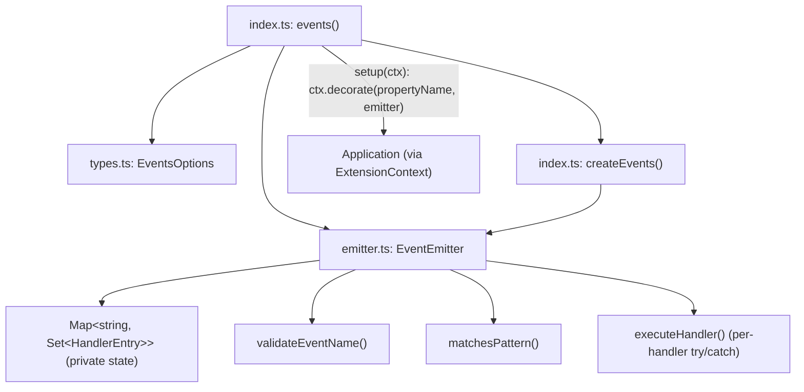
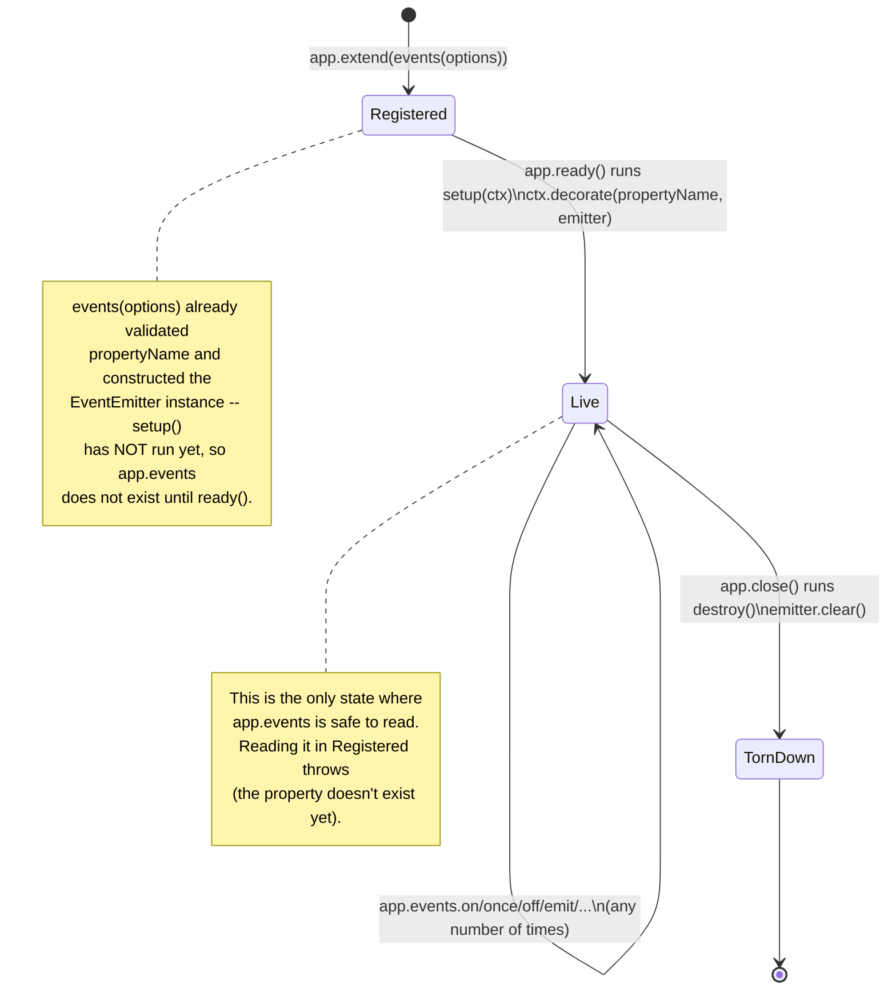
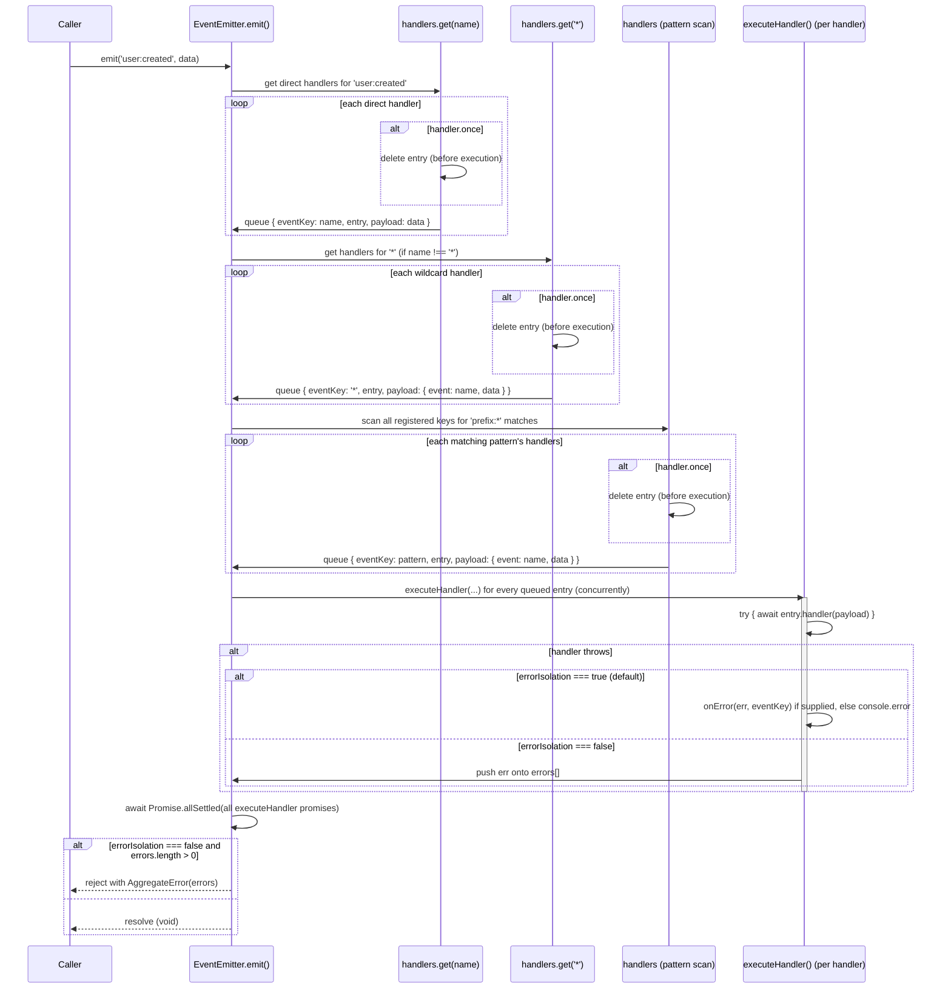

# @nextrush/events — Architecture

> Internal design of the type-safe event emitter and its NextRush Extension wrapper — how `emit()` fans out to direct, wildcard, and pattern handlers, and how the app's `extend()`/`ready()`/`close()` lifecycle boots and tears down `app.events`.

## At a glance

|  |  |
| --- | --- |
| **Package** | `@nextrush/events` |
| **Layer** | `extension` (above `core`; a leaf — nothing in the framework depends on it) |
| **Depends on** | none as a hard runtime dependency; `@nextrush/core` is an optional peer, used only because `events()`'s return type references the `Extension`/`ExtensionContext` interfaces declared in `@nextrush/types` (and re-exported by `@nextrush/core`) |
| **Depended on by** | Application code that calls `app.extend(events())`; not depended on by any other `@nextrush/*` package |
| **Public entry** | `src/index.ts` (barrel + the `events()`/`createEvents()` factories and the `WithEvents<T>` helper — the one package in this batch where the barrel also holds implementation, see Engineering decisions) |
| **Internal modules** | 3 files (excl. tests) — `types.ts` (186 LOC), `emitter.ts` (450 LOC), `index.ts` (208 LOC); `emitter.ts` exceeds the 300-line middleware/extension cap in `architecture.instructions.md` — logged honestly below, not hidden |
| **On the request hot path?** | Only if application code calls `app.events.emit(...)` from inside a request handler — the package itself has no request-path code; `EventEmitter` is a general-purpose pub/sub primitive with no HTTP awareness |
| **Runtime coupling** | Low, not zero — no `node:*` imports and no hard dependency on any Node built-in module; the emitter's core logic uses only `Map`, `Set`, `Promise`, and the standard `AggregateError` constructor, but `executeHandler()`'s error-logging path also reads the bare global `process` defensively (`typeof process === 'undefined' || process.env.NODE_ENV !== 'test'`) to suppress console noise during this package's own test run — see Concurrency & edge behaviour and the README's Compatibility section |
| **State model** | App-scoped, singleton per `events()` call — one `EventEmitter` instance decorated onto the app at `setup()`, shared by every caller of `app.events` for the app's lifetime |

## Responsibilities

**This package owns:**

- ✓ A type-safe, async-ready pub/sub event emitter (`EventEmitter<T>`) — subscribe, unsubscribe, emit, wildcard/pattern matching, error isolation
- ✓ The NextRush Extension wrapper (`events()`) that decorates an `EventEmitter` onto the app as `app.<propertyName>` (default `app.events`) and tears it down on `app.close()`
- ✓ A standalone factory (`createEvents()`) for using the emitter with no NextRush app at all
- ✓ Event-name validation (non-empty string, length cap) and `propertyName` validation (must be a valid JS identifier)

**This package does NOT own:**

- ✗ The Extension lifecycle mechanics themselves (`extend()`'s registration queue, `ready()`'s boot-once memoization, `close()`'s reverse-order teardown) → `@nextrush/core`'s `Application` class
- ✗ Cross-process or cross-service event delivery → out of scope entirely; see Non-goals
- ✗ Request/response handling, middleware composition (`ctx.next()`) → `@nextrush/core`
- ✗ Persisting or replaying past events → this emitter has no event log; a missed subscriber never receives a past emission

## Non-goals

The package intentionally does not:

- Provide cross-process, cross-service, or durable messaging — this is an in-process, in-memory emitter; a dropped process loses every handler that hadn't yet run. Reach for a real broker (queue, Redis pub/sub) for that.
- Implement backpressure, buffering, or an event log — `emit()` fans out to whatever handlers are registered *at the moment it's called*; a handler registered after `emit()` resolved never sees that emission.
- Guarantee handler execution order across mixed direct/wildcard/pattern matches — order is insertion order *within* each of those three groups, but the groups themselves are collected and dispatched in the fixed sequence direct → wildcard → pattern (see Lifecycle), not interleaved by registration time.
- Support removing a handler mid-`emit()` from another handler in a way that changes the running emission — `emit()` snapshots which handlers to execute for wildcard/pattern groups from a live `Map`/`Set`, iterated but not defensively copied wholesale; see Concurrency & edge behaviour for the specific safety guarantee that *is* provided (`once` removal) versus what is not guaranteed (a handler removing a *different, not-yet-run* handler mid-emit).

## Constraints

Must remain:

- **No `node:*` module imports, but not fully runtime-independent** — every primitive the emitter's dispatch logic uses (`Map`, `Set`, `Promise.allSettled`, `AggregateError`) is a standard JavaScript global available on Node, Bun, Deno, and every edge runtime this framework targets. The one exception is `executeHandler()`'s error-logging branch, which reads the bare global `process` defensively to suppress console noise during this package's own Node-based test run; it degrades safely if `process` is undefined, but this package has no conformance test proving identical behavior on Bun/Deno/edge (see Concurrency & edge behaviour)
- **Zero hard runtime dependency** — `@nextrush/core` is declared as an optional peer (`peerDependenciesMeta.optional: true`), never a hard `dependencies` entry
- **`emit()` never throws synchronously** — every handler invocation is wrapped so a thrown error either gets isolated (default) or collected into an `AggregateError` thrown only after every handler has settled, never mid-iteration
- **Public API sealed** — the exported surface is semver-guarded (ADR-0005), locked by `__tests__/public-surface.test.ts`

## Position in the package hierarchy

```mermaid
flowchart TB
    types["@nextrush/types"] --> errors["@nextrush/errors"] --> core["@nextrush/core"]
    core --> router["@nextrush/router"] --> runtime["@nextrush/runtime"] --> di["@nextrush/di"] --> class["@nextrush/class"]
    class --> adapters["adapter-node / bun / deno / edge"] --> extensions["middleware / extensions"]
    THIS["@nextrush/events — this package"]:::here
    extensions --> THIS
    core -.->|"re-exports Extension / ExtensionContext\nfrom @nextrush/types; optional peer,\nnot a hard dependency"| THIS
    classDef here fill:#2563eb,color:#fff,stroke:#1e40af;
```

> [!IMPORTANT]
> Imports flow **downward only**. `@nextrush/events` may reference `Extension`/`ExtensionContext`
> types (declared in `@nextrush/types`, re-exported by `@nextrush/core`, an optional peer) and MUST
> NOT be imported by `types`, `errors`, `core`, `router`, `class`, or any adapter (project-rules
> §1). The `EventEmitter` class and `createEvents()` factory have zero dependency on
> `@nextrush/core` at all — only the `events()` Extension factory's *type* signature references
> `Extension`/`ExtensionContext` (imported directly from `@nextrush/types` in `index.ts`, not from
> `@nextrush/core`), and even that import is `import type`, erased at build time.

**Dependency rules:**
- **Allowed:** `events → @nextrush/core` (type-only, optional peer)
- **Forbidden:** `events → router / class / adapters / any middleware package` as a static import

---

## Overview

`@nextrush/events` has two layers that meet at one seam: `EventEmitter<T>` (`emitter.ts`), a self-contained, framework-agnostic pub/sub class with no knowledge that NextRush exists, and `events()` (`index.ts`), a thin Extension wrapper that instantiates one `EventEmitter` and decorates it onto an app. The seam is `ctx.decorate(propertyName, emitter)` inside `setup()` — everywhere else in the emitter itself, there is no `Application`, no `Middleware`, no HTTP concept at all.

The organizing idea is that the emitter is the product; the Extension is packaging. `createEvents()` and `new EventEmitter()` work identically whether or not a NextRush app exists, which is why the package's tests exercise the emitter directly far more than they exercise the Extension wrapper — the wrapper's only real behavior is "validate the property name, decorate on `setup()`, clear on `destroy()`."

### Design principles

1. **The emitter has no framework coupling.** Enforced by `emitter.ts`'s own imports — it imports only from `./types` (its own sibling file), never from `@nextrush/core` or any `Application`-shaped interface. `createEvents()` in `index.ts` is a one-line `new EventEmitter<T>(options)` call, proving the emitter needs nothing an Extension provides.
2. **`once` removal happens before execution, not after.** `emit()`'s three collection loops (direct, wildcard, pattern) each call `handlers.delete(entry)` for a `once`-flagged entry *before* pushing it onto `handlersToExecute` — enforced by reading the literal order of operations in `emitter.ts`'s `emit()` method, not by a comment asserting it.
3. **A handler error never stops the fan-out.** `executeHandler()`'s `try`/`catch` wraps every single handler invocation individually; `emit()` calls `Promise.allSettled(promises)`, not `Promise.all`, so one rejected promise can never short-circuit the others.
4. **The Extension's decorated shape is inferred, not declared.** `events<T>()`'s return type is `Extension<{ events: EventEmitter<T> }>`; `Application.extend()` (in `@nextrush/core`) merges that `TDecorated` generic into its own return type via `this & TDecorated`, so `app.events` resolves through TypeScript inference with zero `declare module` augmentation — enforced by the `Extension<TDecorated>` phantom-property mechanism documented in `@nextrush/types`'s `extension.ts`.

---

## Module structure

```text
src/
├── index.ts        # Public API: events() Extension factory, createEvents(), WithEvents<T>, re-exports
├── emitter.ts       # EventEmitter<T> — the concrete pub/sub implementation
├── types.ts         # EventHandler, EventMap, TypedEventEmitter, EventEmitterOptions, constants
└── __tests__/       # public-surface.test.ts, events.test.ts
```

### Module responsibilities

| Module | Responsibility (the one thing it owns) |
| ------ | -------------------------------------- |
| `types.ts` | The public type/interface/constant contracts — no logic beyond the two exported constants (`MAX_EVENT_NAME_LENGTH`, `VALID_PROPERTY_NAME`) and their default-options object. |
| `emitter.ts` | The entire pub/sub implementation: `on`/`once`/`off`/`prepend`/`prependOnce`, `emit`'s three-group dispatch, wildcard/pattern matching, `maxListeners` warnings, error isolation vs. `AggregateError`. |
| `index.ts` | The Extension wrapper (`events()`), the standalone factory (`createEvents()`), the `WithEvents<T>` type helper, and the package's re-exports. |

> [!NOTE]
> `emitter.ts` is 450 lines, well over the 300-line hard cap `architecture.instructions.md` sets
> for extension packages. This is disclosed here rather than silently patched — the class's
> surface (12 public methods: `on`, `once`, `off`, `prepend`, `prependOnce`, `emit`,
> `listenerCount`, `clear`, `eventNames`, `listeners`, `hasListeners`, `setMaxListeners`,
> `getMaxListeners`) and its heavy per-method JSDoc with runnable `@example` blocks (matching this
> package's existing documentation density) account for most of the overage — the executable logic
> itself is a small fraction of the file. Splitting `emit()`'s three dispatch groups and the
> private helpers (`addHandler`, `executeHandler`, `matchesPattern`) into a separate module is a
> plausible future refactor, logged here as a maintainer follow-up, not resolved in this
> documentation pass (pre-existing code, out of scope for a docs-only change per the wave brief).

## Component relationships



`index.ts` is the only module that ever touches an `Application`-shaped object (through `ExtensionContext`, structurally, not a concrete import) — `emitter.ts` never does.

---

## Lifecycle

This package has two lifecycles worth diagramming precisely, and they are genuinely different
shapes: the app-scoped **Extension boot/teardown lifecycle** (a real state machine — an
`EventEmitter` instance is either not yet decorated, live, or torn down, and those transitions
happen exactly once each, driven by the host `Application`) and the **per-call emit-to-dispatch
sequence** (not a state machine — every `emit()` call runs the same fixed sequence of steps
against whatever handlers happen to be registered at that moment).

### Extension boot/teardown lifecycle

The states an `events()`-created `EventEmitter` instance passes through, driven entirely by the
host `Application`'s `extend()` / `ready()` / `close()` calls — this package implements the `setup()`
and `destroy()` transitions, but does not control *when* they fire:



**The transition a reader would otherwise miss:** `events(options)` — the factory call itself, before `app.extend()` even receives it — already constructs the `EventEmitter` and validates `propertyName` (throwing `TypeError` synchronously if invalid). `Registered` therefore already holds a fully-formed emitter in memory; `Live` only adds the app decoration that makes `app.events` resolvable. A `TypeError` from an invalid `propertyName` is thrown at the `events(...)` call site, not deferred to `app.ready()`.

### Emit-to-dispatch sequence

The path one `app.events.emit(name, data)` call takes — covering the three handler groups
(direct, wildcard, pattern-matched) and both the error-isolated and strict (`AggregateError`)
outcomes:



The fact both diagrams together make explicit: **removal of a `once` handler is synchronous and happens during collection, before any handler runs** — so two concurrent `emit()` calls racing on the same `once` handler both see it removed by the time either one reaches the execution phase, and it fires exactly once total, never zero, never twice.

## State ownership

| Owner | State it owns | Scope |
| ----- | -------------- | ----- |
| `Application` (external, `@nextrush/core`, implementing the `Extension`/`ExtensionContext` contract declared in `@nextrush/types`) | The Extension registration queue, boot/teardown timing (`ready()`/`close()`), the `app.events` decoration slot itself | app |
| `EventEmitter` instance (this package) | `handlers: Map<string, Set<HandlerEntry>>` — every subscription, keyed by event name or wildcard/pattern string | app (one instance per `events()` call, shared by every caller of `app.events`) |
| `EventEmitter` instance | `options.maxListeners`, `options.errorIsolation`, `options.onError` | app (mutable at runtime via `setMaxListeners()`; the other two are set at construction and never exposed for mutation) |
| Local variables inside `emit()` (`handlersToExecute`, `promises`, `errors`) | The in-progress dispatch state for one `emit()` call | function-call scope — discarded once `emit()` resolves or rejects |

## Concurrency & edge behaviour

- **Shared, mutable for the app's lifetime:** the `handlers` `Map` — every `on`/`once`/`off`/`prepend` call mutates it; there is no locking, because JavaScript's single-threaded event loop makes each individual `Map`/`Set` mutation atomic between `await` points.
- **Per-`emit()`-call, never shared:** `handlersToExecute`, `promises`, `errors` — fresh arrays allocated at the top of every `emit()` invocation.
- **Race safety guarantee (`once`):** removal happens synchronously during the collection loop, before the corresponding handler is invoked — this is the one race condition this package explicitly designs against and tests (`events.test.ts`'s concurrent-emit test for `once`).
- **Race condition NOT guarded against:** if handler A (registered before handler B on the same event) calls `off` to remove handler B while A is executing, B — if it was already collected into `handlersToExecute` for this `emit()` call before A ran — still executes; `emit()` snapshots which handlers to run from the live `Map`/`Set` at collection time, not at the moment each handler actually runs. This is a deliberate simplicity trade-off (see Engineering decisions), not an oversight.
- **Idempotency:** `emit()` has no built-in deduplication — calling it twice with identical arguments runs every handler twice; idempotency, if needed, is the caller's responsibility.
- **Abort / disconnect:** N/A — this package has no request/response or streaming concept; a handler that never resolves leaves its slot in `Promise.allSettled` pending, which delays (but does not fail) the overall `emit()` promise.
- **Cross-runtime edge case (`process` global):** `executeHandler()`'s error-isolation branch (`emitter.ts:424`) checks `typeof process === 'undefined' || process.env.NODE_ENV !== 'test'` before calling `console.error` on an isolated handler error — this exists to keep the test suite's expected-error tests quiet, not as a feature. It reads `process`, a Node-specific global, but degrades safely by construction: the check is a `typeof` guard, so on any runtime where `process` is not defined as a global, `typeof process === 'undefined'` evaluates to `true`, the branch still logs the error, and nothing throws. This package makes no claim about which non-Node runtimes do or don't expose `process` — no conformance test in this repo exercises that fallback on a non-Node runtime, so treat "identical behavior everywhere" as unverified for this one branch, not a guaranteed invariant.

> [!WARNING]
> `destroy()` (called at `app.close()`) runs `emitter.clear()` with no argument, which removes
> **every** handler for **every** event, regardless of which `events()` registration added them.
> If application code somehow shares one `EventEmitter` instance across multiple `events()`
> registrations (not the documented usage pattern), closing the app clears all of them at once.

## Trust boundaries

```text
Application code (trusted -- your own handlers and emit() call sites)
   │
   ▼
EventEmitter.emit(event, data)  <- this package's only external input surface
   │
   ▼
validateEventName() -- type + length check on the event NAME only
   │
   ▼
handler invocation -- the `data` payload itself is passed through verbatim, never inspected
```

This package validates the *event name* (must be a non-empty string, <=256 chars) but performs **no validation on the event `data` payload** — `data: T[K]` is passed to every handler exactly as the caller supplied it. This is correct for its scope: `EventEmitter` is an in-process pub/sub primitive between trusted application code, not a boundary between untrusted client input and business logic. An application emitting `ctx.body` (unsanitized request data) directly as event payload is responsible for validating that data itself, the same way it would before passing it to any other internal function.

## Extension points

**Supported extension points:**

- **`onError`** — the sanctioned way to route isolated handler errors to structured logging instead of the default `console.error`.
- **`propertyName`** — the sanctioned way to decorate the app under a name other than `events` (e.g. avoiding a collision with another Extension).
- **Wildcard (`'*'`) and pattern (`'prefix:*'`) subscriptions** — the sanctioned way to observe a whole category of events without listing each one individually.

**Forbidden (sealed):**

- **Reaching into `handlers` (the private `Map`) directly** — there is no public API for it; all interaction goes through `on`/`once`/`off`/`emit`/`listeners`/etc.
- **Adding cross-process delivery to this package** — see Non-goals; a durable/distributed event system is a different package's job, not a feature to bolt onto this in-process emitter.
- **Making `emit()` throw synchronously** — see Constraints; every failure path resolves through the returned `Promise`, either as a rejection (`AggregateError`, strict mode only) or silently isolated (default).

---

## Architectural invariants

The following are part of the package architecture. They do not change without an RFC:

- **`EventEmitter` has zero framework coupling** — it imports nothing from `@nextrush/core` or any `Application`-shaped type.
- **`emit()` never throws synchronously and never rejects because of a handler error unless `errorIsolation: false` was explicitly set.**
- **A `once` handler fires exactly once, even under concurrent `emit()` calls** — removal happens before execution, in the same synchronous collection pass.
- **`destroy()` clears every handler** — `app.close()` always leaves a torn-down `events()` Extension's emitter with zero remaining subscriptions.
- **The public API is explicit and sealed** — locked by `__tests__/public-surface.test.ts` (ADR-0005).

## Engineering decisions

| Decision | Chosen | Trade-off accepted | Reference |
| -------- | ------ | ------------------- | --------- |
| Framework coupling | `EventEmitter` has none; only the `events()` wrapper touches `Extension`/`ExtensionContext` | Two things to learn (the emitter, and the thin wrapper) instead of one, in exchange for the emitter being independently useful/testable with zero NextRush dependency | `emitter.ts` (no `@nextrush/*` imports) vs. `index.ts` (`import type { Extension, ExtensionContext } from '@nextrush/types'`) |
| `emit()` handler collection | Snapshot which handlers to run at collection time, before any handler executes, rather than re-reading the live `Map`/`Set` mid-dispatch | A handler removed by another handler *during* the same `emit()` call may still run if it was already collected — simpler and more predictable than trying to make late removal retroactive | `emitter.ts`'s `emit()` — three sequential collection loops, then one execution loop over the combined `handlersToExecute` array |
| Error handling default | `errorIsolation: true` — isolate by default, `AggregateError` only opt-in | A silently-swallowed handler error (unless `onError` is supplied) is possible by default, in exchange for one broken subscriber never being able to take down every other subscriber to the same event | `types.ts` (`DEFAULT_EMITTER_OPTIONS.errorIsolation: true`) |
| `@nextrush/core` dependency shape | Optional peer dependency, referenced only via `import type` | Consumers of `createEvents()`/`EventEmitter` alone never need `@nextrush/core` installed at all; only `events()`'s type signature needs the types to exist | `package.json` (`peerDependenciesMeta.@nextrush/core.optional: true`) |

## Rejected alternatives

### Making `EventEmitter` extend or wrap Node's `events.EventEmitter`
Rejected: Node's built-in emitter is synchronous, untyped, and Node-only — adopting it as a base would violate this package's zero-`node:`-import, universal-runtime constraint and its typed-events design goal simultaneously. A from-scratch implementation was chosen instead, accepting the cost of reimplementing subscribe/unsubscribe/dispatch rather than inheriting a battle-tested base.

### Re-collecting handlers to run on every dispatch, live, instead of snapshotting
Rejected: re-reading the `Map`/`Set` at the moment each handler is about to run (rather than snapshotting once at the top of `emit()`) would make `once` removal safe against a *different* class of race but would also mean a handler added by another handler mid-`emit()` could unpredictably run or not run within the same emission, depending on iteration timing. The current snapshot-once design was chosen for predictability: what runs in a given `emit()` call is fixed at the moment `emit()` is called, not while it's running.

---

## Testing strategy

- **Unit:** `events.test.ts` covers `on`/`once`/`off`/`prepend`/`prependOnce`, wildcard (`'*'`) and pattern (`'user:*'`) matching, `maxListeners` warnings (including the disable-at-`0` case), `setMaxListeners`/`getMaxListeners` validation (`RangeError` on negative/non-integer), error isolation with a custom `onError`, and the strict-mode `AggregateError` path (asserted via `rejects.toBeInstanceOf(AggregateError)`).
- **Integration:** the `events({ propertyName: 'bus' })` case exercises `setup(ctx)` against a real `ExtensionContext`-shaped object, confirming the decoration happens under the custom name.
- **Invariant tests:** the concurrent-`emit()`-with-`once` test directly guards the "fires exactly once" invariant by racing `Promise.all([emit(), emit(), emit()])` against a single `once` handler and asserting exactly one invocation.
- **Public-surface test:** `__tests__/public-surface.test.ts` asserts the exported runtime symbol list (`EventEmitter`, `VERSION`, `createEvents`, `events`, `DEFAULT_EMITTER_OPTIONS`, `MAX_EVENT_NAME_LENGTH`, `VALID_PROPERTY_NAME`) and the type-only surface stay in sync with the sealed surface (ADR-0005).
- **Conformance / cross-adapter parity:** N/A — this package has no adapter-specific behavior; it uses no runtime API that could differ across Node/Bun/Deno/Edge.
- **Coverage:** >=90% lines/functions (CI-enforced).

## Evolution strategy

- **Stable (semver-guarded):** `events()`, `createEvents()`, `EventEmitter`, `WithEvents<T>`, and every exported type/constant (ADR-0005).
- **May change without notice:** the internal `addHandler`/`executeHandler`/`matchesPattern` private methods on `EventEmitter`, as long as the observable `on`/`once`/`off`/`emit`/wildcard/pattern behavior is preserved.
- **Changes only via RFC:** the "emitter has zero framework coupling" architecture, the error-isolation-by-default policy, and the snapshot-at-collection-time dispatch model.

**Timeline:** 1.0 — initial release: typed emitter, wildcard/pattern subscriptions, error isolation + strict `AggregateError` mode, `prepend`/`prependOnce`, the Extension wrapper with custom `propertyName` support.

## Contributor notes

Before changing this package, read `packages/types/src/extension.ts` for the full
`Extension`/`ExtensionContext` contract `events()` implements against — it is the single source
of truth for the Extension lifecycle (`setup`/`destroy`/`needs`) this package participates in but
does not own. If you're touching `emit()`'s dispatch order (direct → wildcard → pattern), read the
Rejected alternatives section above first — the snapshot-at-collection-time behavior is a
deliberate trade-off, not an implementation detail free to change.

## Architecture checklist

Before changing this package, confirm:

- [ ] Does this preserve the architectural invariants above (especially "emit() never throws synchronously" and "once fires exactly once under concurrency")?
- [ ] Does this increase coupling — specifically, does it add an import from `emitter.ts` to any `@nextrush/*` package (it currently has none)?
- [ ] Does this affect a hot path (an application calling `emit()` from inside a request handler)?
- [ ] Does this change the sealed public API (semver / ADR-0005)? Does it need an RFC?
- [ ] If this touches `emitter.ts`, does the file stay under (or move back toward) the 300-line cap rather than growing further past it?

---

## References & see also

- **README (how to use it):** [`./README.md`](./README.md)
- **ADR:** [`ADR-0005 — package tiers & sealed surface`](https://github.com/0xTanzim/nextRush/blob/main/docs/adr/ADR-0005-package-tiers-sealed-surface-deprecation.md)
- **Extension contract:** `packages/types/src/extension.ts` (`Extension`, `ExtensionContext`, `ExtensionHost`)
- **Governing RFC:** `docs/RFC/class-runtime/005-plugin-system.md` (referenced directly in `extension.ts`'s own doc comment)
- **Documentation site:** [nextRush docs](https://0xtanzim.github.io/nextRush/docs)
- **Repository:** [`packages/extensions/events`](https://github.com/0xTanzim/nextRush/tree/main/packages/extensions/events)
