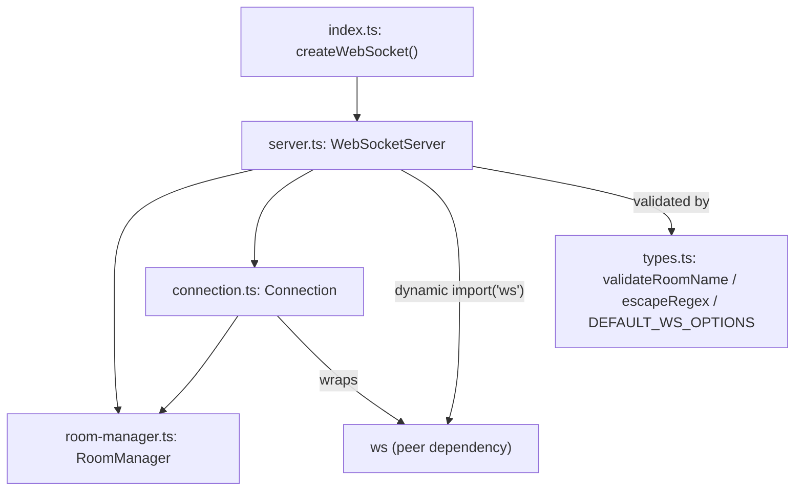
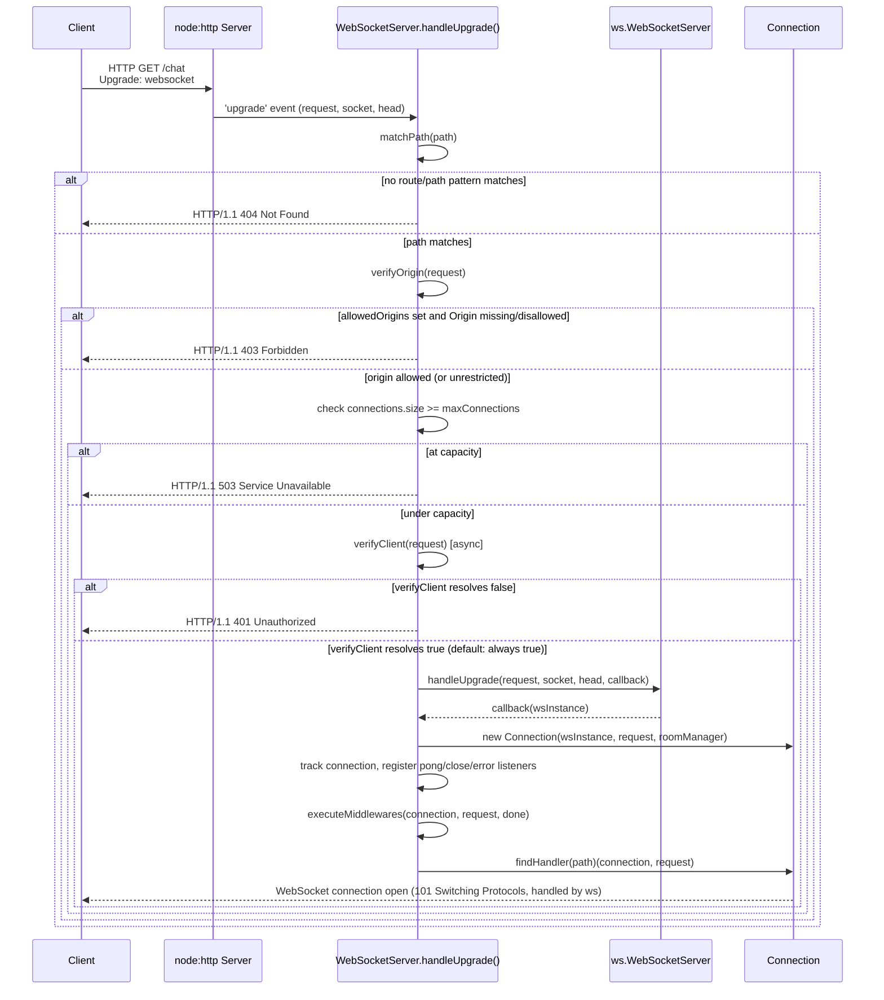

# @nextrush/websocket — Architecture

> Internal design of the Node-only WebSocket server: the HTTP-upgrade handshake, room-based
> broadcasting, heartbeat/timeout detection, and why this package is a factory + Middleware pair
> rather than a NextRush Extension.

## At a glance

|  |  |
| --- | --- |
| **Package** | `@nextrush/websocket` |
| **Layer** | `extension` in name and directory (`packages/extensions/websocket`), but structurally a factory + Middleware pair — see "Why not an Extension" below |
| **Depends on** | `@nextrush/types` (workspace, runtime dependency -- also the source of the `Extension`/`ExtensionContext` types `createWebSocketExtension()` implements); `ws` (peer dependency, `^8.0.0`) |
| **Depended on by** | Application code that calls `createWebSocket()` or `createWebSocketExtension()`; not depended on by any other `@nextrush/*` package |
| **Public entry** | `src/index.ts` (barrel — the `createWebSocket()` factory plus re-exported types/classes/constants) |
| **Internal modules** | 4 files (excl. tests) — `types.ts` (271 LOC), `connection.ts` (168 LOC), `room-manager.ts` (214 LOC), `server.ts` (537 LOC); `server.ts` is well over the 300-line extension cap in `architecture.instructions.md` — logged honestly below, not hidden |
| **On the request hot path?** | No for the HTTP request path — `upgrade()`'s returned Middleware is a no-op passthrough (`await next()`); yes for the WebSocket message path once a connection is open (`connection.ts`'s `send`/`on('message')`) |
| **Runtime coupling** | Node-only, not behind an adapter — imports `node:http`'s `IncomingMessage`/`Server` types, `node:net`'s `Socket` type, and dynamically `import('ws')` at `attach()` time |
| **State model** | App-scoped for the server itself (one `WebSocketServer` instance holds all connections/rooms/routes); per-connection for room membership and heartbeat liveness |

## Responsibilities

**This package owns:**

- ✓ The `ws`-library-backed WebSocket server (`WebSocketServer` class) — route registration (`on`), middleware (`use`), and the raw HTTP `'upgrade'` event handling once `attach()` is called
- ✓ The HTTP-upgrade handshake gate: path matching, origin verification, connection-limit enforcement, and custom `verifyClient` authentication — all run, in that order, before `ws`'s own `handleUpgrade()` is invoked
- ✓ Per-connection room membership (`RoomManager`) — join/leave/broadcast, with a room-count ceiling per connection and room-name validation
- ✓ Heartbeat-based dead-connection detection (ping every `heartbeatInterval` ms, terminate if no pong within one interval)
- ✓ A typed `Connection` wrapper (`WSConnection`) over the raw `ws` socket — `send`/`json`/`close`/`join`/`leave`/`broadcast`/event registration

**This package does NOT own:**

- ✗ The HTTP server itself, or deciding when the `'upgrade'` event fires — owned by Node's `node:http` `Server`, obtained externally (e.g. from `@nextrush/adapter-node`'s `listen()`) and passed into `attach()`
- ✗ NextRush's request/response Context or middleware composition (`ctx.next()`) — `upgrade()` returns a NextRush `Middleware`-shaped function purely so `app.use()` accepts it, but the function does no request work; see "Why not an Extension"
- ✗ The `ws` library's frame parsing, masking, or WebSocket protocol implementation — delegated entirely to the peer-dependency `ws` package, loaded dynamically in `server.ts`'s `loadWsLibrary()`
- ✗ Client-side WebSocket connections — this package is server-only; nothing here opens an outbound WebSocket

## Non-goals

The package intentionally does not:

- Provide a runtime-independent or edge-native WebSocket path. There is no `WebSocketPair`/Durable-Objects binding for Cloudflare and no `Deno.upgradeWebSocket` path — both would require a materially different implementation, not a config flag on this one.
- Implement the WebSocket wire protocol itself (framing, masking, ping/pong opcodes) — that is `ws`'s job; this package only orchestrates the HTTP-upgrade gate and wraps the resulting socket.
- Persist rooms or connections across a process restart — `RoomManager`'s `Map`s are in-memory only; a process restart drops every room membership.
- Provide cross-instance broadcasting (multiple Node processes/replicas fanning a message to every replica's connections) — `broadcast()`/`broadcastToRoom()` only reach connections held by the single `WebSocketServer` instance in the current process.

## Constraints

Must remain:

- **Node-only, honestly documented as such** — the package imports Node built-ins directly (no adapter abstraction attempts to hide this); claiming cross-runtime support without evidence in `src/` is the specific overclaim this document must avoid
- **The upgrade gate order is preserved**: path match → origin check → connection-limit check → `verifyClient` → `ws`'s `handleUpgrade()` — reordering these changes what a rejected connection's HTTP status code means (404 vs 403 vs 503 vs 401)
- **Public API sealed** — the exported runtime surface is locked by `__tests__/public-surface.test.ts` (ADR-0005)
- **`ws` stays a peer dependency, not a hard dependency** — consumers install their own compatible `ws` version; this package only depends on `@nextrush/types` at the `dependencies` level

## Position in the package hierarchy

```mermaid
flowchart TB
    types["@nextrush/types"] --> errors["@nextrush/errors"] --> core["@nextrush/core"]
    core --> router["@nextrush/router"] --> runtime["@nextrush/runtime"] --> di["@nextrush/di"] --> class["@nextrush/class"]
    class --> adapters["adapter-node / bun / deno / edge"] --> extensions["middleware / extensions"]
    THIS["@nextrush/websocket — this package"]:::here
    extensions --> THIS
    THIS -.->|"peer dependency, loaded dynamically at attach()"| ws["ws (npm)"]
    classDef here fill:#2563eb,color:#fff,stroke:#1e40af;
```

> [!IMPORTANT]
> Imports flow **downward only**. `@nextrush/websocket` imports `@nextrush/types` (runtime
> dependency) and MUST NOT be imported by `types`, `errors`, `core`, `router`, `class`, or any
> adapter (project-rules §1). Since F-04b (`createWebSocketExtension`), `src/index.ts` imports
> the `Extension`/`ExtensionContext` **types** from `@nextrush/types` (a type-only import, no
> runtime dependency on `@nextrush/core`) to implement the `Extension` contract structurally --
> see "Two integration shapes" below for what that changes vs. the original manual-only design.

**Dependency rules:**
- **Allowed:** `websocket → @nextrush/types` (runtime -- includes the `Extension`/`ExtensionContext` types) · `websocket → ws` (peer, dynamic import)
- **Forbidden:** `websocket → router / class / adapters / any middleware package` as a static import; `websocket → @nextrush/core` as any import (the `Extension` contract it implements is defined in `@nextrush/types`, not `core` — `core`'s `Application.extend()` is what *consumes* an `Extension`, this package only *produces* one)

---

## Overview

`@nextrush/websocket` wraps the `ws` npm library behind a route-and-room-oriented API. A
`WebSocketServer` instance (created via `createWebSocket()`) holds three independent concerns in
one class: route handlers keyed by path pattern (`on()`), a middleware chain that runs once per
new connection before its route handler (`use()`), and connection bookkeeping for heartbeat and
room membership. The organizing idea is a two-phase attach: `upgrade()` returns an inert
Middleware that a NextRush app can `app.use()`, and `attach(httpServer)` is a *separate, explicit*
call that wires the real `'upgrade'` event listener onto the raw Node HTTP server. Nothing in this
package calls `attach()` automatically — the application wires both halves itself.

`RoomManager` and `Connection` are kept as separate, focused classes rather than folding their
logic into `WebSocketServer` directly: `RoomManager` has no knowledge of HTTP, upgrades, or `ws`
at all (it operates purely on the `WSConnection` interface), and `Connection` has no knowledge of
routing, middleware, or the room-limit policy — each class owns exactly one concern.

### Design principles

1. **The upgrade gate is a fixed pipeline, not a set of independent checks.** `handleUpgrade()` runs path-match, then origin-verification, then the connection-limit check, then `verifyClient()`, each returning early with a distinct HTTP status line (404/403/503/401) on rejection — enforced by reading the literal sequence of early-return `if` blocks in `server.ts`'s `handleUpgrade()`, not by a comment describing an intended order.
2. **`RoomManager` never touches sockets.** It only calls `WSConnection.send()`/`.broadcastJson()` — verified by `room-manager.ts` importing nothing from `server.ts`, `connection.ts`, or `ws`; it depends solely on the `WSConnection` interface from `types.ts`.
3. **A `once`-per-process heartbeat drives liveness, not per-message activity.** `startHeartbeat()`'s `setInterval` pings every tracked connection and flips `isAlive` to `false` before the ping; a pong handler flips it back to `true`. A connection found `!isAlive` on the *next* tick (meaning it never answered the previous ping) is terminated — enforced by reading `onConnection()`'s `pong` listener and `startHeartbeat()`'s loop together in `server.ts`. **`clientTimeout` plays no role in this** — it is declared in `types.ts` (with a `60000` default, and covered by a test asserting that default), but `startHeartbeat()` never reads `this.resolvedOptions.clientTimeout` anywhere; only `heartbeatInterval` is read (both as the ping-loop's own interval and, implicitly, as the one-tick-miss termination window). This is a genuine gap between the documented option and the implementation, not a design choice — logged as a maintainer follow-up, not silently patched in this documentation pass.
4. **Dynamic-import isolation for the `ws` peer dependency.** `loadWsLibrary()` is the only place `ws` is imported, wrapped in `try`/`catch` with an actionable install-instruction error — so a consumer who never calls `attach()` (e.g. only uses `RoomManager` standalone in a test) never pays the cost of `ws` failing to resolve.

---

## Module structure

```text
src/
├── index.ts          # Public API: createWebSocket() factory, type/constant/class re-exports
├── types.ts           # WSConnection/WSHandler/WSMiddleware/WebSocketOptions, constants, validateRoomName/escapeRegex
├── server.ts           # WebSocketServer — upgrade handshake, route/middleware dispatch, heartbeat, broadcast
├── connection.ts        # Connection — the WSConnection implementation wrapping a raw `ws` socket
└── room-manager.ts       # RoomManager — join/leave/broadcast bookkeeping, MaxRoomsExceededError
```

### Module responsibilities

| Module | Responsibility (the one thing it owns) |
| ------ | -------------------------------------- |
| `types.ts` | Public interfaces/types, the `DEFAULT_WS_OPTIONS` defaults, and the two pure validation helpers (`validateRoomName`, `escapeRegex`) used by origin matching and room joins. |
| `server.ts` | The entire upgrade-to-connection pipeline: path/origin/limit checks, `ws.WebSocketServer.handleUpgrade()` invocation, route/middleware execution, heartbeat, and the server-wide broadcast/room-query API. |
| `connection.ts` | The `Connection` class — the one place a raw `ws` socket instance is touched for send/close/ping/pong/event-registration; converts `ws`'s untyped event payloads (`Buffer`/`ArrayBuffer`/`unknown`) into the typed `WSConnection` event signatures. |
| `room-manager.ts` | Room membership bookkeeping only (`Map<room, Set<connection>>` and its inverse) plus the room-count-limit enforcement (`MaxRoomsExceededError`); has no HTTP or `ws` awareness. |

> [!NOTE]
> `server.ts` is 537 lines, well over the 300-line hard cap `architecture.instructions.md` sets
> for extension packages — the largest overage found across this documentation wave. It holds five
> genuinely distinct responsibilities in one class (upgrade-gate checks, path matching, middleware
> execution, heartbeat, and the public broadcast/query API), each individually small but combined
> well past the cap. Splitting the upgrade-gate logic (`handleUpgrade`/`verifyClient`/
> `verifyOrigin`/`matchPath`/`pathMatches`, roughly lines 182-309) into a dedicated module is a
> plausible future refactor, logged here as a maintainer follow-up — out of scope for this
> documentation-only pass per the wave brief.

## Component relationships



`RoomManager` is reachable from both `WebSocketServer` (server-wide `broadcastToRoom`) and
`Connection` (per-connection `join`/`leave`/`broadcast`) — the two paths mutate the same shared
`RoomManager` instance, constructed once per `WebSocketServer` and passed by reference into every
`Connection` it creates.

---

## Lifecycle

Two genuinely different shapes: the **HTTP-upgrade-to-WebSocket-connection handshake** (a
request/response-style sequence that runs once per incoming upgrade request) and the
**per-connection state machine** (a real lifecycle — a connection is unambiguously connecting,
open, closing, or closed, and those states are mutually exclusive).

### HTTP-upgrade handshake sequence

The path one `'upgrade'` HTTP event takes through `handleUpgrade()`, from the raw socket to either
a rejected upgrade (one of four possible early-exit status lines) or a live `Connection`:



The 101 Switching Protocols response itself is written by the `ws` library inside
`handleUpgrade()`, not by this package's code — `@nextrush/websocket` only decides *whether* to
call `ws`'s `handleUpgrade()` at all; every rejection path before that point writes a raw HTTP
status line directly to the socket and destroys it, never touching `ws`.

### Per-connection state lifecycle

The states a single `Connection` instance passes through, driven by `ws`'s own `readyState` and
this package's heartbeat/close handling:

```mermaid
stateDiagram-v2
    [*] --> Connecting: ws.WebSocketServer.handleUpgrade() callback pending
    Connecting --> Open: ws fires 'open' implicitly (handleUpgrade callback runs with a ready socket)
    Open --> Open: send() / json() / ping() / pong() / join() / leave() / broadcast()
    Open --> Open: heartbeat ping sent, isAlive set false; pong received, isAlive set true
    Open --> Closing: close(code, reason) called (roomManager.leaveAll() runs synchronously first)
    Open --> Closing: heartbeat detects isAlive still false after one interval -> close(1001, 'Connection timeout')
    Closing --> Closed: ws fires 'close' event
    Closed --> [*]

    note right of Open
        isOpen getter reads
        ws.readyState === WS_READY_STATE_OPEN (1).
        send()/ping()/pong() are no-ops
        (not errors) when isOpen is false.
    end note

    note right of Closed
        Connection.on('close', ...) handler
        runs roomManager.leaveAll() a SECOND
        time here -- close() already called
        it once, synchronously, before this
        event fires. Both calls are safe:
        leaveAll() on an already-empty
        connectionRooms entry is a no-op.
    end note
```



**The transition a reader would otherwise miss:** `close()` calls `this.roomManager.leaveAll(this)`
*synchronously*, before even calling `this.ws.close()` — so room membership is already cleared the
moment `close()` returns, not when the underlying socket actually finishes closing. The `'close'`
event handler registered in `onConnection()` (`server.ts`) also calls `leaveAll()` again as a
defensive measure for the case where the *client* disconnects first (no local `close()` call at
all) — both call sites converge on the same idempotent cleanup.

## State ownership

| Owner | State it owns | Scope |
| ----- | -------------- | ----- |
| `WebSocketServer` | `connections: Map<WSConnection, { isAlive }>`, `routes: Map<path, handler>`, `middlewares: WSMiddleware[]`, the heartbeat `setInterval` handle | app (one instance per `createWebSocket()` call) |
| `RoomManager` | `rooms: Map<room, Set<connection>>` and its inverse `connectionRooms: Map<connection, Set<room>>` | app (one instance per `WebSocketServer`, shared across all its connections) |
| `Connection` | `id`, `url`, `request` (immutable, set at construction); delegates `isOpen` to the wrapped `ws` instance's `readyState` | per-connection |
| `ws` library instance (external) | The actual socket, frame buffering, ping/pong protocol mechanics | per-connection, opaque to this package beyond the `WsInstance` minimal interface |

## Concurrency & edge behaviour

- **Shared, mutable for the server's lifetime:** `WebSocketServer.connections`/`routes`/`middlewares` and `RoomManager`'s two `Map`s — mutated by `on`/`use`/`join`/`leave`/connection add/remove; safe under Node's single-threaded event loop because no mutation spans an `await` point without completing first.
- **Per-connection, never shared:** the `{ isAlive }` heartbeat-state object tracked per connection in `WebSocketServer.connections` — read and written only by that connection's pong handler and the heartbeat timer's loop iteration for that entry.
- **Idempotency:** `RoomManager.join()` explicitly allows rejoining the same room without throwing (the max-rooms check exempts a room the connection is already in) — the one case in this package's API that documents idempotent-by-design behavior. `Connection.close()` is not idempotent against double-invocation in the same sense, but is safe: `roomManager.leaveAll()` on an empty set and `ws.close()` on an already-closing socket are both no-ops in practice.
- **Abort / disconnect:** a client-initiated disconnect fires `ws`'s `'close'` event, which this package's `onConnection()` listener converts into `roomManager.leaveAll()` + removal from `connections` + the user's `onClose` callback — the same cleanup path as a server-initiated `close()`, triggered from the other direction instead.

> [!WARNING]
> `broadcast()`, `broadcastJson()`, and `RoomManager.broadcast()` all swallow `conn.send()` errors
> with a bare `catch { /* ignore */ }` — a connection whose underlying socket throws on `send()`
> (e.g. it closed between the broadcast loop starting and reaching that connection) is silently
> skipped, not reported to `onError`. This is a deliberate fail-safe-for-broadcast-fanout choice
> (one dead connection must not abort sending to the rest), but it means a broadcast's silent
> partial failure is currently unobservable from outside the loop.

## Trust boundaries

```text
Network (untrusted) ──▶ HTTP upgrade request ──▶ handleUpgrade() gate ──▶ ws.handleUpgrade() ──▶ Connection
                                                        │
                                                        ├─ matchPath()      -- registered route/path only
                                                        ├─ verifyOrigin()   -- Origin header, only if allowedOrigins configured
                                                        ├─ connection-limit -- maxConnections
                                                        └─ verifyClient()   -- caller-supplied auth check (default: allow all)
```

Everything before the callback into `ws.handleUpgrade()` operates on the raw, untrusted
`IncomingMessage`. Once a `Connection` exists, this package treats every inbound `message` payload
as untrusted data passed through verbatim to the application's handler — `Connection.on('message',
...)` performs no content validation or size checking beyond what `ws`'s own `maxPayload` option
already enforces at the protocol level. `verifyClient` defaults to returning `true` (allow all) —
an application that needs authentication must supply its own `verifyClient` callback; this package
does not fail closed on that option by default, unlike `allowedOrigins`, which does deny
Origin-less requests once configured.

## Extension points

**Supported extension points:**

- **`verifyClient`** — the sanctioned way to authenticate an upgrade request before a `Connection` is created.
- **`onConnection` / `onClose` / `onError`** — lifecycle callbacks for observability (metrics, logging) without needing to wrap every route handler.
- **`use()` (WebSocket middleware)** — the sanctioned way to run logic (e.g. an auth check that calls `conn.close()`) once per new connection, before its route handler.
- **`on(path, handler)`** — path patterns support a literal match, a trailing `*` prefix match, or `:param` segments (matched but not currently exposed as parsed params to the handler — the handler receives the raw `request.url` to parse itself).

**Forbidden (sealed):**

- **Reaching into `WebSocketServer.connections`/`routes`/`middlewares` or `RoomManager`'s internal `Map`s directly** — no public API exposes them; all interaction goes through the documented methods.
- **Calling `attach()` more than once with effect** — it is guarded by an `initialized` flag and returns immediately on a second call, by design, not an oversight to work around.
- **Making the upgrade-gate check order configurable** — the fixed path→origin→limit→verifyClient sequence (and its corresponding 404/403/503/401 status codes) is part of the documented handshake contract; reordering it is an architectural change, not a bug fix.

---

## Architectural invariants

The following are part of the package architecture. They do not change without an RFC:

- **This package is Node-only** — it imports `node:http` and `node:net` types directly and dynamically loads the Node-oriented `ws` library; there is no edge-native or Bun/Deno-native code path anywhere in `src/`.
- **`attach()` never runs automatically** — an application must explicitly call `wss.attach(server)` after starting its HTTP server; nothing in `upgrade()` or `createWebSocket()` wires the `'upgrade'` listener on its own.
- **The upgrade-gate order is fixed**: path match → origin check → connection-limit check → `verifyClient` — each with its own distinct rejection status code.
- **A `once`-flagged heartbeat cycle terminates a connection that misses exactly one full ping/pong round-trip** — not zero, not two.
- **The public API is explicit and sealed** — locked by `__tests__/public-surface.test.ts` (ADR-0005).

## Engineering decisions

| Decision | Chosen | Trade-off accepted | Reference |
| -------- | ------ | ------------------- | --------- |
| Integration shape | A factory (`createWebSocket()`) returning a class with its own `on`/`use`/`attach`/`upgrade` API, PLUS (since F-04b) an additive `createWebSocketExtension()` wrapping that same class as a NextRush `Extension` | Manual form: two explicit calls (`app.use(wss.upgrade())` + `wss.attach(server)`) instead of one `app.extend(...)` + automatic `ready()` wiring. Extension form: same two calls still apply (`app.use(app.wss.upgrade())` + `app.wss.attach(server)`) — only *disposal* becomes automatic via `app.close()`, not the upgrade-wiring contract itself | `src/index.ts` — `createWebSocket()` returns a bare `WebSocketServer`; `createWebSocketExtension()` returns `Extension<{ wss: WebSocketServer }>` |
| `ws` loading | Dynamic `import('ws')` inside `attach()`, not a static top-level import | A consumer who never calls `attach()` never pays the cost of `ws` failing to resolve, at the price of the error only surfacing at `attach()` time instead of at import time | `server.ts`'s `loadWsLibrary()` |
| Broadcast error handling | Swallow per-connection `send()` errors during fan-out (`try { conn.send(data) } catch { }`) | One dead connection can't abort a broadcast to the rest, but a broadcast's partial failure is currently unobservable (see the Concurrency warning above) | `server.ts`'s `broadcast()`/`broadcastToRoom()`, `room-manager.ts`'s `broadcast()` |
| Origin-missing default | When `allowedOrigins` is configured, a request with **no** `Origin` header is denied, not allowed | Slightly stricter than some CORS-style implementations that treat a missing header as same-origin — chosen specifically to prevent bypassing origin restriction by omitting the header | `server.ts`'s `verifyOrigin()` |

> [!WARNING]
> **Real code defect, not a documented design choice:** `clientTimeout` (default `60000`,
> declared in `types.ts`, asserted by `websocket.test.ts`) is never read anywhere in
> `server.ts`. `startHeartbeat()` only consumes `this.resolvedOptions.heartbeatInterval` — both
> for the ping-loop's own interval and as the de-facto one-tick-miss termination window. Setting
> `clientTimeout` to any value currently has zero observable effect on connection-termination
> timing. This is logged here as an engineering finding for a maintainer to either wire up
> (making the termination check timer-based against `clientTimeout` independently of
> `heartbeatInterval`) or remove from the public options surface — not resolved in this
> documentation-only pass.

## Rejected alternatives

### Wiring `attach()` automatically from `upgrade()`'s Middleware (or from the Extension's `setup()`)
Rejected: `upgrade()` returns a Middleware because `app.use()` requires one, but Middleware functions never receive the raw Node HTTP `Server` instance — only NextRush's `Context`. `Extension.setup()` (what `createWebSocketExtension()` implements) has the same gap: it receives an `ExtensionContext`, not the raw server, because `app.ready()` runs before `listen()` starts the HTTP server in the typical flow. There is no hook available at either registration point to reach the underlying server, so `attach()` must remain a separate, explicit call made once the application has the real `Server` object (e.g. from `listen()`'s returned `ServerInstance.server`) — true for both the manual factory and the Extension form.

### Reordering the upgrade gate to check `verifyClient` before the cheaper path/origin/limit checks
Rejected: `verifyClient` is async and caller-supplied — it may hit a database or external service. Running the cheap, synchronous checks (path match, origin, connection count) first means an unauthenticated flood of requests to a wrong path or disallowed origin never reaches the caller's (potentially expensive) authentication logic.

---

## Testing strategy

- **Unit:** `websocket.test.ts` covers `RoomManager` (join/leave/leaveAll/broadcast/room-limit enforcement/rejoin-without-throw/unlimited-rooms), `validateRoomName`/`escapeRegex`, the `DEFAULT_WS_OPTIONS` constant, `createWebSocket()`'s factory surface (route/middleware registration, option acceptance, exported method presence), the heartbeat-timer `unref()` guarantee (F-04a), and `createWebSocketExtension()` (F-04b) — decoration onto a fake `ExtensionContext` (the same fake-`decorate`-spy pattern `@nextrush/events` uses), and that `destroy()` calls the wrapped `WebSocketServer.close()`, which clears the heartbeat timer.
- **Integration:** none present in `__tests__/` that exercise a real HTTP upgrade end-to-end (no test opens a socket and performs an actual upgrade handshake against a running server) — the upgrade-gate sequence documented above is derived from reading `server.ts` directly, not from an observed integration test run.
- **Public-surface test:** `__tests__/public-surface.test.ts` asserts the exact exported runtime symbol list (`createWebSocket`, the four constants, `Connection`, `MaxRoomsExceededError`, `RoomManager`, `WebSocketServer`) and the type-only surface (`WebSocketOptions`, `WSConnection`, `WSHandler`, `WSMiddleware`, `WSRoute`) stay in sync with the sealed surface (ADR-0005).
- **Conformance / cross-adapter parity:** N/A — no adapter (`node`/`bun`/`deno`/`edge`/`serverless`) references WebSocket upgrade handling anywhere in `packages/adapters/*/src`; the conformance suite's `WebSockets` certification row (`packages/adapters/conformance/src/certification.ts`) measures whether a runtime's *global `WebSocket` client constructor* exists (`@nextrush/runtime`'s `capabilitiesFor()`), which is unrelated to this package's server-side implementation — do not cite that row as evidence for this package's runtime support.
- **Coverage:** the package ships a `coverage/coverage-summary.json`; CI enforces >=90% lines/functions per `project-rules.instructions.md` §7 the same as every other package.

## Evolution strategy

- **Stable (semver-guarded):** `createWebSocket()`, `createWebSocketExtension()`, `WebSocketServer`, `Connection`, `RoomManager`, `MaxRoomsExceededError`, and every exported type/constant (ADR-0005).
- **May change without notice:** the internal upgrade-gate helper methods (`matchPath`, `pathMatches`, `findHandler`, `executeMiddlewares`) as long as the observable handshake sequence and rejection status codes are preserved.
- **Changes only via RFC:** an edge-native or Bun/Deno-native WebSocket path (a materially different implementation, not a config flag), and any reordering of the upgrade-gate check sequence.

**Timeline:** current — Node-only, `ws`-library-backed server with rooms, broadcasting, heartbeat,
and origin/connection-limit/custom-auth gating. An edge-native WebSocket path is tracked as future
work, not yet scheduled or RFC'd.

## Contributor notes

Before changing this package, note that `createWebSocketExtension()` (F-04b) already wraps
`WebSocketServer` in a NextRush `Extension` for disposal purposes — it does not replace or
restructure the underlying `on`/`use`/`attach`/`upgrade` API, and `createWebSocket()`'s manual
form is unchanged and still supported. If you're considering going further (e.g. having
`setup()` itself call `attach()`, which would require `Extension.setup()` to somehow receive the
raw `node:http` `Server` it doesn't have access to today), that is a materially different,
RFC-significant change, not a refactor. If you're touching the upgrade-gate sequence in
`handleUpgrade()`, read "Rejected alternatives" above first — the check ordering is a deliberate
cost-based trade-off, not an arbitrary sequence free to reshuffle.

## Architecture checklist

Before changing this package, confirm:

- [ ] Does this preserve the architectural invariants above (especially the fixed upgrade-gate order and the "Node-only" boundary)?
- [ ] Does this increase coupling — specifically, does it add a static import from this package to any other `@nextrush/*` package beyond `@nextrush/types`?
- [ ] Does this affect a hot path (the per-message `Connection.send`/`on('message')` path, or the per-tick heartbeat loop)?
- [ ] Does this change the sealed public API (semver / ADR-0005)? Does it need an RFC?
- [ ] If this touches `server.ts`, does the file stay under (or move back toward) the 300-line cap rather than growing further past it?

---

## References & see also

- **README (how to use it):** [`./README.md`](./README.md)
- **ADR:** [`ADR-0005 — package tiers & sealed surface`](https://github.com/0xTanzim/nextRush/blob/main/docs/adr/ADR-0005-package-tiers-sealed-surface-deprecation.md)
- **Extension contract (for context on what this package deliberately does NOT implement):** `packages/types/src/extension.ts`
- **Conformance certification matrix (WebSockets row caveat above):** `packages/adapters/conformance/src/certification.ts`
- **Documentation site:** [nextRush docs](https://0xtanzim.github.io/nextRush/docs)
- **Repository:** [`packages/extensions/websocket`](https://github.com/0xTanzim/nextRush/tree/main/packages/extensions/websocket)
