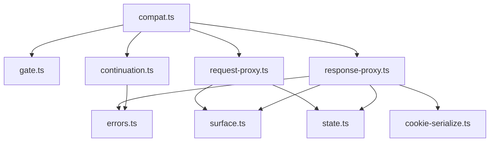
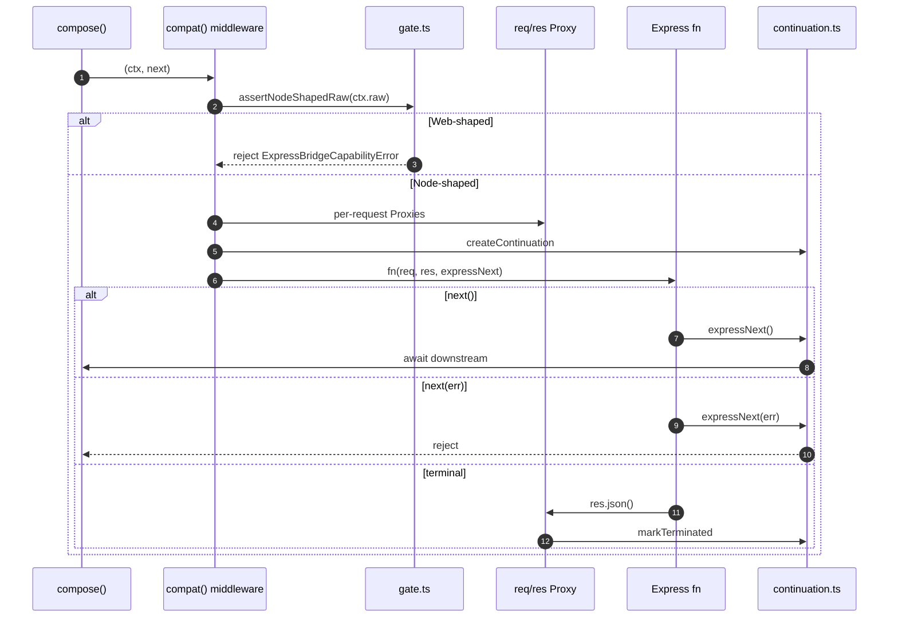
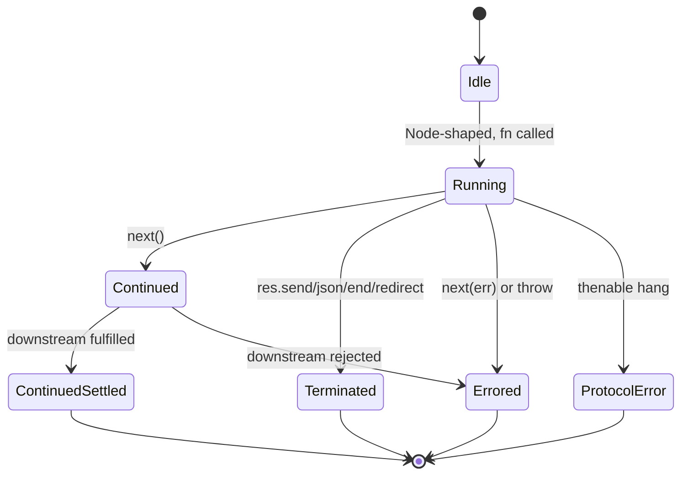

# @nextrush/express-bridge — Architecture

> The internal design of the opt-in Express/Connect middleware compatibility bridge.

## At a glance

|  |  |
| --- | --- |
| **Package** | `@nextrush/express-bridge` |
| **Layer** | interop (above runtime, sibling of middleware) |
| **Depends on** | `@nextrush/types`, `@nextrush/errors`, `@nextrush/runtime` |
| **Depended on by** | applications (opt-in); never core/router/types/runtime/adapters |
| **Public entry** | `src/index.ts` (barrel — exports only) |
| **Internal modules** | 10 files · largest ~270 LOC (cap 300) |
| **On the request hot path?** | only when `compat()` is used |
| **Runtime coupling** | Node-shaped raw HTTP only, behind `ctx.raw` duck-typing |
| **State model** | per-request (continuation + proxies + `res.locals`) |

## Responsibilities

**This package owns:**
- ✓ Wrapping Connect/Express 3-arity middleware as NextRush `Middleware`
- ✓ Translating `next()`/`next(err)`/terminal/thenable/double-`next` into `compose()` semantics
- ✓ A four-bucket Proxy over the real Node `req`/`res`
- ✓ The Node-shaped `ctx.raw` gate and fail-closed error classes

**This package does NOT own:**
- ✗ Middleware composition — owned by `@nextrush/core` `compose()`
- ✗ The `Context`/`Middleware` types — owned by `@nextrush/types`
- ✗ Header grammar validation — owned by `@nextrush/runtime` `assertHeaderSafe`
- ✗ Native middleware — owned by `@nextrush/*` packages

## Non-goals

- Reimplement Express/Connect/Nest — we adapt one contract
- Support 4-arity error middleware, `express-session`, streaming/proxy, or Edge portability
- Extract `@nextrush/compat-core` before a second real adapter proves shared requirements

## Constraints

Must remain:
- Node-shaped raw-HTTP only (duck-typed `ctx.raw`, never `ctx.runtime`)
- Sealed public surface (`compat` + four errors + type-only signatures)
- Zero reverse dependency into core/router/types/runtime/adapters/`nextrush`

## Position in the package hierarchy

```mermaid
flowchart TB
    types --> errors --> core --> router --> runtime --> di --> class
    class --> adapters["adapter-*"] --> middleware["middleware / extensions"]
    middleware --> interop["interop/* — this package"]
    classDef here fill:#2563eb,color:#fff,stroke:#1e40af;
    class interop here;
```

> [!IMPORTANT]
> Imports flow **downward only**. `@nextrush/express-bridge` may import types/errors/runtime and MUST
> NOT be imported by them, by core/router, or by any adapter.

**Dependency rules:**
- **Allowed:** `express-bridge → types` · `→ errors` · `→ runtime`
- **Forbidden:** `express-bridge → core` (runtime import) · `→ express` · reverse of any of the above

---

## Overview

The bridge is a **contract adapter**, not a second framework. One function, `compat(fn)`, returns a
`Middleware` that — per request — (1) refuses Web-shaped `ctx.raw`, (2) builds two Proxies over the
real Node `req`/`res` plus the NextRush context, (3) runs the foreign function, and (4) translates
its continuation/terminal/error behavior into `compose()`.

### Design principles

1. **Bridge the contract, not the framework.** Enforced by a one-function public API and no `express` dependency.
2. **Semantic compatibility over TypeScript-shape compatibility.** Enforced by fail-closed `UnsupportedExpressApiError` traps and real-package tests.
3. **Zero unused-path cost.** Enforced by the workspace import-graph test and the `native-hello-alloc` harness.
4. **Explicit before magic.** Enforced by requiring `compat()`; `Application.use` never auto-detects.

---

## Module structure

```text
src/
├── index.ts             # Public barrel: compat + errors + types
├── compat.ts            # compat() entry: gate, proxies, continuation wiring
├── gate.ts              # Node-shaped ctx.raw duck-type
├── surface.ts           # Frozen overlay / unsupported / denylist key sets
├── state.ts             # ad-hoc req.* ↔ ctx.state projection
├── cookie-serialize.ts  # Express-shaped Set-Cookie serializer
├── continuation.ts      # idle/continued/terminated/error/protocolError state machine
├── request-proxy.ts     # request four-bucket Proxy
├── response-proxy.ts    # response four-bucket Proxy + writeHead assert-wrap
├── errors.ts            # four NextRushError subclasses
└── types.ts             # ExpressMiddleware / ExpressNext
```

### Module responsibilities

| Module | Responsibility (the one thing it owns) |
| ------ | -------------------------------------- |
| `compat.ts` | registration checks + per-request wiring |
| `gate.ts` | Node-shaped raw-HTTP structural check |
| `surface.ts` | the frozen candidate/unsupported/denylist sets |
| `state.ts` | safe `ctx.state` projection |
| `cookie-serialize.ts` | Express cookie semantics |
| `continuation.ts` | the continuation state machine |
| `request-proxy.ts` | request four-bucket Proxy |
| `response-proxy.ts` | response four-bucket Proxy + `writeHead` wrap |
| `errors.ts` | actionable error classes |
| `types.ts` | the public contract types |

## Component relationships



---

## Lifecycle





## State ownership

| Owner | State it owns | Scope |
| ----- | ------------- | ----- |
| `continuation.ts` | `idle`/`continued`/`terminated`/`error`/`protocolError` | per-request |
| `request-proxy.ts` / `response-proxy.ts` | Proxy target (real Node pair) | per-request |
| `response-proxy.ts` | `res.locals` (null-prototype) | per-request |
| `ctx.state` | ad-hoc `req.*` shared namespace | per-request |

---

## Data structures

```ts
// The four buckets decide a get/set/defineProperty. Order matters:
// overlay → unsupported (throw) → Node pass-through → ad-hoc ctx.state.
// This is what lets `on`, `socket`, `pipe`, and `writeHead` keep working
// while unsupported Express prototypes fail closed.
```

## Concurrency & edge behaviour

- **Per-request, never shared:** continuation, proxies, `res.locals`
- **Double-`next`:** first wins; second warn+no-op (never double-settle)
- **Thenable hang:** fail closed; callback-style is Express continuation
- **Abort / disconnect:** real `IncomingMessage` events still fire; `ctx.signal` unchanged

> [!WARNING]
> Do not bind `origWriteHead` at proxy creation; the assert-wrap must apply it with the caller's `this`, or `on-headers` recurses.

## Trust boundaries

```text
Foreign middleware ──▶ req/res Proxy ──▶ overlay / pass-through / ctx.state
                                          ▲
                                          └─ proto denylist + assertHeaderSafe enforce the boundary
```

The bridge treats foreign middleware as untrusted: ad-hoc writes are denylisted (`__proto__`,
`prototype`, `constructor`), header writes go through `assertHeaderSafe`, and prototype mutation via
`setPrototypeOf`/`defineProperty` is contained.

## Extension points

**Supported extension points:**
- None in v1 — the public surface is sealed.

**Forbidden (sealed):**
- `RequestAdapter` / `ResponseAdapter` / continuation helpers are not exported.

---

## Architectural invariants

The following are part of the package architecture. They do not change without an RFC:

- Core/router/types/runtime/adapters/`nextrush` never import this package.
- `compat()` returns `Middleware`; it never imports `@nextrush/core` at runtime.
- The gate ducks `ctx.raw`, never `ctx.runtime`.
- The public API is exactly `compat` + four errors + two type-only signatures.
- Continuation never double-settles the bridge promise.
- Compatibility is evaluated at the package boundary (not transitive).

## Engineering decisions

| Decision | Chosen | Trade-off accepted | Reference |
| -------- | ------ | ------------------ | --------- |
| Four-bucket Proxy | Proxy over real Node pair | per-request allocation on bridge path only | RFC-035 §8.4 |
| `writeHead` wrap | captured `origWriteHead` + `apply(this)` | subtle, must stay unbound | RFC-035 §8.4 |
| Continuation | state machine, warn+no-op double-`next` | no Koa after-hooks inside a bridged fn | RFC-035 §8.6 |
| Cookie serializer | bridge-local, Express defaults | no `cookie` npm dep | RFC-035 §8.4 |
| `assertHeaderSafe` home | stays in `@nextrush/runtime` | downward `interop → runtime` edge | RFC-035 §8.9 |

## Rejected alternatives

### Run an Express app inside NextRush
Rejected — a second framework runtime, duplicate `req`/`res` identity, Express as a hard dependency.

### Allow-list the entire Express prototype
Rejected — would trap `writeHead`/`on`/`socket`/`pipe` that real packages (Morgan, `on-finished`) use.

### Auto-detect `(req, res, next)` in `Application.use`
Rejected — arity is a poor discriminator and hidden detection violates "explicit before magic".

---

## Testing strategy

- **Unit:** continuation table, gate, surface, state, cookie, proxies
- **Integration:** real `morgan` / `passport` / `on-headers` against `Application` + `adapter-node`
- **Invariant tests:** `public-surface.test.ts`, `import-graph.test.ts`, `registry-lock.test.ts`
- **Conformance / cross-adapter parity:** N/A (bridge is Node-ecosystem, not portable)
- **Benchmark / regression:** `native-hello-alloc` delta `=== 0` (P3)
- **Coverage:** ≥90% lines/functions (CI-enforced)

## Evolution strategy

- **Stable (semver-guarded):** `compat`, the four error classes, `ExpressMiddleware`, `ExpressNext`
- **May change without notice:** internal module layout
- **Changes only via RFC:** the architecture and invariants above

**Timeline:** v0.1 Express 3-arity → future: Fastify/Connect adapters before any `compat-core` extraction.

## Contributor notes

Before changing this package, read: [`docs/RFC/ecosystem-interop/035-express-bridge.md`](../../docs/RFC/ecosystem-interop/035-express-bridge.md), [`docs/adr/ADR-0026-public-interop-tier.md`](../../docs/adr/ADR-0026-public-interop-tier.md), and the `import-graph` test.

## Architecture checklist

Before changing this package, confirm:
- [ ] Does this preserve the architectural invariants?
- [ ] Does this increase coupling or cross a dependency rule?
- [ ] Does this affect the unused path (allocations / complexity)?
- [ ] Does this change the public API (semver / ADR-0005)?
- [ ] Does it need an RFC?

---

## References & see also

- **README (how to use it):** [`./README.md`](./README.md)
- **Governing RFC(s):** [`docs/RFC/ecosystem-interop/035-express-bridge.md`](../../docs/RFC/ecosystem-interop/035-express-bridge.md)
- **ADR(s):** [`docs/adr/ADR-0026-public-interop-tier.md`](../../docs/adr/ADR-0026-public-interop-tier.md)
- **OpenSpec capability:** [`openspec/specs/ecosystem-interop`](../../openspec/specs/ecosystem-interop)
