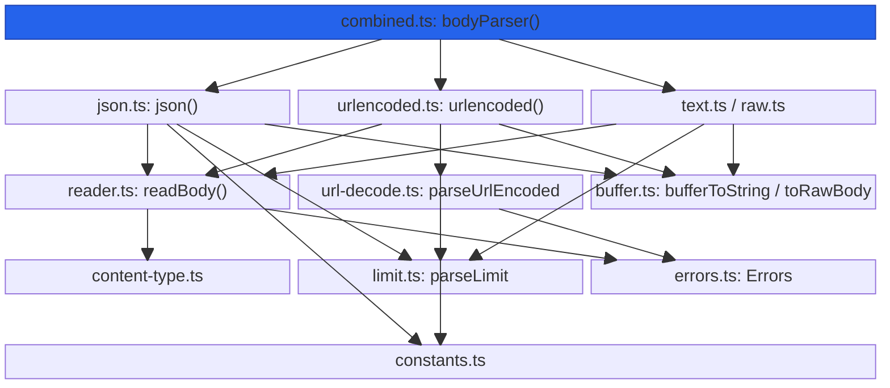
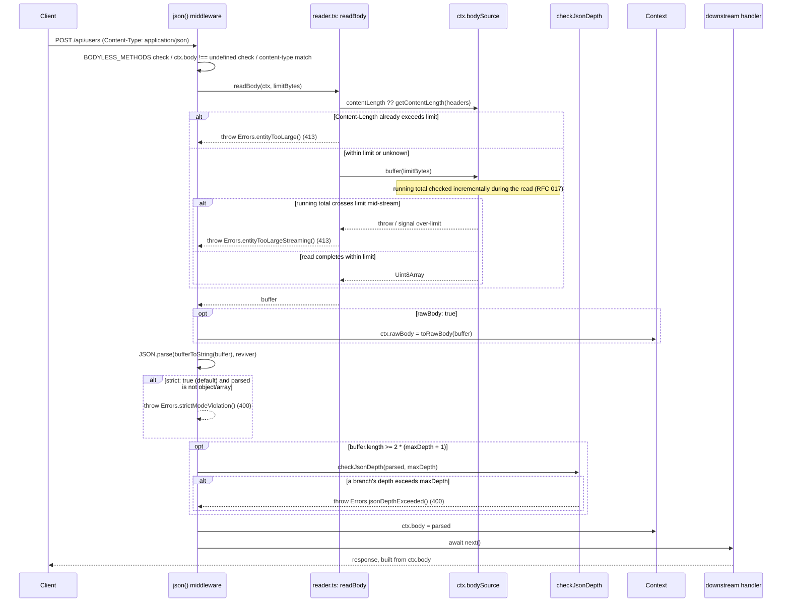
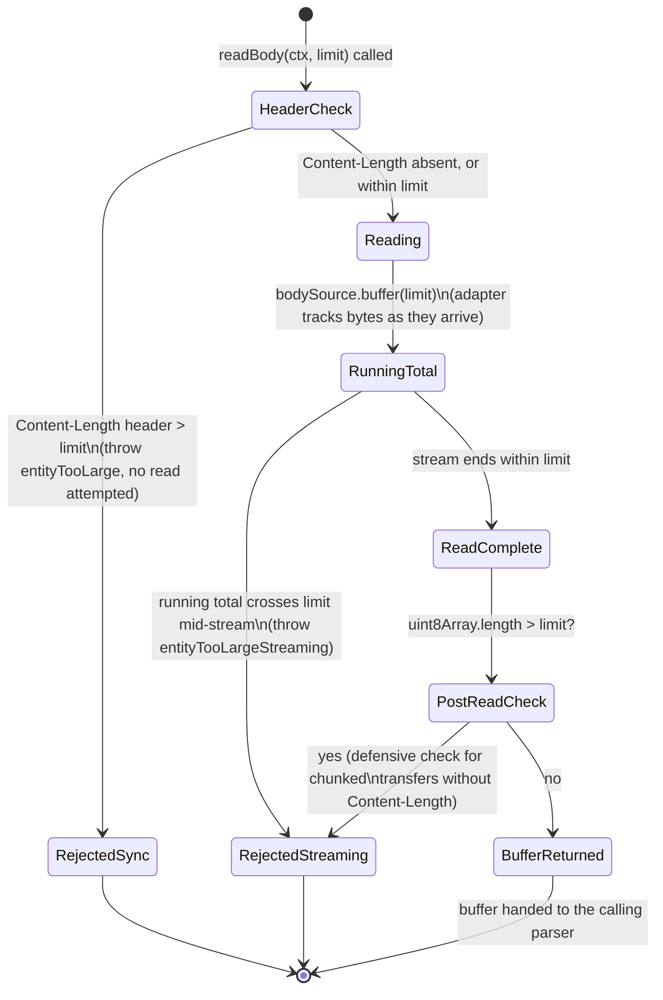

# @nextrush/body-parser — Architecture

> Internal design of the read-parse-populate pipeline, the incremental size-limit enforcement
> (RFC 017), and the prototype-pollution / depth-check guards that turn an untrusted request
> stream into a safely typed `ctx.body`.

## At a glance

|  |  |
| --- | --- |
| **Package** | `@nextrush/body-parser` |
| **Layer** | `middleware` (above `types`; below nothing — a leaf middleware) |
| **Depends on** | `@nextrush/types` (types only, erased at build) — no third-party runtime deps |
| **Depended on by** | Application code that calls `app.use(json())` / `bodyParser()` etc.; not depended on by any other `@nextrush/*` package (the `nextrush` meta package lists it as a workspace dependency but does not re-export it) |
| **Public entry** | `src/index.ts` (barrel — exports only) |
| **Internal modules** | 16 files (excl. tests) · 2,161 LOC · largest `types.ts` (293 LOC) and `errors.ts` (228 LOC) — both within the 300-line package cap |
| **On the request hot path?** | Yes — runs on every request once registered; reading, decoding, and parsing happen per request |
| **Runtime coupling** | None — zero `node:` imports; reads bytes via the adapter-provided `BodySource` and decodes with the Web-standard `TextDecoder`/`Uint8Array` |
| **State model** | Stateless per request; each parser closure captures only its immutable, pre-computed options (`limitBytes`, `types`, `useSimpleCheck`) |

## Responsibilities

**This package owns:**

- **Reading the request body stream** into a bounded, in-memory `Uint8Array`, via `readBody()` and the adapter's `BodySource.buffer(limit)`
- **Content-Type-based routing** — deciding which parser (json/urlencoded/text/raw) a request's body belongs to
- **Parsing** JSON, `application/x-www-form-urlencoded`, `text/*`, and raw binary bodies into `ctx.body`
- **Size-limit enforcement** — both the synchronous `Content-Length` pre-check and the incremental running-total check during the read
- **Security guards specific to body parsing** — prototype-pollution key blocking in URL-encoded data, JSON nesting-depth limits, charset validation with a safe UTF-8 fallback
- **Typed error reporting** — every failure mode surfaces as a `BodyParserError` with an HTTP `status` and a machine-readable `code`

**This package does NOT own:**

- Reading bytes off the wire / draining the underlying stream / enforcing the limit incrementally at the byte level → the adapter's `BodySource` implementation (`NodeBodySource`, `WebBodySource`, etc. — RFC 017); this package configures and calls it, it does not implement the drain
- Multipart/form-data (file upload) parsing → a dedicated multipart parser package
- Validating the *shape* of the parsed body (required fields, types) → `@nextrush/validation`
- The middleware execution engine (`compose`, `ctx.next()`) → `@nextrush/core`
- Sending the HTTP response — this package only ever sets `ctx.body` / `ctx.rawBody` or throws

## Non-goals

The package intentionally does not:

- Stream a body directly to a consumer without materializing it — every parser fully buffers the (size-limited) body before parsing; true streaming is out of scope
- Implement its own network-level stream draining or listener-cleanup logic — that now lives in the adapter's `BodySource` (RFC 017); this package is a thin configuration/decoding layer over it
- Provide a formal proof that its depth/parameter limits eliminate every possible DoS shape — the limits are pragmatic ceilings (documented defaults), not a verified bound
- Guess or repair malformed JSON/URL-encoded input — a syntax error is reported as a `BodyParserError`, never silently coerced into a best-effort value

## Constraints

Must remain:

- **Runtime-independent** — zero `node:*` imports; the byte-decode path uses only `TextDecoder`/`Uint8Array`, and the one `typeof Buffer !== 'undefined'` check in `buffer.ts` is a feature-detection branch, not a `node:buffer` import
- **Zero third-party dependency** — a types-only dependency on `@nextrush/types`
- **ESM-only** — no CommonJS build
- **Fail-secure on size and pollution** — a body that would exceed a limit, or a key that matches the prototype-pollution blocklist, must always be rejected, never silently truncated or stripped
- **Public API sealed** — the exported surface is semver-guarded (ADR-0005)

## Position in the package hierarchy

```mermaid
block-beta
    columns 5
    types["@nextrush/types"]:1
    space:1
    errors["@nextrush/errors"]:1
    space:1
    core["@nextrush/core"]:1
    space:5
    router["@nextrush/router"]:1
    space:3
    class["@nextrush/class"]:1
    space:5
    adapters["adapter-node / bun / deno / edge"]:5
    space:5
    block:mw:5
        columns 5
        cors["cors"]:1
        helmet["helmet"]:1
        THIS["body-parser (this package)"]:1
        validation["validation"]:1
        etc["... other middleware"]:1
    end

    types --> errors --> core --> router --> class --> adapters --> mw

    classDef here fill:#2563eb,color:#fff,stroke:#1e40af;
    class THIS here
```

> [!IMPORTANT]
> Imports flow **downward only**. `@nextrush/body-parser` imports from `@nextrush/types` only,
> and MUST NOT be imported by `types`, `errors`, `core`, `router`, `class`, or any adapter
> (project-rules §1). It sits at the middleware layer as a leaf: nothing in the framework core
> depends on it — an application opts in by calling `app.use(json())` or `app.use(bodyParser())`.

**Dependency rules:**
- **Allowed:** `body-parser → types`
- **Forbidden:** `body-parser → core / router / class / adapters / any other middleware package`

---

## Overview

The package answers one question for every request that carries a body: *given this stream of
bytes and a `Content-Type`, what is the safely-decoded value that belongs on `ctx.body`, and how
much of that stream should this middleware ever be allowed to buffer?* The organizing idea is a
**bounded-read, then decode, then parse** pipeline — every parser reads through the same
`readBody()` primitive with an explicit byte ceiling, decodes bytes to a string only after the
read is known to be within limit, and only then hands the string to a content-type-specific
parser (`JSON.parse`, the bracket-notation URL-decoder, or a straight charset decode).

Each of the four content-type parsers (`json`, `urlencoded`, `text`, `raw`) is a small, independent
middleware factory that pre-computes its configuration once at construction time (`limitBytes`,
the `types` allowlist, a `useSimpleCheck` fast path) and closes over those primitives so the
per-request code path does no repeated parsing of options. `bodyParser()` composes these four into
one middleware that detects `Content-Type` exactly once and forwards a `prechecked` flag so the
delegated parser skips re-detecting what the combined parser already determined.

Security concerns are deliberately factored into their own modules: `url-decode.ts` owns the
prototype-pollution blocklist and nesting-depth accounting for form data, and `json.ts`'s
`checkJsonDepth()` owns the equivalent guard for JSON. Both are guarded by a **byte-floor gate** —
a body physically too short to reach the configured depth limit skips the traversal entirely,
because the traversal cannot change the outcome for a body that small.

### Design principles

1. **The limit is enforced during the read, not only after.** `readBody()` passes the parser's
   configured `limit` to the adapter's `BodySource.buffer(limit)` (RFC 017), so the running total
   is checked as bytes arrive — enforced in `parsers/reader.ts`, not left to a post-hoc length
   check alone.
2. **A parser either fully parses or fully abstains.** Every parser's guard clauses (`BODYLESS_METHODS`, `ctx.body !== undefined`, content-type mismatch) either call `next()` and leave `ctx.body`
   untouched, or proceed to read and set it — there is no partial-parse state, enforced by the
   early-return structure at the top of each parser function.
3. **Prototype-pollution keys are rejected at every nesting level, with no override.** `isForbiddenKey()` in `url-decode.ts` runs on every path segment during `setNestedValue()`, and the
   same `FORBIDDEN_KEYS` check runs on flat (non-nested) keys in `parseUrlEncoded()` — there is no
   configuration option that disables this check.
4. **A traversal that cannot change the outcome is skipped.** `checkJsonDepth()`'s call site in
   `json.ts` is gated by `buffer.length >= 2 * (maxDepth + 1)` — representing depth `d` requires at
   least `2d` structural bytes, so a shorter body provably cannot exceed `maxDepth` and the
   recursive walk (plus its two working arrays) is skipped for the common small-JSON case.
5. **Detection work is never duplicated.** `bodyParser()` in `combined.ts` detects `Content-Type`
   once and calls the delegated parser with `prechecked = true`, which every individual parser's
   signature (`ctx, next?, prechecked?`) honors by skipping its own method/body/content-type
   checks — enforced by the shared `prechecked` parameter threaded through all four parsers.

---

## Module structure

```text
src/
├── index.ts              # Public API barrel (exports only, no implementation)
├── types.ts               # BodyParserContext, BodyParserBodySource, all *Options interfaces
├── constants.ts           # DEFAULT_LIMITS, DEFAULT_JSON_MAX_DEPTH, PATTERNS, FORBIDDEN_KEYS
├── errors.ts              # BodyParserError class + the Errors factory functions
├── utils/
│   ├── index.ts           # Utils re-exports
│   ├── buffer.ts          # bufferToString (TextDecoder / Buffer fast path), concatBuffers, toRawBody
│   ├── content-type.ts    # getContentType, matchContentType, extractCharset, normalizeCharset
│   ├── limit.ts            # parseLimit ('1mb' -> bytes), formatBytes
│   └── url-decode.ts      # parseUrlEncoded, setNestedValue — the prototype-pollution guard
└── parsers/
    ├── index.ts           # Parser re-exports
    ├── reader.ts          # readBody() — the shared bounded-read primitive
    ├── json.ts            # json() + checkJsonDepth()
    ├── urlencoded.ts       # urlencoded()
    ├── text.ts             # text()
    ├── raw.ts              # raw()
    └── combined.ts         # bodyParser() — routes to the parser above by Content-Type
```

### Module responsibilities

| Module | Responsibility (the one thing it owns) |
| ------ | -------------------------------------- |
| `types.ts` | The public option/data contracts and the minimal `BodyParserContext`/`BodyParserBodySource` interfaces — no logic. |
| `constants.ts` | Every default limit, depth, content-type list, and pre-compiled regex, in one place. |
| `errors.ts` | The `BodyParserError` class and every error-construction factory — no other module constructs one directly. |
| `utils/buffer.ts` | Byte-to-string decoding (with the Node `Buffer` fast path) and raw-bytes presentation. |
| `utils/content-type.ts` | `Content-Type` / `Content-Length` header parsing and matching, including charset extraction. |
| `utils/limit.ts` | Size-limit string parsing (`'1mb'` → bytes) and human-readable formatting. |
| `utils/url-decode.ts` | URL-encoded string parsing, bracket-notation nesting, and the prototype-pollution blocklist. |
| `parsers/reader.ts` | The one place that calls `ctx.bodySource.buffer(limit)` and translates its errors into `BodyParserError`. |
| `parsers/json.ts` | JSON parsing, strict-mode enforcement, and the depth-check gate. |
| `parsers/urlencoded.ts` | Wires `url-decode.ts` into a middleware with size/content-type guards. |
| `parsers/text.ts` | Charset-aware decoding into a plain string. |
| `parsers/raw.ts` | Returns the untouched bytes as `ctx.body`. |
| `parsers/combined.ts` | Content-type routing across all four parsers, with the shared `prechecked` fast path. |

## Component relationships



`combined.ts` never calls into `utils/url-decode.ts` or `utils/buffer.ts` directly — it only
composes the four parser middlewares. This keeps the routing logic (which parser handles which
`Content-Type`) fully decoupled from each parser's internal decode/parse logic.

---

## Lifecycle

### Request → response (execution sequence)

How a single request with a JSON body flows through `json()`, including where the
size limit and depth checks run:



The ordering a reader would otherwise get wrong: the `Content-Length` pre-check in `readBody()`
runs **before** a single body byte is read, so an honestly-labeled oversized request is rejected
without any stream I/O. The depth-check traversal in `checkJsonDepth()` only runs at all when the
buffer is long enough to possibly exceed `maxDepth` — for the common small-JSON case the walk
(and its two working arrays) never executes.

### Size-limit enforcement (the state a request's read passes through)



> [!NOTE]
> Two independent checks guard the same limit: the synchronous `Content-Length` pre-check in
> `readBody()`, and the incremental running-total check inside the adapter's
> `BodySource.buffer(limit)` (RFC 017). A request with no `Content-Length` header (chunked
> transfer) skips straight to the incremental check — it is never allowed to buffer past
> `limit` bytes even without a declared size up front.

## State ownership

| Owner | State it owns | Scope |
| ----- | -------------- | ----- |
| Each parser closure (`json`, `urlencoded`, `text`, `raw`) | Its pre-computed, immutable configuration (`limitBytes`, `types`, `useSimpleCheck`) | app — computed once when the factory is called |
| `ctx.bodySource` (owned by the adapter) | The underlying stream and its consumed/aborted state | per request |
| `Context` (owned by `core`/the adapter) | `ctx.body`, `ctx.rawBody` — written once per request by whichever parser matches | per request |
| *(none)* | No module-level mutable state exists in this package | — |

There is no app-scoped or cross-request mutable state beyond each parser's closed-over,
immutable-after-construction options. `decoderCache` in `utils/buffer.ts` caches `TextDecoder`
instances by charset label, but a `TextDecoder` is itself stateless between `.decode()` calls —
the cache is a construction-cost optimization, not request state.

## Data structures

```ts
// The minimal context contract this package requires (types.ts) — narrower than a full
// framework Context, so body-parser can run against any adapter that implements this shape.
interface BodyParserContext {
  readonly method: string;
  readonly path: string;
  readonly headers: Readonly<Record<string, string | string[] | undefined>>;
  readonly bodySource?: BodyParserBodySource; // cross-runtime read primitive (RFC 017)
  body?: unknown;                             // set by whichever parser matches
  rawBody?: Buffer | Uint8Array;              // set only when `rawBody: true`
}

// The cross-runtime read primitive every parser goes through via readBody().
// `buffer(limit)` is the one method the size-limit enforcement in reader.ts depends on.
interface BodyParserBodySource {
  text(): Promise<string>;
  buffer(limit?: number): Promise<Uint8Array>;
  json<T = unknown>(): Promise<T>;
  readonly consumed: boolean;
  readonly contentLength: number | undefined;
  readonly contentType: string | undefined;
}
```

The shape choice for `BodyParserContext`/`BodyParserBodySource` is deliberate: both are minimal
subsets of the framework's real `Context`/`BodySource`, redeclared locally rather than imported
from `@nextrush/types`, so this package can be typed and tested without a build-time dependency
on the framework's full context shape — only the four fields/methods each parser actually touches.

## Performance characteristics

| Path | Complexity | Allocations | Notes |
| ---- | ---------- | ------------ | ----- |
| `readBody()` header pre-check | O(1) | none | Rejects an oversized `Content-Length` before any stream read. |
| `readBody()` incremental read | O(n) in body size | one `Uint8Array` (the final buffer) | Bounded by `limit`, not by the declared `Content-Length`. |
| `checkJsonDepth()` | O(nodes) when it runs; **O(1) skip** when `buffer.length < 2*(maxDepth+1)` | two working arrays (`values`, `depths`), only when the traversal runs | Iterative, explicit-stack walk — avoids recursion/stack-overflow on deep payloads. |
| `bufferToString()` (Node, UTF-8, `Buffer` input) | O(n) | none beyond the returned string | `Buffer.toString('utf8')` fast path, byte-identical to `TextDecoder`. |
| `bufferToString()` (non-UTF-8 or edge) | O(n) | none beyond the returned string | Cached `TextDecoder` per charset label (`decoderCache`), not reallocated per call. |
| `bodyParser()` routing | O(1) | none | Detects `Content-Type` once, passes `prechecked: true` so the delegated parser skips re-detection. |

**Memory model:**
- **Shared (one copy):** each parser's pre-computed options closure; the `decoderCache` Map of `TextDecoder` instances (module-scoped, reused across all requests).
- **Per request:** the read buffer (bounded by `limit`), the parsed `ctx.body` value, and (only when `rawBody: true`) the `ctx.rawBody` view over the same bytes.

## Concurrency & edge behaviour

- **Shared, immutable after construction:** each parser's destructured options (`limitBytes`, `types`, `useSimpleCheck`) closed over by the returned middleware function.
- **Per-request, never shared:** the read buffer, `ctx.body`, `ctx.rawBody` — nothing here is written to a shared map or cache.
- **Idempotency:** parsing the same bytes with the same options always produces the same `ctx.body` — there is no per-request randomness or clock dependency in this package.
- **Abort / disconnect / timeout:** handled by the adapter's `BodySource`, not by this package directly — `readBody()` maps a `BodyConsumedError` to `Errors.bodyReadError()` and a `BodyTooLargeError` to `Errors.entityTooLargeStreaming()`, but the actual stream-listener cleanup on client abort lives in the adapter (RFC 017), which this package only calls into.

> [!WARNING]
> `raw()`'s `verify` callback receives the body as `binary` encoding and the parser always
> also sets `ctx.rawBody` (not gated by a `rawBody` option, unlike `json`/`urlencoded`/`text`) —
> a contributor adding a new option to `raw()` should confirm this asymmetry with the other three
> parsers is intentional (raw's only output *is* the raw bytes) before changing it.

## Trust boundaries

```text
Client-supplied request body (untrusted)
   │
   ▼
readBody()  -- Content-Length pre-check + incremental limit enforcement (BodySource.buffer(limit))  <- size boundary
   │
   ▼
JSON.parse() / parseUrlEncoded() / bufferToString()  -- content-type-specific decode
   │
   ▼ (urlencoded only)
setNestedValue() / isForbiddenKey()  -- __proto__ / constructor / prototype rejected at every level  <- pollution boundary
   │
   ▼
ctx.body = parsed value
```

Unlike `@nextrush/helmet` (whose primary input is application configuration), this package's
primary input is the request body itself — fully attacker-controlled. Two independent boundaries
are enforced: a **size boundary** (`readBody()`, so an attacker cannot force unbounded memory
growth) and a **pollution boundary** (`isForbiddenKey()` in `url-decode.ts`, so an attacker cannot
use `user[__proto__][x]=y` to write onto `Object.prototype`). Depth checks in both `json.ts` and
`url-decode.ts` are a third, narrower boundary against a stack-overflow/CPU-exhaustion shape that
neither the size nor pollution boundary covers on its own — a small, deeply nested payload is well
under any byte limit and touches no forbidden key.

## Extension points

**Supported extension points:**

- **The `verify` callback** on every parser (`JsonOptions`, `UrlEncodedOptions`, `TextOptions`,
  `RawOptions`) — the sanctioned way to inspect the raw bytes before parsing (e.g. an HMAC webhook
  signature check) without forking the parser itself.
- **`readBody()` and the utility functions** (`bufferToString`, `parseLimit`, `parseUrlEncoded`,
  `getContentType`) — exported for advanced use when building a custom parser on the same
  primitives, per the README's API overview.
- **New parsers built on `readBody()`** — a hypothetical fifth content-type parser would follow
  the same pattern every existing one does: pre-compute options once, guard on method/existing-
  body/content-type, call `readBody()`, decode, set `ctx.body`.

**Forbidden (sealed):**

- **The prototype-pollution blocklist** (`FORBIDDEN_KEYS` / `isForbiddenKey()`) — there is no
  configuration option to disable this check; weakening it would reopen the exact vulnerability
  class the package exists to close. RFC-gated.
- **The size-limit enforcement path in `readBody()`** — removing the `Content-Length` pre-check or
  the incremental `BodySource.buffer(limit)` call would let an attacker bypass the byte ceiling
  entirely.
- **Direct `ctx.body` writes from outside a parser function** — every write is centralized inside
  the four parser factories so a new code path can't bypass the size/pollution/depth boundaries.

---

## Architectural invariants

These are part of the package's architecture. They do not change without an RFC:

- **A parser either fully parses and sets `ctx.body`, or calls `next()` and leaves `ctx.body` untouched — never a partial parse.**
- **The size limit is enforced both synchronously (`Content-Length` pre-check) and incrementally during the read — never only after full buffering.**
- **`__proto__`, `constructor`, and `prototype` are rejected as URL-encoded keys at every nesting level, with no configuration override.**
- **`multipart/form-data` is never silently accepted — `bodyParser()` always throws `UNSUPPORTED_CONTENT_TYPE` for it.**
- **The package imports no runtime API** — zero `node:*` imports; the only environment-conditional code is the `typeof Buffer !== 'undefined'` feature-detection branches in `utils/buffer.ts`, used for a faster decode path, never to change parsing behavior.
- **`DELETE` is never treated as bodyless** — `BODYLESS_METHODS` is `{GET, HEAD, OPTIONS, TRACE}` only, matching RFC 7231 §4.3.5's permission for a body on `DELETE`.

## Engineering decisions

| Decision | Chosen | Trade-off accepted | Reference |
| -------- | ------ | ------------------- | --------- |
| Size-limit enforcement point | Incremental, inside the adapter's `BodySource.buffer(limit)` (RFC 017), not a post-hoc length check alone | This package no longer implements its own stream-draining/listener-cleanup logic — it configures and calls the adapter's primitive instead of owning it | `parsers/reader.ts` |
| JSON depth-check gate | Skip `checkJsonDepth()`'s traversal when `buffer.length < 2*(maxDepth+1)` | A few bytes of arithmetic per request, in exchange for skipping an O(nodes) walk (plus two working arrays) on the common small-JSON case | `parsers/json.ts` |
| Prototype-pollution guard scope | Checked at every nesting level in both flat and bracket-notation URL-encoded parsing, no opt-out | No configuration flexibility here — the check cannot be disabled, even for a caller who claims to trust their input | `utils/url-decode.ts` |
| Byte decoding strategy | `Buffer.toString('utf8')` fast path on Node when input is already a `Buffer` and charset is UTF-8; cached `TextDecoder` otherwise | An extra `typeof Buffer !== 'undefined'` branch per decode call, in exchange for measurably faster decoding on the common case without sacrificing edge-runtime compatibility | `utils/buffer.ts` |
| `bodyParser()` default enablement | `json`/`urlencoded` on by default; `text`/`raw` require an explicit (even empty) options object | An app must opt in to `text: {}` or `raw: {}` rather than getting them for free — avoids silently treating an unexpected `Content-Type` as raw bytes or plain text | `parsers/combined.ts` |

## Rejected alternatives

### A single generic `parse()` function with a `contentType` mode parameter
Rejected: each content type (JSON, URL-encoded, text, raw) has genuinely different security
guards (depth checking, prototype-pollution blocking, charset handling) and different default
limits. A single function with a mode parameter would raise the odds of applying the wrong
guard at a new call site — four small, independently named factories were chosen so a reviewer
can see which guards apply from the import alone, the same reasoning `@nextrush/helmet` used for
its two sanitizer functions.

### Recursive JSON depth checking
Rejected: `checkJsonDepth()` uses an explicit stack (`values`/`depths` parallel arrays) instead of
native recursion specifically so a maliciously deep payload cannot exhaust the call stack before
the depth limit is even reached — the guard itself must not become the vulnerability it's
defending against.

### Enforcing the size limit only after the full body is buffered
Rejected: a post-hoc length check still requires buffering the full oversized body in memory
before rejecting it, which is the exact DoS shape a size limit exists to prevent. The incremental
`BodySource.buffer(limit)` check (RFC 017) stops the read as bytes arrive instead.

---

## Testing strategy

- **Unit:** each parser (`json`, `urlencoded`, `text`, `raw`) against valid/oversized/malformed/wrong-content-type inputs; `checkJsonDepth()` against payloads at, above, and just below the byte-floor gate; `parseUrlEncoded()`/`setNestedValue()` against nested, array-notation, and `__proto__`/`constructor`/`prototype` pollution attempts; `bufferToString()` across every supported charset and the Node-`Buffer`-vs-`TextDecoder` fast path; `parseLimit()`/`formatBytes()` round-trips.
- **Integration:** `bodyParser()` against a simulated `Context` with each content type, asserting correct routing, the `prechecked` fast path, and the `UNSUPPORTED_CONTENT_TYPE` throw for multipart.
- **Conformance / cross-adapter parity:** N/A directly — the package uses no runtime API; identical behavior across adapters follows from having zero `node:` imports and the `BodySource` abstraction, verified indirectly by `packages/adapters/conformance`.
- **Coverage:** >=90% lines/functions (CI-enforced).

## Evolution strategy

- **Stable (semver-guarded):** the sealed public surface — `json`, `urlencoded`, `text`, `raw`, `bodyParser`, `readBody`, `BodyParserError`, `Errors`, every utility function, and every type in `types.ts` (ADR-0005).
- **May change without notice:** the internal `decoderCache` implementation, the exact wording of `BodyParserError` messages, the internal module split (which file owns which helper).
- **Changes only via RFC:** the default value of any size/depth/parameter limit, the prototype-pollution blocklist, and the size-limit enforcement mechanism (RFC 017).

**Timeline:** 3.0 — initial JSON/URL-encoded/text/raw parsing with size limits and prototype-pollution guards.

## Contributor notes

Before changing this package, read: RFC 017 (the `BodySource` incremental-limit contract this
package depends on), `constants.ts`'s `FORBIDDEN_KEYS`/`DEFAULT_JSON_MAX_DEPTH` and the comments
around them, and `utils/url-decode.ts`'s `isForbiddenKey()` — any change to a limit default or the
pollution blocklist is a security-relevant change and should be treated as RFC-gated per this
document's invariants.

## Architecture checklist

Before changing this package, confirm:

- [ ] Does this preserve the architectural invariants above (especially the pollution blocklist and the incremental size-limit enforcement)?
- [ ] Does this increase coupling or cross a dependency rule (`body-parser → types` only)?
- [ ] Does this affect the request hot path (allocations in `readBody()`, `checkJsonDepth()`, or `bufferToString()`)?
- [ ] Does this change the sealed public API (semver / ADR-0005)? Does it need an RFC?
- [ ] If this touches a limit default or the pollution blocklist, does it remain fail-secure (reject on ambiguity, never silently truncate or strip)?

---

## References & see also

- **README (how to use it):** [`./README.md`](./README.md)
- **ADR:** [`ADR-0005 — package tiers & sealed surface`](https://github.com/0xTanzim/nextRush/blob/main/docs/adr/ADR-0005-package-tiers-sealed-surface-deprecation.md)
- **Governing RFC:** RFC 017 — the `BodySource` incremental-limit contract this package's `readBody()` depends on
- **Security boundary reference:** `.kiro/steering/project-rules.instructions.md` §4 (request body parsing must enforce size limits — this package's `readBody()` is that enforcement point)
- **Documentation site:** [nextRush docs](https://0xtanzim.github.io/nextRush/docs)
- **Repository:** [`packages/middleware/body-parser`](https://github.com/0xTanzim/nextRush/tree/main/packages/middleware/body-parser)
