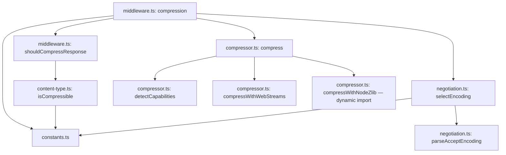
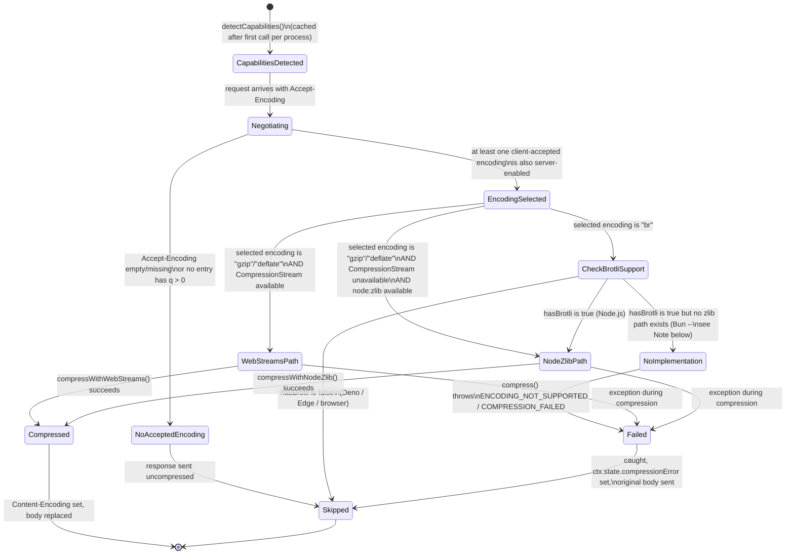

# @nextrush/compression — Architecture

> Internal design of the runtime-capability detection, the Accept-Encoding negotiation pipeline, and the buffer-then-compress response transformation this middleware performs after `next()` resolves.

## At a glance

|  |  |
| --- | --- |
| **Package** | `@nextrush/compression` |
| **Layer** | `middleware` (above `types`; below nothing — a leaf middleware) |
| **Depends on** | `@nextrush/types` (types only, erased at build) — no third-party runtime deps |
| **Depended on by** | Application code that calls `app.use(compression(...))`; not depended on by any other `@nextrush/*` package |
| **Public entry** | `src/index.ts` (barrel — exports only) |
| **Internal modules** | 7 files (excl. tests) · ~2,050 LOC · largest `compressor.ts` ~450 LOC, `middleware.ts` ~440 LOC — both over the package's usual 300-line target, see Contributor notes |
| **On the request hot path?** | Yes — runs on every request once registered; the actual compression work only runs for responses that pass every gate (content-type, threshold, negotiated encoding) |
| **Runtime coupling** | Feature-detected for gzip/deflate and for Deno/Edge/browser Brotli gating; **not** feature-detected for Bun's Brotli flag — `detectCapabilities()` hardcodes `hasBrotli: true` whenever `process.versions.bun` is present, without probing whether `CompressionStream` on Bun actually supports `br` (it doesn't, and Bun has no `node:zlib`-backed fallback in this package either) — see Rejected alternatives and Contributor notes |
| **State model** | Stateless per request, except a module-level cached `RuntimeCapabilities` result computed once per process |

## Responsibilities

**This package owns:**

- **`Accept-Encoding` parsing and negotiation** — quality-value ordering, wildcard handling, and tie-breaking by a fixed encoding priority
- **Runtime compression-capability detection** — which of gzip/deflate/Brotli are actually available in the current process, cached for the process lifetime
- **The actual compression operation** — via Web Compression Streams (gzip/deflate) or Node's `zlib` (all three, Brotli specifically)
- **Content-type-based compress/skip decisions** — a default compressible list, a default excluded list, and wildcard pattern matching
- **Response-safety gates** — minimum size threshold, maximum in-memory size, decompression-bomb-style ratio sanity check, BREACH mitigation padding

**This package does NOT own:**

- Streaming compression of an in-flight response body → not implemented by any NextRush package today; a reverse proxy/CDN or a purpose-built streaming transform would own this
- General HTTP security headers → [`@nextrush/helmet`](../helmet)
- Deciding *what* a response contains → the application; this package only transforms bytes the handler already produced
- The middleware execution engine (`compose`, `ctx.next()`) → `@nextrush/core`

## Non-goals

The package intentionally does not:

- Stream-transform a response body as it is produced — every code path reads the complete body into a single `Uint8Array` before compressing; this is a deliberate simplicity trade-off (see Rejected alternatives), not an oversight, and the 10MB in-memory cap exists specifically to bound its cost
- Implement Brotli via a pure-JS/WASM fallback for non-Node runtimes — it relies entirely on either the Web Compression Streams API (which does not support Brotli on any runtime today) or Node's native `zlib`; Deno/Edge/browser environments get no Brotli support from this package
- Validate `level` against a hard range up front — an out-of-range value is silently clamped at the point of use (`Math.min(level, MAX_ZLIB_LEVEL)` / `MAX_BROTLI_LEVEL`), not rejected at construction

## Constraints

Must remain:

- **Runtime-independent at the negotiation/filtering layer** — `negotiation.ts` and `content-type.ts` import no runtime API at all; only `compressor.ts` touches runtime-specific globals, and only behind feature detection
- **Zero third-party dependency** — a types-only dependency on `@nextrush/types`
- **ESM-only** — no CommonJS build
- **Fail-open on compression failure** — a compression error degrades to sending the original uncompressed body, never to a failed request
- **Public API sealed** — the exported surface is semver-guarded (ADR-0005)

## Position in the package hierarchy

```mermaid
flowchart TB
    types["@nextrush/types"] --> errors["@nextrush/errors"] --> core["@nextrush/core"]
    core --> router["@nextrush/router"] --> runtime["@nextrush/runtime"] --> di["@nextrush/di"] --> class["@nextrush/class"]
    class --> adapters["adapter-node / bun / deno / edge"] --> middleware["middleware / extensions"]
    THIS["@nextrush/compression — this package"]:::here
    middleware --> THIS
    classDef here fill:#2563eb,color:#fff,stroke:#1e40af;
```

> [!IMPORTANT]
> Imports flow **downward only**. `@nextrush/compression` imports from `@nextrush/types` only,
> and MUST NOT be imported by `types`, `errors`, `core`, `router`, `class`, or any adapter
> (project-rules §1). It sits at the middleware layer as a leaf: nothing in the framework core
> depends on it — an application opts in by calling `app.use(compression(...))`.

**Dependency rules:**
- **Allowed:** `compression → types`
- **Forbidden:** `compression → core / router / class / adapters / any other middleware package`

---

## Overview

The package separates **what should be compressed** (content-type filtering in `content-type.ts`, size/status/method gates in `middleware.ts`), **how it should be compressed** (negotiation in `negotiation.ts`, the actual bytes-in-bytes-out operation in `compressor.ts`), and **whether it even can be** (runtime-capability detection, also in `compressor.ts`) into independently testable concerns. None of the negotiation or content-type logic touches `Context` or any runtime API — both files operate purely on strings and arrays, which is what lets them be unit-tested without any HTTP or platform simulation at all.

`middleware.ts`'s `compression()` factory is the only place these concerns meet: it resolves options once (folding in the actually-detected runtime capabilities, not just the user's `brotli: true`/`false` intent), then returns a per-request closure that runs `next()` first, inspects whatever the downstream handler produced, and only then decides whether and how to compress it. This "compress after the fact" ordering is the single most consequential architectural choice in the package — see Design principles and the Lifecycle diagrams below.

Runtime detection (`detectCapabilities()`) is memoized at module scope specifically because it is expensive to redo per request but effectively constant for the life of a process — the same runtime doesn't gain or lose `CompressionStream` support mid-process. `resetCapabilities()` exists as an explicit escape hatch for tests that need to simulate a capability change, not for production use.

### Design principles

1. **Compression happens after the handler runs, never before.** `compressionMiddleware` calls `await next()` as its first statement — this is a structural requirement of the design, not a convention, because the middleware needs the handler's actual response body and its actual `Content-Type` before it can make any compress/skip decision.
2. **A capability gap degrades silently to the next-best encoding, never to an error.** `resolveOptions()` ANDs the user's `brotli` intent with `detectCapabilities().hasBrotli` — if Brotli isn't available, it is removed from the negotiated set entirely, and `negotiateEncoding()` falls through to the next server-supported encoding the client also accepts.
3. **Exclusion always wins over inclusion.** `isCompressible()` checks `exclude` patterns before `contentTypes` patterns — a content type matching both an exclude and an include pattern is never compressed, closing the ambiguity in the caller's favor of safety (not compressing something already compressed) rather than the caller's favor of coverage.
4. **Every safety gate is a hard skip, not a warning.** Below `threshold`, above `MAX_IN_MEMORY_SIZE`, an already-`Content-Encoding`'d response, a `NO_BODY_METHODS`/`NO_COMPRESS_STATUS_CODES` match — each of these returns early from `shouldCompressResponse()` or the middleware body with no compression attempted, never a degraded/partial compression attempt.
5. **A compression failure is caught at the outermost call site and recorded, not thrown.** The `try/catch` around `compress()` inside `compressionMiddleware` sets `ctx.state.compressionError` and lets the original uncompressed body through — a bug in a specific encoding path can never turn into a failed request.

---

## Module structure

```text
src/
├── index.ts          # Public API barrel (exports only, no implementation)
├── types.ts           # CompressionOptions, ResolvedCompressionOptions, CompressionInfo, RuntimeCapabilities, CompressionError
├── constants.ts        # DEFAULT_OPTIONS, ENCODING_PRIORITY, DEFAULT_COMPRESSIBLE_TYPES, DEFAULT_EXCLUDED_TYPES, security limits
├── negotiation.ts       # parseAcceptEncoding, negotiateEncoding, selectEncoding — pure, no Context/runtime dependency
├── content-type.ts       # matchesPattern, isCompressible, isTextContent/isBinaryContent — pure, no Context/runtime dependency
├── compressor.ts          # detectCapabilities, compress() — the only module touching runtime globals (CompressionStream, process, Deno, node:zlib)
└── middleware.ts           # compression()/gzip()/deflate()/brotli() factories, body/header extraction, the compress-after-next() orchestration
```

### Module responsibilities

| Module | Responsibility (the one thing it owns) |
| ------ | -------------------------------------- |
| `types.ts` | The public option/data contracts and the `CompressionError` class — no logic. |
| `constants.ts` | Every literal default, priority order, and compressible/excluded type list. |
| `negotiation.ts` | Turning `Accept-Encoding` + server config into one selected encoding (or `null`). |
| `content-type.ts` | Turning a `Content-Type` header into a compress/skip boolean. |
| `compressor.ts` | Runtime capability detection and the actual byte-level compression operation, across Web Compression Streams and Node `zlib`. |
| `middleware.ts` | Orchestrating all of the above around the request/response lifecycle; the only module touching `Context`. |

## Component relationships



`middleware.ts` never imports `node:zlib` directly — only `compressor.ts` does, and only inside the dynamic `import()` used at the point Brotli (or a Web-Compression-Streams-unavailable gzip/deflate) is actually needed. This is what keeps the package's static import graph runtime-independent even though one of its execution paths is Node-only.

---

## Lifecycle

### Runtime capability & encoding selection (state machine)

The states a single request's encoding decision passes through, from raw `Accept-Encoding` to a concrete compression path (or none):



> [!NOTE]
> `CapabilitiesDetected` is entered once per process, not once per request — every subsequent
> request reuses the same cached `RuntimeCapabilities` object. A contributor testing
> runtime-dependent behavior must call `resetCapabilities()` between simulated environments, or
> every test after the first will silently reuse the first detected runtime's capabilities.

> [!WARNING]
> `hasBrotli` is **not** feature-detected on Bun — `detectCapabilities()` sets it to `true`
> unconditionally whenever `process.versions.bun` is present, with no check of whether Bun's
> `CompressionStream` actually implements `br`. Since `hasNodeZlib` is also never `true` on Bun,
> a request that negotiates `br` on Bun always reaches `NoImplementation` above and `compress()`
> throws — caught by the middleware's degrade-to-uncompressed path, so it fails safe, but the
> capability flag itself is currently wrong for Bun. See Contributor notes.

### Request-to-response compression (sequence)

How a single request flows through `compression()`, from arrival to a (possibly compressed) response:

```mermaid
sequenceDiagram
    participant Client
    participant MW as compression() middleware
    participant Handler as downstream handler
    participant Gate as shouldCompressResponse()
    participant Negotiate as selectEncoding()
    participant Compressor as compress()
    participant Ctx as Context

    Client->>MW: GET /api/data (Accept-Encoding: gzip, br;q=0.9)
    MW->>Handler: await next()
    Handler->>Ctx: ctx.json({ ...large payload... })
    Handler-->>MW: (returns)

    MW->>Gate: shouldCompressResponse(ctx, options)
    Gate->>Gate: check method, status, custom filter,\nexisting Content-Encoding, content-type
    Gate-->>MW: true or false

    alt not compressible
        MW-->>Client: original response, untouched
    else compressible
        MW->>Ctx: ctx.get("accept-encoding")
        MW->>Negotiate: selectEncoding(acceptEncoding, options)
        Negotiate-->>MW: "br" | "gzip" | "deflate" | null

        alt no negotiated encoding, or not runtime-supported
            MW-->>Client: original response, untouched
        else encoding selected and supported
            MW->>Ctx: getResponseBody(ctx)
            Ctx-->>MW: body (string / Uint8Array / object)
            MW->>MW: bodyToBytes(body) -- single conversion, avoids double serialization

            alt bodySize < threshold OR bodySize > MAX_IN_MEMORY_SIZE
                MW-->>Client: original response, untouched
            else within bounds
                MW->>Compressor: compress(data, encoding, { level })
                Compressor-->>MW: { data: compressedBytes, info }

                alt compression throws
                    MW->>Ctx: ctx.state.compressionError = message
                    MW-->>Client: original response, untouched
                else compression succeeds
                    MW->>Ctx: set Content-Encoding, Content-Length, Vary
                    MW->>Ctx: ctx.state.compression = info
                    opt breachMitigation enabled
                        MW->>Ctx: set X-Pad (random-length padding)
                    end
                    MW->>Ctx: replace body with compressed bytes
                    MW-->>Client: compressed response
                end
            end
        end
    end
```

The ordering a reader would otherwise get wrong: **the entire response body is read into memory and converted to bytes exactly once (`bodyToBytes`), before the threshold or in-memory-size check runs** — those checks measure the size of that one already-materialized buffer, not a streaming byte count. There is no way to abort compression partway through a large body without having first paid the cost of buffering it; the size gate exists to skip starting the buffer-and-compress sequence for a request whose body is already known to be too large by the time this middleware inspects it, not to interrupt an in-progress stream.

## State ownership

| Owner | State it owns | Scope |
| ----- | ------------- | ----- |
| `cachedCapabilities` (module-level in `compressor.ts`) | The detected `RuntimeCapabilities` for this process | app — computed once, reused for the process lifetime unless `resetCapabilities()` is called |
| `compression()` closure's `opts` | The resolved `ResolvedCompressionOptions` (including the capability-gated `brotli` flag) | app — computed once per `compression(options)` call |
| `Context` (owned by `core`) | Response headers, `ctx.body`, `ctx.state.compression` / `ctx.state.compressionError` | per request |

There is no per-request mutable state owned by this package beyond what it writes onto `Context` — the one piece of app-scoped (not per-request) state is the cached capability-detection result, which exists purely to avoid re-running feature detection on every request.

## Data structures

```ts
// The full configuration surface (types.ts). brotli's effective value is
// ANDed with actual runtime support at resolve time -- see Design principle 2.
interface CompressionOptions {
  gzip?: boolean;                        // default: true
  deflate?: boolean;                      // default: true
  brotli?: boolean;                        // default: true, gated on runtime support
  level?: number;                           // default: 6, clamped per-algorithm at use
  threshold?: number;                        // default: 1024
  contentTypes?: readonly string[];           // default: DEFAULT_COMPRESSIBLE_TYPES
  exclude?: readonly string[];                  // default: DEFAULT_EXCLUDED_TYPES
  filter?: (ctx: Context) => boolean;
  breachMitigation?: boolean;                     // default: false
}

// What detectCapabilities() produces -- the single source of truth for
// "can this process actually compress with encoding X."
interface RuntimeCapabilities {
  hasCompressionStreams: boolean;   // Web Compression Streams API present
  hasNodeZlib: boolean;              // node:zlib importable (Node.js only)
  hasBrotli: boolean;                 // true only when hasNodeZlib is also true today
  runtime: 'node' | 'bun' | 'deno' | 'edge' | 'browser' | 'unknown';
}
```

`RuntimeCapabilities` is deliberately a flat boolean/enum snapshot rather than a live-checked object — every field is computed once at detection time and never re-derived per compression call, which is the mechanism (not just the intent) behind the module-level caching described above.

## Concurrency & edge behaviour

- **Shared, immutable after first computation:** `cachedCapabilities` — read by every concurrent request in the process; written exactly once (or again after an explicit `resetCapabilities()` call, which is not expected to race against production traffic).
- **Per-request, never shared:** the buffered `Uint8Array` body, the `CompressionResult`, and everything written to `ctx.state`.
- **Idempotency:** compressing the same input bytes with the same encoding and level produces the same output bytes — there is no per-request randomness in the compression path itself. `breachMitigation`'s `X-Pad` header is the one intentionally non-deterministic output (a random length between 1 and 256), and it is a header, not part of the compressed body.
- **Client disconnect / abort:** not handled specially by this package — if the underlying request is aborted while `compress()` is awaiting a Web Compression Streams read or a `node:zlib` promisified call, that awaited operation still runs to completion (or failure) inside this middleware; there is no cancellation wiring between `Context`'s abort signal (if the adapter provides one) and the in-flight compression call.

> [!WARNING]
> Because compression happens strictly after `await next()`, a slow or CPU-heavy compression call
> (a large body at `level: 9`) adds to total response latency on the critical path for every
> compressed response — there is no way to start sending bytes to the client before compression
> finishes, unlike a genuinely streaming compressor. This is the direct consequence of the
> buffer-then-compress design (see Rejected alternatives) and is not something a configuration
> option in this package can change.

## Trust boundaries

```text
Client-supplied Accept-Encoding header -- attacker-controlled, but low-risk input
   │
   ▼
parseAcceptEncoding()  -- tolerant parsing; malformed q-values fall back to 1.0     <- this package's negotiation boundary
   │
   ▼
negotiateEncoding()  -- only ever selects from the server's OWN enabled set        <- server config, not client input, decides what's possible
   │
   ▼
compress()  -- operates on the SERVER's own response body, not client input        <- the data being compressed is trusted (it's the app's own output)
```

Unlike `@nextrush/csrf` or `@nextrush/cookies`, this package's primary untrusted-input surface (`Accept-Encoding`) is low-stakes — a malformed or adversarial header can, at worst, cause the client to receive an encoding it didn't ask for (mitigated by `negotiateEncoding()` only ever selecting from `serverSupported`, never from anything the client's header alone dictates) or no compression at all. The data being compressed is the application's own response body, not attacker-supplied bytes, which is why this package's security concerns (`MAX_COMPRESSION_RATIO`, `breachMitigation`) are about protecting the *response* from being an oracle, not about validating untrusted input.

## Extension points

**Supported extension points:**

- **`filter`** — the sanctioned way to add per-request compress/skip logic beyond content-type and threshold (e.g. skipping specific routes).
- **`contentTypes` / `exclude`** — the sanctioned way to adjust the compressible/excluded MIME type lists without forking the middleware.
- **The exported negotiation/content-type/compressor primitives** — exposed specifically so advanced integrations can build custom compression logic (e.g. a genuinely streaming variant) without re-implementing `Accept-Encoding` parsing or runtime detection.

**Forbidden (sealed):**

- **The exclude-before-include ordering in `isCompressible()`** — reversing it would let a content type simultaneously matching both lists be compressed, silently changing behavior for already-compressed formats.
- **The buffer-then-compress execution order** — this is the package's core architectural shape (see Overview); a genuinely streaming implementation would be a different package or a major redesign, not an incremental change here.
- **The Brotli availability gate (`hasNodeZlib` gating `hasBrotli`)** — removing it would attempt Brotli compression on a runtime that cannot actually perform it, producing a runtime error instead of a graceful fallback.

---

## Architectural invariants

These are part of the package's architecture. They do not change without an RFC:

- **Compression runs strictly after `await next()` resolves** — the middleware never compresses before the handler has produced its final response body.
- **A capability gap degrades to the next-best encoding or no compression, never to a thrown error surfacing to the client.**
- **Exclusion patterns are checked before inclusion patterns** — a content type matching both is never compressed.
- **A compression failure is caught and recorded on `ctx.state.compressionError`, with the original uncompressed body sent instead** — this package never turns a compression bug into a failed request.
- **Bodies above `MAX_IN_MEMORY_SIZE` (10MB) are skipped, never partially compressed.**
- **Runtime capability detection is memoized for the process lifetime** unless explicitly reset via `resetCapabilities()`.

## Engineering decisions

| Decision | Chosen | Trade-off accepted | Reference |
| -------- | ------ | ------------------ | --------- |
| Compression timing | After `next()`, on the fully-materialized body | Simple to reason about and test, at the cost of adding compression latency to the critical response path and requiring the whole body in memory | `middleware.ts` |
| Brotli implementation | Node `zlib` only, dynamically imported | Zero-cost on runtimes that never select Brotli, at the cost of Brotli being entirely unavailable on Deno/Edge/browser | `compressor.ts` |
| Capability caching | Module-level, computed once per process | Avoids repeated feature-detection cost per request, at the cost of a `resetCapabilities()` escape hatch contributors must remember for tests | `compressor.ts` |
| Exclude-before-include | Exclude patterns checked first | Ambiguous content types (matching both lists) default to "don't compress" — the safer failure mode | `content-type.ts` |
| Failure handling | Catch-and-degrade, never throw into the response | A compression bug can never fail a request, at the cost of a silent-by-default failure a caller must opt into observing via `ctx.state.compressionError` | `middleware.ts` |
| `level` validation | Clamped at use, not validated at construction | Simpler option resolution, at the cost of an out-of-range `level` never producing a construction-time error the way `@nextrush/csrf`'s secret-length check does | `compressor.ts` |

## Rejected alternatives

### A genuinely streaming compression transform
Rejected: piping the response body through a `TransformStream` as it's produced (rather than buffering it first) would remove the "wait for compression before the first byte goes out" latency cost, but it requires the adapter layer to support streaming response bodies through a transform in the first place, and every downstream handler in this framework currently sets a complete `ctx.body` rather than writing a stream incrementally. Buffer-then-compress was chosen to work uniformly with the existing `ctx.body`-based response model; a true streaming variant would be a larger design change spanning the adapter contract, not an incremental fix to this package.

### A pure-JS/WASM Brotli implementation for non-Node runtimes
Rejected: bundling a WASM Brotli encoder would let Deno/Edge/browser environments compress with Brotli, but it would violate the package's zero-dependency constraint and add meaningful bundle size for a capability most requests won't select anyway (clients that accept `br` also almost always accept `gzip`, which negotiation falls back to). Brotli was left Node-only in practice — though, as the Contributor notes describe, the `hasBrotli` flag itself is only correctly gated for Deno/Edge/browser, not for Bun, which is a real gap rather than an intentional trade-off.

### Validating `level` strictly at `compression()` construction time
Rejected: throwing on an out-of-range `level` at construction (the way `@nextrush/rate-limit` validates `max`) was considered, but silently clamping was chosen instead because a compression level, unlike a rate limit or a security-sensitive option, has no wrong answer that causes incorrect behavior — an out-of-range value just gets the nearest valid level, with no security or correctness implication either way.

---

## Testing strategy

- **Unit:** `Accept-Encoding` parsing (quality values, wildcards, malformed headers), content-type pattern matching (exact, prefix wildcard, suffix wildcard), the exclude-before-include ordering, and runtime capability detection across simulated `process.versions`/`Deno`/`EdgeRuntime` globals.
- **Integration:** the full `compression()` middleware against simulated `Context` objects, covering every skip gate (method, status, existing encoding, content-type, threshold, in-memory cap) and the catch-and-degrade failure path.
- **Public-surface test:** an exported-API-shape test asserts the sealed surface stays in sync (ADR-0005).
- **Conformance / cross-adapter parity:** N/A directly for negotiation/content-type logic (zero runtime API); Brotli's Node-only availability is itself the expected cross-adapter *difference*, verified by capability-detection tests rather than `packages/adapters/conformance` (which asserts identical behavior, not identical capability).
- **Coverage:** >=90% lines/functions (CI-enforced).

## Evolution strategy

- **Stable (semver-guarded):** the sealed public surface — `compression()`, the single-algorithm wrappers, the low-level compress/negotiate/content-type primitives, and every type in `types.ts` (ADR-0005).
- **May change without notice:** the exact contents of `DEFAULT_COMPRESSIBLE_TYPES`/`DEFAULT_EXCLUDED_TYPES` (may grow as new MIME types are identified), the internal capability-caching implementation detail.
- **Changes only via RFC:** the buffer-then-compress execution model, the exclude-before-include content-type ordering, and the Brotli Node-only gating logic.

**Timeline:** 3.0 — initial release with gzip/deflate/Brotli, Accept-Encoding negotiation, content-type filtering, and BREACH mitigation.

## Contributor notes

Before changing this package, read: `compressor.ts`'s runtime-detection block (the `Deno`/`EdgeRuntime` global declarations and the order feature checks run in matters — Node/Bun checks come before generic edge/browser checks). **Known gap:** the Bun branch sets `hasBrotli: true` unconditionally rather than probing `CompressionStream` support, and `hasNodeZlib` is never `true` on Bun either — the combination means a negotiated `br` on Bun always throws inside `compress()` (caught and degraded by the middleware, so it fails safe, but the capability flag is misleading). Fixing this — either detecting Bun's actual Brotli support or hardcoding `hasBrotli: false` for Bun to match Deno/Edge — is a reasonable non-breaking bug fix, not an architectural change. Also read the `MAX_COMPRESSION_RATIO`/`MAX_IN_MEMORY_SIZE` constants' comments before adjusting either — they are the package's only defenses against a decompression-bomb-shaped failure mode and an unbounded in-memory buffer, respectively. Note also that both `compressor.ts` (~450 LOC) and `middleware.ts` (~440 LOC) currently sit above the package's usual 300-line-per-file target — splitting `compressor.ts`'s Web-Streams and Node-zlib implementations into separate files, or extracting `middleware.ts`'s body/header-extraction helpers, are reasonable non-breaking refactors, not architectural changes.

## Architecture checklist

Before changing this package, confirm:

- [ ] Does this preserve the architectural invariants above (especially compress-after-next() and catch-and-degrade)?
- [ ] Does this increase coupling or cross a dependency rule (`compression → types` only)?
- [ ] Does this affect the request hot path (allocations/compression calls per response)?
- [ ] Does this change the sealed public API (semver / ADR-0005)? Does it need an RFC?
- [ ] If this touches the in-memory size cap or the ratio check, does it preserve the existing safety margins?

---

## References & see also

- **README (how to use it):** [`./README.md`](./README.md)
- **ADR:** [`ADR-0005 — package tiers & sealed surface`](https://github.com/0xTanzim/nextRush/blob/main/docs/adr/ADR-0005-package-tiers-sealed-surface-deprecation.md)
- **Security boundary reference:** `.kiro/steering/project-rules.instructions.md` §4
- **Documentation site:** [nextRush docs](https://0xtanzim.github.io/nextRush/docs)
- **Repository:** [`packages/middleware/compression`](https://github.com/0xTanzim/nextRush/tree/main/packages/middleware/compression)
