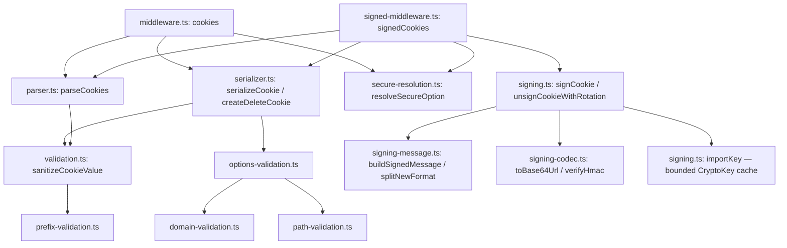
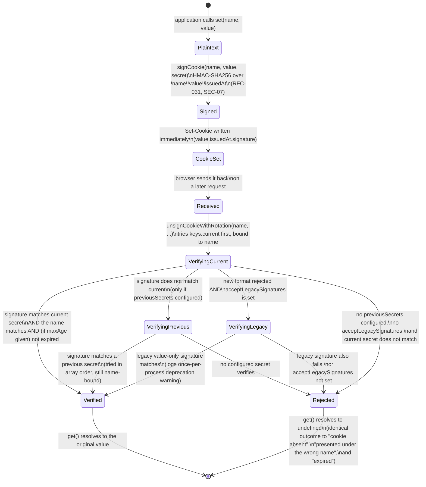
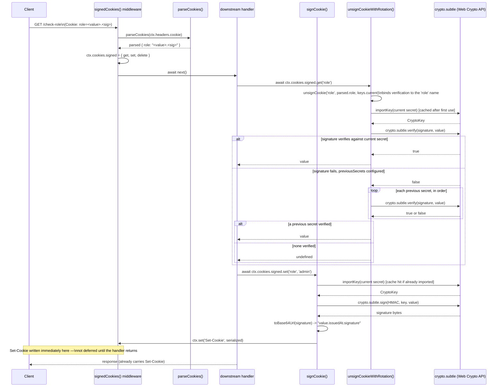

# @nextrush/cookies — Architecture

> Internal design of RFC 6265-compliant parsing/serialization, HMAC-SHA256 signing over the Web Crypto API, and the eager-write model that keeps `Set-Cookie` correct under NextRush's request lifecycle.

## At a glance

|  |  |
| --- | --- |
| **Package** | `@nextrush/cookies` |
| **Layer** | `middleware` (above `types`; below nothing — a leaf middleware) |
| **Depends on** | `@nextrush/types` (types only, erased at build) — no third-party runtime deps |
| **Depended on by** | Application code that calls `app.use(cookies())` / `app.use(signedCookies(...))`; not depended on by any other `@nextrush/*` package |
| **Public entry** | `src/index.ts` (barrel — exports only) |
| **Internal modules** | 18 files (excl. tests) · 2,565 LOC · largest `serializer.ts` 278 LOC (package cap 300 — all files comply) |
| **On the request hot path?** | Yes — parses the `Cookie` header on every request once registered; signing/verification runs per `get()`/`set()` call on a signed cookie |
| **Runtime coupling** | None — zero `node:` imports; uses only `crypto.subtle`, `TextEncoder`, `btoa`/`atob` |
| **State model** | Per-request parsed-cookie object; a small app-scoped bounded `CryptoKey` cache shared across requests |

## Responsibilities

**This package owns:**

- **Cookie parsing** — turning a raw `Cookie` header into a name/value object, RFC 6265-shaped (first duplicate wins, bounded count)
- **Cookie serialization** — building a valid, security-hardened `Set-Cookie` string, including `__Secure-`/`__Host-` prefix rule enforcement
- **Cookie signing** — HMAC-SHA256 sign/verify for tamper detection, with key-rotation fallback
- **Validation** — RFC 6265 name/value rules, CRLF/control-character stripping, domain/path/public-suffix checks, size limits
- **The first-class `ctx.cookies` / `ctx.cookies.signed` capability (RFC-034)** — activated by this package's middleware; `ctx.state.cookies` / `ctx.state.signedCookies` remain as deprecated aliases for one release cycle

**This package does NOT own:**

- CSRF token generation or the double-submit comparison → [`@nextrush/csrf`](../csrf), which manages its own cookie independently of this package
- Encrypting cookie contents → not implemented anywhere in this package; signing is integrity-only (see Non-goals)
- Server-side session storage → the application; this package only signs/verifies a value the client holds, never persists anything itself
- General HTTP security headers → [`@nextrush/helmet`](../helmet)
- The middleware execution engine (`compose`, `ctx.next()`) → `@nextrush/core`

## Non-goals

The package intentionally does not:

- Encrypt cookie values — `signCookie()`/`unsignCookie()` provide tamper-detection (HMAC) only; the signed value's plaintext remains readable by anyone with cookie access. A confidentiality layer (AES-GCM or similar) is a distinct, unimplemented concern
- Implement the full IANA Public Suffix List — `COMMON_PUBLIC_SUFFIXES` is a curated, hand-maintained set of common TLDs and shared-hosting suffixes (a footgun-prevention heuristic per its own source comment), not the exhaustive PSL
- Provide a session store — `signedCookies()` signs/verifies a client-held value; it has no concept of a server-side session record
- Rotate signing keys automatically — `previousSecrets` is consulted, in order, only during verification; the application decides when to add or drop an entry

## Constraints

Must remain:

- **Runtime-independent** — zero `node:*` imports; signing uses only the Web Crypto API (`crypto.subtle`) and standard globals (`TextEncoder`, `btoa`, `atob`), identical on Node, Bun, Deno, and Edge
- **Zero third-party dependency** — types-only `@nextrush/types` plus framework-internal `@nextrush/runtime` (the shared uninitialized stub) and `@nextrush/errors` (the capability diagnostic)
- **ESM-only** — no CommonJS build
- **Fail-secure on ambiguity** — a missing, malformed, or unverifiable signed value returns `undefined`, never a partially-trusted value
- **Public API sealed** — the exported surface is semver-guarded (ADR-0005), locked by `__tests__/public-surface.test.ts`

## Position in the package hierarchy

```mermaid
flowchart TB
    types["@nextrush/types"] --> errors["@nextrush/errors"] --> core["@nextrush/core"]
    core --> router["@nextrush/router"] --> runtime["@nextrush/runtime"] --> di["@nextrush/di"] --> class["@nextrush/class"]
    class --> adapters["adapter-node / bun / deno / edge"] --> middleware["middleware / extensions"]
    THIS["@nextrush/cookies — this package"]:::here
    middleware --> THIS
    classDef here fill:#2563eb,color:#fff,stroke:#1e40af;
```

> [!IMPORTANT]
> Imports flow **downward only**. `@nextrush/cookies` imports from `@nextrush/types`,
> `@nextrush/runtime` (the shared uninitialized cookie stub), and `@nextrush/errors` (the
> capability diagnostic) only, and MUST NOT be imported by `types`, `errors`, `core`, `router`,
> `class`, or any adapter (project-rules §1). It sits at the middleware layer as a leaf: nothing
> in the framework core depends on it — an application opts in by calling `app.use(cookies())` or
> `app.use(signedCookies(...))`.

**Dependency rules:**
- **Allowed:** `cookies → types`, `cookies → runtime`, `cookies → errors`
- **Forbidden:** `cookies → core / router / class / adapters / any other middleware package`

---

## Overview

The package splits into five independent concerns that compose rather than couple: **parsing** (`parser.ts`) turns the raw `Cookie` header into a plain object; **validation** (`validation.ts` plus the domain/path/prefix/options modules split out of it) is a set of pure predicate/throwing functions with no dependency on the other four; **serialization** (`serializer.ts`) builds a `Set-Cookie` string by calling into validation before emitting anything; **secure resolution** (`secure-resolution.ts`) resolves the `secure: 'auto'` default per request; and **signing** (`signing.ts`, `signing-message.ts`, `signing-codec.ts`) is a self-contained HMAC layer that knows nothing about cookies, headers, or `Context` at all — it only signs and verifies a `(name, value, issuedAt)` tuple.

`middleware.ts` and `signed-middleware.ts` are the only two modules that touch `Context`. Between them they wire the other five concerns into two middleware factories — `cookies()` for plain read/write access, `signedCookies()` for the same shape with signing interposed on every `get()`/`set()`. The two are separate functions in separate files, not one function with a `signed: true` flag, because a signed cookie's `get()`/`set()` are necessarily `async` (they call into `crypto.subtle`), while a plain cookie's are not — merging them into one API would force every consumer to `await` even when no signing is happening.

Per RFC-034, the two factories **activate** the first-class `ctx.cookies` capability rather than attaching to `ctx.state`: `cookies()` replaces the context's shared uninitialized stub (wired by `@nextrush/runtime` into every adapter) with the per-request store, and `signedCookies()` replaces the store's `signed` sub-slot — first asserting `cookies()` ran (otherwise it throws `COOKIES_NOT_INITIALIZED`). `ctx.state.cookies` / `ctx.state.signedCookies` remain as deprecated aliases with a once-per-process warning, removed next major.

The most consequential design decision in the package is *when* `Set-Cookie` gets written. NextRush's response commits as soon as a handler calls `ctx.json()`/`ctx.send()`/etc — there is no post-handler "flush headers" phase this middleware can hook into after the fact. So `set()` and `delete()` on both `ctx.cookies` and `ctx.cookies.signed` call `ctx.set('Set-Cookie', ...)` immediately, inside the same synchronous (or awaited) call, rather than deferring to a buffered array written out after `next()`. The middleware's own `await next()` at the end exists to let downstream handlers run and call `set()`/`delete()` themselves — it does not defer or batch anything this middleware itself wrote.

### Design principles

1. **Signing has no HTTP or cookie knowledge, but it does know the cookie name.** `signCookie`/`unsignCookie`/`unsignCookieWithRotation` in `signing.ts` operate only on a `name`, a `value`, and a secret — enforced by the module never importing `Context`, `Middleware`, or anything from `types.ts` beyond its own `SigningKeys` type. `name` is a required first parameter specifically because RFC-031 binds it into the HMAC input (SEC-07) — it is data the signing layer consumes, not something it needs `Context` to obtain.
2. **Set-Cookie is written eagerly, at `set()`/`delete()` call time, never buffered.** Every mutation path in `middleware.ts`/`signed-middleware.ts` (`cookies()` and `signedCookies()` alike) calls `ctx.set('Set-Cookie', ...)` in the same statement that computes the serialized value — there is no intermediate array flushed later, because NextRush's response can commit before any "later" would run.
3. **Ambiguous verification failure resolves to `undefined`, never to a distinguishable error.** `unsignCookie()`'s `catch` block and its "wrong name"/"expired"/"malformed wire value"/"legacy format not accepted" branches all return the same `undefined` — a tampered signature, a value signed for a different cookie name, an expired issue time, a malformed base64 payload, and a genuinely absent cookie are indistinguishable to the caller by construction.
4. **Validation is layered: predicate functions for checking, throwing functions for enforcing.** `validateCookieName`/`validateDomain`/etc. return a `ValidationResult` for callers that want to inspect all errors; `validateCookieOptions`/`validateCookiePrefix` wrap the same checks and throw a `SecurityError` on the first failure — `serializeCookie()` uses only the throwing versions, so a caller cannot accidentally construct an invalid cookie by ignoring a boolean return value. Both forms check `secure` for exact `true`, never truthiness — an unresolved `secure: 'auto'` must never satisfy a hard Secure requirement (see `secure-resolution.ts`).
5. **Read-after-write is consistent within a single request.** `cookies()`'s `set()`/`delete()` mutate the in-memory `parsed` object in addition to writing the header, so a handler that calls `set('x', 'y')` and then `get('x')` later in the same request sees `'y'`, not the pre-request value — even though the actual header the browser receives is unaffected by this in-memory update.
6. **`secure: 'auto'` fails closed, not open.** `resolveSecureOption()` emits `Secure` unless the request is demonstrably plaintext loopback; an untrusted `X-Forwarded-Proto: https` claim on a plaintext non-loopback request never suppresses `Secure` (SEC-08) — the function has exactly one path that returns `false`, every other path (including "don't know") returns `true`.
7. **Activation is a reference swap, failure is a diagnostic, never a TypeError.** `ctx.cookies` always exists (every adapter constructs with the shared frozen stub from `@nextrush/runtime`); the middleware activates it with one assignment. Before activation, operations throw `CapabilityNotInitializedError` (`COOKIES_NOT_INITIALIZED` / `SIGNED_COOKIES_NOT_INITIALIZED`) with a WHAT/WHY/HOW/WHERE message — property access never throws, so inspecting `ctx.cookies` is always safe.

---

## Module structure

```text
src/
├── index.ts               # Public API barrel (exports only, no implementation)
├── types.ts                # Re-exports CookieOptions, SameSiteValue, CookiePriority, ParsedCookies from @nextrush/types (RFC-034)
├── middleware-types.ts       # CookieMiddlewareOptions, SignedCookieMiddlewareOptions, CookieContext, SignedCookieContext
├── constants.ts               # DEFAULT_COOKIE_OPTIONS, size/length limits, prefixes, HMAC config, COMMON_PUBLIC_SUFFIXES
├── parser.ts                   # parseCookies, getCookie, hasCookie, getCookieNames
├── serializer.ts                 # serializeCookie, createDeleteCookie, createSecurePrefixCookie, createHostPrefixCookie
├── validation.ts                  # Cookie name/value validation, SecurityError, sanitizeCookieValue; re-exports the split-out validators below
├── domain-validation.ts             # Domain/public-suffix validation (SEC-18) + publicSuffixList injection point
├── path-validation.ts                # Path attribute validation
├── prefix-validation.ts               # __Secure-/__Host- prefix rule validation (both ValidationResult and throwing forms)
├── options-validation.ts               # validateCookieOptions() — the throwing aggregate serializeCookie() calls
├── secure-resolution.ts                 # secure: 'auto' per-request resolution (SEC-08)
├── option-presets.ts                     # secureOptions(), sessionOptions()
├── deprecation.ts                           # warnStateCookiesDeprecatedOnce() — the ctx.state.cookies alias warning (RFC-034)
├── signing.ts                              # signCookie, unsignCookie, unsignCookieWithRotation, timingSafeEqual, clearKeyCache
├── signing-message.ts                       # Length-prefixed context-bound message construction + legacy-format split (RFC-031)
├── signing-codec.ts                           # base64url encoding + HMAC verify plumbing, split out of signing.ts
├── middleware.ts                                # cookies() — activates ctx.cookies (the plain-cookie middleware factory)
└── signed-middleware.ts                           # signedCookies() — activates ctx.cookies.signed (requires cookies() first)
```

### Module responsibilities

| Module | Responsibility (the one thing it owns) |
| ------ | -------------------------------------- |
| `types.ts` | Re-exports the wire-facing option/data contracts from `@nextrush/types` (`CookieOptions`, `SameSiteValue`, `ParsedCookies`) — no logic. |
| `middleware-types.ts` | The middleware option and capability context contracts (`CookieContext`, `SignedCookieContext`) — no logic. |
| `deprecation.ts` | The once-per-process `ctx.state.cookies` deprecation warning (RFC-034). |
| `constants.ts` | Every literal default, size limit, and HMAC parameter, in one place. |
| `parser.ts` | Turning a `Cookie` header string into a plain object — no serialization, no signing. |
| `serializer.ts` | Turning a name/value/options triple into a valid `Set-Cookie` string — calls into validation, never signing. |
| `validation.ts` | Cookie name/value validation, `SecurityError`, `sanitizeCookieValue`; re-exports the domain/path/prefix/options validators split into their own files below. |
| `domain-validation.ts` | `Domain` attribute + public-suffix validation (SEC-18), including the `publicSuffixList` injection point and its once-per-process warning. |
| `path-validation.ts` | `Path` attribute validation. |
| `prefix-validation.ts` | `__Secure-`/`__Host-` prefix rule validation — both the `ValidationResult`-returning and throwing forms. |
| `options-validation.ts` | `validateCookieOptions()` — the throwing aggregate `serializeCookie()` calls before emitting a header. |
| `secure-resolution.ts` | Resolving `secure: 'auto'` per request (SEC-08) — transport detection and the trusted-forwarded-HTTPS check. |
| `option-presets.ts` | `secureOptions()` / `sessionOptions()` attribute presets. |
| `signing.ts` | HMAC-SHA256 sign/verify orchestration over strings — no dependency on `Context`, cookies, or HTTP. |
| `signing-message.ts` | The length-prefixed context-bound message construction (RFC-031) and the legacy-format split, kept separate from the crypto calls. |
| `signing-codec.ts` | base64url encoding and the `verifyHmac` plumbing — pure encoding/crypto helpers with no signing policy of their own. |
| `middleware.ts` | `cookies()` — the only module (with `signed-middleware.ts`) that touches `Context`; wires parsing/serialization/`secure-resolution` into the plain-cookie API. |
| `signed-middleware.ts` | `signedCookies()` — the same wiring as `middleware.ts`, with `signing.ts` interposed on every `get()`/`set()`. |

## Component relationships



`signing.ts`, `signing-message.ts`, and `signing-codec.ts` never import from `parser.ts`, `serializer.ts`, `validation.ts`, or `@nextrush/types` — the signing subsystem has no dependency on cookies or `Context` at all, so it can be reasoned about (and tested) purely as a string-signing primitive.

---

## Lifecycle

### Signed-cookie value lifecycle (state machine)

The states a single signed cookie value passes through, from a plain value being signed to a later request verifying it — including the fork where verification fails:



> [!NOTE]
> There is no distinct `Tampered`, `WrongName`, or `Expired` end state in this diagram, and that
> absence is deliberate: `Rejected` is reached by a tampered signature, a value signed for a
> *different* cookie name, an expired issue time, a malformed wire value, or a genuinely absent
> cookie — `unsignCookie()`'s early-return branches and `catch` all converge on the same
> `undefined`. A contributor adding a new failure mode to `unsignCookie` must route it through
> this same `Rejected` state, not a newly distinguishable one, or callers gain an oracle for
> probing which failure occurred.

### Request parse / signed get-set sequence

How a request flows through `signedCookies()` — the more involved of the two middleware, since `cookies()`'s `get()`/`set()` are the same shape minus the `await crypto.subtle` calls:



The ordering a reader would otherwise get wrong: **`get()` tries `keys.current` before any `previousSecrets` entry, in that fixed order** — a rotation only ever adds fallback verification for old cookies, it never changes which secret a *new* `set()` signs with (always `keys.current`). And **`Set-Cookie` is written the instant `set()`/`delete()` is called**, inside the async function itself — a contributor tempted to batch multiple `Set-Cookie` writes and flush them at the end of the request would break real usage, because a handler can call `ctx.json()` (committing the response) at any point after `set()`.

## State ownership

| Owner | State it owns | Scope |
| ----- | ------------- | ----- |
| `parsed` (closure inside `cookiesMiddleware`/`signedCookiesMiddleware`) | The request's parsed `Cookie` header, mutated in place by `set()`/`delete()` for read-after-write consistency | per request |
| `KEY_CACHE` (module-level `Map` in `signing.ts`) | Up to 10 imported `CryptoKey` objects, keyed by secret string | app — shared across every `signedCookies()` instance and every request in the process |
| `Context` (owned by `core`) | Response headers (`Set-Cookie`, appended per call), the `ctx.cookies` / `ctx.cookies.signed` capability (RFC-034) and the deprecated `ctx.state.cookies` / `ctx.state.signedCookies` aliases | per request |
| Client's cookie store | The (possibly signed) cookie value itself | per browser/client — outlives any single request |

There is no per-request mutable state shared *across* requests — `parsed` is recreated fresh on every request via a new call to `parseCookies()`. `KEY_CACHE` is the one piece of app-scoped state, bounded (`MAX_CACHED_KEYS = 10`) with FIFO eviction (the same shape as `@nextrush/csrf`'s equivalent cache).

## Data structures

```ts
// The signed value format itself (signing.ts / signing-message.ts) — not a typed
// structure, but a fixed string shape produced by signCookie() and consumed by
// unsignCookie():
//   `${value}.${issuedAt}.${base64UrlSignature}`   e.g. "admin.1706300000000.k3F9x...Q1z_"
// The HMAC input itself binds the cookie name (RFC-031, SEC-07):
//   `${name.length}!${name}!${value.length}!${value}!${issuedAt.length}!${issuedAt}`
// SIGNATURE_SEPARATOR ('.') splits the wire value from the right: the final
// segment is the signature, the one before it is the decimal issuedAt (validated
// as all-digits), and everything before that is the value — which may itself
// contain any number of '.' characters without breaking the split. A legacy
// (pre-RFC-031) value has only one '.' and no name/issuedAt binding at all;
// acceptLegacySignatures gates whether that shorter format is still accepted.

// The two request-scoped context shapes this package attaches
// (middleware-types.ts):
interface CookieContext {
  get(name: string): string | undefined;
  set(name: string, value: string, options?: CookieOptions): void;
  delete(name: string, options?: Pick<CookieOptions, 'domain' | 'path'>): void;
  all(): ParsedCookies;
  has(name: string): boolean;
}

interface SignedCookieContext {
  get(name: string): Promise<string | undefined>;      // async: verifies via crypto.subtle
  set(name: string, value: string, options?: CookieOptions): Promise<void>; // async: signs via crypto.subtle
  delete(name: string, options?: Pick<CookieOptions, 'domain' | 'path'>): void; // sync: no crypto involved
}
```

`SignedCookieContext.delete` is deliberately synchronous while `get`/`set` are not — deleting never touches `crypto.subtle` (there is nothing to sign or verify when expiring a cookie), so making it `async` would only add an unnecessary microtask with no work behind it. This asymmetry inside one interface is intentional, not an oversight: it mirrors exactly which operations the implementation actually needs to await.

## Concurrency & edge behaviour

- **Shared, mutable, bounded:** `KEY_CACHE` in `signing.ts` — a `CryptoKey` is imported once per distinct secret string and reused; eviction is FIFO once the cache reaches 10 entries. Concurrent requests using the same secret share the cached key with no explicit lock (JS's single-threaded event loop makes the read-check-insert sequence safe without synchronization, the same reasoning `@nextrush/csrf`'s equivalent cache relies on).
- **Per-request, never shared:** the `parsed` object built fresh by `parseCookies()` on every request, and the `CookieContext`/`SignedCookieContext` closures created for that request.
- **Idempotency:** parsing and verification are pure functions of their input (header string, secret) — replaying an identical request against unchanged cookie state and secrets produces an identical result. `set()`/`delete()` are not idempotent in the sense that matters here: each call unconditionally appends another `Set-Cookie` header via `ctx.set`, so calling `set()` twice for the same name in one request sends two `Set-Cookie` headers (the browser applies the last one for a given name/domain/path).
- **Malformed input:** a `decodeURIComponent` failure during parsing falls back to the raw value rather than throwing; a `crypto.subtle.verify` failure (malformed base64, corrupted bytes) is caught inside `unsignCookie()` and treated identically to a bad signature — both resolve to `undefined`, never to a thrown error escaping the middleware.

> [!WARNING]
> `previousSecrets` is checked in array order on every single `get()` call for a signed cookie
> whose current-secret verification failed — there is no per-request caching of "which previous
> secret this specific cookie verified against." A contributor adding a large `previousSecrets`
> list should be aware that a signed-cookie read during a rotation window costs one
> `crypto.subtle.verify` call per configured secret, in the worst case, not one.

## Trust boundaries

```text
Client-supplied Cookie header — fully attacker-controlled
   │
   ▼
parseCookies()  -- RFC 6265 split + CRLF/control-char sanitization         <- this package's entry point
   │
   ▼
unsignCookie() / unsignCookieWithRotation()  -- HMAC signature check       <- only for cookies read via signedCookies()
   │                                              (plain cookies() never verifies anything)
   ▼
application code reading ctx.cookies / ctx.cookies.signed                    <- trust boundary this package enforces ends here
```

For plain `cookies()`, every value returned by `get()`/`all()` is attacker-controlled input that has only been *sanitized* (CRLF/control characters stripped), never *verified* — the application is responsible for treating it accordingly (e.g. not trusting a plain cookie for authorization decisions). For `signedCookies()`, a value that survives `get()` is additionally *proven* to have been produced by a holder of `secret` (or a `previousSecrets` entry) — but it is still not confidential; the boundary this package enforces is integrity, not disclosure control.

## Extension points

**Supported extension points:**

- **`decode`** (on `cookies()`) — the sanctioned way to customize value decoding beyond `decodeURIComponent`; the result is always re-sanitized for CRLF regardless of what the custom function returns. If the custom function throws, the parser-sanitized value is retained, the request continues, and a once-per-process warning (see `deprecation.ts`) makes the degraded decode observable.
- **`previousSecrets`** (on `signedCookies()`) — the sanctioned way to support key rotation without this package taking a dependency on any specific secret-management system.
- **The exported low-level primitives** (`signCookie`, `unsignCookie`, `parseCookies`, `serializeCookie`, the validators) — exposed specifically so advanced integrations can build a custom middleware shape without re-implementing RFC 6265 handling or the crypto.

**Forbidden (sealed):**

- **The signed-value format (`value.issuedAt.signature`, the name-bound HMAC input, `SIGNATURE_SEPARATOR`)** — changing the separator, the length-prefixed message construction, or the base64 encoding breaks verification of every cookie signed before the change; RFC-gated (RFC-031).
- **Collapsing "tampered" and "absent" into distinguishable outcomes** — `unsignCookie()`'s single `undefined` return for every failure mode is a deliberate anti-oracle property, not an implementation gap to "improve."
- **Deferring `Set-Cookie` writes past the `set()`/`delete()` call** — see Design principle 2; NextRush's response-commit timing makes any buffered/deferred write model incorrect for handlers that respond before a would-be flush point.

---

## Architectural invariants

These are part of the package's architecture. They do not change without an RFC:

- **Signing provides integrity, never confidentiality** — a signed cookie's value remains plaintext-readable; there is no encryption path anywhere in this package.
- **A signature is bound to the cookie name it was issued for** — verification always requires `name`, and a value signed under one name never verifies under another (RFC-031, SEC-07).
- **`secure: 'auto'` fails closed** — it emits `Secure` in every case except a demonstrably plaintext-loopback request; an untrusted forwarded-protocol claim never suppresses it (SEC-08).
- **`Set-Cookie` is written synchronously (or immediately upon promise resolution) inside `set()`/`delete()`, never buffered for a later flush.**
- **Verification failure of every kind — missing cookie, wrong name, expired, malformed value, bad signature — resolves to `undefined`, with no distinguishable error surfaced to the caller.**
- **`previousSecrets` are only ever consulted for verification, in array order, after `current` fails — they are never used for signing new values.**
- **`acceptLegacySignatures` is opt-in and off by default** — the pre-RFC-031 value-only format is never accepted unless explicitly requested, and every `set()` always writes the current format regardless of this flag.
- **`__Secure-`/`__Host-` prefix constraints (and `SameSite=None`'s Secure requirement) check `secure` for exact `true`, never truthiness** — an unresolved `secure: 'auto'` must never satisfy them, and are validated together, synchronously, inside `serializeCookie()` before any header is built.
- **The package imports no runtime API** — zero `node:*` imports; the same code path runs identically on Node, Bun, Deno, and Edge runtimes.

## Engineering decisions

| Decision | Chosen | Trade-off accepted | Reference |
| -------- | ------ | ------------------ | --------- |
| Signing scope | Integrity only (HMAC-SHA256), no encryption | Simpler package, single well-understood primitive — at the cost of not solving confidentiality; callers needing that must add their own encryption layer | `signing.ts` |
| Plain vs. signed cookie API | Two separate middleware/context shapes, not one flag | Avoids forcing every plain-cookie caller to `await`, at the cost of two similar-looking APIs to choose between | `middleware.ts`, `signed-middleware.ts` |
| `Set-Cookie` write timing | Eager, at `set()`/`delete()` call time | Correct under NextRush's commit-on-first-write response model, at the cost of no single place to see "all cookies set this request" without re-reading response headers | `middleware.ts`, `signed-middleware.ts` |
| Signature binding | Context-bound: name + issue time, length-prefixed (RFC-031) | Closes the cross-cookie substitution risk (SEC-07) at the cost of a breaking wire-format change and a required migration window (`acceptLegacySignatures`) | `signing-message.ts`, RFC-031 / ADR-0019 |
| `secure` default | `'auto'` — resolved per request, fails closed | Removes the most common cookie-hardening footgun (shipping `secure: false` by omission) at the cost of a resolution step every `set()` now performs, and of the prefix/`SameSite=None` checks needing to check for exact `true` rather than truthiness (SEC-08) | `secure-resolution.ts` |
| Verification failure surface | One undistinguishable `undefined` outcome | Removes an oracle for probing cookie presence vs. tampering vs. wrong-name vs. expiry, at the cost of harder debugging when a secret mismatch is the real cause (see Troubleshooting) | `signing.ts` |
| Public suffix list | Curated common-suffix set, not the full PSL, with an injection point | Zero dependency, small bundle, catches the common footguns (`.com`, `github.io`, etc.) and lets callers extend it — at the cost of not catching every real-world public suffix without supplying `publicSuffixList` (SEC-18) | `constants.ts`, `domain-validation.ts` |
| `CryptoKey` caching | Bounded `Map`, FIFO eviction at 10 entries | Avoids re-importing a key on every sign/verify call for the common single/rotating-secret case, mirroring `@nextrush/csrf`'s identical strategy | `signing.ts` (`importKey`) |

## Rejected alternatives

### Encrypting cookie values by default
Rejected: encryption adds key-management complexity (an encryption key distinct from a signing key, IV handling, and a decision on cipher/mode) that most cookie use cases — session IDs, preference flags — do not need, since the actual secret data those reference typically lives server-side already. Signing-only was chosen to keep the package's scope and dependency footprint minimal; an application that genuinely needs confidential cookie contents can layer its own encryption before calling `set()`.

### One unified `cookies({ signed: true })` API
Rejected: a single factory branching on a `signed` option would still need `get`/`set` to be `async` whenever signing is enabled, forcing every plain-cookie call site to either always `await` (even when unsigned) or deal with a conditionally-async return type — neither is clean in TypeScript. Two distinct factories with two distinct context shapes were chosen instead, at the cost of the application picking the right one.

### Distinguishable error codes for verification failure
Rejected: returning something like `{ ok: false, reason: 'tampered' }` versus `{ ok: false, reason: 'missing' }` would improve debuggability but hands an attacker a way to probe whether a specific signed cookie name is currently set on a victim's browser, purely from the response's error shape. A single `undefined` outcome was chosen to close that oracle, accepting the debugging cost documented in Troubleshooting.

---

## Testing strategy

- **Unit:** parsing edge cases (duplicate names, malformed pairs, quoted values, `maxCookies` cutoff), serialization for every attribute combination and both prefixes, sign/verify round-trips with and without rotation, and every validator (`validateCookieName`, `validateDomain`, `isPublicSuffix`, etc.) individually.
- **Integration:** the full `cookies()` and `signedCookies()` middleware against simulated `Context` objects, covering read-after-write consistency within a request, repeated-header joining, and the `secureOptions()`/`sessionOptions()` presets.
- **Security-focused suite:** a dedicated `security.test.ts` and `edge-cases.test.ts` exercise CRLF/header-injection attempts, prototype-pollution-shaped names, and public-suffix domain rejection specifically.
- **Public-surface test:** `__tests__/public-surface.test.ts` asserts the exported runtime and type-only API shape stays in sync with the sealed surface (ADR-0005).
- **Conformance / cross-adapter parity:** N/A directly — the package uses no runtime API; identical behavior across adapters follows from having zero `node:` imports, verified indirectly by `packages/adapters/conformance`.
- **Coverage:** >=90% lines/functions (CI-enforced).

## Evolution strategy

- **Stable (semver-guarded):** the sealed public surface — `cookies()`, `signedCookies()`, every serialization/parsing/signing/validation export, and every type in `types.ts` (ADR-0005).
- **May change without notice:** `KEY_CACHE`'s exact eviction bookkeeping, the internal structure of `COMMON_PUBLIC_SUFFIXES`.
- **Changes only via RFC:** the signed-value format (`value.issuedAt.signature`, name-bound per RFC-031), the "verification failure is always `undefined`" contract, the `secure: 'auto'` fail-closed resolution rule, and the `__Secure-`/`__Host-` prefix enforcement rules.

**Timeline:** 1.0 (beta) — RFC 6265 parsing/serialization, prefix validation, HMAC-SHA256 signing with rotation support, and the `cookies()`/`signedCookies()` middleware pair, hardened pre-stable-release with RFC-031's context-bound (name + issue-time) signature format (SEC-07), `secure: 'auto'` as the default (SEC-08), and the `publicSuffixList` injection point (SEC-18).

## Contributor notes

Before changing this package, read: `signing.ts`'s and `signing-message.ts`'s doc comments on `unsignCookie()`'s undistinguishable-`undefined` contract and the name-bound message construction (RFC-031) before adding any new failure path or touching the wire format, and the `CK-*`/`SEC-*` inline comments in `middleware.ts`/`signed-middleware.ts` (each marks a specific hardening fix — eager `Set-Cookie` writes, read-after-write consistency, repeated-header joining, prefix-preserving deletion, name-bound signing). Domain/path/prefix/options validation was split out of the original single `validation.ts` into `domain-validation.ts`/`path-validation.ts`/`prefix-validation.ts`/`options-validation.ts` specifically to stay under the package's 300-line-per-file target — `validation.ts` itself now only owns name/value validation, `SecurityError`, and `sanitizeCookieValue`, and re-exports the split-out modules for barrel convenience.

## Architecture checklist

Before changing this package, confirm:

- [ ] Does this preserve the architectural invariants above (especially the undistinguishable-verification-failure contract)?
- [ ] Does this increase coupling or cross a dependency rule (`cookies → types` only)?
- [ ] Does this affect the request hot path (allocations/crypto calls in `cookies()`/`signedCookies()`)?
- [ ] Does this change the sealed public API (semver / ADR-0005)? Does it need an RFC?
- [ ] If this touches signing/verification, does it remain fail-secure (deny/undefined on ambiguity) and avoid introducing a distinguishable oracle?

---

## References & see also

- **README (how to use it):** [`./README.md`](./README.md)
- **Governing RFC:** [`RFC-031 — Context-bound signatures`](https://github.com/0xTanzim/nextRush/blob/main/docs/RFC/request-data/031-context-bound-signatures.md)
- **ADR:** [`ADR-0019 — Context-bound signatures`](https://github.com/0xTanzim/nextRush/blob/main/docs/adr/ADR-0019-context-bound-signatures.md) · [`ADR-0005 — package tiers & sealed surface`](https://github.com/0xTanzim/nextRush/blob/main/docs/adr/ADR-0005-package-tiers-sealed-surface-deprecation.md)
- **Security boundary reference:** `.kiro/steering/project-rules.instructions.md` §4
- **Documentation site:** [nextRush docs](https://0xtanzim.github.io/nextRush/docs)
- **Repository:** [`packages/middleware/cookies`](https://github.com/0xTanzim/nextRush/tree/main/packages/middleware/cookies)
