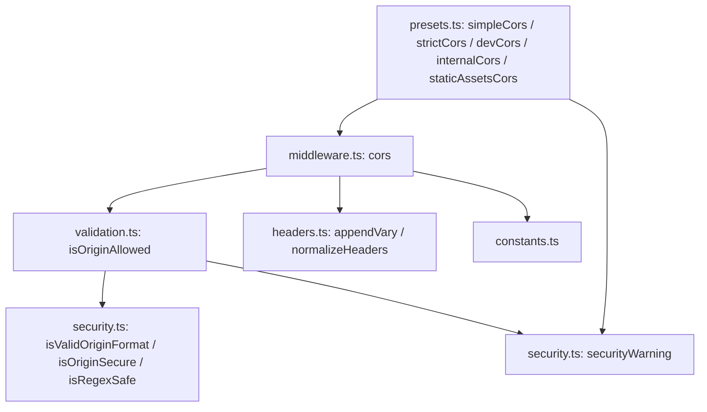
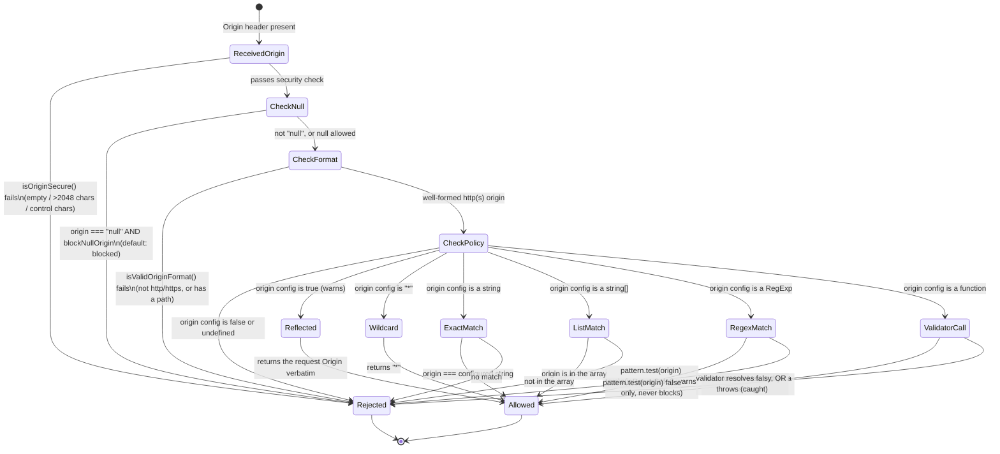

# @nextrush/cors — Architecture

> Internal design of the origin-decision pipeline, the header-injection sequence, and the security invariants (credential+wildcard rejection, null-origin blocking, ReDoS heuristics) that turn a raw `Origin` header into a spec-compliant, safe CORS response.

## At a glance

|  |  |
| --- | --- |
| **Package** | `@nextrush/cors` |
| **Layer** | `middleware` (above `types`; below nothing — a leaf middleware) |
| **Depends on** | `@nextrush/types` (types only, erased at build) — no third-party runtime deps |
| **Depended on by** | Application code that calls `app.use(cors(...))`; not depended on by any other `@nextrush/*` package |
| **Public entry** | `src/index.ts` (barrel — exports only) |
| **Internal modules** | 6 files (excl. tests) · ~1,050 LOC · largest `middleware.ts` ~260 LOC, `presets.ts` ~200 LOC — both within the 300-line package cap |
| **On the request hot path?** | Yes — runs on every request once registered; origin validation and header writes happen per request |
| **Runtime coupling** | None — zero `node:` imports; uses only `URL`, `RegExp`, `WeakMap`, and standard JavaScript |
| **State model** | Mostly stateless per request; one per-context `WeakMap` tracks accumulated `Vary` header values within a single request |

## Responsibilities

**This package owns:**

- The **CORS origin-decision pipeline** — deciding, for a given `Origin` header and configuration, whether a request is allowed and what origin string to echo back
- **`Access-Control-*` response header construction** — `Allow-Origin`, `Allow-Credentials`, `Allow-Methods`, `Allow-Headers`, `Expose-Headers`, `Max-Age`, `Allow-Private-Network`
- **Preflight (`OPTIONS`) request handling** — detecting a preflight, responding with the correct headers, and terminating the request (or passing it through, if configured)
- **Security enforcement specific to CORS** — origin format validation, null-origin blocking, credential+wildcard rejection, and ReDoS pattern heuristics for regex origins
- **`Vary` header accumulation** — ensuring origin-dependent responses are never cached across origins

**This package does NOT own:**

- General HTTP security headers (`Content-Security-Policy`, `X-Frame-Options`, `Strict-Transport-Security`) → `@nextrush/helmet`
- Rate limiting or abuse protection on the same endpoints → `@nextrush/rate-limit`
- Authentication/session validation — CORS decides whether a *browser* may read a response; it does not authenticate the request
- The middleware execution engine (`compose`, `ctx.next()`) → `@nextrush/core`
- Sending the response — it sets headers and status on `Context`; the adapter writes the actual bytes

## Non-goals

The package intentionally does not:

- Enforce server-to-server or network-level access control — CORS is a browser-enforced, client-side restriction; a non-browser HTTP client ignores it entirely
- Provide a general-purpose header-manipulation utility library — `headers.ts`'s exports are CORS-specific (`normalizeHeaders`, `appendVary`), not a generic HTTP toolkit
- Cache or persist origin-allowlist data — a dynamic `OriginValidator` function is expected to do its own caching if the lookup is expensive
- Guarantee a regex is ReDoS-free — `isRegexSafe()` is a heuristic against known dangerous shapes, not a formal proof; it warns, it does not block

## Constraints

Must remain:

- **Runtime-independent** — zero `node:*` / `process`-dependent imports outside a single feature-detected `typeof process !== 'undefined'` guard in `simpleCors()` and `securityWarning()` (used only to skip a warning in production, never to change security behavior)
- **Zero third-party dependency** — a types-only dependency on `@nextrush/types`
- **ESM-only** — no CommonJS build
- **Fail-secure by construction** — an invalid or throwing origin validator must resolve to "not allowed," never to "allowed"
- **Public API sealed** — the exported surface is semver-guarded (ADR-0005)

## Position in the package hierarchy

```mermaid
block-beta
    columns 5
    types["@nextrush/types"]:1
    space:1
    errors["@nextrush/errors"]:1
    space:1
    core["@nextrush/core"]:1
    space:5
    router["@nextrush/router"]:1
    space:3
    class["@nextrush/class"]:1
    space:5
    adapters["adapter-node / bun / deno / edge"]:5
    space:5
    block:mw:5
        columns 5
        helmet["helmet"]:1
        THIS["cors (this package)"]:1
        bodyparser["body-parser"]:1
        ratelimit["rate-limit"]:1
        etc["... other middleware"]:1
    end

    types --> errors --> core --> router --> class --> adapters --> mw

    classDef here fill:#2563eb,color:#fff,stroke:#1e40af;
    class THIS here
```

> [!IMPORTANT]
> Imports flow **downward only**. `@nextrush/cors` imports from `@nextrush/types` only, and MUST
> NOT be imported by `types`, `errors`, `core`, `router`, `class`, or any adapter (project-rules
> §1). It sits at the middleware layer as a leaf: nothing in the framework core depends on it —
> an application opts in by calling `app.use(cors(...))`.

**Dependency rules:**
- **Allowed:** `cors → types`
- **Forbidden:** `cors → core / router / class / adapters / any other middleware package`

---

## Overview

The package answers one question on every request that carries an `Origin` header: *is this cross-origin request allowed, and if so, what response headers make the browser trust it?* The organizing idea is a **linear, fail-closed decision pipeline** — each check either produces a definitive "not allowed" (and the middleware stops adding headers) or falls through to the next check, ending in an explicit allow/deny for every possible `origin` configuration shape (`boolean | string | string[] | RegExp | OriginValidator`).

`cors()` itself is a factory: it validates the *configuration* once, at middleware construction time (not per request), so that a dangerous combination like `credentials: true` with `origin: '*'` fails immediately when the application wires up its middleware — not on the first real request in production. The returned middleware closure then runs the per-request pipeline: read `Origin`, always append `Vary: Origin`, delegate the allow/deny decision to `isOriginAllowed()` in `validation.ts`, and — only if allowed — write the `Access-Control-*` headers and handle preflight termination.

Security concerns are deliberately isolated in `security.ts` (format validation, ReDoS heuristics, the origin length/control-character sanity check, and the dev-only console warning helper) rather than inlined into the decision logic in `validation.ts`. This separation means the security *primitives* (what makes an origin string "secure-looking") can be tested and reasoned about independently of the *policy* (what the configured `origin` option actually allows).

### Design principles

1. **Configuration errors fail at construction, not at request time.** `cors({ credentials: true, origin: '*' })` throws synchronously when called — enforced by an explicit `if` check at the top of `cors()` in `middleware.ts`, not by a runtime assertion buried in the request path.
2. **The origin decision is fail-secure.** Every branch of `isOriginAllowed()` that doesn't explicitly match returns `false`; a validator function that throws is caught and treated as a rejection — enforced by the `try/catch` around the custom-validator branch.
3. **`Vary: Origin` is unconditional.** `appendVary(ctx, 'Origin')` runs before the origin is even checked, so a cache sitting in front of the app can never conflate one origin's response with another's — enforced by placing the call before the early-return for a missing `Origin` header.
4. **Malformed origins are rejected before policy is even consulted.** `isOriginSecure()` (length/control-character check) and `isValidOriginFormat()` (scheme/path check) both run ahead of the `allowed` comparison in `isOriginAllowed()`, so a crafted `javascript:` or overlong origin string never reaches a user-supplied validator function.
5. **Security warnings are advisory, not enforcement, except where explicitly a hard error.** `securityWarning()` only logs (and is silenced in production); the *only* hard-enforced rule is the credential+wildcard `throw` — this asymmetry is deliberate and documented, not an oversight.

---

## Module structure

```text
src/
├── index.ts        # Public API barrel (exports only, no implementation)
├── types.ts         # CorsOptions, CorsContext, OriginOption, OriginValidator
├── constants.ts     # DEFAULT_METHODS, DEFAULT_MAX_AGE, CORS_HEADERS, PREFLIGHT_INDICATORS
├── security.ts      # isValidOriginFormat, isRegexSafe, isOriginSecure, securityWarning
├── validation.ts    # isOriginAllowed (the core decision function) + helper matchers
├── headers.ts        # normalizeHeaders, appendVary/setVaryHeaders (WeakMap-tracked), buildMethodList, parseHeaderList, headerContains
├── middleware.ts     # cors() factory, CorsOptionsBuilder, createCorsOptions()
└── presets.ts        # simpleCors, strictCors, devCors, internalCors, staticAssetsCors
```

### Module responsibilities

| Module | Responsibility (the one thing it owns) |
| ------ | -------------------------------------- |
| `types.ts` | The public option/data contracts — no logic. |
| `constants.ts` | Every literal default and header name, in one place. |
| `security.ts` | Origin-string sanity/format checks and the dev-only warning sink — no policy decisions. |
| `validation.ts` | The origin allow/deny decision for every `OriginOption` shape. |
| `headers.ts` | Header string construction and the `Vary` accumulation strategy. |
| `middleware.ts` | Wires validation + headers into the per-request middleware; owns the construction-time security checks. |
| `presets.ts` | Named, pre-validated configurations for common deployment shapes. |

## Component relationships



`presets.ts` never touches `validation.ts` or `security.ts` directly — every preset is expressed as a call into `cors()`, so a preset can never bypass the construction-time security checks or the per-request decision pipeline.

---

## Lifecycle

### Request → response (execution sequence)

How a single cross-origin `OPTIONS` preflight, followed by the real request, flows through the middleware:

```mermaid
sequenceDiagram
    participant Browser
    participant CORS as cors() middleware
    participant Val as isOriginAllowed()
    participant Ctx as Context
    participant Next as downstream handler

    Browser->>CORS: OPTIONS /api/data (Origin: https://app.example.com)
    CORS->>Ctx: appendVary(ctx, "Origin")
    CORS->>Val: isOriginAllowed(origin, config, corsContext, blockNullOrigin)
    Val->>Val: isOriginSecure(origin)? isValidOriginFormat(origin)?
    Val-->>CORS: allowedOriginValue (string) or false
    alt allowed
        CORS->>Ctx: set Access-Control-Allow-Origin
        opt credentials true
            CORS->>Ctx: set Access-Control-Allow-Credentials: true
        end
        CORS->>Ctx: appendVary "Access-Control-Request-Method" / "-Headers"
        CORS->>Ctx: set Access-Control-Allow-Methods / -Headers / -Max-Age
        alt preflightContinue is false (default)
            CORS->>Ctx: status = optionsSuccessStatus (204); body = ""
            CORS-->>Browser: 204, CORS headers, no body
        else preflightContinue is true
            CORS->>Next: await next()
        end
    else not allowed
        CORS->>Next: await next()
        Note over Browser,Next: no Access-Control-* headers set -- browser blocks the read
    end

    Browser->>CORS: GET /api/data (Origin: https://app.example.com)
    CORS->>Ctx: appendVary(ctx, "Origin")
    CORS->>Val: isOriginAllowed(...)
    Val-->>CORS: allowedOriginValue
    CORS->>Ctx: set Access-Control-Allow-Origin (+ Allow-Credentials, Expose-Headers)
    CORS->>Next: await next()
    Next-->>Browser: response body, with CORS headers already attached
```

The ordering a reader would otherwise get wrong: `Vary: Origin` is appended **before** the allow/deny decision is even made — so it is present on both allowed and rejected cross-origin responses, which is what makes downstream caching safe regardless of outcome. The preflight branch **terminates the request itself** (sets status, empty body, returns) rather than calling `next()` — a downstream route handler never sees a terminated preflight unless `preflightContinue: true` is explicitly set.

### Origin decision (state machine)

The path a single `Origin` value takes through `isOriginAllowed()`:



> [!NOTE]
> `RegexMatch` is the one branch where a security *warning* (`isRegexSafe`) and the actual
> *decision* (`pattern.test(origin)`) are independent — an unsafe-looking pattern is still
> evaluated. The heuristic exists to flag a dangerous pattern in logs, not to veto it; a genuinely
> catastrophic pattern can still cause the process to hang on the right input. Review any
> dynamic/user-supplied regex before shipping it — see `security.ts`'s `DANGEROUS_REGEX_PATTERNS`.

## State ownership

| Owner | State it owns | Scope |
| ----- | ------------- | ----- |
| `cors()` closure | `normalizedMethods`, `normalizedAllowedHeaders`, `normalizedExposedHeaders` (computed once from options) | app — set once when `cors(options)` is called |
| `varyTracker` (module-level `WeakMap` in `headers.ts`) | The set of header names already appended to `Vary` for a given `Context` object | per-request — keyed by the `Context` instance; garbage-collected with it |
| `Context` (owned by `core`) | `ctx.status`, the written response headers, `ctx.body` | per request |

There is no app-scoped mutable state beyond the closed-over, immutable-after-construction option normalization. The only per-request state is the `Vary`-tracking `Set`, deliberately backed by a `WeakMap` so it never outlives the request's `Context` object and never leaks between requests.

## Data structures

```ts
// The full configuration surface (types.ts). Every field has a security-conscious default.
interface CorsOptions {
  origin?: boolean | string | string[] | RegExp | OriginValidator; // default: false
  methods?: string | string[];               // default: 'GET,HEAD,PUT,PATCH,POST,DELETE'
  allowedHeaders?: string | string[];         // default: reflects the preflight request
  exposedHeaders?: string | string[];         // default: none sent
  credentials?: boolean;                      // default: false
  maxAge?: number;                            // default: none sent
  preflightContinue?: boolean;                // default: false
  optionsSuccessStatus?: number;               // default: 204
  privateNetworkAccess?: boolean;              // default: false
  blockNullOrigin?: boolean;                   // default: true
}

// A minimal, read-only view of Context passed to origin validators -- deliberately narrower
// than the full Context so a custom OriginValidator cannot mutate the response.
interface CorsContext {
  readonly method: string;
  readonly path: string;
  get(header: string): string | undefined;
  readonly headers: Record<string, string | string[] | undefined>;
}

type OriginValidator = (
  origin: string,
  ctx: CorsContext
) => boolean | string | Promise<boolean | string>;
```

The shape choice for `CorsContext` is deliberate: a custom `OriginValidator` needs to read request metadata (for multi-tenant lookups keyed on a header, for example) but has no legitimate reason to set response headers or advance the middleware chain — so `CorsContext` exposes only `get()`, `method`, `path`, and `headers`, never `set()` or `next()`.

## Concurrency & edge behaviour

- **Shared, immutable after construction:** the normalized `methods`/`allowedHeaders`/`exposedHeaders` strings closed over by the returned middleware function — computed once per `cors(options)` call, read on every request, never mutated.
- **Per-request, never shared:** the `Vary` tracking `Set` in the `WeakMap`, and every header value written to `Context` for that request.
- **Idempotency:** a preflight response is fully determined by the request's headers and the static configuration — replaying the same `OPTIONS` request produces an identical response with no side effects.
- **Custom validator failure:** an `OriginValidator` that throws is caught inside `isOriginAllowed()` and treated as `false` (rejected) — a buggy or unreachable-dependency validator degrades to "CORS denied," never to an unhandled rejection that crashes the request.

> [!WARNING]
> `appendVary()` reads only what it has previously tracked in its own `WeakMap` — it does not read
> back the `Vary` header via `ctx.get()` (which would read *request* headers, not the response
> being built). A contributor adding another code path that also writes `Vary` outside
> `appendVary()`/`setVaryHeaders()` will silently overwrite this package's tracked value instead of
> merging with it.

## Trust boundaries

```text
Browser-supplied Origin header (fully attacker-controlled)
   │
   ▼
isOriginSecure()  -- length / control-character sanity check         <- this package's first boundary
   │
   ▼
isValidOriginFormat()  -- scheme (http/https only) + no-path check    <- rejects javascript:/data:/file:
   │
   ▼
isOriginAllowed()  -- policy match against the configured `origin`   <- the actual allow/deny decision
   │
   ▼
Access-Control-Allow-Origin (only the approved value is ever echoed back)
```

The package treats the `Origin` header as fully untrusted, attacker-controllable input — it is a request header the browser sets, but nothing prevents a non-browser client from sending an arbitrary value. Every value is run through the security checks (`isOriginSecure`, `isValidOriginFormat`) before it is ever compared against the configured policy, so a malformed or malicious-looking origin never reaches a custom `OriginValidator` function, and the reflected value in `Access-Control-Allow-Origin` is always either a literal `'*'` or an origin string that has already passed both security checks.

## Extension points

**Supported extension points:**

- **`origin` as a function** — the sanctioned way to add dynamic/database-backed origin policy; runs after all format/security checks, so it only ever receives a well-formed `http(s)` origin.
- **The exported validation/header primitives** (`isOriginAllowed`, `isOriginInList`, `isOriginMatchingPattern`, `createOriginCache`, `normalizeHeaders`, `appendVary`, etc.) — exposed specifically so advanced integrations can build custom middleware without re-implementing CORS internals.
- **New presets** — `presets.ts` shows the pattern (always call `cors()`, never write headers directly); a new preset should follow the same shape.

**Forbidden (sealed):**

- **The credential+wildcard hard-throw** — removing or weakening this check would silently reintroduce the exact vulnerability the package exists to prevent; RFC-gated.
- **The `blockNullOrigin` default (`true`)** — changing the default would silently re-expose every existing deployment to null-origin attacks.
- **Direct manipulation of the `Vary` header outside `appendVary`/`setVaryHeaders`** — bypasses the WeakMap-based duplicate/wildcard tracking and can produce a malformed or duplicated `Vary` header.

---

## Architectural invariants

These are part of the package's architecture. They do not change without an RFC:

- **`origin` defaults to `false`** — CORS is opt-in; a fresh `cors()` call with no options adds no `Access-Control-*` headers to any response.
- **`credentials: true` + `origin: '*'` always throws at construction time** — enforced in code (`middleware.ts`), not documentation-only guidance.
- **`blockNullOrigin` defaults to `true`** — a `null` `Origin` (sandboxed iframe, `file://`, some redirects) is rejected unless explicitly opted out.
- **A throwing `OriginValidator` resolves to "not allowed," never to a crash or an implicit allow.**
- **`Vary: Origin` is appended unconditionally, before the allow/deny decision** — every cross-origin response (allowed or rejected) carries it.
- **Malformed origins (`javascript:`, `data:`, non-`http(s)`, or origins with a path) are rejected before any policy comparison runs.**
- **The package imports no runtime API** — zero `node:*` imports; the same code path runs identically on Node, Bun, Deno, and Edge runtimes.

## Engineering decisions

| Decision | Chosen | Trade-off accepted | Reference |
| -------- | ------ | ------------------ | --------- |
| Credential+wildcard enforcement | Hard `throw` at construction time | The app fails to start rather than degrading gracefully — a deliberate fail-fast choice | `middleware.ts` |
| Credential+reflect (`origin: true`) enforcement | Warning only, not a throw | Leaves a legitimate-but-risky pattern usable; relies on the developer reading the warning | `middleware.ts` |
| ReDoS defense | Heuristic pattern list (`isRegexSafe`), warn-only | Not a formal backtracking proof; a genuinely pathological pattern outside the known list still runs | `security.ts` |
| `Vary` tracking | Per-context `WeakMap`, not `ctx.get()` | Avoids reading request headers to infer response state, at the cost of an extra module-level data structure | `headers.ts` |
| Validator error handling | `try/catch` around the custom-validator call, resolves to `false` | A silently-misbehaving validator degrades to "CORS denied" rather than surfacing the error to the caller | `validation.ts` |
| Custom `CorsContext` shape | Narrower than full `Context` (no `set`/`next`) | An `OriginValidator` cannot short-circuit or mutate the response, but also cannot read anything beyond headers/method/path | `types.ts` |

## Rejected alternatives

### Throwing on `credentials: true` + `origin: true` (reflect)
Rejected: reflecting the exact request origin (not a literal wildcard) is a narrower, sometimes-legitimate pattern for setups with many trusted origins that are impractical to enumerate. Throwing here would block a valid (if risky) use case that the wildcard case does not share — a warning was chosen instead, placing the review responsibility on the developer rather than removing the option.

### Formal ReDoS-safety proof for `origin` regex patterns
Rejected: a fully sound backtracking-safety check is a significant undertaking (equivalent to the linear-time regex engine problem) and out of scope for a middleware package. A heuristic check against known dangerous shapes (`(.*)+`,  `(.+)*`, etc.) was chosen as a "catch the common mistake" signal, with the explicit caveat in both code comments and this document that it is not foolproof.

### Reading `Vary` back via `ctx.get('Vary')` before appending
Rejected: `ctx.get()` reads *request* headers in this framework's `Context` contract, not the response headers being built — using it to check for an already-set `Vary` value would silently read the wrong data. A dedicated per-context `WeakMap` was chosen instead, trading a small amount of module state for correctness.

---

## Testing strategy

- **Unit:** origin decision branches for every `OriginOption` shape (boolean, string, array, regex, function, including a throwing function); header normalization and `Vary` accumulation (including duplicate/wildcard suppression); the security primitives (`isValidOriginFormat`, `isRegexSafe`, `isOriginSecure`) against known-good and known-bad inputs.
- **Integration:** the full `cors()` middleware against simulated preflight and simple-request `Context` objects, including the construction-time throws for invalid `credentials`+`origin`/`maxAge` combinations, and each preset's resulting configuration.
- **Public-surface test:** `__tests__/public-surface.test.ts` asserts the exported API shape stays in sync with the sealed surface (ADR-0005).
- **Conformance / cross-adapter parity:** N/A directly — the package uses no runtime API; identical behavior across adapters follows from having zero `node:` imports, verified indirectly by `packages/adapters/conformance`.
- **Coverage:** >=90% lines/functions (CI-enforced).

## Evolution strategy

- **Stable (semver-guarded):** the sealed public surface — `cors()`, the presets, the builder, the exported validation/header/security primitives, and every type in `types.ts` (ADR-0005).
- **May change without notice:** the internal `DANGEROUS_REGEX_PATTERNS` list (may grow as new ReDoS shapes are identified), the `WeakMap`-based `Vary`-tracking implementation detail.
- **Changes only via RFC:** the `origin`/`blockNullOrigin` defaults, the credential+wildcard hard-throw, and the fail-secure behavior of a throwing `OriginValidator`.

**Timeline:** 3.0 — initial security-hardened CORS middleware (origin validation, null-origin blocking, credential+wildcard enforcement, ReDoS heuristics, PNA support, five presets).

## Contributor notes

Before changing this package, read: the OWASP CORS guidance linked from the README, `security.ts`'s `DANGEROUS_REGEX_PATTERNS` list and its accompanying comment, and the construction-time checks at the top of `cors()` in `middleware.ts` — any change to those checks is a security-relevant change and should be treated as RFC-gated per this document's invariants.

## Architecture checklist

Before changing this package, confirm:

- [ ] Does this preserve the architectural invariants above (especially the credential+wildcard throw and the `blockNullOrigin` default)?
- [ ] Does this increase coupling or cross a dependency rule (`cors → types` only)?
- [ ] Does this affect the request hot path (allocations in `isOriginAllowed`/`appendVary`)?
- [ ] Does this change the sealed public API (semver / ADR-0005)? Does it need an RFC?
- [ ] If this touches origin/security logic, does it remain fail-secure (deny on ambiguity or error)?

---

## References & see also

- **README (how to use it):** [`./README.md`](./README.md)
- **ADR:** [`ADR-0005 — package tiers & sealed surface`](https://github.com/0xTanzim/nextRush/blob/main/docs/adr/ADR-0005-package-tiers-sealed-surface-deprecation.md)
- **Security boundary reference:** `.kiro/steering/project-rules.instructions.md` §4 (CORS never defaults to wildcard in production — confirmed above: `origin` defaults to `false`, and `'*'`+`credentials` is a hard error)
- **Documentation site:** [nextRush docs](https://0xtanzim.github.io/nextRush/docs)
- **Repository:** [`packages/middleware/cors`](https://github.com/0xTanzim/nextRush/tree/main/packages/middleware/cors)
