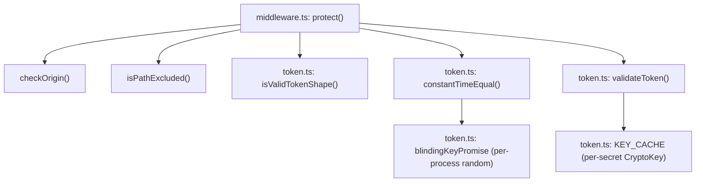
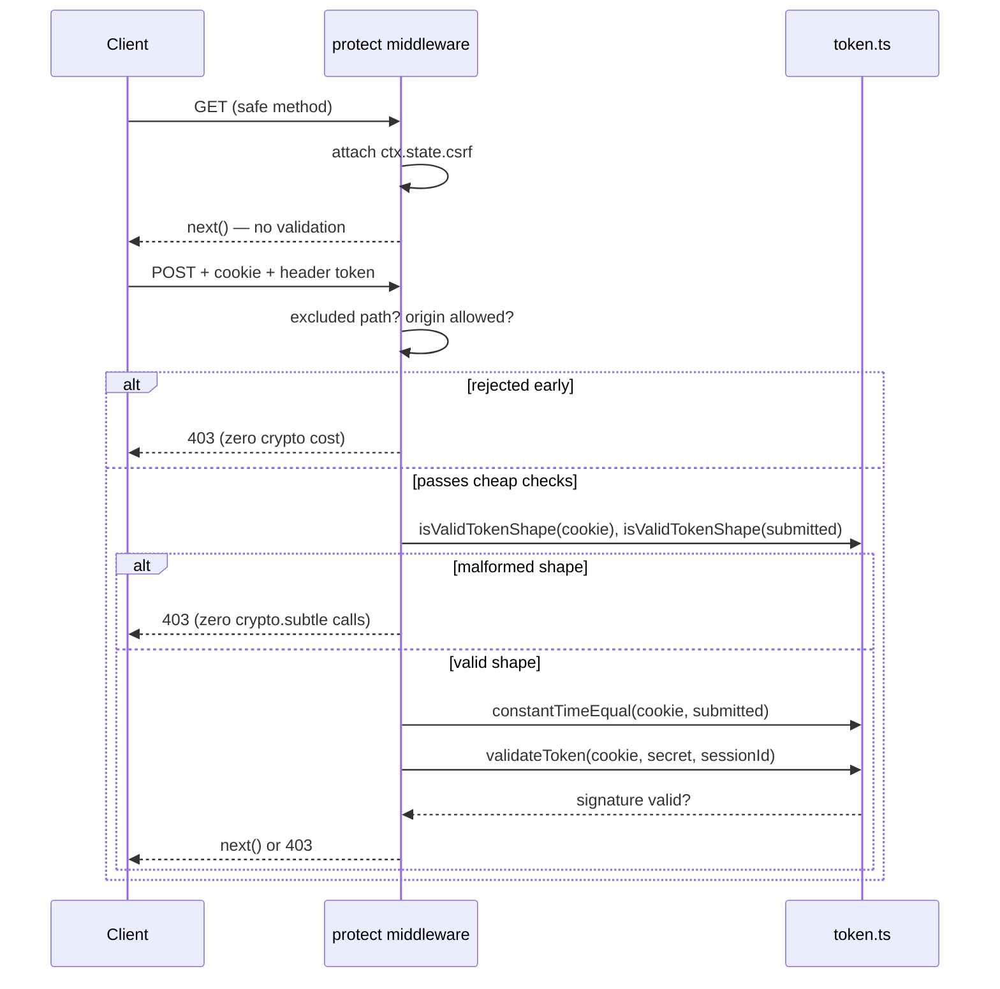
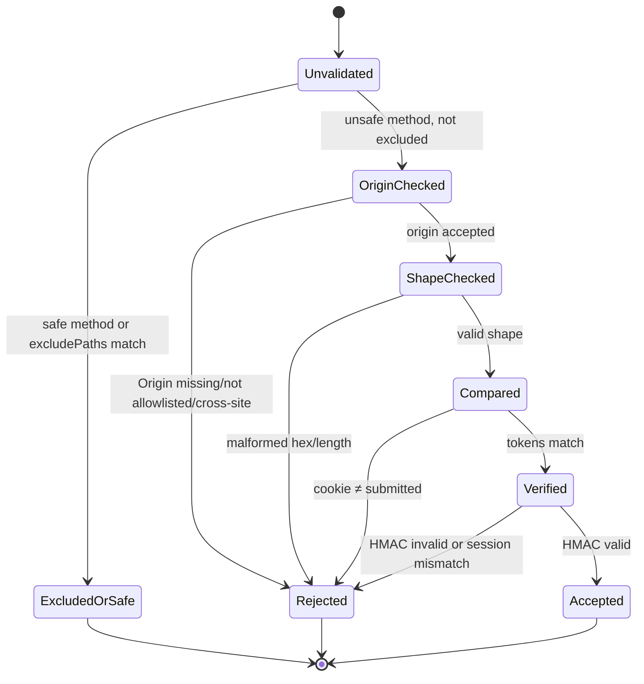

# @nextrush/csrf — Architecture

> Internal design of the signed double-submit cookie pattern: HMAC-SHA256 token construction over the Web Crypto API, the origin/session/shape validation pipeline, and why each check runs in the order it does.

## At a glance

|  |  |
| --- | --- |
| **Package** | `@nextrush/csrf` |
| **Layer** | `middleware` (above `types`; below nothing — a leaf middleware) |
| **Depends on** | `@nextrush/types` (types only, erased at build) — no third-party runtime deps |
| **Depended on by** | Application code that calls `app.use(protect)`; not depended on by any other `@nextrush/*` package |
| **Public entry** | `src/index.ts` (barrel — exports only) |
| **Internal modules** | 4 files (excl. tests) · largest `middleware.ts` ~424 LOC |
| **On the request hot path?** | Yes — `protect` and `tokenProvider` run on every request once registered |
| **Runtime coupling** | None — zero `node:*` imports; uses only `crypto.subtle` and `crypto.getRandomValues` |
| **State model** | Stateless per request; a small app-scoped bounded `CryptoKey` cache (HMAC secret + the blinding key) shared across requests |

## Responsibilities

**This package owns:**
- ✓ Signed double-submit token construction, issuance, and validation (HMAC-SHA256 over the Web Crypto API)
- ✓ The CSRF-specific cookie (independent of the application's own session cookie)
- ✓ `Origin`/`Sec-Fetch-Site` validation against an explicit allowlist
- ✓ Session-binding enforcement (as an explicit configuration decision, never a silent default)
- ✓ Path exclusion for endpoints authenticated another way (`excludePaths`)

**This package does NOT own:**
- ✗ General-purpose cookie signing for non-CSRF values → [`@nextrush/cookies`](../cookies)
- ✗ Session storage or session-identifier issuance → the application; this package only *consumes* a `getSessionIdentifier` callback
- ✗ Path canonicalization → [`@nextrush/router`](../../router); `excludePaths` matches against `ctx.path` as published by the router (see Trust boundaries)
- ✗ Origin/CORS response headers for legitimate cross-origin requests → [`@nextrush/cors`](../cors)

## Non-goals

- Encrypting the token — the token is signed (integrity/authenticity), not confidential; its structure is not meant to be secret
- Storing tokens server-side — the double-submit pattern is intentionally stateless; nothing here persists a token
- Rate-limiting validation failures — a repeated-failure throttle is an application/`@nextrush/rate-limit` concern, not this package's
- A built-in session/JWT primitive — `getSessionIdentifier` is a callback into whatever session mechanism the application already has

## Constraints

Must remain:
- **Runtime-independent** — zero `node:*` imports; token construction and comparison use only `crypto.subtle` / `crypto.getRandomValues`, identical on Node, Bun, Deno, and Edge
- **Zero third-party dependency** — a types-only dependency on `@nextrush/types`
- **ESM-only** — no CommonJS build
- **Fail closed** — a missing `Origin`, an unrecognized session identifier, or a malformed token shape all reject; nothing here falls back to trusting an attacker-controlled header
- **Public API sealed** — the exported surface is semver-guarded (ADR-0005), locked by `__tests__/public-surface.test.ts`

## Position in the package hierarchy

```mermaid
flowchart TB
    types["@nextrush/types"] --> errors["@nextrush/errors"] --> core["@nextrush/core"]
    core --> router["@nextrush/router"] --> runtime["@nextrush/runtime"] --> di["@nextrush/di"] --> class["@nextrush/class"]
    class --> adapters["adapter-node / bun / deno / edge"] --> middleware["middleware / extensions"]
    THIS["@nextrush/csrf — this package"]:::here
    middleware --> THIS
    classDef here fill:#2563eb,color:#fff,stroke:#1e40af;
```

> [!IMPORTANT]
> Imports flow **downward only**. `@nextrush/csrf` imports from `@nextrush/types` only, and MUST
> NOT be imported by `types`, `errors`, `core`, `router`, `class`, or any adapter (project-rules
> §1). It sits at the middleware layer as a leaf: an application opts in by calling
> `app.use(protect)`.

**Dependency rules:**
- **Allowed:** `csrf → types`
- **Forbidden:** `csrf → core / router / class / adapters / any other middleware package`

---

## Overview

The package implements one pattern — the signed double-submit cookie — with the validation
order chosen so a malformed or unauthorized request is rejected as cheaply as possible: path
exclusion and origin checks (string comparisons) run before any token shape check, and shape
checks run before any `crypto.subtle` call. Every reject path is closed by default; a caller
that wants a weaker mode (no session binding, a custom token source) must say so explicitly
in `CsrfOptions`, never by omission.

### Design principles

1. **Fail closed on ambiguity.** A missing `Origin`, an unset `getSessionIdentifier` with no
   `sessionBinding: 'none'` acknowledgement, and a missing `allowedOrigins` while `originCheck`
   is active all throw or reject rather than silently degrading — enforced by `resolveOptions()`
   at construction time and the `checkOrigin()`/session-comparison steps at request time.
2. **Cheapest rejection first.** `protect` orders its checks: excluded path → origin → cookie
   presence → token presence → **shape** → constant-time compare → HMAC verify. Shape checks
   (`isValidTokenShape()`) run before the first `crypto.subtle` call, enforced by
   `csrf-hardening.test.ts`'s spy assertions on `crypto.subtle.verify`/`sign`.
3. **No compile-time secret ever gates a comparison.** The blinding key used by
   `constantTimeEqual()` is generated once per process from `crypto.getRandomValues()`, never a
   literal string — enforced by `getBlindingKey()`'s lazy, random-only construction.
4. **The cookie is never the sole check.** `protect` requires the submitted token to arrive via
   header or body (`getTokenFromRequest`), independent of the cookie — enforced by the extractor
   never reading `Cookie` and validation requiring both a cookie token and a submitted token.

---

## Module structure

```text
src/
├── index.ts        # Public API exports (barrel only, no implementation)
├── types.ts        # CsrfOptions, CsrfContext, CsrfMiddleware, extractor/session types
├── constants.ts     # Defaults, header/field names, HMAC algorithm, error messages
├── token.ts         # Token construction, HMAC sign/verify, constant-time comparison
└── middleware.ts    # protect/tokenProvider, origin check, path exclusion, options resolution
```

### Module responsibilities

| Module | Responsibility (the one thing it owns) |
| ------ | -------------------------------------- |
| `types.ts` | The public configuration and context shapes |
| `constants.ts` | Every literal default, header name, and error message string |
| `token.ts` | HMAC-SHA256 token generation/validation and the blinded constant-time comparison |
| `middleware.ts` | Request-time orchestration: origin check, path exclusion, options resolution, the `protect`/`tokenProvider` middleware pair |

## Component relationships



---

## Lifecycle





The two diagrams cover different things: the sequence diagram shows *what calls what*; the state
diagram shows *why a given request ends up accepted or rejected* — the ordering between them
matters because each earlier state is cheaper to fail at than the next.

## State ownership

| Owner | State it owns | Scope |
| ----- | ------------- | ----- |
| `token.ts` module scope | `KEY_CACHE` (bounded `Map<secret, CryptoKey>`, max 10 entries) | app (shared across requests, imported lazily per secret) |
| `token.ts` module scope | `blindingKeyPromise` (one `CryptoKey`, generated once from `crypto.getRandomValues()`) | app (process lifetime) |
| `Context` (`ctx.state.csrf`) | `cookieToken`, `generateToken()` closure state (`generated` flag) | per-request |

---

## Data structures

```ts
// Token format: `<hmac-hex>.<random-hex>` — a flat string, not a structured
// object, so it round-trips through a cookie value and a header/body field
// without serialization. The HMAC covers a length-prefixed message
// (`<len>!<value>!...`) rather than simple concatenation specifically so an
// attacker cannot shift bytes between the session-id and random segments to
// forge a different logical message with the same byte string.
type Token = `${string}.${string}`; // hmacHex.randomHex
```

## Concurrency & edge behaviour

- **Shared, immutable after first use:** `KEY_CACHE` entries and the blinding key — each `CryptoKey` is imported once and reused; concurrent `constantTimeEqual()`/`validateToken()` calls await the same cached promise rather than racing separate imports
- **Per-request, never shared:** `ctx.state.csrf`, including the `generated` flag that ensures concurrent `generateToken()` calls within one request set `Set-Cookie` exactly once
- **Abort / disconnect / timeout:** N/A — validation is synchronous relative to the request; no long-lived resource is held open

> [!WARNING]
> `KEY_CACHE` evicts the oldest entry past 10 distinct secrets. An application rotating secrets
> far more often than that within one process will pay a re-import cost on the evicted key —
> expected, not a bug, but worth knowing before assuming the cache is unbounded.

## Trust boundaries

```text
User input ──▶ HTTP ──▶ Context (ctx.path, ctx.get(header), ctx.body) ──▶ protect()
                                                                              ▲
                                                        the boundary THIS package enforces
```

This package treats `ctx.path`, every request header, the `Cookie` header, and the parsed body
as fully untrusted. It does **not** treat `ctx.path` as pre-canonicalized on its own authority —
`excludePaths` matching runs against whatever `ctx.path` the router currently publishes; full
correctness of the exact-segment/any-depth wildcard contract depends on the router's
canonicalization guarantee (tracked as a cross-workstream dependency — see Engineering decisions).

## Extension points

**Supported extension points:**
- `getTokenFromRequest` — a fully custom extractor, including opting back into query-string reads
- `onError` — a fully custom validation-failure response
- `secret` as a function — enables key rotation without restarting the process

**Forbidden (sealed):**
- The token format (`<hmac-hex>.<random-hex>`) and the HMAC message construction — changing either breaks compatibility with tokens already issued to clients
- Reading the submitted token from the `Cookie` header — would collapse the double-submit pattern back to cookie-only validation

---

## Architectural invariants

The following are part of the package architecture. They do not change without an RFC:

- Origin validation never compares against `Host` — only against the configured `allowedOrigins` allowlist
- Session binding is never a silent default — `csrf()` throws unless `getSessionIdentifier` or `sessionBinding: 'none'` is supplied
- Token shape validation runs before any `crypto.subtle` call
- The comparison blinding key is a per-process random value, never a literal string
- The default token extractor never reads the query string
- `cookie.maxAge` is emitted only when explicitly configured — an omitted value never coerces to `Max-Age=0`
- The public API is explicit and sealed (ADR-0005)

## Engineering decisions

| Decision | Chosen | Trade-off accepted | Reference |
| -------- | ------ | ------------------- | --------- |
| Origin source of truth | `Origin` header against an explicit allowlist | Requires the application to enumerate `allowedOrigins`; no automatic same-origin inference | `openspec/changes/harden-security-boundaries/tasks.md` §5.4–5.5 |
| Session binding default | Required decision (`getSessionIdentifier` or `sessionBinding: 'none'`) | A caller with no session layer yet must explicitly opt into the weaker mode, rather than getting it silently | tasks.md §5.6 |
| `excludePaths` wildcard depth | `/*` exactly one segment, `/**` any depth | Two distinct wildcards to learn instead of one greedy pattern | tasks.md §5.9 |
| `excludePaths` canonicalization precondition | Matches against `ctx.path` as published today | Full correctness of the exact-boundary contract is contingent on the router's canonicalization work landing (tracked cross-workstream dependency, not yet merged at time of writing) | tasks.md §5.9 note; `report/security-review-remediation-index.md` SEC-15 row |
| Query-string token fallback | Removed from the default extractor | A caller who genuinely needs it must opt in via a custom `getTokenFromRequest` | tasks.md §5.10 |

## Rejected alternatives

### Comparing `Origin` against `Host` as a fallback
Rejected because `Host` is attacker-controlled on any request the client fully constructs — a
forged `Host` alongside a forged `Origin` would pass a same-value check while still being a
cross-site forgery. The allowlist is the only trustworthy comparison basis.

### A hardcoded string as the constant-time comparison blinding key
Rejected because a literal string is visible in the published source, making the "blinding"
property purely cosmetic — anyone reading the package's source could reconstruct the comparison
exactly. A per-process random key removes that reproducibility.

---

## Testing strategy

- **Unit:** `token.ts` behavior (`csrf.test.ts`'s `Token Engine` suite) — generation shape,
  validation branches, hex/length edge cases
- **Integration:** `csrf.test.ts` and `csrf-hardening.test.ts` drive `protect`/`tokenProvider`
  through a mock `Context`, exercising the full origin → shape → compare → verify pipeline
- **Invariant tests:** `csrf-hardening.test.ts` §5.7–5.8 assert the blinding key is not a literal
  and that shape-rejected requests perform zero `crypto.subtle` calls
- **Conformance / cross-adapter parity:** N/A — this package touches no adapter-specific API
- **Benchmark / regression:** N/A — not on the router/adapter hot-path tier tracked by
  `apps/benchmark`
- **Coverage:** ≥90% lines/functions, ≥85% branches (CI-enforced)

## Evolution strategy

- **Stable (semver-guarded):** the public API — `csrf`, `generateToken`, `validateToken`,
  `constantTimeEqual`, and all exported types
- **May change without notice:** internal module layout, the exact key-cache eviction policy
- **Changes only via RFC:** the architectural invariants above, and the token format

**Timeline:** `1.0.0-beta.0` hardened defaults (origin, session binding, `Max-Age`, token
extraction) → future: `@nextrush/session` integration once that package exists, tightening
`getSessionIdentifier` from a bare callback to a typed session accessor.

## Contributor notes

Before changing this package, read: `openspec/changes/harden-security-boundaries/tasks.md` §5,
`report/security-review-remediation-index.md` (SEC-03, SEC-04, SEC-05, SEC-06, SEC-15, SEC-19
rows), and the `csrf-hardening.test.ts` suite — each `describe` block maps to one numbered task.

## Architecture checklist

Before changing this package, confirm:
- [ ] Does this preserve the architectural invariants?
- [ ] Does this increase coupling or cross a dependency rule?
- [ ] Does this affect a hot path (allocations / complexity)?
- [ ] Does this change the public API (semver / ADR-0005)?
- [ ] Does it need an RFC?

---

## References & see also

- **README (how to use it):** [`./README.md`](./README.md)
- **Governing task list:** [`openspec/changes/harden-security-boundaries/tasks.md`](../../../openspec/changes/harden-security-boundaries/tasks.md) §5
- **Remediation index:** [`report/security-review-remediation-index.md`](../../../report/security-review-remediation-index.md)
- **Benchmarks:** N/A — not a benchmarked package
