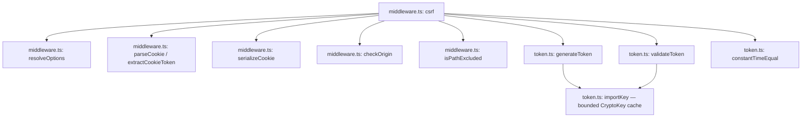

# @nextrush/csrf — Architecture

> Internal design of the Signed Double-Submit Cookie pattern: HMAC-SHA256 token generation over the Web Crypto API, the double-submit comparison, and the security invariants (session binding, `__Host-` cookie constraints, fail-secure defaults) that turn a request into an accept/reject decision.

## At a glance

|  |  |
| --- | --- |
| **Package** | `@nextrush/csrf` |
| **Layer** | `middleware` (above `types`; below nothing — a leaf middleware) |
| **Depends on** | `@nextrush/types` (types only, erased at build) — no third-party runtime deps |
| **Depended on by** | Application code that calls `app.use(protect)`; not depended on by any other `@nextrush/*` package |
| **Public entry** | `src/index.ts` (barrel — exports only) |
| **Internal modules** | 4 files (excl. tests) · ~750 LOC · largest `middleware.ts` ~400 LOC (package cap 300 for a single unit — see Contributor notes) |
| **On the request hot path?** | Yes — runs on every non-safe-method request once registered; token comparison and HMAC verification happen per request |
| **Runtime coupling** | None — zero `node:` imports; uses only `crypto.subtle` (Web Crypto API), `TextEncoder`, `Uint8Array` |
| **State model** | Stateless per request, except a small module-level bounded `CryptoKey` cache shared across requests |

## Responsibilities

**This package owns:**

- **CSRF token generation** — a random value plus an HMAC-SHA256 signature over that value (and an optional session identifier)
- **CSRF token validation** — the double-submit comparison (cookie value vs. submitted value) *and* the HMAC signature check
- **The CSRF cookie** — serializing and setting the `Set-Cookie` header for the token, including `__Host-` prefix constraint enforcement
- **Safe-method / excluded-path exemption** — deciding which requests skip validation
- **Optional origin/`Sec-Fetch-Site` defense-in-depth check** — a secondary signal independent of the token

**This package does NOT own:**

- Session management or session-store persistence → the application; this package only accepts an optional `getSessionIdentifier` callback
- General-purpose cookie parsing/signing for non-CSRF cookies → [`@nextrush/cookies`](../cookies)
- General HTTP security headers (`Content-Security-Policy`, `X-Frame-Options`) → [`@nextrush/helmet`](../helmet)
- Request body parsing — `getTokenFromRequest`'s default form-field check reads `ctx.body`, but parsing it is [`@nextrush/body-parser`](../body-parser)'s job
- The middleware execution engine (`compose`, `ctx.next()`) → `@nextrush/core`

## Non-goals

The package intentionally does not:

- Rotate the token automatically on every request — a token is valid until the cookie expires or `generateToken()` is called again (see Lifecycle below); building a rotate-per-request scheme is left to the application if it needs one
- Provide server-side session storage — `getSessionIdentifier` is a pure extraction callback; the package never reads or writes a session store itself
- Guarantee protection for a non-cookie-based auth scheme — a bearer-token-only API has nothing for this package to protect (see the README FAQ)
- Implement a synchronizer-token (server-side token store) pattern — the design is exclusively the stateless double-submit variant

## Constraints

Must remain:

- **Runtime-independent** — zero `node:*` imports; token crypto uses only the Web Crypto API (`crypto.subtle`, `crypto.getRandomValues`), identical on Node, Bun, Deno, and Edge
- **Zero third-party dependency** — a types-only dependency on `@nextrush/types`
- **ESM-only** — no CommonJS build
- **Fail-secure by construction** — a missing cookie, missing submitted token, mismatched tokens, or invalid HMAC all reject the request; there is no code path that defaults to "allow" on ambiguity
- **Public API sealed** — the exported surface is semver-guarded (ADR-0005)

## Position in the package hierarchy

```mermaid
flowchart TB
    types["@nextrush/types"] --> errors["@nextrush/errors"] --> core["@nextrush/core"]
    core --> router["@nextrush/router"] --> runtime["@nextrush/runtime"] --> di["@nextrush/di"] --> class["@nextrush/class"]
    class --> adapters["adapter-node / bun / deno / edge"] --> middleware["middleware / extensions"]
    THIS["@nextrush/csrf — this package"]:::here
    middleware --> THIS
    classDef here fill:#2563eb,color:#fff,stroke:#1e40af;
```

> [!IMPORTANT]
> Imports flow **downward only**. `@nextrush/csrf` imports from `@nextrush/types` only, and MUST
> NOT be imported by `types`, `errors`, `core`, `router`, `class`, or any adapter (project-rules
> §1). It sits at the middleware layer as a leaf: nothing in the framework core depends on it —
> an application opts in by calling `app.use(protect)`.

**Dependency rules:**
- **Allowed:** `csrf → types`
- **Forbidden:** `csrf → core / router / class / adapters / any other middleware package`

---

## Overview

The package implements one specific, well-studied CSRF defense: the **Signed Double-Submit Cookie pattern**. A random value is generated, signed with HMAC-SHA256 under a server-held secret, and stored client-side in a cookie that JavaScript can read (not `httpOnly`). A protected request must echo that same value back through a header, body field, or query parameter — proving the request originated from a page that could read the cookie — and the server independently re-verifies the HMAC signature over that value, proving the value was genuinely issued by this server rather than fabricated or substituted via a cookie-injection attack.

The two checks are deliberately layered, not redundant: the double-submit comparison (`constantTimeEqual` in `token.ts`) proves the *request* carries the same value as the cookie; the HMAC verification (`validateToken`) proves that value was never tampered with and, if `getSessionIdentifier` is configured, that it was issued for *this* session. An attacker who can inject an arbitrary cookie (e.g. via a sibling subdomain without `__Host-` isolation) can pass the double-submit check but not the HMAC check, because they lack the server's secret.

Token generation and validation are isolated in `token.ts` as pure, dependency-free functions operating only on strings and the Web Crypto API — no `Context`, no cookies, no HTTP concerns. `middleware.ts` is the only module that touches `Context`, cookies, and the request lifecycle; it composes the pure token functions with cookie parsing/serialization and the per-request decision sequence.

### Design principles

1. **Token validity is decoupled from request lifetime.** `generateToken()` is called explicitly (via `tokenProvider` or inside application code), not automatically per request — enforced by the fact that `protect` never calls `generateToken()` itself, only `createCsrfContext()`'s lazily-invoked method does.
2. **Every rejection path returns the same generic failure shape.** All five distinct failure reasons (`MISSING_COOKIE`, `MISSING_TOKEN`, `TOKEN_MISMATCH`, `INVALID_TOKEN`, `ORIGIN_MISMATCH`) flow through the same `onError(ctx, reason)` call in `protect` — the *reason* is available to a custom handler, but the default handler's response shape does not otherwise vary by failure type.
3. **Configuration errors fail at construction, not at request time.** A secret under 32 characters, or a `__Host-` cookie name paired with `secure: false` / a `domain` / a non-`/` path, all throw synchronously inside `resolveOptions()` when `csrf()` is called — enforced by explicit `if` checks before the middleware closures are created.
4. **The HMAC message format is fixed and OWASP-shaped.** `buildMessage()` in `token.ts` always encodes `<sessionId.length>!<sessionId>!<random.length>!<randomHex>` (or the no-session variant) — length-prefixing each field prevents ambiguous concatenation attacks where a crafted session ID could be mistaken for part of the random value.
5. **Comparison is constant-time by construction, not by convention.** `constantTimeEqual()` signs both operands with a fixed internal HMAC key and compares the signatures via `crypto.subtle.verify` — it never does a direct `===` or loop-based byte comparison that could leak timing information.

---

## Module structure

```text
src/
├── index.ts        # Public API barrel (exports only, no implementation)
├── types.ts        # CsrfOptions, CsrfContext, CsrfMiddleware, CsrfCookieOptions, extractor types
├── constants.ts     # DEFAULT_COOKIE_NAME, DEFAULT_TOKEN_SIZE, DEFAULT_IGNORED_METHODS, headers, ERRORS
├── token.ts         # generateToken, validateToken, constantTimeEqual (pure, no Context dependency)
└── middleware.ts    # csrf() factory — cookie parsing/serialization, origin check, path exclusion, protect/tokenProvider
```

### Module responsibilities

| Module | Responsibility (the one thing it owns) |
| ------ | -------------------------------------- |
| `types.ts` | The public option/data contracts — no logic. |
| `constants.ts` | Every literal default, header name, and error message, in one place. |
| `token.ts` | HMAC-SHA256 token generation, validation, and constant-time comparison — pure functions over strings, independent of `Context`. |
| `middleware.ts` | Cookie parsing/serialization, safe-method/path exemption, origin check, and the `protect`/`tokenProvider` middleware closures. |

## Component relationships



`token.ts` never imports from `middleware.ts` or `@nextrush/types` — it has no dependency on `Context` at all, so its correctness can be reasoned about (and tested) purely in terms of strings and the Web Crypto API.

---

## Lifecycle

### Token lifecycle (state machine)

The states a single generated token value passes through, from issuance to expiry:

```mermaid
stateDiagram-v2
    [*] --> Issued: generateToken() called\n(tokenProvider route or app code)
    Issued --> CookieSet: Set-Cookie written\n(__Host-csrf=<hmac>.<random>)

    CookieSet --> SubmittedForValidation: client echoes the value\nvia header / body / query
    CookieSet --> Expired: Max-Age elapses\n(or session ends, if no Max-Age set)

    SubmittedForValidation --> DoubleSubmitChecked: constantTimeEqual(cookieToken, submittedToken)
    DoubleSubmitChecked --> Rejected: mismatch
    DoubleSubmitChecked --> HmacChecked: match

    HmacChecked --> Rejected: validateToken() fails\n(bad signature, wrong session id, or format)
    HmacChecked --> Validated: signature verifies

    Validated --> CookieSet: token remains valid for reuse\n(no rotation on success)

    Expired --> [*]
    Rejected --> [*]: request denied via onError();\ntoken itself is untouched
```



> [!NOTE]
> There is no `Rotated` state in this diagram because the package performs **no automatic
> rotation**. `Validated --> CookieSet` is a self-loop: a successfully validated token stays
> exactly as valid for the next request as it was for this one. The only way a new token comes
> into existence is another explicit `generateToken()` call, which is a fresh `Issued` transition,
> not a transition out of `Validated`.

### Request validation (sequence)

How a single protected request (e.g. `POST /api/transfer`) flows through `protect`:

```mermaid
sequenceDiagram
    participant Client
    participant Protect as protect() middleware
    participant Cookie as extractCookieToken()
    participant Extract as getTokenFromRequest()
    participant Compare as constantTimeEqual()
    participant Verify as validateToken()
    participant Next as downstream handler

    Client->>Protect: POST /api/transfer\n(Cookie: __Host-csrf=H.R; X-CSRF-Token: H.R)
    Protect->>Cookie: extractCookieToken(ctx)
    Cookie-->>Protect: cookieToken ("H.R" or undefined)
    Protect->>Protect: ctx.state.csrf = createCsrfContext(ctx, cookieToken)

    alt method is GET/HEAD/OPTIONS/TRACE
        Protect->>Next: next()  (validation skipped)
    else path matches excludePaths
        Protect->>Next: next()  (validation skipped)
    else
        opt originCheck enabled
            Protect->>Protect: checkOrigin(ctx, allowedOrigins)
            Protect-->>Client: onError() if origin/Sec-Fetch-Site mismatch (403)
        end

        alt cookieToken is undefined
            Protect-->>Client: onError(ctx, "MISSING_COOKIE") (403)
        else
            Protect->>Extract: getTokenFromRequest(ctx)
            Extract-->>Protect: submittedToken (or undefined)

            alt submittedToken is undefined
                Protect-->>Client: onError(ctx, "MISSING_TOKEN") (403)
            else
                Protect->>Compare: constantTimeEqual(cookieToken, submittedToken)
                Compare-->>Protect: tokensMatch

                alt tokensMatch is false
                    Protect-->>Client: onError(ctx, "TOKEN_MISMATCH") (403)
                else
                    Protect->>Verify: validateToken(cookieToken, secret, sessionId?)
                    Verify-->>Protect: isValid

                    alt isValid is false
                        Protect-->>Client: onError(ctx, "INVALID_TOKEN") (403)
                    else
                        Protect->>Next: next()
                        Next-->>Client: response
                    end
                end
            end
        end
    end
```

The ordering a reader would otherwise get wrong: the **double-submit comparison runs before the HMAC verification**, not the reverse. This means a request with a tampered cookie value that happens to also tamper the submitted value consistently still fails at the double-submit stage if the two do not match exactly, and only requests that clear the double-submit check ever pay the cost of an HMAC verify — a minor but deliberate ordering for the common-case reject-fast path (a request with no matching submitted token at all never reaches the crypto verification step).

## State ownership

| Owner | State it owns | Scope |
| ----- | ------------- | ----- |
| `resolveOptions()` result (`csrf()` closure) | Normalized options — `getSecret`, `ignoredMethods` (as a `Set`), `cookie` config, `onError` | app — computed once per `csrf(options)` call |
| `KEY_CACHE` (module-level `Map` in `token.ts`) | Up to 10 imported `CryptoKey` objects, keyed by secret string | app — shared across every `csrf()` instance and every request in the process |
| `Context` (owned by `core`) | `ctx.status`, response headers (including `Set-Cookie`), `ctx.state.csrf` | per request |
| Client's cookie store | The signed token value itself | per browser/client — outlives any single request |

There is no per-request mutable module state; the `KEY_CACHE` is the one piece of app-scoped (not per-request) state, and it is bounded (`MAX_CACHED_KEYS = 10`) with FIFO eviction rather than growing unbounded across a long-running process.

## Data structures

```ts
// The token format itself (token.ts) — not a typed structure, but a fixed string shape:
//   `${hmacHex}${TOKEN_SEPARATOR}${randomHex}`   e.g. "3af2...b9c1.7e40...02ab"
// The HMAC covers a length-prefixed message, never the raw concatenation:
//   with session:    `${sessionId.length}!${sessionId}!${randomHex.length}!${randomHex}`
//   without session: `${randomHex.length}!${randomHex}`

// The full configuration surface (types.ts). Every field has a security-conscious default.
interface CsrfOptions {
  secret: string | (() => string);                       // required, >= 32 chars
  getSessionIdentifier?: (ctx: Context) => string | undefined;
  getTokenFromRequest?: (ctx: Context) => string | undefined | null;
  ignoredMethods?: string[];                              // default: GET, HEAD, OPTIONS, TRACE
  excludePaths?: string[];
  cookie?: CsrfCookieOptions;                             // name defaults to '__Host-csrf'
  tokenSize?: number;                                      // default: 32 (bytes)
  onError?: (ctx: Context, reason: string) => void | Promise<void>;
  originCheck?: boolean;                                   // default: false
  allowedOrigins?: string[];
}
```

The token format's length-prefixing (`<len>!<value>`) is the load-bearing choice: without it, an HMAC over a naive concatenation of `sessionId + randomHex` would let an attacker who controls part of the session identifier shift bytes between the two fields and potentially produce a colliding message for a different (sessionId, random) pair. Prefixing each field with its own length removes that ambiguity entirely — the message is unambiguously segmentable.

## Concurrency & edge behaviour

- **Shared, immutable after construction:** the normalized `ignoredMethods` `Set`, `cookie` config object, and `getSecret`/`onError` closures held by the `csrf()` return value — computed once, read on every request, never mutated.
- **Shared, mutable, bounded:** `KEY_CACHE` in `token.ts` — a `CryptoKey` is imported once per distinct secret string and reused; eviction is FIFO once the cache reaches 10 entries. Concurrent requests using the same secret share the same cached key with no lock (JS's single-threaded event loop makes the read-check-insert sequence safe without explicit synchronization).
- **Per-request, never shared:** the `cookieToken` extracted from `Context`, the `CsrfContext` object created for that request, and the `generated` flag inside `createCsrfContext()` that prevents a second `Set-Cookie` write within the same request if `generateToken()` is somehow called twice.
- **Idempotency:** a validation check is fully determined by the request's cookie/header/body values and the current secret — replaying an identical request produces an identical accept/reject outcome, as long as the secret and any session-identifier source haven't changed.

> [!WARNING]
> `getSecret` may be a function (for key rotation), and it is called fresh on every
> `generateToken()`/`validateToken()` invocation rather than cached at `csrf()` construction time.
> A contributor changing a rotating secret mid-flight must ensure tokens signed under the
> *previous* secret are still verifiable during the rotation window (e.g. by accepting both old
> and new secrets in the function), or in-flight tokens issued just before rotation will fail
> validation immediately after.

## Trust boundaries

```text
Browser-supplied cookie value + submitted token (header/body/query) — fully attacker-controlled
   │
   ▼
extractCookieToken() / getTokenFromRequest()  -- read, not yet trusted           <- this package's entry point
   │
   ▼
constantTimeEqual(cookieToken, submittedToken)  -- double-submit proof          <- proves the requester could read the cookie
   │
   ▼
validateToken(cookieToken, secret, sessionId?)  -- HMAC signature verification  <- proves the server actually issued this value
   │
   ▼
next()  -- only reached once both checks pass
```

The package treats both the cookie value and the submitted token as fully untrusted input — neither is compared against anything server-side-stored (there is no session-keyed token table); trust is established entirely through the HMAC signature, which only the holder of `secret` could have produced. A request that supplies a syntactically well-formed but unsigned or wrongly-signed token is rejected at the `validateToken()` boundary regardless of whether it happens to match the cookie.

## Extension points

**Supported extension points:**

- **`getTokenFromRequest`** — the sanctioned way to change where the submitted token is read from (a custom header name, a different body shape); the default checks header, then Angular-style header, then body, then query, in that order.
- **`getSessionIdentifier`** — the sanctioned way to bind tokens to session state without this package taking a dependency on any specific session implementation.
- **`onError`** — the sanctioned way to customize the failure response shape; every rejection path in `protect` funnels through it with a specific `reason` string from `ERRORS`.
- **The exported low-level primitives** (`generateToken`, `validateToken`, `constantTimeEqual`) — exposed specifically so advanced integrations can build a custom middleware shape without re-implementing the crypto.

**Forbidden (sealed):**

- **Reading the submitted token from the cookie itself** — this would collapse the double-submit pattern into a cookie-only check, which the package's own type documentation (`TokenExtractor`) explicitly calls out as insecure; not exposed as a configuration path.
- **The HMAC message format (`buildMessage`)** — changing the length-prefix scheme breaks verification of every token issued before the change; RFC-gated.
- **The constant-time comparison mechanism** — replacing `constantTimeEqual`'s HMAC-based approach with a direct `===` or naive loop would reintroduce a timing side-channel; sealed.

---

## Architectural invariants

These are part of the package's architecture. They do not change without an RFC:

- **A token is never trusted from the cookie alone** — every protected request requires both a matching submitted value *and* a valid HMAC signature.
- **`secret` must be at least 32 characters, validated at construction** — enforced in `resolveOptions()`, not documentation-only guidance.
- **The `__Host-` cookie prefix's constraints (`secure: true`, no `domain`, `path: '/'`) are validated together at construction when the default cookie name is used.**
- **Token comparison is constant-time** — `constantTimeEqual()` never short-circuits on a byte-by-byte basis.
- **There is no automatic token rotation** — a token remains valid until the cookie expires or `generateToken()` is explicitly called again.
- **A throwing or missing token extractor path resolves to rejection, never to an implicit allow.**
- **The package imports no runtime API** — zero `node:*` imports; the same code path runs identically on Node, Bun, Deno, and Edge runtimes.

## Engineering decisions

| Decision | Chosen | Trade-off accepted | Reference |
| -------- | ------ | ------------------ | --------- |
| CSRF defense pattern | Signed Double-Submit Cookie (stateless) | No server-side per-token revocation list; a leaked, still-signed token remains valid until the cookie expires | `middleware.ts`, `token.ts` |
| Token rotation | None automatic — one token reused until re-generated | Simpler mental model and no extra round-trips, at the cost of a longer-lived token if never re-issued | `middleware.ts` (`createCsrfContext`) |
| HMAC message shape | Length-prefixed fields (`<len>!<value>!...`) | Slightly larger message to sign, in exchange for unambiguous field boundaries | `token.ts` (`buildMessage`) |
| Constant-time comparison | HMAC-based (`crypto.subtle.verify`), not a manual loop | Two extra `crypto.subtle` calls per comparison, in exchange for engine-independent timing safety | `token.ts` (`constantTimeEqual`) |
| `CryptoKey` caching | Bounded `Map`, FIFO eviction at 10 entries | Avoids re-importing a key on every request for the common single/rotating-secret case, at the cost of a small shared cache to reason about | `token.ts` (`importKey`) |
| Default cookie name | `__Host-csrf` | Strongest cookie-scoping guarantee, at the cost of forcing HTTPS and a fixed path in every deployment using the default | `constants.ts`, `middleware.ts` |
| Origin check | Opt-in (`originCheck: false` by default) | Not enabled by default because it needs the app to reason about its own trusted origins; the token check alone is the primary defense | `middleware.ts` (`checkOrigin`) |

## Rejected alternatives

### Synchronizer token pattern (server-side token store)
Rejected: storing issued tokens server-side (in a session store or database) would let the server invalidate a specific token on demand, but it requires session state and storage this package deliberately does not own (see Non-goals). The double-submit variant was chosen to keep the package stateless and usable with or without a session layer.

### Automatic per-request token rotation
Rejected: rotating the token on every successful validation is a stronger defense against token replay within a session, but it requires the client to always read the freshest `Set-Cookie` before its next request — a race-prone requirement for concurrent tabs or rapid sequential requests from the same page. A single reusable, HMAC-signed token was chosen instead, accepting a longer replay window in exchange for a simpler, race-free client contract.

### Direct `===` string comparison for the double-submit check
Rejected: naive string comparison in JavaScript can leak timing information proportional to the position of the first mismatched character in some engines. An HMAC-based constant-time comparison (`constantTimeEqual`) was chosen instead, at the cost of two extra Web Crypto calls per validated request.

---

## Testing strategy

- **Unit:** token generation/validation round-trips (with and without a session identifier), the double-submit comparison for matching/mismatching/malformed inputs, hex validation, and the `KEY_CACHE` eviction behavior.
- **Integration:** the full `protect` and `tokenProvider` middleware against simulated `Context` objects, covering every rejection path (`MISSING_COOKIE`, `MISSING_TOKEN`, `TOKEN_MISMATCH`, `INVALID_TOKEN`, `ORIGIN_MISMATCH`), the `__Host-` prefix construction-time validation, and path exclusion glob matching.
- **Public-surface test:** `__tests__/public-surface.test.ts` asserts the exported API shape stays in sync with the sealed surface (ADR-0005).
- **Conformance / cross-adapter parity:** N/A directly — the package uses no runtime API; identical behavior across adapters follows from having zero `node:` imports, verified indirectly by `packages/adapters/conformance`.
- **Coverage:** >=90% lines/functions (CI-enforced).

## Evolution strategy

- **Stable (semver-guarded):** the sealed public surface — `csrf()`, `generateToken`, `validateToken`, `constantTimeEqual`, and every type in `types.ts` (ADR-0005).
- **May change without notice:** the `KEY_CACHE` size/eviction implementation detail, the internal glob-matching implementation in `isPathExcluded`.
- **Changes only via RFC:** the HMAC message format, the double-submit-plus-HMAC pattern itself (vs. an alternative CSRF strategy), the `__Host-` default and its enforced constraints, and the constant-time comparison mechanism.

**Timeline:** 1.0 — initial Signed Double-Submit Cookie implementation (HMAC-SHA256 signing, optional session binding, optional origin check, `__Host-` cookie default).

## Contributor notes

Before changing this package, read: the OWASP CSRF Prevention Cheat Sheet (the pattern this package implements), `token.ts`'s `buildMessage()` comment on the length-prefix format, and the construction-time validation in `resolveOptions()` — any change to the token format or the construction-time checks is a security-relevant change and should be treated as RFC-gated per this document's invariants. Note also that `middleware.ts` currently sits above the package's usual 300-line-per-file target (~400 LOC) by consolidating cookie parsing, origin checking, path exclusion, options resolution, and both middleware closures — a future split (e.g. extracting `resolveOptions`/`serializeCookie` into a dedicated `options.ts`) is a reasonable non-breaking refactor, not an architectural change.

## Architecture checklist

Before changing this package, confirm:

- [ ] Does this preserve the architectural invariants above (especially the no-rotation default and constant-time comparison)?
- [ ] Does this increase coupling or cross a dependency rule (`csrf → types` only)?
- [ ] Does this affect the request hot path (allocations/crypto calls in `protect`)?
- [ ] Does this change the sealed public API (semver / ADR-0005)? Does it need an RFC?
- [ ] If this touches token/security logic, does it remain fail-secure (deny on ambiguity or error)?

---

## References & see also

- **README (how to use it):** [`./README.md`](./README.md)
- **ADR:** [`ADR-0005 — package tiers & sealed surface`](https://github.com/0xTanzim/nextRush/blob/main/docs/adr/ADR-0005-package-tiers-sealed-surface-deprecation.md)
- **Security boundary reference:** `.kiro/steering/project-rules.instructions.md` §4
- **Documentation site:** [nextRush docs](https://0xtanzim.github.io/nextRush/docs)
- **Repository:** [`packages/middleware/csrf`](https://github.com/0xTanzim/nextRush/tree/main/packages/middleware/csrf)
