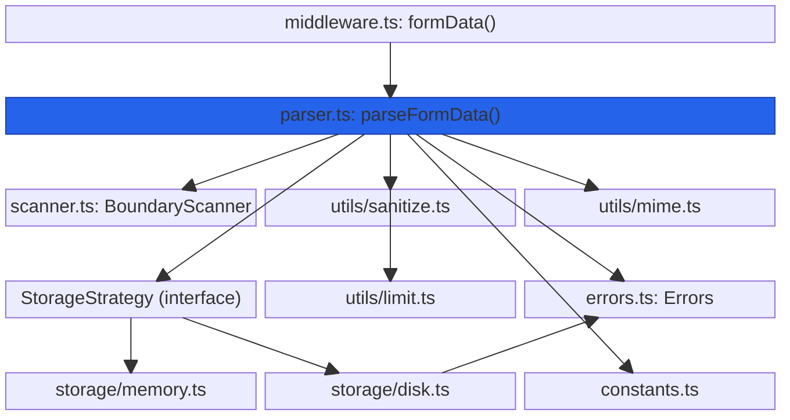
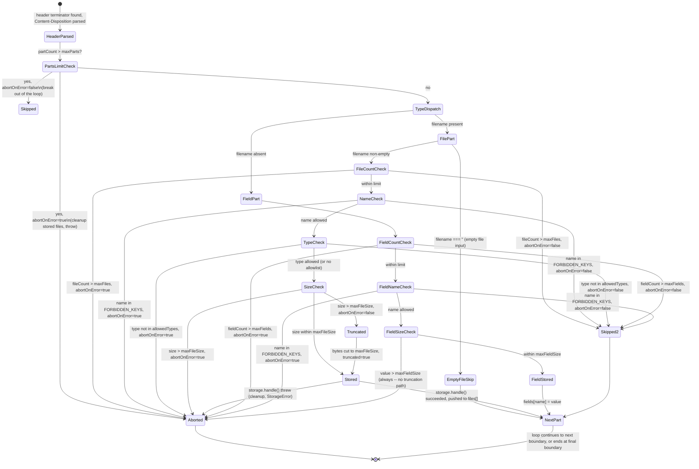

# @nextrush/form-data — Architecture

> Internal design of the collect-then-scan-then-store pipeline: how a `multipart/form-data`
> request body becomes bounded in-memory bytes, how boundaries are located with Boyer-Moore-
> Horspool, and how each part is routed to a file (via a pluggable `StorageStrategy`) or a field.

## At a glance

|  |  |
| --- | --- |
| **Package** | `@nextrush/form-data` |
| **Layer** | `middleware` (above `types`; below nothing — a leaf middleware) |
| **Depends on** | `@nextrush/types` (types only, erased at build) — no third-party runtime deps |
| **Depended on by** | Application code that calls `app.use(formData())`; not depended on by any other `@nextrush/*` package |
| **Public entry** | `src/index.ts` (barrel — exports only) |
| **Internal modules** | 14 files (excl. tests) · 1,646 LOC · largest `parser.ts` (520 LOC — over the 300-line middleware package cap; see the callout under [Module structure](#module-structure)) |
| **On the request hot path?** | Yes — runs on every request matching `multipart/form-data`; body collection, boundary scanning, and per-part parsing all happen per request |
| **Runtime coupling** | Parsing/scanning/middleware: none — zero `node:` imports, built on Web Streams. `storage/disk.ts` only: Node-coupled (`node:fs`, `node:fs/promises`, `node:path`, `node:stream`, `node:stream/promises`) |
| **State model** | Stateless per request for parsing; `DiskStorage` holds one piece of app-scoped state (`dirCreated`, a boolean guarding a one-time `mkdir`) |

## Responsibilities

**This package owns:**

- **Detecting** whether a request is `multipart/form-data` and extracting its `boundary` from `Content-Type` (`middleware.ts`, `constants.ts`)
- **Collecting** the request body into a single bounded `Uint8Array`, enforcing `maxBodySize` during the read (`parser.ts`'s `streamToUint8Array()`)
- **Scanning** for boundary markers inside that buffer via Boyer-Moore-Horspool (`scanner.ts`)
- **Parsing** each part's headers, `Content-Disposition` (`name`/`filename`, including RFC 5987 encoded filenames), and body slice (`parser.ts`)
- **Enforcing per-part and per-request limits** — file size, field size, file/field/part counts, field-name length, header-pair count (`parser.ts`, against `constants.ts` defaults)
- **Security guards specific to multipart** — prototype-pollution field-name blocking, filename sanitization (path traversal, null bytes, Windows-reserved names), MIME-type allowlisting
- **Routing each file's bytes to a storage strategy** and each field's decoded value into `ctx.state.fields`
- **Typed error reporting** — every failure mode surfaces as a `FormDataError` with an HTTP `status` and a machine-readable `code`

**This package does NOT own:**

- Reading bytes off the wire / the adapter-level stream abstraction → `ctx.bodySource` (owned by the adapter, RFC 017); this package calls `ctx.bodySource.stream()` or `.buffer()`, it does not implement the drain
- JSON/URL-encoded/text/raw body parsing → `@nextrush/body-parser`, which explicitly rejects `multipart/form-data`
- Validating the *shape* of parsed field values (required fields, types) → `@nextrush/validation`
- Object-storage backends (S3, GCS, etc.) → left to a custom `StorageStrategy` implementation; only `MemoryStorage` and `DiskStorage` ship here
- The middleware execution engine (`compose`, `ctx.next()`) → `@nextrush/core`

## Non-goals

The package intentionally does not:

- Parse a part's file bytes incrementally off the live network stream while the request body is
  still arriving — the whole body is collected first (bounded by `maxBodySize`), then scanned;
  true streaming parse-as-you-receive is out of scope for this design
- Provide a chunked/resumable upload protocol (e.g. tus) — a single request must carry the
  complete multipart body
- Ship a built-in object-storage (S3/GCS/Azure Blob) strategy — `StorageStrategy` is the
  extension point for that, not a bundled implementation
- Virus-scan or content-sniff uploaded files beyond MIME-type allowlisting on the declared
  `Content-Type` header (which is client-supplied and not independently verified against the
  actual bytes)

## Constraints

Must remain:

- **Runtime-independent for parsing** — `parser.ts`, `scanner.ts`, `middleware.ts`, and every
  `utils/*` module import no `node:*` API; only `storage/disk.ts` is Node-coupled, and that
  coupling is isolated to one file behind the `StorageStrategy` interface
- **Zero third-party dependency** — a types-only dependency on `@nextrush/types`
- **ESM-only** — no CommonJS build
- **Fail-secure on size, pollution, and path traversal** — a body/file/field that would exceed a
  limit, a forbidden field name, or a filename that resolves outside `DiskStorage`'s destination
  directory must always be rejected, never silently truncated or written outside bounds (file-size
  truncation is the one deliberate, opt-in exception — see [Engineering decisions](#engineering-decisions))
- **Public API sealed** — the exported surface is semver-guarded (ADR-0005)

## Position in the package hierarchy

```mermaid
block-beta
    columns 5
    types["@nextrush/types"]:1
    space:1
    errors["@nextrush/errors"]:1
    space:1
    core["@nextrush/core"]:1
    space:5
    router["@nextrush/router"]:1
    space:3
    class["@nextrush/class"]:1
    space:5
    adapters["adapter-node / bun / deno / edge"]:5
    space:5
    block:mw:5
        columns 5
        bodyparser["body-parser"]:1
        THIS["form-data (this package)"]:1
        validation["validation"]:1
        static["static"]:1
        etc["... other middleware"]:1
    end

    types --> errors --> core --> router --> class --> adapters --> mw

    classDef here fill:#2563eb,color:#fff,stroke:#1e40af;
    class THIS here
```

> [!IMPORTANT]
> Imports flow **downward only**. `@nextrush/form-data` imports from `@nextrush/types` only, and
> MUST NOT be imported by `types`, `errors`, `core`, `router`, `class`, or any adapter
> (project-rules §1). It sits at the middleware layer as a leaf: nothing in the framework core
> depends on it — an application opts in by calling `app.use(formData())`.

**Dependency rules:**
- **Allowed:** `form-data → types`
- **Forbidden:** `form-data → core / router / class / adapters / any other middleware package`

---

## Overview

The package answers one question for every request whose `Content-Type` starts with
`multipart/form-data`: *given this boundary-delimited stream of bytes, what set of files and
fields does it decode into, and how much of that stream is this middleware allowed to hold in
memory while deciding?* The organizing idea is **collect once, scan repeatedly, store per file** —
the request body is read into a single bounded `Uint8Array` exactly once (`streamToUint8Array()`,
capped by `maxBodySize`), then a `BoundaryScanner` instance built for that request's boundary
string is reused to locate every subsequent part boundary inside the already-collected buffer.

Each part, once its header block and `Content-Disposition` are parsed, is routed one of two ways:
a part with a `filename` becomes a **file part** — its (already in-memory) byte slice is wrapped
in a single-chunk `ReadableStream` and handed to the configured `StorageStrategy`, which decides
whether those bytes end up as a `Uint8Array` (`MemoryStorage`) or a file on disk (`DiskStorage`).
A part without a `filename` becomes a **field part** — its bytes are decoded to a string and
assigned directly into the `fields` record. Every count/size limit is checked at the point the
relevant part type is recognized, before the byte-heavy work (storage write, string decode) runs.

Security concerns are deliberately factored into their own modules: `utils/sanitize.ts` owns
filename sanitization (path traversal, control characters, Windows-reserved names), `constants.ts`
owns the `FORBIDDEN_KEYS` prototype-pollution blocklist checked in `parser.ts`, and `storage/disk.ts`
owns the path-containment check that runs after filename generation but before any filesystem
write.

### Design principles

1. **The body is collected once, with a hard byte ceiling, before any parsing begins.**
   `streamToUint8Array()` in `parser.ts` checks the running total against `maxBodySize` on every
   chunk and throws `Errors.bodySizeExceeded()` the instant it's crossed — enforced independently
   of any per-file or per-field limit.
2. **Boundary search reuses one precomputed scanner for the whole request.** `BoundaryScanner`'s
   skip table (`buildSkipTable()`) is built once per `parseFormData()` call from the boundary
   string, then `scanner.indexOf()` is called once per part — the pattern is never
   recompiled mid-request.
3. **A part is either a file or a field, never ambiguous.** `parseContentDisposition()`'s
   presence/absence of a `filename` capture group is the single branch point in `parser.ts` that
   decides file-part vs. field-part handling; there is no third code path.
4. **Prototype-pollution keys are rejected before any storage or field assignment.** The
   `FORBIDDEN_KEYS.has(name)` check runs immediately after a part's `name` is parsed, for both
   file and field parts, before `storage.handle()` or `fields[name] = ...` executes.
5. **A limit violation triggers cleanup of everything already stored for that request.**
   `cleanupOnError()` calls `storage.remove()` on every previously stored `StorageResult` before
   the limit-exceeded error is thrown (when `abortOnError: true`) — a partially-successful upload
   never leaves orphaned files behind on the configured `abortOnError: true` path.

---

## Module structure

```text
src/
├── index.ts              # Public API barrel (exports only, no implementation)
├── types.ts               # UploadedFile, FormDataField, FormDataOptions, StorageStrategy, etc.
├── constants.ts           # DEFAULT_MAX_*, FORBIDDEN_KEYS, UNSAFE_FILENAME_CHARS, extractBoundary()
├── errors.ts              # FormDataError class + the Errors factory functions
├── scanner.ts              # BoundaryScanner — Boyer-Moore-Horspool byte pattern search
├── parser.ts               # parseFormData() — the collect/scan/parse/store pipeline
├── middleware.ts           # formData() — the Koa-style middleware wrapper
├── utils/
│   ├── index.ts            # Utils re-exports
│   ├── sanitize.ts         # sanitizeFilename() — path traversal / control-char / reserved-name guard
│   ├── mime.ts              # isAllowedType() — MIME allowlist matching with type/* wildcards
│   └── limit.ts             # parseLimit() — '5mb' -> bytes
└── storage/
    ├── index.ts            # Storage re-exports
    ├── memory.ts            # MemoryStorage — buffers file bytes into a Uint8Array
    └── disk.ts              # DiskStorage — streams file bytes to the filesystem (Node-coupled)
```

> [!WARNING]
> `parser.ts` is 520 lines — over this repository's 300-line middleware-package file cap
> (`architecture.instructions.md`'s per-package targets). It is a known structural debt: the
> collect/boundary-search/header-parse/limit-check/storage-dispatch logic for both file and field
> parts currently lives in one function (`parseFormData()`). Splitting it (e.g. a dedicated
> per-part-type handler module) is a candidate follow-up, not yet scheduled as an RFC.

### Module responsibilities

| Module | Responsibility (the one thing it owns) |
| ------ | -------------------------------------- |
| `types.ts` | The public option/data contracts (`UploadedFile`, `FormDataOptions`, `StorageStrategy`, etc.) — no logic. |
| `constants.ts` | Every default limit, the `FORBIDDEN_KEYS` blocklist, filename-unsafe-character pattern, and `extractBoundary()`. |
| `errors.ts` | The `FormDataError` class and every error-construction factory — no other module constructs one directly. |
| `scanner.ts` | The Boyer-Moore-Horspool skip-table build and byte-pattern search — no knowledge of multipart semantics, purely a byte scanner. |
| `parser.ts` | The full collect-scan-parse pipeline: body collection, per-part header/`Content-Disposition` parsing, limit enforcement, and dispatch to a `StorageStrategy` or the `fields` record. |
| `middleware.ts` | Request-level gating (method, `Content-Type`, boundary extraction) and cross-runtime body-stream acquisition; delegates all parsing to `parser.ts`. |
| `utils/sanitize.ts` | The filename-sanitization pipeline — the only module that decides what a "safe" on-disk filename looks like. |
| `utils/mime.ts` | MIME-type-vs-allowlist matching, including `type/*` wildcards. |
| `utils/limit.ts` | Size-limit string parsing (`'5mb'` → bytes). |
| `storage/memory.ts` | Buffers a file's stream into one `Uint8Array`. |
| `storage/disk.ts` | Streams a file's stream to the filesystem, with a path-containment check before writing. |

## Component relationships



`parser.ts` never imports `storage/memory.ts` or `storage/disk.ts` directly by concrete class —
it only calls `storage.handle()` through the `StorageStrategy` interface (the default instance,
`new MemoryStorage()`, is constructed once if the caller didn't supply one). This keeps the
parsing/limit logic fully decoupled from where a file's bytes ultimately land.

---

## Lifecycle

### Request → response (execution sequence)

How a single request with one file part and one field part flows through `formData()`, including
where the body-size ceiling, boundary scan, and per-part limit checks run:

```mermaid
sequenceDiagram
    participant Client
    participant MW as formData() middleware
    participant Parser as parser.ts: parseFormData
    participant Collect as streamToUint8Array
    participant Scan as BoundaryScanner
    participant Storage as StorageStrategy
    participant Ctx as Context
    participant Next as downstream handler

    Client->>MW: POST /upload (Content-Type: multipart/form-data; boundary=...)
    MW->>MW: BODYLESS_METHODS check / Content-Type prefix check
    MW->>MW: extractBoundary(contentType)
    MW->>MW: getRequestBody(ctx) -- acquire ReadableStream or Uint8Array
    MW->>Parser: parseFormData(body, boundary, options)

    Parser->>Collect: streamToUint8Array(body, maxBodySize)
    Note over Collect: running total checked on every chunk
    alt total crosses maxBodySize mid-stream
        Collect-->>Parser: throw Errors.bodySizeExceeded() (413)
    else read completes within limit
        Collect-->>Parser: single Uint8Array (the whole body)
    end

    Parser->>Parser: locate first boundary, build BoundaryScanner(boundary)

    loop for each part until final boundary
        Parser->>Parser: find header terminator (\r\n\r\n), parse headers
        Parser->>Parser: parseContentDisposition() -- extract name, filename
        alt filename present (file part)
            Parser->>Parser: fileCount++ / check maxFiles
            Parser->>Parser: check FORBIDDEN_KEYS.has(name)
            Parser->>Parser: check allowedTypes (Mime.isAllowedType)
            Parser->>Parser: check partBody.length > maxFileSize (truncated?)
            Parser->>Sanitize: sanitizeFilename(filename)
            Parser->>Storage: storage.handle(wrappedStream, fileInfo)
            Storage-->>Parser: StorageResult (buffer or path)
        else no filename (field part)
            Parser->>Parser: fieldCount++ / check maxFields
            Parser->>Parser: check FORBIDDEN_KEYS.has(name)
            Parser->>Parser: check partBody.length > maxFieldSize
            Parser->>Parser: fields[name] = decoder.decode(partBody)
        end
        Parser->>Scan: scanner.indexOf(data, cursor) -- locate next boundary
    end

    Parser-->>MW: { files, fields }
    MW->>Ctx: ctx.state.files = files; ctx.state.fields = fields
    MW->>Next: await next()
    Next-->>Client: response, built from ctx.state
```

The ordering a reader would otherwise get wrong: **the entire body is already in memory (as one
`Uint8Array`) before the first `Content-Disposition` header is even parsed** — `maxBodySize` is
checked during collection, not during the per-part loop. Per-part limits (`maxFileSize`,
`maxFields`, etc.) are checked against slices of that already-collected buffer, not against bytes
still arriving off the network.

### Part outcome (the state a single part passes through)



> [!NOTE]
> `maxFieldSize` has no `abortOnError`-gated truncation path — it always throws
> `Errors.parseError()` (400) when exceeded, unlike `maxFileSize`, which truncates when
> `abortOnError: false`. This asymmetry is intentional in the source (`parser.ts`): a truncated
> file is still a usable (if incomplete) file, but a truncated field value could silently corrupt
> data the application treats as complete (e.g. a truncated JSON string in a field).

## State ownership

| Owner | State it owns | Scope |
| ----- | -------------- | ----- |
| `parseFormData()`'s local variables (`files`, `fields`, `storageResults`, counters) | The accumulating parse result and per-request counts | per request — created fresh on every call, discarded after return |
| `BoundaryScanner` instance | Its precomputed skip table for one boundary string | per request — constructed once per `parseFormData()` call |
| `DiskStorage` instance | `dirCreated` (has `mkdir` already run for this destination) | app — one `DiskStorage` instance is typically shared across all requests via the middleware option |
| `Context` (owned by `core`/the adapter) | `ctx.state.files`, `ctx.state.fields` — written once per request by the middleware | per request |

There is no module-level mutable state in `parser.ts`, `scanner.ts`, or `middleware.ts`. The only
persistent, app-scoped state anywhere in the package is `DiskStorage.dirCreated`, a boolean
guarding a one-time `mkdir()` call for that storage instance's destination directory.

## Data structures

```ts
// The core per-file result shape (types.ts) — mirrors StorageResult but adds request-level
// metadata (fieldName, originalName, sanitizedName, mimeType) the storage layer doesn't know.
interface UploadedFile {
  readonly fieldName: string;      // form field name
  readonly originalName: string;   // client-supplied, unsanitized
  readonly sanitizedName: string;  // safe for filesystem use (utils/sanitize.ts)
  readonly encoding: string;
  readonly mimeType: string;
  readonly size: number;
  readonly truncated: boolean;     // true only when abortOnError: false and size > maxFileSize
  readonly buffer?: Uint8Array;    // present for MemoryStorage
  readonly path?: string;          // present for DiskStorage
}

// The seam between the parser and where file bytes end up.
// handle() receives a stream (in this design, always a single-chunk wrapper over
// already-in-memory bytes — see the Performance note in README.md).
interface StorageStrategy {
  handle(stream: ReadableStream<Uint8Array>, info: FileInfo): Promise<StorageResult>;
  remove?(result: StorageResult): Promise<void>; // used by cleanupOnError()
}
```

The `buffer`/`path` split on `UploadedFile` (rather than a single `data: Uint8Array | string`
field) is deliberate: it lets application code narrow on which field is present to know which
storage strategy produced the file, without needing a separate discriminant property.

## Performance characteristics

| Path | Complexity | Allocations | Notes |
| ---- | ---------- | ------------ | ----- |
| `streamToUint8Array()` | O(n) in body size | one final `Uint8Array` (plus the transient chunk array) | Bounded by `maxBodySize`; throws as soon as the running total crosses it, without waiting for the stream to end. |
| `BoundaryScanner` construction | O(boundary length) | one 256-byte skip table | Built once per `parseFormData()` call, reused for every part. |
| `scanner.indexOf()` (repeated, per part) | O(n) average / O(n·m) worst case (Boyer-Moore-Horspool) | none | The dominant cost for the per-part loop; avoids re-scanning already-passed bytes on a mismatch. |
| `findBytes()` (first boundary, header terminator) | O(n·m) naive linear scan | none | Used only for the one first-boundary search and each part's `\r\n\r\n` header-terminator search — not the repeated inner-loop search. |
| `sanitizeFilename()` | O(filename length) | one or more intermediate strings (multi-step `.replace()` pipeline) | Runs once per file part, not per request. |
| `MemoryStorage.handle()` | O(file size) | one final `Uint8Array` (plus the transient chunk array from its own stream read) | Reads its single-chunk input stream and concatenates — for the common one-chunk case, no copy beyond the chunk array's existing reference. |
| `DiskStorage.handle()` | O(file size) | none beyond Node's own stream buffering | Pipes the wrapped stream directly into `createWriteStream()`; does not hold a second full in-memory copy of the file. |

**Memory model:**
- **Shared (one copy):** the `BoundaryScanner`'s skip table and pattern bytes for the current request; a shared `DiskStorage`/`MemoryStorage` instance's own (minimal) state across requests.
- **Per request:** the entire collected request body (`Uint8Array`, bounded by `maxBodySize`); the `files`/`fields` result arrays; for `MemoryStorage`, each file's buffered bytes persist on the returned `UploadedFile.buffer` for as long as the application holds a reference to it.

> [!IMPORTANT]
> Peak memory per request is driven by `maxBodySize` (the whole-body ceiling), not by
> `maxFileSize` alone — a request with many files each individually under `maxFileSize` can still
> approach `maxBodySize` in total. See the README's [Performance](./README.md#performance)
> section for the same fact from the API-consumer's perspective.

## Concurrency & edge behaviour

- **Shared, immutable after construction:** a `DiskStorage`/`MemoryStorage` instance's configuration (`dest`, `filenameFn`); the `BoundaryScanner`'s skip table once built for a given `parseFormData()` call.
- **Per-request, never shared:** the collected body buffer, the `files`/`fields` accumulator, all part-parsing cursors and counters.
- **Idempotency:** parsing the same bytes with the same options always produces the same result — no per-request randomness, except `DiskStorage`'s default filename generator, which calls `crypto.randomUUID()` per file (by design, to avoid on-disk name collisions).
- **Abort / disconnect / timeout:** `streamToUint8Array()`'s `reader.releaseLock()` runs in a `finally` block regardless of how the read loop exits; a client that disconnects mid-upload surfaces as whatever error the underlying `ReadableStream` throws from `reader.read()`, which propagates up through `parseFormData()` uncaught by this package (no `FormDataError` wrapping for a mid-read connection failure — only `maxBodySize` overruns get a typed `Errors.bodySizeExceeded()`).
- **Cleanup on error:** `cleanupOnError()` calls `storage.remove()` (best-effort, errors swallowed) for every file already stored in the current request before a limit/type/name violation is thrown with `abortOnError: true` — but only for that request's own `storageResults`; a request that never throws (including one that runs to completion with `abortOnError: false`) never calls `cleanupOnError()`.

> [!WARNING]
> `DiskStorage.handle()`'s own `catch` block calls `this.removeFile(resolved)` for the file
> currently being written on a write failure, independent of `cleanupOnError()`'s cross-part
> cleanup — a contributor changing either cleanup path should confirm both still run on a
> mid-request storage failure.

## Trust boundaries

```text
Client-supplied request body (untrusted)
   │
   ▼
streamToUint8Array()  -- maxBodySize ceiling enforced during collection            <- size boundary (whole body)
   │
   ▼
parseFormData() part loop  -- per-part limit checks (maxFileSize/maxFields/maxParts/etc.)   <- size boundary (per part)
   │
   ▼ (both file and field parts)
FORBIDDEN_KEYS.has(name)  -- __proto__ / constructor / prototype rejected            <- pollution boundary
   │
   ▼ (file parts only)
sanitizeFilename(filename)  -- path traversal / control chars / reserved names stripped   <- filename boundary
   │
   ▼ (DiskStorage only)
resolved.startsWith(this.dest)  -- generated path must stay inside the destination dir   <- path-containment boundary
   │
   ▼
ctx.state.files / ctx.state.fields
```

The client controls every input to this pipeline — the boundary string, every header, every
field name and value, every filename, and the file bytes themselves. Four boundaries are
enforced independently: a **whole-body size boundary** (`maxBodySize`, checked during
collection), a **per-part size boundary** (`maxFileSize`/`maxFieldSize`/count limits), a
**pollution boundary** (`FORBIDDEN_KEYS`, checked on every file and field name), and — specific
to `DiskStorage` — a **path-containment boundary**: after `sanitizeFilename()` strips path
separators and unsafe characters from the *client's* filename, `DiskStorage.handle()` still
independently resolves the *generated* filename (sanitized name, or a custom `filename` callback's
return value) against its `dest` directory and rejects a result that doesn't start with it, before
any write.

> [!WARNING]
> `resolved.startsWith(this.dest)` is a **prefix check on the resolved path string**, not a
> boundary-aware containment check. It correctly rejects a `../`-style escape (the resolved path
> would no longer start with `dest` at all), but a sibling directory that happens to share `dest`
> as a string prefix (e.g. `dest = '/srv/uploads'` and a hypothetical resolved path
> `/srv/uploads-evil/x`) would also satisfy `startsWith()`. In practice this can only happen if a
> custom `filename` callback returns a value containing enough `../` segments to escape past
> `this.dest` and back into a sibling directory — `defaultFilename()` (UUID + sanitized name) never
> produces such a value. A contributor tightening this check should verify against `resolved ===
> this.dest || resolved.startsWith(this.dest + sep)` instead of a bare string prefix.

## Extension points

**Supported extension points:**

- **`StorageStrategy`** — the sanctioned way to add a new upload destination (S3, GCS, a
  virus-scanning proxy, etc.) without forking the parser; implement `handle()` and optionally
  `remove()`.
- **`FormDataOptions.filename`** and **`DiskStorageOptions.filename`** — override the on-disk
  filename generator; both receive the already-`sanitizeFilename()`-processed `info.sanitizedName`.
- **`parseFormData()` and `BoundaryScanner`** — exported for advanced use when building a custom
  middleware or parser variant on the same primitives (per the README's API overview).

**Forbidden (sealed):**

- **The prototype-pollution blocklist** (`FORBIDDEN_KEYS`) — there is no configuration option to
  disable this check for either file or field names; weakening it would reopen the exact
  vulnerability class the package exists to close. RFC-gated.
- **The `maxBodySize` collection ceiling** — removing or bypassing the running-total check in
  `streamToUint8Array()` would let an attacker force unbounded memory growth before any per-part
  limit is even reached.
- **`DiskStorage`'s path-containment check** — removing `resolved.startsWith(this.dest)` would let
  a crafted filename write outside the configured destination directory.

---

## Architectural invariants

These are part of the package's architecture. They do not change without an RFC:

- **The request body is fully collected (bounded by `maxBodySize`) before any part is parsed —
  there is no incremental parse-while-receiving path.**
- **`__proto__`, `constructor`, and `prototype` are rejected as field or file field names, with no
  configuration override.**
- **A file over `maxFileSize` is either rejected (`abortOnError: true`, default) or truncated with
  `truncated: true` (`abortOnError: false`) — it is never silently accepted at full size.**
- **A field value over `maxFieldSize` always throws — there is no truncation path for fields,
  unlike files.**
- **`DiskStorage` always resolves a generated filename against its destination directory and
  rejects a path that doesn't stay inside it, before writing.**
- **The package's parsing path (`parser.ts`, `scanner.ts`, `middleware.ts`, `utils/*`) imports no
  runtime API** — zero `node:*` imports; only `storage/disk.ts` is Node-coupled, and that coupling
  is isolated behind the `StorageStrategy` interface.

## Engineering decisions

| Decision | Chosen | Trade-off accepted | Reference |
| -------- | ------ | ------------------- | --------- |
| Body collection strategy | Collect the entire body into one `Uint8Array` before parsing, bounded by `maxBodySize` | Peak memory per request scales with `maxBodySize`, not with the number of files, even though files are individually size-limited | `parser.ts`'s `streamToUint8Array()` |
| Boundary search algorithm | Boyer-Moore-Horspool (`BoundaryScanner`) for the repeated per-part search; naive linear scan (`findBytes`) for the one-time first-boundary/header-terminator searches | An extra 256-byte skip-table build per request, in exchange for average-case sub-linear skipping on the search that repeats once per part | `scanner.ts`, `parser.ts` |
| File-size overrun behavior | Reject by default (`abortOnError: true`); truncate-and-flag (`truncated: true`) only when explicitly opted into (`abortOnError: false`) | An app that opts into `abortOnError: false` must check `truncated` on every file rather than trusting `size` alone | `parser.ts`'s file-part branch |
| Field-value overrun behavior | Always throws, regardless of `abortOnError` | No truncation escape hatch for fields — a caller who wants partial field data must handle it outside this package | `parser.ts`'s field-part branch |
| Path-containment check | A string-prefix check (`resolved.startsWith(this.dest)`) rather than a full path-boundary comparison | Correctly blocks `../`-style traversal from the sanitized filename path, but is not airtight against a pathologically crafted custom `filename` callback returning a sibling-directory-prefix match (see the Trust boundaries warning) | `storage/disk.ts`'s `handle()` |
| File-bytes handoff to storage | Wrap the already-collected byte slice in a synthetic single-chunk `ReadableStream` before calling `storage.handle()` | `StorageStrategy.handle()`'s stream parameter is never a live network stream in this design — a strategy author must not assume back-pressure from an active upload | `parser.ts`'s `uint8ArrayToReadableStream()` |

## Rejected alternatives

### Streaming per-part parse directly off the network, without full-body collection
Rejected: RFC 7578 multipart boundaries can appear anywhere, including split across two network
chunks, and a part's `Content-Disposition` (file vs. field) must be known before deciding how to
route its bytes. A true streaming parser needs a persistent parse-state machine across chunk
boundaries; the simpler collect-then-scan design was chosen instead, accepting the
`maxBodySize`-bounded memory cost as the trade-off — the same reasoning documented in this file's
Non-goals section.

### A single generic byte scanner shared between the first-boundary search and the repeated per-part search
Rejected: the first boundary and each part's header terminator (`\r\n\r\n`) are each searched for
once (or a small bounded number of times) per part, so the setup cost of a Boyer-Moore-Horspool
skip table isn't worth paying for them — the simpler linear `findBytes()` is used there, while
`BoundaryScanner`'s precomputed table is reserved for the search that actually repeats (finding
the next part boundary, once per part, for the whole request).

### Truncating an over-limit field value the same way an over-limit file is truncated
Rejected: a truncated file is still a partially usable file (a preview thumbnail, a partial log
upload), but a silently truncated field value (e.g. a JSON string, a signed token) can corrupt
data the application treats as complete without any visible signal — `maxFieldSize` overruns
always throw, with no `truncated` flag equivalent.

---

## Testing strategy

- **Unit:** `sanitizeFilename()` against path-traversal/null-byte/reserved-name inputs; `isAllowedType()` against exact and wildcard MIME patterns; `parseLimit()` round-trips; `BoundaryScanner` against boundaries split across chunk-like inputs.
- **Integration:** `parseFormData()` and `formData()` against constructed multipart bodies covering file parts, field parts, oversized parts (both `abortOnError` values), forbidden field names, disallowed MIME types, and both `MemoryStorage`/`DiskStorage` (`src/__tests__/multipart.test.ts`).
- **Public-surface test:** `src/__tests__/public-surface.test.ts` guards the exported API shape against accidental additions/removals.
- **Conformance / cross-adapter parity:** N/A directly for the parsing path — it uses no runtime API, and cross-runtime body-stream acquisition (`middleware.ts`'s `getRequestBody()`) is exercised indirectly through `packages/adapters/conformance`. `DiskStorage` is Node-coupled by design and is not part of the Edge conformance surface.
- **Coverage:** >=90% lines/functions (CI-enforced).

## Evolution strategy

- **Stable (semver-guarded):** the sealed public surface — `formData`, `parseFormData`, `BoundaryScanner`, `MemoryStorage`, `DiskStorage`, `FormDataError`, every type in `types.ts` (ADR-0005).
- **May change without notice:** the internal split of `parser.ts` (a candidate future refactor to bring it under the 300-line cap), the exact wording of `FormDataError` messages, `DiskStorage`'s default filename format.
- **Changes only via RFC:** the default value of any size/count limit, the `FORBIDDEN_KEYS` blocklist, the collect-then-scan parsing strategy, and `DiskStorage`'s path-containment enforcement mechanism.

**Timeline:** 1.0 — initial streaming-storage / in-memory-scan multipart parser with file and field limits, MIME allowlisting, and filename sanitization.

## Contributor notes

Before changing this package, read: `constants.ts`'s `FORBIDDEN_KEYS`/`DEFAULT_MAX_*` values and
the comments around them, `parser.ts`'s `streamToUint8Array()` and its `maxBodySize` check, and
`storage/disk.ts`'s path-containment check and its known string-prefix limitation (see the Trust
boundaries warning above) — any change to a limit default, the pollution blocklist, or the
path-containment check is a security-relevant change and should be treated as RFC-gated per this
document's invariants.

## Architecture checklist

Before changing this package, confirm:

- [ ] Does this preserve the architectural invariants above (especially the pollution blocklist, the `maxBodySize` ceiling, and `DiskStorage`'s path-containment check)?
- [ ] Does this increase coupling or cross a dependency rule (`form-data → types` only)?
- [ ] Does this affect the request hot path (allocations in `streamToUint8Array()`, `scanner.indexOf()`, or a `StorageStrategy.handle()` implementation)?
- [ ] Does this change the sealed public API (semver / ADR-0005)? Does it need an RFC?
- [ ] If this touches a limit default, the pollution blocklist, or the path-containment check, does it remain fail-secure (reject on ambiguity, never silently accept past a bound)?

---

## References & see also

- **README (how to use it):** [`./README.md`](./README.md)
- **ADR:** [`ADR-0005 — package tiers & sealed surface`](https://github.com/0xTanzim/nextRush/blob/main/docs/adr/ADR-0005-package-tiers-sealed-surface-deprecation.md)
- **Security boundary reference:** `.kiro/steering/project-rules.instructions.md` §4 (request body parsing must enforce size limits — this package's `streamToUint8Array()`/per-part checks are that enforcement point for multipart bodies)
- **Documentation site:** [nextRush docs](https://0xtanzim.github.io/nextRush/docs)
- **Repository:** [`packages/middleware/form-data`](https://github.com/0xTanzim/nextRush/tree/main/packages/middleware/form-data)
