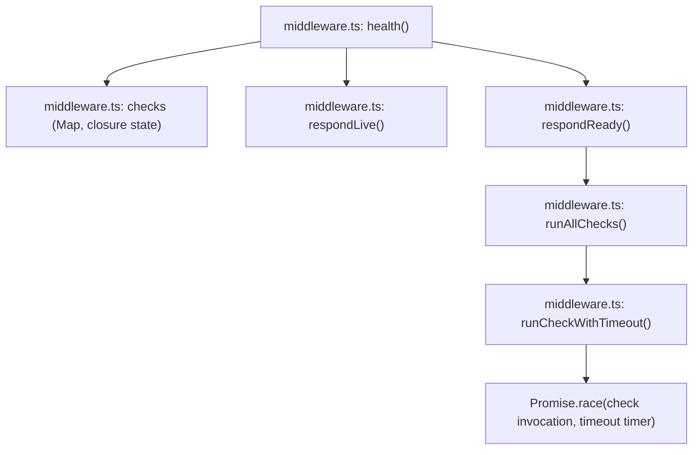
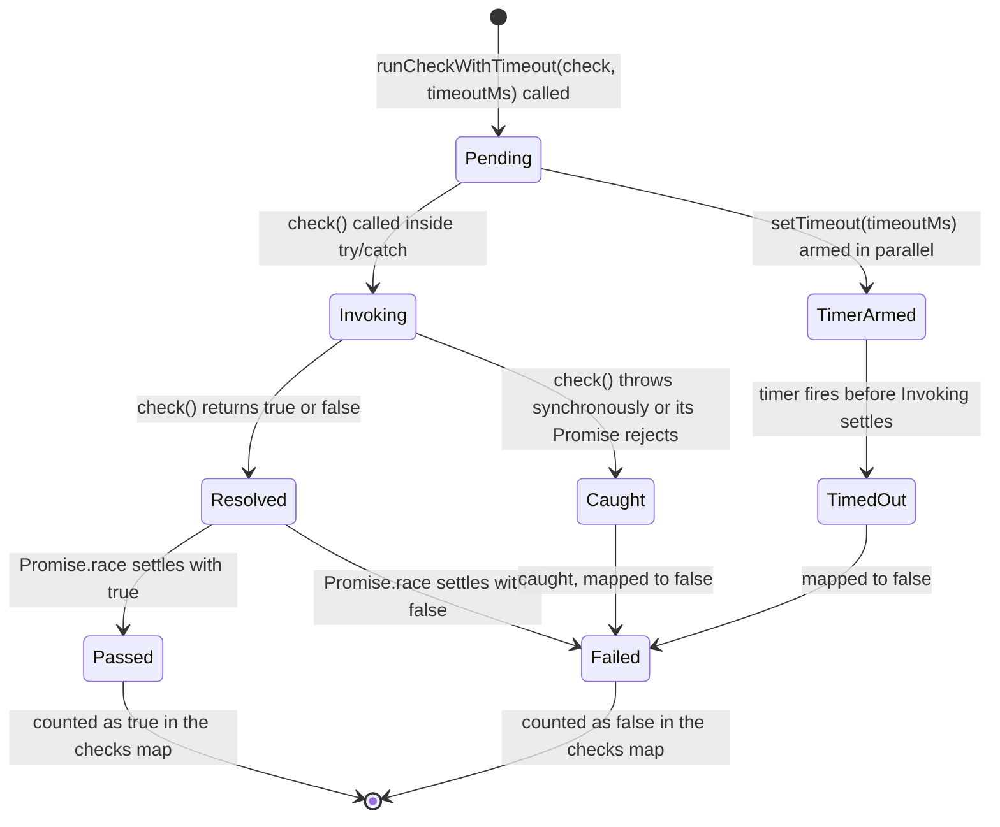
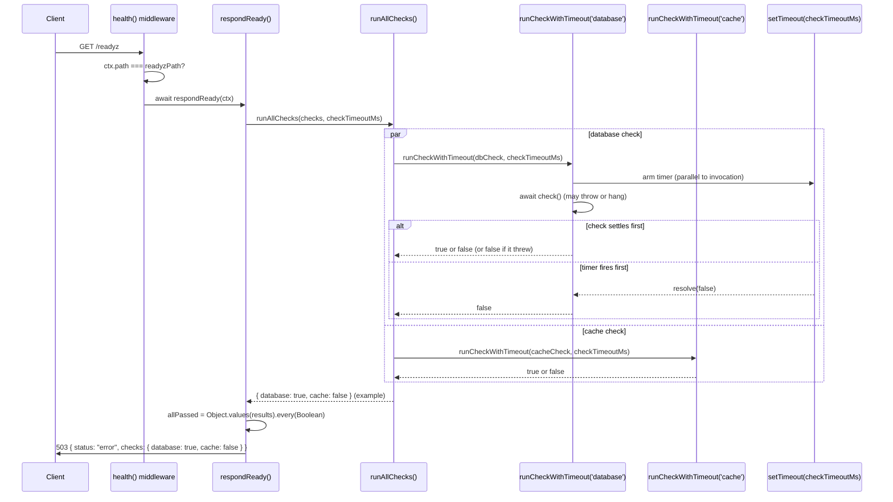

# @nextrush/health — Architecture

> Internal design of the liveness/readiness middleware — the per-check timeout-race mechanism, and why this package has no persisted health-status state machine despite the domain's name suggesting one.

## At a glance

|  |  |
| --- | --- |
| **Package** | `@nextrush/health` |
| **Layer** | `middleware` (above `types`; below nothing — a leaf middleware) |
| **Depends on** | `@nextrush/types` (types only, erased at build) — no third-party runtime deps |
| **Depended on by** | Application code that calls `app.use(middleware)` from `health()`'s return value; not depended on by any other `@nextrush/*` package |
| **Public entry** | `src/index.ts` (barrel — exports only) |
| **Internal modules** | 3 files (excl. tests) · 375 LOC · largest `middleware.ts` 157 LOC (well within the 300-line middleware cap) |
| **On the request hot path?** | Only for the two paths it intercepts (`/livez`, `/readyz`); every other path is a single `ctx.path` string comparison before falling through to `next()` |
| **Runtime coupling** | None — zero `node:*` imports; uses only `Promise.race`/`setTimeout`, both Web-standard |
| **State model** | **No persisted health status.** The only mutable state is the `Map<string, CheckFn>` check registry itself; "readiness" is recomputed from scratch on every `/readyz` request — see State ownership and the note below |

> [!NOTE]
> A reader coming from systems that track a persisted "health state" (e.g. a circuit breaker's
> Open/Closed/Half-Open) should not expect an equivalent state machine here. This package's only
> stored state is *which checks are registered*, not *what their last result was* — every
> `/readyz` request re-invokes every check, unconditionally. The Lifecycle section below models
> the one genuine state machine that does exist: a **single check invocation's** progression
> from pending to settled, which is real, bounded, and worth diagramming — not a fabricated
> app-level health-status machine the source does not implement.

## Responsibilities

**This package owns:**

- ✓ Serving `/livez` — an unconditional `200 { status: 'ok' }` for any request reaching that exact path, never evaluating registered checks
- ✓ Serving `/readyz` — running every currently registered check concurrently, each bounded by a timeout, and aggregating pass/fail into a `200`/`503` response
- ✓ The check registry (`registerCheck`) — an in-memory `name -> CheckFn` map, no persistence
- ✓ Bounding every check invocation by `checkTimeoutMs`, converting a hang or a thrown error into a `false` result rather than letting either propagate

**This package does NOT own:**

- ✗ Caching or memoizing check results between requests → not implemented anywhere in this package (see Non-goals)
- ✗ Authentication or access restriction on `/livez`/`/readyz` → deliberately not implemented; the network layer's job (see the README's Security posture)
- ✗ Any coordination with `@nextrush/adapter-node`'s `gracefulShutdown` → application code, via the shared-flag pattern shown in the README; no import exists between the two packages
- ✗ The middleware execution engine (`compose`, `ctx.next()`) → `@nextrush/core`

## Non-goals

The package intentionally does not:

- Cache or memoize the result of any registered check across requests — every `/readyz` request re-runs every check from scratch (`runAllChecks()` iterates the live `Map` fresh each call); a caller wanting caching implements it inside their own check function
- Track health status as a value that persists between requests — there is no field, variable, or object anywhere in `middleware.ts` that stores "the last readiness result"; each request computes a fresh one and discards it once the response is sent
- Distinguish *why* a check failed (returned `false` vs. threw vs. timed out) in the response body — `runCheckWithTimeout()` collapses all three outcomes to the same `false`, deliberately, so the response never needs to decide how much of a check's internal error to expose
- Rate-limit the endpoints themselves — orchestrator probe intervals are typically infrequent enough that this hasn't been a demonstrated need; public-facing rate limiting, if ever required, belongs at the network layer per the README's Security posture

## Constraints

Must remain:

- **Runtime-independent** — zero `node:*` imports; `Promise.race`/`setTimeout` are both available identically across Node, Bun, Deno, and Edge runtimes
- **Zero third-party dependency** — a types-only dependency on `@nextrush/types`
- **ESM-only** — no CommonJS build
- **Fail-safe on check failure** — a thrown error or a hang inside a registered check must never propagate to the HTTP response as an unhandled rejection or an internal stack trace; it must resolve to a plain `false`
- **`/livez` must never depend on registered checks** — this is the liveness/readiness separation the whole package exists to provide; collapsing the two would defeat its purpose
- **Public API sealed** — the exported surface is semver-guarded (ADR-0005), locked by `__tests__/public-surface.test.ts`

## Position in the package hierarchy

```mermaid
flowchart TB
    types["@nextrush/types"] --> errors["@nextrush/errors"] --> core["@nextrush/core"]
    core --> router["@nextrush/router"] --> runtime["@nextrush/runtime"] --> di["@nextrush/di"] --> class["@nextrush/class"]
    class --> adapters["adapter-node / bun / deno / edge"] --> middleware["middleware / extensions"]
    THIS["@nextrush/health — this package"]:::here
    middleware --> THIS
    classDef here fill:#2563eb,color:#fff,stroke:#1e40af;
```

> [!IMPORTANT]
> Imports flow **downward only**. `@nextrush/health` imports only from `@nextrush/types` and
> MUST NOT be imported by `types`, `errors`, `core`, `router`, `class`, or any adapter
> (project-rules §1). It sits at the middleware layer as a leaf.

**Dependency rules:**
- **Allowed:** `health → types`
- **Forbidden:** `health → core / router / class / adapters / any other middleware package`

---

## Overview

`health()` is a factory that closes over a single `Map<string, CheckFn>` and returns two things sharing that closure: a `middleware` that answers `/livez`/`/readyz`, and a `registerCheck` function that mutates the map. There is no third piece of shared state — no cached result, no "last known good" flag, no timestamp of the last check run. Every `/readyz` request calls `runAllChecks()`, which reads the map's *current* contents (whatever has been registered by that point) and runs every entry fresh.

The organizing idea is a strict separation between the liveness question ("can this process respond at all?") and the readiness question ("do this process's current dependencies check out, right now?") — and treating the second question as one that must be re-asked every time, never cached or assumed stable between requests, because the whole point of a readiness probe is to catch a dependency that just became unavailable.

### Design principles

1. **Liveness and readiness are structurally incapable of influencing each other.** `respondLive()` never reads the `checks` map at all — enforced by there being no reference to `checks` anywhere in that function's body — while `respondReady()` never touches `HTTP_OK` unconditionally the way `respondLive()` does; each function's logic is self-contained.
2. **Every check outcome collapses to a boolean before it can propagate.** `runCheckWithTimeout()`'s `try`/`catch` converts a thrown error to `false`, and its `Promise.race` against a timer converts a hang to `false` — there is no code path in this package where an exception or an unsettled promise reaches `runAllChecks()`'s aggregation step.
3. **Readiness has no memory.** `runAllChecks()` takes the live `checks` map as an argument and returns a fresh `Record<string, boolean>` on every call — there is no field on the returned `HealthInstance`, nor any module-level variable, that stores a previous result for reuse.
4. **The check registry is the only mutable state, and it is a simple `Map`, not a more complex structure with per-check metadata (last result, last run time, etc.).** `registerCheck(name, check)` does exactly one thing: `checks.set(name, check)` — confirmed by `middleware.ts` having no other mutation site for the map.

---

## Module structure

```text
src/
├── index.ts        # Public API barrel (exports only, no implementation)
├── types.ts        # CheckFn, HealthOptions, HealthInstance, HealthResponseBody
├── constants.ts     # Default paths, timeout, status literals, HTTP status codes
└── middleware.ts     # health(), the check-registry closure, runCheckWithTimeout,
                       # runAllChecks, respondLive, respondReady
```

### Module responsibilities

| Module | Responsibility (the one thing it owns) |
| ------ | -------------------------------------- |
| `types.ts` | The public option/data contracts — no logic. |
| `constants.ts` | Every literal default (paths, timeout, status strings/codes), in one place. |
| `middleware.ts` | The only module that touches `Context` — the check registry, the timeout-race mechanism, and the two endpoint handlers. |

## Component relationships



`respondLive()` has no arrow to `Registry` in this diagram deliberately — it is the one component in the package with zero dependency on the check map, matching Design principle 1.

---

## Lifecycle

### Per-check invocation state machine

The one genuine state machine this package implements — the states a **single registered check** passes through during one `/readyz` request, from invocation to a settled boolean result. This is deliberately scoped to one check's invocation, not to an app-level "health status," because no state persists beyond it:



> [!NOTE]
> There is no `Cached` or `Reused` state in this diagram, and that absence is deliberate: this
> state machine is instantiated fresh, from `[*]`, on every single `/readyz` request for every
> registered check — nothing here persists to the next request. A contributor looking for where
> "the app's health status" is tracked between requests will not find it, because it isn't
> tracked; recomputing it from `[*]` every time is the architecture, not a gap.

### Request -> check-execution -> response sequence

The path a `/readyz` request takes, covering the concurrent execution of multiple registered checks and the timeout race for each:



The fact a reader would otherwise miss: **each registered check's timeout race is independent** — `checkTimeoutMs` bounds one check's invocation, not the total `/readyz` request duration. With `Promise.all` over `entries.map(...)` in `runAllChecks()`, the checks all start concurrently, so the *request's* worst-case duration is the slowest single check (up to `checkTimeoutMs`), not the sum of every check's timeout.

## State ownership

| Owner | State it owns | Scope |
| ----- | -------------- | ----- |
| `checks` (closure inside `health()`) | The `Map<string, CheckFn>` registry — the only mutable state this package holds | app (one map per `health()` call, mutated by `registerCheck`, read by every `/readyz` request) |
| `results` (local variable inside `respondReady`/`runAllChecks`) | The current request's fresh pass/fail map | per request — discarded once the response is sent |
| `timer` (local variable inside `runCheckWithTimeout`) | One `setTimeout` handle per check per request | per check invocation — cleared in a `finally` block regardless of which side of the race won |

There is no state anywhere in this package that outlives a single request except the check registry itself (which stores *functions*, not *results*). This is the direct implementation of the "no persisted health status" note at the top of this document.

## Concurrency & edge behaviour

- **Shared, mutable:** the `checks` `Map` — `registerCheck` can be called at any time (typically at startup, but nothing prevents a later call), and every subsequent `/readyz` request sees the updated map immediately, since `runAllChecks` reads it fresh each time with no snapshot/copy step.
- **Per-request, never shared:** the `results` object and the per-check `timer` handles.
- **Idempotency:** running the same set of checks twice in a row is not guaranteed to produce the same result (a check's own dependency could genuinely change state between two requests) — this is the intended behavior, not a limitation; readiness by definition reflects current, not historical, state.
- **Timer cleanup:** `runCheckWithTimeout`'s `finally` block calls `clearTimeout(timer)` regardless of whether the check settled first or the timer fired first — a check that resolves quickly does not leave a dangling timer running in the background.

> [!WARNING]
> `runAllChecks` has no per-check isolation beyond the individual timeout race — if a check
> function synchronously throws *before* returning a Promise (rather than rejecting a Promise it
> returns), that throw is still caught by `runCheckWithTimeout`'s `try`/`catch` around `await
> check()`, because `await` on a non-Promise-returning function that throws synchronously still
> routes through the same `catch`. A contributor should not assume a "fire and forget" check
> needs additional guarding beyond what's already here — but should also not assume this
> protects against a check that spawns unawaited background work with its own uncaught rejection
> path outside this function's `try` block.

## Trust boundaries

```text
Application-registered check functions (trusted code, written by the app developer)
   │
   ▼
runCheckWithTimeout() — catches throws, races against a timeout             <- this package's enforcement
   │
   ▼
boolean-only result surfaces in the /readyz response body                   <- boundary ends here
```

This package's trust boundary is unusual among NextRush middleware: there is no untrusted *client* input crossing into this package's logic at all (neither `/livez` nor `/readyz` reads any request body, header, or query parameter to decide their response). The boundary that exists is between *this package's response contract* and *a registered check's internal failure detail* — a check may throw for any reason (a DB driver's internal error, a malformed connection string, anything), and none of that detail is allowed to reach the HTTP response, only the boolean outcome.

## Extension points

**Supported extension points:**

- **`registerCheck`** — the sole sanctioned way to add readiness checks; there is no alternative registration mechanism (no decorator, no config-file-based check list).
- **`checkTimeoutMs`** — the sanctioned way to tune how long a single check is allowed before being treated as failed.
- **`livezPath` / `readyzPath`** — the sanctioned way to use non-default endpoint paths (e.g. to match an existing convention like `/health/live`).

**Forbidden (sealed):**

- **Making `/livez` depend on registered checks in any way** — see Constraints and Design principle 1; this is the entire reason the package has two endpoints instead of one.
- **Caching or persisting a check's result across requests** — see Non-goals; adding this would require rearchitecting what "readiness" means in this package and is explicitly out of scope, not a missing feature to casually add.
- **Surfacing a check's thrown error or timing detail in the response body** — see Trust boundaries; this is a deliberate security/simplicity boundary (README's Security posture), not an oversight.

---

## Architectural invariants

The following are part of the package architecture. They do not change without an RFC:

- **`/livez` never evaluates registered checks and always returns `200`** — this is the liveness/readiness separation the package exists to provide.
- **Every registered check's outcome is bounded by `checkTimeoutMs` via `Promise.race` — a hang can never make `/readyz` hang.**
- **A thrown error inside a check is caught and mapped to `false` — it never propagates as an unhandled rejection or reaches the response as error detail.**
- **`/readyz` has no caching layer — every request re-runs every currently registered check.**
- **The public API is explicit and sealed** — locked by `__tests__/public-surface.test.ts` (ADR-0005).

## Engineering decisions

| Decision | Chosen | Trade-off accepted | Reference |
| -------- | ------ | ------------------- | --------- |
| Readiness caching | None — recompute every request | An expensive check runs on every probe interval, in exchange for readiness always reflecting current dependency state rather than a possibly-stale cached value | `middleware.ts` (`runAllChecks`) |
| Check failure detail | Boolean-only, no error/timing surfaced | Harder to debug *why* a check fails from the response alone, in exchange for never leaking internal error detail (connection strings, stack traces) to whatever can reach `/readyz` | `middleware.ts` (`runCheckWithTimeout`) |
| Endpoint authentication | None by default, documented as intentional | `/livez`/`/readyz` are reachable by anyone who can reach the port unless restricted at the network layer, in exchange for orchestrator probes (which typically can't supply credentials) never false-failing due to app-level auth | README Security posture |
| Per-check vs. total-request timeout | Per-check (`checkTimeoutMs` applies to each check independently) | The total `/readyz` request duration is bounded by the *slowest single check*, not summed across checks, since all checks run concurrently via `Promise.all` | `middleware.ts` (`runAllChecks`, `runCheckWithTimeout`) |

## Rejected alternatives

### Caching readiness results for a short TTL
Rejected: a readiness probe's entire purpose is to detect a dependency that just became unavailable — a cached "still ok" result for even a few seconds directly undermines that purpose during the exact window an orchestrator is trying to catch a problem in. No caching was chosen, accepting that an expensive check runs on every probe interval; an application that finds this costly is expected to add its own caching inside the check function, where it can make an informed trade-off about staleness for its specific dependency.

### Surfacing the underlying error from a failed check
Rejected: exposing a thrown error's message or stack trace in the `/readyz` response body would leak internal detail (a connection string in an error message, an internal hostname) to anything that can reach the endpoint, which — per the Security posture — is deliberately unauthenticated. Boolean-only output was chosen to keep the endpoint safe to leave open by convention.

---

## Testing strategy

- **Unit:** `runCheckWithTimeout()` tested against a passing check, a failing check, a throwing check, and a hanging check (verifying the timeout branch wins the race); `runAllChecks()` tested for correct aggregation across multiple checks.
- **Integration:** the full `health()` middleware against simulated `Context` objects, covering `/livez` always returning `200` regardless of registered checks, `/readyz` returning `200`/`503` correctly, and non-matching paths falling through to `next()`.
- **Invariant tests:** a dedicated case asserts `/livez` returns `200` even when every registered check would fail, confirming the two endpoints are structurally independent.
- **Public-surface test:** `__tests__/public-surface.test.ts` asserts the exported runtime and type-only API shape stays in sync with the sealed surface (ADR-0005).
- **Conformance / cross-adapter parity:** N/A directly — the package uses no runtime API; identical behavior across adapters follows from having zero `node:` imports, verified indirectly by `packages/adapters/conformance`.
- **Coverage:** >=90% lines/functions (CI-enforced).

## Evolution strategy

- **Stable (semver-guarded):** `health()`, `CheckFn`, `HealthOptions`, `HealthInstance`, `HealthResponseBody`, and every constant (ADR-0005).
- **May change without notice:** the internal `runCheckWithTimeout`/`runAllChecks` implementation details, as long as the observable timeout/aggregation behavior is preserved.
- **Changes only via RFC:** the "no caching, recompute every request" architecture, the "`/livez` never depends on checks" separation, and the boolean-only failure-reporting contract.

**Timeline:** 1.0 — initial release with `/livez`/`/readyz`, the bounded-timeout check registry, and the deliberately unauthenticated-by-default posture.

## Contributor notes

Before changing this package, read the inline design-rationale comments in `middleware.ts` and
`constants.ts` (referencing `design.md`'s D5 decision and Risks section) — the "liveness never
depends on checks" and "hung check must not hang the probe" decisions are both called out
explicitly in the source, not just in this document. If you're tempted to add a caching layer or
a "last known result" field to make `/readyz` faster under load, read Rejected alternatives
first — it's a deliberate omission, not an oversight.

## Architecture checklist

Before changing this package, confirm:

- [ ] Does this preserve the architectural invariants above (especially liveness/readiness independence and the no-caching contract)?
- [ ] Does this increase coupling or cross a dependency rule (`health → types` only)?
- [ ] Does this affect the request hot path (the per-check timeout race, the concurrent `Promise.all`)?
- [ ] Does this change the sealed public API (semver / ADR-0005)? Does it need an RFC?
- [ ] If this touches check-failure handling, does it preserve the boolean-only, no-internal-detail response contract?

---

## References & see also

- **README (how to use it):** [`./README.md`](./README.md)
- **ADR:** [`ADR-0005 — package tiers & sealed surface`](https://github.com/0xTanzim/nextRush/blob/main/docs/adr/ADR-0005-package-tiers-sealed-surface-deprecation.md)
- **Security boundary reference:** `.kiro/steering/project-rules.instructions.md` §3/§4
- **Documentation site:** [nextRush docs](https://0xtanzim.github.io/nextRush/docs)
- **Repository:** [`packages/middleware/health`](https://github.com/0xTanzim/nextRush/tree/main/packages/middleware/health)
