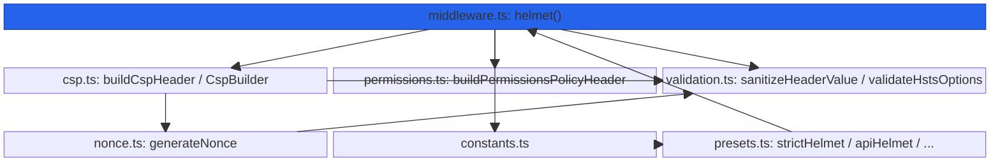

# @nextrush/helmet — Architecture

> Internal design of the header-writing pipeline, the header-injection defenses (control-character sanitization, CSP/HSTS validation-at-construction), and the invariants that turn a `HelmetOptions` configuration into 13 safely-serialized HTTP response headers.

## At a glance

|  |  |
| --- | --- |
| **Package** | `@nextrush/helmet` |
| **Layer** | `middleware` (above `types`; below nothing — a leaf middleware) |
| **Depends on** | `@nextrush/types` (types only, erased at build) — no third-party runtime deps |
| **Depended on by** | Application code that calls `app.use(helmet(...))`; not depended on by any other `@nextrush/*` package |
| **Public entry** | `src/index.ts` (barrel — exports only) |
| **Internal modules** | 9 files (excl. tests) · 2,468 LOC · largest `types.ts` = 456 LOC, `csp.ts` = 405 LOC — both **over** the 300-line package cap (see [Architecture checklist](#architecture-checklist)) |
| **On the request hot path?** | Yes — runs on every request once registered; header construction and writes happen per request |
| **Runtime coupling** | None — zero `node:` imports; nonce generation uses `crypto.getRandomValues()` (Web Crypto API) |
| **State model** | Stateless per request — no state is shared or accumulated across requests |

## Responsibilities

**This package owns:**

- **Security response-header construction** — building and writing all 13 headers listed in the README's Options table from a single `HelmetOptions` configuration
- **CSP directive serialization and tooling** — `buildCspHeader`, the fluent `CspBuilder`, nonce injection (`buildCspWithNonce`), and security analysis (`analyzeCsp`)
- **Permissions-Policy serialization and tooling** — `buildPermissionsPolicyHeader`, the fluent `PermissionsPolicyBuilder`, and a restrictive preset
- **Header-injection defenses** — rejecting control characters and CSP-forbidden characters (`;`, newlines) before any value reaches a header
- **HSTS configuration validation** — construction-time errors for invalid `maxAge`, warnings for a `preload`/`includeSubDomains` mismatch
- **Nonce generation and validation** — cryptographically random, Web Crypto–backed nonces for CSP inline-script/style allowances

**This package does NOT own:**

- Cross-origin request/response header negotiation (`Access-Control-*`) → `@nextrush/cors`
- CSRF token issuance or validation → `@nextrush/csrf`
- Request body validation → application code / a schema library
- Rate limiting → `@nextrush/rate-limit`
- The middleware execution engine (`compose`, `ctx.next()`) → `@nextrush/core`
- Sending the response — it sets headers and (for `X-Powered-By`) removes one on `Context`; the adapter writes the actual bytes

## Non-goals

The package intentionally does not:

- Enforce a Content Security Policy server-side — CSP is a browser-enforced restriction communicated via a header; a non-browser HTTP client ignores it entirely
- Guarantee a CSP is free of every possible misconfiguration — `analyzeCsp`/`analyzeCspSecurity` are heuristic warnings (missing `default-src`, unsafe values, wildcards), not a policy linter with full coverage
- Track nonces across requests — each call to `generateNonce()` is independent; correlating a nonce with a specific request/response is the caller's responsibility (typically via `ctx.state`)
- Parse or rewrite an existing CSP header from a previous middleware — `helmet()` always builds its header value from its own configuration, it never merges with headers set elsewhere

## Constraints

Must remain:

- **Runtime-independent** — zero `node:*` imports; the only environment-conditional code is a `typeof process !== 'undefined'` guard in `devHelmet()` and `securityWarning()`, used only to skip a production warning, never to change which headers are set
- **Zero third-party dependency** — a types-only dependency on `@nextrush/types`
- **ESM-only** — no CommonJS build
- **Fail-secure on header injection** — any value containing a control character or (for CSP) a forbidden character throws rather than being silently stripped or truncated
- **Public API sealed** — the exported surface is semver-guarded (ADR-0005)

## Position in the package hierarchy

```mermaid
block-beta
    columns 5
    types["@nextrush/types"]:1
    space:1
    errors["@nextrush/errors"]:1
    space:1
    core["@nextrush/core"]:1
    space:5
    router["@nextrush/router"]:1
    space:3
    class["@nextrush/class"]:1
    space:5
    adapters["adapter-node / bun / deno / edge"]:5
    space:5
    block:mw:5
        columns 5
        THIS["helmet (this package)"]:1
        cors["cors"]:1
        bodyparser["body-parser"]:1
        validation["validation"]:1
        etc["... other middleware"]:1
    end

    types --> errors --> core --> router --> class --> adapters --> mw

    classDef here fill:#2563eb,color:#fff,stroke:#1e40af;
    class THIS here
```

> [!IMPORTANT]
> Imports flow **downward only**. `@nextrush/helmet` imports from `@nextrush/types` only, and MUST
> NOT be imported by `types`, `errors`, `core`, `router`, `class`, or any adapter (project-rules
> §1). It sits at the middleware layer as a leaf: nothing in the framework core depends on it — an
> application opts in by calling `app.use(helmet(...))`.

**Dependency rules:**
- **Allowed:** `helmet → types`
- **Forbidden:** `helmet → core / router / class / adapters / any other middleware package`

---

## Overview

The package answers one question on every request: *given a `HelmetOptions` configuration, which of the 13 supported security headers should this response carry, and what value should each one have?* The organizing idea is a **linear header-writer** — `helmet()` destructures its options once at construction time (applying every default), and the returned middleware closure walks the same fixed sequence of `if` checks on every request, writing a header when its option is not `false` and skipping it entirely otherwise.

Unlike `@nextrush/cors`, there is no request-dependent branching logic (no origin to validate, no preflight to detect) — every header's value is either fully determined by the static configuration (CSP, HSTS, Permissions-Policy, the cross-origin trio, the legacy `X-*` headers) or explicitly opted into per-request by the caller (a CSP nonce, generated fresh and merged into `script-src`/`style-src` via `buildCspWithNonce()` from inside application middleware, not inside `helmet()` itself).

Security-sensitive string construction is isolated in `validation.ts` (`sanitizeHeaderValue`, `sanitizeCspValue`) rather than inlined into `csp.ts`/`permissions.ts`/`middleware.ts` — every header-value builder in the package routes through one of these two sanitizers before a value is joined into a header string, so the injection defense has one place to audit rather than being re-implemented per header.

### Design principles

1. **Configuration errors fail at construction, not at request time.** An invalid HSTS `maxAge` throws synchronously inside `helmet()` when it's called — enforced by `validateHstsOptions()` at the top of `middleware.ts`'s `helmet()` factory, before the middleware closure is even returned.
2. **Every free-form header-value builder sanitizes before joining.** `buildCspHeader()`, `buildPermissionsPolicyHeader()`, `buildClearSiteDataHeader()`, and `buildReportingEndpointsHeader()` each call `sanitizeHeaderValue()` or `sanitizeCspValue()` on every token before it is joined into the final string. Headers whose values are constrained to a fixed TypeScript literal union (`crossOriginEmbedderPolicy`, `referrerPolicy`, `permittedCrossDomainPolicies`, and similar) are written directly in `middleware.ts` without a runtime sanitizer call, because the type system — not a runtime check — already rules out an injected value at those call sites.
3. **A header set to `false` is never written with an empty or default value.** Every one of the 13 headers has an explicit `if (<option> !== false)` (or the equivalent truthy check) guarding its `ctx.set()` call in `middleware.ts` — enforced by the middleware's linear structure, where each header's code block owns exactly one `ctx.set()` call.
4. **Warnings never gate execution; only the HSTS `maxAge` type/range check does.** `securityWarning()` (used for HSTS preload mismatches and CSP directive gaps) only logs via `console.warn` and is silenced in production (`NODE_ENV === 'production'`) — the *only* hard-enforced construction-time throw is an invalid `maxAge`, which is a data-shape error, not a security-posture judgment call.
5. **Nonce generation uses the Web Crypto API, with a runtime-neutral base64 fallback.** `nonce.ts`'s `toBase64()` prefers `globalThis.btoa`, falls back to `Buffer` on Node, and finally a manual base64 loop — so the same `generateNonce()` call produces a correctly-encoded nonce on every supported runtime without a `node:buffer` import.

---

## Module structure

```text
src/
├── index.ts        # Public API barrel (exports only, no implementation) — 149 LOC
├── types.ts         # HelmetOptions, ContentSecurityPolicyOptions, and all directive/value types — 456 LOC
├── constants.ts     # HEADERS, DEFAULT_CSP_DIRECTIVES, STRICT_CSP_DIRECTIVES, HSTS/CSP limits — 177 LOC
├── validation.ts     # sanitizeHeaderValue/sanitizeCspValue, CSP/nonce/HSTS validators, securityWarning — 257 LOC
├── csp.ts            # buildCspHeader, CspBuilder, buildCspWithNonce, analyzeCsp — 405 LOC
├── permissions.ts     # buildPermissionsPolicyHeader, PermissionsPolicyBuilder, restrictivePermissionsPolicy — 226 LOC
├── nonce.ts           # generateNonce/generateCspNonce, extractNonce, createNoncedScript/Style — 190 LOC
├── middleware.ts       # helmet() factory — the per-request header-writing pipeline — 233 LOC
└── presets.ts          # strictHelmet, apiHelmet, devHelmet, staticHelmet, logoutHelmet, per-header middleware — 375 LOC
```

### Module responsibilities

| Module | Responsibility (the one thing it owns) |
| ------ | -------------------------------------- |
| `types.ts` | The public option/data contracts — no logic. |
| `constants.ts` | Every header name, default value, and validation limit, in one place. |
| `validation.ts` | Header-injection sanitizers, CSP/nonce/HSTS format validators, and the dev-only warning sink — no header assembly. |
| `csp.ts` | CSP header string construction, the fluent `CspBuilder`, and nonce-aware CSP options. |
| `permissions.ts` | Permissions-Policy header string construction and the fluent `PermissionsPolicyBuilder`. |
| `nonce.ts` | Cryptographically random nonce generation and nonce-aware HTML tag helpers. |
| `middleware.ts` | Wires all 13 header builders into the per-request middleware; owns the construction-time HSTS validation. |
| `presets.ts` | Named, pre-configured `HelmetOptions` combinations for common deployment shapes, plus single-header middleware factories. |

## Component relationships



`presets.ts` never touches `csp.ts`, `permissions.ts`, or `validation.ts` directly — every preset is expressed as a call into `helmet()`, so a preset can never bypass the construction-time HSTS validation or the sanitization every header builder performs.

---

## Lifecycle

### Request → response (execution sequence)

How a single request flows through the middleware, including where header-injection defenses run:

```mermaid
sequenceDiagram
    participant Client
    participant Helmet as helmet() middleware
    participant Csp as csp.ts: buildCspHeader
    participant San as validation.ts: sanitize*
    participant Ctx as Context
    participant Next as downstream handler

    Client->>Helmet: GET /page
    opt hidePoweredBy (default true)
        Helmet->>Ctx: remove("X-Powered-By")
    end
    opt contentSecurityPolicy !== false (default on)
        Helmet->>Csp: buildCspHeader(mergedDirectives)
        Csp->>San: sanitizeCspValue(key), sanitizeCspValue(value) per directive
        San-->>Csp: sanitized string, or throw on ";"/newline
        Csp-->>Helmet: "default-src 'self'; object-src 'none'; ..."
        Helmet->>Ctx: set("Content-Security-Policy", header)
    end
    Helmet->>Ctx: set(COEP) / set(COOP) / set(CORP) / set(X-DNS-Prefetch-Control)
    opt hsts !== false (default on)
        Note over Helmet: maxAge already validated at construction time
        Helmet->>Ctx: set("Strict-Transport-Security", "max-age=...; includeSubDomains")
    end
    Helmet->>Ctx: set(X-Content-Type-Options) / set(Origin-Agent-Cluster)
    opt permissionsPolicy provided (default: not sent)
        Helmet->>San: sanitizeHeaderValue(feature), sanitizeHeaderValue(value)
        Helmet->>Ctx: set("Permissions-Policy", header)
    end
    Helmet->>Ctx: set(Referrer-Policy) / set(X-XSS-Protection) / set(X-Download-Options) / set(X-Permitted-Cross-Domain-Policies)
    opt clearSiteData provided (default: not sent)
        Helmet->>San: sanitizeHeaderValue(value) per entry
        Helmet->>Ctx: set("Clear-Site-Data", header)
    end
    opt reportingEndpoints provided (default: not sent)
        Helmet->>San: sanitizeHeaderValue(name), sanitizeHeaderValue(url)
        Note over Helmet: throws if a sanitized URL still contains a quote character
        Helmet->>Ctx: set("Reporting-Endpoints", header)
    end
    Helmet->>Next: await next()
    Next-->>Client: response body, with all enabled headers already attached
```

The ordering a reader would otherwise get wrong: `X-Powered-By` removal happens **first**, before any header is set — so even if a later header-write throws (an invalid `reportingEndpoints` URL, for example), the fingerprinting header has already been stripped. Every value that reaches `ctx.set()` for CSP, Permissions-Policy, Clear-Site-Data, or Reporting-Endpoints has already passed through `sanitizeCspValue()`/`sanitizeHeaderValue()`; the cross-origin, referrer, and cross-domain-policy headers are written directly because their values are type-constrained literal unions, not free-form strings — there is no code path that interpolates an unconstrained, unsanitized string into any of the 13 headers.

### Header-injection defense (the sanitization boundary)

The path any header-bound string value takes before it can reach `ctx.set()`:

```mermaid
stateDiagram-v2
    [*] --> RawValue: string from options or a builder call
    RawValue --> ControlCharCheck: sanitizeHeaderValue(value)
    ControlCharCheck --> Rejected: /[\x00-\x1f\x7f]/ matches\n(throws Error)
    ControlCharCheck --> Trimmed: no control characters

    Trimmed --> CspCharCheck: sanitizeCspValue(value)\n(CSP directive values only)
    CspCharCheck --> Rejected: contains ";" or a newline\n(throws Error)
    CspCharCheck --> SafeForCsp: no forbidden characters

    Trimmed --> SafeForHeader: non-CSP header (Permissions-Policy,\nClear-Site-Data, Reporting-Endpoints)

    SafeForCsp --> JoinedIntoHeader: joined into the CSP header string
    SafeForHeader --> JoinedIntoHeader: joined into its header string

    JoinedIntoHeader --> WrittenToContext: ctx.set(headerName, value)
    Rejected --> [*]: middleware call throws --\nno partial or malformed header is ever written
    WrittenToContext --> [*]
```



> [!NOTE]
> The two sanitizers are deliberately layered, not merged: `sanitizeHeaderValue()` is the base
> control-character check every generic header value goes through, while `sanitizeCspValue()` adds
> the CSP-specific `;`/newline rejection on top for directive values -- but `sanitizeCspValue()`
> does not call `sanitizeHeaderValue()` internally; it duplicates its own trim-and-check instead
> (`validation.ts`). A value that is safe for a generic header is not automatically assumed safe
> for a CSP directive, and vice versa.

## State ownership

| Owner | State it owns | Scope |
| ----- | ------------- | ----- |
| `helmet()` closure | The destructured, defaulted `HelmetOptions` (CSP directives, HSTS config, every boolean flag) | app — computed once when `helmet(options)` is called |
| `Context` (owned by `core`/the adapter) | The written response headers, `ctx.status` | per request |
| *(none)* | No module-level mutable state exists in this package | — |

There is no app-scoped or per-request mutable state beyond the closed-over, immutable-after-construction options. Every header value is either fixed at construction time or recomputed fresh on each request from that same fixed configuration — there is nothing analogous to `@nextrush/cors`'s per-request `Vary`-tracking `WeakMap`.

## Data structures

```ts
// The full configuration surface (types.ts). Every field maps to exactly one header,
// and every field can be set to `false` to omit that header entirely.
interface HelmetOptions {
  contentSecurityPolicy?: ContentSecurityPolicyOptions | false;     // default: { useDefaults: true }
  crossOriginEmbedderPolicy?: CrossOriginEmbedderPolicyValue | false; // default: 'require-corp'
  crossOriginOpenerPolicy?: CrossOriginOpenerPolicyValue | false;     // default: 'same-origin'
  crossOriginResourcePolicy?: CrossOriginResourcePolicyValue | false; // default: 'same-origin'
  dnsPrefetchControl?: 'on' | 'off' | false;                          // default: 'off'
  hsts?: StrictTransportSecurityOptions | false;                      // default: { maxAge: 15552000, includeSubDomains: true }
  noSniff?: boolean;                                                  // default: true
  originAgentCluster?: boolean;                                       // default: true
  permissionsPolicy?: PermissionsPolicyDirectives | false;            // default: undefined (not sent)
  referrerPolicy?: ReferrerPolicyValue | ReferrerPolicyValue[] | false; // default: 'no-referrer'
  xssFilter?: boolean;                                                // default: false (sends "0")
  ieNoOpen?: boolean;                                                 // default: true
  permittedCrossDomainPolicies?: 'none' | 'master-only' | 'by-content-type' | 'all' | false; // default: 'none'
  clearSiteData?: ClearSiteDataValue[] | false;                       // default: undefined (not sent)
  reportingEndpoints?: Record<string, string> | false;                // default: undefined (not sent)
  hidePoweredBy?: boolean;                                            // default: true
}

// The minimal context contract this package requires -- narrower than a full framework
// Context, so Helmet can run against any adapter that implements this shape.
interface HelmetContext {
  method: string;
  path: string;
  status: number;
  set: (name: string, value: string) => void;
  get?: (name: string) => string | undefined;
  remove?: (name: string) => void; // optional -- hidePoweredBy is a no-op without it
}
```

The shape choice for `HelmetOptions` is deliberate: every field is independently `false`-able rather than the package exposing one global `enabled: boolean` switch, because the realistic failure mode this package defends against is "one header was forgotten," not "all headers were forgotten" — an all-or-nothing switch would not let a caller keep 12 headers on while turning off the one that conflicts with their CDN.

## Concurrency & edge behaviour

- **Shared, immutable after construction:** the destructured `HelmetOptions` fields closed over by the returned middleware function — computed once per `helmet(options)` call, read on every request, never mutated.
- **Per-request, never shared:** nothing — this package holds no per-request state at all; every header value is recomputed from the same static configuration on each call.
- **Idempotency:** every response for the same configuration carries the same 13 headers regardless of request content — the only per-request variability is a caller-supplied CSP nonce, generated by the caller's own middleware, not by `helmet()`.
- **Nonce collision risk:** `generateNonce()`'s default 16 bytes (128 bits) of entropy from `crypto.getRandomValues()` makes a collision practically impossible within a single process's lifetime, but the package does not track issued nonces — reusing a nonce value across two different responses is the caller's responsibility to avoid (e.g., by calling `generateNonce()` fresh per request, as the Quick start's CSP-nonce example does).

> [!WARNING]
> `hidePoweredBy` calling `ctx.remove()` is a no-op if the `Context` implementation doesn't
> provide a `remove()` method (`HelmetContext.remove` is `?:` optional in `types.ts`) — the header
> is silently *not* removed in that case, with no error and no warning. A contributor relying on
> `hidePoweredBy: true` to guarantee the header's absence should confirm their adapter implements
> `remove()`.

## Trust boundaries

```text
Caller-supplied HelmetOptions (application-controlled, not attacker-controlled)
   │
   ▼
sanitizeHeaderValue() / sanitizeCspValue()  -- control-character / CSP-char rejection   <- this package's boundary
   │
   ▼
buildCspHeader() / buildPermissionsPolicyHeader() / buildClearSiteDataHeader() / buildReportingEndpointsHeader()
   │
   ▼
ctx.set(headerName, sanitizedValue)  -- only ever a value that has passed sanitization
```

Unlike `@nextrush/cors`, this package's primary input is **application configuration**, not a per-request attacker-controlled header — `HelmetOptions` is set once by the developer, not derived from request data on every call. The trust boundary this package enforces is narrower but still real: a CSP directive value, a Permissions-Policy origin, a Clear-Site-Data entry, or a Reporting-Endpoints URL could still originate from a runtime value (an environment variable, a config file read at startup) rather than a hardcoded literal, and the sanitizers exist specifically so that an unexpected control character or semicolon in that value cannot split or inject an additional header.

## Extension points

**Supported extension points:**

- **The exported builders** (`CspBuilder`, `PermissionsPolicyBuilder`) — the sanctioned way to construct directive objects programmatically; both route through the same `buildCspHeader`/`buildPermissionsPolicyHeader` functions `helmet()` itself uses.
- **`buildCspWithNonce`** — the sanctioned per-request nonce-injection path; callers invoke it from their own middleware rather than `helmet()` generating nonces itself, keeping nonce lifecycle (one per request) under application control.
- **New presets** — `presets.ts` shows the pattern (always call `helmet()`, never write headers directly); a new preset should follow the same shape.

**Forbidden (sealed):**

- **The header-injection sanitizers** (`sanitizeHeaderValue`, `sanitizeCspValue`) — weakening the control-character or CSP-character checks would reopen the exact response-splitting/injection vector the package exists to prevent; RFC-gated.
- **The construction-time HSTS `maxAge` validation** — removing the throw would let an invalid HSTS configuration reach production silently.
- **Direct `ctx.set()` calls for one of the 13 headers from outside `middleware.ts`/`presets.ts`** — every header-writing call site is intentionally centralized so the sanitization boundary above is never bypassed by a new code path.

---

## Architectural invariants

These are part of the package's architecture. They do not change without an RFC:

- **Every header defaults to its OWASP-recommended value; only `permissionsPolicy`, `clearSiteData`, and `reportingEndpoints` default to "not sent."**
- **Any header option can be set to `false` to omit that header entirely** — there is no way to force-set an empty or placeholder value for a disabled header.
- **A header value never reaches `ctx.set()` without passing through `sanitizeHeaderValue()` or `sanitizeCspValue()` first.**
- **HSTS `maxAge` is validated at construction time and throws on an invalid value** — a bad configuration fails the moment `helmet()` is called, not on the first request.
- **`X-Powered-By` removal runs before any header is written**, so a later throw in header construction cannot leave the fingerprinting header in place.
- **The package imports no runtime API** — zero `node:*` imports; nonce generation degrades gracefully across `btoa` / `Buffer` / a manual base64 loop, but never imports a Node-specific module.

## Engineering decisions

| Decision | Chosen | Trade-off accepted | Reference |
| -------- | ------ | ------------------- | --------- |
| HSTS `maxAge` validation | Hard `throw` at construction time for invalid values; warning-only for preload eligibility | A malformed `maxAge` fails fast; a preload/`includeSubDomains` mismatch only logs, trusting the caller to review it | `middleware.ts`, `validation.ts` |
| Nonce lifecycle | `generateNonce()`/`buildCspWithNonce()` exposed as building blocks, not wired into `helmet()`'s own request loop | Callers must generate and apply a nonce themselves per request; `helmet()` stays stateless and has no per-request hook | `nonce.ts`, `csp.ts` |
| `xssFilter` default | `false`, which sends `X-XSS-Protection: 0` rather than omitting the header | Matches OWASP guidance (the legacy filter itself is a historical XSS vector), but differs from naive expectations that "filter: false" would omit the header | `middleware.ts` |
| Base64 encoding for nonces | Runtime-neutral fallback chain (`btoa` → `Buffer` → manual loop) instead of a `node:buffer` import | A few extra lines of manual encoding logic, in exchange for zero Node-specific imports | `nonce.ts` |
| Sanitizer layering | Two separate functions (`sanitizeHeaderValue`, `sanitizeCspValue`) instead of one generic sanitizer with a mode flag | Some duplicated control-character logic, in exchange for each header family's rules being independently auditable | `validation.ts` |

## Rejected alternatives

### A single `enabled: boolean` master switch
Rejected: the realistic failure mode this package defends against is a forgotten single header, not a forgotten security posture entirely — an app is far more likely to need "everything except CSP" (an API server) than "everything or nothing." Per-header `false` values, plus the preset functions for common combinations, were chosen instead.

### Generating and tracking CSP nonces inside `helmet()` itself
Rejected: `helmet()` is a synchronous, request-independent header writer by design (see Design principle 1) — giving it a per-request nonce-generation responsibility would require either a stateful `WeakMap` (like `@nextrush/cors`'s `Vary` tracker) or an implicit `ctx.state` write, both of which the package's stateless model deliberately avoids. Exposing `generateNonce()`/`buildCspWithNonce()` as building blocks keeps that decision in the caller's own middleware.

### A single generic sanitizer function with a `mode: 'header' | 'csp'` parameter
Rejected: `sanitizeHeaderValue()` and `sanitizeCspValue()` guard genuinely different character sets (control characters vs. CSP-specific `;`/newline), and a shared function with a mode parameter would raise the odds of calling the wrong mode at a new call site. Two small, independently-named functions were chosen so a reviewer can see which check applies from the call site alone.

---

## Testing strategy

- **Unit:** every header builder (`buildCspHeader`, `buildPermissionsPolicyHeader`, `buildClearSiteDataHeader`, `buildReportingEndpointsHeader`) against known-good and known-injection-attempt inputs; the sanitizers against control characters, CSP-forbidden characters, and clean values; HSTS validation against valid/invalid/preload-edge-case configurations; nonce generation/extraction/validation round-trips.
- **Integration:** the full `helmet()` middleware against a simulated `Context`, asserting all 13 headers (or their absence when disabled) for the default configuration and for each preset.
- **Conformance / cross-adapter parity:** N/A directly — the package uses no runtime API; identical behavior across adapters follows from having zero `node:` imports and a runtime-neutral base64 fallback, verified indirectly by `packages/adapters/conformance`.
- **Coverage:** >=90% lines/functions (CI-enforced).

## Evolution strategy

- **Stable (semver-guarded):** the sealed public surface — `helmet()`, all six presets, the four single-header middleware factories, both builders, every nonce utility, every validator, and every type in `types.ts` (ADR-0005).
- **May change without notice:** the internal base64 fallback chain in `nonce.ts`, the exact wording of `securityWarning()` messages, the internal module split (which file owns which builder).
- **Changes only via RFC:** the default value of any header, the sanitization rules in `validation.ts`, and the construction-time HSTS validation behavior.

**Timeline:** 3.0 — initial security-headers middleware (13 headers, six presets, CSP/Permissions-Policy builders, nonce utilities, HSTS validation).

## Contributor notes

Before changing this package, read: the OWASP Secure Headers Project guidance the defaults are drawn from, `constants.ts`'s `DEFAULT_CSP_DIRECTIVES`/`STRICT_CSP_DIRECTIVES` and the comments around them, and `validation.ts`'s sanitizers — any change to a sanitizer or a default header value is a security-relevant change and should be treated as RFC-gated per this document's invariants.

`types.ts` (456 LOC) and `csp.ts` (405 LOC) currently exceed the 300-line package cap in
`architecture.instructions.md`; a contributor touching either file should consider whether a split
(e.g. separating CSP-specific types from the shared `HelmetOptions`/cross-origin types, or
separating the `CspBuilder` class from the standalone `buildCspHeader`/`buildCspWithNonce`/`analyzeCsp`
functions) is due, rather than adding further lines to either file.

## Architecture checklist

Before changing this package, confirm:

- [ ] Does this preserve the architectural invariants above (especially the sanitization boundary and the HSTS construction-time throw)?
- [ ] Does this increase coupling or cross a dependency rule (`helmet → types` only)?
- [ ] Does this affect the request hot path (allocations in the per-request header-writing loop)?
- [ ] Does this change the sealed public API (semver / ADR-0005)? Does it need an RFC?
- [ ] If this touches a sanitizer or a default header value, does it remain fail-secure (reject on ambiguity, never silently weaken a default)?
- [ ] Does this add lines to `types.ts` or `csp.ts` without considering the split noted above?

---

## References & see also

- **README (how to use it):** [`./README.md`](./README.md)
- **ADR:** [`ADR-0005 — package tiers & sealed surface`](https://github.com/0xTanzim/nextRush/blob/main/docs/adr/ADR-0005-package-tiers-sealed-surface-deprecation.md)
- **Security boundary reference:** `.kiro/steering/project-rules.instructions.md` §4 (this package sets the security-relevant headers — CSP, HSTS, X-Content-Type-Options — that boundary requires)
- **Documentation site:** [nextRush docs](https://0xtanzim.github.io/nextRush/docs)
- **Repository:** [`packages/middleware/helmet`](https://github.com/0xTanzim/nextRush/tree/main/packages/middleware/helmet)
