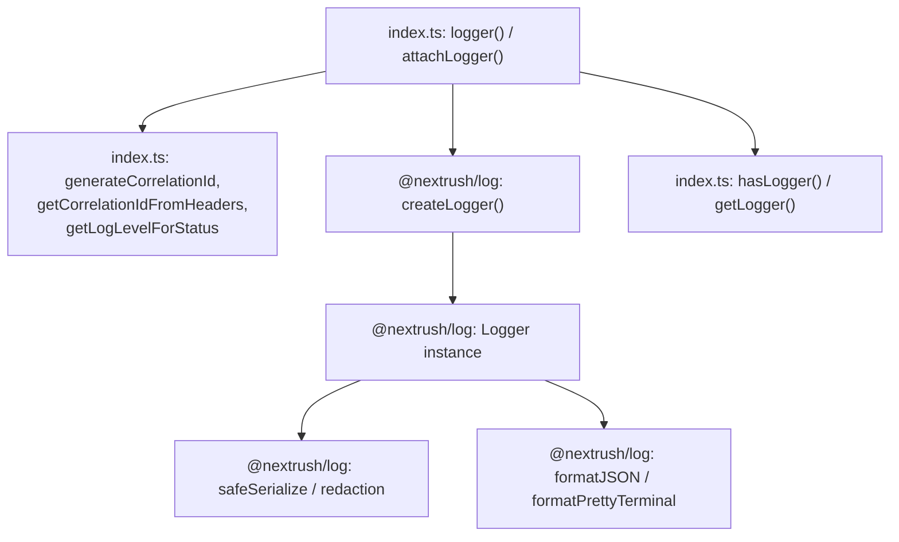
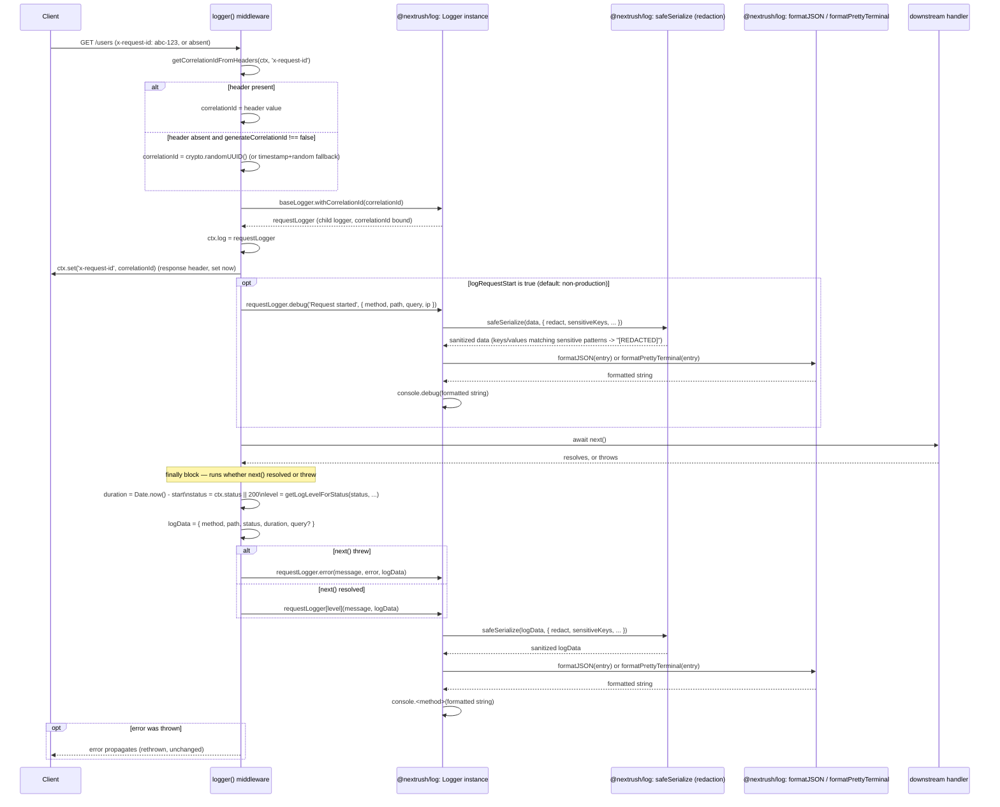

# @nextrush/logger — Architecture

> Internal design of the request-logging middleware layer that sits on top of the standalone `@nextrush/log` engine — correlation-ID handling, completion-line logging, and exactly where format selection and redaction happen in the request lifecycle.

## At a glance

|  |  |
| --- | --- |
| **Package** | `@nextrush/logger` |
| **Layer** | `middleware` (above `types`; below nothing — a leaf middleware) |
| **Depends on** | `@nextrush/types` (types only, erased at build); `@nextrush/log` (a separate, standalone published npm package — the actual logging engine, not a workspace sibling) |
| **Depended on by** | Application code that calls `app.use(logger())` / `app.use(attachLogger())`; not depended on by any other `@nextrush/*` package |
| **Public entry** | `src/index.ts` (single file — re-exports plus the middleware implementation; see Non-goals on why this isn't split into a multi-module barrel) |
| **Internal modules** | 1 file · 457 LOC (well under the 300-line middleware target is not met here — see Contributor notes) |
| **On the request hot path?** | Yes — runs once per request when mounted; every completion log line is written from inside this middleware's `finally` block |
| **Runtime coupling** | None in this package's own code (no `node:*` imports) — but `@nextrush/log`'s context-propagation mechanism (`AsyncLocalStorage`) is Node/Bun/Deno-specific and falls back on other runtimes; see Compatibility in the README |
| **State model** | Stateless at the package level; a request-scoped child logger (with the request's correlation ID bound in) is created per request and attached to `ctx.log` |

## Responsibilities

**This package owns:**

- ✓ Reading a correlation ID from a configurable request header, or generating one when absent
- ✓ Attaching a request-scoped logger to `ctx.log` (`logger()` and `attachLogger()`)
- ✓ Deciding *when* to log (the `skip` predicate) and *what log level* to use for a given response status
- ✓ Building the completion log's structured fields (`method`, `path`, `status`, `duration`, optionally `query`)
- ✓ Re-exporting the entire `@nextrush/log` public API, so an application depends on one package instead of two

**This package does NOT own:**

- ✗ Log formatting (JSON vs. pretty-terminal), serialization, or redaction logic → all of it lives in `@nextrush/log`, an external package this one depends on and re-exports
- ✗ The `AsyncLocalStorage`-based cross-async-boundary context propagation (`runWithContext`, `getAsyncContext`) → implemented and owned by `@nextrush/log`; this package only re-exports it
- ✗ Response-time headers on the wire (`X-Response-Time`) → [`@nextrush/timer`](../timer)
- ✗ Standalone correlation-ID generation/propagation without a logging engine attached → [`@nextrush/request-id`](../request-id)
- ✗ The middleware execution engine (`compose`, `ctx.next()`) → `@nextrush/core`

## Non-goals

The package intentionally does not:

- Reimplement any part of `@nextrush/log`'s formatting, serialization, or redaction — every one of those concerns is delegated to the dependency, kept as a single source of truth rather than forked/duplicated here
- Split its 457-line `src/index.ts` into a multi-file module structure the way sibling packages do (e.g. `cookies`' `parser.ts`/`serializer.ts`/`signing.ts` split) — the file is dominated by a single, mechanical re-export block (roughly the first third of the file) rather than branching logic; see Contributor notes for the honest accounting against the package's own size target
- Provide field-level redaction *inside the middleware itself* (e.g. stripping specific `ctx.query` keys before they reach the logger) — redaction is applied uniformly by `@nextrush/log`'s serializer to whatever data reaches it, not selectively by this package

## Constraints

Must remain:

- **Runtime-independent in this package's own code** — zero `node:*` imports in `src/index.ts`; the one runtime-sensitive behavior (`AsyncLocalStorage` context propagation) is entirely inside the `@nextrush/log` dependency, not this package
- **A thin layer over `@nextrush/log`** — this package must not grow logic that duplicates or diverges from the dependency's own logging/formatting/redaction behavior
- **ESM-only** — no CommonJS build
- **Public API sealed** — the exported surface (this package's own additions, plus the full re-export list) is locked by `__tests__/public-surface.test.ts`

## Position in the package hierarchy

```mermaid
flowchart TB
    types["@nextrush/types"] --> errors["@nextrush/errors"] --> core["@nextrush/core"]
    core --> router["@nextrush/router"] --> runtime["@nextrush/runtime"] --> di["@nextrush/di"] --> class["@nextrush/class"]
    class --> adapters["adapter-node / bun / deno / edge"] --> middleware["middleware / extensions"]
    log["@nextrush/log (external npm package, not a workspace member)"]
    THIS["@nextrush/logger — this package"]:::here
    middleware --> THIS
    log --> THIS
    classDef here fill:#2563eb,color:#fff,stroke:#1e40af;
```

> [!IMPORTANT]
> Imports flow **downward only** within the NextRush package graph. `@nextrush/logger` imports
> from `@nextrush/types` (workspace) and `@nextrush/log` (external npm dependency, resolved as
> `@nextrush/log@0.2.1` in the lockfile — a concrete pinned version, not a workspace protocol
> reference) and MUST NOT be imported by `types`, `errors`, `core`, `router`, `class`, or any
> adapter (project-rules §1).

**Dependency rules:**
- **Allowed:** `logger → types` (workspace) · `logger → @nextrush/log` (external, pinned version)
- **Forbidden:** `logger → core / router / class / adapters / any other middleware package`

---

## Overview

`@nextrush/logger` is a thin request-logging layer over a separate logging engine, `@nextrush/log`, published and versioned independently of this monorepo (confirmed via `pnpm-lock.yaml`, which resolves it to a concrete `@nextrush/log@0.2.1`, not a `workspace:*` reference). The package's `src/index.ts` has two halves: the first re-exports the entirety of `@nextrush/log`'s public API unchanged, so application code can depend on `@nextrush/logger` alone; the second half — `logger()`, `attachLogger()`, `hasLogger()`, `getLogger()`, and their supporting helpers — is the actual middleware logic this package contributes.

The organizing idea is a strict separation of concerns: this package decides *when* and *with what request-derived fields* to log (correlation ID, method, path, status, duration, level-per-status-code), while `@nextrush/log` decides *how* a log entry is serialized, formatted, redacted, and emitted. Nothing in `logger()`'s implementation touches formatting, redaction key lists, or transport wiring directly — it calls `createLogger()` once per middleware instance and then only ever calls `.debug()`/`.info()`/`.warn()`/`.error()`/`.trace()`/`.fatal()` on the resulting logger, passing plain data objects. Everything downstream of that call is `@nextrush/log`'s responsibility.

### Design principles

1. **The middleware never touches formatting, serialization, or redaction directly.** Enforced structurally: `src/index.ts` contains no formatting/redaction logic of its own — every log call (`requestLogger.info(message, logData)`, etc.) passes a message and a plain object, and the `@nextrush/log` `Logger` class's `log()` method is what calls into `getSerializationOptions()`/`safeSerialize` internally.
2. **Correlation ID handling has a single source of truth per request.** `getCorrelationIdFromHeaders()` is called once at the top of `logger()`/`attachLogger()`; the resulting ID (or a freshly generated one) is bound into the request-scoped logger via `baseLogger.withCorrelationId(correlationId)` and reused for every log call the request makes — there is no second, independently-derived correlation ID anywhere in the request.
3. **The completion log always fires, success or failure.** `logger()`'s core logic runs inside a `try`/`finally` around `await next()` — the `finally` block computes duration and logs the completion line unconditionally; a thrown error is additionally logged via `.error()` with the error object attached, then the error is rethrown unchanged (this middleware never swallows an error, only observes it).
4. **Log level for a completion line is derived purely from the response status code**, via `getLogLevelForStatus()` — a pure function taking `status` and the three configured level names, with no side effects and no dependency on request content.

---

## Module structure

```text
src/
├── index.ts        # Everything: re-exports of @nextrush/log, LoggerContext/LoggerMiddlewareOptions
│                    # types, helper functions (generateCorrelationId, getCorrelationIdFromHeaders,
│                    # getLogLevelForStatus), and the logger()/attachLogger()/hasLogger()/getLogger()
│                    # exports themselves.
└── __tests__/
    ├── logger.test.ts          # Behavioral tests for logger()/attachLogger()/re-exports
    └── public-surface.test.ts  # Locks the exported surface shape (ADR-0005)
```

### Module responsibilities

| Module | Responsibility (the one thing it owns) |
| ------ | -------------------------------------- |
| `index.ts` | The entire package: re-export barrel for `@nextrush/log`, the `LoggerContext`/`LoggerMiddlewareOptions` types, and the four exported functions (`logger`, `attachLogger`, `hasLogger`, `getLogger`) plus their three private helpers. |

## Component relationships



`index.ts` never reaches into `@nextrush/log`'s internal serialization or formatting functions directly — every interaction goes through the `ILogger` interface (`.info()`, `.debug()`, `.child()`, `.withCorrelationId()`, etc.) returned by `createLogger()`, keeping the two packages' responsibilities cleanly separated even though they live in one file.

---

## Lifecycle

### Request -> log-capture -> emit sequence

The path a single request takes through `logger()`, from the correlation ID lookup to the emitted log line, including where `@nextrush/log`'s formatting and redaction happen:



The two facts a reader would otherwise miss: **redaction and format selection both happen once, inside `@nextrush/log`'s `Logger.log()`, for every single call** — `logger()` never checks `redact`/`pretty` itself, it just calls `.info()`/`.error()`/etc. and lets the underlying `Logger` instance (configured via whatever `LoggerMiddlewareOptions` passed through as `loggerOptions` to `createLogger()`) decide. And **the completion log's level is chosen from `ctx.status`, not from whether an error was thrown** — an uncaught error still goes through `.error()` explicitly (see the `alt` branch above), but a handler that catches its own error and sets `ctx.status = 500` without throwing gets the same `.error()`-level treatment via `getLogLevelForStatus()`, not a silent downgrade.

## State ownership

| Owner | State it owns | Scope |
| ----- | -------------- | ----- |
| `baseLogger` (closure inside `logger()`/`attachLogger()`) | The base `Logger` instance created once per middleware registration via `createLogger(loggerContext, loggerOptions)` | app (one instance per `app.use(logger(...))` call, shared across all requests it handles) |
| `requestLogger` (local variable per request) | A child logger with the request's correlation ID bound in, created fresh via `baseLogger.withCorrelationId(...)` | per request |
| `ctx.log` (owned by `Context`, written by this middleware) | The reference to `requestLogger` for the current request | per request |
| `@nextrush/log`'s global config (`GlobalLoggerConfig`) | Process-wide enabled/disabled state, global transports, namespace filters — configured via `configure()`/`configureFromEnv()`, re-exported but not owned by this package | process-wide, owned by `@nextrush/log` |

## Concurrency & edge behaviour

- **Shared, immutable after construction:** `baseLogger` — created once when `logger()`/`attachLogger()` is called (typically at app startup), then read-only for the lifetime of the app; concurrent requests each derive their own `requestLogger` child without mutating `baseLogger`.
- **Per-request, never shared:** `requestLogger`, the correlation ID, and the `logData` object built in the `finally` block.
- **Idempotency:** logging a request is not idempotent in the sense of side effects (each call to `logger()`'s returned middleware writes a log line and a response header), but it is safe to call repeatedly — there is no state carried between requests that would make a duplicate log line incorrect, only duplicated.
- **Client disconnect / abort:** the middleware has no explicit `AbortSignal`/disconnect handling of its own — if `next()` throws because a downstream handler or adapter surfaces a disconnect as an error, the `finally` block still runs and logs a completion line with whatever `ctx.status` was at that point (default `200` if never set, per `const status = ctx.status || 200`).

> [!WARNING]
> `ctx.status || 200` treats a falsy status (e.g. `0`, which is never a real HTTP status, or an
> unset status) as `200` for logging purposes. A response that genuinely never had its status set
> before the error path will be logged as a `200 info`-level completion even if the actual
> response the client received was an adapter-level error — this is a logging artifact of the
> fallback, not a claim about what was actually sent on the wire.

## Trust boundaries

```text
Client-supplied headers (x-request-id) and request data (ctx.query, thrown Error objects)
   │
   ▼
logger() middleware — reads header, generates ID, builds logData from ctx fields   <- this package's entry point
   │
   ▼
@nextrush/log: Logger.log() -> safeSerialize()                                     <- redaction boundary (external dependency)
   │            (DEFAULT_SENSITIVE_KEYS key match, or SSN/credit-card/bank-account
   │             value-pattern match -> "[REDACTED]", only when redact is true)
   ▼
formatted log line -> console.<level>() / configured transports
```

This package does not itself inspect or redact any field it passes to the logger — `ctx.query`, the error object, and every `logData` field flow to `@nextrush/log` unredacted from this package's point of view, and redaction happens entirely inside `@nextrush/log`'s `safeSerialize`/`Ce()`/`Ie()` object-walking functions before formatting. `redact` defaults to `true` only in a `production` environment (`@nextrush/log`'s `resolveOptions()`); in development/test it defaults to `false`, meaning **sensitive-looking fields are not redacted by default outside production** unless `redact: true` is passed explicitly to `logger()`.

## Extension points

**Supported extension points:**

- **`formatMessage`** — the sanctioned way to customize the completion log's message text without touching the structured fields or bypassing redaction (the message string itself is not passed through `safeSerialize`, so a custom `formatMessage` that embeds sensitive data would not be redacted — see the Troubleshooting note in the README about naming fields, not messages, for anything sensitive).
- **`skip`** — the sanctioned way to exclude specific requests (health checks, metrics scrapers) from both the correlation ID machinery and the completion log entirely.
- **Every `@nextrush/log` option** (`redact`, `sensitiveKeys`, `pretty`, `colors`, `transports`, `minLevel`, etc.) — passed through unchanged via the `...loggerOptions` rest spread in both `logger()` and `attachLogger()`.

**Forbidden (sealed):**

- **Reimplementing formatting/redaction inside this package** — see Non-goals; any such logic belongs in `@nextrush/log`, not here, to avoid two divergent implementations of the same concern.
- **Skipping the completion log's `finally` semantics** — the "always logs, even on throw" guarantee (Design principle 3) is relied on by anyone building alerting off completion-log absence; changing it to a `try`-only block would silently stop logging failed requests.

---

## Architectural invariants

The following are part of the package architecture. They do not change without an RFC:

- **This package delegates all formatting, serialization, and redaction to `@nextrush/log`** — it must never duplicate or fork that logic locally.
- **The completion log line fires exactly once per non-skipped request, in a `finally` block, regardless of success or failure.**
- **An uncaught error is always logged at `.error()` level and always rethrown unchanged** — this middleware never swallows an error.
- **The correlation ID used for `ctx.log`, the response header, and every log line within one request is the same single value**, established once at the top of the middleware.
- **The public API is explicit and sealed** — locked by `__tests__/public-surface.test.ts` (ADR-0005).

## Engineering decisions

| Decision | Chosen | Trade-off accepted | Reference |
| -------- | ------ | ------------------- | --------- |
| Logging engine ownership | Delegate entirely to a separate `@nextrush/log` package | This package cannot control formatting/redaction defaults directly (they live upstream); gains a single, independently-versioned logging engine reusable outside NextRush | `package.json` (`@nextrush/log` dependency), `src/index.ts` |
| Two middleware factories (`logger()` vs `attachLogger()`) | Separate exports, not one flag | A small API-surface increase, in exchange for a caller who wants `ctx.log` with zero request-completion logging (e.g. to layer their own logging policy) not paying for logic they don't want | `src/index.ts` |
| Completion log placement | `finally` block around `await next()` | Slightly harder to reason about than a `try`-only block, in exchange for a guarantee that a thrown error still produces a completion log line | `src/index.ts` (`logger()`) |
| Correlation ID fallback | `crypto.randomUUID()` with a timestamp+random string fallback | The fallback ID is not cryptographically random, in exchange for correlation IDs still being generated on runtimes/versions lacking `crypto.randomUUID` | `src/index.ts` (`generateCorrelationId`) |

## Rejected alternatives

### Reimplementing a minimal formatter/redactor inside this package
Rejected: would create two independent implementations of the same concern (this package's and `@nextrush/log`'s), which drift apart over time and double the surface a contributor must reason about for a single logged field. Delegating entirely to `@nextrush/log` was chosen instead, at the cost of this package having no direct control over formatting/redaction defaults beyond what it passes through as options.

### One middleware factory with a `logRequestCompletion: boolean` flag instead of two factories
Rejected: a single factory branching on a flag reads less clearly at the call site (`logger({ logRequestCompletion: false })` vs. the self-documenting `attachLogger()`) for what is, in practice, the most common reason to reach for the lighter path. Two factories were chosen instead, accepting the minor API-surface duplication.

---

## Testing strategy

- **Unit:** `logger.test.ts` covers correlation-ID generation/reuse, custom header names, `skip` behavior, level selection per status code, the `finally`-based completion log on both success and thrown-error paths, and the `@nextrush/log` re-export surface.
- **Integration:** the same suite exercises `logger()`/`attachLogger()` against a mock `Context` shaped like NextRush's real `Context`, rather than mocking `@nextrush/log` itself — the real `createLogger()` runs, so redaction/formatting behavior is exercised end-to-end, not stubbed out.
- **Invariant tests:** the "completion log fires on throw" guarantee is covered by a dedicated case that asserts `.error()` was called with the error before the error is asserted to have propagated.
- **Public-surface test:** `__tests__/public-surface.test.ts` locks the exported runtime/type-only API shape (ADR-0005).
- **Conformance / cross-adapter parity:** N/A directly — this package has no runtime-specific code of its own; any cross-runtime variance comes from `@nextrush/log`'s own `AsyncLocalStorage` fallback behavior, which is that package's concern.
- **Coverage:** >=90% lines/functions (CI-enforced).

## Evolution strategy

- **Stable (semver-guarded):** `logger()`, `attachLogger()`, `hasLogger()`, `getLogger()`, `LoggerContext`, `LoggerMiddlewareOptions`, and the full `@nextrush/log` re-export list (ADR-0005).
- **May change without notice:** the internal helper functions (`generateCorrelationId`, `getCorrelationIdFromHeaders`, `getLogLevelForStatus`) — not exported, free to change shape.
- **Changes only via RFC:** the "delegate all formatting/redaction to `@nextrush/log`" architectural decision, and the `finally`-block completion-log guarantee.

**Timeline:** 1.0 — initial release wrapping `@nextrush/log@0.2.1` with request-logging middleware and correlation-ID handling.

## Contributor notes

Before changing this package, read `@nextrush/log`'s own documentation for exactly what `redact`,
`sensitiveKeys`, `pretty`, and `minLevel` do — this package only forwards those options, it does
not reimplement their semantics. Note also that `src/index.ts` (457 lines) sits over the
middleware package target of 300 lines (`architecture.instructions.md`); the majority of the file
is a mechanical re-export block for `@nextrush/log`'s API, not branching logic, but a future split
(e.g. moving the re-export block into its own file, or the request-logging logic into
`middleware.ts` the way `request-id`/`timer`/`health` are structured) is a reasonable non-breaking
refactor, not an architectural change — logged here rather than silently left unaddressed.

## Architecture checklist

Before changing this package, confirm:

- [ ] Does this preserve the architectural invariants above (especially delegating formatting/redaction to `@nextrush/log`)?
- [ ] Does this increase coupling or cross a dependency rule (`logger → types`, `logger → @nextrush/log` only)?
- [ ] Does this affect the request hot path (the completion log's `finally` block, correlation-ID generation)?
- [ ] Does this change the sealed public API (semver / ADR-0005)? Does it need an RFC?
- [ ] If this touches redaction/formatting behavior, does the change actually belong in `@nextrush/log` instead of here?

---

## References & see also

- **README (how to use it):** [`./README.md`](./README.md)
- **ADR:** [`ADR-0005 — package tiers & sealed surface`](https://github.com/0xTanzim/nextRush/blob/main/docs/adr/ADR-0005-package-tiers-sealed-surface-deprecation.md)
- **Security boundary reference:** `.kiro/steering/project-rules.instructions.md` §4 (structured logging, no sensitive data)
- **The logging engine this package wraps:** [`@nextrush/log`](https://www.npmjs.com/package/@nextrush/log)
- **Documentation site:** [nextRush docs](https://0xtanzim.github.io/nextRush/docs)
- **Repository:** [`packages/middleware/logger`](https://github.com/0xTanzim/nextRush/tree/main/packages/middleware/logger)
