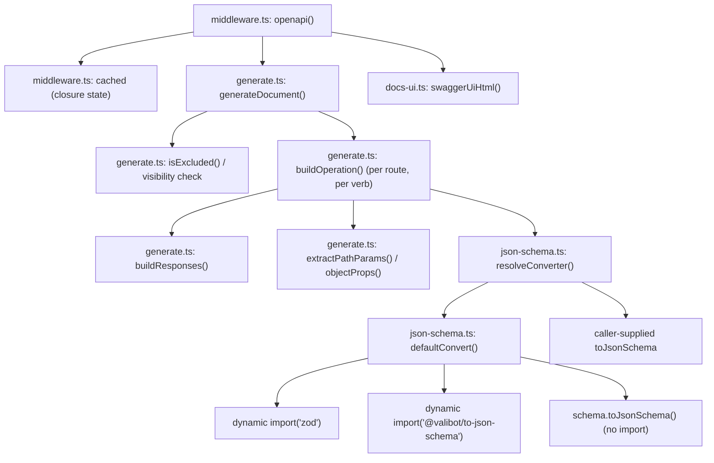
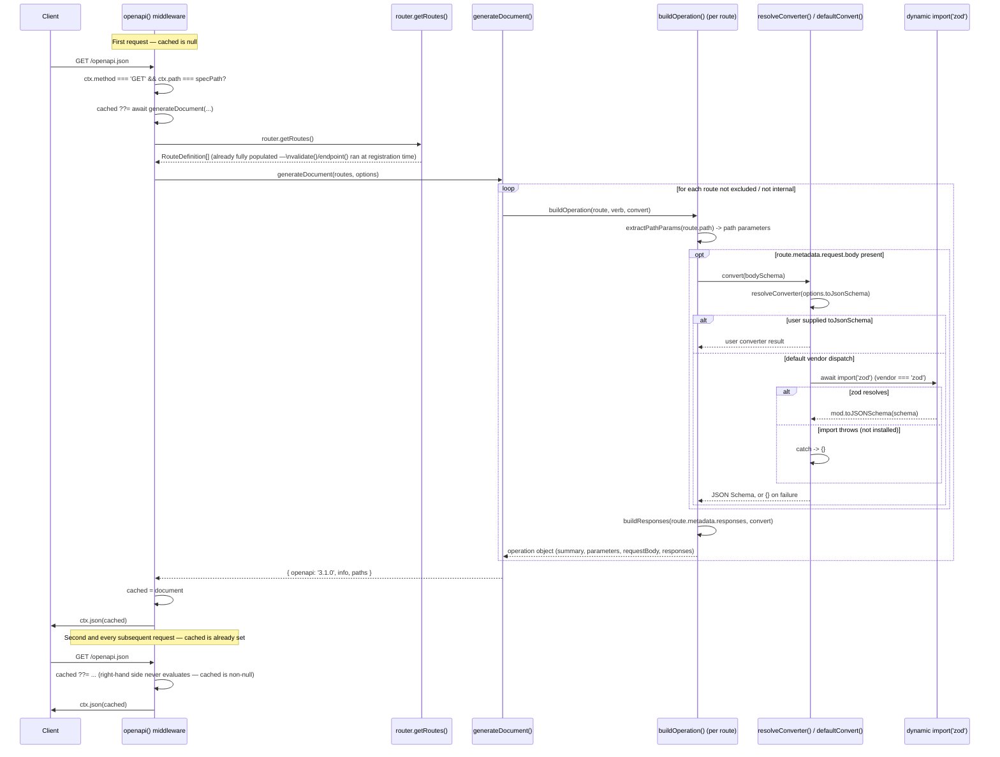

# @nextrush/openapi — Architecture

> Internal design of the OpenAPI document generator — how route metadata flows from `router.getRoutes()` through vendor-dispatched schema conversion into a cached OpenAPI 3.1 document, and why the generator is a pure function decoupled from the router and the request hot path.

## At a glance

|  |  |
| --- | --- |
| **Package** | `@nextrush/openapi` |
| **Layer** | `middleware` (above `types`/`router`; below nothing — a leaf middleware/renderer) |
| **Depends on** | `@nextrush/types` (types only, erased at build) — no third-party runtime dependency; `zod`/`@valibot/to-json-schema` are optional, dynamically imported, never bundled |
| **Depended on by** | Application code that calls `app.use(openapi({ router }))`; not depended on by any other `@nextrush/*` package. `apps/website/scripts/generate-openapi.ts` imports its built `dist/` to dogfood `generateDocument()` at the docs site's build time. |
| **Public entry** | `src/index.ts` (barrel — exports only) |
| **Internal modules** | 5 files (excl. tests) — `types.ts` (37 LOC), `middleware.ts` (49 LOC), `json-schema.ts` (60 LOC), `docs-ui.ts` (40 LOC), `generate.ts` (187 LOC); largest `generate.ts`, well within the 300-line middleware cap |
| **On the request hot path?** | Only for the two paths it intercepts (spec, docs); the document-generation work itself runs at most once per process, on the first request to the spec path — every other request is a single `ctx.path` comparison before falling through to `next()` |
| **Runtime coupling** | None — zero `node:*` imports; the one runtime-conditional code path is a variable-specifier dynamic `import()` for an optional schema-converter package, wrapped in `try`/`catch` |
| **State model** | One mutable value per `openapi()` call: a `cached: OpenApiDocument \| null` closure variable, written once and read on every subsequent spec request |

## Responsibilities

**This package owns:**

- ✓ Transforming a `RouteDefinition[]` into an OpenAPI 3.1 document (`generateDocument()`) — a pure function, no I/O
- ✓ Serving the generated document as JSON at a configurable path, and caching it after the first generation
- ✓ Serving a minimal Swagger UI HTML page at a second configurable path
- ✓ Dispatching Standard Schema → JSON Schema conversion by vendor, with a safe untyped fallback and a user-override escape hatch
- ✓ Path-pattern translation (`:id` → `{id}`) and path-parameter extraction for the generated document

**This package does NOT own:**

- ✗ Collecting `RouteDefinition`s from registered routes → `@nextrush/router` (this package only calls `router.getRoutes()`)
- ✗ Populating a route's `request`/`responses` schemas → `@nextrush/validation`'s `validate()` and `endpoint()` (from `@nextrush/router`) write to `RouteMetadata`; this package only reads it
- ✗ Actually validating requests or responses against those schemas → `@nextrush/validation`
- ✗ Implementing a universal Standard Schema → JSON Schema converter → no such thing exists; this package vendor-dispatches to each library's own converter or accepts a user-supplied one
- ✗ The middleware execution engine (`compose`, `ctx.next()`) → `@nextrush/core`

## Non-goals

The package intentionally does not:

- Validate the generated document against the OpenAPI 3.1 JSON Schema meta-schema — `OpenApiDocument` is typed as `Record<string, unknown>` deliberately, on the stated basis that renderers/clients validate; this package's own tests assert its own output shape, not conformance to the full OpenAPI meta-schema
- Bundle any schema-converter library — `zod`'s `toJSONSchema` and `@valibot/to-json-schema`'s `toJsonSchema` are loaded via `await import(variableSpecifier)`, a pattern chosen specifically so neither is statically analyzed into this package's bundle and neither's absence is a build-time or generation-time hard failure
- Add a live `servers` block or any deployment-target URL to the generated document — nothing in `generateDocument()` reads or writes a `servers` field; a consumer needing one supplies it via a post-processing step on the returned document, or via `info`/other options this package does expose
- Support any OpenAPI version other than 3.1 — the `openapi` field is the literal string `'3.1.0'`, not derived from an option

## Constraints

Must remain:

- **Runtime-independent** — zero `node:*` imports; the only runtime-conditional branch is the optional dynamic `import()` for a converter package, which is Web-standard (`import()`) and degrades safely on any runtime where the target module can't be resolved
- **Zero-dependency at the `dependencies` level** — only `@nextrush/types`; `zod`/`@valibot/to-json-schema` are never declared as dependencies, only conditionally imported at runtime if the consuming application happens to have them installed
- **A pure generator decoupled from the router** — `generateDocument()` takes `RouteDefinition[]` directly, not a `Router`; the middleware (`middleware.ts`) is the only module that couples the generator to a live router via `router.getRoutes()`
- **Never fail generation on an unconvertible schema** — every schema-conversion path (vendor dispatch, dynamic import, the converter call itself) is wrapped so an unknown vendor or a missing package degrades to `{}`, never a thrown error
- **Public API sealed** — the exported surface is semver-guarded (ADR-0005), locked by `__tests__/public-surface.test.ts`

## Position in the package hierarchy

```mermaid
flowchart TB
    types["@nextrush/types"] --> errors["@nextrush/errors"] --> core["@nextrush/core"]
    core --> router["@nextrush/router"] --> runtime["@nextrush/runtime"] --> di["@nextrush/di"] --> class["@nextrush/class"]
    class --> adapters["adapter-node / bun / deno / edge"] --> middleware["middleware / extensions"]
    THIS["@nextrush/openapi — this package"]:::here
    middleware --> THIS
    router -.->|"getRoutes() read at request time,\nnot a build-time import"| THIS
    classDef here fill:#2563eb,color:#fff,stroke:#1e40af;
```

> [!IMPORTANT]
> Imports flow **downward only**. `@nextrush/openapi` imports types from `@nextrush/types` and
> MUST NOT be imported by `types`, `errors`, `core`, `router`, `class`, or any adapter
> (project-rules §1). Its relationship to `@nextrush/router` is deliberately a *runtime* data
> read (`options.router.getRoutes()`, typed via `Pick<Router, 'getRoutes'>`) rather than a
> package-level import of `@nextrush/router` — `types.ts` imports the `Router` type from
> `@nextrush/types`, not from `@nextrush/router` itself.

**Dependency rules:**
- **Allowed:** `openapi → types` (workspace, types only) · `openapi → zod` / `openapi → @valibot/to-json-schema` (optional, dynamic, at generation time only)
- **Forbidden:** `openapi → core / router / class / adapters / any other middleware package` as a static import

---

## Overview

`@nextrush/openapi` has two halves that meet at one seam: a pure generator (`generate.ts`) that turns a `RouteDefinition[]` into an OpenAPI 3.1 document, and a thin middleware (`middleware.ts`) that supplies that generator with a live router's routes, caches the result, and serves both the JSON document and a Swagger UI page. The seam is `options.router.getRoutes()` — everywhere else, the generator has no idea a router, an HTTP request, or a network exists.

The organizing idea is that documentation is a *read*, not a *write*: this package never mutates a route, never wraps a handler, and never runs on any request path except the two it explicitly serves. Every fact in the generated document — a path parameter, a request body schema, a response shape — already exists on the route's `RouteDefinition` before this package ever looks at it, contributed by `validate()` and `endpoint()` at route-registration time. `generateDocument()`'s job is projection, not collection.

### Design principles

1. **The generator has no I/O and no router coupling.** Enforced by `generate.ts`'s own file header ("Pure transform: RouteDefinition[] -> OpenAPI 3.1 document. No I/O, no router coupling") and by its function signature: `generateDocument(routes: readonly RouteDefinition[], options)` takes a plain array, never a `Router` instance.
2. **Generation happens at most once per process.** `middleware.ts`'s `cached ??= await generateDocument(...)` is the only call site of `generateDocument` inside the middleware — the nullish-assignment operator guarantees the right-hand side only evaluates when `cached` is still `null`.
3. **A schema that can't be converted degrades to `{}`, never an exception.** `defaultConvert()`'s `try`/`catch` wraps both the dynamic `import()` and the converter call; an unknown vendor short-circuits to `{}` before the `try` block is even entered. No code path in `generate.ts` or `json-schema.ts` propagates a conversion failure to the caller.
4. **Cross-renderer metadata (`visibility`, `exclude`) is enforced once, at the top of the routes loop** — `generateDocument()`'s `for (const route of routes)` loop's first two lines are `if (route.metadata?.visibility === 'internal') continue;` and `if (isExcluded(...)) continue;`, before any schema conversion or path building runs for that route.

---

## Module structure

```text
src/
├── index.ts        # Public API barrel (exports only, no implementation)
├── types.ts        # OpenApiOptions, OpenApiInfo, OpenApiDocument, SchemaConverter
├── middleware.ts    # openapi() — the Middleware factory: caching, path routing, docs UI dispatch
├── generate.ts      # generateDocument() — the pure RouteDefinition[] -> OpenAPI transform
├── json-schema.ts   # defaultConvert() — vendor-dispatch Standard Schema -> JSON Schema
└── docs-ui.ts        # swaggerUiHtml() — the Swagger UI HTML page template
```

### Module responsibilities

| Module | Responsibility (the one thing it owns) |
| ------ | -------------------------------------- |
| `types.ts` | The public option/data contracts — no logic. |
| `middleware.ts` | The `Middleware` factory: request-path matching, the `cached` closure variable, delegating to `generate.ts` and `docs-ui.ts`. |
| `generate.ts` | The document-shape logic: path/parameter/response/operation building, `visibility`/`exclude` filtering, the `isAnyMethod` expansion. |
| `json-schema.ts` | Schema conversion only — vendor dispatch, dynamic import, safe fallback. |
| `docs-ui.ts` | The Swagger UI HTML template and its two escaping contexts (HTML text vs. JS string literal). |

## Component relationships



`resolveConverter()` is the one seam where `Override` and `Default` are mutually exclusive at call time — `resolveConverter(override) { return override ?? defaultConvert; }` means `defaultConvert` (and everything below it in the diagram) is never invoked at all when a caller supplies `toJsonSchema`.

---

## Lifecycle

This package has no genuine multi-state lifecycle to model as a `stateDiagram` — `cached` is a
single write-once-then-read value per `openapi()` call, not a state machine with meaningful
transitions beyond "unset" and "set". The lifecycle worth diagramming precisely is the
**request-to-document sequence**, because it is the part a reader could otherwise get wrong (when
does generation run relative to route registration, and what happens on a schema-conversion
failure).

### Request -> generation -> cached-response sequence

The path a `GET /openapi.json` request takes, covering both the first request (cache miss, full
generation) and a subsequent request (cache hit), plus the schema-conversion fan-out for one
route with a request body and one JSON-typed response:



The fact a reader would otherwise miss: **the `Router` box in this diagram is read exactly once, at whatever moment the first spec request happens to arrive** — not at `app.use(openapi({ router }))` time, and not per request thereafter. This is why route/plugin registration order relative to `app.use(openapi(...))` never matters (README's Mental model), but it also means a route registered dynamically *after* the first spec request has already been served will never appear in the document for the lifetime of that process, because `generateDocument` is never called again.

## State ownership

| Owner | State it owns | Scope |
| ----- | -------------- | ----- |
| `cached` (closure inside `openapi()`) | The generated `OpenApiDocument`, or `null` before the first spec request | app (one value per `openapi()` call, written at most once, read on every subsequent matching request) |
| `Router` (external, owned by `@nextrush/router`) | The live `RouteDefinition[]` this package reads via `getRoutes()` | app — this package never mutates it, and reads it exactly once (the moment `cached` transitions from `null`) |
| Local variables inside `generateDocument`/`buildOperation` (`paths`, `parameters`, `op`) | The in-progress document being assembled for one generation call | function-call scope — discarded once `generateDocument` returns |

## Concurrency & edge behaviour

- **Shared, mutable exactly once:** `cached` — if two concurrent requests for the spec path both arrive before the first `generateDocument()` call resolves, both will observe `cached` as `null` and both will call `generateDocument()` (the `??=` check-then-await is not atomic across concurrent async invocations); both results are structurally identical since generation is a pure function of the same `routes` array, so this is a harmless duplicated computation, not a correctness bug — but a converter with genuine side effects (not the case for any converter this package ships) could run twice.
- **Per-request:** nothing else — `middleware.ts`'s request handler holds no other request-scoped state; `docsPath`/`specPath`/`enabled`/`title` are all closed-over constants derived once from `options` when `openapi()` is called.
- **Idempotency:** `GET` requests to both the spec and docs paths are naturally idempotent — neither handler branch has a side effect beyond the one-time cache write.
- **Abort / disconnect:** no explicit handling — a request aborted mid-generation on its `await generateDocument(...)` call leaves `cached` unset only if the `await` itself rejects (it does not, per Design principle 3); an aborted *response send* after generation completed still leaves `cached` correctly populated for the next request.

> [!WARNING]
> `buildOperation()`'s parameter- and body-conversion steps run `await convert(schema)` inside a
> `for`/`for...of` loop over routes and their properties — for a document with hundreds of
> routes, each with its own schema, this is hundreds of sequential `await` points, not
> parallelized. This has not been identified as a real bottleneck (generation runs once per
> process, off the request hot path), but a contributor adding many more routes to a generated
> document and noticing slow first-request latency should look here first, not assume a bug
> elsewhere.

## Trust boundaries

```text
Route registration code (trusted — the application's own route definitions and schemas)
   │
   ▼
router.getRoutes() — a read-only projection of already-registered RouteDefinition[]   <- this package's only external read
   │
   ▼
generateDocument() — pure transform, never receives unvalidated client input
   │
   ▼
cached OpenAPI document served verbatim as JSON / embedded (JS-string-escaped) into the docs HTML page
```

This package has an unusual trust profile: **no client-supplied request data ever reaches its logic.** Neither the spec-serving branch nor the docs-UI branch reads `ctx.body`, `ctx.query`, or any request header to decide what to generate or render — both branches match on `ctx.path`/`ctx.method` alone. The one place this package does handle string interpolation carefully is `docs-ui.ts`'s `swaggerUiHtml()`: the `title` option is HTML-escaped (`escapeHtml()`, since it lands in an HTML text node), while the `specUrl` is escaped via `JSON.stringify()` instead (since it lands inside a `<script>` tag as a JavaScript string literal) — using `escapeHtml()` on the URL would corrupt a legitimate `&` in a query string into `&amp;`, which is *correct* for HTML text but *wrong* inside a JS string literal.

## Extension points

**Supported extension points:**

- **`toJsonSchema`** — the sanctioned way to convert schemas from a library outside the two the default converter dispatches to (Zod, Valibot), or to override the default behavior for a library it does support.
- **`exclude`** — the sanctioned way to omit whole path prefixes without touching route code.
- **`path` / `docs`** — the sanctioned way to serve the spec/UI at non-default locations, or disable the UI (`docs: false`).

**Forbidden (sealed):**

- **Adding a hard dependency on any schema-converter library** — see Constraints and Non-goals; new vendor support must follow the existing dynamic-import, safe-fallback pattern in `json-schema.ts`, not a static `import`.
- **Making `generateDocument()` accept a `Router` instead of `RouteDefinition[]`** — see Design principle 1; this would reintroduce the router coupling the pure-transform design deliberately avoids, and would make the generator harder to unit test and to reuse outside a live app (as `apps/website/scripts/generate-openapi.ts` already does, at build time, with no running server).
- **Regenerating the document on every request** — see Design principle 2 and Engineering decisions; this is a deliberate performance/simplicity trade-off, not an oversight to "fix" with a cache-invalidation feature.

---

## Architectural invariants

The following are part of the package architecture. They do not change without an RFC:

- **`generateDocument()` is a pure function of its `routes` argument and `options`** — no I/O, no coupling to a live `Router` instance.
- **The document is generated at most once per `openapi()` middleware instance, cached in memory thereafter.**
- **Schema conversion never throws** — an unknown vendor or a missing converter package always degrades to `{}`, never an exception that could fail generation.
- **A `visibility: 'internal'` route, or one matching an `exclude` prefix, is always omitted from the generated document.**
- **The public API is explicit and sealed** — locked by `__tests__/public-surface.test.ts` (ADR-0005).

## Engineering decisions

| Decision | Chosen | Trade-off accepted | Reference |
| -------- | ------ | ------------------- | --------- |
| OpenAPI version | 3.1.0, hardcoded (not configurable) | No support for generating a 3.0-only document from this package's own `generateDocument()` (the docs-site build script works around this by passing `target: 'openapi-3.0'` to `z.toJSONSchema` for *schema* shape, not the document's top-level `openapi` field, which remains `3.1.0`) | `generate.ts` (`return { openapi: '3.1.0', ... }`) |
| Generation timing | Lazy, on first spec request — not eager at `openapi()` call time | A misconfigured router (routes registered after the middleware but before the first request) is still captured correctly, in exchange for the very first spec request paying the full generation cost instead of every request paying nothing | `middleware.ts` (`cached ??= await generateDocument(...)`) |
| Schema-converter loading | Dynamic `import()` with a variable specifier, never a static dependency | The converter packages must be resolvable at runtime by the consuming app (not bundled by this package), in exchange for zero hard dependency on either library and safe degradation when neither is installed | `json-schema.ts` (`FREE_FN_CONVERTERS`, `await import(entry.specifier)`) |
| `isAnyMethod` expansion | Expand into 7 verb operations at generation time, not at route-registration time | The generated document's operation count no longer maps 1:1 to `routes.length`, in exchange for an any-method route (`router.all()`/`@All()`) not silently disappearing down to a single documented verb | `generate.ts` (`ALL_OPENAPI_VERBS`, the `isAnyMethod` branch) |

## Rejected alternatives

### Requiring every schema library to be a declared peer dependency
Rejected: declaring `zod`/`valibot`/`arktype` as peer dependencies would force every consumer to install packages they may not use (an app using only Valibot would still get a peer-dependency warning about Zod), directly conflicting with the framework's zero-dependency posture for middleware packages (project-rules §6). The dynamic-import-with-fallback pattern was chosen instead, accepting that an installed-but-unresolvable converter package silently yields `{}` rather than a clear "please install X" error at generation time.

### Regenerating the document on every request instead of caching
Rejected: this package's entire raison d'etre is projecting metadata that is static for the lifetime of a process (routes don't typically change after startup) — paying the full route-iteration and schema-conversion cost on every single `/openapi.json` request would be pure waste for the overwhelming majority of deployments. Caching after the first request was chosen instead, accepting that a route registered dynamically after the cache is populated will not appear until the process restarts.

---

## Testing strategy

- **Unit:** `generate.test.ts` covers path-parameter conversion, default/overridden `info`, `operationId` derivation, path/query/body parameter and requestBody construction, response building, `visibility`/`exclude` filtering, and the `isAnyMethod` expansion into all 7 verbs. `json-schema.test.ts` covers the real Zod vendor path and the unknown-vendor safe-fallback path. `docs-ui.test.ts` covers the two escaping contexts (HTML text vs. JS string literal) explicitly, including an XSS-shaped title input.
- **Integration:** none beyond the unit suite is needed for this package's scope — `generateDocument()` is exercised directly with hand-built `RouteDefinition[]` rather than through a live router, matching Design principle 1 (no router coupling to test around).
- **Invariant tests:** the "never throws on an unconvertible schema" invariant is directly covered by `json-schema.test.ts`'s "returns `{}` for an unknown vendor (never throws)" case; the `isAnyMethod` expansion invariant has a dedicated test with an explicit rationale comment referencing the spec.md acceptance scenario it guards.
- **Public-surface test:** `__tests__/public-surface.test.ts` asserts the exported runtime (`openapi`, `generateDocument`, `toOpenApiPath`, `extractPathParams`) and type-only surface stay in sync with the sealed surface (ADR-0005).
- **Conformance / cross-adapter parity:** N/A directly — the package uses no runtime API in its own code; the docs-site build script (`apps/website/scripts/generate-openapi.ts`) additionally exercises `generateDocument()` end-to-end against real Zod 4 schemas as a build-time dogfooding check, not a formal conformance suite.
- **Coverage:** >=90% lines/functions (CI-enforced).

## Evolution strategy

- **Stable (semver-guarded):** `openapi()`, `generateDocument()`, `toOpenApiPath()`, `extractPathParams()`, and every exported type (ADR-0005).
- **May change without notice:** the internal `buildOperation`/`buildResponses`/`objectProps`/`propSchema` helpers in `generate.ts`, and `defaultConvert`'s internal dispatch table shape — as long as the observable conversion behavior per vendor is preserved.
- **Changes only via RFC:** the "pure generator, no router coupling" architecture, the once-per-process caching model, and adding support for a new schema-library vendor (which should extend the existing dynamic-import pattern, not introduce a new loading mechanism).

**Timeline:** 1.0 — initial release: OpenAPI 3.1 generation from `RouteDefinition[]`, Zod/Valibot/ArkType vendor dispatch, Swagger UI docs page, lazy-cached middleware. The `isAnyMethod` expansion (T016) shipped as part of 1.0, tracking the router's any-method route introspection change.

## Contributor notes

Before changing this package, read `packages/types/src/route-metadata.ts` for the full
`RouteDefinition`/`RouteMetadata` contract this package renders — it is the single source of
truth for what fields exist and what they mean, owned by `@nextrush/types`, not by this package.
If you're adding support for a new schema-library vendor, follow the existing dynamic-import,
try/catch, safe-`{}`-fallback pattern in `json-schema.ts`'s `FREE_FN_CONVERTERS` table rather than
introducing a new loading mechanism.

## Architecture checklist

Before changing this package, confirm:

- [ ] Does this preserve the architectural invariants above (especially "never throws on schema conversion" and "generates at most once per process")?
- [ ] Does this increase coupling or cross a dependency rule (`openapi → types` only, no new hard runtime dependency)?
- [ ] Does this affect the request hot path (the two intercepted paths, or the once-per-process generation)?
- [ ] Does this change the sealed public API (semver / ADR-0005)? Does it need an RFC?
- [ ] If this adds a new schema-vendor, does it follow the dynamic-import/safe-fallback pattern rather than a static dependency?

---

## References & see also

- **README (how to use it):** [`./README.md`](./README.md)
- **ADR:** [`ADR-0005 — package tiers & sealed surface`](https://github.com/0xTanzim/nextRush/blob/main/docs/adr/ADR-0005-package-tiers-sealed-surface-deprecation.md)
- **Route Metadata System contract:** `packages/types/src/route-metadata.ts` (`RouteDefinition`, `RouteMetadata`, `ROUTE_METADATA` symbol)
- **Dogfooding consumer:** [`apps/website/scripts/generate-openapi.ts`](../../../apps/website/scripts/generate-openapi.ts) — the docs site's own build-time use of `generateDocument()`
- **Documentation site:** [nextRush docs](https://0xtanzim.github.io/nextRush/docs)
- **Repository:** [`packages/middleware/openapi`](https://github.com/0xTanzim/nextRush/tree/main/packages/middleware/openapi)
