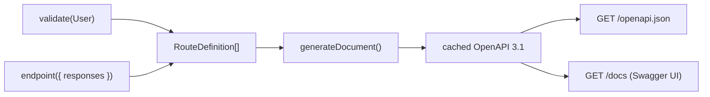

# @nextrush/openapi

> Zero-config OpenAPI 3.1 for NextRush. Your routes are already the spec — no decorators, no duplication.

**Support tier:** Public — middleware/registrar (stable). See [ADR-0005](../../../docs/adr/ADR-0005-package-tiers-sealed-surface-deprecation.md).

## The Problem

Most OpenAPI tooling makes you describe your data twice: once for runtime validation, once for the docs (`@ApiProperty()` on every field, hand-written JSON Schema, and so on). It drifts, it's tedious, and people stop maintaining it.

NextRush already knows your routes and their schemas. When you write `validate(User)`, the router records that `User` is the request body. `@nextrush/openapi` just **reads what's already there** and renders it — nothing to restate.

## How It Works

`@nextrush/openapi` is the first *renderer* of NextRush's Route Metadata System. The router collects a `RouteDefinition` for every route at registration (schemas contributed by `validate()`, docs by `endpoint()`); this plugin reads `router.getRoutes()`, converts schemas to JSON Schema, assembles an OpenAPI 3.1 document **once**, caches it, and serves it. The request hot path is never involved.



## Runtime Support

**Edge-safe.** Reads route metadata already collected by the router and serves JSON/HTML — zero
`node:` imports. Safe on Node, Bun, Deno, Cloudflare Workers, Vercel Edge, and Netlify Edge.

## Installation

```bash
pnpm add @nextrush/openapi
```

## Quickstart (5 minutes)

**1. Install**

```bash
pnpm add @nextrush/openapi
```

**2. Describe a route once** — `validate()` captures the request, `endpoint()` adds the docs:

```typescript
import { createApp, createRouter, endpoint, serve } from 'nextrush';
import { validate } from '@nextrush/validation';
import { openapi } from '@nextrush/openapi';
import { z } from 'zod';

const User = z.object({ name: z.string().min(1), email: z.string() });

const app = createApp();
const router = createRouter();

router.post('/users',
  validate(User),                                    // request body — captured automatically
  endpoint({ summary: 'Create a user', responses: { 201: User } }),
  (ctx) => { ctx.status = 201; ctx.json(ctx.body); },
);

app.route('/', router);
app.use(openapi({ router }));                         // GET /openapi.json + GET /docs
serve(app, { port: 3000 });
```

**3. Open the docs** — visit **http://localhost:3000/docs** for Swagger UI, or `GET /openapi.json` for the raw OpenAPI 3.1 document.

**4. See real schemas** — with **Zod 4**, `User` renders as a full JSON Schema in both the request body and the `201` response, and `validate()` still enforces it at runtime. The docs and the behavior can't drift, because they come from the same schema.

Done. A complete runnable version lives in [`examples/openapi-basic`](../../../examples/openapi-basic).

> `endpoint()` is re-exported from `nextrush`, so it sits right next to `createRouter` — no need to reach into `@nextrush/router`.

## Configuration

Every option is optional:

```typescript
app.use(openapi({
  router,                                       // required — the router to document
  info: { title: 'My API', version: '2.1.0' },  // default: { title: 'API', version: '1.0.0' }
  path: '/openapi.json',                         // spec route (default)
  docs: '/docs',                                 // UI route; false to disable
  exclude: ['/internal'],                        // omit path prefixes
  enabled: process.env.NODE_ENV !== 'production',// gate exposure (recommended for sensitive APIs)
  toJsonSchema: mySchemaConverter,               // override schema→JSON Schema conversion
}));
```

## What Gets Documented

| Source | Becomes |
| --- | --- |
| `validate(schema)` request body | `requestBody` (application/json) |
| `validate({ query })` | query `parameters` (decomposed from the schema's properties) |
| `validate({ params })` / path pattern | path `parameters` (`/users/:id` → `/users/{id}`) |
| `endpoint({ responses })` | `responses` by status code |
| `endpoint({ summary, description, tags, deprecated })` | operation metadata |
| `endpoint({ visibility: 'internal' })` | **omitted** from the spec |

Routes with no metadata still appear as untyped operations — nothing silently vanishes.

## Schema → JSON Schema

There is no universal Standard Schema → JSON Schema converter yet, so this package vendor-dispatches on the schema library:

- **Zod v4** (`z.toJSONSchema`), **Valibot** (`@valibot/to-json-schema`), **ArkType** (`.toJsonSchema`) — detected automatically, loaded only if present (optional peer dependencies, never bundled).
- **Any other library** — supply `toJsonSchema` in the options.
- **Unknown / not installed** — the schema renders as untyped (`{}`) rather than failing generation.

> **Zod note:** JSON Schema output requires **Zod 4** (`z.toJSONSchema`). Zod 3.24 implements Standard Schema (so `validate()` works) but has no JSON Schema converter — its schemas render untyped unless you pass `toJsonSchema`.

## Security

- **The spec exists only because you mounted it.** For sensitive deployments, gate it: `openapi({ router, enabled: process.env.NODE_ENV !== 'production' })`.
- **`endpoint({ visibility: 'internal' })`** keeps a route out of the spec entirely; `exclude` drops path prefixes without touching route code.
- The Swagger UI page loads assets from a CDN (`unpkg`) — self-host the bundle if your CSP disallows third-party scripts.

## Performance

Generation runs **once**, lazily, on the first request to `/openapi.json` (by which point all routes are registered — so plugin/route order never matters), then serves the cached document. Route dispatch never touches the generator or any metadata.

## Runtime Compatibility

Zero runtime dependencies. Runs anywhere NextRush runs — Node.js 22+, Bun, Deno, Cloudflare Workers, Vercel Edge.

## License

MIT © [Tanzim Hossain](https://github.com/0xTanzim)
