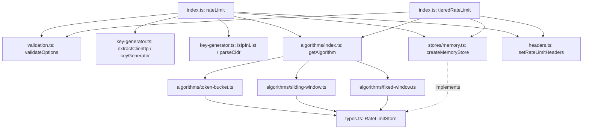
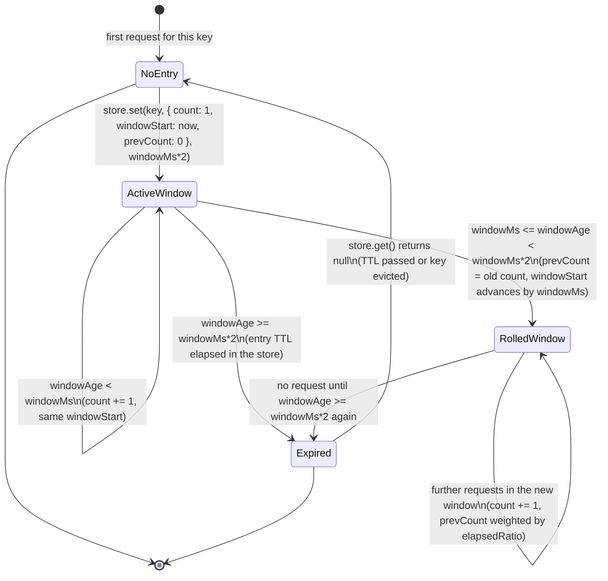
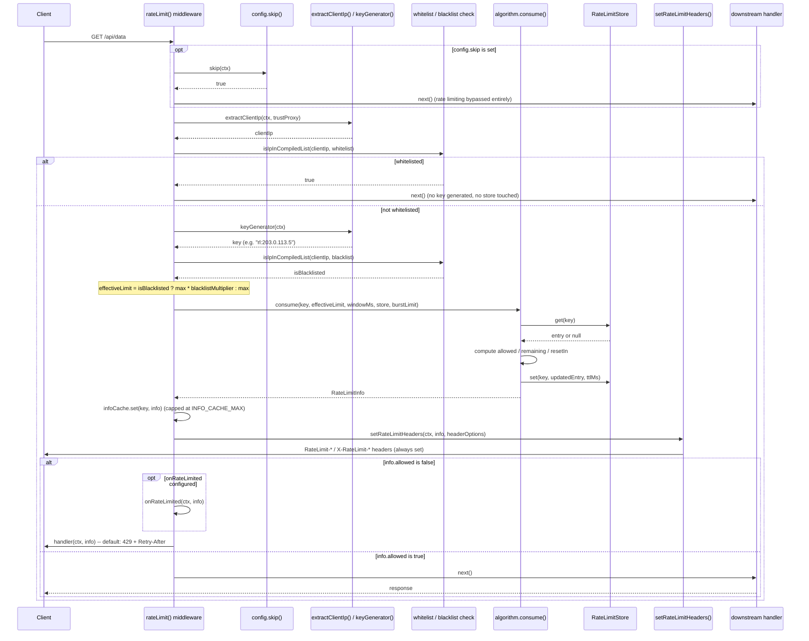

# @nextrush/rate-limit — Architecture

> Internal design of the algorithm/store separation, the per-request decision sequence, and the window-state lifecycle each of the three algorithms (token bucket, sliding window, fixed window) drives through a shared `RateLimitStore` interface.

## At a glance

|  |  |
| --- | --- |
| **Package** | `@nextrush/rate-limit` |
| **Layer** | `middleware` (above `types`; below nothing — a leaf middleware) |
| **Depends on** | `@nextrush/types` (types only, erased at build) — no third-party runtime deps |
| **Depended on by** | Application code that calls `app.use(rateLimit(...))` or `tieredRateLimit(...)`; not depended on by any other `@nextrush/*` package |
| **Public entry** | `src/index.ts` (barrel — also contains `rateLimit`/`tieredRateLimit` implementation, not exports-only; see Contributor notes) |
| **Internal modules** | 10 files (excl. tests) across `algorithms/`, `stores/`, `utils/` · ~750 LOC · largest `index.ts` ~460 LOC, `key-generator.ts` ~260 LOC |
| **On the request hot path?** | Yes — runs on every request once registered; key generation, list matching, and one algorithm `consume()` call happen per request |
| **Runtime coupling** | None — zero `node:` imports; the built-in store uses only `Map` and the standard `setInterval`/`clearInterval` |
| **State model** | Per-key state owned by the `RateLimitStore` (app-scoped, keyed by client identity); a small per-middleware `infoCache` for `getInfo()` lookups |

## Responsibilities

**This package owns:**

- **The three rate-limiting algorithms** — token bucket, sliding window, fixed window — each implementing the same `Algorithm` interface (`consume`, optional `peek`)
- **The `RateLimitStore` contract and its default implementation** — `MemoryStore`, a bounded, self-cleaning, single-process key-value store for algorithm state
- **Client identity resolution** — IP extraction (with proxy-header support), IPv4/IPv6 normalization, CIDR-aware allow/deny list matching
- **Rate-limit response headers** — both the IETF-draft `RateLimit-*` and legacy `X-RateLimit-*` families, plus `Retry-After`. The two families' `*Reset` fields are not the same value: `RateLimit-Reset` (draft) carries `resetIn` — delta-seconds until reset — while `X-RateLimit-Reset` (legacy) carries `resetTime` — an absolute Unix timestamp in seconds (`headers.ts`)
- **Tiered limiting** — resolving a per-request tier and applying that tier's own limit/window/algorithm instance

**This package does NOT own:**

- Distributed/shared state across server instances → the application, via a custom `RateLimitStore` implementation (this package ships only the single-process `MemoryStore`)
- Authentication or tier assignment itself → the application; `tieredRateLimit`'s `tierResolver` only reads state the app already computed (e.g. `ctx.state.user`)
- General HTTP security headers or CSRF protection → [`@nextrush/helmet`](../helmet), [`@nextrush/csrf`](../csrf)
- The middleware execution engine (`compose`, `ctx.next()`) → `@nextrush/core`

## Non-goals

The package intentionally does not:

- Bundle a Redis (or any other distributed) store — `RateLimitStore`'s JSDoc includes a worked Redis example specifically because implementing one is left to the integrator, not this package
- Account for request cost/weight (e.g. "this endpoint counts as 5 requests") — every `consume()` call counts as exactly one unit against the limit
- Provide sub-millisecond-accurate sliding windows — the sliding-window algorithm is a weighted-average approximation (see Lifecycle below), not a sorted-log of exact timestamps
- Rate-limit anything other than HTTP requests reaching this middleware — it has no visibility into WebSocket messages, background jobs, or upstream traffic

## Constraints

Must remain:

- **Runtime-independent** — zero `node:*` imports; `MemoryStore`'s cleanup timer uses the standard, cross-runtime `setInterval`
- **Zero third-party dependency** — a types-only dependency on `@nextrush/types`
- **ESM-only** — no CommonJS build
- **Fail-secure toward availability, not silently toward denial** — a configuration error throws at construction time (`validateOptions`), so a broken config is caught before it can either under-limit (security gap) or over-limit (availability gap) in production
- **Public API sealed** — the exported surface is semver-guarded (ADR-0005)

## Position in the package hierarchy

```mermaid
flowchart TB
    types["@nextrush/types"] --> errors["@nextrush/errors"] --> core["@nextrush/core"]
    core --> router["@nextrush/router"] --> runtime["@nextrush/runtime"] --> di["@nextrush/di"] --> class["@nextrush/class"]
    class --> adapters["adapter-node / bun / deno / edge"] --> middleware["middleware / extensions"]
    THIS["@nextrush/rate-limit — this package"]:::here
    middleware --> THIS
    classDef here fill:#2563eb,color:#fff,stroke:#1e40af;
```

> [!IMPORTANT]
> Imports flow **downward only**. `@nextrush/rate-limit` imports from `@nextrush/types` only, and
> MUST NOT be imported by `types`, `errors`, `core`, `router`, `class`, or any adapter
> (project-rules §1). It sits at the middleware layer as a leaf: nothing in the framework core
> depends on it — an application opts in by calling `app.use(rateLimit(...))`.

**Dependency rules:**
- **Allowed:** `rate-limit → types`
- **Forbidden:** `rate-limit → core / router / class / adapters / any other middleware package`

---

## Overview

The package separates **algorithm** (the accept/reject arithmetic for a single key) from **storage** (where that key's state lives) through the `Algorithm` and `RateLimitStore` interfaces. Every algorithm's `consume(key, limit, windowMs, store, burstLimit?)` method only ever reads and writes `StoreEntry` objects through the store — it has no knowledge of `Context`, HTTP, or IPs. This means swapping the default `MemoryStore` for a distributed backend (Redis, etc.) changes nothing about which algorithm decisions get made; it only changes where the `count`/`windowStart`/`tokens`/`prevCount` fields physically live.

`middleware.ts`'s logic (in `index.ts`) is the layer above both: it resolves *who* is making the request (`extractClientIp`, `keyGenerator`), decides *whether the algorithm should even be consulted* (skip function, whitelist), and *what happens on the outcome* (headers, the 429 handler, the `onRateLimited` callback). `tieredRateLimit` reuses every one of these pieces — it just resolves a tier name first and picks that tier's own algorithm/store/window instances instead of one global set.

Each algorithm is deliberately self-contained in its own file and documents its own trade-off in a doc comment at the top of the class — the fixed-window algorithm explicitly documents the boundary-burst weakness it accepts in exchange for simplicity, rather than hiding it.

### Design principles

1. **The algorithm never touches the store's TTL semantics directly.** Every algorithm calls `store.set(key, entry, ttlMs)` with an explicit `ttlMs` it computes itself (typically `windowMs * 2` for token-bucket/sliding-window, `windowMs` for fixed-window) — the store is a dumb key-value-with-expiry, not a scheduler.
2. **Configuration errors fail at construction, not at request time.** `validateOptions()`/`validateTieredOptions()` run synchronously inside `rateLimit()`/`tieredRateLimit()` before any middleware closure is created — an invalid `max`, `algorithm`, `statusCode`, or `blacklistMultiplier` throws immediately.
3. **Allow/deny lists are compiled once, not on every request.** `rateLimit()` parses `whitelist`/`blacklist` CIDR entries into `CompiledListEntry[]` at construction time (`RL-P2-03` in the source), so per-request matching is a plain iteration over pre-parsed structures rather than re-parsing CIDR strings on every request.
4. **Bounded memory is enforced, not assumed.** `MemoryStore` caps entries at `maxEntries` (default 100,000) with FIFO eviction, and the middleware's own `infoCache` caps at `INFO_CACHE_MAX` (10,000) with the same eviction strategy — both exist specifically to prevent unbounded growth from a high-cardinality key space (e.g. `keyGenerator` returning a unique value per request).
5. **Tiered stores/algorithms are deduplicated on cleanup.** `tieredRateLimit`'s `shutdown`/`reset` explicitly collect `tierStores.values()` into a `Set` before acting (`RL-P1-05` in the source) — if multiple tiers share one `store` instance (the default when no custom `store` is passed per tier), shutdown runs once per unique store, not once per tier.

---

## Module structure

```text
src/
├── index.ts              # rateLimit() / tieredRateLimit() factories + barrel exports (implementation, not exports-only)
├── types.ts               # RateLimitOptions, TieredRateLimitOptions, RateLimitStore, StoreEntry, Algorithm
├── constants.ts            # DEFAULT_ALGORITHM, DEFAULT_MAX, header names, PROXY_HEADERS, TIME_UNITS, CIDR/IPV4/IPV6 patterns
├── validation.ts           # validateOptions, validateTieredOptions, RateLimitValidationError
├── algorithms/
│   ├── index.ts            # algorithms map + getAlgorithm()
│   ├── token-bucket.ts     # TokenBucketAlgorithm (default)
│   ├── sliding-window.ts   # SlidingWindowAlgorithm
│   └── fixed-window.ts     # FixedWindowAlgorithm
├── stores/
│   ├── index.ts            # barrel for stores/
│   └── memory.ts           # MemoryStore + createMemoryStore()
└── utils/
    ├── index.ts             # barrel for utils/
    ├── key-generator.ts      # extractClientIp, normalizeIp, parseCidr, isIpInList, IPv4/IPv6 validation
    ├── headers.ts            # setRateLimitHeaders (RateLimit-* / X-RateLimit-* / Retry-After)
    └── parse-window.ts       # parseWindow, formatDuration
```

### Module responsibilities

| Module | Responsibility (the one thing it owns) |
| ------ | -------------------------------------- |
| `types.ts` | The public option/data contracts — no logic. |
| `constants.ts` | Every literal default, header name, and pattern, in one place. |
| `validation.ts` | Construction-time option validation and the thrown error type. |
| `algorithms/*.ts` | Each algorithm's `consume`/`peek` decision logic — reads/writes `StoreEntry` via the store interface only. |
| `stores/memory.ts` | The bounded, self-cleaning, single-process `RateLimitStore` implementation. |
| `utils/key-generator.ts` | Client-IP extraction/normalization and CIDR-aware list matching — no HTTP-response concerns. |
| `utils/headers.ts` | Translating a `RateLimitInfo` into response headers — no decision logic. `LEGACY_HEADERS.RESET` is set to `info.resetTime` (absolute Unix seconds); `STANDARD_HEADERS.RESET` is set to `info.resetIn` (delta seconds) — the two `*-Reset` headers are deliberately different units, not a naming inconsistency. |
| `utils/parse-window.ts` | Window-string parsing (`'1m'` → `60000`) and the reverse (formatting). |
| `index.ts` | Wires all of the above into `rateLimit()`/`tieredRateLimit()` and re-exports the public surface. |

## Component relationships



None of the three algorithm files import `RateLimitStore`'s concrete `MemoryStore` — only the `RateLimitStore` interface from `types.ts`. This is what lets `rateLimit({ store: myRedisStore })` swap the backend without touching algorithm code at all.

---

## Lifecycle

### Window/state lifecycle (state machine)

The states a single key's stored entry passes through — shown for the **sliding-window** algorithm, whose `windowAge` branching is the clearest three-state example; token-bucket and fixed-window follow the same Active/Rolled/Expired shape with their own refill/reset rules:



> [!NOTE]
> **Token bucket** replaces `RolledWindow`'s hard reset with continuous refill:
> `tokens = min(maxTokens, currentTokens + elapsed * refillRate)` — there is no discrete "roll to
> the next window" transition, only a smooth increase toward `maxTokens` over time. **Fixed
> window** replaces the weighted `RolledWindow` with an unconditional reset the instant
> `windowStart` (computed as `floor(now / windowMs) * windowMs`) changes — this is exactly the
> abruptness that produces its documented boundary-burst behavior, where a request at `windowMs -
> 1ms` and one at `windowMs + 1ms` are two independent, unrelated windows.

### Request decision (sequence)

How a single request flows through `rateLimit()`'s middleware, from arrival to either `next()` or a `429`:



The ordering a reader would otherwise get wrong: **rate-limit headers are set before the allowed/rejected branch, not only on success** — a 429 response still carries `RateLimit-Remaining: 0` and `Retry-After`, because `setRateLimitHeaders()` runs unconditionally right after `consume()` returns, and only the subsequent `if (!info.allowed)` branch decides whether the response body is the default handler's error or the downstream handler's normal output.

## State ownership

| Owner | State it owns | Scope |
| ----- | ------------- | ----- |
| `rateLimit()` closure | `config` (normalized options), `compiledWhitelist`/`compiledBlacklist`, `keyGenerator`, `handler` | app — computed once per `rateLimit(options)` call |
| `RateLimitStore` instance (default: `MemoryStore`) | Every key's `StoreEntry` (`count`, `windowStart`, `tokens`, `prevCount`, `lastUpdate`) | app — shared across all requests using that middleware instance |
| `infoCache` (`Map` inside the `rateLimit()` closure) | The most recent `RateLimitInfo` per key, for `getInfo()` lookups | app — bounded at `INFO_CACHE_MAX`, FIFO eviction |
| `tierStores` / `tierAlgorithms` / `tierWindowMs` (`tieredRateLimit()` closure) | One store/algorithm/window-ms triple per configured tier | app — computed once per `tieredRateLimit(options)` call |
| `Context` (owned by `core`) | Response headers, `ctx.status` | per request |

There is no per-request mutable state owned by this package beyond what the algorithm passes through the store — everything a request touches (`config`, `store`, `infoCache`) is app-scoped and shared, read-and-conditionally-written on each request.

## Data structures

```ts
// The shared state shape every algorithm reads/writes through the store (types.ts).
// Not every field is used by every algorithm -- each algorithm interprets the
// fields it needs and ignores the rest.
interface StoreEntry {
  count: number;          // request count (fixed/sliding) or tokens-consumed proxy (token-bucket)
  windowStart: number;     // ms timestamp the current window/bucket period began
  lastUpdate?: number;      // token-bucket only: last refill computation timestamp
  tokens?: number;          // token-bucket only: tokens currently available
  prevCount?: number;       // sliding-window only: the previous window's final count
}

// The contract every store (built-in or custom) must satisfy (types.ts).
interface RateLimitStore {
  get(key: string): Promise<StoreEntry | null>;
  set(key: string, entry: StoreEntry, ttlMs: number): Promise<void>;
  increment(key: string, ttlMs: number): Promise<number>;
  decrement?(key: string): Promise<void>;
  reset(key: string): Promise<void>;
  cleanup?(): Promise<void>;
  shutdown?(): Promise<void>;
}
```

`StoreEntry` is deliberately one shape shared by all three algorithms rather than three separate per-algorithm types — this keeps `RateLimitStore` a single, simple interface a custom backend only needs to implement once, at the cost of each algorithm only touching the subset of fields relevant to it (a minor readability trade-off documented in the Engineering decisions table below).

## Concurrency & edge behaviour

- **Shared, mutable, app-scoped:** the `RateLimitStore` instance and its underlying data (a `Map` for `MemoryStore`) — every request for the same key reads and writes the same entry. Node's single-threaded event loop makes the `get()`-then-`set()` sequence inside each algorithm's `consume()` safe from interleaving *within* a single synchronous stretch, but because both calls are `async` (a `Promise`-returning interface, even though `MemoryStore`'s implementation resolves synchronously), a custom I/O-bound store could interleave two concurrent requests' get/consume/set sequences for the same key.
- **Per-request, never shared:** the `RateLimitInfo` object returned by `consume()`, and the `clientIp`/`key` computed for that request.
- **Idempotency:** none by design — every allowed request necessarily mutates the stored count/tokens; there is no dedicated idempotency-key mechanism. A client retrying an already-successful request consumes another unit of its limit.
- **Cleanup/shutdown:** `MemoryStore.shutdown()` clears its cleanup `setInterval` and its `Map`; `rateLimitMiddleware.shutdown()` calls through to the store's `shutdown()` (if present) and clears `infoCache`. `tieredRateLimit`'s `shutdown()` deduplicates shared store instances before calling `shutdown()` on each, so a store shared across three tiers is not shut down three times.

> [!WARNING]
> `MemoryStore`'s cleanup timer is created with `.unref()` when available, so it does not keep the
> Node process alive on its own — but a contributor forgetting to call `shutdown()` in a
> short-lived process (a serverless invocation, a test suite) leaves the timer running for the
> process's remaining lifetime otherwise, which is exactly why `RateLimitMiddleware.shutdown()` is
> part of the sealed public surface rather than an internal-only detail.

## Trust boundaries

```text
Client-supplied headers (X-Forwarded-For, CF-Connecting-IP, etc.) -- fully attacker-controlled
   │
   ▼
extractClientIp()  -- only consulted if trustProxy: true                <- this package's first boundary
   │
   ▼
normalizeIp() / isValidIp()  -- format validation before use as a key   <- rejects malformed values
   │
   ▼
keyGenerator() result used as the store key                              <- the identity the limit is tracked against
   │
   ▼
algorithm.consume()  -- the actual allow/deny decision
```

The package treats every proxy header as fully attacker-controllable input, which is why `trustProxy` defaults to `false` and is explicitly flagged security-sensitive in the Options table — enabling it without a genuinely trusted proxy in front of the application lets a client set an arbitrary `X-Forwarded-For` value and evade its real rate limit entirely (or attribute traffic to a different key and rate-limit an innocent party). `whitelist`/`blacklist` entries are trusted configuration, not request input — they are parsed once at construction and never re-derived from anything request-supplied.

## Extension points

**Supported extension points:**

- **`store`** — the sanctioned way to move state to a distributed backend; any object satisfying `RateLimitStore` works, with the interface's own JSDoc providing a worked Redis example.
- **`keyGenerator`** — the sanctioned way to rate-limit by something other than IP (API key, user ID, tenant ID).
- **`handler` / `onRateLimited`** — the sanctioned way to customize the rejection response or add logging/metrics without touching the decision logic.
- **The exported algorithm/utility primitives** (`getAlgorithm`, `extractClientIp`, `parseCidr`, `setRateLimitHeaders`, etc.) — exposed specifically so advanced integrations can build a custom middleware shape without re-implementing the internals.

**Forbidden (sealed):**

- **Each algorithm's core arithmetic** (`consume`/`peek` bodies) — changing the token-bucket refill formula, the sliding-window weighting formula, or the fixed-window boundary calculation changes the security/availability guarantees documented for that algorithm; RFC-gated.
- **The `StoreEntry` field shape** — a custom store implementation is written against the current fields; changing them breaks every external store implementation silently.
- **`MemoryStore`'s bounded-entries DoS guard** — removing or weakening the `maxEntries` cap reintroduces unbounded memory growth from a high-cardinality key space.

---

## Architectural invariants

These are part of the package's architecture. They do not change without an RFC:

- **`algorithm` defaults to `'token-bucket'`** — burst-tolerant behavior is the out-of-the-box posture, not a stricter default.
- **`trustProxy` defaults to `false`** — proxy headers are never trusted for identity resolution unless explicitly opted into.
- **Configuration is validated synchronously at construction, never lazily on the first request** — an invalid `max`, `algorithm`, `statusCode`, `blacklistMultiplier`, or tier config throws before the middleware is ever registered.
- **The built-in `MemoryStore` is bounded** — `maxEntries` (default 100,000) with FIFO eviction; it never grows without limit regardless of key cardinality.
- **A blacklisted client is rate-limited more strictly, never blocked outright by this package** — `blacklistMultiplier` scales `max` down; it does not short-circuit to an automatic reject.
- **The `RateLimitStore` interface is the only sanctioned integration point for distributed state** — no algorithm ever reaches for a runtime-specific storage API directly.
- **The package imports no runtime API** — zero `node:*` imports; the same code path runs identically on Node, Bun, Deno, and Edge runtimes.

## Engineering decisions

| Decision | Chosen | Trade-off accepted | Reference |
| -------- | ------ | ------------------ | --------- |
| Default algorithm | Token bucket | Burst-tolerant by default, which is a looser posture than sliding-window for boundary-sensitive use cases; the app must opt into stricter behavior | `constants.ts` (`DEFAULT_ALGORITHM`) |
| Distributed store | Interface only, no bundled Redis implementation | Keeps the package zero-dependency and runtime-agnostic, at the cost of every multi-instance deployment needing its own store implementation | `types.ts` (`RateLimitStore`) |
| Shared `StoreEntry` shape across algorithms | One type with optional per-algorithm fields | A single, simple store interface to implement once, versus a slightly less self-documenting per-algorithm type | `types.ts` |
| Sliding window accuracy | Weighted-average approximation (previous-window count scaled by elapsed ratio), not a timestamp log | O(1) storage and computation per key, versus perfect per-timestamp accuracy a sorted log would give | `algorithms/sliding-window.ts` |
| Blacklist behavior | Reduced limit (`blacklistMultiplier`), not an outright block | Lets an operator throttle suspicious traffic without a hard cutoff that could be a false positive | `index.ts` |
| Allow/deny list matching | Precompiled once at construction (`RL-P2-03`) | Faster per-request check, at the cost of not being able to add entries to a running middleware instance without reconstructing it | `index.ts` |
| `infoCache` bound | Capped at `INFO_CACHE_MAX` (10,000), FIFO eviction | `getInfo()` on an evicted key falls back to `algorithm.peek()` (if defined) rather than always being cache-accurate | `index.ts` |

## Rejected alternatives

### Bundling a Redis store implementation
Rejected: bundling a Redis client as a dependency would violate the package's zero-third-party-dependency constraint and force every consumer to accept that dependency even when using only the in-memory store. A documented interface with a JSDoc example was chosen instead, leaving the actual client library choice (`ioredis`, `redis`, or another) to the integrator.

### Sorted-timestamp log for sliding-window accuracy
Rejected: storing every individual request timestamp within the current and previous window would give exact sliding-window accuracy, but storage grows with request volume per key rather than staying O(1) — a significant cost at scale. The weighted-average approximation (`prevCount * (1 - elapsedRatio) + currentCount`) was chosen for its constant per-key storage footprint, accepting a small accuracy trade-off at window transitions.

### Hard-blocking blacklisted IPs instead of reducing their limit
Rejected: an outright block on a blacklist match removes an operator's ability to recover from a false-positive blacklist entry gracefully — a reduced limit (`blacklistMultiplier`) still lets legitimate-but-flagged traffic through at a throttled rate while signaling something is off, rather than a hard failure mode.

---

## Testing strategy

- **Unit:** each algorithm's `consume`/`peek` behavior across window-boundary transitions (fresh key, mid-window, window rollover, TTL expiry); `MemoryStore`'s eviction, cleanup, and TTL expiry; IP normalization/validation and CIDR matching for both IPv4 and IPv6, including IPv4-mapped IPv6.
- **Integration:** the full `rateLimit()` and `tieredRateLimit()` middleware against simulated `Context` objects, covering whitelist/blacklist precedence, header output for every header-family combination, and the `reset`/`getInfo`/`shutdown` surface (including the fixed-window key-suffix special case in `reset`, `RL-P1-04`).
- **Public-surface test:** an exported-API-shape test asserts the sealed surface stays in sync (ADR-0005).
- **Conformance / cross-adapter parity:** N/A directly — the package uses no runtime API; identical behavior across adapters follows from having zero `node:` imports, verified indirectly by `packages/adapters/conformance`.
- **Coverage:** >=90% lines/functions (CI-enforced).

## Evolution strategy

- **Stable (semver-guarded):** the sealed public surface — `rateLimit()`, `tieredRateLimit()`, `MemoryStore`, the algorithm exports, the utility primitives, and every type in `types.ts` (ADR-0005).
- **May change without notice:** `MemoryStore`'s internal eviction bookkeeping, the exact `infoCache` data structure.
- **Changes only via RFC:** each algorithm's core arithmetic, the `StoreEntry` field shape, the `RateLimitStore` interface contract, and the `trustProxy`/`algorithm` defaults.

**Timeline:** 1.0 — initial release with all three algorithms, tiered limiting, CIDR-aware allow/deny lists, and the bounded in-memory store.

## Contributor notes

Before changing this package, read: each algorithm file's own doc comment (they document their trade-off explicitly), the `RL-P1-*`/`RL-P2-*` inline comments in `index.ts` (each marks a specific hardening fix — infoCache bound, fixed-window reset key, deduplicated tier shutdown, precompiled lists), and the `RateLimitStore` JSDoc's Redis example before implementing a custom store. Note also that `src/index.ts` currently holds both the `rateLimit`/`tieredRateLimit` implementation and the barrel re-exports (~460 LOC, over the package's usual 300-line target) rather than being exports-only per the standard package layout — splitting the two factories into their own files behind a thinner barrel is a reasonable non-breaking refactor, not an architectural change.

## Architecture checklist

Before changing this package, confirm:

- [ ] Does this preserve the architectural invariants above (especially the default algorithm and `trustProxy` default)?
- [ ] Does this increase coupling or cross a dependency rule (`rate-limit → types` only)?
- [ ] Does this affect the request hot path (allocations/store calls in `consume`)?
- [ ] Does this change the sealed public API (semver / ADR-0005)? Does it need an RFC?
- [ ] If this touches an algorithm's arithmetic or the `StoreEntry` shape, does it preserve backward compatibility for existing custom store implementations?

---

## References & see also

- **README (how to use it):** [`./README.md`](./README.md)
- **ADR:** [`ADR-0005 — package tiers & sealed surface`](https://github.com/0xTanzim/nextRush/blob/main/docs/adr/ADR-0005-package-tiers-sealed-surface-deprecation.md)
- **Security boundary reference:** `.kiro/steering/project-rules.instructions.md` §4 (rate limiting available and documented for public endpoints)
- **Documentation site:** [nextRush docs](https://0xtanzim.github.io/nextRush/docs)
- **Repository:** [`packages/middleware/rate-limit`](https://github.com/0xTanzim/nextRush/tree/main/packages/middleware/rate-limit)
