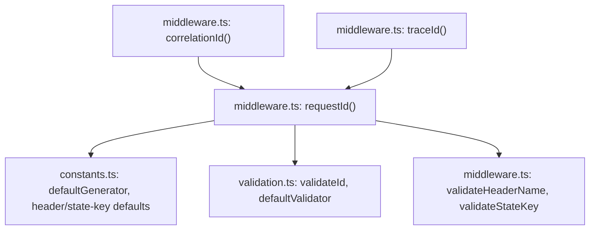

# @nextrush/request-id — Architecture

> Internal design of the request-ID middleware — how an ID is resolved (incoming vs. generated), where each security validation runs, and how the same building block produces three independently-configured header/state-key variants.

## At a glance

|  |  |
| --- | --- |
| **Package** | `@nextrush/request-id` |
| **Layer** | `middleware` (above `types`; below nothing — a leaf middleware) |
| **Depends on** | `@nextrush/types` (types only, erased at build) — no other runtime dependency |
| **Depended on by** | Application code that calls `app.use(requestId())` / `correlationId()` / `traceId()`; not depended on by any other `@nextrush/*` package |
| **Public entry** | `src/index.ts` (barrel — exports only, no implementation) |
| **Internal modules** | 5 files · 605 LOC total · largest `middleware.ts` at 236 LOC (under the 300-line middleware cap) |
| **On the request hot path?** | Yes — runs once per request when mounted; ID resolution happens before `ctx.next()` |
| **Runtime coupling** | None — uses only the global `crypto.randomUUID()` (Web-standard), never `node:crypto` |
| **State model** | Stateless at the package level; no state is retained between requests — each request resolves its own ID independently |

## Responsibilities

**This package owns:**

- ✓ Resolving one ID per request — either a validated incoming ID or a freshly generated one
- ✓ Generating IDs via the global `crypto.randomUUID()`, with a clear capability error if that global is absent and no custom generator was supplied
- ✓ Validating any client-supplied incoming ID (length, safe characters, format) before it is ever trusted
- ✓ Validating the `header` and `stateKey` configuration values themselves, once, at middleware-creation time
- ✓ Providing three fixed-configuration variants (`requestId`, `correlationId`, `traceId`) built from the same underlying middleware

**This package does NOT own:**

- ✗ Forwarding the ID to downstream HTTP calls → the application's own handler code does this (see the README's Common tasks)
- ✗ Structured logging or attaching a logger to `ctx` → [`@nextrush/logger`](../logger)
- ✗ Response-time measurement → [`@nextrush/timer`](../timer)
- ✗ The middleware execution engine (`compose`, `ctx.next()`) → `@nextrush/core`

## Non-goals

The package intentionally does not:

- Reject a request outright when an incoming ID fails validation — an invalid incoming ID silently falls through to generating a fresh one, rather than returning an error response, so a malformed upstream header never breaks the request
- Implement distributed-tracing propagation (e.g. W3C Trace Context `traceparent` headers) — `traceId()` provides a single custom header (`X-Trace-Id`) for applications that want a trace-correlatable identifier, not a spec-compliant tracing propagation format
- Cache or persist IDs across requests — every request is resolved independently; there is no shared, mutable state a contributor could introduce a race condition into

## Constraints

Must remain:

- **Runtime-independent** — zero `node:*` imports; the sole ID-generation primitive is the global `crypto.randomUUID()`, deliberately chosen over `node:crypto`'s `randomUUID` so this middleware needs no adapter to run on Node, Bun, Deno, or edge runtimes (see the design note in `constants.ts`)
- **Secure by default** — `trustIncoming` defaults to `false`; incoming IDs, custom-generator output, and configuration values (`header`, `stateKey`) are all validated before use
- **ESM-only** — no CommonJS build
- **Public API sealed** — the exported surface is locked by `__tests__/public-surface.test.ts`

## Position in the package hierarchy

```mermaid
flowchart TB
    types["@nextrush/types"] --> errors["@nextrush/errors"] --> core["@nextrush/core"]
    core --> router["@nextrush/router"] --> runtime["@nextrush/runtime"] --> di["@nextrush/di"] --> class["@nextrush/class"]
    class --> adapters["adapter-node / bun / deno / edge"] --> middleware["middleware / extensions"]
    THIS["@nextrush/request-id — this package"]:::here
    middleware --> THIS
    classDef here fill:#2563eb,color:#fff,stroke:#1e40af;
```

> [!IMPORTANT]
> Imports flow **downward only**. `@nextrush/request-id` imports only from `@nextrush/types` and
> MUST NOT be imported by `types`, `errors`, `core`, `router`, `class`, or any adapter
> (project-rules §1).

**Dependency rules:**
- **Allowed:** `request-id → types`
- **Forbidden:** `request-id → core / router / class / adapters / any other middleware package`

---

## Overview

`@nextrush/request-id` resolves exactly one identifier per request and makes it available in two places: `ctx.state[stateKey]` for handler code, and the response header (unless `exposeHeader` is `false`). The organizing idea is that ID resolution is a single decision — trust the incoming header, or generate a new one — made once per request before anything downstream runs, with every input to that decision (the incoming header value, a custom generator's output, the `header`/`stateKey` configuration itself) validated at the point it enters the system rather than trusted implicitly.

The three exported middleware factories (`requestId`, `correlationId`, `traceId`) are not three separate implementations: `correlationId()` and `traceId()` are thin wrappers that call `requestId()` internally with `header`/`stateKey` fixed to their respective constants (`CORRELATION_HEADER`/`CORRELATION_STATE_KEY` and `TRACE_HEADER`/`TRACE_STATE_KEY`), while forwarding every other option unchanged. This means a security or behavioral improvement to `requestId()`'s resolution logic automatically applies to all three variants — there is exactly one code path to review or fix.

### Design principles

1. **No client-supplied value is trusted without validation.** Enforced structurally: `trustIncoming` defaults to `false`, and even when `true`, an incoming header value must pass `validateId()` (length + safe-character check) and the configured `validator` (UUID v4 format by default) before `middleware.ts` assigns it to `id`.
2. **Configuration is validated once, not per-request.** `validateHeaderName(header)` and `validateStateKey(stateKey)` run synchronously inside `requestId()` itself — at the point the middleware is created (typically at app startup) — not inside the returned per-request function, so a misconfiguration fails immediately and loudly rather than on the first live request.
3. **A failure never produces an unsafe or missing ID.** If `trustIncoming` validation fails, the code falls through to generation. If the configured `generator` produces output that fails `validateId()`, the code falls back to `defaultGenerator()` rather than propagating the unsafe value (`middleware.ts`, the `if (!validateId(generated, maxLength))` branch). There is no path where `id` remains `undefined` by the time it reaches `ctx.state`.
4. **The capability check for the default generator is explicit, not incidental.** `requestId()` checks `typeof globalThis.crypto?.randomUUID !== 'function'` once at creation time, but only when the caller is using the default generator (`generator === defaultGenerator`) — a caller who has already supplied their own `generator` is never blocked by an environment lacking `crypto.randomUUID`.

---

## Module structure

```text
src/
├── index.ts        # Public API exports (barrel only, no implementation)
├── constants.ts     # Header names, state keys, DEFAULT_MAX_LENGTH, defaultGenerator
├── types.ts          # RequestIdOptions, IdGenerator, IdValidator, RequestIdContext, variant option types
├── validation.ts     # UUID/safe-character/length checks, validateId, createValidator
├── middleware.ts      # requestId() / correlationId() / traceId() — the actual middleware logic
└── __tests__/
    ├── request-id.test.ts       # Behavioral tests for all three middleware factories
    └── public-surface.test.ts    # Locks the exported surface shape (ADR-0005)
```

### Module responsibilities

| Module | Responsibility (the one thing it owns) |
| ------ | -------------------------------------- |
| `constants.ts` | Default header names, state keys, `DEFAULT_MAX_LENGTH`, and `defaultGenerator` (the `crypto.randomUUID()` wrapper). |
| `types.ts` | All exported type shapes: `RequestIdOptions` and the two variant option types derived from it via `Omit`. |
| `validation.ts` | The pure validation functions (`isValidUuid`, `isSafeId`, `isValidLength`, `validateId`) and the two exported validator constants (`defaultValidator`, `permissiveValidator`). |
| `middleware.ts` | The three middleware factories, the internal `validateHeaderName`/`validateStateKey` config guards, and the ID-resolution logic itself. |

## Component relationships



`correlationId()` and `traceId()` do not duplicate any resolution logic — both call `requestId()` directly with a fixed `header`/`stateKey` pair, so `RequestId` in the diagram above is the single place all three variants' request-time behavior lives.

---

## Lifecycle

### Generate → attach → propagate sequence

The path a single request takes through `requestId()`, from reading the incoming header to the response being sent, including every validation decision:

```mermaid
sequenceDiagram
    participant Client
    participant MW as requestId() middleware
    participant Val as validation.ts
    participant Gen as constants.ts: defaultGenerator
    participant Handler as downstream handler

    Note over MW: One-time, at middleware creation (app startup):\nvalidateHeaderName(header); validateStateKey(stateKey);\ncapability check for crypto.randomUUID if using defaultGenerator

    Client->>MW: GET /users (X-Request-Id: <value>, or absent)

    alt trustIncoming is true and header present
        MW->>Val: validateId(incoming, maxLength) && validator(incoming)
        alt incoming passes both checks
            Val-->>MW: valid
            MW->>MW: id = incoming
        else incoming fails either check
            Val-->>MW: invalid
            Note over MW: falls through to generation below -- no error response
        end
    end

    opt id still unresolved
        MW->>Gen: generated = generator()
        Gen-->>MW: candidate string
        MW->>Val: validateId(generated, maxLength)
        alt candidate passes
            Val-->>MW: valid
            MW->>MW: id = generated
        else candidate fails (custom generator produced unsafe output)
            Val-->>MW: invalid
            MW->>Gen: id = defaultGenerator() (fallback, always crypto.randomUUID())
        end
    end

    MW->>MW: ctx.state[stateKey] = id

    opt exposeHeader is true (default)
        MW->>Client: ctx.set(header, id) -- response header written now, before next()
    end

    MW->>Handler: await ctx.next()
    Handler-->>MW: resolves (handler may read ctx.state[stateKey] and forward it downstream itself)
    MW-->>Client: response sent
```

The fact a reader would otherwise miss: **the response header is set before `ctx.next()` runs**, not after — so even if a downstream handler throws, the response header (if one is ever sent by error-handling middleware further up the chain) was already assigned the resolved ID. This package does not forward the ID to any downstream HTTP call itself; that is application code, shown in the README's Common tasks.

## State ownership

| Owner | State it owns | Scope |
| ----- | -------------- | ----- |
| `middleware.ts` closure (`header`, `stateKey`, `trustIncoming`, etc.) | The resolved configuration for one `app.use(requestId(options))` call | app (one closure per middleware registration, shared read-only across all requests it handles) |
| `ctx.state[stateKey]` (owned by `Context`, written by this middleware) | The resolved ID for the current request | per request |
| — | No package-level or process-level mutable state exists | N/A — this package has none |

## Concurrency & edge behaviour

- **Shared, immutable after construction:** the configuration closure (`header`, `generator`, `trustIncoming`, `validator`, `maxLength`, `stateKey`, `exposeHeader`) — resolved once when `requestId()` is called, then read-only for the lifetime of the app.
- **Per-request, never shared:** the resolved `id` value and the `ctx.state[stateKey]` assignment — each request computes its own independently, with no shared counter, cache, or map that concurrent requests could race on.
- **Idempotency:** resolving an ID has no side effect beyond the current request's own `ctx.state`/response header — calling the middleware twice for the same request (which does not happen in normal use) would simply overwrite `ctx.state[stateKey]` with a second independently-resolved value, not corrupt shared state.
- **Client disconnect / abort:** the middleware has no explicit `AbortSignal` handling — ID resolution and header assignment both happen synchronously before `await ctx.next()`, so a disconnect during downstream handler execution does not affect this middleware's own (already-completed) work.

> [!WARNING]
> An incoming ID that fails validation is **silently replaced**, not rejected with an error
> response (Non-goals). A caller who needs to detect and alert on malformed upstream IDs must add
> that check separately — this middleware does not surface a signal that the incoming value was
> discarded.

## Trust boundaries

```text
Client-supplied header (X-Request-Id / X-Correlation-Id / X-Trace-Id)
   │
   ▼
requestId() middleware -- trustIncoming check (default: false, incoming ignored entirely)
   │
   ▼
validation.ts: validateId() (length 1-128, safe-character pattern)          <- first boundary
   │            + configured validator (UUID v4 format, by default)         <- second boundary
   ▼
accepted as `id`, or discarded and regenerated via defaultGenerator()/custom generator
   │
   ▼
ctx.state[stateKey] = id ; ctx.set(header, id)                              <- only validated values reach here
```

Configuration values (`header`, `stateKey`) cross a separate, narrower trust boundary at
middleware-creation time: `validateHeaderName()` enforces the HTTP token grammar, and
`validateStateKey()` rejects `__proto__`/`prototype`/`constructor` to prevent prototype pollution
via a caller-supplied state key. Both are one-time checks against values the *application
developer* controls, not per-request client input.

## Extension points

**Supported extension points:**

- **`generator`** — the sanctioned way to change the ID format (e.g. ULIDs, sequential IDs). Output is still validated before use; unsafe output falls back to `defaultGenerator()`.
- **`validator`** — the sanctioned way to accept a non-UUID incoming-ID format when `trustIncoming` is `true` (e.g. `permissiveValidator` for any safe-character ID).
- **`header` / `stateKey`** — freely configurable per call, validated once at creation time.

**Forbidden (sealed):**

- **Bypassing `validateId()` for incoming or generated values** — see Design principle 3; any change that lets an unvalidated string reach `ctx.state`/the response header reopens the header-injection and prototype-pollution risks this package exists to close.
- **Making `trustIncoming` default to `true`** — would flip the package from secure-by-default to trusting arbitrary client input by default, a breaking security-posture change requiring an RFC.

---

## Architectural invariants

The following are part of the package architecture. They do not change without an RFC:

- **`trustIncoming` defaults to `false`.** A request ID is generated fresh unless the application explicitly opts in to trusting incoming values.
- **No unvalidated string ever reaches `ctx.state` or the response header** — incoming values, custom-generator output, and configuration values are all validated before use.
- **A validation failure never produces an error response** — it falls through to generating a new, valid ID.
- **`correlationId()` and `traceId()` share `requestId()`'s resolution logic** — they are configuration wrappers, not independent implementations.
- **The public API is explicit and sealed** — locked by `__tests__/public-surface.test.ts` (ADR-0005).

## Engineering decisions

| Decision | Chosen | Trade-off accepted | Reference |
| -------- | ------ | ------------------- | --------- |
| ID-generation primitive | The global `crypto.randomUUID()`, not `node:crypto` | This package cannot use Node-specific crypto APIs even where they might offer more options, in exchange for zero adapter code and identical behavior on Node, Bun, Deno, and edge runtimes | `constants.ts` (design note above `defaultGenerator`) |
| Invalid incoming ID handling | Silently regenerate, not reject the request | An application cannot distinguish "no header sent" from "an invalid header was sent and replaced" without its own logging, in exchange for a malformed upstream header never breaking a request | `middleware.ts` (`trustIncoming` block) |
| Variant implementation | `correlationId()`/`traceId()` call `requestId()` internally | Slightly less direct than three independent implementations, in exchange for one resolution code path to secure and maintain | `middleware.ts` |
| Config validation timing | At middleware-creation time, not per-request | A misconfigured `header`/`stateKey` fails at app startup rather than being silently wrong for every request, at the (negligible) cost of two extra function calls when the middleware is constructed | `middleware.ts` (`validateHeaderName`, `validateStateKey`) |

## Rejected alternatives

### Rejecting the request with an error when an incoming ID fails validation
Rejected: a malformed or oversized ID from a misconfigured upstream proxy would then break every request passing through it, for a header whose only purpose is observability, not authorization or correctness. Silently regenerating was chosen instead, accepting that an application cannot distinguish "no incoming ID" from "a rejected incoming ID" without adding its own check.

### Making `correlationId()` and `traceId()` fully independent implementations
Rejected: would duplicate the entire resolution/validation logic three times, and a future security fix to that logic would need to be applied and tested in three places instead of one. Delegating to `requestId()` was chosen instead, accepting a small amount of indirection (reading `correlationId()`'s body means following one more call) for a single source of truth.

---

## Testing strategy

- **Unit:** `request-id.test.ts` covers constants, all four validation functions (`isValidUuid`, `isSafeId`, `isValidLength`, `validateId`), `createValidator`, and `permissiveValidator` independently of the middleware.
- **Integration:** the same suite exercises `requestId()`/`correlationId()`/`traceId()` against a mock `Context` shaped like NextRush's real `Context` (a `Map`-backed `get`/`set`/`state`/`next`), covering incoming-ID trust/rejection paths, custom generators, and header/state-key validation failures at creation time.
- **Invariant tests:** the "unsafe generator output falls back to `defaultGenerator()`" and "invalid incoming ID silently regenerates" guarantees are each covered by a dedicated case.
- **Public-surface test:** `__tests__/public-surface.test.ts` locks the exported runtime/type-only API shape (ADR-0005).
- **Conformance / cross-adapter parity:** N/A directly — this package has no runtime-specific code; the global `crypto.randomUUID()` behaves identically across the runtimes it supports.
- **Coverage:** >=90% lines/functions (CI-enforced).

## Evolution strategy

- **Stable (semver-guarded):** `requestId`, `correlationId`, `traceId`, all constants, all validation functions/constants, and the exported types (ADR-0005).
- **May change without notice:** the internal config guards (`validateHeaderName`, `validateStateKey`, `HEADER_TOKEN_PATTERN`, `DANGEROUS_KEYS`) — not exported, free to change shape.
- **Changes only via RFC:** the "secure by default" invariants above, and the shared-resolution-logic relationship between the three middleware variants.

**Timeline:** 1.0 — initial release with `requestId()`/`correlationId()`/`traceId()`, secure-by-default incoming-ID handling, and Web-standard `crypto.randomUUID()` generation.

## Contributor notes

Before changing this package, read `constants.ts`'s design note on why `crypto.randomUUID()` was
chosen over `node:crypto`'s `randomUUID` — it is the one runtime-API decision in the package, and
reversing it would make an otherwise edge-safe middleware Node-only for no behavioral difference.
Any change to the incoming-ID validation logic in `middleware.ts`/`validation.ts` should be treated
as security-sensitive: the whole point of `trustIncoming`'s default and the length/safe-character
checks is to prevent header-injection and overflow attacks from client-supplied input.

## Architecture checklist

Before changing this package, confirm:

- [ ] Does this preserve the architectural invariants above (especially secure-by-default incoming-ID handling)?
- [ ] Does this increase coupling or cross a dependency rule (`request-id → types` only)?
- [ ] Does this affect the request hot path (ID resolution before `ctx.next()`)?
- [ ] Does this change the sealed public API (semver / ADR-0005)? Does it need an RFC?
- [ ] If this touches validation logic, does it preserve "no unvalidated value ever reaches `ctx.state` or the response header"?

---

## References & see also

- **README (how to use it):** [`./README.md`](./README.md)
- **ADR:** [`ADR-0005 — package tiers & sealed surface`](https://github.com/0xTanzim/nextRush/blob/main/docs/adr/ADR-0005-package-tiers-sealed-surface-deprecation.md)
- **Security boundary reference:** `.kiro/steering/project-rules.instructions.md` §4 (header handling, no header-injection vectors)
- **Related package:** [`@nextrush/logger`](../logger) — shares the same default header name (`x-request-id`) for correlating log lines
- **Documentation site:** [nextRush docs](https://0xtanzim.github.io/nextRush/docs)
- **Repository:** [`packages/middleware/request-id`](https://github.com/0xTanzim/nextRush/tree/main/packages/middleware/request-id)
