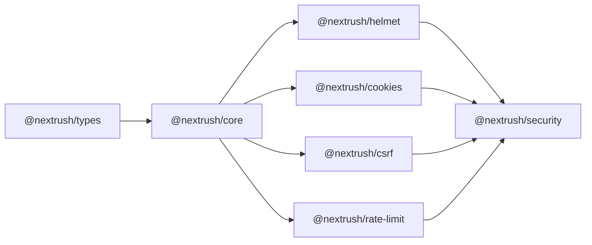
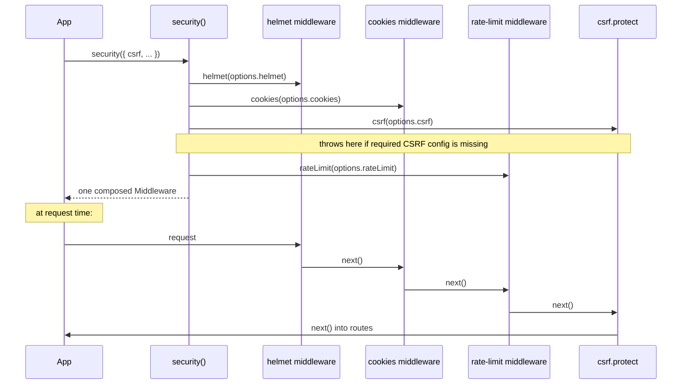

# @nextrush/security — Architecture

> The internal composition rules for the `security()` composite preset — why the layer order is
> fixed, why every layer builds eagerly, and what this package deliberately does not own.

## At a glance

|  |  |
| --- | --- |
| **Package** | `@nextrush/security` |
| **Layer** | `middleware` (composite — composes other middleware packages, adds no protocol logic of its own) |
| **Depends on** | `@nextrush/{core,cookies,csrf,helmet,rate-limit,types}` |
| **Depended on by** | Applications only — no other NextRush package depends on `@nextrush/security` |
| **Public entry** | `src/index.ts` (barrel — exports only) |
| **Internal modules** | 1 file (`security.ts`), ~65 LOC |
| **On the request hot path?** | Yes — indirectly, via the four composed middleware it wraps |
| **Runtime coupling** | None of its own; inherits whatever coupling each composed layer has |
| **State model** | Stateless — `security()` builds each layer once at call time; no per-request state of its own |

## Responsibilities

**This package owns:**
- ✓ The fixed composition order of helmet → cookies → rate limit → CSRF
- ✓ Eager construction — building every layer at `security()` call time so a missing required
  option (CSRF's) throws at construction, not on the first request

**This package does NOT own:**
- ✗ Any individual layer's security logic — owned by `@nextrush/helmet`, `@nextrush/cookies`,
  `@nextrush/csrf`, `@nextrush/rate-limit` respectively
- ✗ The boot-time production security audit (`proxy: true`, `dotfiles: 'allow'`, etc.) — owned by
  `@nextrush/core`'s `Application.ready()`, which each composed layer feeds via the
  `SECURITY_AUDIT` contribution symbol (`@nextrush/types`)

## Non-goals

- Introducing a new security mechanism beyond composing existing ones.
- Supporting a configurable layer order — a fixed order is the whole point of a "preset."
- Session management — see RFC-032 (`docs/RFC/class-runtime/032-session-position.md`); `security()`
  composes what exists today and does not anticipate a future `@nextrush/session` layer.

## Constraints

Must remain:
- Free of any protocol-level security logic of its own — every security decision belongs in the
  composed layer, never duplicated here.
- ESM-only, zero additional runtime dependencies beyond the composed packages themselves.

## Position in the package hierarchy

## Composition sequence

## Key decisions

### Fixed layer order: helmet → cookies → rate limit → CSRF

Security headers (helmet) apply unconditionally and cheaply — they run first regardless of
outcome. Cookie parsing must happen before CSRF can read the double-submit cookie. Rate limiting
runs before CSRF's cryptographic comparison so an attacker flooding invalid CSRF attempts is
throttled before each request pays for `crypto.subtle` work. CSRF runs last, immediately before
route handlers, since it is the layer that actually rejects unsafe state-changing requests.

*Rejected — a configurable order:* a preset whose defining property (a safe, opinionated order) is
itself configurable stops being a preset; an application needing a different order should compose
the four packages directly instead of fighting this one's assumptions.

### Eager construction, not lazy

Every composed layer factory (`helmet()`, `cookies()`, `csrf()`, `rateLimit()`) is called
synchronously inside `security()`, not deferred into the returned middleware's first invocation.
This means `csrf()`'s own constructor-time validation (requiring `secret` and either
`getSessionIdentifier` or `sessionBinding: 'none'`) surfaces at `security()` call time — matching
the `security-boundaries` capability's requirement that the preset "refuses incomplete required
configuration" at construction, not at first request.

### No new security logic

`security()` intentionally adds zero protocol-level decisions. Every throw, warning, and header
this package can produce is a composed layer's own — `security.ts` never duplicates a check
already implemented in `helmet`, `cookies`, `csrf`, or `rate-limit`. This keeps the four packages
as the single source of truth for their own security semantics; `security()` is composition only.

## Related documents

- `openspec/changes/harden-security-boundaries/design.md` (D8) — the workstream that introduced
  this package.
- `openspec/changes/harden-security-boundaries/specs/security-boundaries/spec.md` — "A composite
  security preset exists" requirement this package satisfies.
