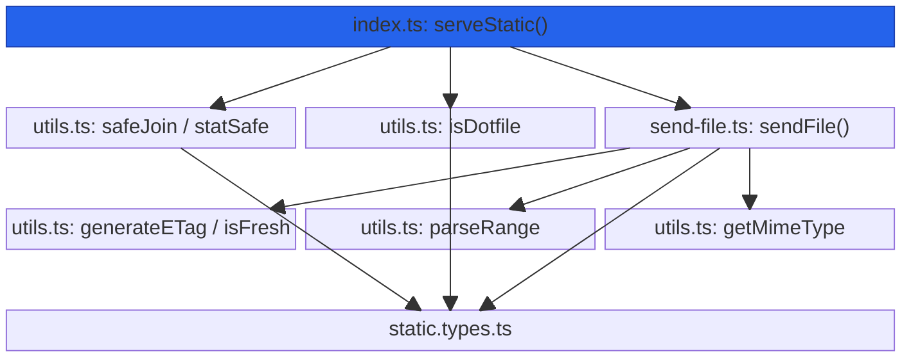
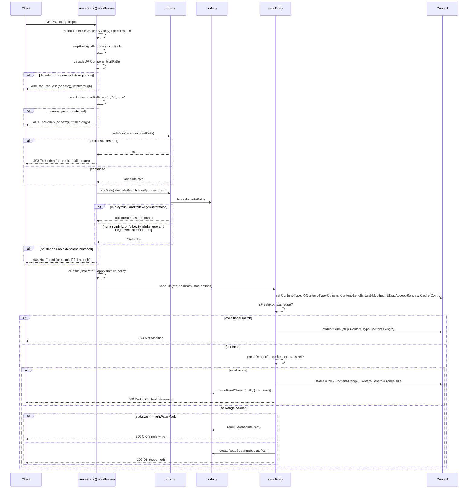
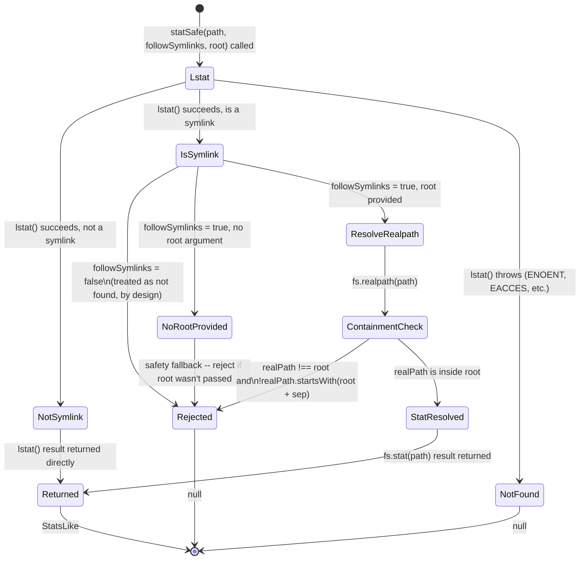

# @nextrush/static — Architecture

> Internal design of the request-resolution pipeline: how a URL path becomes a validated,
> contained filesystem path, how symlinks and dotfiles are policed, and how conditional/range
> requests decide between a `304`, a `206`, a single-read `200`, or a streamed `200`.

## At a glance

|  |  |
| --- | --- |
| **Package** | `@nextrush/static` |
| **Layer** | `middleware` (above `types`; below nothing — a leaf middleware) |
| **Depends on** | `@nextrush/types` (types only, erased at build); `@nextrush/core` as an *optional* peer dependency (type contracts only) |
| **Depended on by** | Application code that calls `app.use(serveStatic())` / `createSendFile()`; not depended on by any other `@nextrush/*` package |
| **Public entry** | `src/index.ts` (barrel — re-exports plus the `serveStatic`/`staticFiles`/`createSendFile` implementations) |
| **Internal modules** | 4 files (excl. tests) · 1,093 LOC · `index.ts` (313 LOC) and `utils.ts` (348 LOC) both exceed the 300-line middleware package cap (see the callout under [Module structure](#module-structure)) |
| **On the request hot path?** | Yes — runs on every `GET`/`HEAD` request that matches its `prefix`; path resolution, stat, and file I/O all happen per request |
| **Runtime coupling** | Node-only — `node:fs`, `node:path`, `node:http` imported directly; no adapter abstraction, no Edge/Bun/Deno conformance coverage |
| **State model** | Stateless per request; the middleware closure holds one piece of immutable app-scoped configuration (`NormalizedStaticOptions`, computed once at `serveStatic()` call time) |

## Responsibilities

**This package owns:**

- **Resolving a request path against a configured root directory**, with path-traversal
  containment enforced before any filesystem access (`utils.ts`'s `safeJoin()`)
- **Deciding what a request path resolves to**: an existing file, a directory (index file or
  403), an extension-fallback match, or not found (`index.ts`'s `serveStatic()`)
- **Symlink policy** — not following symlinks by default; when enabled, independently verifying
  the resolved real path stays inside `root` (`utils.ts`'s `statSafe()`)
- **Dotfile policy** — `ignore`/`deny`/`allow` for paths where any segment starts with `.`
- **Conditional request handling** — `ETag` generation, `If-None-Match`/`If-Modified-Since`
  evaluation, and `304` responses (`utils.ts`'s `generateETag()`/`isFresh()`)
- **Range request handling** — parsing and validating a single `Range` header and serving `206`
  or `416` accordingly (`utils.ts`'s `parseRange()`, `send-file.ts`)
- **Streaming the response body** — single-read for small files (with a TOCTOU re-check) or
  `fs.createReadStream()` for larger ones, with timeout and disconnect handling (`send-file.ts`)
- **MIME-type resolution from file extension** and the `X-Content-Type-Options` header

**This package does NOT own:**

- Reading a `multipart/form-data` upload body → `@nextrush/multipart`
- Response compression (gzip/deflate/br) of the served bytes → `@nextrush/compression`
- The middleware execution engine (`compose`, `ctx.next()`) → `@nextrush/core`
- Any Web-standard/cross-runtime request-body abstraction → this package reads and writes only
  through Node's `IncomingMessage`/`ServerResponse` (`ctx.raw.req`/`ctx.raw.res`), never the
  cross-runtime `BodySource` abstraction other middleware (e.g. `body-parser`, `multipart`) use

## Non-goals

The package intentionally does not:

- Provide cross-runtime (Bun/Deno/Edge) file serving — it is written directly against
  `node:fs`/`node:http` with no adapter layer; a future cross-runtime static server would be a
  different package or a significant rewrite, not an incremental change here
- Support multi-range (`bytes=0-99,200-299`) requests — `parseRange()` deliberately rejects a
  header with more than one comma-separated range, falling through to a full response instead
- Compute a strong (content-hash) ETag — `generateETag()` is a weak ETag from `size`/`mtime` only,
  chosen so generating it never requires reading the file's bytes
- Sniff file content to determine MIME type — `getMimeType()` is a pure extension-to-type lookup
  table; an unrecognized extension always falls back to `application/octet-stream`

## Constraints

Must remain:

- **Fail-secure on path resolution** — any path that can't be proven to stay inside `root` must
  be rejected (`null` from `safeJoin()`, `null` from `statSafe()`), never served on ambiguity
- **Symlinks opt-in, not opt-out** — `followSymlinks` must default to `false`; enabling it must
  still re-validate the resolved target against `root`, never trust the symlink target directly
- **Zero required third-party dependency** — a types-only dependency on `@nextrush/types`;
  `@nextrush/core` stays an *optional* peer, never a hard runtime dependency
- **ESM-only** — no CommonJS build
- **Public API sealed** — the exported surface is guarded by a public-surface test and
  semver-guarded (ADR-0005)

## Position in the package hierarchy

```mermaid
block-beta
    columns 5
    types["@nextrush/types"]:1
    space:1
    errors["@nextrush/errors"]:1
    space:1
    core["@nextrush/core"]:1
    space:5
    router["@nextrush/router"]:1
    space:3
    class["@nextrush/class"]:1
    space:5
    adapters["adapter-node / bun / deno / edge"]:5
    space:5
    block:mw:5
        columns 5
        bodyparser["body-parser"]:1
        multipart["multipart"]:1
        THIS["static (this package)"]:1
        template["template"]:1
        etc["... other middleware"]:1
    end

    types --> errors --> core --> router --> class --> adapters --> mw

    classDef here fill:#2563eb,color:#fff,stroke:#1e40af;
    class THIS here
```

> [!IMPORTANT]
> Imports flow **downward only**. `@nextrush/static` imports from `@nextrush/types` only
> (`@nextrush/core` is an optional peer for types), and MUST NOT be imported by `types`, `errors`,
> `core`, `router`, `class`, or any adapter (project-rules §1). It sits at the middleware layer as
> a leaf: nothing in the framework core depends on it — an application opts in by calling
> `app.use(serveStatic())`.

**Dependency rules:**
- **Allowed:** `static → types` (runtime) · `static → core` (optional peer, types only)
- **Forbidden:** `static → router / class / adapters / any other middleware package`

---

## Overview

The package answers one question for every `GET`/`HEAD` request under its configured `prefix`:
*does this request path resolve to a file inside `root`, and if so, what is the correct response
— a `304`, a `206` partial range, or a full `200` (read in one call or streamed)?* The organizing
idea is **resolve-and-contain before stat, stat before serve** — a request path is decoded, has
its worst traversal patterns rejected outright, is joined against `root` with an independent
containment check, and only then is it handed to `fs.lstat()`/`fs.stat()`. No filesystem call in
this package's request path ever runs against a path that hasn't already passed containment.

`serveStatic()` (`index.ts`) is the orchestration layer: method/prefix gating, path decoding,
early traversal rejection, extension-fallback retry, directory-vs-file branching, and dotfile
policy. It delegates the actual response construction — headers, conditional-request evaluation,
range parsing, and the read-or-stream decision — to `sendFile()` (`send-file.ts`), which is also
exported directly for callers who already have a resolved, stat'd path (e.g. `createSendFile()`'s
returned helper). All of the pure, side-effect-free logic (path safety, ETag, range parsing, MIME
lookup) lives in `utils.ts`, independent of any `Context`.

### Design principles

1. **A path is proven contained before it is ever passed to a filesystem call.** `safeJoin()`
   normalizes the URL path, rejects an obvious `..` escape, and — critically — checks the
   *resulting resolved absolute path* against `root` a second time (`abs === root ||
   abs.startsWith(root + sep)`) rather than trusting the traversal rejection alone to be
   sufficient; a path that fails either check returns `null`, never a best-effort guess.
2. **Symlinks require an explicit opt-in, and even then are re-validated.** `statSafe()` calls
   `lstat()` first specifically to detect a symlink before following it; when `followSymlinks:
   true`, the *resolved* real path is checked against `root` independently of the original path's
   containment check, closing the gap where a symlink inside `root` points outside it.
3. **Conditional and range evaluation happens after headers are set, before any byte is read.**
   `sendFile()` computes and sends `ETag`/`Last-Modified` first, checks `isFresh()` for a `304`
   next, and only then evaluates `Range` — a `304` response never reaches the read-or-stream
   branch at all, avoiding an unnecessary disk read.
4. **File size, not a configuration flag, decides read strategy.** The `stat.size <=
   highWaterMark` comparison in `sendFile()` is the single branch point between a one-shot
   `readFile()` and a streamed `createReadStream()` — there is no separate "streaming mode" option
   to misconfigure.
5. **A streamed response's lifecycle is fully owned by one `Promise`.** `streamToResponse()`'s
   `settle()` helper guarantees exactly one of `resolve`/`reject` fires exactly once, regardless of
   whether the stream ends, errors, times out, or the client disconnects first — preventing a
   double-response or a hung request.

---

## Module structure

```text
src/
├── index.ts              # serveStatic() / staticFiles / createSendFile() — orchestration + public re-exports
├── static.types.ts        # StaticOptions, NormalizedStaticOptions, NodeContext, DotfilesPolicy, etc.
├── utils.ts                # safeJoin, statSafe, generateETag, isFresh, parseRange, getMimeType, isDotfile,
│                           # stripPrefix, normalizePrefix — pure, Context-independent logic
└── send-file.ts            # sendFile() — header setup, conditional/range evaluation, read-or-stream response
```

> [!WARNING]
> `index.ts` (313 lines) and `utils.ts` (348 lines) both exceed this repository's 300-line
> middleware-package file cap (`architecture.instructions.md`'s per-package targets). `utils.ts`
> in particular bundles several independent concerns (path safety, stat/symlink handling, ETag,
> freshness, range parsing, and the MIME-type table) into one module. Splitting `utils.ts` along
> those seams (e.g. `path-safety.ts`, `caching.ts`, `range.ts`, `mime.ts`) and extracting
> `serveStatic()`'s directory-handling branch out of `index.ts` are candidate follow-ups, not yet
> scheduled as an RFC.

### Module responsibilities

| Module | Responsibility (the one thing it owns) |
| ------ | -------------------------------------- |
| `static.types.ts` | The public option/data contracts (`StaticOptions`, `NormalizedStaticOptions`, `NodeContext`, `DotfilesPolicy`, etc.) — no logic. |
| `utils.ts` | Every pure, `Context`-independent helper: path safety (`safeJoin`), symlink-aware stat (`statSafe`), ETag/freshness (`generateETag`/`isFresh`), range parsing (`parseRange`), MIME lookup (`getMimeType`), dotfile/prefix helpers. |
| `send-file.ts` | Turning a resolved path + `stat` + options into an actual HTTP response: headers, conditional (`304`), range (`206`/`416`), and the read-or-stream decision. |
| `index.ts` | Request-level orchestration: method/prefix gating, URL decoding, early traversal rejection, extension fallback, directory/dotfile branching, and the `serveStatic`/`createSendFile` public factories. |

## Component relationships



`send-file.ts` never calls `safeJoin()` or `statSafe()` directly — by the time `sendFile()` runs,
`index.ts` (or a caller of `createSendFile()`'s helper) has already resolved and validated the
path and produced a `stat`. This keeps path-containment logic entirely upstream of response
construction.

---

## Lifecycle

### Request → response (execution sequence)

How a single `GET` request for an existing file flows through `serveStatic()` and `sendFile()`,
including where traversal rejection, containment, and conditional/range evaluation run:



The ordering a reader would otherwise get wrong: **traversal rejection happens twice, at two
different layers, before any `stat()` call** — `serveStatic()`'s early string check on the decoded
URL, then `safeJoin()`'s independent containment check on the *resolved* absolute path. Either
one failing is sufficient to reject the request; neither is skipped because the other already ran.

### Symlink resolution (the state a `statSafe()` call passes through)



> [!NOTE]
> A symlink whose target has moved between the `lstat()` and the follow-up `fs.realpath()`/
> `fs.stat()` calls is a TOCTOU (time-of-check-to-time-of-use) window inherent to any two-step
> symlink validation — this package narrows it as far as a single async function boundary allows,
> but does not claim to eliminate it. `followSymlinks: false` (the default) avoids this window
> entirely by never following a symlink at all.

## State ownership

| Owner | State it owns | Scope |
| ----- | -------------- | ----- |
| `serveStatic()`'s closure (`opts`) | The normalized, immutable `NormalizedStaticOptions` | app — computed once when `serveStatic()` is called |
| `createSendFile()`'s closure (`opts`) | Same normalized options, for the single-file helper | app — computed once when `createSendFile()` is called |
| `streamToResponse()`'s local `settled`/`timeoutId` | Whether this specific stream's `Promise` has already resolved/rejected | per request — created fresh for each streamed response |
| `Context` (owned by `core`/the adapter) | `ctx.status`, response headers, and the response body written via `ctx.raw.res` | per request |

There is no module-level mutable state in `index.ts`, `utils.ts`, or `send-file.ts` — every
value that varies per request is either a function parameter or a `let` local scoped to that
request's handling.

## Data structures

```ts
// The minimal filesystem-stat contract this package depends on (static.types.ts) — a subset of
// Node's fs.Stats, so statSafe() can construct one from either a real Stats object or (in tests)
// a plain mock without needing the full Node.js Stats shape.
interface StatsLike {
  size: number;
  mtime: Date;
  isFile(): boolean;
  isDirectory(): boolean;
}

// The result of a single-range Range header parse. There is deliberately no "ranges: RangeResult[]"
// variant — multi-range requests are rejected upstream in parseRange(), not partially supported.
interface RangeResult {
  start: number;
  end: number;
}
```

The `StatsLike` shape choice (rather than importing Node's `fs.Stats` type directly into the
public surface) keeps `statSafe()`'s return type — and therefore `sendFile()`'s `stat` parameter —
decoupled from the exact Node.js `Stats` class, since `statSafe()` already reconstructs a plain
object with the four fields this package actually uses.

## Performance characteristics

| Path | Complexity | Allocations | Notes |
| ---- | ---------- | ------------ | ----- |
| `safeJoin()` | O(path length) | one normalized string, one resolved string | Two string operations (`normalize`, `resolve`) plus two `startsWith` checks — no filesystem access. |
| `statSafe()` (non-symlink) | O(1) filesystem call | one `StatsLike` object | A single `lstat()` covers both the symlink check and the regular stat data. |
| `statSafe()` (symlink, `followSymlinks: true`) | O(1) filesystem calls (3: `lstat`, `realpath`, `stat`) | one `StatsLike` object | The extra round trips only happen for an actual symlink, not the common non-symlink case. |
| `generateETag()` | O(string length of `size-mtime`) | one string | FNV-1a over a short numeric string — never reads the file's bytes. |
| `parseRange()` | O(header length) | one `RangeResult` or `null` | Rejects multi-range headers immediately (`ranges.length !== 1`) before any numeric parsing. |
| Small-file `sendFile()` (`size <= highWaterMark`) | O(file size) | one `Buffer` (`readFile()`'s result) | One read call, one write call — no stream setup. |
| Large-file `sendFile()` (streamed) | O(file size) | Node's own stream/highWaterMark buffering | `createReadStream().pipe(ctx.raw.res)` — bounded by the configured `streamTimeout`. |

**Memory model:**
- **Shared (one copy):** the `MIME_TYPES` lookup table (module-scoped, built once); each `serveStatic()`/`createSendFile()` call's normalized options closure.
- **Per request:** the resolved `absolutePath` string, the `StatsLike` object, and — only for small files — the full file `Buffer` read into memory for that one response.

## Concurrency & edge behaviour

- **Shared, immutable after construction:** `NormalizedStaticOptions` (closed over by the returned middleware/helper function); the module-scoped `MIME_TYPES` table.
- **Per-request, never shared:** the resolved path, `stat` result, ETag string, and any read `Buffer`/stream for that request.
- **Idempotency:** serving the same file with the same headers always produces the same response, except for `mtime`-derived values (`ETag`, `Last-Modified`) if the file changes on disk between requests — which is the intended behavior (cache invalidation on modification).
- **Abort / disconnect / timeout:** `streamToResponse()` listens for `ctx.raw.res`'s `'close'` event and destroys the read stream if the client disconnects before the stream ends; a configured `streamTimeout` (default 30s, `0` disables it) independently destroys the stream and responds `504` if it fires first. The `settle()` helper guarantees only one of these (or a normal `'end'`/`'error'`) actually resolves the response `Promise`.
- **TOCTOU (time-of-check-to-time-of-use):** two independent windows exist — (1) between the `stat()` used to decide small-vs-large-file handling and the actual `readFile()`/`createReadStream()` call, where `sendFile()` corrects `Content-Length` if the small-file read came back a different length than expected; (2) the symlink-resolution window noted in the [Lifecycle](#lifecycle) state diagram above. Neither window is eliminated, only narrowed and, in the small-file case, detected after the fact.

> [!WARNING]
> `sendFile()`'s TOCTOU correction only adjusts `Content-Length` for the **small-file** path (the
> single `readFile()` branch) — the streamed (`createReadStream()`) path has no equivalent
> re-check; a file that shrinks after `stat()` but before the stream finishes reading will end the
> stream naturally at its new (shorter) length without correcting an already-sent `Content-Length`
> header, since headers are sent before the stream body. A contributor addressing this gap should
> treat it as a genuine limitation, not assume the existing small-file correction already covers it.

## Trust boundaries

```text
Client-supplied URL path (untrusted)
   │
   ▼
stripPrefix() -- remove the configured mount prefix                                    <- no trust decision here
   │
   ▼
decodeURIComponent()  -- malformed encoding rejected (400)                              <- decode boundary
   │
   ▼
early string check: '..' / '\0' / '//' rejected (403)                                   <- traversal boundary (layer 1)
   │
   ▼
safeJoin(root, decodedPath)  -- normalize + resolve + re-verify containment (403 if null) <- traversal boundary (layer 2)
   │
   ▼
statSafe(absolutePath, followSymlinks, root)  -- symlink target re-validated against root <- symlink boundary
   │
   ▼
isDotfile(finalPath)  -- dotfiles policy applied (ignore/deny/allow)                     <- visibility boundary
   │
   ▼
sendFile()  -- headers set, conditional/range evaluated, bytes served
```

The client controls every input to path resolution: the URL itself, any `Range`/`If-None-Match`/
`If-Modified-Since` header, and (indirectly) which files exist under `root` if the application
lets users upload into that directory. Two boundaries are the ones a contributor must never weaken
without an RFC: the **traversal boundary**, enforced independently at both the URL-string layer
(`serveStatic()`) and the resolved-path layer (`safeJoin()`), and the **symlink boundary**
(`statSafe()`'s post-`followSymlinks` re-validation against `root`). Unlike `@nextrush/multipart`'s
`DiskStorage` path check (a bare `startsWith(this.dest)`), `safeJoin()`'s and `statSafe()`'s
containment checks both compare against `root + path.sep` (or exact equality with `root`) — a
sibling-directory string-prefix collision (e.g. `root = '/srv/public'` matching a resolved
`/srv/public-evil/x`) is not possible here, because `path.sep` is always required after `root`
unless the path equals `root` exactly.

## Extension points

**Supported extension points:**

- **`setHeaders`** — the sanctioned way to add or override response headers per file, called
  after this package's own headers are set but before the response body begins.
- **`extensions`** — configurable extension-fallback list, tried in order when the exact request
  path doesn't resolve to a file.
- **`createSendFile()` / `sendFile()` / the pure `utils.ts` functions** — exported for building a
  custom static-serving variant on the same primitives without forking the package.

**Forbidden (sealed):**

- **The path-containment check in `safeJoin()`** — removing or weakening the post-resolve
  `startsWith(root + sep)` verification would reopen the exact traversal vector this package
  exists to close.
- **`statSafe()`'s post-follow symlink re-validation** — allowing `followSymlinks: true` to trust
  a resolved target without checking it against `root` would let an attacker-controlled symlink
  (if one can be planted under `root`) serve arbitrary filesystem content.
- **Direct `ctx.raw.res` writes from outside `send-file.ts`** — every response write for a served
  file is centralized in `sendFile()`/`streamToResponse()` so a new code path can't bypass the
  conditional/range/TOCTOU handling already in place.

---

## Architectural invariants

These are part of the package's architecture. They do not change without an RFC:

- **A resolved path is never served unless it equals `root` or starts with `root + path.sep` —
  verified independently of the URL-level traversal check, never trusted from that check alone.**
- **Symlinks are not followed by default (`followSymlinks: false`); enabling them always
  re-validates the resolved real path against `root` before it is stat'd for serving.**
- **A `304` response strips `Content-Type` and `Content-Length` and never sends a body.**
- **Multi-range `Range` headers are rejected (not partially honored) — `parseRange()` returns
  `null` for anything but a single range.**
- **A streamed response's completion `Promise` settles exactly once**, regardless of whether it
  ends normally, errors, times out, or the client disconnects first.
- **The package imports Node built-ins directly (`node:fs`, `node:path`, `node:http`) — it makes
  no cross-runtime portability claim**, unlike Web-Streams-based middleware in this repository
  (e.g. `@nextrush/multipart`, `@nextrush/body-parser`).

## Engineering decisions

| Decision | Chosen | Trade-off accepted | Reference |
| -------- | ------ | ------------------- | --------- |
| Path-traversal enforcement | Two independent layers — an early string check on the decoded URL, and a resolved-path containment check in `safeJoin()` | Some redundancy (both checks reject the same obvious `..` cases), in exchange for defense-in-depth against a bypass of either check alone | `index.ts`'s early rejection, `utils.ts`'s `safeJoin()` |
| Symlink default | Not followed (`followSymlinks: false`) | An app serving a directory of symlinks (e.g. a build output using symlinked shared assets) must explicitly opt in and accept the re-validation cost | `utils.ts`'s `statSafe()` |
| Read strategy selection | File size vs. `highWaterMark`, not a separate "streaming" option | A contributor can't force streaming for a small file without raising `highWaterMark` down to force it, or vice versa — the size threshold is the only lever | `send-file.ts`'s `sendFile()` |
| ETag algorithm | Weak ETag (FNV-1a over `size-mtime`), not a content hash | Two different files that happen to share size and mtime (vanishingly unlikely in practice) would collide; chosen because it never requires reading the file to compute | `utils.ts`'s `generateETag()` |
| Range support scope | Single range only; multi-range headers rejected entirely | A client requesting multiple ranges in one request gets a full response instead of a multi-part one — simpler implementation, no `multipart/byteranges` encoding needed | `utils.ts`'s `parseRange()` |
| Runtime targeting | Node-only, direct `node:fs`/`node:http` usage, no adapter abstraction | No Bun/Deno/Edge support without a rewrite; chosen because static file serving is inherently filesystem-bound and most Edge runtimes don't expose a comparable filesystem API anyway | package-wide |

## Rejected alternatives

### A single traversal check instead of two independent layers
Rejected: the early URL-string check (`..`/`\0`/`//`) is fast and catches the common case before
any path-join work happens, but a check based on the raw decoded string alone can't account for
platform-specific normalization quirks (e.g. how `path.normalize()` treats mixed separators).
`safeJoin()`'s post-resolve check is the actual security guarantee; the early check is a
fast-reject optimization layered in front of it, not a replacement for it.

### Trusting a symlink target without re-validating it against `root`
Rejected: if `followSymlinks: true` followed a symlink unconditionally and served whatever it pointed to,
a single symlink planted under `root` (e.g. by a compromised upload path elsewhere in the
application) could serve arbitrary filesystem content outside the intended directory. The
re-validation in `statSafe()` closes exactly this gap, at the cost of the extra `realpath()`/
`stat()` round trip only when a symlink is actually encountered.

### Content-hash ETags instead of size/mtime-based weak ETags
Rejected: computing a strong ETag from file content requires reading the entire file before the
response can even begin, which defeats the point of `ETag` as a cheap freshness check —
especially for large files where the read itself is the expensive operation the cache is meant to
avoid triggering unnecessarily.

---

## Testing strategy

- **Unit:** `safeJoin()`/`statSafe()` against traversal/symlink/missing-root inputs; `parseRange()` against valid, unsatisfiable, suffix, open-ended, and multi-range headers; `generateETag()`/`isFresh()` against matching/non-matching `If-None-Match`/`If-Modified-Since`; `getMimeType()`/`isDotfile()`/`normalizePrefix()`/`stripPrefix()` table-driven cases.
- **Integration:** `serveStatic()` and `createSendFile()` against a real temporary directory fixture, covering directory index serving, extension fallback, dotfile policy, redirect-with-trailing-slash, range requests, and conditional requests (`src/__tests__/static.test.ts`).
- **Public-surface test:** `src/__tests__/public-surface.test.ts` guards the exported runtime and type surface against accidental additions/removals.
- **Conformance / cross-adapter parity:** N/A — this package is Node-only by design and is not part of `packages/adapters/conformance`'s cross-runtime coverage.
- **Coverage:** >=90% lines/functions (CI-enforced).

## Evolution strategy

- **Stable (semver-guarded):** the sealed public surface — `serveStatic`, `staticFiles`, `createSendFile`, `sendFile`, `safeJoin`, `statSafe`, `generateETag`, `isFresh`, `parseRange`, `getMimeType`, `isDotfile`, `stripPrefix`, `normalizePrefix`, and every type in `static.types.ts` (ADR-0005).
- **May change without notice:** the internal split of `utils.ts` (a candidate future refactor to bring it under the 300-line cap), the exact `MIME_TYPES` table contents, the FNV-1a ETag implementation detail (as long as it remains a weak ETag derived from size/mtime).
- **Changes only via RFC:** the path-traversal containment algorithm, the symlink-following default and its re-validation requirement, and the decision to support only single-range requests.

**Timeline:** 1.0 — initial Node-only static file serving with two-layer traversal protection, conditional caching, single-range support, and configurable symlink/dotfile policies.

## Contributor notes

Before changing this package, read: `utils.ts`'s `safeJoin()` and `statSafe()` in full — both
security-relevant containment checks live there — and `send-file.ts`'s `streamToResponse()` for
the disconnect/timeout `settle()` pattern before modifying stream lifecycle handling. Any change to
the traversal check, the symlink re-validation, or the range/conditional-request logic is a
security-relevant change and should be treated as RFC-gated per this document's invariants.

## Architecture checklist

Before changing this package, confirm:

- [ ] Does this preserve the architectural invariants above (especially the two-layer traversal check and the symlink re-validation)?
- [ ] Does this increase coupling or cross a dependency rule (`static → types` runtime, `→ core` optional-peer-types only)?
- [ ] Does this affect the request hot path (allocations in `safeJoin()`, `statSafe()`, or the read-vs-stream branch in `sendFile()`)?
- [ ] Does this change the sealed public API (semver / ADR-0005, guarded by the public-surface test)?
- [ ] If this touches path resolution, symlink handling, or range/conditional logic, does it remain fail-secure (reject on ambiguity, never serve outside `root`)?

---

## References & see also

- **README (how to use it):** [`./README.md`](./README.md)
- **ADR:** [`ADR-0005 — package tiers & sealed surface`](https://github.com/0xTanzim/nextRush/blob/main/docs/adr/ADR-0005-package-tiers-sealed-surface-deprecation.md)
- **Security boundary reference:** `.kiro/steering/project-rules.instructions.md` §4 (route parameters validated for type/format, no header-injection vectors — this package's path-resolution layer is the equivalent enforcement point for filesystem paths)
- **Documentation site:** [nextRush docs](https://0xtanzim.github.io/nextRush/docs)
- **Repository:** [`packages/middleware/static`](https://github.com/0xTanzim/nextRush/tree/main/packages/middleware/static)
