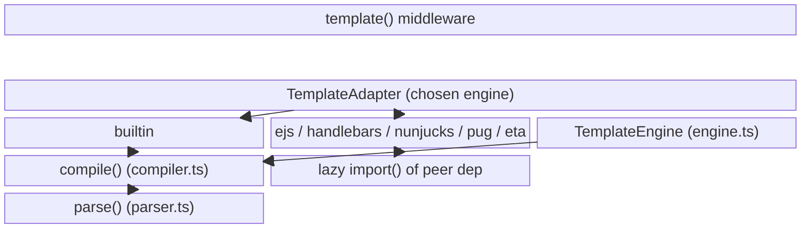
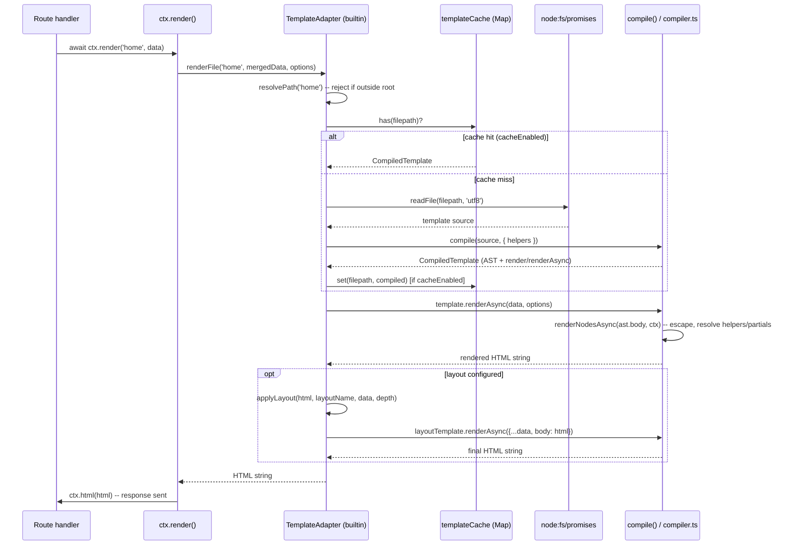

# @nextrush/template -- Architecture

> The adapter interface over six template engines, the built-in Mustache-like parser/compiler
> pipeline, and the caching and recursion-guard mechanics that keep file-based rendering safe.

## At a glance

|  |  |
| --- | --- |
| **Package** | `@nextrush/template` |
| **Layer** | middleware |
| **Depends on** | `@nextrush/types` (types only) |
| **Depended on by** | applications directly; not re-exported by any other NextRush package |
| **Public entry** | `src/index.ts` (barrel -- exports only) |
| **Internal modules** | 6 core files + 6 adapter files -- largest is `compiler.ts` at 845 lines |
| **On the request hot path?** | Yes, for any route that calls `ctx.render()` |
| **Runtime coupling** | Node-only for file-based rendering (`node:fs/promises`, `node:path`); the pure `render()`/`renderAsync()`/`compile()` string functions have no Node-specific import |
| **State model** | Per-adapter/per-`TemplateEngine` compiled-template cache, shared across requests; no per-request state beyond the data passed to `render()` |

> [!WARNING]
> `compiler.ts` (845 lines), `helpers.ts` (809 lines), and `parser.ts` (651 lines) all exceed the
> 300-line middleware package cap (`architecture.instructions.md`). This reflects the size of a
> real template-compiler/parser and a 50+-helper library, not unmanaged growth, but it is a real
> cap violation to flag rather than silently document around.

## Responsibilities

**This package owns:**
- ✓ A unified `TemplateAdapter` interface (`render`, `renderAsync`, `renderFile`, `registerHelper`, `clearCache`) that every engine implements identically
- ✓ A complete, zero-dependency Mustache-like template engine (tokenizer, parser, AST, compiler) as the default (`builtin`) adapter
- ✓ Lazy loading of the five external engine libraries (EJS, Handlebars, Nunjucks, Pug, Eta) via dynamic `import()`, so an unused engine's dependency is never touched
- ✓ File-based template caching, keyed by resolved file path, with a production-vs-development default
- ✓ Attaching `ctx.render()` to the request context via the `template()` middleware

**This package does NOT own:**
- ✗ Serving the static assets (CSS/JS/images) a rendered template references -- `@nextrush/static`
- ✗ Escaping/security semantics inside the five external engines -- each delegates entirely to that library's own escaping and helper model; this package only orchestrates loading, caching, and the adapter contract around it
- ✗ Streaming a partially-rendered response -- every render call here returns one complete string; `@nextrush/stream` owns SSE/NDJSON partial delivery

## Non-goals

- Client-side hydration or a browser template runtime -- output is a server-rendered HTML string
- A general-purpose expression language -- the built-in engine's helper-pipe syntax (`{{value | helper}}`) and block set (`if`/`unless`/`each`/`with`) is intentionally small, not a full scripting language
- Bundling any of the five external engines as a dependency -- each stays an *optional* peer, so a `builtin`-only app pays zero install cost for engines it never uses

## Constraints

Must remain:
- Zero required runtime dependencies beyond `@nextrush/types` -- every external template engine is an optional peer, loaded lazily
- ESM-only, side-effect-free at module scope (`sideEffects: false`)
- Behaviorally engine-agnostic at the `TemplateAdapter` boundary -- `template()`/`ctx.render()` must work identically regardless of which adapter backs it, modulo each engine's own template syntax

## Position in the package hierarchy


> [!IMPORTANT]
> Imports flow **downward only**. `@nextrush/template` may import from `@nextrush/types` and MUST
> NOT be imported by lower packages -- enforced in review (project-rules §1).

**Dependency rules:**
- **Allowed:** `@nextrush/template -> @nextrush/types`
- **Forbidden:** `@nextrush/template -> @nextrush/core` as a hard runtime dependency (it is an
  optional peer only, for type contracts)

---

## Overview

`@nextrush/template` is built around one idea: every template engine, however different its
syntax, can be wrapped in the same four-method `TemplateAdapter` interface (`render`,
`renderAsync`, `renderFile`, `registerHelper`, plus `clearCache`). `template()` picks an adapter by
name, and `ctx.render()` always calls through that same interface -- the middleware and the
route handler never need to know which engine is actually rendering.

The `builtin` adapter is the one engine this package implements itself: a small
tokenizer/parser/compiler pipeline (`parser.ts` -> `compiler.ts`) that turns Mustache-like source
into an AST, then into a render function closed over that AST. The other five adapters
(`adapters/{ejs,handlebars,nunjucks,pug,eta}.ts`) are thin wrappers that lazily `import()` the real
library on first use and translate this package's options into that library's own configuration
shape.

### Design principles

1. **Every engine is optional except `builtin`.** Enforced by `peerDependenciesMeta` marking all
   five external engines `optional: true` in `package.json`, and by each adapter's lazy
   `import()` inside a `try`/`catch` that throws an actionable "not installed" error only if that
   specific engine is actually used.
2. **The adapter interface is the only contract `template()`/`ctx.render()` depend on.** Enforced
   by `TemplateAdapter` (`adapters/types.ts`) being the sole type both `template()` (`index.ts`)
   and every adapter factory share -- `template()` never imports an engine-specific type.
3. **Untrusted template content never reaches JS property chains it shouldn't.** Enforced by
   `isSafeProperty()` in `compiler.ts`, checked on every segment of a dotted variable path before
   the built-in engine resolves it.

---

## Module structure

```text
src/
├── index.ts             # Public API: template() middleware, render()/renderAsync(), re-exports
├── engine.ts             # TemplateEngine class -- file loading, caching, layouts, partials directory
├── compiler.ts           # AST -> render-function compiler; HTML escaping; recursion guard; helper/partial resolution
├── parser.ts             # Tokenizer + parser -- built-in Mustache-like syntax -> AST
├── helpers.ts             # 50+ built-in helper functions (string/number/date/array/object/comparison)
├── template.types.ts      # Public type contracts: AST nodes, options, CompiledTemplate, errors
└── adapters/
    ├── index.ts           # Adapter registry (createAdapter, registerAdapter, getAvailableEngines)
    ├── types.ts            # TemplateAdapter interface, EngineName, AdapterConfig/RenderOptions
    ├── builtin.ts           # Adapter wrapping compiler.ts for file-based rendering + layouts
    ├── ejs.ts / handlebars.ts / nunjucks.ts / pug.ts / eta.ts  # One adapter per external engine
```

### Module responsibilities

| Module | Responsibility (the one thing it owns) |
| ------ | -------------------------------------- |
| `index.ts` | The `template()` middleware, standalone `render()`/`renderAsync()`, and the full public re-export barrel |
| `engine.ts` | `TemplateEngine` -- a standalone (middleware-free) file-based render engine with its own cache, layout, and partials-directory support |
| `compiler.ts` | Turning a parsed AST into a callable render function; HTML escaping; the prototype-pollution property guard; the recursion-depth guard |
| `parser.ts` | Tokenizing and parsing built-in-engine template source into an `AST` |
| `helpers.ts` | Every built-in helper function, plus `createHelperRegistry()` to seed a fresh helper `Map` |
| `template.types.ts` | All AST node types, option interfaces, and the `CompiledTemplate`/`TemplateError` contracts |
| `adapters/index.ts` | The engine-name -> factory registry (`createAdapter`, `registerAdapter`, `hasAdapter`) |
| `adapters/types.ts` | The `TemplateAdapter` interface every adapter implements, plus `EngineName`/`AdapterConfig` |
| `adapters/builtin.ts` | File-based rendering, its own path-traversal guard, and layout application for the built-in engine |
| `adapters/{ejs,handlebars,nunjucks,pug,eta}.ts` | Lazy-load the real library, translate this package's config into that library's options, cache compiled templates |

## Component relationships



---

## Lifecycle

The request-to-response path when a route handler calls `ctx.render()`, using the `builtin`
adapter's file-based path (the other adapters follow the same shape, delegating compile/render to
their own library):



Compile-time vs. render-time state (not obvious from the diagram alone): the `Cache` is populated
once per unique `filepath` and shared across every subsequent request that renders the same
template -- only a cache miss (first render, or caching disabled) touches the filesystem or the
parser/compiler.

## State ownership

| Owner | State it owns | Scope |
| ----- | ------------- | ----- |
| `template()` closure | The single `TemplateAdapter` instance created for that middleware registration | app (built once, at `app.use(template(...))` time) |
| `TemplateAdapter` implementation (each adapter) | Its own compiled-template `Map` cache, keyed by resolved file path | app (shared across every request through that middleware instance) |
| `TemplateEngine` instance (`createEngine()`) | Its own independent cache, helpers `Map`, and partials `Map` | app (one per `createEngine()` call; unrelated to any `template()` middleware's adapter cache) |
| `ctx.render()` call | The merged render data (`{ ...ctx.state, ...data }`) and the resulting HTML string | per-request, discarded after the response is sent |

---

## Data structures

The `CompiledTemplate` returned by `compile()` is the load-bearing shape the whole built-in
pipeline is built around -- it pairs the parsed `AST` with closures that already have that AST
captured, so a second render never re-parses:

```ts
export interface CompiledTemplate {
  render(data?: Record<string, unknown>, options?: RenderOptions): string;
  renderAsync(data?: Record<string, unknown>, options?: RenderOptions): Promise<string>;
  source: string;
  ast: AST;
}
```

`RenderOptions` carries an internal `_depth` field (`@internal`, not part of the documented
surface a caller is expected to set) that `compile()`'s own `render()`/`renderAsync()` increment
each time a layout wraps another render -- this is the mechanism `MAX_RECURSION_DEPTH` checks
against, not a separate call counter.

## Performance characteristics

| Path | Complexity | Allocations | Notes |
| ---- | ---------- | ----------- | ----- |
| Cache hit (`renderFile` on a previously-loaded template) | O(n) in template size for the render walk; no parse/compile cost | One render-context object per call | Dominant cost is `renderNodesAsync`'s AST walk, not I/O |
| Cache miss (first render, or `cache: false`) | O(n) in source size to tokenize + parse + compile, plus O(n) to render | New `CompiledTemplate` (AST + closures) per miss | Every adapter's `readFile()` + `compile()` runs synchronously to a `Promise`, serialized per request unless the cache absorbs repeats |
| Dotted-path property access (`{{user.profile.name}}`) | O(k) in path segment count | None beyond the split path array | `isSafeProperty()` check adds a `Set.has()` per segment, not per character |

**Memory model:**
- **Shared (one copy, per adapter/engine instance):** the compiled-template cache `Map`, the
  helpers `Map`, and any registered partials
- **Per request:** the render context object (`data`, `root`, `parent`, `helpers`, `partials`,
  `depth`) created fresh inside `compile()`'s `render`/`renderAsync`, and the final HTML string

## Concurrency & edge behaviour

- **Shared, effectively immutable after first population:** each adapter's/`TemplateEngine`'s
  cache `Map` is only ever added to (never mutated in place) after a template is first compiled;
  concurrent requests reading the same cached entry don't race on it
- **Per-request, never shared:** the render context object and the data passed to `render()`
- **Abort / disconnect / timeout:** not handled by this package -- `ctx.render()` resolves to a
  complete string before calling `ctx.html()`; there is no mid-render cancellation. A client
  disconnect during rendering doesn't stop the render, only the eventual response write.

> [!WARNING]
> Calling `clearCache()` on an adapter or `TemplateEngine` while concurrent requests are mid-flight
> through `getTemplate()`/`loadTemplate()` is safe with respect to correctness (a cleared cache
> means only that the next lookup recompiles), but it does mean in-flight requests that already
> read a cached `CompiledTemplate` reference keep using that instance -- there is no
> cache-invalidation broadcast to already-resolved renders.

## Trust boundaries

```text
Template source (file or string) ──▶ parser.ts (tokenize/parse) ──▶ compiler.ts (compile/render)
                                                                          ▲
                                                     the boundary THIS package enforces:
                                                     - HTML-escape {{var}} output by default
                                                     - block __proto__/constructor/prototype/dunder
                                                       property access on every dotted path segment
                                                     - cap render/layout recursion depth
```

This package treats **template source as a lower-trust surface than rendered output** -- a
malicious or malformed template could otherwise walk into JS internals via a crafted property
path, or recurse a layout/partial chain unboundedly. It does **not** treat the *data* passed to
`render()` as needing separate sanitization beyond escaping at output time; the data object itself
is read, never executed.

## Extension points

**Supported extension points:**
- Registering a new engine via `registerAdapter(name, factory)` -- any object implementing
  `TemplateAdapter` can back a new `EngineName`
- Registering custom helpers per-instance (`registerHelper`/`registerHelpers` on `TemplateEngine`,
  or the `helpers` option on `template()`/`createEngine()`)
- Registering custom partials (`registerPartial`/`registerPartials` on `TemplateEngine`, or the
  `partials` option)

**Forbidden (sealed):**
- The `TemplateAdapter` interface's method signatures -- `render`/`renderAsync`/`renderFile`/
  `registerHelper`/`clearCache` are the sealed contract every adapter (built-in or custom) commits
  to; changing them is a breaking change to every registered adapter
- The blocked-property set in `compiler.ts` (`__proto__`, `constructor`, `prototype`,
  `__defineGetter__`/`__defineSetter__`/`__lookupGetter__`/`__lookupSetter__`) must not be
  narrowed without a security review -- it exists specifically to prevent the class of
  prototype-pollution templating vulnerability documented in CVE-2021-23369 (Handlebars)

---

## Architectural invariants

The following are part of the package architecture. They do not change without an RFC:

- `template()`/`ctx.render()` never depend on an engine-specific type -- only `TemplateAdapter`.
- The built-in engine's `{{variable}}` interpolation HTML-escapes by default; disabling escaping
  is always an explicit, per-compile opt-out (`{{{ }}}`, `{{& }}`, `safe` helper, or
  `compile.escape: false`), never an implicit default.
- Every external engine (`ejs`, `handlebars`, `nunjucks`, `pug`, `eta`) stays an optional peer
  dependency, loaded lazily via `import()` -- never a hard runtime dependency of this package.
- Dotted-path property resolution in the built-in engine blocks `__proto__`, `constructor`,
  `prototype`, and getter/setter dunder properties on every path segment.
- Render/layout recursion is capped (`MAX_RECURSION_DEPTH` in `compiler.ts`; `MAX_LAYOUT_DEPTH` in
  `adapters/builtin.ts`) -- a circular layout/partial reference fails loudly instead of exhausting
  the call stack or looping indefinitely.

## Engineering decisions

| Decision | Chosen | Trade-off accepted | Reference |
| -------- | ------ | ------------------- | --------- |
| One adapter interface across 6 engines | `TemplateAdapter` (render/renderAsync/renderFile/registerHelper/clearCache) | Adapters can only expose behavior all six can plausibly implement; an engine-specific feature (e.g. Nunjucks' `addGlobal`) isn't exposed through the unified API | `adapters/types.ts` |
| Lazy `import()` per external engine | Each adapter's `loadX()` function, memoized in a module-level variable | First render on a cold adapter pays an extra `import()` await; avoided by every request after | `adapters/{ejs,handlebars,nunjucks,pug,eta}.ts` |
| Built-in engine implemented from scratch (not a vendored Mustache library) | Custom tokenizer/parser/compiler | More code to maintain in this package (`compiler.ts` + `parser.ts` together are ~1,500 lines) in exchange for zero required runtime dependencies | `compiler.ts`, `parser.ts` |
| Cache defaults to `NODE_ENV`-based, not always-on | `cache ?? process.env.NODE_ENV === 'production'` in every adapter and `TemplateEngine` | Development sees fresh templates on every request (extra I/O + compile per render); an explicit `cache: true` opts back in | `engine.ts`, `adapters/*.ts` |

## Rejected alternatives

### Bundling one external engine as a hard dependency
Shipping, say, EJS as a required dependency would remove the lazy-load complexity, but it would
force every consumer of the `builtin`-only path to install and ship an engine they never use,
directly contradicting the zero-dependency-core framework goal (`AGENTS.md` §6). Optional peers
plus lazy loading keep the install cost proportional to what an app actually uses.

### A single monolithic render function with an `engine` string switch
Branching on an engine-name string inside one large `render()` function was rejected in favor of
the adapter-factory pattern -- `registerAdapter()` lets a consumer add a seventh engine without
this package's own source changing, which a hardcoded switch statement would not allow.

---

## Testing strategy

- **Unit:** parser/compiler behavior (`__tests__/template.test.ts`) covering variables, blocks,
  partials, layouts, comments, helpers, and error paths (unclosed blocks, invalid expressions).
- **Integration:** adapter behavior against each real engine (`__tests__/adapters.test.ts`),
  including the lazy-load-failure path when a peer dependency is absent.
- **Invariant tests:** the public-surface test (`__tests__/public-surface.test.ts`) locks the
  exact exported runtime symbol set and the type-only surface; a change to either fails the test
  until updated deliberately (ADR-0005).
- **Conformance / cross-adapter parity:** N/A -- this package has no cross-runtime adapter
  (Node-only); "conformance" here means the six `TemplateAdapter` implementations behaving
  consistently at the interface level, exercised by `adapters.test.ts`.
- **Coverage:** >=90% lines/functions (CI-enforced).

## Evolution strategy

- **Stable (semver-guarded):** the `TemplateAdapter` interface, the `template()` middleware
  signature, `render`/`renderAsync`/`compile`, and every symbol locked in
  `public-surface.test.ts`.
- **May change without notice:** the internal tokenizer/parser token types in `parser.ts`, and
  each adapter's internal caching data structure.
- **Changes only via RFC:** the architectural invariants above, in particular the escaping
  default and the blocked-property set.

## Contributor notes

Before changing this package, read: the public-surface test
(`src/__tests__/public-surface.test.ts`) to understand what's sealed, and `compiler.ts`'s
`BLOCKED_PROPERTIES` section before touching property resolution -- narrowing that set without a
security review reopens a known class of templating vulnerability.

## Architecture checklist

Before changing this package, confirm:
- [ ] Does this preserve the architectural invariants (escaping default, blocked-property set, recursion caps)?
- [ ] Does this add a new hard runtime dependency, or does it stay an optional peer?
- [ ] Does this affect the render hot path (allocations per render, extra AST walks)?
- [ ] Does this change the public API locked by `public-surface.test.ts` (semver / ADR-0005)?
- [ ] Does it need an RFC?

---

## References & see also

- **README (how to use it):** [`./README.md`](./README.md)
- **ADR(s):** [ADR-0005 -- package tiers & sealed surface](https://github.com/0xTanzim/nextRush/blob/main/docs/adr/ADR-0005-package-tiers-sealed-surface-deprecation.md)
- **Benchmarks:** [`apps/benchmark`](https://github.com/0xTanzim/nextRush/tree/main/apps/benchmark)
