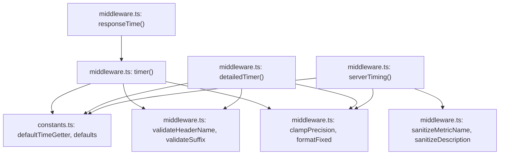

# @nextrush/timer — Architecture

> Internal design of the response-timing middleware — how the start/stop measurement wraps `ctx.next()`, why `performance.now()` has a `Date.now()` fallback, and how the four exports share one measurement core with different formatting/output rules.

## At a glance

|  |  |
| --- | --- |
| **Package** | `@nextrush/timer` |
| **Layer** | `middleware` (above `types`; below nothing — a leaf middleware) |
| **Depends on** | `@nextrush/types` (types only, erased at build) — no other runtime dependency |
| **Depended on by** | Application code that calls `app.use(timer())` / `detailedTimer()` / `serverTiming()` / `responseTime()`; not depended on by any other `@nextrush/*` package |
| **Public entry** | `src/index.ts` (barrel — exports only, no implementation) |
| **Internal modules** | 4 files · 598 LOC total · `middleware.ts` at 345 LOC |
| **On the request hot path?** | Yes — runs once per request when mounted; timing wraps the entire downstream chain from `ctx.next()` |
| **Runtime coupling** | None — uses only the global `performance.now()` / `Date.now()` (both Web-standard), never a Node-specific module |
| **State model** | Stateless at the package level; no state is retained between requests — each request measures and stores its own duration independently |

> [!WARNING]
> `middleware.ts` is **345 lines, over the 300-line middleware package cap** in
> `architecture.instructions.md`. It holds four exported middleware factories
> (`timer`, `detailedTimer`, `responseTime`, `serverTiming`) plus their shared validation/
> sanitization helpers in one file. This is pre-existing code, out of scope for this
> documentation pass — logged here honestly as a finding for a future refactor (e.g. splitting
> the `timer`/`detailedTimer` pair from `serverTiming` and the shared helpers into their own
> modules), not silently omitted.

## Responsibilities

**This package owns:**

- ✓ Measuring elapsed time between the start of `ctx.next()` and its resolution, using the highest-resolution clock the runtime provides
- ✓ Formatting that duration into a fixed-precision, unit-suffixed string for a response header
- ✓ Validating the `header`/`suffix` configuration values once, at middleware-creation time
- ✓ Sanitizing the per-call `metric`/`description` values used by `serverTiming()`, to prevent header injection
- ✓ Storing the measured duration (or, for `detailedTimer` with `detailed: true`, a full `{ duration, formatted, start, end }` record) in `ctx.state`

**This package does NOT own:**

- ✗ Formatting the duration into a structured log line → [`@nextrush/logger`](../logger)
- ✗ Generating a per-request identifier → [`@nextrush/request-id`](../request-id)
- ✗ The middleware execution engine (`compose`, `ctx.next()`) → `@nextrush/core`
- ✗ Timing individual sub-operations inside a handler (e.g. a database query) → application code composes its own `Server-Timing` entries alongside this package's, as shown in the README's multiple-metrics example

## Non-goals

The package intentionally does not:

- Guarantee microsecond-accurate wall-clock timing on every runtime — it uses whatever resolution `performance.now()` provides on the host runtime, and degrades to millisecond resolution on the (rare, in practice unencountered on any of this package's supported runtimes) fallback to `Date.now()`
- Aggregate or persist timing data across requests — every request is measured independently; there is no in-memory store of past durations a contributor could introduce a race condition into
- Reject a `precision` value outside `[0, 6]` — it is silently clamped instead (Design principle 2)

## Constraints

Must remain:

- **Runtime-independent** — zero `node:*` imports; the sole timing primitive is the global `performance.now()`/`Date.now()`, so this middleware needs no adapter on Node, Bun, Deno, or edge runtimes
- **Non-throwing on the hot path** — the measurement itself (the `try`/`finally` around `ctx.next()`) never fails; only creation-time configuration errors (`header`, `suffix`) throw, and only once, before any request is handled
- **ESM-only** — no CommonJS build
- **Public API sealed** — the exported surface is locked by `__tests__/public-surface.test.ts`

## Position in the package hierarchy

```mermaid
flowchart TB
    types["@nextrush/types"] --> errors["@nextrush/errors"] --> core["@nextrush/core"]
    core --> router["@nextrush/router"] --> runtime["@nextrush/runtime"] --> di["@nextrush/di"] --> class["@nextrush/class"]
    class --> adapters["adapter-node / bun / deno / edge"] --> middleware["middleware / extensions"]
    THIS["@nextrush/timer — this package"]:::here
    middleware --> THIS
    classDef here fill:#2563eb,color:#fff,stroke:#1e40af;
```

> [!IMPORTANT]
> Imports flow **downward only**. `@nextrush/timer` imports only from `@nextrush/types` and MUST
> NOT be imported by `types`, `errors`, `core`, `router`, `class`, or any adapter (project-rules
> §1).

**Dependency rules:**
- **Allowed:** `timer → types`
- **Forbidden:** `timer → core / router / class / adapters / any other middleware package`

---

## Overview

`@nextrush/timer` wraps a single measurement primitive — capture a start time, `await ctx.next()`, capture an end time in a `finally` block, compute `end - start` — with four different presentation layers around it. `timer()` (aliased as `responseTime()`) is the base case: it stores the rounded duration in `ctx.state` and, if `exposeHeader` is `true`, writes a formatted `X-Response-Time`-style header. `detailedTimer()` reuses the identical measurement but can store a richer `TimingResult` object instead of a plain number. `serverTiming()` reuses the same measurement again but targets the standard `Server-Timing` header format, with its own sanitization rules because that header's `metric`/`description` values are per-call strings rather than one-time configuration.

The organizing idea is that the timing measurement itself is trivial and shared — every one of the four exported functions performs the identical `now(); await ctx.next(); finally { now(); }` sequence — while the interesting behavior (what gets validated, how it's formatted, where it's written) is what differs between them. This keeps the actual clock-reading code from ever drifting across the four variants.

### Design principles

1. **The measurement always completes, even on a handler error.** Enforced structurally: the `end = now()` call and everything that follows it live inside a `finally` block wrapped around `await ctx.next()`, so a thrown error downstream does not prevent the duration from being computed and stored — only a header write depends on `exposeHeader`, and that write also happens inside the same `finally` block.
2. **A misconfigured precision degrades gracefully; a misconfigured header/suffix fails loudly.** `clampPrecision()` silently clamps any `precision` value to `[0, MAX_PRECISION]` (`[0, 6]`) — there is no invalid precision. In contrast, `validateHeaderName()` and `validateSuffix()` throw synchronously inside `timer()`/`detailedTimer()` at creation time if the value doesn't match their respective safe patterns, because a malformed header name is a configuration bug that should surface immediately, not one that should be "fixed" by silently rewriting the caller's string.
3. **Header-injection defenses differ by input shape, not just by importance.** `header` and `suffix` are one-time, developer-supplied configuration values — validated once and thrown on failure. `metric` and `description` on `serverTiming()` are potentially more dynamic per-call values — sanitized (characters stripped/escaped) rather than validated-and-thrown, so a request-scoped metric name derived from a route parameter, for example, degrades to a safe empty/stripped string instead of crashing the middleware on every request that produces an unexpected character.
4. **The default clock is the best available, never a fixed choice.** `defaultTimeGetter` (`constants.ts`) checks `typeof globalThis.performance !== 'undefined'` and whether it exposes a callable `.now`, and only falls back to `Date.now()` if that check fails. On every runtime this package documents as supported (Node, Bun, Deno, Cloudflare Workers, Vercel Edge), `performance.now()` is available, so the fallback path exists for defensive correctness on an unlisted or future runtime, not as an expected code path today.

---

## Module structure

```text
src/
├── index.ts        # Public API exports (barrel only, no implementation)
├── constants.ts    # Header names, default suffix/precision/state-key, defaultTimeGetter
├── types.ts        # TimerOptions, DetailedTimerOptions, ServerTimingOptions, TimingResult, etc.
├── middleware.ts   # timer() / detailedTimer() / responseTime() / serverTiming() + shared
│                   #   validation (validateHeaderName, validateSuffix) and sanitization
│                   #   (sanitizeDescription, sanitizeMetricName) helpers -- 345 LOC, over
│                   #   the 300-line middleware cap (see the "At a glance" warning above)
└── __tests__/
    ├── timer.test.ts             # Behavioral tests for all four middleware factories
    └── public-surface.test.ts    # Locks the exported surface shape (ADR-0005)
```

### Module responsibilities

| Module | Responsibility (the one thing it owns) |
| ------ | -------------------------------------- |
| `constants.ts` | Default header/suffix/precision/state-key/metric values, `MAX_PRECISION`, and `defaultTimeGetter` (the `performance.now()`-with-`Date.now()`-fallback function). |
| `types.ts` | All exported type shapes: `TimerOptions`, `DetailedTimerOptions`, `ServerTimingOptions`, `TimingResult`, `TimeGetter`, `TimerContext`. |
| `middleware.ts` | The four middleware factories, the config-time guards (`validateHeaderName`, `validateSuffix`), the per-call sanitizers (`sanitizeDescription`, `sanitizeMetricName`), and the shared numeric helpers (`clampPrecision`, `formatFixed`). |

## Component relationships



`responseTime()` is a direct call-through to `timer()` with no logic of its own. `detailedTimer()`
and `serverTiming()` do not call `timer()` — each re-implements the same `now()` /
`try`-`finally` measurement shape independently, because each needs a different formatting/output
step around the shared measurement (a detailed result object, or the appending `Server-Timing`
format), not because the measurement logic itself differs.

---

## Lifecycle

### Start-timer → handler → stop-timer → header sequence

The path a single request takes through `timer()`, from the first clock read to the response
header being written:

```mermaid
sequenceDiagram
    participant Client
    participant MW as timer() middleware
    participant Clock as constants.ts: defaultTimeGetter
    participant Handler as downstream handler chain

    Note over MW: One-time, at middleware creation (app startup):\nvalidateHeaderName(header); validateSuffix(suffix);\nsafePrecision = clampPrecision(precision)

    Client->>MW: GET /users

    MW->>Clock: start = now()
    Clock-->>MW: performance.now() value (or Date.now() if performance is unavailable)

    MW->>Handler: await ctx.next()
    Handler-->>MW: resolves, or throws

    Note over MW: finally block runs regardless of whether ctx.next() threw

    MW->>Clock: end = now()
    Clock-->>MW: end timestamp

    MW->>MW: duration = end - start
    MW->>MW: formatted = formatFixed(duration, safePrecision, factor)
    MW->>MW: ctx.state[stateKey] = round(duration, safePrecision)

    alt exposeHeader is true
        MW->>Client: ctx.set(header, formatted + suffix) -- e.g. "12.34ms"
    else exposeHeader is false (default)
        Note over MW: response header is never written;\nctx.state[stateKey] is still set
    end

    MW-->>Client: response sent (with or without the header, per exposeHeader)
```

The fact a reader would otherwise miss: **the header is written from inside the same `finally`
block that computes the duration**, not from a separate step after `ctx.next()` returns
successfully — so if a downstream handler throws and an error-handling middleware further up the
chain still produces a response, that response was already carrying the timing header (when
`exposeHeader` is `true`) before the error propagated further. `serverTiming()` follows the
identical sequence, differing only in the final step: it reads any existing `Server-Timing` header
value via `ctx.get(SERVER_TIMING_HEADER)` and appends a comma-separated entry rather than
overwriting, so multiple timing sources compose on one header.

## State ownership

| Owner | State it owns | Scope |
| ----- | -------------- | ----- |
| `middleware.ts` closure (`header`, `suffix`, `safePrecision`, `factor`, `now`, etc.) | The resolved configuration for one `app.use(timer(options))` call | app (one closure per middleware registration, shared read-only across all requests it handles) |
| `ctx.state[stateKey]` (owned by `Context`, written by this middleware) | The measured duration (or `TimingResult`) for the current request | per request |
| — | No package-level or process-level mutable state exists | N/A — this package has none |

## Concurrency & edge behaviour

- **Shared, immutable after construction:** the configuration closure (`header`, `suffix`, `safePrecision`, `factor`, `now`, `exposeHeader`, `stateKey`, and for `serverTiming()`, `safeMetric`/`safeDescription`) — resolved once when the factory function is called, then read-only for the lifetime of the app.
- **Per-request, never shared:** the `start`/`end` timestamps and the computed `duration` — each request measures its own independently; there is no shared counter or accumulator that concurrent requests could race on.
- **Idempotency:** re-running the measurement for the same request (which does not happen in normal use) would simply overwrite `ctx.state[stateKey]` with a second, independently-measured value — there is no cumulative or shared state to corrupt.
- **Client disconnect / abort:** the middleware has no explicit `AbortSignal` handling. Because the `end = now()` read and the header write both happen inside the `finally` block wrapping `await ctx.next()`, a client disconnect during the downstream handler still allows the `finally` block to run once `ctx.next()` settles (resolves or rejects) — the measurement completes, but whether the header write has any observable effect then depends on whether the underlying connection is still open, which this package does not check.

> [!WARNING]
> `serverTiming()`'s append-not-overwrite behavior (`ctx.get(SERVER_TIMING_HEADER)` then
> concatenate) means the final header value depends on **execution order** if multiple
> middleware write `Server-Timing`. A middleware that uses `ctx.set()` directly instead of the
> same read-then-append pattern will clobber any entry already written by this package, or vice
> versa (see the README's Troubleshooting section).

## Trust boundaries

```text
Application-supplied config (header, suffix)          <- validated once, at creation time, throws on failure
   │
   ▼
timer() / detailedTimer() middleware
   │
   ▼
Per-request measurement (start, end, duration)          <- purely internal numbers, never external input
   │
   ▼
ctx.state[stateKey] = duration ; ctx.set(header, formatted)

Application-supplied per-call values (metric, description)   <- sanitized (stripped/escaped), not thrown, at creation time
   │
   ▼
serverTiming() middleware
   │
   ▼
ctx.set(SERVER_TIMING_HEADER, "metric;dur=...;desc=\"...\"")
```

This package does not process any client/request-supplied input directly — the values it
validates or sanitizes (`header`, `suffix`, `metric`, `description`) are all supplied by the
*application developer* configuring the middleware, not by the HTTP client. The sanitization
still matters because those configuration values are frequently derived from route names, feature
flags, or other semi-dynamic application state that could itself trace back to less-trusted input
further up the application's own call chain — the header-injection tests in `timer.test.ts`
(`security` describe block) exercise exactly this: CRLF sequences, colons, and control characters
in a `metric`/`description` value are stripped or escaped before reaching the response header.

## Extension points

**Supported extension points:**

- **`now`** — the sanctioned way to substitute a different clock source (used throughout `timer.test.ts` for deterministic timing assertions).
- **`header` / `suffix` / `stateKey` / `precision`** — freely configurable per call on `timer()`/`detailedTimer()`, validated or clamped at creation time.
- **`metric` / `description`** — freely configurable per call on `serverTiming()`, sanitized before use.

**Forbidden (sealed):**

- **Writing the header outside the `finally` block** — see Design principle 1; moving the header write to a `try`-block-only path would stop the duration from being measured/stored on a handler error.
- **Making `exposeHeader` default to `true`** — would change every existing caller's response headers by default, a breaking behavioral change requiring an RFC.
- **Overwriting instead of appending in `serverTiming()`** — would silently discard any `Server-Timing` entry set by upstream middleware, breaking the header's intended multi-metric composition.

---

## Architectural invariants

The following are part of the package architecture. They do not change without an RFC:

- **`exposeHeader` defaults to `false`** on every variant — a response header is only ever written when explicitly requested; the duration is always available via `ctx.state` regardless.
- **The duration is measured and stored even when the downstream handler throws** — the `finally` block around `ctx.next()` guarantees this.
- **`precision` is clamped, never rejected** — any numeric input produces a valid `[0, 6]` result.
- **`serverTiming()` appends to an existing `Server-Timing` header rather than overwriting it.**
- **The public API is explicit and sealed** — locked by `__tests__/public-surface.test.ts` (ADR-0005).

## Engineering decisions

| Decision | Chosen | Trade-off accepted | Reference |
| -------- | ------ | ------------------- | --------- |
| Timing primitive | `performance.now()`, falling back to `Date.now()` | The package must carry a capability check (`typeof globalThis.performance !== 'undefined'` + `.now` callable) rather than assuming one clock source, in exchange for correct behavior on any runtime, present or future, that lacks the `performance` global | `constants.ts` (`defaultTimeGetter`) |
| `exposeHeader` default | `false` | Every caller who wants the response header must opt in explicitly, in exchange for the middleware never silently adding a response header a caller didn't ask for | `middleware.ts` (all four factories) |
| Precision handling | Clamp silently, never throw | A caller who passes `precision: 100` gets `6` with no warning, in exchange for the common-case "just measure this" path never failing over a formatting detail | `middleware.ts` (`clampPrecision`) |
| Header-injection defense for `serverTiming()` | Sanitize (strip/escape), not validate-and-throw | An unexpected character in `metric`/`description` is silently removed rather than causing a creation-time error, in exchange for a per-call value never crashing every request that happens to produce one | `middleware.ts` (`sanitizeMetricName`, `sanitizeDescription`) |
| `detailedTimer()` / `serverTiming()` implementation | Re-implement the `now()`/`finally` measurement independently rather than calling `timer()` internally | Slightly more repeated structure across the file (contributing to the file exceeding the 300-line cap — see the "At a glance" warning), in exchange for each variant's differing formatting/output step being self-contained and easy to read without tracing through a shared wrapper | `middleware.ts` |

## Rejected alternatives

### Making `exposeHeader` default to `true`
Rejected: would mean every `app.use(timer())` call silently starts adding a response header, which is an observable behavioral change a caller might not want (e.g. leaking server timing information to untrusted clients by default). Defaulting to `false` was chosen instead, accepting that most callers who want the header must remember to pass `exposeHeader: true`.

### Rejecting an out-of-range `precision` with a thrown error
Rejected: a `precision` value is far more likely to be a copy-pasted typo or a value derived from a config default than an attacker-controlled input, and failing the whole request-timing setup over it would be disproportionate. Silent clamping was chosen instead, accepting that a caller who passes `precision: 100` gets no signal that their value was adjusted.

### Sharing one internal measurement function across all four exports
Rejected during initial implementation in favor of `detailedTimer()` and `serverTiming()` each inlining their own `now()`/`try`-`finally` block, because each variant's post-measurement step (build a `TimingResult` object vs. append to `Server-Timing`) is different enough that a shared function would need its own branching parameter, trading one kind of duplication for another. This is the direct cause of `middleware.ts` exceeding the 300-line cap — documented as a real trade-off, not hidden.

---

## Testing strategy

- **Unit:** `timer.test.ts` covers constants, `clampPrecision` behavior (via `precision` edge cases), and the header-injection sanitizers (`sanitizeMetricName`, `sanitizeDescription`) through the `security` describe block.
- **Integration:** the same suite exercises all four middleware factories against a mock `Context` shaped like NextRush's real `Context` (a `Map`-backed `get`/`set`/`state`/`next`), including a custom `now` function for deterministic duration assertions and a delayed `next()` to verify actual-elapsed-time measurement.
- **Invariant tests:** "precision clamps to `MAX_PRECISION`", "negative precision clamps to 0", "header is absent when `exposeHeader` is `false`", and the CRLF/control-character/quote-escaping security cases are each covered by a dedicated test.
- **Public-surface test:** `__tests__/public-surface.test.ts` locks the exported runtime/type-only API shape (ADR-0005).
- **Conformance / cross-adapter parity:** N/A directly — this package has no runtime-specific code; `performance.now()`/`Date.now()` behave identically (modulo resolution) across the runtimes it supports.
- **Coverage:** >=90% lines/functions (CI-enforced).

## Evolution strategy

- **Stable (semver-guarded):** `timer`, `responseTime`, `detailedTimer`, `serverTiming`, all constants, and the exported types (ADR-0005).
- **May change without notice:** the internal helpers (`validateHeaderName`, `validateSuffix`, `sanitizeDescription`, `sanitizeMetricName`, `clampPrecision`, `formatFixed`, the `HTTP_TOKEN_RE`/`SAFE_SUFFIX_RE` patterns) — not exported, free to change shape.
- **Changes only via RFC:** the `exposeHeader` default, the append-not-overwrite behavior of `serverTiming()`, and the measure-even-on-throw guarantee.

**Timeline:** 1.0 — initial release with `timer()`/`responseTime()`/`detailedTimer()`/`serverTiming()`, `performance.now()`-with-fallback measurement, and RFC-7230-based header/suffix validation.

## Contributor notes

Before changing this package, read `constants.ts`'s `defaultTimeGetter` capability check — it is
the one runtime-detection decision in the package, and any change to it should preserve "prefer
`performance.now()`, fall back to `Date.now()` only if genuinely unavailable" rather than assuming
one is always present. Anyone splitting `middleware.ts` to address the 300-line cap violation
noted in "At a glance" should keep the `now()`/`try`-`finally` measurement shape identical across
whichever files the four factories end up in — that shape is what guarantees the duration is
captured even when a downstream handler throws.

## Architecture checklist

Before changing this package, confirm:

- [ ] Does this preserve the architectural invariants above (especially `exposeHeader` defaulting to `false` and measurement-on-throw)?
- [ ] Does this increase coupling or cross a dependency rule (`timer → types` only)?
- [ ] Does this affect the request hot path (the `now()`/`ctx.next()`/`now()` sequence)?
- [ ] Does this change the sealed public API (semver / ADR-0005)? Does it need an RFC?
- [ ] If this touches `serverTiming()`, does it preserve the append-not-overwrite behavior on the shared `Server-Timing` header?

---

## References & see also

- **README (how to use it):** [`./README.md`](./README.md)
- **ADR:** [`ADR-0005 — package tiers & sealed surface`](https://github.com/0xTanzim/nextRush/blob/main/docs/adr/ADR-0005-package-tiers-sealed-surface-deprecation.md)
- **Security boundary reference:** `.kiro/steering/project-rules.instructions.md` §4 (header handling, no header-injection vectors)
- **Related package:** [`@nextrush/logger`](../logger) — can read `ctx.state.responseTime` for structured log lines
- **Documentation site:** [nextRush docs](https://0xtanzim.github.io/nextRush/docs)
- **Repository:** [`packages/middleware/timer`](https://github.com/0xTanzim/nextRush/tree/main/packages/middleware/timer)
