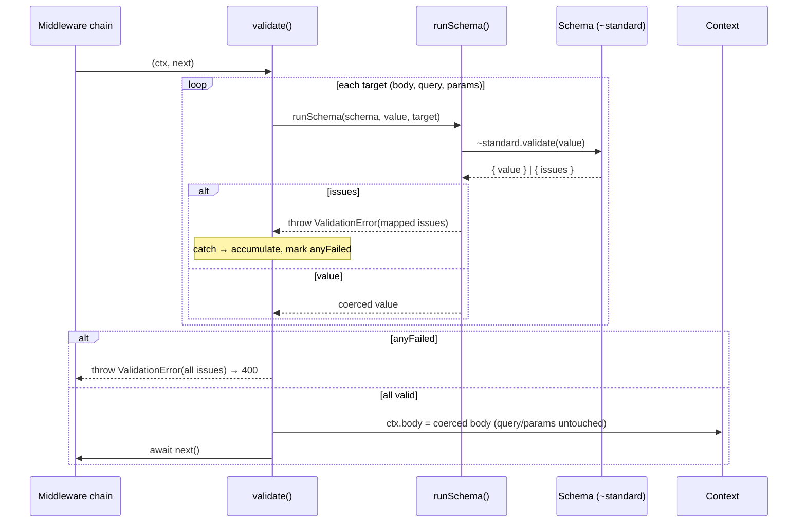
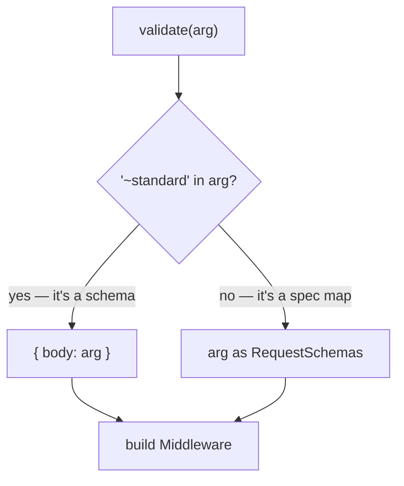

# @nextrush/validation Architecture

> Internal design of the validation runner, the middleware, and the issue mapping.

## Overview

`@nextrush/validation` does one job: run a developer's schema against a request part and turn the result into either a coerced value or the framework's existing `ValidationError`. It couples to exactly one external surface — the [Standard Schema](https://standardschema.dev) `~standard` property — so it never depends on Zod, Valibot, or any specific library.

### Design Principles

1. **One contract touch-point.** Only `run-schema.ts` reads `schema['~standard']`. Everything else is framework wiring.
2. **Reuse the framework's error.** Failures throw `@nextrush/errors` `ValidationError`, rendered by the existing `errorHandler` — no new error type.
3. **Honest mutation only.** `ctx.body` (typed `unknown`) is overwritten with the coerced value; `ctx.query`/`ctx.params` (typed as strings) are validated but never mutated, so TypeScript is never wrong about them.
4. **Zero dependencies.** The Standard Schema type is vendored (`standard-schema.ts`), not imported.

---

## Module Structure

```text
src/
  index.ts            # public barrel — exports validate + re-exports ValidationError
  validate.ts         # validate() overload → the Middleware (orchestration)
  run-schema.ts       # runSchema() — the single Standard Schema contract touch-point
  issues.ts           # Standard Schema issues → @nextrush/errors ValidationIssue (joinPath)
  standard-schema.ts  # vendored Standard Schema v1 type (zero-dependency)
  types.ts            # internal RequestSchemas / ValidationTarget (not exported)
```

### Responsibilities

| Module | Responsibility |
| --- | --- |
| `validate.ts` | Overload discrimination, per-target orchestration, aggregation, atomic body overwrite, `next()` |
| `run-schema.ts` | Call `~standard.validate`, await if async, throw `ValidationError` on issues, return coerced value |
| `issues.ts` | `joinPath` (path array → `body.items[0].name`) and `mapIssues` (→ `ValidationIssue[]`) |
| `standard-schema.ts` | The only definition of the external contract; vendored type |
| `types.ts` | Internal target/spec types, intentionally unexported |

---

## Request Lifecycle



Every target is checked **before** any mutation, so a later failure never leaves `ctx.body` half-updated (atomicity).

---

## Overload Discrimination

`validate(arg)` accepts either a schema or a `{ body, query, params }` map. They are told apart by a single structural check:



A schema always carries `~standard`; a spec map never does. The check is unambiguous at runtime and resolved by overloads at the type level, so callers get precise types with no generics.

---

## Issue Mapping

Standard Schema reports `{ message, path? }` where `path` is an array of keys or `{ key }` segments. `joinPath` renders it as a stable, prefixed string:

| Input path | Output (`prefix = 'body'`) |
| --- | --- |
| `['email']` | `body.email` |
| `['address', 'zip']` | `body.address.zip` |
| `[{ key: 'items' }, 0, { key: 'name' }]` | `body.items[0].name` |
| `undefined` / `[]` | `body` |

Numeric segments become `[n]` (array indices); everything else becomes `.key`. The offending **value is never carried across** — Standard Schema issues don't expose it, and `ValidationError.toJSON()` strips `received` regardless — so invalid input cannot leak into a response.

---

## Why the Runner Throws but the Middleware Aggregates

`runSchema()` throws on the first failure — that is the right shape for a single reusable unit. But `validate()` may check several targets and must report them **together**. So the middleware wraps each `runSchema` call, catches `ValidationError`, accumulates its issues, and throws once at the end:

- A caught `ValidationError` → issues pushed, target marked failed.
- Any **other** thrown error (a schema whose `validate()` itself throws) → re-thrown untouched, never folded into the 400.
- Failure is tracked with an explicit `anyFailed` flag, not `issues.length`, so a schema that fails with an empty issues array still rejects — validation never silently passes.

---

## Testing Strategy

| Layer | Coverage |
| --- | --- |
| Unit (`run-schema`, `issues`) | Success, sync/async failure, path joining (nested, `{key}`, numeric, empty), prefixing, aggregation — driven by a hand-written fake schema (no Zod dependency) |
| Unit (`validate`) | Body overwrite, query/params left unmodified, cross-target aggregation, atomicity, empty spec |
| Security | undefined/primitive body, schema throwing (propagates), async rejection, empty-issues rejection, prototype-pollution-safe paths, no raw-value leak, symbol segments |
| Integration | Real Zod — coercion, documented 400 shape, query stays a string, params+body together, no secret leak |

100% statement/branch/function/line coverage; thresholds enforced at 90/85/90/90 per `v3-testing.instructions.md`.

## See Also

- [`README.md`](./README.md) — usage and API reference
- [`docs/RFC/RFC-NEXTRUSH-VALIDATION.md`](../../../docs/RFC/RFC-NEXTRUSH-VALIDATION.md) — design rationale and revision history
