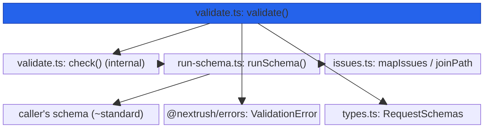
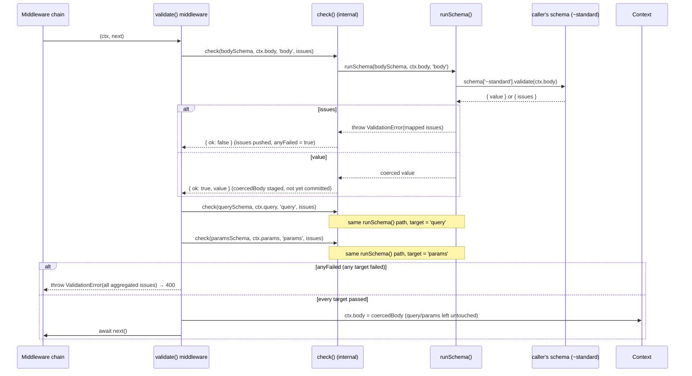

# @nextrush/validation — Architecture

> Internal design of the validation runner, the Standard Schema contract touch-point, and the issue-mapping pipeline that turns a schema's result into either a coerced value or the framework's existing `ValidationError`.

## At a glance

|  |  |
| --- | --- |
| **Package** | `@nextrush/validation` |
| **Layer** | `middleware` (above `types`/`errors`; below nothing — a leaf middleware) |
| **Depends on** | `@nextrush/types` (the `StandardSchemaV1`/`InferOutput` contract, types only) and `@nextrush/errors` (`ValidationError`, a runtime class) |
| **Depended on by** | Application code that calls `app.use(validate(schema))`; `@nextrush/openapi` reads the route metadata this package attaches, but does not import this package directly |
| **Public entry** | `src/index.ts` (barrel — exports only) |
| **Internal modules** | 4 files (excl. tests) · ~180 LOC · largest `validate.ts` (91 LOC) — well within the 300-line package cap |
| **On the request hot path?** | Yes — runs on every request once registered, for whichever route it's applied to |
| **Runtime coupling** | None — zero `node:` imports; the only external surface touched is the schema's `~standard.validate()` method |
| **State model** | Stateless per request — no state is shared or accumulated across requests |

## Responsibilities

**This package owns:**

- **Running a Standard Schema against a request part** (`body`, `query`, or `params`) via the single `~standard` contract touch-point in `run-schema.ts`
- **Aggregating validation issues across multiple targets** into one `ValidationError`, rather than throwing on the first failure
- **The atomic body overwrite** — `ctx.body` is only ever replaced with the coerced value after every target has been checked, never mid-validation
- **Mapping Standard Schema issue paths** (`['address', 'zip']`, `[{ key: 'items' }, 0]`) into the flat, prefixed string paths (`body.address.zip`, `body.items[0]`) the framework's error shape expects
- **Contributing request-schema metadata to the route** (via `@nextrush/types`'s `ROUTE_METADATA` symbol) for `@nextrush/openapi` to read at spec-generation time

**This package does NOT own:**

- Reading or parsing the request body stream → `@nextrush/body-parser`; `validate()` only ever reads the already-parsed `ctx.body`
- The schema DSL itself (`z.object()`, `v.string()`, etc.) → the schema library the caller brings (Zod, Valibot, ArkType)
- The `ValidationError` class or its `toJSON()`/`toFlatObject()` methods → `@nextrush/errors`; this package only constructs and throws it
- Rendering the error response → the framework's existing `errorHandler`, which already knows how to render any `HttpError` subclass
- The middleware execution engine (`compose`, `ctx.next()`) → `@nextrush/core`

## Non-goals

The package intentionally does not:

- Provide its own schema DSL — this would force every caller onto a NextRush-specific validation language instead of the library they already use
- Coerce `ctx.query`/`ctx.params` in place — they are validated but left as their original string form, because overwriting them would make their declared `string` type disagree with a coerced runtime value (a `number`, a `boolean`)
- Validate the response body — planned alongside `@nextrush/openapi`, not implemented here
- Retry, sanitize, or auto-correct invalid input — a validation failure always rejects the request; there is no best-effort repair path

## Constraints

Must remain:

- **Runtime-independent** — zero `node:*` imports; the only work done per request is calling `schema['~standard'].validate(value)` and mapping its result
- **Single external contract touch-point** — only `run-schema.ts` reads `schema['~standard']`; every other module is framework wiring around that one call
- **Zero schema-library dependency** — the package must never import Zod, Valibot, ArkType, or any other schema library; `zod` appears only as a devDependency for this package's own tests
- **ESM-only** — no CommonJS build
- **Fail-closed** — a schema that signals failure, even with an empty issues array, must reject the request; validation must never silently pass
- **Public API sealed** — the exported surface is semver-guarded (ADR-0005)

## Position in the package hierarchy

```mermaid
block-beta
    columns 5
    types["@nextrush/types"]:1
    space:1
    errors["@nextrush/errors"]:1
    space:1
    core["@nextrush/core"]:1
    space:5
    router["@nextrush/router"]:1
    space:3
    class["@nextrush/class"]:1
    space:5
    adapters["adapter-node / bun / deno / edge"]:5
    space:5
    block:mw:5
        columns 5
        bodyparser["body-parser"]:1
        cors["cors"]:1
        helmet["helmet"]:1
        THIS["validation (this package)"]:1
        etc["... other middleware"]:1
    end

    types --> errors --> core --> router --> class --> adapters --> mw

    classDef here fill:#2563eb,color:#fff,stroke:#1e40af;
    class THIS here
```

> [!IMPORTANT]
> Imports flow **downward only**. `@nextrush/validation` imports from `@nextrush/types` and
> `@nextrush/errors` only, and MUST NOT be imported by `types`, `errors`, `core`, `router`, `class`,
> or any adapter (project-rules §1). It sits at the middleware layer as a leaf: nothing in the
> framework core depends on it — an application opts in by calling `app.use(validate(schema))`.

**Dependency rules:**
- **Allowed:** `validation → types` · `validation → errors`
- **Forbidden:** `validation → core / router / class / adapters / any other middleware package / any schema library`

---

## Overview

The package answers one question on every validated request: *given a request part and a schema someone else wrote, does this value pass, and if not, what is the single, framework-standard error that describes every failure across every target checked?* The organizing idea is a **check-then-commit** pipeline — `validate()` runs every configured target (`body`, `query`, `params`) against its schema, collecting issues from each one without mutating anything, and only after every target has been checked does it either throw one aggregated `ValidationError` or commit the one mutation the package makes (`ctx.body = coercedValue`).

Unlike `@nextrush/helmet` or `@nextrush/cors`, this package's core logic touches exactly one external surface: the [Standard Schema](https://standardschema.dev) `~standard` property. Because TypeScript's structural typing means any object exposing that property satisfies `StandardSchemaV1`, `run-schema.ts` never imports, checks for, or special-cases a specific schema library — a Zod schema, a Valibot schema, and a hand-written test fake all flow through the exact same code path. This package's own test suite exercises that path with real Zod (`integration.test.ts`, `zod` as a devDependency) and with hand-written fake schemas covering the interface generically; it does not run Valibot or ArkType through its own tests — their compatibility follows from the shared `~standard` contract, not from this package's test coverage of them specifically.

### Design principles

1. **One contract touch-point.** Only `run-schema.ts` reads `schema['~standard']`. Every other module — `validate.ts`, `issues.ts` — is framework wiring around that single call, enforced by the fact that no other file imports a `StandardSchemaV1` value to call `.validate()` on it directly.
2. **Reuse the framework's existing error, don't invent one.** Every failure throws `@nextrush/errors`'s `ValidationError`, already rendered by the framework's `errorHandler` — `run-schema.ts` and `validate.ts` construct it, neither defines a new error class.
3. **Honest mutation only.** `ctx.body` (typed `unknown` in `Context`) is overwritten with the coerced value; `ctx.query`/`ctx.params` (typed as string maps) are validated but never mutated — enforced by `validate.ts`'s structure, where only the `body` branch assigns to `ctx.body` and no branch assigns to `ctx.query`/`ctx.params`.
4. **Failure is tracked explicitly, never inferred from array length.** `validate.ts`'s `anyFailed` boolean is set on a caught `ValidationError`, not derived from `issues.length` — so a schema that fails with an empty issues array still rejects the request.
5. **A non-validation error is never folded into the 400.** `check()` in `validate.ts` only catches and accumulates an `err instanceof ValidationError`; any other thrown error (a bug in the schema library itself) re-throws unchanged, so it surfaces as the 500 it actually is rather than being disguised as a client input error.

---

## Module structure

```text
src/
├── index.ts        # Public API barrel (exports validate + re-exports ValidationError) — 20 LOC
├── validate.ts      # validate() — overload discrimination, per-target orchestration, atomic commit — 91 LOC
├── run-schema.ts     # runSchema() — the single Standard Schema contract touch-point — 32 LOC
├── issues.ts         # joinPath / mapIssues — Standard Schema issues → ValidationIssue[] — 45 LOC
└── types.ts          # Internal ValidationTarget / RequestSchemas (intentionally unexported) — 12 LOC
```

> [!NOTE]
> The `StandardSchemaV1` contract itself is **not** vendored inside this package — it lives in
> `@nextrush/types` (`src/standard-schema.ts`) as a shared type, because route metadata and
> `@nextrush/openapi` also reference it. This package only imports it as a type; there is no local
> `standard-schema.ts` file here.

### Module responsibilities

| Module | Responsibility (the one thing it owns) |
| ------ | -------------------------------------- |
| `validate.ts` | Overload discrimination (schema vs. spec map), per-target orchestration, issue aggregation, the atomic `ctx.body` commit, and contributing route metadata. |
| `run-schema.ts` | Calling `schema['~standard'].validate(value)`, awaiting it if async, and throwing a `ValidationError` on issues — the only file that touches the external contract. |
| `issues.ts` | `joinPath` (path segments → a dotted/bracketed string) and `mapIssues` (Standard Schema issues → `@nextrush/errors` `ValidationIssue[]`). |
| `types.ts` | The internal `ValidationTarget`/`RequestSchemas` types — never exported from the package barrel. |

## Component relationships



`validate.ts` never calls `schema['~standard'].validate()` directly — every schema invocation goes
through `run-schema.ts`, so the single contract touch-point is never bypassed by a new code path.

---

## Lifecycle

### Request → response (execution sequence)

How a request with `{ body, query, params }` all configured flows through `validate()`:



The ordering a reader would otherwise get wrong: **every** target is checked before **any**
mutation happens. Even if `body` validates successfully, its coerced value is only staged in a
local variable — `ctx.body` is not written until `query` and `params` have also been checked and
neither failed. This is what makes the commit atomic: a request that passes `body` but fails
`query` never leaves `ctx.body` partially overwritten.

### Issue aggregation (why the runner throws but the middleware collects)

```mermaid
stateDiagram-v2
    [*] --> Checking: validate() begins checking targets
    Checking --> TargetPassed: runSchema() returns a value
    Checking --> TargetFailed: runSchema() throws ValidationError
    Checking --> Propagated: runSchema() throws a non-ValidationError

    TargetPassed --> Checking: more targets remain
    TargetFailed --> Checking: issues pushed, anyFailed = true,\nmore targets remain

    TargetPassed --> AllChecked: no targets remain
    TargetFailed --> AllChecked: no targets remain

    AllChecked --> Rejected: anyFailed is true\n(throw ValidationError with ALL issues)
    AllChecked --> Committed: anyFailed is false\n(ctx.body = coerced value; next())

    Propagated --> [*]: re-thrown unchanged — never folded into the 400
    Rejected --> [*]
    Committed --> [*]
```



> [!NOTE]
> `runSchema()` throws on the **first** failure for a single target — that's the correct shape
> for a small, reusable unit that only ever validates one value. `validate()` wraps each call in
> `check()`, catches only `ValidationError`, and accumulates its issues so that a request failing
> on both `body` and `query` gets one response describing both, not two round trips of discovery.

## State ownership

| Owner | State it owns | Scope |
| ----- | -------------- | ----- |
| `validate()`'s closure | The `schemas: RequestSchemas` map, resolved once when `validate(arg)` is called | app — computed once per route registration |
| `validate()`'s middleware invocation | `issues[]`, `anyFailed`, `coercedBody`, `bodyValidated` — all local to one request | per request |
| `Context` (owned by `core`/the adapter) | `ctx.body` (overwritten on success), `ctx.query`/`ctx.params` (read, never written) | per request |
| *(none)* | No module-level mutable state exists in this package | — |

There is no app-scoped or cross-request mutable state. Every accumulator (`issues`, `anyFailed`,
`coercedBody`) is declared fresh inside the middleware function on every invocation — nothing is
closed over across requests except the immutable `schemas` map itself.

## Data structures

```ts
// The only two internal types (types.ts) — intentionally unexported; callers only
// ever write validate(schema) or validate({ body, query, params }), never these names.
type ValidationTarget = 'body' | 'query' | 'params';
type RequestSchemas = Partial<Record<ValidationTarget, StandardSchemaV1>>;

// The external contract this package depends on (@nextrush/types), reproduced here
// for reference — NOT vendored locally in this package's src/.
interface StandardSchemaV1<Input = unknown, Output = Input> {
  readonly '~standard': {
    readonly version: 1;
    readonly vendor: string;
    readonly validate: (value: unknown) =>
      | { readonly value: Output; readonly issues?: undefined }
      | { readonly issues: readonly StandardSchemaIssue[] }
      | Promise<...>;
    readonly types?: { readonly input: Input; readonly output: Output };
  };
}
```

The shape choice for `RequestSchemas` as a `Partial<Record<...>>` (rather than three separate
optional parameters) is deliberate: it lets `validate()` accept either a bare schema (normalized
internally to `{ body: schema }`) or the map form through a single parameter, discriminated by one
structural check (`'~standard' in arg`) — a schema object always carries that property, a spec map
never does.

## Concurrency & edge behaviour

- **Shared, immutable after construction:** the `schemas` map closed over by the returned middleware — resolved once when `validate(arg)` is called, read on every request, never mutated.
- **Per-request, never shared:** `issues[]`, `anyFailed`, `coercedBody`, `bodyValidated` — declared fresh inside the middleware function body on every call, never stored on `ctx` or any module-level variable.
- **Idempotency:** validating the same input against the same schema always produces the same result — this package introduces no randomness, clock dependency, or ordering effect of its own; any non-determinism would come from the schema library itself.
- **Async schemas:** `runSchema()` awaits the schema's `validate()` result only when it's a `Promise` (`result instanceof Promise`), so a synchronous Standard Schema (most Zod/Valibot/ArkType schemas) incurs no extra microtask.

> [!WARNING]
> A schema whose own `~standard.validate()` implementation throws (rather than returning
> `{ issues }`) is **not** a validation failure by this package's model — `check()`'s catch clause
> only recognizes `err instanceof ValidationError`; any other thrown error re-throws unchanged and
> will surface as an unhandled 500, not a 400. A contributor debugging "why did this schema error
> skip the aggregated `400`" should confirm the schema library returns `{ issues }` rather than
> throwing on invalid input.

## Trust boundaries

```text
Request body / query / params (attacker-controlled input)
   │
   ▼
runSchema()  -- the single call into the caller's schema's ~standard.validate()   <- this package's boundary
   │
   ▼
mapIssues() / joinPath()  -- issue paths become display strings only; the offending VALUE is never carried across
   │
   ▼
ValidationError(issues)  -- .toJSON() strips `received` regardless (enforced in @nextrush/errors)
```

This package's trust boundary is narrower than `@nextrush/helmet`'s or `@nextrush/body-parser`'s:
it does not decode bytes, enforce size limits, or block prototype-pollution keys itself — those
boundaries belong to `@nextrush/body-parser` (for `ctx.body`) and the router (for `ctx.params`)
upstream. What this package guarantees is narrower and specific: whatever a schema rejects never
reaches the handler, and whatever value a schema rejected never reaches the client in the error
response, because `joinPath()` only ever renders a **path** (a label like `body.items[0].name`)
into the aggregated issue — never the value at that path.

## Extension points

**Supported extension points:**

- **Any Standard Schema library** — the sanctioned way to extend what this package validates; no
  NextRush-specific adapter is ever required, by the structural nature of the `~standard` contract.
- **The `{ body, query, params }` spec map** — the sanctioned way to validate more than one request
  part in a single `validate()` call.
- **Catching `ValidationError` explicitly** — callers needing custom error rendering re-export the
  same class this package throws, per the Quick start/Troubleshooting examples.

**Forbidden (sealed):**

- **A second code path that calls `schema['~standard'].validate()` directly** — every schema
  invocation is centralized in `run-schema.ts` so a future feature can't bypass the issue-mapping
  or error-construction it performs.
- **Mutating `ctx.query`/`ctx.params` in place** — removing this restriction would make their
  declared `string` type disagree with a coerced runtime value; see Design principle 3.
- **Carrying the raw input value into a `ValidationError`'s issues** — `mapIssues()` only ever maps
  `{ path, message }`; reintroducing a `received` value at this layer would undermine the framework
  error's existing `toJSON()` redaction.

---

## Architectural invariants

These are part of the package's architecture. They do not change without an RFC:

- **Only `run-schema.ts` reads `schema['~standard']`** — every other module reaches the schema contract exclusively through `runSchema()`.
- **Every target is checked before any mutation** — `ctx.body` is only ever written after every configured target (`body`, `query`, `params`) has passed.
- **Failure is tracked by an explicit flag, never by `issues.length`** — a schema failing with zero issues still rejects the request.
- **`ctx.query`/`ctx.params` are validated but never mutated** — only `ctx.body` is ever overwritten by this package.
- **A non-`ValidationError` thrown by a schema propagates unchanged** — it is never folded into the aggregated `400`.
- **The package imports no runtime API** — zero `node:*` imports; the only external dependency touched at runtime is whatever schema object the caller passes in.

## Engineering decisions

| Decision | Chosen | Trade-off accepted | Reference |
| -------- | ------ | ------------------- | --------- |
| Contract touch-point centralization | Only `run-schema.ts` calls `schema['~standard'].validate()` | Every new feature that needs schema output must route through `runSchema()`, even when it feels like it could inline the call | `run-schema.ts` |
| Failure tracking | An explicit `anyFailed` boolean, not `issues.length > 0` | One extra local variable, in exchange for correctly rejecting a schema that fails with an empty issues array | `validate.ts` |
| Query/params mutation policy | Validated but never overwritten, unlike `ctx.body` | Callers must coerce `ctx.query`/`ctx.params` explicitly after validation; no free type-narrowing on those two targets | `validate.ts`, README's "One source of truth" |
| Error reuse | Throws the framework's existing `@nextrush/errors` `ValidationError` rather than defining a new error class | Couples this package to `@nextrush/errors`'s issue shape (`path`, `message`, `rule?`, `expected?`, `received?`) instead of owning its own | `run-schema.ts`, `issues.ts` |
| Standard Schema type location | Lives in `@nextrush/types`, imported here as a type — not vendored locally in this package | This package can't be built or typechecked in complete isolation from `@nextrush/types`, in exchange for one shared contract used consistently by validation, route metadata, and `@nextrush/openapi` | `@nextrush/types/src/standard-schema.ts` |

## Rejected alternatives

### A framework-provided schema DSL
Rejected: shipping a NextRush-specific validation language would force every adopter onto that DSL
or require an adapter layer per external library — the opposite of the "your schema library is the
DSL" position this package exists to take. Standard Schema already solves the interop problem
structurally; adding a second DSL on top would be redundant.

### Vendoring the Standard Schema type inside this package
Rejected (and previously misdocumented — see the note under Module structure): the contract is now
shared by request validation, route metadata, and `@nextrush/openapi`, so it lives once in
`@nextrush/types` rather than being duplicated per consumer. A prior version of this document
incorrectly claimed a local `standard-schema.ts` vendored copy; no such file exists in this
package's `src/`.

### Coercing `ctx.query`/`ctx.params` the same way `ctx.body` is coerced
Rejected for now: `Context`'s declared types for `query`/`params` are string maps, and overwriting
them with a schema's coerced output would silently disagree with that declared type. A typed,
non-breaking upgrade path is tracked as future work rather than implemented as a type-unsafe
shortcut today.

---

## Testing strategy

- **Unit (`run-schema`, `issues`):** success, sync/async schema failure, path joining (nested, `{ key }` segments, numeric/array indices, empty path), prefixing, aggregation — driven by hand-written fake schemas (`_helpers.ts`'s `fake()`), with no dependency on Zod in the unit layer.
- **Unit (`validate`):** body overwrite, query/params left unmodified, cross-target aggregation, atomicity (a later-target failure never leaves `ctx.body` partially overwritten), empty spec map behavior — also via hand-written fake schemas.
- **Security:** undefined/primitive body input, a schema whose `validate()` itself throws (propagates, not swallowed), async rejection, empty-issues-array rejection, prototype-pollution-safe path rendering (`__proto__`/`constructor.prototype` issue paths), confirmation that no raw value leaks into an error response, symbol-keyed path segments.
- **Integration:** a real Zod schema (`integration.test.ts`; `zod` is this package's only schema-library devDependency) — coercion, the documented `400` shape, confirming query stays a string after validation, body+params+query together, confirming no secret leaks through the aggregated error. **Valibot and ArkType are not exercised by this package's test suite** — their compatibility rests on the shared Standard Schema contract (verified generically via the hand-written fakes above), not on library-specific integration tests.
- **Coverage:** this package's `vitest.config.ts` enforces 90/85/90/90 (lines/branches/functions/statements) via the v8 provider, `index.ts` excluded from the coverage target.

## Evolution strategy

- **Stable (semver-guarded):** the sealed public surface — `validate()`, the re-exported `ValidationError` and `ValidationIssue` type (ADR-0005).
- **May change without notice:** the internal module split (`validate.ts` vs. `run-schema.ts` vs. `issues.ts`), the exact wording of internal comments, the `ROUTE_METADATA` contribution's internal shape (as long as `@nextrush/openapi` continues to read it correctly).
- **Changes only via RFC:** whether `ctx.query`/`ctx.params` are mutated on success, the error type thrown on failure, and the "check every target before mutating anything" atomicity guarantee.

**Timeline:** 1.0 — initial Standard Schema validation middleware (body/query/params, issue aggregation, route metadata contribution for OpenAPI).

## Contributor notes

Before changing this package, read: [Standard Schema](https://standardschema.dev)'s spec (the
external contract `run-schema.ts` depends on), `@nextrush/types/src/standard-schema.ts` (the
vendored type this package imports), and `@nextrush/errors/src/validation.ts` (the `ValidationError`
shape this package's output must keep matching) — any change to how issues are aggregated or how
`ctx.body` is committed is a public-behavior change and should be treated as RFC-gated per this
document's invariants.

## Architecture checklist

Before changing this package, confirm:

- [ ] Does this preserve the architectural invariants above (especially the single contract touch-point and check-before-mutate ordering)?
- [ ] Does this increase coupling or cross a dependency rule (`validation → types` and `validation → errors` only)?
- [ ] Does this affect the request hot path (extra allocations in `validate()`'s per-request closure)?
- [ ] Does this change the sealed public API (semver / ADR-0005)? Does it need an RFC?
- [ ] If this touches issue mapping or the failure-tracking logic, does it remain fail-closed (an empty issues array must still reject)?

---

## References & see also

- **README (how to use it):** [`./README.md`](./README.md)
- **ADR:** [`ADR-0005 — package tiers & sealed surface`](https://github.com/0xTanzim/nextRush/blob/main/docs/adr/ADR-0005-package-tiers-sealed-surface-deprecation.md)
- **Governing RFC:** [`docs/RFC/request-data/004-validation.md`](../../../docs/RFC/request-data/004-validation.md) — design rationale and revision history
- **Standard Schema contract:** `packages/types/src/standard-schema.ts` — the vendored type this package imports
- **Documentation site:** [nextRush docs](https://0xtanzim.github.io/nextRush/docs)
- **Repository:** [`packages/middleware/validation`](https://github.com/0xTanzim/nextRush/tree/main/packages/middleware/validation)
