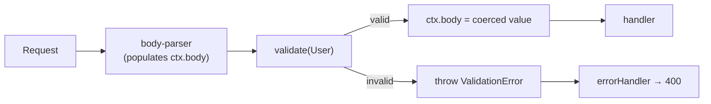

# @nextrush/validation

> Request validation for NextRush — bring your own schema library (Zod, Valibot, ArkType, or any Standard Schema).

**Support tier:** Public — middleware/registrar (stable). See [ADR-0005](../../../docs/adr/ADR-0005-package-tiers-sealed-surface-deprecation.md).

## The Problem

Validating request input is something every API does, yet hand-rolled validation is where bugs and inconsistency creep in:

- **Every handler reinvents it.** Type checks, presence checks, and format checks are copy-pasted per route, each slightly different.
- **Error shapes drift.** One route returns `{ error: 'bad email' }`, another `{ errors: [...] }` — clients can't rely on anything.
- **`ctx.body` stays `unknown`.** Without a validation step, the handler works with untyped data and casts by hope.
- **Locking into one library hurts.** A framework that ships its own validator forces its DSL on you, or an adapter per schema library.

NextRush ships the *glue*, not a validator. You bring the schema library you already use; NextRush validates against it and produces one consistent, secure error.

## Mental Model

`validate()` sits between body-parsing and your handler. It runs your schema, and on success the coerced body **replaces** `ctx.body` — there is no second "validated" object to reach for.



## Runtime Support

**Edge-safe.** Glue code around a Standard Schema validator — zero `node:` imports. Safe on Node,
Bun, Deno, Cloudflare Workers, Vercel Edge, and Netlify Edge (portability of the validator library
you bring, e.g. Zod/Valibot/ArkType, depends on that library's own runtime support).

## Installation

```bash
pnpm add @nextrush/validation
```

Bring any Standard Schema library — for example Zod:

```bash
pnpm add zod
```

## Golden Path

Pass a schema, get a middleware. On success, `ctx.body` **is** the validated, coerced value.

```typescript
import { createApp } from '@nextrush/core';
import { json } from '@nextrush/body-parser';
import { validate } from '@nextrush/validation';
import { z } from 'zod';

const app = createApp();

const User = z.object({ name: z.string().min(1), email: z.string().email() });

app.post('/users', json(), validate(User), (ctx) => {
  const body = ctx.body; // validated + coerced
  ctx.status = 201;
  ctx.json(body);
});
```

No accessor, no generic, no options bag. Invalid input never reaches the handler.

## Works With Any Schema Library

Your schema library **is** the validation DSL. Anything implementing [Standard Schema](https://standardschema.dev) works identically — no adapter, no config:

```typescript
// Zod
import { z } from 'zod';
const User = z.object({ name: z.string(), email: z.string().email() });

// Valibot
import * as v from 'valibot';
const User = v.object({ name: v.string(), email: v.pipe(v.string(), v.email()) });

// ArkType
import { type } from 'arktype';
const User = type({ name: 'string', email: 'string.email' });
```

All three drop into the same call unchanged:

```typescript
app.post('/users', validate(User), handler);
```

Zod (3.24+), Valibot (1.0+), and ArkType (2.0+) all expose the Standard Schema interface, so `validate()` never knows or cares which library produced the schema. Switch libraries later and your routes don't change.

## Advanced — Params & Query

Validate several parts of the request at once. A query-only case (a search endpoint):

```typescript
const SearchQuery = z.object({ q: z.string().min(1), sort: z.enum(['asc', 'desc']) });

app.get('/search', validate({ query: SearchQuery }), (ctx) => {
  const { q, sort } = ctx.query; // rejected pre-handler if invalid
  ctx.json({ q, sort });
});
```

All three targets together:

```typescript
app.get('/users/:id',
  validate({
    body: UpdateUser,                                   // overwritten in place
    params: z.object({ id: z.string().uuid() }),        // validated, left unmodified
    query: z.object({ sort: z.enum(['asc', 'desc']) }), // validated, left unmodified
  }),
  (ctx) => {
    const body = ctx.body;
    const { id } = ctx.params;
    const { sort } = ctx.query;
    ctx.json({ id, sort, body });
  },
);
```

Issues from every target aggregate into a single `400`.

## One Source of Truth

| Target | On success | `ctx.*` after validation |
| --- | --- | --- |
| **body** | validate + coerce + **overwrite `ctx.body`** | the coerced value |
| **params** | validate; leave unmodified | the original `string` values |
| **query** | validate; leave unmodified | the original `string` / `string[]` values |

**Why body overwrites and query/params don't:** `ctx.body` is typed `unknown`, so replacing it with the coerced object is honest — the type never disagrees with the runtime. `ctx.query`/`ctx.params` are declared as `string` maps; writing a coerced `number` back would make TypeScript report `string` while the runtime holds a `number` — a footgun. So query and params are **validated but intentionally left unmodified**: bad input is rejected, and what you read is exactly what the URL contained.

```typescript
// query is validated (rejects bad input) but stays a string — coerce explicitly:
const page = Number(ctx.query.page);
```

## Middleware Order — `validate` Does Not Parse

`validate()` validates the **already-parsed** `ctx.body`. It does not read or parse the request stream — parsing is body-parser's job. Place `validate()` **after** the body parser:

```typescript
app.post('/users',
  json(),          // 1. parses the body → ctx.body
  validate(User),  // 2. validates ctx.body, replaces it with the coerced value
  handler,         // 3. reads the validated ctx.body
);
```

If no body parser ran, `ctx.body` is `undefined` and the schema decides the outcome (a required object schema fails with a `400`). Query and params are populated by the router, so they need no parser.

## Errors

Every failure throws the framework's existing `ValidationError` (from `@nextrush/errors`) — no new error type, no custom formatter. It is already rendered by the framework's `errorHandler`, and its `toJSON()` strips raw input so passwords and tokens never leak. Issues aggregate across all validated targets, path-prefixed by target:

```json
{
  "error": "ValidationError",
  "message": "Validation failed",
  "code": "VALIDATION_ERROR",
  "status": 400,
  "issues": [
    { "path": "body.email", "message": "Invalid email address" },
    { "path": "query.sort", "message": "Invalid enum value. Expected 'asc' | 'desc'" }
  ]
}
```

Catch it explicitly if you need to:

```typescript
import { ValidationError } from '@nextrush/validation';

app.use(async (ctx, next) => {
  try {
    await next();
  } catch (err) {
    if (err instanceof ValidationError) {
      ctx.status = 400;
      ctx.json(err.toJSON());
      return;
    }
    throw err;
  }
});
```

## API Reference

### `validate(schema)` / `validate(spec)`

Create request-validation middleware.

| Form | Validates |
| --- | --- |
| `validate(schema)` | the request body against `schema` |
| `validate({ body?, query?, params? })` | each provided target against its schema |

**Behavior:**

- On success: overwrites `ctx.body` with the coerced value; leaves `ctx.query`/`ctx.params` unmodified; calls `next()`.
- On failure: throws `ValidationError` aggregating every issue across every target (never calls `next()`).
- Atomic: if any target fails, `ctx.body` is **not** overwritten.
- A schema whose own `validate()` throws (not a validation failure) propagates unchanged — it is never swallowed into the 400.

### `ValidationError`

Re-exported from `@nextrush/errors` for a single import site. See `@nextrush/errors` for its full API (`issues`, `hasErrorFor`, `toFlatObject`, `toJSON`, …).

## Security

- **Raw input never leaks.** Standard Schema issues do not carry the offending value, and `ValidationError.toJSON()` strips `received` — invalid passwords or tokens never appear in the error response.
- **No prototype pollution.** Issue paths are only ever joined into display strings (`body.__proto__.x` is a label, not an assignment); `validate` performs no object merging.
- **Fail-closed.** A schema that signals failure — even with an empty issues array — rejects the request. Validation never silently passes.
- **Validate before you trust.** Place `validate()` before any middleware or handler that acts on `ctx.body`.

## Runtime Compatibility

Pure middleware with zero runtime dependencies — runs anywhere NextRush runs.

| Runtime | Supported |
| --- | --- |
| Node.js 22+ | ✅ |
| Bun 1.0+ | ✅ |
| Deno 1.0+ | ✅ |
| Cloudflare Workers / Vercel Edge | ✅ |

## Non-Goals

- **Coercing `ctx.query` / `ctx.params`** — validated but left unmodified (see [One Source of Truth](#one-source-of-truth)); typed coercion is a planned non-breaking upgrade.
- **A schema DSL** — your schema library is the DSL.
- **Body parsing** — that is `@nextrush/body-parser`'s job.
- **Response validation** — planned alongside `@nextrush/openapi`.
- **Decorator integration** (`@Body(schema)`) — planned once the middleware API is stable.

## See Also

- [Architecture](./ARCHITECTURE.md) — how `validate` runs a schema and maps issues
- [`@nextrush/errors`](../../errors) — the `ValidationError` this package throws
- [`@nextrush/body-parser`](../body-parser) — populates `ctx.body` before validation
- [Standard Schema](https://standardschema.dev) — the interop spec

## License

MIT © [Tanzim Hossain](https://github.com/0xTanzim)
