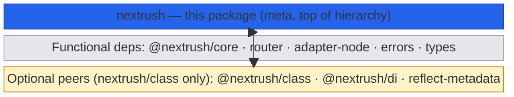
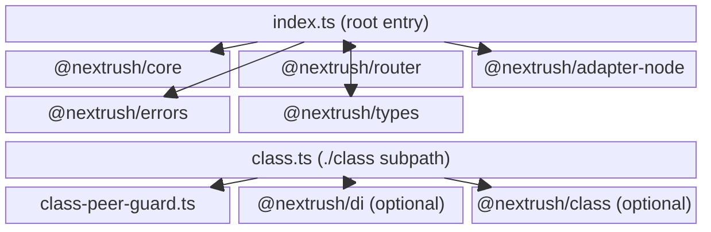
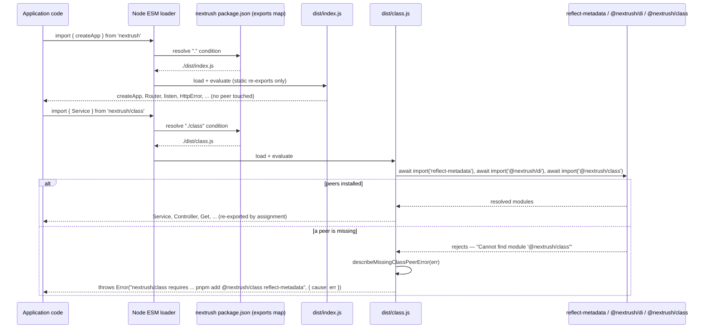
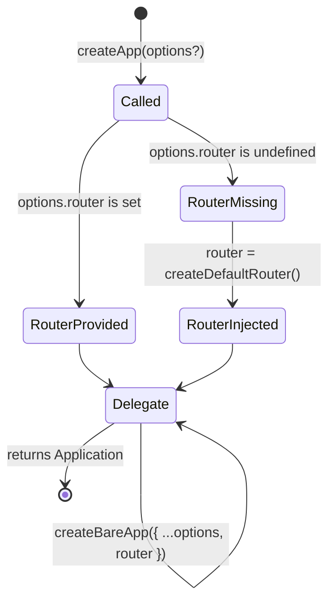

# nextrush — Architecture

> Internal design of the `nextrush` meta package — how its two entry points (`nextrush` and
> `nextrush/class`) route through `package.json`'s `exports` map, how the root barrel wraps
> `@nextrush/core`'s `createApp` to inject a default router, and how the `nextrush/class` subpath
> turns a missing optional peer into an actionable error instead of a crash.

## At a glance

|  |  |
| --- | --- |
| **Package** | `nextrush` |
| **Layer** | Meta package — top of the hierarchy; re-exports, does not implement |
| **Depends on** | `@nextrush/core`, `@nextrush/router`, `@nextrush/adapter-node`, `@nextrush/errors`, `@nextrush/types` (hard deps) · `@nextrush/class`, `@nextrush/di`, `reflect-metadata` (optional peers) |
| **Depended on by** | Application code; `create-nextrush` scaffolds projects that depend on it |
| **Public entry** | `src/index.ts` (root, `.`) and `src/class.ts` (subpath, `./class`) — both barrels, one with one wrapper function |
| **Internal modules** | 3 files · ~250 LOC combined · largest `class.ts` ~150 LOC |
| **On the request hot path?** | No — this package only wires objects together at module-load and `createApp()` time; the request path runs entirely inside `@nextrush/core`/`@nextrush/router`/`@nextrush/adapter-node` |
| **Runtime coupling** | Root entry: none beyond what `@nextrush/adapter-node` already requires (Node.js). `nextrush/class` adds no runtime coupling, only an optional dependency on two workspace packages |
| **State model** | Stateless itself — the only "state" is which of the two entry points a consumer has imported, and Node's module cache guaranteeing `nextrush/class`'s dynamic imports resolve to a singleton |

## Responsibilities

**This package owns:**

- ✓ The **root barrel** (`src/index.ts`) — re-exporting the functional API from five lower packages under one import
- ✓ **`createApp`'s default-router wrapper** — the one behavior this package adds beyond re-exporting: injecting a router when the caller doesn't supply one
- ✓ The **`nextrush/class` subpath** (`src/class.ts`) — dynamically loading the optional class/DI peers and re-exporting their runtime values by assignment
- ✓ The **missing-peer error guard** (`src/class-peer-guard.ts`) — recognizing a specific "peer not installed" resolution failure and rewriting it into an actionable message
- ✓ The **published `package.json` `exports` map** — the contract that routes `import ... from 'nextrush'` vs. `'nextrush/class'` to the right build artifact

**This package does NOT own:**

- ✗ **Any implementation logic** — routing, middleware composition, error serialization, DI resolution, and decorator behavior all live in the five packages it re-exports; this package is a wiring layer, not an engine
- ✗ **The default router's matching logic** → [`@nextrush/router`](../router) — this package only decides *whether* one gets attached, never how routes are matched
- ✗ **The optional peers' own public surface** → [`@nextrush/class`](../class) / [`@nextrush/di`](../di) own what gets exported from `nextrush/class`; this package only re-assigns those bindings
- ✗ **Cross-runtime adapters** → `nextrush`'s `listen`/`serve` are Node-only (via `@nextrush/adapter-node`); Bun/Deno/Edge support is each adapter's own package, imported directly

## Non-goals

- Implementing its own router, middleware pipeline, or error hierarchy — every one of those already exists one layer down
- Auto-detecting which runtime it's running on and switching adapters — the root entry is Node-only by construction; a different runtime means a different import, not a runtime check
- Making the class/DI stack available without an explicit install — see [Constraints](#constraints)

## Constraints

Must remain:

- **A functional-only install must never resolve `@nextrush/class`, `@nextrush/di`, or `reflect-metadata`.** This is the framework's stated "install only what you need" differentiator, made true at install time (ADR-0009), not just at runtime.
- **The root entry (`.`) must contain zero static or dynamic references to the class/DI stack.** A static `export { X } from '@nextrush/class'` in `index.ts` would make that package's presence a load-time requirement for *every* `nextrush` consumer, functional or not.
- **A missing optional peer must fail with an actionable message, not an opaque module-resolution error.**
- **Public API sealed** — the runtime export set of both entry points is semver-guarded (ADR-0005) and locked by `src/__tests__/public-surface.test.ts`.
- **ESM-only** — no CommonJS build; `nextrush/class`'s dynamic `import()` calls depend on top-level `await`, itself an ESM-only feature.

## Position in the package hierarchy

`nextrush` sits at the very top — every other package flows into it, and nothing imports from it:



> [!NOTE]
> This is a `block-beta` diagram (not a flowchart) — it shows `nextrush`'s fixed *position*, not
> a process. The amber block is optional: those three edges exist only if a consumer imports
> `nextrush/class` and has installed the peers; the root entry's edges into the grey block are
> unconditional on every install.

> [!IMPORTANT]
> `nextrush` imports from every package below it and MUST NOT be imported by any of them
> (project-rules §1) — it is the ecosystem's single point of convergence, never a dependency of
> anything else in the workspace.

**Dependency rules:**
- **Allowed:** `nextrush → core / router / adapter-node / errors / types` (hard) · `nextrush → class / di / reflect-metadata` (optional peer, `nextrush/class` subpath only)
- **Forbidden:** anything importing `nextrush` from *within* the packages it depends on (would be circular)

---

## Overview

`nextrush` answers a narrower question than every package below it: *given the five packages that make up the functional core, how does a first-time user get a working app from one import, without accidentally paying for the class/DI stack they haven't asked for?* The organizing idea is that **this package is a wiring layer with exactly one behavioral addition**, split across two independent entry points that the published `exports` map routes to different build artifacts.

The root entry (`src/index.ts`) is almost entirely re-export statements — `Router`/`createRouter`/`endpoint` from `@nextrush/router`, `listen`/`serve`/`createHandler` from `@nextrush/adapter-node`, the full error hierarchy from `@nextrush/errors`, and the shared type surface from `@nextrush/types` — all `import`/`export` at the top level, all statically resolvable, none of it touching the class/DI stack. The one exception is `createApp`: this package defines its own, which calls `@nextrush/core`'s `createBareApp` after filling in `options.router` with a fresh `createRouter()` if the caller didn't supply one. That's the entire value this package adds on the functional side — a default that saves every app author one line.

The `nextrush/class` subpath (`src/class.ts`) is structurally different because it has a constraint the root entry doesn't: its two dependencies (`@nextrush/class`, `@nextrush/di`) are *optional* peers, and a static `import`/`export` of an unresolvable module fails at module **linking** — before any code in the file runs, with no way to intercept it. So `class.ts` loads `reflect-metadata`, `@nextrush/di`, and `@nextrush/class` with dynamic `import()` inside a `try`/`catch`, then re-exports each runtime value by assignment (`export const Service = cls.Service`) rather than a static re-export. `export type` declarations for the same packages stay static, because type-only specifiers are erased before runtime and can never trigger a module-resolution failure — only the value exports need the dynamic path.

### Design principles

1. **The root entry never touches the optional stack.** Enforced by `functional-install-footprint.test.ts` (asserts the manifest declares no hard dependency on the three packages) and `create-app-container.test.ts` (asserts `createApp()` never statically imports `@nextrush/di`).
2. **A missing optional peer must be actionable, not opaque.** Enforced by `class-peer-guard.ts`'s pattern-matched rewrite and `class-peer-guard.test.ts`, which exercises the guard function directly against the exact error shape Node produces for an unresolvable specifier.
3. **Dynamic loading, static shape.** `class.ts`'s `try`/`catch` runs once at module-evaluation time; every export it produces is a top-level `const`/`export const`, so consumers see the same static-looking surface a fully-static re-export would give them — the dynamic mechanism is an implementation detail, not something a caller has to work around.
4. **Node's module cache is the single-instance guarantee.** `nextrush/class`'s dynamic `import()` resolves through the same module registry as a static import, so there is exactly one `reflect-metadata` global patch and one default DI container process-wide — enforced by `single-di-instance.test.ts`.
5. **The published surface is the sealed contract, not the source shape.** `public-surface.test.ts` locks the exact runtime-export set of the root barrel; `readme-surface-accuracy.test.ts` locks that the README never documents a symbol outside that set.

---

## Module structure

```text
src/
├── index.ts             # Root entry (.) — functional re-exports + createApp() wrapper
├── class.ts              # Subpath entry (./class) — dynamic optional-peer loading + re-export
└── class-peer-guard.ts   # describeMissingClassPeerError — rewrites a missing-peer failure into an actionable message
```

### Module responsibilities

| Module | Responsibility (the one thing it owns) |
| ------ | -------------------------------------- |
| `index.ts` | The functional barrel and its one addition: injecting a default router into `createApp`. |
| `class.ts` | Dynamically loading the optional class/DI peers once, and re-exporting their values and types. |
| `class-peer-guard.ts` | Recognizing the specific "peer not installed" error shape and producing the install-command message. |

## Component relationships

How the two entry points relate to the packages they wire together — the root entry's edges are
unconditional; `class.ts`'s edges exist only when that subpath is imported:



---

## Lifecycle

### Import-resolution lifecycle — how the two entries route through `exports`

The sequence a package manager and the Node ESM loader run when a consumer writes
`import { X } from 'nextrush'` vs. `import { Y } from 'nextrush/class'`:



The non-obvious parts a reader would otherwise miss: the root entry's resolution never involves
the optional peers at all — that branch of the diagram simply doesn't exist for `.` imports. And
`class.ts`'s dynamic imports run inside one `try`/`catch` covering all three packages, so a
missing `reflect-metadata` produces the exact same actionable message shape as a missing
`@nextrush/class` — the guard doesn't need to distinguish which peer failed to give useful
guidance, because the fix (install the peer group) is the same either way.

### `createApp()` decision lifecycle — root entry's one behavioral branch



This is the entirety of the "wrapper" — a single conditional default, then a direct delegation
to `@nextrush/core`'s `createBareApp`. There is no other branching in this package's `createApp`.

## State ownership

| Owner | State it owns | Scope |
| ----- | -------------- | ----- |
| Node's ESM module registry | The resolved module objects for both entries and every re-exported package | process — a singleton per unique resolved specifier |
| `class.ts` module scope | The `di` / `cls` bindings captured once at module-evaluation time | process — evaluated exactly once per process, on first import of `nextrush/class` |
| `@nextrush/core`'s `Application` | Everything below `createApp()`'s call | app — owned entirely by `@nextrush/core`, not this package |

This package owns no request-scoped or app-scoped state of its own. The only "state" introduced
here is the one-time decision inside `createApp()` (inject a router or not) and the one-time
dynamic-import evaluation inside `class.ts` — both resolved once, at call/import time, never
re-evaluated per request.

## Data structures

The one function this package implements, and the guard function that shapes `class.ts`'s error
path:

```ts
// index.ts — the sole piece of logic in the root entry.
export function createApp(options?: ApplicationOptions): Application {
  const router = options?.router ?? createDefaultRouter();
  return createBareApp({ ...options, router });
}

// class-peer-guard.ts — recognizes ONE specific failure shape, passes everything else through.
export function describeMissingClassPeerError(err: unknown): string | null {
  const message = err instanceof Error ? err.message : String(err);
  if (!MISSING_MODULE_PATTERN.test(message)) {
    return null; // not the peer-missing case — caller re-throws the original error unchanged
  }
  return 'nextrush/class requires ... pnpm add @nextrush/class reflect-metadata';
}
```

The shape choices are deliberate: `createApp`'s only parameter is the same `ApplicationOptions`
`@nextrush/core` already defines — this package adds no new option type, it only changes one
field's default. `describeMissingClassPeerError` returns `string | null` rather than throwing
itself, so `class.ts` stays in control of whether to wrap the original error (preserving it as
`cause`) or re-throw it untouched when the failure is unrelated to the optional peers.

## Concurrency & edge behaviour

- **Shared, immutable after first import:** the dynamically-loaded `di`/`cls` module bindings in `class.ts` — Node's module cache guarantees they're evaluated once and reused by every subsequent `import('nextrush/class')` in the process, even across concurrent import calls.
- **Per-call, never shared:** `createApp()`'s router-injection decision — each call gets its own `createDefaultRouter()` instance when no router is passed; two `createApp()` calls never share a router unless the caller explicitly passes the same one.
- **No abort/disconnect/timeout concerns** — this package does nothing at request time; those concerns belong entirely to `@nextrush/core`, `@nextrush/router`, and `@nextrush/adapter-node`.

> [!WARNING]
> `class.ts`'s top-level `await import(...)` calls mean the *first* `import('nextrush/class')` in
> a process is asynchronous even though most of its exports look like synchronous `const`
> bindings. A build or bundler that doesn't support top-level `await` (this package requires
> ESM + Node `>=22`, which does) would fail to load this subpath at all — this is intentional,
> not an oversight; see [Rejected alternatives](#rejected-alternatives).

## Trust boundaries

```text
Application code ──▶ 'nextrush' or 'nextrush/class' import ──▶ package.json exports map
                                                                     │
                                                    resolves to the correct build artifact
                                                                     │
                                                                     ▼
                                          dist/index.js (static)  or  dist/class.js (dynamic + guarded)
```

This package has no request-time trust boundary of its own — it never sees an HTTP request. The
one boundary it enforces is at **import time**: whether a consumer's install graph satisfies the
optional peers `nextrush/class` needs, and turning a failed check into a message that names the
exact fix rather than leaking Node's raw module-resolution error text.

## Extension points

**Supported extension points:**

- **None inside this package itself.** Every extension point a NextRush application uses — middleware, extensions (`app.extend`), guards, interceptors, DI providers — is owned by the packages this one re-exports (`@nextrush/core`, `@nextrush/class`, `@nextrush/di`).

**Forbidden (sealed):**

- **Adding a third entry point** without an RFC — the two-entry shape (`.` and `./class`) is itself an architectural decision (ADR-0009); a third subpath changes the composition contract.
- **Re-exporting anything from `@nextrush/class`/`@nextrush/di` statically from the root entry** — would reintroduce the exact hard-dependency problem ADR-0009 eliminated.
- **Widening `MISSING_MODULE_PATTERN`** to swallow unrelated errors — the guard must remain narrowly scoped to the three named peers; see `class-peer-guard.test.ts`'s "passes through an unrelated error unchanged" case.

---

## Architectural invariants

The following are part of the package architecture. They do not change without an RFC:

- **The root entry (`.`) contains no static or dynamic reference to `@nextrush/class`, `@nextrush/di`, or `reflect-metadata`** — a functional-only install must never resolve them.
- **`@nextrush/class`, `@nextrush/di`, and `reflect-metadata` are declared as optional `peerDependencies`, never hard `dependencies`** — enforced by `functional-install-footprint.test.ts`.
- **A missing optional peer produces an actionable error naming the install command** — never an opaque module-resolution failure.
- **`createApp()`'s only added behavior is injecting a default router when none is supplied** — it must otherwise delegate unchanged to `@nextrush/core`'s `createBareApp`.
- **`nextrush/class`'s dynamic imports resolve to the same module instance as a direct `@nextrush/class`/`@nextrush/di` import** — one `reflect-metadata` patch, one default DI container, process-wide.
- **The published runtime export set of both entries is sealed** (ADR-0005) and locked by `public-surface.test.ts`.

## Engineering decisions

| Decision | Chosen | Trade-off accepted | Reference |
| -------- | ------ | ------------------- | --------- |
| Class/DI as optional peers, not hard dependencies | `peerDependencies` + `peerDependenciesMeta.optional: true` | Manual (non-scaffolded) class-based installs need one explicit extra `pnpm add` | [RFC-020](../../docs/RFC/framework-composition/020-framework-composition-integrity.md), [ADR-0009](../../docs/adr/ADR-0009-framework-composition-and-functional-install-boundary.md) |
| `nextrush/class` loads peers via dynamic `import()` inside `try`/`catch` | Runtime (value) exports assigned from `await import(...)`; type exports stay static | An extra module-evaluation hop on first import; a fully-static re-export was not an option (see below) | `class.ts` |
| A dedicated guard module for the missing-peer message | `class-peer-guard.ts`, pattern-matched against the exact Node error text | The regex must be kept in sync if Node's "cannot find module" wording ever changes | `class-peer-guard.ts` |
| `createApp()` re-implemented here instead of just re-exported | A thin wrapper around `@nextrush/core`'s `createBareApp` | One more function for this package to maintain, instead of a pure re-export | `index.ts` |

## Rejected alternatives

### A static `export { Service } from '@nextrush/class'` in `class.ts`
Rejected: a static export of an unresolvable specifier fails at module **linking**, before any
code in the file runs — there is no way to catch that failure from inside the module and convert
it into an actionable message. Only a dynamic `import()` call, which is a runtime expression, can
be wrapped in `try`/`catch`.

### Routing `nextrush/class` entirely through `@nextrush/class`'s own barrel, declaring one peer
Rejected during RFC authoring (RFC-020 §pending decisions): verified that `@nextrush/class`'s
barrel omits `Config`, `delay`, `Injectable`, `Optional`, `Repository`, and several DI type
exports that `nextrush/class` needs from `@nextrush/di` directly — routing through one package
alone would silently narrow the public surface.

### Declaring the optional peers as `optionalDependencies` instead of optional `peerDependencies`
Rejected: `optionalDependencies` still installs automatically whenever the package is resolvable
— which it always is inside this monorepo and for any consumer who has it in their lockfile —
defeating the "smaller functional footprint" goal entirely. Optional `peerDependencies` are never
auto-installed by npm/pnpm/yarn regardless of resolvability (ADR-0009's peer-install-matrix
confirmation).

### Making `createApp` a pure re-export and pushing the default-router logic into `@nextrush/core`
Rejected: `@nextrush/core`'s `createApp` is deliberately router-agnostic — it serves consumers
(other meta-packages, adapters) who want to supply their own router or none at all. Baking a
default router into `@nextrush/core` itself would remove that flexibility for every consumer, not
just this package's.

---

## Testing strategy

- **Unit:** `class-peer-guard.test.ts` — the guard's pattern match and pass-through behavior in isolation.
- **Integration:** `create-app-container.test.ts` (proves `createApp()` never statically imports `@nextrush/di`), `single-di-instance.test.ts` (proves `nextrush/class` and a direct `@nextrush/class`/`@nextrush/di` import resolve to the same module instance).
- **Manifest / install-graph:** `functional-install-footprint.test.ts` (the three peers are optional, never hard deps), `no-install-script.test.ts` (no install-time lifecycle script), `package-manifest.test.ts` (no `bin` entry).
- **Public surface:** `public-surface.test.ts` locks the sealed runtime and type-only export sets of the root entry (ADR-0005); `readme-surface-accuracy.test.ts` locks that the README never documents a symbol outside that set, and never re-introduces the removed `catchAsync` or the intentionally-omitted `VERSION` export.
- **Behavioral parity:** `integration.test.ts` and `middleware-integration.test.ts` exercise the re-exported functional API end to end (app + router + middleware + errors) as a real consumer would.
- **Coverage:** ≥90% lines/functions (CI-enforced).

## Evolution strategy

- **Stable (semver-guarded):** the sealed export sets of both `nextrush` and `nextrush/class` (ADR-0005); the two-entry-point shape itself.
- **May change without notice:** the internal dynamic-import mechanism inside `class.ts`, the exact regex in `class-peer-guard.ts` (as long as its behavior — actionable message, unrelated errors pass through — is preserved), the wording of the missing-peer error message.
- **Changes only via RFC:** adding a third entry point; moving any of `@nextrush/class`/`@nextrush/di`/`reflect-metadata` back to hard dependencies; changing which lower packages the root entry re-exports.

**Timeline:** `3.0` — meta package established, functional root entry + `nextrush/class` subpath →
`3.1` — class/DI moved from hard `dependencies` to optional `peerDependencies` with the missing-
peer guard (RFC-020 / ADR-0009); `ERROR_CODES`/`codeForStatus`/`ValidationError` and
`Module`/`registerModule` added to the respective entries' surfaces.

## Contributor notes

Before changing this package, read: [RFC-020 — framework composition integrity](../../docs/RFC/framework-composition/020-framework-composition-integrity.md),
[ADR-0009](../../docs/adr/ADR-0009-framework-composition-and-functional-install-boundary.md),
[ADR-0005 (package tiers & sealed surface)](../../docs/adr/ADR-0005-package-tiers-sealed-surface-deprecation.md),
and `src/__tests__/functional-install-footprint.test.ts` before touching either entry point's
dependency wiring. Any change to `src/index.ts`'s import list must be checked against "does this
add a static reference to the class/DI stack" — that is the one mistake this package's entire
design exists to prevent.

## Architecture checklist

Before changing this package, confirm:

- [ ] Does this preserve the architectural invariants above (no static/dynamic class-DI reference in the root entry, optional peers stay optional, actionable missing-peer error)?
- [ ] Does this add a new hard dependency to `package.json`? If so, does it belong in `dependencies` (functional) or `peerDependencies` (opt-in)?
- [ ] Does it change either entry point's exported surface? Does `public-surface.test.ts` (and `readme-surface-accuracy.test.ts`) need updating?
- [ ] Does it change `createApp()`'s behavior beyond the default-router injection?
- [ ] Does it need an RFC (new entry point, dependency-tier change, public API change)?

---

## References & see also

- **README (how to use it):** [`./README.md`](./README.md)
- **Governing RFC:** [RFC-020 — framework composition integrity](../../docs/RFC/framework-composition/020-framework-composition-integrity.md)
- **ADRs:** [`ADR-0009`](../../docs/adr/ADR-0009-framework-composition-and-functional-install-boundary.md) · [`ADR-0005`](../../docs/adr/ADR-0005-package-tiers-sealed-surface-deprecation.md)
- **Migration guide:** [`docs/guides/migration-framework-composition.md`](../../docs/guides/migration-framework-composition.md)
- **Sibling packages:** [`@nextrush/core`](../core) · [`@nextrush/router`](../router) · [`@nextrush/adapter-node`](../adapters/node) · [`@nextrush/errors`](../errors) · [`@nextrush/types`](../types) · [`@nextrush/class`](../class) · [`@nextrush/di`](../di)
- **Benchmarks:** [`apps/benchmark`](https://github.com/0xTanzim/nextRush/tree/main/apps/benchmark)
