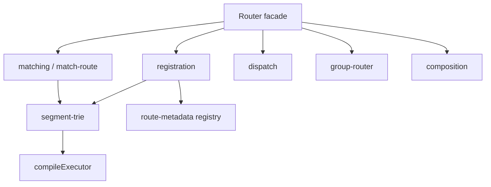
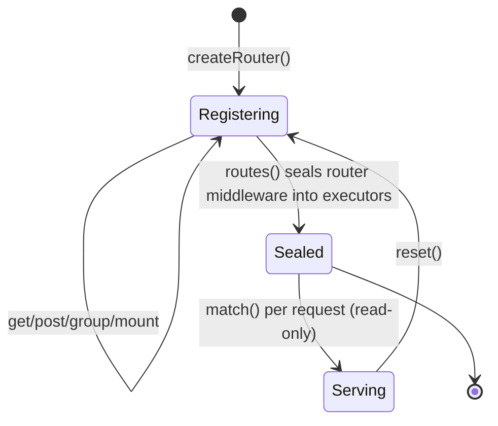
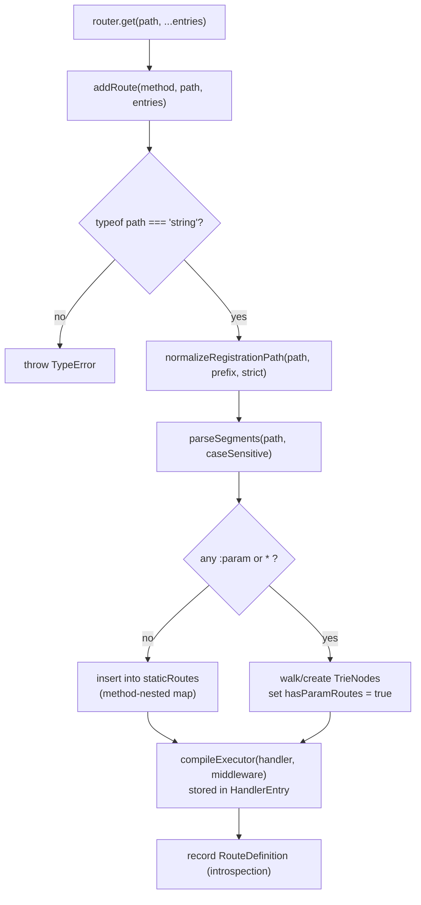

# @nextrush/router — Architecture

> Internal design of the segment trie, the static-route fast path, executor compilation, and the match hot path — how `@nextrush/router` resolves a request to a handler in time proportional to URL depth, not route count.

## At a glance

|  |  |
| --- | --- |
| **Package** | `@nextrush/router` |
| **Layer** | `router` (above `core`, below `runtime`) |
| **Depends on** | `@nextrush/types` (types only, erased at build) — no third-party runtime deps |
| **Depended on by** | `@nextrush/runtime`, `@nextrush/class`, adapters, the `nextrush` meta package |
| **Public entry** | `src/index.ts` (barrel — exports only) |
| **Internal modules** | 15 files · 2,086 LOC · largest `router.ts` 298 / `registration.ts` 291 (cap 300) |
| **On the request hot path?** | **Yes** — `match()` runs on every request |
| **Runtime coupling** | None — Web-standard JavaScript only; no `node:*` API |
| **State model** | App-scoped: mutated at registration, read-only during dispatch |

## Responsibilities

**This package owns:**

- ✓ Route **registration** — inserting `method + path + handler` into the trie or the static map
- ✓ Route **matching** — resolving `METHOD path` to a handler and captured params
- ✓ **Parameter and wildcard extraction** — decoding `:param` / `*` into `ctx.params`
- ✓ **Grouping and composition** — prefixes, group middleware, sub-router mounting
- ✓ **Redirects** and **`allowedMethods()`** (`405`/`Allow`) handling
- ✓ The **introspection registry** (`getRoutes()`) that renderers read off the hot path

**This package does NOT own:**

- ✗ The HTTP server or socket handling → `@nextrush/adapter-*`
- ✗ The middleware **execution engine** (`compose`) and `Context` creation → `@nextrush/core`
- ✗ Request body parsing → `@nextrush/body-parser`
- ✗ Validation of parameter *values* → the application handler

## Non-goals

The router intentionally does not:

- Parse request bodies, negotiate content, or manage sessions
- Authenticate or authorize requests
- Run the HTTP server or own the connection lifecycle
- Validate the *values* it extracts — it captures params; the handler validates them

## Constraints

Must remain:

- **Runtime-independent** — no `node:*` / `process` / runtime globals; Web-standard JavaScript only
- **Zero third-party dependency** — types-only dependency on `@nextrush/types`
- **ESM-only** — no CommonJS build
- **Public API sealed** — the exported surface is semver-guarded (ADR-0005)
- **Every module ≤300 LOC** — a structural forcing function (project-rules §1)

## Position in the package hierarchy

```mermaid
flowchart TB
    types --> errors --> core --> router --> runtime --> di --> class
    class --> adapters["adapter-*"] --> middleware["middleware / extensions"]
    router:::here
    classDef here fill:#2563eb,color:#fff,stroke:#1e40af;
```

> [!IMPORTANT]
> Imports flow **downward only**. `@nextrush/router` imports from `@nextrush/types` and MUST NOT be
> imported by `types`/`errors`/`core` (project-rules §1). `@nextrush/core` is an *optional* peer —
> the `Router` runs standalone; core is needed only for `app.route()` mounting.

**Dependency rules:**
- **Allowed:** `router → types`
- **Forbidden:** `router → core / runtime / adapters / middleware` (any higher or sibling layer)

---

## Overview

The router answers one question on every request — *which handler serves `METHOD path`?* — and it must answer it fast no matter how large the route table grows. The single organizing idea is a **segment trie**: a tree keyed by whole path segments (`users`, `:id`, `*`), so registering and matching both walk the tree one level per URL segment. Match cost is therefore O(k) in the number of segments `k`, completely independent of the number of registered routes.

Two design choices turn that idea into something production-grade. First, purely **static routes bypass the trie**: they're stored in a method-nested hash map for an O(1) lookup, because most routes in a real app have no parameters and shouldn't pay for tree traversal. Second, the middleware-plus-handler **executor for each route is compiled once at registration**, not rebuilt per request, so dispatch allocates no per-request closures on the hot path.

The public `Router` class is a deliberately thin facade. It holds the trie root, the static map, and options, and delegates registration, matching, dispatch, composition, and grouping to focused sibling modules — which is what keeps every file under the 300-line ceiling.

### Design principles

1. **Match cost tracks URL depth, not route count.** Enforced by the segment trie (`segment-trie.ts`) plus the O(1) static map — and guarded by `__tests__/match-hotpath-guard.test.ts` and `match-single-alloc.test.ts`.
2. **The hot path allocates nothing it doesn't have to.** Executors are pre-compiled (`compileExecutor`); the static map is method-nested so no `` `${method} ${path}` `` key string is built per request (HP-9); a resolved promise is cached (`NOOP_NEXT`).
3. **Introspection never touches dispatch.** Route metadata lives in a separate `routeDefinitions` registry read only by `getRoutes()` — never during `match()`. The merged metadata is *additionally* retained on the trie's `HandlerEntry` (registration-time state, write-only at registration) so `copyRoutes()` can re-emit it when the route is mounted into a parent router — dispatch still never reads it.
4. **The facade stays thin; modules stay small.** `Router` delegates to `registration`/`matching`/`dispatch`/`composition`/`group-router`; the 300-LOC cap is a structural forcing function.
5. **Untrusted input is handled defensively.** Parameter decoding and normalization are ReDoS- and prototype-pollution-aware (`matching.ts`, proven by `__tests__/match-safety.test.ts`).

---

## Module structure

```text
src/
├── index.ts             # Public API barrel (exports only)
├── router.ts            # Router facade class + createRouter; re-exports endpoint
├── registration.ts      # addRoute, path normalization, redirect registration, .all() consolidation
├── matching.ts          # Match hot path: normalize, indexed node match, param decode (ReDoS/pollution-safe)
├── segment-trie.ts      # TrieNode/NodeType/HandlerEntry/StaticRouteMap, createNode, parseSegments, compileExecutor
├── match-route.ts       # resolveMatch — orchestrates static-map probe → trie walk
├── group-router.ts      # GroupRouter facade, runRouteGroup, prefix composition
├── find-node.ts         # findNode / findAllowedMethods trie descent
├── dispatch.ts          # createRoutesMiddleware, createAllowedMethodsMiddleware (bridge to core middleware)
├── composition.ts       # copyRoutes — sub-router mounting
├── redirect.ts          # compileRedirectTarget, createRedirectHandler, RedirectStatus
├── route-metadata.ts    # endpoint() inline metadata + RouteDefinition
├── middleware-adapter.ts# sealRouterMiddleware — prepend router-level middleware into executors
├── state.ts             # createRouterState, resolveRouterOptions (shared registration/match state)
└── constants.ts         # shared constants
```

### Module responsibilities

| Module | Responsibility (the one thing it owns) |
| ------ | -------------------------------------- |
| `router.ts` | The public chainable facade; holds root trie, static map, options; delegates everything else. |
| `registration.ts` | Insert a route: normalize the path, build trie nodes, compile the executor, populate the static map. |
| `matching.ts` | The read hot path: normalize a request path, descend nodes, decode params safely. |
| `segment-trie.ts` | The data structures (`TrieNode`, `HandlerEntry`, `StaticRouteMap`) and `compileExecutor`. |
| `match-route.ts` | Orchestrate a match: try the static map, else walk the trie; assemble the `RouteMatch`. |
| `dispatch.ts` | Wrap `match()` as NextRush `Middleware` for `routes()` and `allowedMethods()`. |
| `group-router.ts` | Prefix + middleware grouping, delegating registration back to the parent `Router`. |
| `composition.ts` | Copy one router's routes onto another under a prefix (`mount`/`use`), re-emitting each route's metadata so copies are introspection-lossless. |

## Component relationships



---

## Request / execution lifecycle

The path a request takes from the app's middleware chain to a resolved handler:

```mermaid
sequenceDiagram
    participant App as core middleware chain
    participant MW as routes() middleware
    participant R as Router.match
    participant RM as resolveMatch
    participant SM as staticRoutes map
    participant Trie as segment trie
    App->>MW: ctx (method, path)
    MW->>R: match(method, path)
    R->>RM: resolveMatch(state, hasParamRoutes, method, path)
    alt static-only or static hit
        RM->>SM: inner = map.get(method); inner.get(normalizedPath)
        SM-->>RM: HandlerEntry | undefined  (O(1))
    else has params / no static hit
        RM->>Trie: normalize → descend segment by segment
        Trie-->>RM: node + captured params  (O(k))
    end
    RM-->>R: RouteMatch { handler, params, middleware } | null
    R-->>MW: RouteMatch | null
    alt matched
        MW->>MW: run pre-compiled executor (middleware → handler)
    else null
        MW->>App: ctx.status = 404; next()
    end
```

The ordering a reader would otherwise get wrong: the **static map is tried first** whenever it can be (`hasParamRoutes === false`, or the exact path is a known static route), because it's O(1) and covers the majority case. The trie walk is the fallback for parameterized and wildcard routes. On a miss, `routes()` sets `404` and calls `next()` rather than responding — so downstream middleware like `allowedMethods()` can still turn a known-path/unknown-method into a `405`.

### Lifecycle states



> [!NOTE]
> `match()` returns a plain `RouteMatch | null`; it never sends a response. Response behavior lives
> in the `dispatch.ts` middleware, which keeps the matcher pure and unit-testable in isolation.

## State ownership

| Owner | State it owns | Scope |
| ----- | ------------- | ----- |
| `Router` | trie root, method-nested static map, `routeDefinitions`, options, `_sealed` flag | app — mutated at registration, read-only during dispatch |
| `resolveMatch` / `matching` | the captured-params object | per request — a fresh object per match |
| `Context` (owned by `core`) | request/response, `ctx.params` (populated from the match) | per request |

There is no shared mutable per-request state inside the router: matching only reads app-scoped structures and writes into a fresh params object it hands back.

---

## Core components

### Registration — building the trie and the fast path



Registration is where the work is front-loaded. `compileExecutor` builds the middleware-chain-plus-handler closure **once**, here, and stashes it on the `HandlerEntry.executor` — so at request time dispatch just invokes it. Duplicate `method + path` registration throws immediately rather than silently overwriting.

### `compileExecutor` — the zero-per-request-allocation dispatch

For the common **zero-middleware** route, `compileExecutor` returns a direct handler call with no extra async frame, wrapping the return in `Promise.resolve(...)` so a thenable is still awaited and a synchronous throw becomes a rejection (the "never throw synchronously" contract). With middleware, it returns a guarded recursive `dispatch` that mirrors core's `compose()`: `ctx.next()` and the `(ctx, next)` argument advance the same chain, calling `next()` twice rejects, and a sync throw propagates as a rejection.

---

## Data structures

```ts
// The trie node — branches on WHOLE segments, not characters (that choice is what
// makes it a segment trie, not a radix tree).
interface TrieNode {
  segment: string;
  type: NodeType;                          // STATIC | PARAM | WILDCARD (const enum → inlined, no runtime object)
  children: Map<string, TrieNode>;         // static children keyed by the whole segment ("users")
  paramName?: string;                      // set on PARAM nodes; original case preserved
  handlers: Map<HttpMethod, HandlerEntry>; // per-method handler at this node
  wildcardChild?: TrieNode;
  paramChild?: TrieNode;
}

// Static-route fast path (HP-9): OUTER map picks the method, INNER map probes the
// normalized path — so no `${method} ${path}` key string is allocated per request.
type StaticRouteMap = Map<HttpMethod, Map<string, HandlerEntry>>;

// The handler bundle — note the PRE-COMPILED executor built at registration.
interface HandlerEntry {
  handler: RouteHandler;
  middleware: Middleware[];
  executor?: (ctx: Context) => Promise<void>; // compiled once, invoked per request
}
```

The shape choices are deliberate: `children` is a `Map` keyed by the segment string (not a first-character index) because segments are the unit of branching; the static map is **method-nested** specifically to avoid building a composite key string on every request; and `NodeType` is a `const enum` so it inlines to integer literals with no runtime object.

---

## Performance characteristics

| Path | Complexity | Allocations | Notes |
| ---- | ---------- | ----------- | ----- |
| Static route match | O(1) | none per request | Method-nested map probe; no key string built |
| Dynamic (param/wildcard) match | O(k), k = segments | params object only | Trie descent, one level per segment |
| Registration | O(k) per route | node creation (one-time) | Executor compiled here, not per request |
| Dispatch (matched) | — | none beyond the handler's own | Pre-compiled executor invoked directly |

**Memory model:**
- **Shared (one copy, app-scoped):** the trie, the static map, `routeDefinitions`, the compiled executors.
- **Per request:** the captured-params object and whatever the handler itself allocates — nothing else.

The load-bearing property: **route count does not appear in match complexity.** A static-only router skips the trie entirely; a parameterized route costs the depth of its URL.

> [!NOTE]
> Point throughput numbers are intentionally omitted — the repo's published benchmarks are being
> re-measured on a hardened harness. Run [`apps/benchmark`](https://github.com/0xTanzim/nextRush/tree/main/apps/benchmark)
> for figures on your own hardware. Allocation behavior is regression-tested by
> `__tests__/match-single-alloc.test.ts`.

## Concurrency & edge behaviour

- **Shared, immutable after startup:** the trie, static map, and `routeDefinitions`. Registration mutates them; request-time `match()` only *reads* them — safe for concurrent requests without locks.
- **Per-request, never shared:** each match captures params into a fresh object; there is no shared mutable per-request state.
- **Untrusted input:** `matching.ts` decodes parameters and normalizes paths without ReDoS-prone patterns, verified by `__tests__/match-safety.test.ts`.

> [!WARNING]
> Do not mutate the route table after the router is serving (after `routes()` has sealed
> router-level middleware into executors). `routes()` guards re-sealing with a `_sealed` flag;
> registering new routes on a live router is not a supported concurrency pattern. Use `reset()`
> (which clears the trie, static map, middleware, introspection registry, and `_sealed`) for test
> isolation or hot-reload re-registration.

## Trust boundaries

```text
adapter (untrusted method + path)
   │
   ▼
matching.ts ── normalize + decode (ReDoS- / pollution-safe)   ← the boundary the router enforces
   │
   ▼
ctx.params (values still untrusted) ── handler validates      ← the boundary the router relies on
   │
   ▼
business logic
```

The router treats the incoming `method` and `path` as untrusted and decodes them defensively, but it deliberately does **not** validate parameter *values* — that is the handler's responsibility. Wildcard captures hand the handler an attacker-controlled remainder; serving files from one must go through `@nextrush/static`, which guards against path traversal.

## Extension points

**Supported extension points:**

- **Sub-router composition** (`composition.ts`, `mount`/`use`) — routers are meant to be built independently and mounted, carrying their own router-level middleware onto copied routes. Copies are metadata-lossless: each copied route re-enters registration with its merged metadata re-emitted as a pure marker entry, so mounted routes document identically to directly registered ones.
- **Route metadata** (`endpoint()` / `getRoutes()`) — the introspection registry is the sanctioned seam for renderers like `@nextrush/openapi` and SDK/RPC generators.
- **A pluggable router contract** — [RFC-015](https://github.com/0xTanzim/nextRush/blob/main/docs/RFC/runtime-adapters/015-router-radix.md) defines the shared `Router` contract a future opt-in `@nextrush/router-radix` would implement, with a conformance parity harness.

**Forbidden (sealed):**

- The **match hot path** (`matching.ts` / `match-route.ts`) — tuned for allocation behavior; not an extension surface.
- The **trie node shape** and **static-map layout** — internal, may change without notice.

---

## Architectural invariants

These are part of the router's architecture. They do not change without an RFC:

- **`match()` is pure** — it returns `RouteMatch | null` and never sends a response.
- **Executors are compiled once, at registration** — dispatch allocates no middleware-chain closures on the hot path.
- **Introspection never touches dispatch** — `routeDefinitions` is read only by `getRoutes()`, never during `match()`.
- **The static map is method-nested** — no `` `${method} ${path}` `` composite key is built per request.
- **Duplicate `method + path` throws at registration** — no silent last-wins shadowing.
- **The route table is immutable while serving** — after `routes()` seals middleware into executors; re-registration requires `reset()`.
- **The trie branches on whole segments, not characters** — this is what makes it a segment trie, not a radix tree.
- **The package imports no runtime API** — Web-standard JavaScript only, so every adapter behaves identically.

## Engineering decisions

| Decision | Chosen | Trade-off accepted | Reference |
| -------- | ------ | ------------------ | --------- |
| Match structure | Segment trie (branch on whole segments) | Slightly more memory than a char-compressed radix tree for huge static tables | [RFC-015](https://github.com/0xTanzim/nextRush/blob/main/docs/RFC/runtime-adapters/015-router-radix.md) |
| Static routes | Separate O(1) method-nested map | A second structure to keep in sync with the trie | HP-9 (source) |
| Executor | Compiled once at registration | Registration does more work up front | `segment-trie.ts` `compileExecutor` |
| `Router` class | Thin facade delegating to modules | More files to navigate | project-rules §1 |
| Introspection | Separate `routeDefinitions` registry | Metadata stored twice (trie + registry) | `router.ts` |

## Rejected alternatives

### Character-level radix tree
Rejected as the default: prefix-compression on characters complicates param/wildcard handling for a payoff most apps never measure. The segment trie is O(k) in segments without that complexity. Kept as an *opt-in* future package behind a shared contract ([RFC-015](https://github.com/0xTanzim/nextRush/blob/main/docs/RFC/runtime-adapters/015-router-radix.md)).

### One trie for everything (no static map)
Rejected: most routes are static and shouldn't pay for a tree walk. A dedicated O(1) map for static routes is the common-case fast path.

### `compose()` per request
Rejected: rebuilding the middleware chain on every request allocates closures on the hot path. Compiling the executor once at registration removes that cost entirely.

---

## Testing strategy

- **Unit:** segment parsing, registration, path normalization, param decoding, redirects, allowed-methods.
- **Invariant / differential:** a golden corpus (`__tests__/helpers/differential-corpus.ts`, `fixtures/match-golden.json`) asserts the matcher agrees with a reference oracle across a broad path set (`match-differential`, `find-node-differential`).
- **Safety & allocation:** `match-safety.test.ts` (ReDoS / prototype-pollution / decode edge cases), `match-single-alloc.test.ts` and `match-hotpath-guard.test.ts` (hot-path allocation regressions guarding the invariants above).
- **Public surface:** `public-surface.test.ts` locks the sealed export set (ADR-0005).
- **Cross-adapter parity:** N/A directly — the router uses no runtime API; adapter parity is proven in `packages/adapters/conformance`.
- **Coverage:** ≥90% lines/functions (CI-enforced).

## Evolution strategy

- **Stable (semver-guarded):** the sealed public surface (`createRouter`, `Router` methods, `endpoint`, re-exported type contracts) — ADR-0005.
- **May change without notice:** internal module layout, the trie node shape, the static-map representation.
- **Changes only via RFC:** the match structure, the architectural invariants above, and any pluggable-router contract.

**Timeline:** `3.0` — hybrid segment trie + static-map matcher → `3.1` — `endpoint()` / `getRoutes()` introspection for OpenAPI → *future* — opt-in `@nextrush/router-radix` behind the RFC-015 contract.

## Contributor notes

Before changing this package, read: [RFC-015 (router-radix)](https://github.com/0xTanzim/nextRush/blob/main/docs/RFC/runtime-adapters/015-router-radix.md), [ADR-0005 (package tiers)](https://github.com/0xTanzim/nextRush/blob/main/docs/adr/ADR-0005-package-tiers-sealed-surface-deprecation.md), the differential corpus + `match-safety` + `match-single-alloc` tests, and the [`apps/benchmark`](https://github.com/0xTanzim/nextRush/tree/main/apps/benchmark) suite. Anything touching `matching.ts` or `segment-trie.ts` must keep the allocation guards green.

## Architecture checklist

Before changing this package, confirm:

- [ ] Does this preserve the architectural invariants above?
- [ ] Does this increase coupling or cross a dependency rule (router → types only)?
- [ ] Does this affect the match hot path (allocations / complexity)? If so, do the guard tests still pass?
- [ ] Does this change the sealed public API (semver / ADR-0005)?
- [ ] Does it need an RFC (match structure, invariants, router contract)?

---

## References & see also

- **README (how to use it):** [`./README.md`](./README.md)
- **Governing RFC:** [`docs/RFC/runtime-adapters/015-router-radix.md`](https://github.com/0xTanzim/nextRush/blob/main/docs/RFC/runtime-adapters/015-router-radix.md)
- **ADR:** [`ADR-0005 — package tiers & sealed surface`](https://github.com/0xTanzim/nextRush/blob/main/docs/adr/ADR-0005-package-tiers-sealed-surface-deprecation.md)
- **OpenSpec capability:** [`openspec/specs/router`](https://github.com/0xTanzim/nextRush/tree/main/openspec/specs/router)
- **Documentation site:** [nextRush docs](https://0xtanzim.github.io/nextRush/docs)
- **Benchmarks:** [`apps/benchmark`](https://github.com/0xTanzim/nextRush/tree/main/apps/benchmark)
