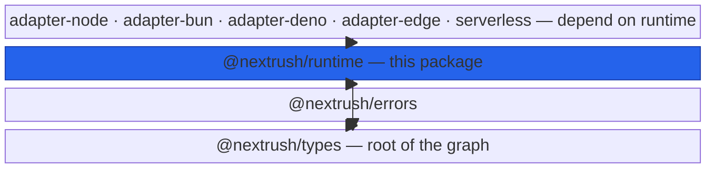
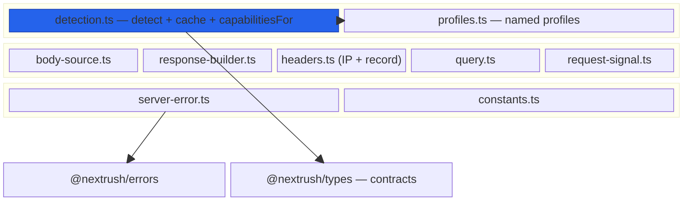
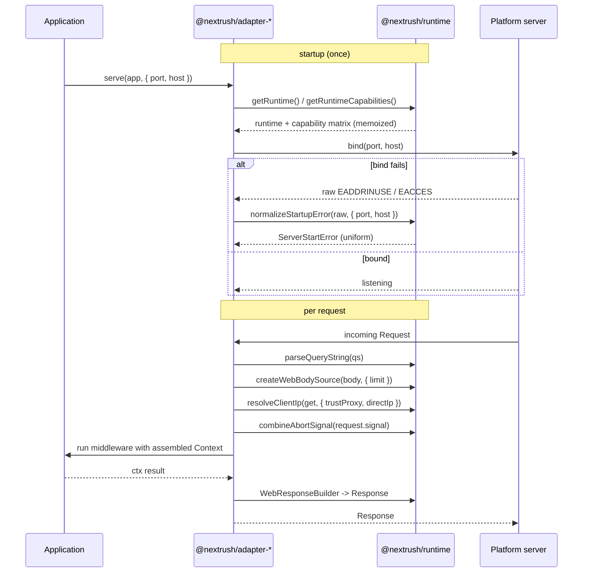
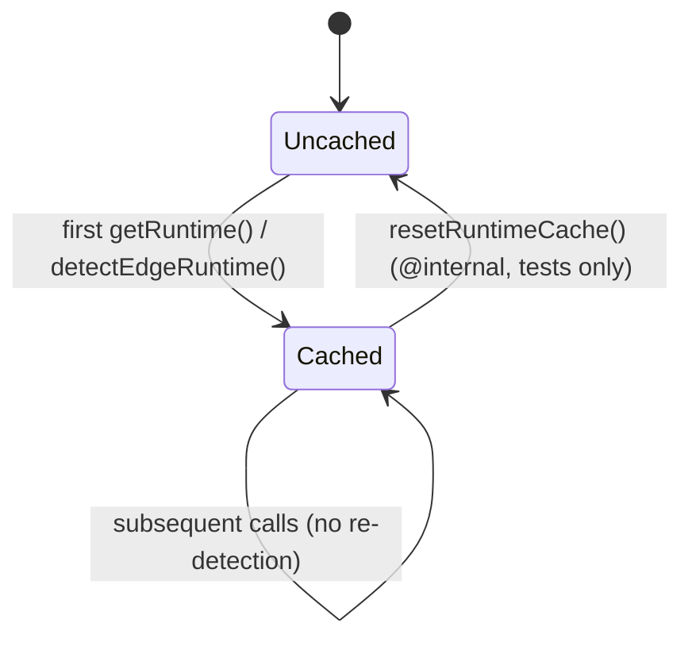
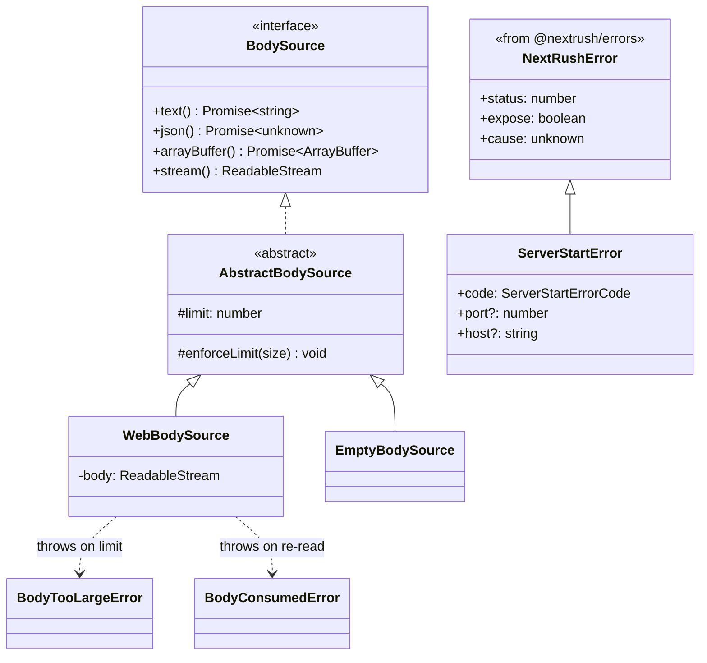

# @nextrush/runtime — Architecture

> Internal design of NextRush's cross-runtime layer: how the runtime is detected and cached, how capability decisions are kept separate from runtime identity, and how the shared Fetch-API primitives keep every adapter in parity.

## At a glance

|  |  |
| --- | --- |
| **Package** | `@nextrush/runtime` |
| **Layer** | `runtime` — above `router`, below the platform adapters |
| **Depends on** | `@nextrush/types` (contracts) · `@nextrush/errors` (the `NextRushError` base) |
| **Depended on by** | `@nextrush/adapter-{node,bun,deno,edge,serverless}` and `adapters/conformance` |
| **Public entry** | `src/index.ts` (barrel — exports only) |
| **Internal modules** | 10 implementation files (+ a `types.ts` re-export) · 1,898 LOC · largest `detection.ts` 475 LOC (above the 300 cap — see Contributor notes) |
| **On the request hot path?** | **Partial** — detection is cached at startup; the body / response / query / client-IP / signal primitives run **per request** in the web adapters |
| **Runtime coupling** | Probes runtime globals (`Bun`, `Deno`, `process`, `navigator`, `Request`) by **feature-detection only** — the one package whose job is to identify the runtime; still imports no `node:*` |
| **State model** | Process-level **memoized detection cache**; every other export is stateless / pure |

## Responsibilities

**This package owns:**

- ✓ **Runtime detection** — identifying Node / Bun / Deno / Deno Deploy / Cloudflare / Vercel Edge / generic edge / unknown, and caching the result
- ✓ **Capability negotiation** — the `capabilitiesFor()` matrix and the named `*Profile` views that describe what each runtime can do
- ✓ The **cross-runtime request/response primitives** every adapter shares — `WebBodySource`, `WebResponseBuilder`, `resolveClientIp`, `parseQueryString`, `combineAbortSignal`, `headersToRecord`
- ✓ The **uniform server-startup error** (`ServerStartError` / `normalizeStartupError`) so bind failures look identical across adapters
- ✓ The **shared adapter default constants** (timeout / shutdown / keep-alive / methods-without-body)

**This package does NOT own:**

- ✗ The **server lifecycle** — `listen()` / `serve()` and the actual HTTP server live in each adapter (`@nextrush/adapter-*`), which *use* these primitives
- ✗ The **`Context` implementation** — adapters build the concrete context; this package supplies the pieces (body source, query, IP, signal) it is assembled from
- ✗ The **contracts themselves** — `Runtime`, `RuntimeCapabilities`, `BodySource` are declared in [`@nextrush/types`](../types); this package implements against them
- ✗ **Body *parsing*** (JSON/form/multipart) — that is `@nextrush/body-parser` / `@nextrush/multipart`; this package only reads the raw stream within a size limit

## Non-goals

- Starting, stopping, or draining a server — that is an adapter concern.
- Parsing structured bodies (JSON, urlencoded, multipart) — only raw, size-limited reading lives here.
- Branching *feature behavior* on runtime name — detection selects an adapter and feeds diagnostics; feature decisions go through the capability matrix.
- Importing platform APIs (`node:*`, `Deno.*` typed imports) — runtime identity is probed structurally, never imported.

## Constraints

Must remain:

- **Runtime-independent in its imports** — no `node:*`; runtime globals are only *feature-probed* behind `typeof` guards, so the package loads on every target.
- **Near-zero-dependency** — only `@nextrush/types` and `@nextrush/errors`; no third-party runtime dependency.
- **ESM-only** — no CommonJS build.
- **Parity-preserving** — a primitive here is the *single* implementation; an adapter must not fork its own copy.
- **Public API sealed** — the exported surface is semver-guarded (ADR-0005) and locked by `public-surface.test.ts`.

## Position in the package hierarchy

`@nextrush/runtime` sits above `router` and below the platform adapters. It depends on `types` and `errors`; the adapters depend on it. (Arrows read **"depends on"**.)



> [!IMPORTANT]
> Imports flow **downward only**. `@nextrush/runtime` may import from `types` and `errors` and MUST
> NOT be imported by them — enforced in review (project-rules §1). In the canonical linear hierarchy
> (`… router → runtime → di → class → adapters …`) `di`/`class` sit textually between runtime and the
> adapters, but they do **not** import runtime; runtime's real dependents are the adapters, which is
> what the diagram shows.

**Dependency rules:**
- **Allowed:** `@nextrush/runtime → @nextrush/types` · `@nextrush/runtime → @nextrush/errors`
- **Forbidden:** `@nextrush/runtime → core / router / di / class / any adapter / any middleware`

---

## Overview

`@nextrush/runtime` implements one idea: **the routines every adapter needs should exist exactly once, below all of them.** Before this layer existed, each platform adapter carried its own client-IP resolver, body reader, response builder, and startup-error handling — four copies that drifted the moment one was patched (the audit that motivated this package found a spoofable IP path, three different `EADDRINUSE` shapes, and a `@default` timeout typo copy-pasted across adapters). Centralizing them here makes cross-adapter parity a property of the code, not a review checklist.

The package has two halves. The **detection half** (`detection.ts`, `profiles.ts`) answers *what runtime is this and what can it do?* Detection is memoized on first call; capabilities are resolved from a curated matrix for known runtimes and by feature-probing for unknown/future ones. The **primitives half** (`body-source.ts`, `response-builder.ts`, `headers.ts`, `query.ts`, `request-signal.ts`, `server-error.ts`, `constants.ts`) provides the per-request and per-startup building blocks the adapters assemble a `Context` and a server from.

The load-bearing architectural rule threads through both halves: **capability decisions are governed by the capability matrix, never by a runtime-name branch.** Named profiles are *data* — for defaults, documentation, and "why is streaming off here?" diagnostics — and are derived from `capabilitiesFor()` rather than hand-maintained, so they cannot silently disagree with the matrix.

### Design principles

1. **One implementation per primitive.** Each cross-runtime routine (IP, body, response, query, signal, startup error) exists once here; adapters call it, never re-implement it. Enforced by the `adapters/conformance` parity suite.
2. **Decide by capability, not identity.** `getRuntimeCapabilities()` gates features; `detectRuntime()` only selects an adapter and feeds diagnostics. Enforced by the `capability-exempt` review convention and negotiation tests.
3. **Probe, never blank, the unknown.** An unrecognized runtime is answered by `probeCapabilities()` (feature-detecting globals), not an all-`false` matrix that would needlessly disable working features.
4. **Feature-detect globals, don't import them.** Runtime globals are read behind `typeof` guards; no `node:*` import — so the package loads identically everywhere. Enforced by the no-runtime-API lint (project-rules §2).
5. **Security by construction.** `parseQueryString` and `headersToRecord` use `Object.create(null)` and deny `__proto__`/`constructor`/`prototype`; `isValidClientIp` validates structure, not merely charset; body reads enforce `DEFAULT_BODY_LIMIT`.

---

## Module structure

```text
src/
├── index.ts            # Public API barrel (exports only, no implementation)
├── detection.ts        # detectRuntime/getRuntime (cached), capabilitiesFor, probeCapabilities, edge detection, predicates
├── profiles.ts         # Named CapabilityProfiles (NodeProfile, ...) derived from capabilitiesFor
├── body-source.ts      # BodySource hierarchy — size-limited raw body reading (Web + empty)
├── response-builder.ts # WebResponseBuilder + header-safety / bodyless-status checks (Fetch adapters)
├── headers.ts          # headersToRecord + the single client-IP resolution policy & IP validation
├── query.ts            # parseQueryString — single-pass, DoS-limited, proto-pollution-safe
├── request-signal.ts   # combineAbortSignal — merge client-disconnect + timeout
├── server-error.ts     # ServerStartError + normalizeStartupError (uniform bind failures)
├── constants.ts        # Shared adapter defaults (timeout / shutdown / keep-alive / methods)
└── types.ts            # Convenience re-export of the runtime contracts from @nextrush/types
```

### Module responsibilities

| Module | Responsibility (the one thing it owns) |
| ------ | -------------------------------------- |
| `detection.ts` | Identify the runtime (cached) and resolve its capability matrix (curated or probed). |
| `profiles.ts` | The named, documented capability views derived from `capabilitiesFor`. |
| `body-source.ts` | Read a request body once, within a byte limit, across runtimes. |
| `response-builder.ts` | Build a Fetch `Response` safely (header validation, bodyless-status rules) for web adapters. |
| `headers.ts` | Convert Web `Headers` to a safe record and resolve the client IP with one shared precedence. |
| `query.ts` | Parse a query string safely and cheaply. |
| `request-signal.ts` | Combine the platform request signal with an adapter-owned timeout controller. |
| `server-error.ts` | Normalize bind/startup failures into one typed, actionable error. |
| `constants.ts` | Own the adapter default numbers so they cannot drift. |
| `index.ts` | The sealed public barrel — re-exports only. |

## Component relationships

The modules cluster into three groups. Detection feeds capabilities and profiles; the per-request primitives are independent of each other; startup and constants stand alone. (Arrows read "uses / derives from".)



`detection.ts` is the hub of the detection half; the per-request primitives are deliberately decoupled (an adapter can use `parseQueryString` without touching the body reader). Only `server-error.ts` reaches into `@nextrush/errors` (for the `NextRushError` base); everything type-facing points at `@nextrush/types`.

---

## Lifecycle

There is no server lifecycle *in this package* — it has no `listen()`. What matters is how an **adapter** consumes runtime: once at startup (detection + capabilities), then per request (the primitives). The sequence below is the honest end-to-end flow, with runtime's role highlighted.



The one piece of state — the detection cache — has its own small lifecycle: uncached until the first `getRuntime()` / `detectEdgeRuntime()`, cached thereafter, and cleared only by the test-only `resetRuntimeCache()`.



> [!NOTE]
> `capabilitiesFor(runtime)` is **pure** and takes the runtime as an argument, so it is unaffected by
> the cache — only `getRuntime()` (the no-argument, current-runtime path) and `detectEdgeRuntime()`
> memoize.

## State ownership

| Owner | State it owns | Scope |
| ----- | ------------- | ----- |
| `detection.ts` (module) | `cachedRuntime`, `cachedEdgeInfo` — the memoized detection results | process — set once, cleared only by `resetRuntimeCache()` |
| `query.ts` (module) | `EMPTY_QUERY` — one frozen, shared empty-query object | process — immutable, returned on the empty/over-limit path |
| `constants.ts` (module) | The default numbers and `METHODS_WITHOUT_BODY` set | process — immutable |
| `WebBodySource` (instance) | The consumed/limit state of one request body | per request — owned by the adapter's Context |
| _(every other export)_ | none — pure functions | per call |

The only mutable state is the detection cache, and it is write-once-then-read (plus the test reset). The `EMPTY_QUERY` singleton is `Object.freeze`d precisely so a future mutating caller fails loudly instead of corrupting shared state.

## Data structures

Two internal type families carry weight: the `BodySource` hierarchy (so adapters read bodies uniformly) and `ServerStartError` (so bind failures share one shape).



Two shape choices matter. First, `BodySource` is an **interface with an abstract base** that owns the limit-enforcement logic, so `WebBodySource` and `EmptyBodySource` (and future runtime-specific sources) share one size-guard rather than each re-checking. Second, `ServerStartError` **extends `NextRushError`** rather than being a standalone class — it inherits the framework's failure contract (`status: 500`, `expose: false`, native `cause`) and adds only a machine-readable `code` plus the attempted `port`/`host`, so a bind failure is observable the same way as any other framework error but never leaks to a client.

## Performance characteristics

The primitives on the per-request path are written to avoid allocation and superlinear work.

| Path | Complexity | Allocations | Notes |
| ---- | ---------- | ----------- | ----- |
| `getRuntime()` | O(1) after first call | none | Memoized; detection runs once per process. |
| `capabilitiesFor(known)` | O(1) | one matrix object | Curated switch; no probing. |
| `parseQueryString(qs)` | O(n) single pass | none on empty/over-limit (shared frozen `EMPTY_QUERY`) | `indexOf`-based scanner, no `split('&')` intermediate array; capped at 256 params / 2048 chars. |
| `combineAbortSignal(base)` | O(1) | one `AbortController` | Created lazily by the Context only on first `signal` access, so the non-timeout/non-stream hot path stays allocation-free. |
| `resolveClientIp(get, opts)` | O(1) | none | A few header reads + structural validation. |

**Memory model:**
- **Shared (one copy):** the detection cache, the frozen `EMPTY_QUERY`, and the constant tables.
- **Per request:** a `WebBodySource` (when a body is read), the parsed `QueryParams` (only when the query is non-empty), and a combined `AbortSignal` (only when a timeout/stream needs it).

## Concurrency & edge behaviour

- **Shared, immutable after first set:** the detection cache is write-once; the constants and `EMPTY_QUERY` are frozen. Concurrent reads need no synchronization.
- **Per-request, never shared:** a `WebBodySource` tracks a single body's consumed state — reading it twice raises `BodyConsumedError` rather than silently returning a partial or empty result.
- **Abort / disconnect / timeout:** `combineAbortSignal` uses `AbortSignal.any([request.signal, timeoutController.signal])`, so a cooperative handler/stream stops when **either** the client disconnects or the request times out; `abort()` is idempotent.

> [!WARNING]
> Do not add a runtime-name branch to a capability *decision* (e.g. `if (isNode()) enableX`). Feature
> gating must read `getRuntimeCapabilities()`; runtime identity is only for adapter selection and
> diagnostics. Breaking this reintroduces the drift the negotiation contract exists to prevent.

## Trust boundaries

`@nextrush/runtime` sits right where untrusted request data first becomes structured, so several of its primitives *are* the boundary the rest of the framework relies on.

```text
User input --> HTTP --> [ headers / query / body / client-IP ] --> Context --> validation --> business logic
                              ^
                              |  the boundary THIS package enforces:
                              |   - parseQueryString / headersToRecord: Object.create(null), deny __proto__/constructor/prototype
                              |   - isValidClientIp: structural IPv4/IPv6 validation; trustProxy gates proxy headers
                              |   - WebBodySource: enforces DEFAULT_BODY_LIMIT (BodyTooLargeError)
                              |   - assertHeaderSafe: rejects header-injection vectors on the way out
```

Everything crossing from the network is treated as hostile: query keys and header names are written onto null-prototype objects with dangerous keys denied (prototype-pollution defense), client IPs are structurally validated and only believed when `trustProxy` is explicitly set, body reads are size-bounded, and outgoing headers are checked for injection. Semantic body *validation* (schemas) is not this package's job — that boundary is enforced later by `@nextrush/validation`.

## Extension points

**Supported extension points:**

- **New `BodySource` subclasses** — extend `AbstractBodySource` to add a runtime-specific reader; it inherits the size guard.
- **New capability entries** — add a runtime to the `Runtime` union (in `@nextrush/types`) and a curated arm in `capabilitiesFor`; unknown runtimes still work via probing.
- **New named profiles** — add a `capabilityProfileFor(...)` constant for a new platform; it derives from the matrix automatically.

**Forbidden (sealed):**

- Branching a **capability decision** on runtime identity — profiles are read-only data, not a behavior fork.
- Forking a **primitive** (IP, body, response, query) inside an adapter — parity depends on the single implementation here.
- Importing a **platform API** (`node:*`) — detection must stay feature-probe-only.

---

## Architectural invariants

These are part of the package's architecture. They do not change without an RFC:

- **Capability decisions are governed by the capability matrix, never by a runtime-name branch** (the negotiation contract, RFC/ADR-R6).
- **Each cross-runtime primitive has exactly one implementation here** — adapters consume it; parity is proven in `adapters/conformance`.
- **Unknown/future runtimes are answered by feature-probing**, never an all-`false` capability matrix.
- **No `node:*` import** — runtime globals are only feature-detected behind `typeof` guards.
- **Query/header parsing is prototype-pollution-safe** — null-prototype targets, denied `__proto__`/`constructor`/`prototype`.
- **Proxy headers are trusted only when `trustProxy` is explicitly enabled**, and every candidate IP is structurally validated.
- **`ServerStartError` is part of the `NextRushError` hierarchy** with `expose: false` — a bind failure never becomes a client response.
- **The public surface is explicit and sealed** — guarded by `public-surface.test.ts` and semver (ADR-0005).

## Engineering decisions

| Decision | Chosen | Trade-off accepted | Reference |
| -------- | ------ | ------------------ | --------- |
| How features are gated across runtimes | Capability matrix, not runtime-name branches | An extra indirection vs. a quick `if (isNode())` | RFC/ADR-R6 |
| Answer for unknown/future runtimes | Feature-probe globals (`probeCapabilities`) | `nodeStreams`/`fileSystem` stay conservatively `false` (can't probe without `node:*`) | `detection.ts` (audit R-3) |
| Where cross-adapter primitives live | Once, in `runtime`, below the adapters | Wide-blast edits; adapters coupled to this layer | audit F-08/F-11/F-15/F-16 |
| Startup-error shape | Extend `NextRushError` with a normalized `code` | A dependency on `@nextrush/errors` from `runtime` | `server-error.ts` (audit R-4) |
| Named profiles vs. curated matrix | Profiles **derive** from `capabilitiesFor` | Profiles can't add capability data the matrix lacks (by design) | `profiles.ts` |
| Empty-query handling | Shared frozen `EMPTY_QUERY` singleton | A frozen object every empty-query caller shares | `query.ts` (HP-2-web) |

## Rejected alternatives

### Per-adapter copies of the primitives
Rejected: letting each adapter own its client-IP resolver, body reader, and startup handling is exactly what produced the drift this package was created to end — a spoofable IP path, three `EADDRINUSE` shapes, and a copy-pasted timeout typo. One implementation below the adapters makes parity structural, at the cost of coupling every adapter to this layer.

### Branching behavior on runtime identity (`if (runtime === 'x')`)
Rejected: keying features off a runtime name means a capable-but-unrecognized runtime silently loses features, and every new runtime requires touching every branch. A probed capability matrix answers "can it?" directly and degrades gracefully for the unknown; the cost is one indirection between "which runtime" and "what it can do".

### An all-`false` capability matrix for unknown runtimes
Rejected: reporting everything as unsupported would make the framework disable streaming, crypto, and fetch on a runtime that actually supports them. Feature-probing the relevant globals is more accurate; the cost is that a couple of Node-only capabilities that can't be probed without importing `node:*` stay conservatively `false`.

---

## Testing strategy

- **Unit:** `detection.test.ts` (detection order, caching, edge platform flags), `capability-negotiation.test.ts` (matrix + probing), `headers.test.ts` (IP precedence/validation, set-cookie handling), `query.test.ts` (limits, proto-pollution denial), `body-source.test.ts`, `response-builder.test.ts`, `profiles.test.ts`, `foundation.test.ts`.
- **Public-surface guard:** `public-surface.test.ts` asserts the exact exported symbol set (values + types) — the sealed-surface invariant made executable.
- **Invariant / audit tests:** `audit-fixes.test.ts` pins the audit-fix behaviors (uniform startup error, shared IP policy, timeout constant) so they cannot regress.
- **Conformance / cross-adapter parity:** proven in `packages/adapters/conformance` — the adapters that consume these primitives must behave identically for the same request.
- **Benchmark / regression:** the query scanner and signal-lazy paths are allocation-sensitive; guarded by the benchmark suite.
- **Coverage:** ≥90% lines/functions (CI-enforced).

## Evolution strategy

- **Stable (semver-guarded):** the entire exported surface — detection functions, capability API, profiles, primitives, `ServerStartError`, and the constants (ADR-0005).
- **May change without notice:** internal module layout, the exact wording of startup-error messages, and the private `probeCapabilities` / caching internals.
- **Changes only via RFC:** the capability-negotiation contract, the `Runtime` union membership, and the invariants above.

**Timeline:** `3.0` — runtime detection, the capability matrix, and `parseQueryString` → `3.1` — the shared cross-adapter primitives (`WebResponseBuilder`, `WebBodySource`, the single client-IP policy, `combineAbortSignal`, `ServerStartError`) and the named capability profiles, landed as the adapter-parity audit fixes.

## Contributor notes

Before changing this package, read: the capability-negotiation contract (RFC/ADR-R6), the audit-fix notes referenced throughout `src/` (F-08, F-11, F-15, F-16, R-2..R-10), `public-surface.test.ts` (update it deliberately, never casually), and the `packages/adapters/conformance` suite (your change must not break cross-adapter parity).

Note on size: `detection.ts` (475 LOC), `body-source.ts` (370 LOC), and `response-builder.ts` (318 LOC) are above the 300-line file cap in `code-structure.md`. They concentrate cohesive single-responsibility logic (the full detection/capability decision tree; the body-reading state machine; the response-building rules) that is clearer whole than fragmented. If any grows materially, the sanctioned split is by concern — e.g. moving edge-platform detection out of `detection.ts` into a sibling — updating this note in the same change (source wins).

## Architecture checklist

Before changing this package, confirm:

- [ ] Does this preserve the architectural invariants (capability-not-identity, one implementation per primitive, no `node:*`)?
- [ ] Does it add a capability decision that branches on runtime name (forbidden)?
- [ ] Does it fork a primitive an adapter should share, or break cross-adapter parity?
- [ ] Does it touch a per-request hot path (query / body / signal) — did you check allocations?
- [ ] Does it change the sealed public surface (semver / ADR-0005)? Did you update `public-surface.test.ts` deliberately? Does it need an RFC?

---

## References & see also

- **README (how to use it):** [`./README.md`](./README.md)
- **Contracts implemented:** [`@nextrush/types`](../types) — `Runtime`, `RuntimeCapabilities`, `BodySource`
- **Error base:** [`@nextrush/errors`](../errors) — `NextRushError` (the `ServerStartError` parent)
- **Consumers / parity:** [`packages/adapters`](https://github.com/0xTanzim/nextRush/tree/main/packages/adapters) and `adapters/conformance`
- **ADR:** [`ADR-0005 — package tiers & sealed surface`](https://github.com/0xTanzim/nextRush/blob/main/docs/adr/ADR-0005-package-tiers-sealed-surface-deprecation.md)
- **Repository:** [`packages/runtime`](https://github.com/0xTanzim/nextRush/tree/main/packages/runtime)
