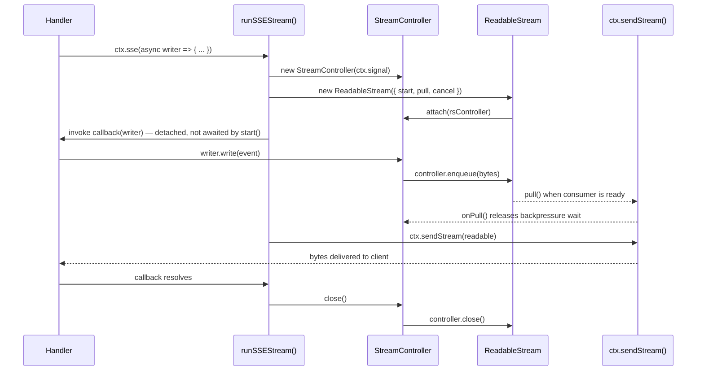
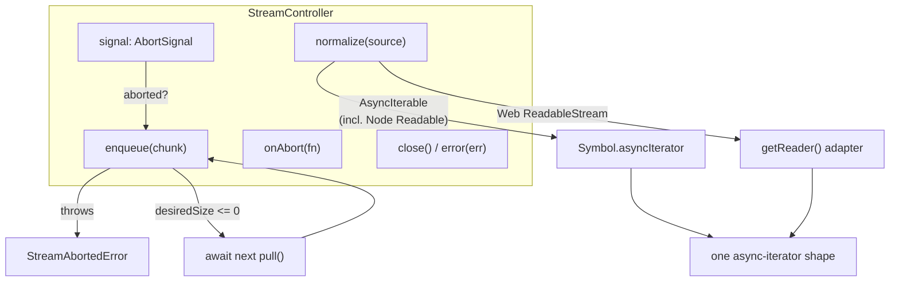
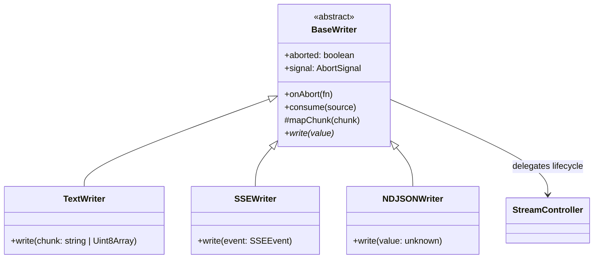
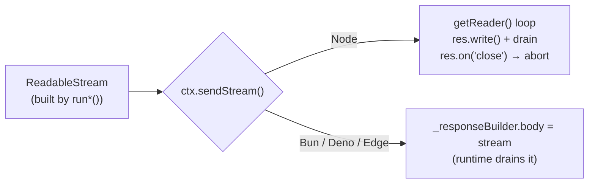
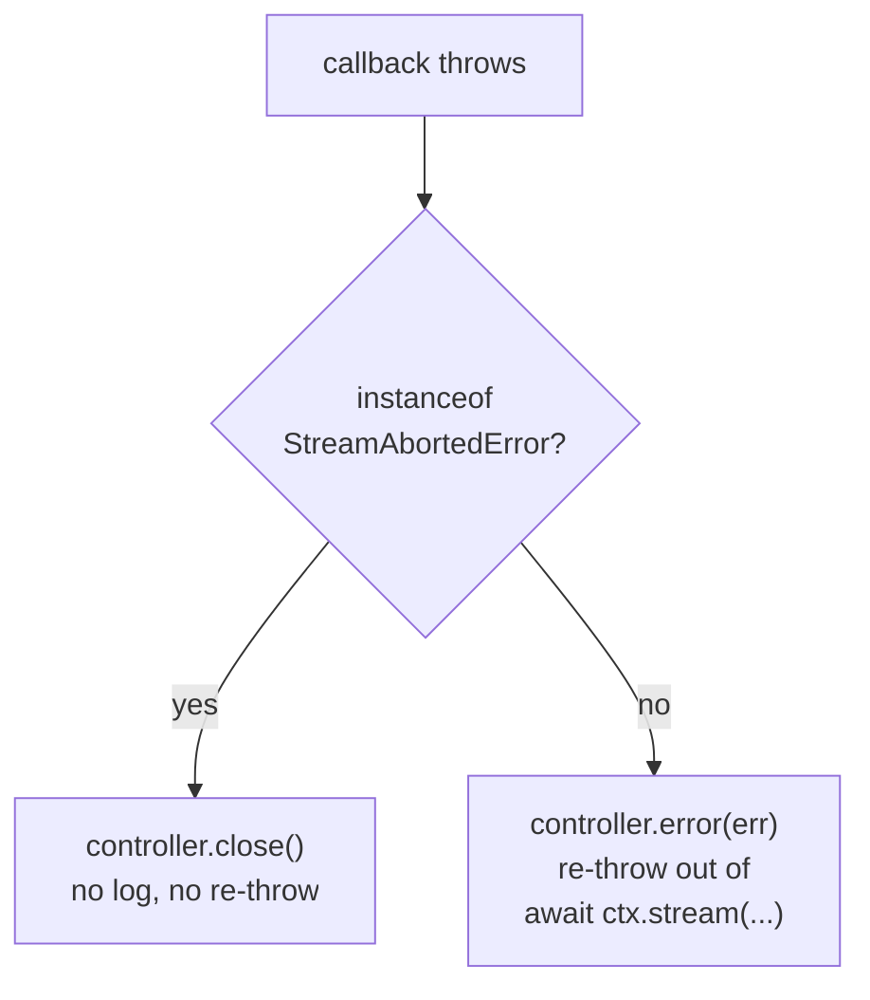

# @nextrush/stream Architecture

> Internal design of `StreamController`, the writer implementations, and the cross-runtime wiring.

## Overview

`@nextrush/stream` implements `ctx.stream()` / `ctx.sse()` / `ctx.ndjson()` once, in a runtime-agnostic core, and lets each platform adapter (`adapter-node`, `adapter-bun`, `adapter-deno`, `adapter-edge`) supply exactly one primitive: `ctx.sendStream()`. Everything else — abort tracking, backpressure, source normalization, wire-format framing — lives here and never varies by runtime.

### Design Philosophy

1. **One lifecycle, not four.** `StreamController` owns abort/backpressure/enqueue/close once; adapters never reimplement it.
2. **Loud failure over silent data loss.** Writing after client disconnect throws `StreamAbortedError` rather than dropping the chunk.
3. **One normalization path.** Every accepted source shape (`AsyncIterable`, Node `Readable`, Web `ReadableStream`) converges to a single async-iterator contract before anything consumes it.
4. **The writer never touches transport.** `TextWriter` / `SSEWriter` / `NDJSONWriter` only format; they call `controller.enqueue()` and never see a socket, a `Response`, or an adapter type.

See [`docs/RFC/RFC-NEXTRUSH-STREAM.md`](../../docs/RFC/RFC-NEXTRUSH-STREAM.md) for the full API decision history (why writer-callback over `AsyncIterable`-first, why `consume()` not `pipe()`, why three writers not one).

---

## Module Structure

```text
src/
├── index.ts               # Public API exports
├── errors.ts               # StreamAbortedError
├── sse-format.ts            # formatSSE() — SSEEvent -> wire-format string
├── stream-controller.ts      # StreamController — the shared lifecycle
├── writers.ts               # TextWriter / SSEWriter / NDJSONWriter
└── run.ts                   # runTextStream / runSSEStream / runNDJSONStream
```

### Module Responsibilities

| Module | Responsibility |
| --- | --- |
| `errors.ts` | `StreamAbortedError` — thrown on write-after-abort, swallowed at the `run*` boundary |
| `sse-format.ts` | Multi-line `data:` escaping, `event:` / `id:` / `retry:` fields, CRLF sanitization, blank-line terminator |
| `stream-controller.ts` | Abort tracking, cooperative backpressure, source normalization, enqueue/close/error |
| `writers.ts` | Thin per-protocol formatters over `StreamController` — the only place `write()`'s semantics differ |
| `run.ts` | Wires a writer to a `ReadableStream`, drives the callback, ships the result via `ctx.sendStream()` |

---

## Request Lifecycle



The callback runs **detached** inside the stream's `start()` — deliberately not awaited there. Awaiting it would block `pull()` from ever firing, deadlocking backpressure on lazy (Bun/Deno/Edge) runtimes, where the platform only calls `pull()` once a consumer actually reads.

---

## `StreamController` — Shared Lifecycle



Responsibilities, all in one place:

| Concern | Implementation |
| --- | --- |
| Abort detection | Wraps the adapter-supplied `AbortSignal`; registers one `abort` listener |
| Backpressure | `enqueue()` checks `ReadableStreamDefaultController.desiredSize`; parks on a pending-pull promise when the buffer is full |
| Cleanup on abort | Releases any pending backpressure wait immediately so a parked `enqueue()` observes the abort and throws, rather than hanging forever |
| Source normalization | `normalize()` — the single function that branches on source shape (§ below) |
| Idempotent close/error | `close()` / `error()` guard against double-invocation (e.g. abort racing a natural completion) |

### Why Normalization Is a Single Function

Real producers hand you different shapes — an AI SDK yields an `AsyncIterable`, a DB driver might hand back a Node `Readable`, a fetch-based client returns a Web `ReadableStream`. Forcing callers to convert before calling `consume()` would just move the branching into application code. `StreamController.normalize()` is the one place this decision is made:

```typescript
normalize<T>(source: AsyncIterable<T> | ReadableStream<T>): AsyncIterator<T> {
  if (Symbol.asyncIterator in source) {
    // Covers plain AsyncIterables AND Node Readable, which has implemented
    // Symbol.asyncIterator natively since Node 10.
    return (source as AsyncIterable<T>)[Symbol.asyncIterator]();
  }
  // Only a bare Web ReadableStream without native Symbol.asyncIterator
  // needs explicit adaptation via its reader.
  const reader = (source as ReadableStream<T>).getReader();
  return { next() { ... }, return() { ... } };
}
```

Every writer's `consume()` then contains exactly one loop over one shape — no `if`/`else if`/`else` chain appears anywhere outside this function.

---

## Writers — Thin Formatters Only



Each concrete writer overrides exactly two things:

1. **`write(value)`** — the one line that differs: `TextWriter` calls `controller.enqueueText(chunk)` directly; `SSEWriter` calls `controller.enqueueText(formatSSE(event))`; `NDJSONWriter` calls `controller.enqueueText(JSON.stringify(value) + '\n')`.
2. **`mapChunk(chunk)`** — how a raw chunk from `consume()` maps to that protocol's native unit (e.g. `SSEWriter` wraps a raw string as `{ data: chunk }`).

Nothing else is duplicated. Abort checks, backpressure, and source normalization are inherited from `BaseWriter` → `StreamController`, written once.

---

## Adapter Wiring (`ctx.sendStream()`)

Each platform adapter implements **one** new low-level method on its concrete `Context`. `@nextrush/stream` never contains adapter-specific code — it only calls `ctx.sendStream(readableStream)` and lets the adapter decide how to deliver it.



| Adapter | `sendStream()` implementation | `signal` source |
| --- | --- | --- |
| `adapter-node` | Extracted, behavior-preserving refactor of the existing `send()` Web-`ReadableStream` pump (`getReader()` loop, `res.write()` + `drain`, cleanup on `res.on('close')`) | Lazily synthesized `AbortController`, wired to `res.on('close')` / `req.on('aborted')` — created only on first `ctx.signal` access to keep the non-streaming hot path allocation-free |
| `adapter-bun` | One-line `_responseBuilder.body = stream` assignment | Native passthrough: `this.raw.req.signal` (Bun's `Request` already carries an `AbortSignal`) |
| `adapter-deno` | Same as Bun | Same as Bun |
| `adapter-edge` | Same as Bun | Same as Bun |

The Node adapter is the only one that does real work here — Bun/Deno/Edge get correct streaming and cancellation for free because the Fetch `Request`/`Response` APIs already model both natively; NextRush only had to surface them.

---

## Error and Abort Semantics



- `StreamAbortedError` is a control-flow signal, not an application error — the client is already gone, so nothing further gets sent to them. It is caught once, at the top of `run*()`, and never surfaces to `onError`-style handling or logs.
- Any other thrown error propagates like a normal `await`ed call failure: the underlying stream is errored (so the connection doesn't hang open), and the exception re-throws out of `ctx.stream()` / `ctx.sse()` / `ctx.ndjson()` to the caller's own `try`/`catch`.
- There is deliberately no second error-handling callback (`onError`) — see the RFC's revision history for why that was removed after DX review.

---

## Testing Strategy

| Layer | Coverage |
| --- | --- |
| Unit (`StreamController`) | Enqueue-after-abort throws, backpressure wait/release, `normalize()` parity across `AsyncIterable` / Node `Readable` / Web `ReadableStream`, idempotent `close()`/`error()` |
| Unit (writers) | Per-protocol formatting (`formatSSE` multi-line/CRLF/field-injection cases), `consume()` chunk mapping |
| Integration (Node) | Real `http.createServer` + real `fetch` — byte-exact SSE/text/NDJSON output, real client-disconnect abort propagation |
| Integration (Bun / Deno) | Real `Bun.serve` / `Deno.serve` + real `fetch`, driven through the same adapter-shaped context (`signal` = `Request.signal`, `sendStream` = `Response` body assignment) — byte-exact parity with the Node output |

Coverage thresholds enforced per `v3-testing.instructions.md`: 90% lines/functions/statements, 85% branches.

## See Also

- [`README.md`](./README.md) — usage-focused documentation and API reference
- [`docs/RFC/RFC-NEXTRUSH-STREAM.md`](../../docs/RFC/RFC-NEXTRUSH-STREAM.md) — full design rationale, revision history, and rejected alternatives
