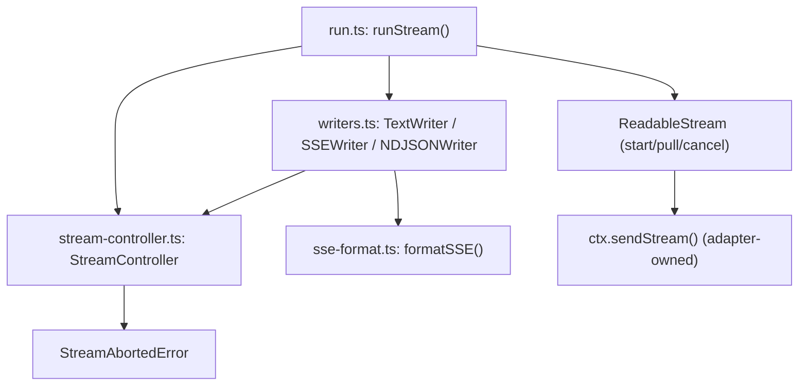
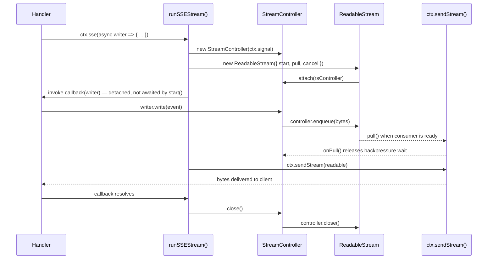
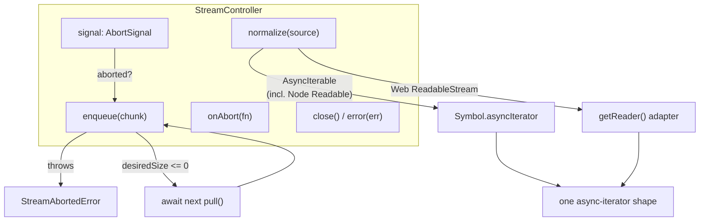

# @nextrush/stream Architecture

> Internal design of `StreamController`, the writer implementations, and the cross-runtime wiring.

## At a glance

|  |  |
| --- | --- |
| **Package** | `@nextrush/stream` |
| **Layer** | `middleware` (above `types`; consumed by every adapter, below nothing) |
| **Depends on** | `@nextrush/types` (types only, erased at build) -- no third-party runtime dependency |
| **Depended on by** | `adapter-node`, `adapter-bun`, `adapter-deno`, `adapter-edge` -- each wires `runTextStream`/`runSSEStream`/`runNDJSONStream` into its `Context` and implements `ctx.sendStream()` |
| **Public entry** | `src/index.ts` (barrel -- exports only) |
| **Internal modules** | 5 files (excl. tests) -- `errors.ts`, `sse-format.ts`, `stream-controller.ts`, `writers.ts`, `run.ts`; all well within the 300-line middleware cap |
| **On the request hot path?** | Yes, for every streaming response (`ctx.stream()`/`ctx.sse()`/`ctx.ndjson()`) -- not touched by non-streaming requests |
| **Runtime coupling** | None -- built only on Web-standard `ReadableStream` / `AbortSignal`; the only runtime-specific code lives in each adapter's `ctx.sendStream()`, outside this package |
| **State model** | Per-response: one `StreamController` instance per streaming call, never shared across requests |

## Responsibilities

**This package owns:**

- ✓ The shared streaming lifecycle -- abort tracking, backpressure, source normalization, enqueue/close (`StreamController`)
- ✓ Protocol-specific wire formatting -- SSE framing (`formatSSE`), NDJSON line serialization, raw text/byte passthrough (`writers.ts`)
- ✓ Wiring a writer to a `ReadableStream` and driving the streaming callback (`run.ts`)
- ✓ Defining `StreamAbortedError` as the control-flow signal for write-after-disconnect

**This package does NOT own:**

- ✗ Delivering bytes to the actual socket/response -- each platform adapter's `ctx.sendStream()` (Node: `getReader()` pump into `ServerResponse`; Bun/Deno/Edge: `Response` body assignment)
- ✗ Synthesizing the abort signal itself -- `ctx.signal` is adapter-owned (Node: derived from `res`/`req` events; Bun/Deno/Edge: passed through from `Request.signal`)
- ✗ The `Context` interface's `stream()`/`sse()`/`ndjson()` method declarations -- those live in `@nextrush/types`; this package only implements them
- ✗ Bidirectional communication -- `@nextrush/websocket` (this package is strictly server-to-client)

## Non-goals

The package intentionally does not:

- Provide a transform-pipeline API (`.through()`) -- the internal design (`normalize()` as a distinct step from consumption) leaves room for one without a breaking change, but it is not implemented today
- Buffer or replay past events -- `id:`/`retry:` fields let *clients* implement reconnection; this package holds no server-side history
- Bundle any LLM SDK integration -- the AI-SDK examples in the README are usage patterns, not dependencies

## Constraints

Must remain:

- **Runtime-independent** -- zero `node:*` imports; built only on Web-standard `ReadableStream`/`AbortSignal`
- **Zero-dependency** -- only `@nextrush/types`
- **One lifecycle, not four** -- `StreamController` owns abort/backpressure/enqueue/close exactly once; adapters never reimplement it
- **Public API sealed** -- the exported surface is semver-guarded (ADR-0005), locked by `__tests__/public-surface.test.ts`

## Position in the package hierarchy

```mermaid
flowchart TB
    types["@nextrush/types"] --> errors["@nextrush/errors"] --> core["@nextrush/core"]
    core --> router["@nextrush/router"] --> runtime["@nextrush/runtime"] --> di["@nextrush/di"] --> class["@nextrush/class"]
    class --> adapters["adapter-node / bun / deno / edge"]
    THIS["@nextrush/stream — this package"]:::here
    types --> THIS
    THIS --> adapters
    classDef here fill:#2563eb,color:#fff,stroke:#1e40af;
```

> [!IMPORTANT]
> Imports flow **downward only** in the conventional sense, but `@nextrush/stream` sits
> structurally *beside* the adapters rather than strictly below them: adapters import from this
> package (`runTextStream`, `runSSEStream`, `runNDJSONStream`) to implement `ctx.sendStream()`'s
> callers, while this package's own `StreamCapableContext` interface only requires the narrow
> `signal`/`set()`/`sendStream()` shape an adapter's `Context` already satisfies -- there is no
> import of any adapter package from `@nextrush/stream`.

**Dependency rules:**
- **Allowed:** `stream -> types` (workspace, types only)
- **Forbidden:** `stream -> core / router / class / any adapter / any other middleware package` as a static import

---

## Overview

`@nextrush/stream` implements `ctx.stream()` / `ctx.sse()` / `ctx.ndjson()` once, in a runtime-agnostic core, and lets each platform adapter (`adapter-node`, `adapter-bun`, `adapter-deno`, `adapter-edge`) supply exactly one primitive: `ctx.sendStream()`. Everything else -- abort tracking, backpressure, source normalization, wire-format framing -- lives here and never varies by runtime.

### Design principles

1. **One lifecycle, not four.** `StreamController` owns abort/backpressure/enqueue/close once; adapters never reimplement it.
2. **Loud failure over silent data loss.** Writing after client disconnect throws `StreamAbortedError` rather than dropping the chunk.
3. **One normalization path.** Every accepted source shape (`AsyncIterable`, Node `Readable`, Web `ReadableStream`) converges to a single async-iterator contract before anything consumes it.
4. **The writer never touches transport.** `TextWriter` / `SSEWriter` / `NDJSONWriter` only format; they call `controller.enqueue()`/`controller.enqueueText()` and never see a socket, a `Response`, or an adapter type.

See [`docs/RFC/request-data/003-stream.md`](../../docs/RFC/request-data/003-stream.md) for the full API decision history (why writer-callback over `AsyncIterable`-first, why `consume()` not `pipe()`, why three writers not one).

---

## Module structure

```text
src/
├── index.ts               # Public API exports (barrel only, no implementation)
├── errors.ts               # StreamAbortedError
├── sse-format.ts            # formatSSE() — SSEEvent -> wire-format string
├── stream-controller.ts      # StreamController — the shared lifecycle
├── writers.ts               # TextWriter / SSEWriter / NDJSONWriter
└── run.ts                   # runTextStream / runSSEStream / runNDJSONStream
```

### Module responsibilities

| Module | Responsibility |
| --- | --- |
| `errors.ts` | `StreamAbortedError` -- thrown on write-after-abort, swallowed at the `run*` boundary |
| `sse-format.ts` | Multi-line `data:` escaping, `event:` / `id:` / `retry:` fields, CRLF sanitization, blank-line terminator |
| `stream-controller.ts` | Abort tracking, cooperative backpressure, source normalization, enqueue/close/error |
| `writers.ts` | Thin per-protocol formatters over `StreamController` -- the only place `write()`'s semantics differ |
| `run.ts` | Wires a writer to a `ReadableStream`, drives the callback, ships the result via `ctx.sendStream()` |

## Component relationships



---

## Lifecycle

The callback-driven execution has a genuine time-ordered sequence worth modeling precisely, because the detached-callback timing is easy to get wrong when reasoning about backpressure.

### Request -> stream -> close sequence



The callback runs **detached** inside the stream's `start()` -- deliberately not awaited there. Awaiting it would block `pull()` from ever firing, deadlocking backpressure on lazy (Bun/Deno/Edge) runtimes, where the platform only calls `pull()` once a consumer actually reads.

`StreamController` itself has no genuine multi-state lifecycle worth a `stateDiagram-v2` -- it is a single instance created per streaming response, transitioning only from "open" to "closed" once (guarded by `_closed`), never re-entered or re-opened. The sequence above is the part a reader could otherwise get wrong; a state diagram would add no information a two-state guard doesn't already capture.

---

## State ownership

| Owner | State it owns | Scope |
| ----- | -------------- | ----- |
| `StreamController` | `signal`, `_rsController`, `_pullResolve`, `_abortCallbacks`, `_closed` | per-response, one instance per streaming call |
| `ReadableStreamDefaultController` (Web-standard, owned by the runtime) | The underlying stream's internal queue and `desiredSize` | per-response |
| Adapter `Context` (external, owned by each `adapter-*` package) | The abort signal source (`ctx.signal`) and the transport primitive (`ctx.sendStream()`) | per-request |

## `StreamController` — Shared Lifecycle



Responsibilities, all in one place:

| Concern | Implementation |
| --- | --- |
| Abort detection | Wraps the adapter-supplied `AbortSignal`; registers one `abort` listener |
| Backpressure | `enqueue()` checks `ReadableStreamDefaultController.desiredSize`; parks on a pending-pull promise when the buffer is full |
| Cleanup on abort | Releases any pending backpressure wait immediately so a parked `enqueue()` observes the abort and throws, rather than hanging forever |
| Source normalization | `normalize()` -- the single function that branches on source shape (§ below) |
| Idempotent close/error | `close()` / `error()` guard against double-invocation (e.g. abort racing a natural completion) via the `_closed` flag |

### Why normalization is a single function

Real producers hand you different shapes -- an AI SDK yields an `AsyncIterable`, a DB driver might hand back a Node `Readable`, a fetch-based client returns a Web `ReadableStream`. Forcing callers to convert before calling `consume()` would move the branching into application code instead. `StreamController.normalize()` is the one place this decision is made:

```typescript
normalize<T>(source: AsyncIterable<T> | ReadableStream<T>): AsyncIterator<T> {
  if (Symbol.asyncIterator in source) {
    // Covers plain AsyncIterables AND Node Readable, which has implemented
    // Symbol.asyncIterator natively since Node 10.
    return (source as AsyncIterable<T>)[Symbol.asyncIterator]();
  }
  // Only a bare Web ReadableStream without native Symbol.asyncIterator
  // needs explicit adaptation via its reader.
  const reader = (source as ReadableStream<T>).getReader();
  return { next() { ... }, return() { ... } };
}
```

Every writer's `consume()` then contains exactly one loop over one shape -- no `if`/`else if`/`else` chain appears anywhere outside this function.

## Concurrency & edge behaviour

- **Per-response, never shared:** every `StreamController` instance, its `_rsController`, and its pending-pull promise -- one instance is created per `ctx.stream()`/`ctx.sse()`/`ctx.ndjson()` call and discarded once the response closes.
- **Shared, immutable after construction:** the module-level `TEXT_ENCODER` (`stream-controller.ts`) and `TEXT_DECODER` (`writers.ts`) -- both stateless, reused across every response to avoid per-call allocation.
- **Idempotency:** `close()` and `error()` both guard on the `_closed` flag -- calling either after the stream is already closed is a no-op, so an abort racing a natural completion cannot double-close or double-error the underlying `ReadableStreamDefaultController`.
- **Abort / disconnect:** the `abort` event listener is registered once in the constructor (skipped entirely if the signal is already aborted) and removed in both `close()` and `error()`; a parked `enqueue()` waiting on backpressure is unblocked immediately on abort so it observes `signal.aborted` and throws `StreamAbortedError` rather than hanging.

> [!WARNING]
> `normalize()`'s `Symbol.asyncIterator in source` check runs before the Web `ReadableStream`
> branch -- a source object that happens to implement both `Symbol.asyncIterator` and the Web
> `ReadableStream` interface takes the `AsyncIterable` path. No such dual-implementing source
> exists in this package's own writers or tests today; a contributor adding a new source type
> should verify which branch it actually takes rather than assuming based on its nominal type.

## Trust boundaries

```text
Application callback (trusted — the handler's own write()/consume() calls)
   │
   ▼
StreamController.enqueue() / enqueueText() — the boundary this package enforces
   │
   ▼
ReadableStreamDefaultController (Web-standard, runtime-owned)
   │
   ▼
ctx.sendStream() — adapter-owned transport, outside this package
```

This package treats the *client's disconnect signal* as the only externally-triggered event crossing its boundary -- it never reads request bodies, headers, or query parameters itself. The one place untrusted *output* is sanitized is `sse-format.ts`'s `sanitizeField()`: `event:`/`id:` values have carriage returns and newlines stripped before framing, because a value containing `\n` could otherwise inject an additional SSE field or event into the wire format.

## Extension points

**Supported extension points:**

- **A new `StreamCapableContext` implementation** -- any object satisfying `{ signal, set(), sendStream() }` can drive `runTextStream`/`runSSEStream`/`runNDJSONStream`, which is how a fifth adapter (or a test fake) integrates without touching this package.
- **`writer.onAbort(fn)`** -- the sanctioned hook for cleanup work tied to client disconnect.

**Forbidden (sealed):**

- **Adding a fourth writer class outside the Text/SSE/NDJSON set without an RFC** -- see Architectural invariants; the three-writer shape is a deliberate API-surface decision (RFC 003), not an oversight.
- **Awaiting the streaming callback inside `ReadableStream.start()`** -- see Lifecycle; this would deadlock backpressure on lazy (Bun/Deno/Edge) runtimes.
- **Branching on source shape outside `StreamController.normalize()`** -- see Design principle 3; a second branch point would reintroduce the duplication this design avoids.

---

## Architectural invariants

The following are part of the package architecture. They do not change without an RFC:

- **`StreamController` is the only place abort/backpressure/normalization logic lives** -- writers never touch a socket, a `Response`, or an adapter type directly.
- **Writing after client disconnect always throws `StreamAbortedError`**, never a silent no-op.
- **Source normalization has exactly one branch point** (`normalize()`) -- no writer or adapter re-implements shape detection.
- **The streaming callback runs detached inside `ReadableStream.start()`**, never awaited there.
- **The public API is explicit and sealed** -- locked by `__tests__/public-surface.test.ts` (ADR-0005).

## Engineering decisions

| Decision | Chosen | Trade-off accepted | Reference |
| -------- | ------ | ------------------- | --------- |
| Writer-callback API over `AsyncIterable`-first | `run(writer) => Promise<void>` callback shape | Slightly more ceremony than `for await` for a pure-producer handler, in exchange for a natural place to attach `onAbort`/`signal`/error handling | `run.ts` (`StreamRun<W>`), RFC 003 |
| `consume()` per protocol, not `pipe()` | Each writer declares its own `consume(source)` | No single generic `pipe(a, b)` utility; each protocol's mapping (`mapChunk`) is explicit instead | `writers.ts` (`BaseWriter.consume`) |
| Three writers, not one generic writer | `TextWriter` / `SSEWriter` / `NDJSONWriter` | More classes than a single parameterized writer, in exchange for each protocol's `write()` signature being exactly its native unit type, not a generic payload | `writers.ts` |
| Detached callback in `start()` | `void (async () => { ... })()`, not `await`ed | A callback error must be caught and routed to `controller.error()` explicitly, rather than propagating naturally through an awaited call | `run.ts` (`runStream`) |

## Rejected alternatives

### Awaiting the callback synchronously inside `start()`
Rejected: `ReadableStream.start()` on lazy (web-standard) runtimes only calls `pull()` once a consumer actually reads. If `start()` awaited the streaming callback directly, the callback's first `write()` -> `enqueue()` -> backpressure-wait-for-`pull()` would deadlock, because `pull()` itself would never fire while `start()` is still awaiting. Running the callback detached, with `pull()` driving `onPull()` independently, was chosen instead.

### A single generic `Writer<T>` instead of three protocol-specific classes
Rejected: SSE, NDJSON, and raw text have genuinely different `write()` argument shapes (`SSEEvent` vs. arbitrary JSON vs. `string | Uint8Array`) and different framing rules. Forcing them behind one generic interface would either lose type safety (a generic `unknown` payload) or push protocol-specific branching into application code -- the opposite of "the writer never touches transport" (Design principle 4).

---

## Testing strategy

- **Unit (`StreamController`):** enqueue-after-abort throws, backpressure wait/release, `normalize()` parity across `AsyncIterable` / Node `Readable` / Web `ReadableStream`, idempotent `close()`/`error()`
- **Unit (writers):** per-protocol formatting (`formatSSE` multi-line/CRLF/field-injection cases), `consume()` chunk mapping
- **Integration (Node):** real `http.createServer` + real `fetch` -- byte-exact SSE/text/NDJSON output, real client-disconnect abort propagation
- **Integration (Bun / Deno):** real `Bun.serve` / `Deno.serve` + real `fetch`, driven through the same adapter-shaped context (`signal` = `Request.signal`, `sendStream` = `Response` body assignment) -- byte-exact parity with the Node output
- **Conformance / cross-adapter parity:** exercised indirectly through each adapter's own integration suite, not a dedicated `packages/adapters/conformance` entry for this package specifically
- **Coverage:** enforced by this package's `vitest.config.ts` (v8 provider): 90% lines/functions/statements, 85% branches (CI-enforced)

## Evolution strategy

- **Stable (semver-guarded):** `StreamController`, `StreamAbortedError`, `formatSSE`, `runTextStream`/`runSSEStream`/`runNDJSONStream`, `TextWriter`/`SSEWriter`/`NDJSONWriter`, and every exported type (ADR-0005).
- **May change without notice:** internal helper shapes inside `writers.ts`/`stream-controller.ts` (e.g. `_pullResolve`, `_abortCallbacks`), as long as observable writer behavior is preserved.
- **Changes only via RFC:** the three-writer API shape, the detached-callback timing in `run.ts`, and the single-normalization-point design in `StreamController`.

**Timeline:** 3.1.0 -- initial release: `ctx.stream()`/`ctx.sse()`/`ctx.ndjson()` wired into all four platform adapters, `StreamController` lifecycle, SSE/NDJSON wire formatting. A transform-pipeline API (`.through()`) is a documented non-goal for the current API, not a planned addition.

## Contributor notes

Before changing this package, read [`docs/RFC/request-data/003-stream.md`](../../docs/RFC/request-data/003-stream.md) for the full API decision history (why writer-callback over `AsyncIterable`-first, why `consume()` not `pipe()`, why three writers not one). If you're adding a new source shape to `normalize()`, verify it doesn't already satisfy `Symbol.asyncIterator in source` before assuming it needs the `ReadableStream` branch.

## Architecture checklist

Before changing this package, confirm:

- [ ] Does this preserve the architectural invariants above (especially "one normalization branch point" and "callback runs detached")?
- [ ] Does this increase coupling or cross a dependency rule (`stream -> types` only, no new hard runtime dependency)?
- [ ] Does this affect the request hot path (every streaming response goes through `StreamController`)?
- [ ] Does this change the sealed public API (semver / ADR-0005)? Does it need an RFC?
- [ ] If this adds a new writer or source shape, does it follow the existing thin-formatter / single-normalization pattern rather than introducing a second branch point?

---

## References & see also

- **README (how to use it):** [`./README.md`](./README.md)
- **Governing RFC:** [`docs/RFC/request-data/003-stream.md`](../../docs/RFC/request-data/003-stream.md)
- **Benchmarks:** [`apps/benchmark`](https://github.com/0xTanzim/nextRush/tree/main/apps/benchmark)
