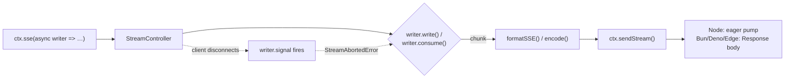
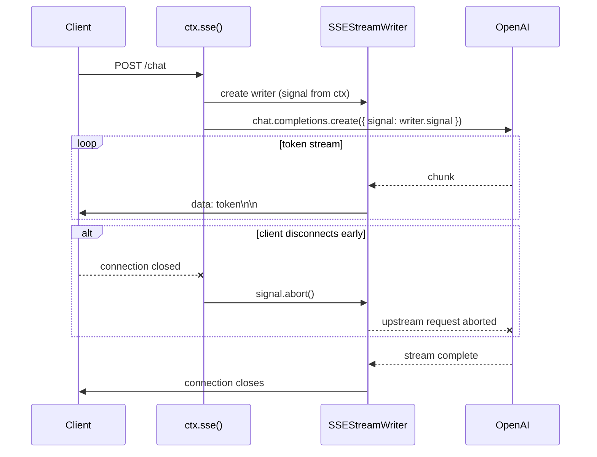
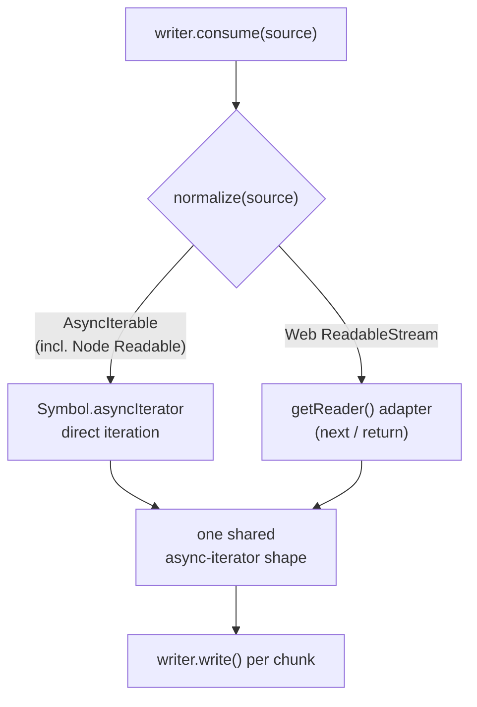
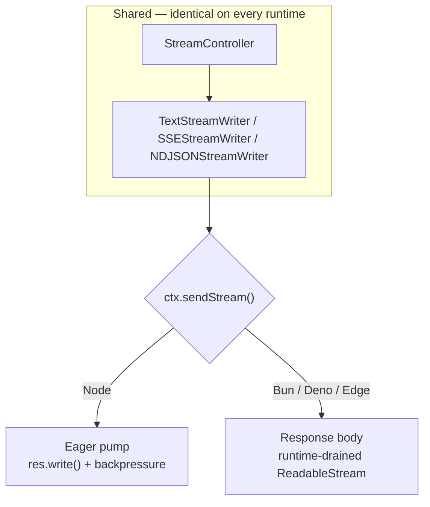

# @nextrush/stream

> Runtime-agnostic response streaming for NextRush — text, Server-Sent Events, and NDJSON. Built for AI/agentic apps, works for any chunked response.

**Support tier:** Public — middleware/registrar (stable). See [ADR-0005](../../docs/adr/ADR-0005-package-tiers-sealed-surface-deprecation.md).

## The Problem

LLM responses don't arrive as a value — they arrive as a sequence of tokens over time. Streaming them correctly means solving four problems at once, and most hand-rolled implementations get at least one wrong:

- **Manual SSE framing is easy to get subtly wrong.** Multi-line `data:` fields need per-line escaping, `event:`/`id:`/`retry:` fields must precede `data:`, and the terminating blank line is easy to forget — all silent failures the browser's `EventSource` parser won't explain.
- **Streaming code is not portable across runtimes.** Node's `ServerResponse.write()` and the Fetch `Response`/`ReadableStream` model used by Bun, Deno, and edge runtimes are fundamentally different APIs. A handler written for one doesn't run on the other without a rewrite.
- **Cancellation is usually missing entirely.** When a user closes a chat tab mid-response, nothing tells the handler to stop. The upstream LLM call keeps running and keeps costing money for tokens nobody will read.
- **Bypassing the Context API breaks the framework's own contract.** Without a streaming primitive, the only escape hatch is `ctx.raw.res` — defeating the point of a unified request/response API.

## Mental Model

`ctx.stream()` / `ctx.sse()` / `ctx.ndjson()` all follow the same shape: pass a callback, receive a protocol-specific writer, write until done. The connection closes automatically when the callback resolves — nothing to remember, nothing to configure first.



`StreamController` owns cancellation, backpressure, and source normalization exactly once. `TextStreamWriter`, `SSEStreamWriter`, and `NDJSONStreamWriter` are thin formatters on top of it — each knows one wire format and nothing else.

## What NextRush Does Differently

| Capability | Detail |
| --- | --- |
| Three protocol-specific entry points | `ctx.stream()` (text/bytes), `ctx.sse()` (Server-Sent Events), `ctx.ndjson()` (newline-delimited JSON) — each writer speaks exactly one wire format |
| Writer-callback API | No options bag to read before the first working handler — the shape teaches itself in one example |
| Real cancellation | `writer.signal` fires the instant the client disconnects; wire it into any AI SDK's abort option and the upstream call actually stops |
| Loud failure on write-after-abort | Throws `StreamAbortedError` rather than silently dropping data — a careless handler still can't produce a corrupted response |
| One shared lifecycle, verified per runtime | Node, Bun, Deno, and edge all run the exact same handler unmodified |
| Zero dependencies | Built only on Web-standard `ReadableStream` / `AbortSignal` |

## Installation

`@nextrush/stream` ships as part of every platform adapter — `ctx.stream()`, `ctx.sse()`, and `ctx.ndjson()` work out of the box with `nextrush`. Install it directly only to use `StreamController`, `StreamAbortedError`, or `formatSSE` for advanced integrations.

```bash
pnpm add @nextrush/stream
```

## Quick Start

```typescript
import { createApp } from '@nextrush/core';

const app = createApp();

app.get('/progress', async (ctx) => {
  await ctx.stream(async (writer) => {
    await writer.write('Loading...\n');
    await writer.write('Processing...\n');
    await writer.write('Done.\n');
  });
});
```

No options, no headers to set, no content type to remember. The connection closes automatically when the callback returns.

## Server-Sent Events (SSE)

The primary shape for LLM chat UIs. `ctx.sse()` sets `Content-Type: text/event-stream` and `Cache-Control: no-cache`, and formats every event to spec — multi-line `data:` escaping, `event:`/`id:`/`retry:` fields, the terminating blank line.

```typescript
app.post('/chat', async (ctx) => {
  await ctx.sse(async (writer) => {
    const completion = await openai.chat.completions.create(
      { model: 'gpt-5', messages: ctx.body as ChatMessage[], stream: true },
      { signal: writer.signal } // abort OpenAI the instant the client disconnects
    );

    for await (const chunk of completion) {
      const token = chunk.choices[0]?.delta?.content;
      if (token) await writer.write({ data: token });
    }
  });
});
```

Sequence of a single streamed request:



## NDJSON

For structured agent traces and tool-call logs where SSE framing isn't needed — server-to-server pipelines, CLI consumers.

```typescript
app.post('/agent/trace', async (ctx) => {
  await ctx.ndjson(async (writer) => {
    await writer.write({ type: 'tool_call', name: 'search', args: { query: '...' } });
    const result = await runTool('search', { query: '...' });
    await writer.write({ type: 'tool_result', result });
    await writer.write({ type: 'final_answer', text: '...' });
  });
});
```

## Consuming an Existing Source

AI SDKs and database cursors already hand you an `AsyncIterable` or `ReadableStream`. `writer.consume()` adapts it in one call — no manual loop, no manual type-checking.

```typescript
// LangChain — model.stream() already returns an AsyncIterable
app.post('/agent', async (ctx) => {
  await ctx.sse(async (writer) => {
    const model = new ChatOpenAI({ model: 'gpt-5', streaming: true });
    const stream = await model.stream(ctx.body as string, { signal: writer.signal });
    await writer.consume(stream);
  });
});

// Vercel AI SDK
app.post('/ai', async (ctx) => {
  await ctx.sse(async (writer) => {
    const result = streamText({
      model: openai('gpt-5'),
      prompt: (ctx.body as { prompt: string }).prompt,
      abortSignal: writer.signal,
    });
    await writer.consume(result.textStream);
  });
});
```

For `ctx.sse()`, each consumed chunk is automatically wrapped as `{ data: chunk }`. Node `Readable`, Web `ReadableStream`, and `AsyncIterable` are all accepted — normalized internally to one code path, never branched on in application code:



## Cancellation

Every writer exposes real cancellation, not just a documentation promise. Wire `writer.signal` into the upstream SDK's abort option, and closing the browser tab stops the LLM call, not just the HTTP response.

```typescript
await ctx.sse(async (writer) => {
  writer.onAbort(() => console.log('client disconnected — upstream cancelled'));

  for await (const chunk of completion) {
    if (writer.aborted) break; // optional early exit for expensive work
    await writer.write({ data: chunk }); // throws StreamAbortedError once aborted
  }
});
```

| Member | Description |
| --- | --- |
| `writer.signal` | `AbortSignal` that fires on client disconnect. Pass into any SDK's `{ signal }` option. |
| `writer.aborted` | `true` once the client has disconnected. |
| `writer.onAbort(fn)` | Register a cleanup callback. Fires once — immediately if already aborted. |

Writing after disconnect **throws** `StreamAbortedError` — it does not silently no-op. The framework catches it at the `ctx.stream()` / `ctx.sse()` / `ctx.ndjson()` boundary and closes cleanly: it is never logged as an error and never re-thrown to the caller. A handler that ignores cancellation entirely still cannot produce a response that silently drops data.

## Error Handling

There is one error-handling model — `try`/`catch` — not a second callback to learn. Handle errors inside the streaming callback while the writer is still live:

```typescript
await ctx.sse(async (writer) => {
  try {
    await runAgent(writer);
  } catch (error) {
    await writer.write({ event: 'error', data: (error as Error).message });
  }
});
```

> **Note:** once a stream has started, headers are already on the wire. A global error-handling middleware can observe and log an error that propagates out of a streaming handler, but it cannot rewrite a response that has already begun — the same constraint that already applies to calling `ctx.json()` after `ctx.send()` has responded. Write a final error event inside the callback if the client needs to see it.

## API Reference

### `ctx.stream(run)` / `ctx.sse(run)` / `ctx.ndjson(run)`

Each takes one callback receiving a protocol-specific writer. The connection closes automatically when the callback resolves.

| Entry point | Writer | `write()` accepts | Content-Type |
| --- | --- | --- | --- |
| `ctx.stream()` | `TextStreamWriter` | `string \| Uint8Array` | `text/plain; charset=utf-8` |
| `ctx.sse()` | `SSEStreamWriter` | `SSEEvent` — `{ data, event?, id?, retry? }` | `text/event-stream; charset=utf-8` |
| `ctx.ndjson()` | `NDJSONStreamWriter` | any JSON-serializable value | `application/x-ndjson; charset=utf-8` |

All three writers share:

```typescript
interface BaseStreamWriter {
  readonly aborted: boolean;
  readonly signal: AbortSignal;
  onAbort(fn: () => void): void;
  consume(source: AsyncIterable<T> | ReadableStream<T> | NodeJS.ReadableStream): Promise<void>;
}
```

Set custom headers (e.g. a different `Content-Type`) with `ctx.set(...)` before calling the streaming method — there is no options bag on the streaming methods themselves.

### Low-level API

For advanced use — building a custom writer, or integrating streaming logic outside a NextRush `Context`:

```typescript
import {
  StreamController, // owns abort / backpressure / normalize / enqueue lifecycle
  StreamAbortedError, // thrown on write-after-abort
  formatSSE, // SSEEvent -> wire-format string
  runTextStream, // ctx.stream() implementation
  runSSEStream, // ctx.sse() implementation
  runNDJSONStream, // ctx.ndjson() implementation
  TextWriter,
  SSEWriter,
  NDJSONWriter,
} from '@nextrush/stream';
```

Most applications never need these — they exist so platform adapters (and custom adapters) can build `ctx.stream()` / `ctx.sse()` / `ctx.ndjson()` without duplicating lifecycle logic.

### Types

```typescript
import type {
  BaseStreamWriter,
  TextStreamWriter,
  SSEStreamWriter,
  NDJSONStreamWriter,
  SSEEvent,
  StreamSource,
  StreamRun,
} from '@nextrush/stream';
```

## Runtime Compatibility

| Runtime | Supported | Transport model |
| --- | --- | --- |
| Node.js 22+ | ✅ | Eager pump — writes directly to `ServerResponse` with backpressure |
| Bun 1.0+ | ✅ | Native `Response` body — the runtime drains the stream |
| Deno 1.0+ | ✅ | Native `Response` body — the runtime drains the stream |
| Cloudflare Workers / Vercel Edge | ✅ | Native `Response` body — the runtime drains the stream |

The public writer API is identical across all four runtimes — only the internal transport primitive (`ctx.sendStream()`) differs per adapter, and application code never touches it directly.



Verified with real integration tests against Node's HTTP server, and against real `Bun.serve` / `Deno.serve` instances producing byte-identical output.

## Security Considerations

- **`writer.signal` prevents cost-leak from abandoned connections.** Without wiring it into an upstream SDK's abort option, a disconnected client still leaves the LLM request running server-side. Always pass `{ signal: writer.signal }` (or the SDK's equivalent) to any long-running upstream call inside a streaming handler.
- **SSE field injection is prevented automatically.** `event:` and `id:` values have carriage returns and newlines stripped before framing — a value containing `\n` cannot inject an additional SSE field or event.
- **No server-side replay buffers.** `id:` / `retry:` fields let *clients* implement reconnection; NextRush does not persist event history for replay. Build that at the application layer if needed.

## Non-Goals

- No LLM SDK integration ships in this package — examples above are patterns, not dependencies.
- No WebSocket overlap — see [`@nextrush/websocket`](../plugins/websocket) for bidirectional streaming. This package is strictly server → client.
- No transform pipelines (`.through()`) in the current API. The internal design (`normalize()` as a distinct step from consumption) leaves room for this without a breaking change, but it is not implemented today.

## See Also

- [Architecture documentation](./ARCHITECTURE.md) — internal design of `StreamController`, backpressure, and cross-runtime wiring
- [`docs/RFC/request-data/003-stream.md`](../../docs/RFC/request-data/003-stream.md) — full design rationale and API decision history
- [`@nextrush/core`](../core) — application framework
- [`@nextrush/adapter-node`](../adapters/node) — Node.js HTTP adapter

## License

MIT © [Tanzim Hossain](https://github.com/0xTanzim)
