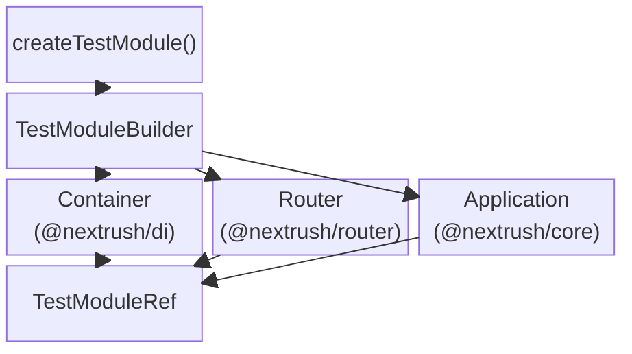
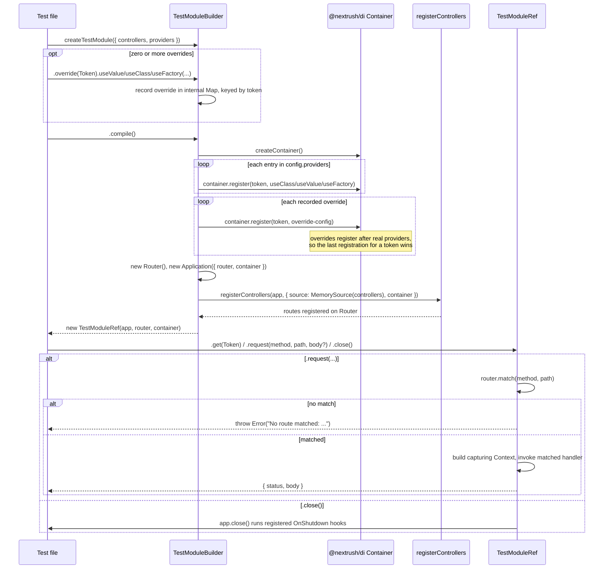

# @nextrush/testing — Architecture

> The internal design of the test-module harness: how `createTestModule().override().compile()` builds an isolated container and router, and how `TestModuleRef` drives requests against it.

## At a glance

|  |  |
| --- | --- |
| **Package** | `@nextrush/testing` |
| **Layer** | tooling (sits above `core`/`router`/`di`/`class`, consumed only by test files) |
| **Depends on** | `@nextrush/core`, `@nextrush/router`, `@nextrush/di`, `@nextrush/class`, `@nextrush/types`, `reflect-metadata` |
| **Depended on by** | nothing in the framework — a leaf package imported only from `*.test.ts` files in application code |
| **Public entry** | `src/index.ts` (barrel — exports only) |
| **Internal modules** | 1 file (`test-module.ts`) · ~230 LOC |
| **On the request hot path?** | no — test-only, never runs in production |
| **Runtime coupling** | Node-only in practice (imports `vitest`'s `vi.fn()` for stub methods); the compiled `Application`/`Router`/container it builds are runtime-independent |
| **State model** | one fresh container + router per `.compile()` call — nothing shared across compiles |

## Responsibilities

**This package owns:**
- ✓ Building an isolated `Container` + `Router` + `Application` triple per test module
- ✓ Recording provider overrides and applying them after real providers, so overrides always win
- ✓ Driving a single request through the compiled router with a capturing `Context`
- ✓ Delegating controller registration to the real `registerControllers` pipeline (via `MemorySource`)

**This package does NOT own:**
- ✗ DI container semantics (scopes, resolution, request-scope bubbling) — owned by `@nextrush/di`
- ✗ Controller/route wiring or discovery — owned by `@nextrush/class` (`registerControllers`, `MemorySource`)
- ✗ HTTP transport, sockets, or adapter behavior — owned by `@nextrush/adapter-*`
- ✗ Cross-adapter parity — owned by `packages/adapters/conformance`

## Non-goals

- Does not start a real HTTP server or open a socket — `.request()` calls the matched handler directly
- Does not provide assertion helpers (`expect`, matchers) — bring your own test runner
- Does not mock `@nextrush/core` or `@nextrush/class` internals — it exercises the real `Application`, `Router`, and `registerControllers` code paths, only the DI providers are swappable

## Constraints

Must remain:
- Runtime-independent in the container/router it builds — only the test-file side depends on Node/Vitest
- Behaviorally identical to what `registerControllers` does in a real, running app — a passing test here must reflect real production wiring, not a shortcut around it
- ESM-only, public API stable (ADR-0005)

## Position in the package hierarchy

```mermaid
block-beta
  columns 1
  types["@nextrush/types"]
  errors["@nextrush/errors"]
  core["@nextrush/core"]
  router["@nextrush/router"]
  runtime["@nextrush/runtime"]
  di["@nextrush/di"]
  class["@nextrush/class"]
  THIS["@nextrush/testing — this package"]

  types --> errors
  errors --> core
  core --> router
  router --> runtime
  runtime --> di
  di --> class
  class --> THIS

  style THIS fill:#2563eb,color:#fff,stroke:#1e40af
```

> [!IMPORTANT]
> `@nextrush/testing` imports downward only, from `core`, `router`, `di`, `class`, and `types`. Nothing in the framework imports `@nextrush/testing` back — it is a leaf, consumed exclusively by application test files.

**Dependency rules:**
- **Allowed:** `@nextrush/testing → @nextrush/core`, `→ @nextrush/router`, `→ @nextrush/di`, `→ @nextrush/class`, `→ @nextrush/types`
- **Forbidden:** any framework package importing `@nextrush/testing`

---

## Overview

`@nextrush/testing` exists to answer one question honestly: "does my controller behave correctly when this one dependency is swapped for a fake?" — without either booting a real server or hand-building a fake `Context` per test.

The package is a thin builder over three real framework primitives it does not reimplement: `createContainer()` from `@nextrush/di`, `new Router()` from `@nextrush/router`, and `registerControllers()` from `@nextrush/class`. Every `.compile()` call assembles a fresh instance of each, so the wiring a test exercises is the same wiring a running app uses — the only thing this package adds is the ability to intercept individual provider tokens before that wiring happens, and a way to invoke a matched route handler without opening a socket.

### Design principles

1. **Real wiring, fake I/O.** The DI container, router, and controller registration are the genuine `@nextrush/*` implementations — only the transport (HTTP) and, optionally, individual providers are substituted. Enforced by construction: `TestModuleBuilder.compile()` calls `createContainer()`, `new Router()`, and `registerControllers()` directly, with no internal test-only reimplementation of any of the three.
2. **Overrides always win.** Real providers register first, overrides second, into the same container — `Container.register()` for a given token is idempotent-last-write, so the later override call is what a resolution sees. Verified by the isolation and override test groups in `src/__tests__/test-module.test.ts`.
3. **No shared state across compiles.** `createContainer()` returns a brand-new container object every call; nothing module-level is cached. Verified by the "ISOLATION" test group asserting `ref1.get(X) !== ref2.get(X)` across two `.compile()` calls.

---

## Module structure

```text
src/
├── index.ts          # Public API exports (barrel only, no implementation)
└── test-module.ts     # TestModuleBuilder, TestModuleRef, createTestModule, and the
                       # registerProvider/registerOverride container-wiring helpers
```

### Module responsibilities

| Module | Responsibility (the one thing it owns) |
| ------ | ---------------------------------------- |
| `index.ts` | Re-exports `createTestModule`, `TestModuleBuilder`, `TestModuleRef`, and the `TestModuleConfig` type |
| `test-module.ts` | Builder/override recording, container assembly, controller registration, and the capturing `Context` used by `.request()` |

## Component relationships



`TestModuleBuilder` holds configuration and recorded overrides only — it constructs nothing until `.compile()` runs. `.compile()` is the single point where a `Container`, `Router`, and `Application` are instantiated and wired together into the `TestModuleRef` returned to the caller.

---

## Lifecycle



The override map is applied strictly after every provider in `config.providers` has registered — `compile()` iterates `config.providers` first, then `this.overrides.values()` second, so a token present in both always resolves to the override.

## State ownership

| Owner | State it owns | Scope |
| ----- | -------------- | ----- |
| `TestModuleBuilder` | `config` (controllers/providers) and the `overrides` map | per builder instance, until `.compile()` |
| `Container` (from `@nextrush/di`) | provider registrations and resolved instances | per compiled module — a fresh container every `.compile()` call |
| `Router` (from `@nextrush/router`) | the route tree built by `registerControllers` | per compiled module |
| `TestModuleRef` | references to the compiled `Application`, `Router`, `Container` | per compiled module, held for the test's lifetime |

---

## Concurrency & edge behaviour

- **Shared, immutable after compile:** none — every `.compile()` call produces its own container/router, with no shared mutable state across calls, verified by the isolation test group
- **Per-compile, never shared:** the container, router, and any request-scoped provider instances resolved through `.request()`
- **Abort / disconnect / timeout:** not applicable — `.request()` invokes the matched handler function directly and awaits it; there is no network layer to abort or time out

> [!WARNING]
> `.override(token)` matches by exact token identity (the class reference or symbol passed to `providers`). Re-declaring a class with the same name and overriding that instead of the original reference silently fails to override anything, because the two are different tokens to the container.

## Trust boundaries

```text
Test file (trusted, developer-authored) ──▶ createTestModule(config) ──▶ real DI/router/registerControllers
```

There is no untrusted external input in this package — configuration and overrides come entirely from the test author. The one boundary worth naming is between this package's capturing `Context` and the real `Context` interface from `@nextrush/types`: the stub sets `status`, `responseBody`, `json`/`send`/`html`, and a fixed `ip: '127.0.0.1'`, and narrows the router's stored handler type at the call boundary rather than proving it structurally.

## Extension points

**Supported extension points:**
- Any `@Controller`/`@Service` class from `@nextrush/class` can be passed to `controllers`/`providers` — no registration beyond what `registerControllers` already supports
- `.override(token)`'s three terminal methods cover every provider shape `@nextrush/di` supports (value, class, factory-with-inject)

**Forbidden (sealed):**
- The capturing `Context` built inside `.request()` is private (`createCapturingContext`) — not meant to be constructed or extended directly by test authors
- `TestModuleBuilder`'s internal `overrides` Map and `config` fields are private — interact only through `.override()` and the constructor argument

---

## Architectural invariants

The following are part of the package architecture. They do not change without an RFC:

- Every `.compile()` call produces a container, router, and application with zero state shared with any other compiled module.
- Providers register before overrides, so an override for a given token always takes priority over a real provider registered for the same token.
- `.request()` never opens a network socket or touches an adapter — it matches the compiled router directly and invokes the handler in-process.
- `.close()` delegates to `Application.close()`, so `OnShutdown` hooks run exactly as they would in a real app shutdown.

## Engineering decisions

| Decision | Chosen | Trade-off accepted | Reference |
| -------- | ------ | -------------------- | --------- |
| Reuse real `registerControllers`/`Container`/`Router` instead of a test-only reimplementation | Compose the real primitives | Couples this package to internal-but-stable APIs of `core`/`router`/`di`/`class` | — |
| Overrides recorded in a `Map`, applied after providers at compile time | Deferred application over immediate registration | An override set after `.compile()` has already run has no effect — overrides must be chained before `.compile()` | — |
| `.request()` builds a minimal capturing `Context` rather than a full adapter-backed one | Narrow, purpose-built stub | Does not exercise real header parsing, streaming, or adapter-specific behavior — that is the conformance suite's job, not this package's | — |

## Rejected alternatives

### Booting a real HTTP server per test
Rejected because it is slow (real socket bind/teardown per test), introduces port-conflict flakiness under parallel test execution, and tests transport behavior this package explicitly treats as someone else's responsibility (the adapter layer).

### A test-only DI container reimplementation
Rejected because a fake container risks drifting from `@nextrush/di`'s real resolution/scope semantics — a passing test would then prove nothing about production behavior. Using the real `createContainer()` keeps the test harness honest by construction.

---

## Testing strategy

- **Unit:** `src/__tests__/test-module.test.ts` covers resolution, all three override strategies, request-driven routing, isolation across compiles, request-scope freshness per `.request()` call, and `.close()`'s `OnShutdown` trigger
- **Integration:** the same test file is itself an integration test in effect — it exercises real `@nextrush/di`, `@nextrush/router`, and `@nextrush/class` code, not mocks of them
- **Invariant tests:** the "ISOLATION" describe block directly asserts the no-shared-state invariant; the override describe block asserts override-wins-over-provider
- **Conformance / cross-adapter parity:** N/A — this package never touches an adapter
- **Benchmark / regression:** N/A — not a hot-path package
- **Coverage:** >=90% lines/functions (CI-enforced)

## Evolution strategy

- **Stable (semver-guarded):** `createTestModule`, `TestModuleBuilder`, `TestModuleRef`, `TestModuleConfig` — locked by `src/__tests__/public-surface.test.ts`
- **May change without notice:** the internal capturing `Context` shape, the `registerProvider`/`registerOverride` helper functions
- **Changes only via RFC:** the override-after-provider ordering guarantee, and the requirement that `.compile()` delegate to the real `registerControllers` pipeline

## Contributor notes

Before changing this package, read `src/__tests__/test-module.test.ts` in full — its describe-block labels (`(a)` through `(f)`) double as the behavioral contract this file documents, and `src/__tests__/public-surface.test.ts` locks the exact runtime export list.

## Architecture checklist

Before changing this package, confirm:
- [ ] Does this preserve the architectural invariants above (isolation, override priority, no-socket request driving, real `OnShutdown` on close)?
- [ ] Does this increase coupling to `core`/`router`/`di`/`class` internals beyond their published entry points?
- [ ] Does this change the public API (`createTestModule`, `TestModuleBuilder`, `TestModuleRef`, `TestModuleConfig`) — semver/ADR-0005 implications?
- [ ] Does the change stay covered by `src/__tests__/test-module.test.ts` and `public-surface.test.ts`?

---

## References & see also

- **README (how to use it):** [`./README.md`](./README.md)
- **ADR:** [ADR-0005 — Package tiers & sealed-surface deprecation](../../docs/adr/ADR-0005-package-tiers-sealed-surface-deprecation.md)
- **Benchmarks:** not applicable — this package is not on any request hot path
