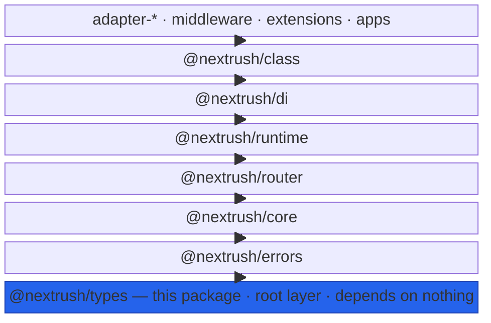
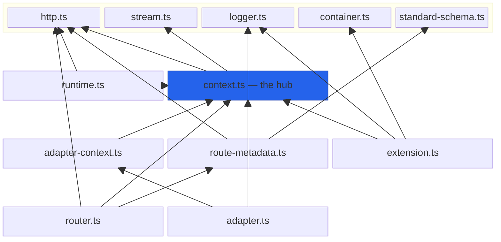

# @nextrush/types — Architecture

> Internal design of NextRush's contract package: how the shared TypeScript shapes are grouped across modules, how `Context` composes the HTTP / runtime / stream types, and why this package sits at the bottom of the hierarchy with zero dependencies.

## At a glance

|  |  |
| --- | --- |
| **Package** | `@nextrush/types` |
| **Layer** | `types` — the root of the package graph (below `errors` and everything else) |
| **Depends on** | none — zero dependencies (imports no other package) |
| **Depended on by** | `@nextrush/errors`, `core`, `router`, `runtime`, `di`, `class`, every adapter and middleware, and the `nextrush` meta package |
| **Public entry** | `src/index.ts` (barrel — exports only) |
| **Internal modules** | 13 files · 2,088 LOC · largest `context.ts` 535 LOC (above the 300 target — see Contributor notes) |
| **On the request hot path?** | **No** — compile-time contracts; the only runtime artifacts are four constants |
| **Runtime coupling** | None — no `node:*`, no runtime globals; stream types are structural |
| **State model** | Stateless — type declarations plus four immutable constant values |

## Responsibilities

**This package owns:**

- ✓ The **`Context` contract** — the request/response shape every handler and middleware reads and writes
- ✓ The **`Middleware` / `Next` / `RouteHandler`** function contracts (Koa-style, dual-signature)
- ✓ **HTTP primitives** — `HttpMethod`, the `HttpStatus` / `ContentType` constants, header and body type unions, `RawHttp`
- ✓ The **cross-package interface contracts** — `Router`, `Container` (DI), `Extension`, `Logger`, and the adapter conformance shapes
- ✓ The **route-metadata contracts** (`RouteDefinition` / `RouteMetadata`) and the `ROUTE_METADATA` contribution symbol
- ✓ The **streaming writer contracts** and the vendored `StandardSchemaV1` validation contract

**This package does NOT own:**

- ✗ Any **behavior** — it declares shapes; the implementations live in `core`, `router`, `di`, `class`, `stream`, adapters
- ✗ The **`Context` implementation** — concrete context classes live in the adapters (`@nextrush/adapter-*`)
- ✗ The **DI container implementation** — `@nextrush/di` implements the `Container` contract
- ✗ **HTTP error classes** — `@nextrush/errors` owns the `HttpError` hierarchy (and depends on this package)
- ✗ **Runtime detection logic** — this declares the `Runtime` / `RuntimeCapabilities` shapes; `@nextrush/runtime` detects

## Non-goals

The package intentionally does not:

- Ship runtime helpers, guards, or utility functions — a type package that grows a utility layer becomes a second `core`
- Import `@types/node` or any DOM lib — platform stream shapes are represented structurally instead
- Model validation *logic* — it vendors only the `StandardSchemaV1` *contract*; validation lives in `@nextrush/validation`
- Provide OpenAPI/renderer-specific artifacts — `RouteMetadata` is renderer-agnostic; `@nextrush/openapi` maps it

## Constraints

Must remain:

- **Zero-dependency** — the root of the hierarchy; importing anything would create a cycle
- **Runtime-independent** — no `node:*`, `process`, `Deno`, `Bun`, or DOM globals, so every runtime shares one contract
- **Near-zero runtime** — no logic; only the four constant value exports may emit JavaScript
- **ESM-only** — no CommonJS build
- **Public API sealed** — the exported surface is semver-guarded (ADR-0005); a contract change ripples through every package

## Position in the package hierarchy

`@nextrush/types` is the foundation every other package is built on. Imports flow **upward** from it; it imports nothing.



> [!IMPORTANT]
> The arrows read **"depends on"**: every layer depends (directly or transitively) on `@nextrush/types`,
> and `types` depends on nothing. The chain above is drawn linearly for readability, but higher
> packages import `types` **directly**, not only through the layer beneath them — `core`, `router`,
> and the adapters each import the shared contracts straight from the root.

**Dependency rules:**
- **Allowed:** nothing — `@nextrush/types` has no package to import.
- **Forbidden:** `types → any @nextrush/* package` (that would invert the hierarchy and risk a cycle) — enforced in review (project-rules §1).

---

## Overview

`@nextrush/types` implements a single idea: **one place defines a shape that two or more packages must agree on.** It carries no algorithms and almost no runtime code — it is the framework's type vocabulary, positioned at the bottom of the dependency graph so any layer can reference a contract without depending on an implementation and without risking an import cycle.

The organizing principle is *contracts, not implementations*. `Context` describes what a request/response object exposes; the adapters build concrete objects that satisfy it. `Container` describes a DI container; `@nextrush/di` implements it. `Router` describes route registration and matching; `@nextrush/router` provides the segment-trie implementation. Because TypeScript is structural, a package can `satisfies` one of these contracts without importing a base class — which is exactly how `StandardSchemaV1` lets Zod, Valibot, and ArkType schemas flow through the framework with no adapter.

The modules form a small internal DAG. A handful of leaf modules (`http`, `stream`, `logger`, `container`, `standard-schema`) import nothing internally; `context` composes the HTTP, runtime, and stream shapes into the central request/response contract; and the higher-level contracts (`router`, `route-metadata`, `extension`, `adapter`) build on `context`. The `index.ts` barrel re-exports the public surface and contains no logic.

### Design principles

1. **Contracts, not implementations.** Modules declare `interface` / `type` only; the sole runtime values are four `as const` constants. Enforced by review and the near-empty build output.
2. **The root imports nothing.** No internal or external import may point out of this package — a cycle-prevention rule enforced by the hierarchy check (project-rules §1).
3. **Runtime neutrality is structural.** `NodeStreamLike` / `WebStreamLike` model streams by shape, not by importing `@types/node` or DOM libs, so the contract compiles identically on every runtime.
4. **Additive evolution.** Context-object arguments (`ExtensionContext`, `ContextOptions`) are objects, so new fields are additive and never break an existing consumer.
5. **The public surface is explicit and sealed.** `index.ts` re-exports a named surface (ADR-0005); a `public-surface.test.ts` guards it against accidental additions or removals.

---

## Module structure

```text
src/
├── index.ts            # Public API barrel (exports only, no implementation)
├── http.ts             # HttpMethod, HttpStatus/HTTP_METHODS/ContentType constants, headers, body & RawHttp types, structural stream shapes
├── context.ts          # Context contract + Middleware/Next/RouteHandler, ContextOptions, RouteParams/QueryParams/ContextState
├── adapter-context.ts  # AdapterContext / FetchContext / AdapterContextFactory — additive supersets of Context
├── adapter.ts          # ServerAdapter / FetchAdapter conformance shapes, ServerAddress, ServerHandle
├── router.ts           # Router interface, Route, RouteMatch, RouterOptions, RoutePattern, RouteParam
├── route-metadata.ts   # RouteDefinition / RouteMetadata, RouteEntry, the ROUTE_METADATA symbol
├── container.ts        # DI Container contract, Provider kinds, Token, Scope, ServiceOptions
├── extension.ts        # Extension / ExtensionContext / ExtensionHost
├── runtime.ts          # Runtime union, RuntimeCapabilities/Info, BodySource
├── stream.ts           # SSEEvent, Base/Text/SSE/NDJSON stream writer contracts
├── standard-schema.ts  # Vendored StandardSchemaV1 contract + InferOutput
└── logger.ts           # Structured Logger interface
```

### Module responsibilities

| Module | Responsibility (the one thing it owns) |
| ------ | -------------------------------------- |
| `http.ts` | The HTTP vocabulary — methods, status/content constants, header & body shapes, `RawHttp`. |
| `context.ts` | The central request/response contract and the middleware function types. |
| `adapter-context.ts` | The transport/lifecycle superset of `Context` adapters and `stream` rely on. |
| `adapter.ts` | The compile-time conformance shapes server- and fetch-style adapters `satisfies`. |
| `router.ts` | The route registration/matching interface and its options. |
| `route-metadata.ts` | The renderer-agnostic route description and the metadata contribution protocol. |
| `container.ts` | The DI container contract every app owns and `@nextrush/di` implements. |
| `extension.ts` | The long-lived-service model (`setup`/`destroy`, decoration). |
| `runtime.ts` | The runtime identity/capability shapes and the cross-runtime `BodySource`. |
| `stream.ts` | The text/SSE/NDJSON writer contracts consumed by `@nextrush/stream`. |
| `standard-schema.ts` | The vendored, dependency-free validation contract shared across packages. |
| `logger.ts` | The four-level structured logging interface. |
| `index.ts` | The sealed public barrel — re-exports only. |

## Component relationships

Internally the modules form a shallow dependency DAG. Leaf modules import nothing; `context` is the hub the higher contracts build on. (Arrows read "imports".)



`context.ts` is the load-bearing module: it composes the HTTP, runtime, and stream shapes and is imported by every higher-level contract. This is why it is the largest file (535 LOC) — see Contributor notes.

---

## Lifecycle

`@nextrush/types` has **no runtime lifecycle**. It is not constructed, booted, or torn down — it is a set of compile-time declarations plus four constant values. At build (`tsup`), every `interface` and `type` is erased and only `HttpStatus`, `HTTP_METHODS`, `ContentType`, and the `ROUTE_METADATA` symbol survive into `dist`.

The only "lifecycle" worth naming is **compile-time conformance**: a consumer imports a contract, and the type checker verifies (structurally) that the consumer's implementation matches it — a schema library satisfying `StandardSchemaV1`, an adapter satisfying `ServerAdapter`, a concrete context satisfying `AdapterContext`. Nothing happens at runtime; the guarantee is discharged entirely by `tsc`.

> [!NOTE]
> Because there is no runtime object here, the sequence/state diagrams a stateful package would
> show do not apply. The relationships that matter are structural (the class diagram below), not
> temporal.

## State ownership

| Owner | State it owns | Scope |
| ----- | ------------- | ----- |
| `HttpStatus` / `HTTP_METHODS` / `ContentType` (module) | Frozen-by-`as const` lookup tables and the method tuple | process — immutable constants |
| `ROUTE_METADATA` (module) | The global `Symbol.for('nextrush.route.metadata')` identity | process — one symbol, cross-instance stable |
| _(every other export)_ | none — types hold no state | compile-time only |

There is no mutable state anywhere in the package. The constants are `as const` (compile-time readonly) and the symbol is created once via the global registry, so it keeps a single identity even if two copies of the package are loaded.

## Data structures

`Context` is the central data structure — a contract, not a class. It composes the HTTP, runtime, and stream shapes rather than inheriting from them, so an adapter can build a concrete object that satisfies it structurally.

```mermaid
classDiagram
    class Context {
      <<interface>>
      +HttpMethod method
      +string url
      +string path
      +QueryParams query
      +IncomingHeaders headers
      +RouteParams params
      +unknown body
      +number status
      +Runtime runtime
      +BodySource bodySource
      +RawHttp raw
      +ContextState state
      +json(unknown) void
      +send(ResponseBody) void
      +stream(StreamRun) Promise
      +sse(StreamRun) Promise
      +ndjson(StreamRun) Promise
      +throw(number, string?) never
      +next() Promise
    }
    class Middleware {
      <<type>>
      (Context, Next) => void | Promise
    }
    class RouteHandler {
      <<type>>
      = Middleware
    }
    class AdapterContext {
      <<interface>>
      +markResponded() void
    }
    class FetchContext {
      <<interface>>
      +getResponse() Response
      +waitUntil(Promise)? void
      +env? unknown
    }

    Context ..> HttpMethod : method
    Context ..> QueryParams : query
    Context ..> IncomingHeaders : headers
    Context ..> RouteParams : params
    Context ..> RawHttp : raw
    Context ..> Runtime : runtime
    Context ..> BodySource : bodySource
    Context ..> ContextState : state
    Context ..> TextStreamWriter : stream()
    Context ..> SSEStreamWriter : sse()
    Context ..> NDJSONStreamWriter : ndjson()
    Middleware ..> Context : receives
    RouteHandler --|> Middleware : alias
    AdapterContext --|> Context : extends
    FetchContext --|> AdapterContext : extends
```

Two shape choices carry weight. First, `Context` **composes** its members (`method: HttpMethod`, `bodySource: BodySource`) rather than extending base types — composition keeps the contract flat and lets an adapter satisfy it without an inheritance chain. Second, the adapter surfaces (`AdapterContext`, `FetchContext`) are **additive supersets** — they extend `Context` with transport primitives (`markResponded()`, `getResponse()`, `waitUntil()`) so `@nextrush/stream` and the adapters can depend on them without coupling to a concrete class, and a consumer typed as plain `Context` never sees the extra surface.

## Concurrency & edge behaviour

- **Shared, immutable:** the `HttpStatus` / `HTTP_METHODS` / `ContentType` constants and the `ROUTE_METADATA` symbol are process-wide, read-only, and safe to reference concurrently without synchronization.
- **No per-request state:** the package defines the *shapes* of per-request objects (`Context`, `AdapterContext`) but owns no instances — instantiation and per-request lifetime belong to the adapters and `core`.
- **Duplicate-instance safety:** `ROUTE_METADATA` uses `Symbol.for` (the global symbol registry) precisely so the metadata-contribution protocol keeps one identity even if two copies of `@nextrush/types` load in a process.

> [!NOTE]
> There is no invariant a contributor can break through concurrency here — the package holds no
> mutable state. The invariants that matter are structural (below).

## Trust boundaries

`@nextrush/types` sits below the request path and processes no input — it declares the shapes through which untrusted data later flows. It defines no trust boundary of its own; it *names* the boundaries that higher packages enforce.

```text
User input ─▶ HTTP ─▶ Context (shape defined HERE) ─▶ validation ─▶ business logic
                          │                              │
        ctx.body: unknown ┘        StandardSchemaV1 (contract defined HERE)
        — deliberately `unknown`, forcing a narrow/validate before use
```

The one boundary-relevant design decision is that `Context.body` is typed `unknown`, not `any` — a consumer cannot read it without narrowing or validating first, so the contract nudges every handler toward validating untrusted input. Enforcement of that validation lives in `@nextrush/validation` (via the `StandardSchemaV1` contract this package vendors), not here.

## Extension points

**Supported extension points:**

- **Structural conformance** — any type may `satisfies` `ServerAdapter`, `FetchAdapter`, `StandardSchemaV1`, `Logger`, or `Container` without importing a base class; this is the intended way to plug in.
- **Additive interface extension** — `AdapterContext` / `FetchContext` extend `Context`; a new adapter surface should extend, never redefine.
- **The metadata protocol** — contribute route metadata by attaching the `ROUTE_METADATA` symbol; renderers read it.

**Forbidden (sealed):**

- Adding a **runtime helper or logic** to this package — it must stay a contract layer (would violate the near-zero-runtime constraint).
- **Widening `ctx.body` to `any`** or otherwise weakening a contract — it removes the safety every consumer relies on.
- **Importing another `@nextrush/*` package** — inverts the hierarchy and risks a cycle.

---

## Architectural invariants

These are part of the package's architecture. They do not change without an RFC:

- **`@nextrush/types` imports no other package** — it is the root of the graph and must never introduce an outward import.
- **The package contains no runtime logic** — the only runtime exports are the `HttpStatus`, `HTTP_METHODS`, `ContentType` constants and the `ROUTE_METADATA` symbol.
- **No runtime API is referenced** — no `node:*`, `process`, `Deno`, `Bun`, or DOM globals; stream shapes are structural, so every adapter shares one contract.
- **`Context.body` is `unknown`, never `any`** — untrusted input must be narrowed or validated before use.
- **Adapter context surfaces are additive supersets of `Context`** — they extend it and never weaken the base contract.
- **`ROUTE_METADATA` is a `Symbol.for` (global registry) symbol** — its identity holds across duplicate package instances.
- **The public surface is explicit and sealed** — guarded by `public-surface.test.ts` and semver (ADR-0005).

## Engineering decisions

| Decision | Chosen | Trade-off accepted | Reference |
| -------- | ------ | ------------------ | --------- |
| Where cross-package contracts live | A single root `types` package | Every contract change is a wide-blast, semver-sensitive edit | project-rules §1 |
| Container / Logger contracts placement | Here (not in `di` / `core`) | `di` and `core` re-export them; a second name to keep aligned | `container.ts`, `logger.ts` (3.1.0) |
| Standard Schema handling | Vendor the `StandardSchemaV1` type, no dependency | Must track upstream spec changes by hand | `standard-schema.ts` |
| Platform stream types | Structural `NodeStreamLike` / `WebStreamLike` | Looser than the real `Readable` / `ReadableStream` types | `http.ts` |
| Adapter context surface | Additive `AdapterContext` / `FetchContext` supersets | An extra interface layer over `Context` | `adapter-context.ts` (F-13) |
| `HTTP_METHODS` membership | Excludes `TRACE` / `CONNECT` | The tuple and the `HttpMethod` type deliberately differ | `http.ts` |

## Rejected alternatives

### Per-package type declarations (no shared `types` package)
Rejected: letting each package own its `Context` / `Middleware` shape guarantees drift and forces packages to import each other purely to reuse a type — the exact cycle risk the hierarchy forbids. A single root package makes one definition authoritative and keeps the graph acyclic, at the cost of wide-blast contract edits.

### Depending on `@standard-schema/spec` instead of vendoring it
Rejected: adding a runtime dependency to the *root* package would violate the zero-dependency constraint and push that dependency onto every downstream package. Vendoring the (MIT-licensed) contract as a structural type keeps the root dependency-free; the cost is tracking upstream spec revisions manually.

### `AdapterContext` as the base, `Context` as a subset
Rejected: making the transport-heavy adapter shape the base would leak `markResponded()` / `getResponse()` into every handler typed as `Context`. Keeping `Context` minimal and layering adapter surfaces additively on top preserves a clean handler-facing contract.

---

## Testing strategy

- **Public-surface guard:** `__tests__/public-surface.test.ts` asserts the exact set of exports (values + types), so an accidental addition or removal fails CI — the sealed-surface invariant made executable.
- **Type-level tests:** `__tests__/adapter.test.ts` and `adapter-context.test.ts` use `satisfies` / assignability checks to prove the adapter and context contracts hold structurally (the conformance shapes actually conform).
- **Invariant tests:** the export-set and assignability tests together guard the "contracts, not implementations" and "additive supersets" invariants.
- **Cross-adapter parity:** N/A directly — the package has no runtime behavior; adapter parity is proven in `packages/adapters/conformance` against the contracts defined here.
- **Coverage:** ≥90% lines/functions (CI-enforced) — meaningful mostly for the constant modules, since types carry no executable branches.

## Evolution strategy

- **Stable (semver-guarded):** the entire exported surface — every contract, the four constants, and the option/data types (ADR-0005). Because every package depends on it, a breaking change here is a framework-wide major.
- **May change without notice:** internal module *layout* (how types are grouped across files), JSDoc, and the ordering within the barrel — none are observable to consumers.
- **Changes only via RFC:** any change to the `Context` / `Middleware` / `Router` / `Container` / `Extension` / adapter contracts, or to the invariants above.

**Timeline:** `3.0` — HTTP/Context/Router/Runtime contracts and the constants → `3.1` — the Extension model (`Extension`/`ExtensionContext`), per-app DI (`Container` moved here), the Route Metadata System (`RouteDefinition`/`RouteMetadata`/`ROUTE_METADATA`), the shared `StandardSchemaV1` contract, and the adapter conformance shapes (`ServerAdapter`/`FetchAdapter`/`AdapterContext`).

## Contributor notes

Before changing this package, read: [ADR-0005 (package tiers & sealed surface)](https://github.com/0xTanzim/nextRush/blob/main/docs/adr/ADR-0005-package-tiers-sealed-surface-deprecation.md), `__tests__/public-surface.test.ts` (the export guard you must update deliberately, never casually), and the module DAG above (know what imports what before moving a type between files).

Note on size: the package is **2,088 LOC across 13 files** — well above the 500-LOC package target in `architecture.instructions.md`, because it has absorbed the DI, extension, route-metadata, adapter-conformance, streaming, and Standard Schema contracts since that target was set. The bulk is JSDoc and interface declarations (near-zero compiled output), but `context.ts` (535 LOC) is a genuine outlier above the 300-line file cap. It concentrates the central `Context` contract and its heavy per-member documentation; the sanctioned split, if it grows further, is to move the streaming methods and `ContextOptions` into a sibling module — do **not** fragment the `Context` interface itself across files, since consumers rely on it as one shape. Any material growth here should update this note and the `architecture.instructions.md` target in the same change (source wins).

## Architecture checklist

Before changing this package, confirm:

- [ ] Does this preserve the architectural invariants (zero imports, no runtime logic, `body: unknown`)?
- [ ] Does it add an outward import or a runtime dependency (forbidden — it's the root)?
- [ ] Does it change the sealed public surface? Did you update `public-surface.test.ts` deliberately?
- [ ] Does it change a contract every package consumes (semver / ADR-0005)? Does it need an RFC?
- [ ] If a file crosses the size cap, did you split without fragmenting a single consumer-facing contract?

---

## References & see also

- **README (how to use it):** [`./README.md`](./README.md)
- **ADR:** [`ADR-0005 — package tiers & sealed surface`](https://github.com/0xTanzim/nextRush/blob/main/docs/adr/ADR-0005-package-tiers-sealed-surface-deprecation.md)
- **Standard Schema:** [standard-schema/standard-schema](https://github.com/standard-schema/standard-schema) (the vendored contract's upstream)
- **Documentation site:** [nextRush docs](https://0xtanzim.github.io/nextRush/docs)
- **Repository:** [`packages/types`](https://github.com/0xTanzim/nextRush/tree/main/packages/types)
