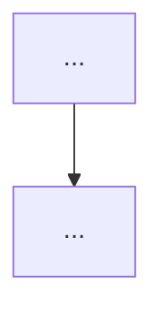
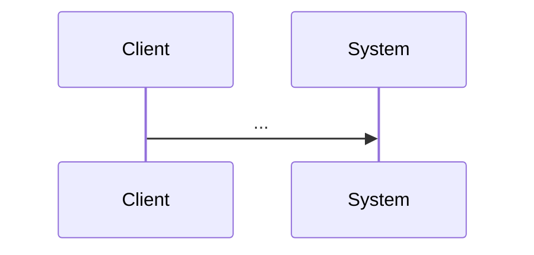

<!--
============================================================================
 NextRush AUDIT / REVIEW REPORT TEMPLATE  —  copy this file, don't edit in place.
============================================================================

WHAT THIS IS
  A point-in-time REVIEW / AUDIT / PROFILE of a system — the findings and
  analysis, not a decision and not a spec. (A decision that comes out of a review
  is an ADR/RFC; the requirements it implements are an OpenSpec change. Cross-link,
  don't duplicate — see report/README.md.)

HOW TO USE
  1. Copy to the domain subfolder with a scope-first name (see report/README.md):
       report/<domain>/<domain>-<subject>-review.md
       e.g. report/router/router-param-allocation-review.md
     Create a new domain folder only when its first report arrives.
     NEVER a generic name (report.md / analysis.md / review.md).
  2. Follow the mandated order below — it is the `architecture-review.md` steering
     structure (Understand → Map → Analyze → Evaluate → Recommend → Report). Do
     not reorder sections or jump between topics.
  3. Every significant finding uses the 9-field block in §12. Drop sections that
     don't apply with "_Not applicable — <reason>_"; never silently delete a heading.
  4. Delete every guidance block (HTML comments + "> 📝" lines) before publishing.
  5. Ground findings in evidence (a file:line, a benchmark number, a trace) and in
     named principles where relevant (SOLID; Hick/Fitts/Jakob's Law for UX) — never
     "feels clunky". Use codebase-memory-mcp to map the system, not manual grep
     (see .kiro/steering/tool-preference.md).

METHOD: understand BEFORE judging. Explain how the system works today before
evaluating it. Assume existing decisions had reasons — find the reason before
proposing an alternative. Never open with a raw issue list.
============================================================================
-->

# <Domain> — <Subject> Review

<!-- 📝 e.g. "Router — Route-Param Allocation Review". Matches the filename scope. -->

| Field           | Value                                                              |
| --------------- | ------------------------------------------------------------------ |
| **Report type** | `Architecture` <!-- Architecture · Backend · Database · Frontend · UX · Performance · Security · Feature --> |
| **Scope**       | `<packages / subsystem / feature under review>`                    |
| **Date**        | `YYYY-MM-DD`                                                       |
| **Reviewer(s)** | `<name / role>`                                                   |
| **Commit / ref**| `<git sha or tag the review was taken against>`                    |
| **Status**      | `Draft` <!-- Draft → Final --> |
| **Related**     | `docs/RFC/…`, `docs/adr/…`, `openspec/…` <!-- what this spawned/cites --> |

---

## Progress Tracker

<!--
> 📝 One-glance remediation status. Update the bar and rows as the findings in §12
>    / recommendations in §14 are resolved — this and §14 must always agree.
>    Bar = 20 cells, one █ per 5% (same convention as the RFC/ADR templates).
>    Legend: ✅ resolved · 🔄 in progress · ⬜ open · ⛔ blocked · ➖ won't fix (deferred)
>    While the report itself is being written (Status: Draft), this tracks review
>    coverage instead; once Final, it tracks remediation of the recommendations.
-->

**Remediation:** `[░░░░░░░░░░░░░░░░░░░░]` 0% — 0 / N recommendations resolved

| Rec | Addresses | Priority | Status  |
| --- | --------- | -------- | ------- |
| 1   | F-01      | P0       | ⬜ Open  |
| 2   | F-03      | P1       | ⬜ Open  |

---

## 1. Executive Summary

<!--
> 📝 For someone who reads ONLY this. State: what was reviewed, the overall health
>    in one honest sentence, the 3–5 most important findings, and the headline
>    recommendation. No robotic/dramatic language — "this service coordinates
>    several unrelated responsibilities", not "this is terrible".
-->

_2–4 short paragraphs, or a tight bullet list of the top findings with severity._

**Top findings:**
1. _`<finding>` — Priority `<P0/P1/P2>`._
2. _…_

---

## 2. System Understanding

<!--
> 📝 Prove you understand it before judging. Explain what the system does, its
>    purpose/domain, and how it's put together — in the system's own terms. This
>    section is why the reader trusts the findings that follow.
-->

_How the reviewed system works today, and the reasons its current design likely
made sense._

---

## 3. Architecture Overview

<!--
> 📝 The structure: modules/packages, boundaries, dependencies, layering. A
>    diagram earns its place here (C4 for structure). Tie to the package graph in
>    .kiro/steering/architecture.instructions.md.
-->

---

## 4. Data Flow

<!--
> 📝 How a request/data moves through the reviewed scope. A sequence diagram beats
>    prose when there's ordering or branching.
-->

---

## 5. Backend / Logic

<!-- 📝 Correctness, separation of concerns, error handling, complexity. Evidence-cited. -->
_Findings (use the §12 block for significant ones)._

## 6. Database / State

<!-- 📝 Schema, queries, N+1, indexing, transactions, migrations. N/A if none. -->
_Findings, or "_Not applicable — <reason>_"._

## 7. Frontend / API Surface

<!-- 📝 Public API ergonomics, contracts, type safety, DX. N/A if backend-only. -->
_Findings, or N/A._

## 8. UX

<!--
> 📝 From the USER's perspective: discoverability, cognitive load, unnecessary
>    steps, loading/empty states, feedback, accessibility, consistency. Ground in
>    named laws (Hick's, Fitts's, Jakob's, Doherty, Peak-End) — name the law + the
>    visible trigger. Flag any dark pattern as a hard, non-negotiable finding. N/A
>    for non-user-facing scope.
-->
_Findings, or N/A._

## 9. Performance

<!--
> 📝 Hot-path allocations, algorithmic complexity, cold start, bundle size — with
>    MEASURED numbers from apps/benchmark, not guesses. Baseline vs observed.
-->
_Findings with numbers, or N/A._

## 10. Security

<!--
> 📝 Untrusted input, injection/ReDoS, header/prototype pollution, authz ordering,
>    secret/PII leakage in errors, size limits (project-rules §3–§4). Rate any
>    finding by severity.
-->
_Findings, or N/A._

## 11. Maintainability

<!--
> 📝 Code shape vs .kiro/steering/code-structure.md: file-size ceilings, god
>    files/components, flat folders, business logic in the wrong layer, comment
>    discipline, test coverage. Also flag OVER-engineering, not just under.
-->
_Findings._

---

## 12. Findings (detailed)

<!--
> 📝 Every significant finding gets ALL nine fields (architecture-review.md). This
>    is what lets the team DECIDE instead of being told what to do. Repeat the
>    block per finding. Give each a stable ID (F-01, F-02) so the checklist and
>    other docs can reference it.
-->

### F-01 — `<short finding title>`  ·  Priority `<P0 | P1 | P2>`

- **Current situation:** _What exists today (with evidence — file:line, metric, trace)._
- **Impact:** _What it costs now (correctness, perf, security, DX, maintenance)._
- **Benefits (of today's design):** _Why it was likely done this way — the upside it does provide._
- **Drawbacks:** _The concrete problems it causes._
- **Long-term risk:** _What happens if left unaddressed as the system grows._
- **Recommendation:** _The specific change proposed — tied to a real problem, not "a different design exists"._
- **Trade-offs:** _What the recommendation costs; what each alternative gains/loses._
- **Priority:** _P0 (fix now) / P1 (soon) / P2 (documented-but-deferred)._
- **Migration difficulty:** _Trivial / Moderate / Hard — and why._

### F-02 — `<short finding title>`  ·  Priority `<…>`

_…repeat the nine fields…_

---

## 13. Risks

<!-- 📝 System-level risks surfaced by the review, with likelihood/impact. Distinct
     from individual findings — these are the "what could bite us" cross-cuts. -->

| Risk                     | Likelihood | Impact | Mitigation                     |
| ------------------------ | ---------- | ------ | ------------------------------ |
| _`<risk>`_               | Low/Med/High | Low/Med/High | _`<how to contain>`_    |

---

## 14. Recommendations (prioritised)

<!-- 📝 The consolidated action list, ordered by priority. Each links to its F-ID.
     Every recommendation solves a concrete, named problem (no change-for-its-own-sake). -->

| # | Recommendation                  | Addresses | Priority | Effort | Status  |
| - | ------------------------------- | --------- | -------- | ------ | ------- |
| 1 | _`<action>`_                    | F-01      | P0       | S/M/L  | ⬜ Open  |
| 2 | _`<action>`_                    | F-03      | P1       | S/M/L  | ⬜ Open  |

<!-- 📝 As each recommendation is implemented, flip its Status to ✅ here AND
     update the Progress Tracker bar at the top. The two must never disagree. -->

---

## 15. Migration Strategy

<!-- 📝 If recommendations imply change: the ordered, low-risk path to get there
     (what ships first, what's reversible, what's gated). N/A if review-only. -->

_Ordered path, or "_Not applicable — findings are documented-but-deferred_"._

---

## 16. Conclusion

<!-- 📝 Honest overall assessment + the single most important next step. No new
     findings introduced here — this only synthesises what's above. -->

_The bottom line and the practical next step._

---

<!--
============================================================================
 DONE CHECKLIST — tick each before setting Status to "Final":
============================================================================
-->
## Checklist

- [ ] Filename is scope-first and in the right `report/<domain>/` folder (not generic).
- [ ] System explained (§2) BEFORE any judgement — no opening with an issue list.
- [ ] The system was mapped with codebase-memory-mcp, not manual grep/glob.
- [ ] Every significant finding uses all nine §12 fields and has an F-ID + priority.
- [ ] Every finding cites concrete evidence (file:line, metric, trace) — no "feels".
- [ ] Performance findings use measured numbers from `apps/benchmark`, not guesses.
- [ ] UX findings name the principle/law and the visible trigger (or §8 is N/A).
- [ ] Any dark pattern flagged as a hard, non-negotiable finding.
- [ ] Every recommendation (§14) maps to an F-ID and a real, stated problem.
- [ ] Progress Tracker (top) matches §14 recommendation Status column — bar % = resolved/total.
- [ ] Sections that don't apply are "Not applicable — reason", not deleted.
- [ ] Spawned decisions cross-linked to their ADR/RFC/OpenSpec change (no duplication).
- [ ] All guidance blocks (HTML comments + "> 📝" lines) deleted.
