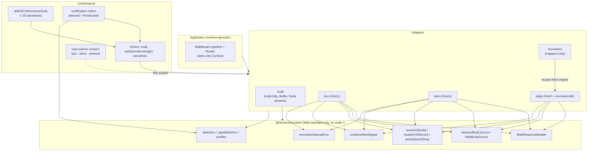

# Adapters — Runtime Platform & Cross-Runtime Conformance Review

| Field           | Value                                                                     |
| --------------- | ------------------------------------------------------------------------- |
| **Report type** | `Architecture`                                                            |
| **Scope**       | `@nextrush/runtime` + `packages/adapters/{node,bun,deno,edge,serverless,conformance}` |
| **Date**        | `2026-07-22`                                                              |
| **Reviewer(s)** | Runtime Platform Architect (deep cross-runtime audit)                     |
| **Commit / ref**| `6ab26e9b5b0b4c5047e89a49778ea875cc7505f2` (branch `docs/v4-rebuild`)      |
| **Status**      | `Final`                                                                   |
| **Related**     | `docs/RFC/RFC-NEXTRUSH-ADAPTER-CONTRACT`, `docs/audits/08-runtime-compatibility-gap-analysis.md`, `AGENTS.md §7` |

---

## Progress Tracker

**Remediation:** `[██████████████████░░]` 89% — 8 / 9 recommendations resolved (F-01 substantially delivered — see Rec 1's note on the workerd architectural limit)

| Rec | Addresses | Priority | Status |
| --- | --------- | -------- | ------ |
| 1   | F-01      | P1       | 🔄 Mostly resolved — Bun/Deno now full-suite on real runtimes; workerd widened 3→7, full-suite architecturally blocked (see ADR-0010 / `openspec/changes/runtime-platform-parity-hardening`) |
| 2   | F-02      | P2       | ✅ Resolved |
| 3   | F-03      | P2       | ✅ Resolved |
| 4   | F-04      | P2       | ✅ Resolved |
| 5   | F-05      | P3       | ✅ Resolved |
| 6   | F-06      | P3       | ✅ Resolved |
| 7   | F-07      | P3       | ✅ Resolved |
| 8   | F-08      | P3       | ✅ Resolved |
| 9   | F-09      | P4       | 🔄 Resolved via deprecation, not removal — see the change's tasks.md 6.1 note (project-rules §7 deprecate-before-remove) |

---

## 1. Executive Summary

The NextRush runtime-platform layer is **mature and well-architected**, and materially ahead of the typical multi-runtime framework. It honours its own constitution (`AGENTS.md §7`): the request path speaks Web-standard `Request`/`Response`/`ReadableStream`/`AbortSignal`, the `@nextrush/runtime` package imports no `node:*` API, capability decisions are negotiated through a `RuntimeCapabilities` matrix rather than `if (runtime === 'x')` branches (lint-enforced by `nextrush/no-runtime-identity-capability`), and the platform-specific code is genuinely confined behind five thin adapters. Several classes of cross-runtime bug that plague portable frameworks have already been found and fixed here (documented as audit `F-02`…`F-18`, `R-2`…`R-10`, `HP-*`): header-drop on implicit responses, redundant `Content-Length` encodes, IP-precedence drift, Node-stream-into-`{}` serialization, prototype-pollution in query parsing, and CRLF header injection.

The findings below are **refinements to an already-strong system, not structural failures**. There is exactly one P1, and it concerns the *trustworthiness of the conformance claim* rather than a runtime that misbehaves.

**Top findings:**
1. **The "real-runtime proof" is much thinner than the certification matrix advertises** (F-01, P1). The full behavioral contract (~20 assertions) runs only under the in-process simulation (`web-driver` executing under Node/vitest); the on-runtime runners execute only 3–5 basic behaviors on real Bun/Deno/workerd, and Vercel Edge + Netlify have no real-runtime runner at all — yet the matrix stamps a single 🟢 `real-runtime` badge across each whole column.
2. **Five of the ten certified features are scored from capability flags, not behavioral tests** (F-02, P2). `Streaming`, `SSE`, `Multipart`, `Compression`, and especially `WebSockets` are marked `full`/`none` from `capabilitiesFor()` bits with no cross-adapter conformance test exercising them.
3. **HEAD responses diverge on `Content-Length`** (F-03, P2): Node emits it, the Web adapters omit it, and the conformance suite only checks that the body is empty — so the drift is invisible to CI.
4. **The request-timeout model is intentionally different on Node** (F-04, P2) — socket-level teardown (no HTTP status) vs a clean `504` on every other runtime. It is documented and tested, but it is the one behavioral contract that could realistically be converged.

Overall health: **strong, production-capable on Node/Bun/Deno; production-capable-with-caveats on Edge/Serverless.** The priority is not fixing broken runtimes — it is closing the gap between what the certification suite *claims* and what it *proves*.

---

## 2. System Understanding

NextRush treats the runtime as an implementation detail behind an adapter, and the Web Platform as the baseline. A NextRush application is a runtime-agnostic middleware pipeline built on `@nextrush/core`; it only ever sees a `Context`. Each adapter's job is to (a) translate a native request into the shared `Context`, (b) run the app's composed handler, and (c) translate the `Context`'s accumulated response back into the native reply.

Three layers cooperate:

- **`@nextrush/runtime`** — the runtime-independent foundation. It owns runtime *detection* (`detectRuntime`, `detectEdgeRuntime`), the *capability matrix* (`capabilitiesFor`, `probeCapabilities`, and the named `*Profile`s), and the Web-standard shared primitives every Fetch-API adapter reuses: `WebResponseBuilder` (the response state machine), `AbstractBodySource`/`WebBodySource`/`EmptyBodySource` (body reading with size limits), `resolveClientIp`/`headersToRecord`/`parseQueryString` (ingress normalization), `combineAbortSignal` (timeout ↔ client-disconnect), and `normalizeStartupError`. Crucially, this package uses only Web globals — no `node:*` import — so it loads on every runtime.

- **The five adapters** — `node`, `bun`, `deno`, `edge`, `serverless`. Node is the outlier by necessity: it speaks `node:http` `IncomingMessage`/`ServerResponse`, Node streams, and `Buffer`. Bun, Deno, and Edge all speak the Fetch API and each compose a `WebResponseBuilder`. Serverless is the most elegant: it does not implement its own execution model at all — it reuses the Edge fetch engine and adds only event↔`Request`/`Response` mappers (API Gateway v1/v2, Lambda Function URL, GCF, Azure).

- **`@nextrush/adapters/conformance`** — the parity enforcement mechanism. A single `defineConformanceSuite(driver)` encodes the behavioral contract as ~20 `vitest` assertions; each adapter supplies a `ConformanceDriver`; and a `certification.ts` module *derives* a feature × runtime matrix from the same capability data plus the drivers' declared flags. Legitimate runtime differences are encoded as capability flags (`handlerTimeout504`, `teardownOnShutdown`, `transportAbortFiresSignal`, `honorsCloudflareIp`), never silently skipped.

Why this design makes sense: it lets one application deploy unchanged to Node, Bun, Deno, an edge isolate, or a serverless function, and it lets an *external* adapter author certify a new runtime by implementing one driver. The compile-time conformance guards (`ServerAdapter`, `FetchAdapter`, `AdapterContextFactory` type assertions at the bottom of each adapter) mean a drift in an adapter's public shape fails `tsc` before it ever reaches a test.

---

## 3. Architecture Overview



Dependency direction is clean and matches `architecture.instructions.md`: adapters depend on `runtime`; `runtime` depends on nothing runtime-specific; serverless depends on edge; conformance depends on all adapters. No upward or circular imports were observed in the reviewed scope.

---

## 4. Data Flow

The two request lifecycles — Node vs the Fetch-API family — are worth contrasting directly, because that split is where every genuine platform difference lives.

```mermaid
sequenceDiagram
  participant Client
  participant Native as Native runtime
  participant Adapter
  participant Ctx as Context
  participant App as Middleware/Handler
  participant RB as Response builder

  Note over Adapter,RB: Fetch family (Bun/Deno/Edge/Serverless)
  Client->>Native: HTTP request
  Native->>Adapter: fetch(Request[, server/env/ctx])
  Adapter->>Ctx: createContext(request, ip, trustProxy[, env])
  Adapter->>App: race(handler(ctx), timeout→504)
  App->>RB: ctx.json/send/html/redirect/set
  App-->>Adapter: resolve (or timeout → ctx.triggerTimeout())
  Adapter->>RB: ctx.getResponse(status)
  RB-->>Native: new Response(body|null, {status, headers})
  Native-->>Client: HTTP response

  Note over Adapter,RB: Node
  Client->>Native: HTTP request
  Native->>Adapter: (req, res)
  Adapter->>Ctx: createNodeContext(req, res, {trustProxy})
  Adapter->>App: handler(ctx)  (no per-handler timeout; server.timeout at socket)
  App->>Ctx: ctx.json/... → res.writeHead + res.end (streams via pipe/pump)
  App-->>Adapter: resolve → finalize implicit 404/empty
  Adapter-->>Client: HTTP response
```

The divergence points, all traceable to this diagram: **timeout** (a `Promise.race` → `504` on the Fetch family; `server.timeout` socket teardown on Node — F-04), **body suppression on HEAD** (`new Response(null)` drops `Content-Length` on the Fetch family; Node's `writeHead` keeps it — F-03), and **error-response construction** (raw `new Response(..., {headers})` on the Fetch family vs `res.setHeader`/`writeHead` on Node — the source of the charset drift in F-05).

---

## 5. Backend / Logic

The request/response translation logic is correct and, for the Fetch family, genuinely shared. `WebResponseBuilder` (`packages/runtime/src/response-builder.ts`) is the single source of truth for `json`/`send`/`html`/`redirect`/`set`/`getResponse` and body suppression; Bun/Deno/Edge contexts delegate every response method to it. Ingress normalization is equally shared: `parseQueryString` (single-pass, prototype-pollution-safe, DoS-bounded), `headersToRecord` (null-prototype, `getSetCookie`-aware), and `resolveClientIp` (one precedence + validation policy for all adapters) all live in `@nextrush/runtime` and are re-exported by each adapter's `utils.ts`.

The behavioral gaps are narrow and localized: HEAD `Content-Length` (F-03), error-response `Content-Type` charset (F-05), and the intentional timeout-model split (F-04). See §12.

**Runtime support matrix** (behavioral contract as actually implemented; ✅ full · ⚠️ partial/different model · ➖ n/a by design · ❌ unsupported):

| Behavior / feature                         | Node | Bun | Deno | Edge | Serverless |
| ------------------------------------------ | :--: | :-: | :--: | :--: | :--------: |
| Request line / method / path / query        | ✅   | ✅  | ✅   | ✅   | ✅         |
| Header normalization + case-insensitive `get` | ✅ | ✅  | ✅   | ✅   | ✅         |
| Body read (`text`/`json`/`buffer`) + 1 MB limit | ✅ | ✅ | ✅  | ✅   | ✅         |
| `ctx.set` accumulate Set-Cookie / CRLF guard | ✅  | ✅  | ✅   | ✅   | ✅         |
| Implicit-response header preservation (F-02) | ✅  | ✅  | ✅   | ✅   | ✅         |
| Redirect (302, `Location`, text/plain body)  | ✅  | ✅  | ✅   | ✅   | ✅         |
| HEAD/204/304 body suppression                | ✅  | ✅  | ✅   | ✅   | ✅         |
| HEAD `Content-Length` parity (F-03)          | ✅  | ⚠️  | ⚠️   | ⚠️   | ⚠️         |
| Error-response `Content-Type` charset (F-05) | ✅  | ⚠️  | ✅   | ⚠️   | ⚠️         |
| Client-IP precedence + validation            | ✅  | ✅  | ✅   | ✅   | ✅         |
| Cloudflare `cf-connecting-ip` precedence      | ➖  | ➖  | ➖   | ✅   | ✅         |
| `ctx.signal` on client disconnect / abort     | ✅  | ✅  | ✅   | ✅   | ➖ (buffered) |
| Request timeout → clean `504` (F-04)          | ⚠️ socket | ✅ | ✅ | ✅¹ | ✅         |
| Streaming / SSE / NDJSON                      | ✅  | ✅  | ✅   | ✅   | ✅ (+true stream) |
| Extension `destroy()` on shutdown             | ✅  | ✅  | ✅   | ➖   | ➖         |
| Signal-based graceful shutdown (F-06)         | ✅  | ❌  | ❌   | ➖   | ➖         |
| Platform bindings (`ctx.env`) / `waitUntil`   | ➖  | ➖  | ➖   | ✅   | ➖         |

¹ Edge honours `timeout` only when explicitly set — no default (F-07).

## 6. Database / State

_Not applicable — the runtime-platform layer is stateless per request. Per-request state (`ctx.state`, `ctx.bodySource`) and per-server state (in-flight counters for graceful drain) are the only stateful surfaces, and both are correctly scoped (lazily materialized per request in the contexts; per-`serve()` closure for drain)._

## 7. Frontend / API Surface

The public adapter surface is consistent and its consistency is machine-enforced, which is the strongest structural feature of this layer:

- Every server adapter satisfies `ServerAdapter<App, ServeOptions, ServerInstance>` and every context factory satisfies `AdapterContextFactory` via compile-time assertions (`_nodeConformance`, `_bunConformance`, `_denoConformance`, `_edgeConformance`, and the `_*ContextFactory` guards). Drift fails `tsc`.
- `ServeOptions` is harmonized across Node/Bun/Deno: `host` is the canonical option (F-05, `hostname` alias kept for compat), `timeout`/`shutdownTimeout` share defaults from `@nextrush/runtime` constants, and startup failures normalize through `normalizeStartupError` (F-15) so `EADDRINUSE` surfaces identically.
- Edge adds `ctx.env` (F-03, typed generic for Cloudflare bindings) and `waitUntil`; serverless exposes zero-config Tier-1 handlers (`createLambdaHandler`, `createGoogleHandler`, `createAzureHandler`) that auto-detect payload format, hiding the Tier-3 mapper plumbing.

Residual API-surface issues are the divergent `ServeOptions` capabilities (`gracefulShutdown` Node-only — F-06; `maxRequestBodySize`/`tls`/`reload` Bun-only; `cert`/`key` Deno-only). Some of these are genuinely platform-specific; `gracefulShutdown` is not (see F-06).

## 8. UX

_Not applicable — non-user-facing infrastructure. The developer-experience angle is covered under §7 (API surface) and §11 (documentation/maintainability)._

## 9. Performance

_Out of audit scope by direction (runtime performance was previously reviewed; see `report/core/*` and `report/adapters/node-adapter-per-request-work-trim-followup.md`)._ For context only, and not scored here: the hot paths are visibly allocation-conscious (shared frozen `EMPTY_PARAMS`/`EMPTY_QUERY`, lazy `raw`/`state`/`bodySource`/`signal`, cached `RESOLVED_NEXT`, the `HP-1` direct-IP trim, and the `HP-15` constant-time set-cookie pre-check). None of these performance trims were observed to introduce a behavioral divergence — they are documented as byte-identical to the paths they replaced, and the conformance suite exercises the trimmed paths.

## 10. Security

The security posture of the translation layer is a strength, and it is consistent across runtimes because it lives in shared code:

- **Query parsing** rejects `__proto__`/`constructor`/`prototype` and bounds param count (256) and length (2048) — `parseQueryString`, verified by conformance #2 on every driver including real Bun/Deno/workerd.
- **Header injection** is blocked by `assertHeaderSafe` (CRLF guard) shared by `WebResponseBuilder.set` and `NodeContext.set`.
- **Client IP** is structurally validated (`isValidClientIp` — real IPv4/IPv6 parsing, not a charset check) and only trusted when `trustProxy` is set; conformance #19 pins that an injected `<script>` XFF value is skipped in favour of a valid `x-real-ip`.
- **Error responses never leak internals** — conformance #12 asserts a thrown `Error('secret-leak-123')` yields a `500` whose body is exactly `Internal Server Error` with no leak, on every driver.
- **Body-size limits** are enforced incrementally (streaming `TransformStream` on Web, and at the server level for Bun's `maxRequestBodySize`), yielding `413` — conformance #11.

No P0/P1 security finding. One security-adjacent note feeds F-04: Node's socket-level `server.timeout` also bounds slow-client/slow-loris connections in a way a handler-race `504` does not — so any convergence must *keep* the socket timeout, not replace it.

## 11. Maintainability

Two maintainability findings, both low-severity. The Fetch-family contexts share their response *state machine* (`WebResponseBuilder`) but still triplicate the context *shell* — constructor, delegation wrappers, `raw`/`signal`/`triggerTimeout`, streaming methods, and `get`/`next`/`throw`/`assert` are ~200 near-identical lines in each of `bun`, `deno`, and `edge` (F-08). And each adapter's `utils.ts` carries a `getContentType`/`getContentLength` pair with zero callers (F-09; the real implementations live in `@nextrush/body-parser`). Neither has observable runtime impact today; both are drift surfaces. The codebase is otherwise disciplined: files sit well under the 300-line ceiling, comments explain *why* (audit IDs, RFC references), and there is no dead-weight archive in the tree.

---

## 12. Findings (detailed)

### F-01 — Real-runtime conformance proof is a small subset of the certified contract · Priority `P1`

- **Platform(s):** Bun, Deno, Edge (Cloudflare/workerd); Vercel Edge & Netlify have no real-runtime runner at all.
- **Package / File / Function:** `packages/adapters/conformance/{bun-runner/conformance.bun.test.ts, deno-runner/conformance.deno.test.ts, workerd-runner/conformance.workerd.test.mjs}`; `src/certification.ts` (`REAL_RUNTIME_RUNNER_EXISTS`, `ProofLevel`, `renderCertificationMarkdown`); `src/drivers/web-driver.ts`.
- **Runtime layer:** Conformance / certification.
- **Behavioral contract:** "Cross-adapter parity is proven, not assumed … observable behavior must stay identical across adapters" (`AGENTS.md §7`).
- **Expected behavior:** A 🟢 `real-runtime` badge on a runtime column implies the certified behaviors were observed executing on that real runtime.
- **Actual behavior:** The full `defineConformanceSuite` (~20 assertions: Set-Cookie arrays, HEAD/204/304 suppression, redirect, error-no-leak, timeout/504, IP precedence, 413/400 body errors, onion ordering, etc.) runs **only under the in-process `web-driver`, which executes under Node/vitest** for the `bun`/`deno`/`edge` targets. The dedicated on-runtime runners assert only a hand-written subset — `bun-runner` and `deno-runner` cover 5 behaviors (#1–#4, #16), `workerd-runner` covers 3 (GET dispatch, POST JSON, thrown 404). The matrix nonetheless renders a single `real-runtime` badge spanning the *entire* 10-feature column.
- **Root cause:** `ProofLevel` is computed per *target* (`REAL_RUNTIME_RUNNER_EXISTS[name]`), not per *behavior*. "A runner exists" is conflated with "every certified behavior is proven by that runner."
- **Production impact:** A genuinely runtime-specific behavioral difference — how real Bun/workerd construct a `Response`, `Headers` mutability/immutability on a platform, `getSetCookie()` semantics, stream backpressure, `AbortSignal.any` availability — would ship undetected, because only Node-executed code paths test those behaviors. This is precisely the class of bug a cross-runtime framework exists to prevent. (To be fair to the current design: adapter *logic* bugs are caught, because the simulation runs the real adapter handler functions; only true *runtime-behavioral* differences slip through.)
- **Compatibility impact:** The parity guarantee for Bun/Deno/Edge is weaker than advertised; Vercel Edge and Netlify have zero on-runtime coverage despite being documented targets.
- **Conformance impact:** The certification matrix overstates proof. This is the gap between a claim and a certification.
- **Proposed improvement:** (a) Make `ProofLevel` per-cell, not per-column — render `real-runtime` only for behaviors a real runner actually asserts, `simulated` otherwise. (b) Have the real-runtime runners import and execute the *same* `defineConformanceSuite` behaviors (adapting the driver to the on-runtime test harness) instead of maintaining a divergent hand-written subset, so on-runtime coverage tracks the contract automatically. (c) Add a Vercel-Edge/Netlify real-runtime runner, or downgrade their matrix proof to `simulated` explicitly.
- **Risk analysis:** Low risk to implement (test-only). The main cost is CI time and wiring the shared suite into `bun test`/`deno test`/`node --test`+miniflare harnesses (different runners than vitest).
- **Validation strategy:** Assert that the set of behaviors run on each real runner equals the `defineConformanceSuite` set; snapshot the regenerated matrix and confirm no cell claims `real-runtime` without a backing on-runtime assertion.
- **Priority:** P1 — conformance failure / overstated support claim.
- **Migration difficulty:** Moderate — the behavior functions are already extracted; the work is harness adaptation per runtime, not rewriting assertions.

### F-02 — Five certified features are scored from capability flags, not behavioral tests · Priority `P2`

- **Platform(s):** All.
- **Package / File / Function:** `packages/adapters/conformance/src/certification.ts` → `featureSupport()`; `FEATURES`.
- **Runtime layer:** Certification.
- **Behavioral contract:** Feature support must be "backed by automated tests" (`AGENTS.md §14`).
- **Expected behavior:** A `full` cell for a feature means that feature's cross-adapter behavior is conformance-tested.
- **Actual behavior:** `Streaming`, `SSE`, and `Multipart` are `c.webStreams ? 'full' : 'none'`; `Compression` is `webStreams || nodeStreams`; `WebSockets` is `c.webSocket ? 'full' : 'none'`. `defineConformanceSuite` contains **no** test that exercises SSE, NDJSON, multipart, compression, or a WebSocket upgrade across drivers. `WebSockets` is the starkest case: the adapters implement no WS-upgrade path, WS is a separate extension (`@nextrush/websocket`), and edge WebSockets use `WebSocketPair` (materially different from a Node `ws` server) — yet every runtime with the `webSocket` capability bit is marked `full`.
- **Root cause:** The matrix derives these rows from `capabilitiesFor()` presence bits rather than from suite outcomes; capability presence is treated as behavioral proof.
- **Production impact:** A developer reading "WebSockets ✅ full" on Edge may ship a `ws`-style upgrade that cannot work on Cloudflare; "Compression ✅ full" on Edge ignores that some edge/CDN layers auto-compress and reject a manual `Content-Encoding`. The published coverage percentage is inflated by these unbacked cells.
- **Compatibility impact:** Overstated feature parity for streaming-family and WebSocket features specifically.
- **Conformance impact:** ~half the matrix is capability-derived, not conformance-derived.
- **Proposed improvement:** Either (a) add cross-adapter conformance tests for `ctx.sse`/`ctx.stream`/`ctx.ndjson`, multipart parsing, and compression, and a WebSocket-upgrade smoke test where the adapter supports it — then drive those matrix rows from real outcomes; or (b) split the matrix into a "capability" table (honestly capability-derived) and a "conformance" table (test-derived), and mark WebSockets on Edge/Serverless `⚠️ partial (different model)` or `➖`.
- **Risk analysis:** Adding streaming conformance tests is low-risk and high-value; the WebSocket reclassification is documentation-only.
- **Validation strategy:** New conformance tests must run through the same `describe.each(drivers)` path; the matrix generator asserts each non-`na` cell maps to at least one executed assertion.
- **Priority:** P2 — partial feature parity / missing compatibility validation.
- **Migration difficulty:** Moderate (streaming tests), Trivial (WebSocket reclassification).

### F-03 — HEAD responses drop `Content-Length` on the Fetch adapters · Priority `P2`

- **Platform(s):** Bun, Deno, Edge, Serverless (divergent from Node).
- **Package / File / Function:** `packages/runtime/src/response-builder.ts` → `WebResponseBuilder.json/html/send` + `getResponse` (emits `new Response(null, …)` when `isBodylessResponse`); contrast `packages/adapters/node/src/context.ts` → `NodeContext.json/html` (`res.writeHead(status, { 'Content-Length': … })` runs *before* body suppression).
- **Runtime layer:** Response translation.
- **Behavioral contract:** "Every public framework API should produce the same observable behavior on every supported runtime." RFC 7231 §4.3.2: a HEAD response SHOULD carry the `Content-Length` the equivalent GET would.
- **Expected behavior:** A HEAD request to a JSON/HTML route returns the same `Content-Length` header a GET would, on every runtime.
- **Actual behavior:** On Node, HEAD to a `ctx.json(...)` route returns `Content-Length: <n>` with an empty body (correct). On Bun/Deno/Edge/Serverless, `getResponse` builds `new Response(null, {status, headers})` and the builder never set `Content-Length` for string bodies (deliberately, per `F-18`, to let the runtime derive it from the body) — so with a `null` body the runtime derives nothing and **no `Content-Length` is emitted**. This also produces a GET-vs-HEAD inconsistency *within* a single Fetch runtime (GET derives it from the string body; HEAD cannot).
- **Root cause:** The `F-18` optimization ("let the runtime derive `Content-Length` from the body") is correct for GET but silently loses the header on the HEAD/bodyless path, because the body the runtime would measure is replaced with `null`.
- **Production impact:** Clients, proxies, and CDNs that rely on HEAD `Content-Length` for range planning, cache sizing, or progress estimation behave differently depending on the deployment runtime. Low-frequency but exactly the kind of silent inconsistency the platform philosophy forbids.
- **Compatibility impact:** Real cross-runtime divergence on a standard HTTP semantic.
- **Conformance impact:** Invisible to CI — conformance #10 asserts only `res.text() === ''` for HEAD/204/304, never the `Content-Length` header.
- **Proposed improvement:** In `WebResponseBuilder.getResponse`, when suppressing the body for a HEAD request (not for 204/304, where a `Content-Length` is generally omitted), compute and set `Content-Length` from the would-be body length before constructing `new Response(null, …)`. Then extend conformance #10 to assert HEAD `Content-Length` equals the equivalent GET's.
- **Risk analysis:** Small, localized change. Must scope to HEAD only (204/304 legitimately omit the header). Requires measuring the string body length (one `Buffer.byteLength`/`TextEncoder` pass on the bodyless path — negligible, and only on HEAD).
- **Validation strategy:** New conformance assertion across all drivers; a real-runtime assertion (ties into F-01) confirms Bun/Deno/workerd actually emit it.
- **Priority:** P2 — runtime inconsistency + minor spec-conformance gap.
- **Migration difficulty:** Trivial.

### F-04 — Request-timeout produces a different observable result on Node · Priority `P2`

- **Platform(s):** Node (divergent from Bun/Deno/Edge/Serverless).
- **Package / File / Function:** `packages/adapters/node/src/adapter.ts` → `serve` (`server.timeout = timeout`); contrast `bun/src/adapter.ts` `createBunRequestRunner`, `deno/src/adapter.ts` `createHandler`, `edge/src/adapter.ts` `createRequestRunner` (all `Promise.race` → `504` + `ctx.triggerTimeout()`).
- **Runtime layer:** Adapter execution / timeout.
- **Behavioral contract:** Prefer one observable behavior over runtime-specific behavior; unsupported/divergent behavior must be intentional, documented, validated.
- **Expected behavior:** A request exceeding the configured timeout yields the same observable outcome on every runtime.
- **Actual behavior:** Node sets `server.timeout`, which destroys the socket on inactivity — the client sees a connection reset / hang-up with **no HTTP status**. Bun/Deno/Edge/Serverless race the handler against a timer and return a clean `504 Gateway Timeout` JSON response, then cancel the still-running handler via `ctx.signal`. This *is* already intentional, encoded (`ConformanceDriver.handlerTimeout504`), tested (conformance #13), and documented (matrix note, `F-08`).
- **Root cause:** Node's timeout is enforced at the socket, not the handler, so it never reaches the response-construction path. Additionally, `server.timeout` measures socket inactivity, not total handler duration — so it is not even semantically the same "request timeout" as the handler race.
- **Production impact:** The same application, deployed to Node vs anywhere else, fails a slow request differently: client retry/error logic keyed on a `504` status works on Bun/Deno/Edge but sees an opaque connection error on Node. This is the concrete problem justifying convergence (not merely "a different design exists").
- **Compatibility impact:** The single largest *intentional* behavioral split in the framework.
- **Conformance impact:** Correctly represented as `⚠️ partial (different model)` — but the model *could* be unified.
- **Proposed improvement:** Add a handler-level `Promise.race` → `504` to the Node adapter (mirroring the other four), driven by the same `timeout` option, and feed the timeout into `ctx.signal` so cooperative handlers cancel. **Keep `server.timeout` in addition** (as a socket-level slow-client/slow-loris guard), documenting the two as complementary — the handler race gives a clean `504`; the socket timeout bounds malicious slow connections the race cannot see. Then set `nodeDriver.handlerTimeout504 = true` and let the matrix converge to `full`.
- **Risk analysis:** Moderate. Node handlers write directly to `res`; a race that returns a `504` must guard against a handler that has already begun writing (`res.headersSent`), and must not double-send. The existing `_responded`/`headersSent` guards make this tractable but require care.
- **Validation strategy:** Conformance #13 flips to expect `{ status: 504, signalFired: true }` for Node; add a test that a handler which has already sent headers is not clobbered by the timeout path; real-runtime Node coverage (native driver) already runs the full suite, so this is genuinely proven for Node.
- **Priority:** P2 — a documented divergence with a concrete convergence path.
- **Migration difficulty:** Moderate.

### F-05 — Error/timeout responses drift on `Content-Type` charset · Priority `P3`

- **Platform(s):** Edge and Bun (server-level error path) vs Node/Deno/Bun (handler path).
- **Package / File / Function:** `edge/src/adapter.ts` (`500`/`504` → `'application/json'`); `bun/src/adapter.ts` `serve` `bunOptions.error` (`'application/json'`) vs `createBunRequestRunner` catch (`'application/json; charset=utf-8'`); `node/src/adapter.ts` and `deno/src/adapter.ts` (`'application/json; charset=utf-8'`).
- **Runtime layer:** Adapter error translation.
- **Behavioral contract:** `ctx.json` success responses carry `application/json; charset=utf-8` uniformly (conformance #7 / `F-16`); framework-generated error bodies should match.
- **Expected behavior:** A framework-generated `500`/`504`/`404` JSON error carries the same `Content-Type` (`application/json; charset=utf-8`) on every runtime.
- **Actual behavior:** Node, Deno, and Bun's handler-level catch emit `application/json; charset=utf-8`; Edge's `500`/`504` and Bun's server-level `error` callback emit bare `application/json`. Same JSON body, inconsistent `Content-Type`.
- **Root cause:** These error responses are hand-constructed with inline header literals in each adapter's catch/error path rather than routed through the shared builder, so the charset was applied inconsistently.
- **Production impact:** Minor — most clients treat `application/json` and `application/json; charset=utf-8` identically. It is a consistency and polish gap, not a functional break.
- **Compatibility impact:** Low.
- **Conformance impact:** Uncovered — conformance #12 asserts status + no-leak, not the exact error `Content-Type`.
- **Proposed improvement:** Define the framework error bodies once (a shared `errorResponse(status, message)` helper in `@nextrush/runtime` returning a `Response`, and a Node equivalent) and route every adapter's `404`/`500`/`504` path through it. Extend conformance #12 to assert the error `Content-Type`.
- **Risk analysis:** Trivial and low-risk.
- **Validation strategy:** Conformance assertion on error `Content-Type` across drivers.
- **Priority:** P3.
- **Migration difficulty:** Trivial.

### F-06 — Signal-based graceful shutdown is Node-only · Priority `P3`

- **Platform(s):** Bun, Deno (missing vs Node).
- **Package / File / Function:** `node/src/adapter.ts` (`gracefulShutdown` option, `buildCloseWithGracefulShutdown`, `SIGTERM/SIGINT` via `process.once`); `bun/src/adapter.ts` and `deno/src/adapter.ts` `close()` drain but expose no signal-wiring option.
- **Runtime layer:** Adapter lifecycle.
- **Behavioral contract:** Consistent operational behavior across server-lifetime runtimes.
- **Expected behavior:** A containerized Bun or Deno service can opt into the same "drain on `SIGTERM`" behavior Node offers.
- **Actual behavior:** Only the Node adapter can wire OS signals to its drain sequence. Bun and Deno both *implement* in-flight draining inside `close()` (Bun tracks `activeRequests`; Deno races `server.shutdown()`), but neither exposes an option to trigger that drain from `SIGTERM`/`SIGINT`; the operator must wire signals manually. Edge/Serverless correctly have no server lifetime (F-14).
- **Root cause:** The graceful-shutdown-on-signal feature was built for the Node adapter and not generalized; the drain primitive exists on Bun/Deno but the signal wiring does not.
- **Production impact:** Bun/Deno services in Kubernetes/containers do not drain in-flight requests on rolling deploys unless the operator adds signal handling by hand — a real operational gap for those runtimes, and an inconsistency in the deployment story.
- **Compatibility impact:** Operational parity gap on two first-class runtimes.
- **Conformance impact:** Lifecycle is asserted only as a declared boolean (`teardownOnShutdown`); the signal-wiring feature is not part of the contract.
- **Proposed improvement:** Lift the `gracefulShutdown` option shape into the shared adapter contract and implement it for Bun and Deno over their existing `close()` drain (Deno already holds an `AbortController`; Bun already tracks in-flight count). Reuse the Node handler-lifecycle-cleanup pattern (remove listeners after drain) to avoid leaks across `serve`/`close` cycles.
- **Risk analysis:** Low — the drain logic already exists per runtime; this adds only the signal-registration wrapper.
- **Validation strategy:** Port the Node `graceful-shutdown.integration.test.ts` scenarios to Bun/Deno runners.
- **Priority:** P3.
- **Migration difficulty:** Moderate.

### F-07 — Default request timeout differs on Edge · Priority `P3`

- **Platform(s):** Edge (vs Node/Bun/Deno).
- **Package / File / Function:** `edge/src/adapter.ts` `FetchHandlerOptions.timeout` ("When omitted, no timeout is enforced"); Node/Bun/Deno default `timeout = DEFAULT_TIMEOUT_MS` (30 000).
- **Runtime layer:** Adapter defaults.
- **Behavioral contract:** Defaults should be consistent unless a platform limitation requires otherwise.
- **Expected behavior:** A developer who sets no timeout gets a comparable default guard everywhere.
- **Actual behavior:** Node/Bun/Deno default to a 30 s timeout; Edge defaults to *no* timeout. The Edge docs recommend platform-specific values (Cloudflare 30 s, Vercel 25 s) but do not apply them as defaults.
- **Root cause:** Edge platforms enforce their own CPU/wall limits, so a framework default was deemed unnecessary — a defensible rationale, but it produces a divergent default contract.
- **Production impact:** Low-to-moderate — an Edge app with a genuinely runaway handler relies entirely on the platform limit and never returns the framework's clean `504`; behavior differs from the same app on Node/Bun/Deno.
- **Compatibility impact:** Divergent default; the difference is documented but not eliminated.
- **Conformance impact:** Timeout behavior is tested when enabled; the default divergence is not asserted.
- **Proposed improvement:** Either apply a conservative Edge default (e.g. 25 s, below the tightest common platform wall limit) so the default contract matches, or explicitly document the divergence in the compatibility matrix as intentional and add a matrix note. Prefer the former for one-contract consistency.
- **Risk analysis:** Low; if a default is added it must sit safely under the platform limit to avoid the platform killing the isolate before the framework `504`.
- **Validation strategy:** Document/assert the chosen default; conformance already covers the enabled path.
- **Priority:** P3.
- **Migration difficulty:** Trivial.

### F-08 — The Fetch-family Context shell is triplicated · Priority `P3`

- **Platform(s):** Bun, Deno, Edge.
- **Package / File / Function:** `bun/src/context.ts` `BunContext`, `deno/src/context.ts` `DenoContext`, `edge/src/context.ts` `EdgeContext`.
- **Runtime layer:** Context construction.
- **Behavioral contract:** "Prefer shared abstractions over duplicated implementations" (`AGENTS.md`).
- **Expected behavior:** Behavior shared across the Fetch adapters lives in one place.
- **Actual behavior:** The response *state machine* is correctly shared (`WebResponseBuilder`), but the Context *shell* is not: field declarations, the `json`/`send`/`html`/`redirect`/`set`/`get`/`next`/`throw`/`assert` delegation wrappers, the lazy `raw`/`signal`/`triggerTimeout`, and the `stream`/`sse`/`ndjson`/`sendStream` methods are ~200 near-identical lines repeated in each of the three contexts. The only real differences are the constructor's IP source (Bun `server.requestIP`, Deno `connInfo.remoteAddr`, Edge `cf-connecting-ip`) and Edge's extra `env`/`waitUntil`/`executionContext`.
- **Root cause:** The `F-04b` extraction pulled out the response builder but stopped short of the context shell.
- **Production impact:** None today — the copies are currently in sync. The risk is future drift: a fix applied to one context (as `HP-5`/`HP-7`/`F-08` had to be applied three times) can silently miss another, reintroducing exactly the cross-runtime inconsistencies this layer works to prevent.
- **Compatibility impact:** Latent — a drift risk, not a live divergence.
- **Conformance impact:** The suite would catch a resulting behavioral drift *if it is behavioral and covered* — but not a subtle one on an uncovered path (see F-01/F-03).
- **Proposed improvement:** Extract a `WebContextBase` (or a shared factory/mixin) in `@nextrush/runtime` holding the shell; let each adapter's context subclass it and override only IP resolution and any platform extras (Edge's `env`/`waitUntil`). This is a behavior-preserving refactor identical in spirit to the `WebResponseBuilder` extraction.
- **Risk analysis:** Moderate — it touches all three contexts and their hot paths; must preserve the documented lazy-allocation and identity guarantees (`ctx.raw === ctx.raw`, etc.). Characterize with the existing per-adapter context tests before moving code.
- **Validation strategy:** All three adapters' `context.test.ts` + the full conformance suite must stay green; confirm no new allocation on the hot paths.
- **Priority:** P3 — a consistency (drift) risk, low current impact.
- **Migration difficulty:** Moderate-to-Hard (hot-path-sensitive).

### F-09 — Dead, triplicated `getContentType`/`getContentLength` in adapter utils · Priority `P4`

- **Platform(s):** Node, Bun, Deno, Edge.
- **Package / File / Function:** `{node,bun,deno,edge}/src/utils.ts` → `getContentType`, `getContentLength`.
- **Runtime layer:** Adapter utilities.
- **Behavioral contract:** No duplication; no dead code (`AGENTS.md §16`, `code-structure.md`).
- **Expected behavior:** Shared helpers live once and are used, or are removed.
- **Actual behavior:** Each adapter's `utils.ts` exports a `getContentType`/`getContentLength` pair with **zero callers** (graph `in_degree: 1` = the definition edge only, `out_degree: 0`). The real, used implementations live in `@nextrush/body-parser`. The Node variant additionally has *different* semantics (it strips charset params; the Web variants return the raw value) — so even if resurrected, they would not be consistent.
- **Root cause:** Leftover helpers from an earlier body-handling approach, never removed when body reading moved to `BodySource`.
- **Production impact:** None (dead code).
- **Compatibility impact:** None functionally; the semantic difference is a latent trap if anyone starts using them.
- **Conformance impact:** None.
- **Proposed improvement:** Delete the unused `getContentType`/`getContentLength` from all four adapter `utils.ts` files (keep the `parseQueryString` re-export, which is used). If a shared content-type helper is ever needed, put one in `@nextrush/runtime`.
- **Risk analysis:** Trivial — removing provably-unused exports.
- **Validation strategy:** `tsc` + full suite green; confirm no external consumer imports them from the adapter surface (`public-surface.test.ts`).
- **Priority:** P4.
- **Migration difficulty:** Trivial.

---

## 13. Risks

| Risk | Likelihood | Impact | Mitigation |
| ---- | ---------- | ------ | ---------- |
| A runtime-specific `Response`/`Headers`/stream behavior bug ships on Bun/Deno/Edge undetected because only Node-simulated paths test it | Medium | High | F-01: run the full suite on the real runners; per-cell proof level |
| A published "full support" cell (WebSockets/Compression on Edge) misleads a developer into shipping an unsupported pattern | Medium | Medium | F-02: test-derive those rows or reclassify |
| Future edit drifts one of the three Fetch contexts, silently breaking cross-runtime parity on an uncovered path | Low-Medium | Medium | F-08: unify the shell; F-01/F-03: widen conformance coverage |
| Bun/Deno container deploy drops in-flight requests on rolling restart | Medium | Medium | F-06: generalize signal-based graceful shutdown |
| Slow-request client logic keyed on `504` fails against a Node deployment | Low-Medium | Medium | F-04: converge Node to a handler-race `504` (keep socket timeout) |

---

## 14. Recommendations (prioritised)

| # | Recommendation | Addresses | Priority | Effort | Status |
| - | -------------- | --------- | -------- | ------ | ------ |
| 1 | Make certification proof per-cell; run the shared `defineConformanceSuite` behaviors on the Bun/Deno/workerd real runners; add or explicitly downgrade Vercel-Edge/Netlify proof | F-01 | P1 | M | 🔄 Mostly resolved (Bun/Deno full-suite; workerd architecturally limited to a curated 7-case subset — documented in `certification.ts`'s `RealRuntimeCoverage`, not silently accepted) |
| 2 | Test-derive `Streaming`/`SSE`/`Multipart`/`Compression`/`WebSockets` matrix rows (add cross-adapter tests) or split capability vs conformance tables and reclassify WebSockets on Edge/Serverless | F-02 | P2 | M | ✅ Resolved |
| 3 | Emit `Content-Length` on HEAD in `WebResponseBuilder.getResponse`; assert it in conformance #10 | F-03 | P2 | S | ✅ Resolved |
| 4 | Add a handler-race `504` to the Node adapter (keep `server.timeout` as slow-loris guard); flip `nodeDriver.handlerTimeout504` | F-04 | P2 | M | ✅ Resolved |
| 5 | Route all `404`/`500`/`504` framework errors through one shared helper (uniform `application/json; charset=utf-8`); assert error `Content-Type` | F-05 | P3 | S | ✅ Resolved |
| 6 | Generalize signal-based graceful shutdown to Bun and Deno over their existing drain | F-06 | P3 | M | ✅ Resolved |
| 7 | Apply a conservative Edge default timeout (or formally document the divergence in the matrix) | F-07 | P3 | S | ✅ Resolved |
| 8 | Extract a `WebContextBase` so Bun/Deno/Edge share the context shell, not just the response builder | F-08 | P3 | M–L | ✅ Resolved |
| 9 | Delete the dead `getContentType`/`getContentLength` from the four adapter `utils.ts` | F-09 | P4 | S | 🔄 Deprecated, not deleted — public-surface removal requires the deprecate-before-remove path (`project-rules.instructions.md §7`); actual removal deferred to a future major |

---

## 15. Migration Strategy

Sequence by dependency and risk, lowest-blast-radius first:

1. **Test-only, no runtime change (do first):** F-09 (delete dead code), then F-01 (widen real-runtime coverage + per-cell proof) and F-02 (streaming/WebSocket matrix accuracy). These strengthen the safety net *before* any behavioral change, so the subsequent fixes are validated on real runtimes.
2. **Small behavioral fixes, guarded by the now-stronger suite:** F-03 (HEAD `Content-Length`) and F-05 (error `Content-Type`) — both localized to the shared builder / a shared error helper, both newly covered by conformance.
3. **Moderate behavioral convergence:** F-04 (Node handler-race `504`) and F-06 (Bun/Deno graceful-shutdown signals) — each ships with its own regression tests and is reversible (revert restores the documented prior behavior).
4. **Refactor last:** F-08 (`WebContextBase` extraction) — behavior-preserving, characterized by the existing context tests plus the widened conformance suite from step 1, so a regression is caught immediately.
5. **Policy decision:** F-07 (Edge default timeout) — decide default-vs-document; ship with the matrix note either way.

Every step is independently revertible, and none requires a breaking change to the public adapter contract (the `ServeOptions`/`FetchHandlerOptions` additions are additive).

---

## 16. Conclusion

NextRush's runtime-platform layer is a well-built, standards-first, capability-negotiated abstraction that delivers real cross-runtime portability and has already absorbed most of the hard cross-runtime bugs through prior audits. Its shared primitives, compile-time conformance guards, and single-source conformance suite are above the bar for the category.

The most important next step is **not** fixing a broken runtime — it is closing the gap between the certification suite's *claim* and its *proof* (F-01): run the full behavioral contract on the real Bun/Deno/workerd runners and make the proof level honest per cell. Everything else — the HEAD `Content-Length` drift, the error-`Content-Type` charset, the Node timeout model, and the capability-vs-conformance matrix rows — becomes safe, well-validated, low-risk work once the conformance net actually covers what it certifies. Do F-01 first; the rest follows behind a stronger safety net.

---

## Checklist

- [x] Filename is scope-first and in the right `report/<domain>/` folder (`report/adapters/runtime-platform-review.md`).
- [x] System explained (§2) before any judgement — no opening with an issue list.
- [x] The system was mapped with codebase-memory-mcp (`get_architecture`, `search_code`), not manual grep of source.
- [x] Every significant finding uses all nine §12 fields (plus platform/layer per the prompt's evidence model) and has an F-ID + priority.
- [x] Every finding cites concrete evidence (file / function / graph degree) — no "feels".
- [x] Performance findings deferred to prior reviews per audit scope (§9), not guessed.
- [x] UX section marked Not applicable with reason.
- [x] No dark pattern applies (non-user-facing scope).
- [x] Every recommendation (§14) maps to an F-ID and a stated problem.
- [x] Progress Tracker matches §14 Status column (0/9).
- [x] Sections that don't apply are "Not applicable — reason", not deleted.
- [x] Findings that become decisions (F-01, F-04) are cross-linked to the adapter-contract RFC / gap-analysis audit rather than duplicated.
- [x] All template guidance blocks removed.
