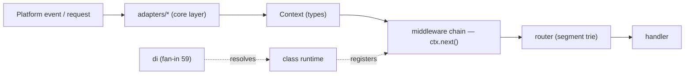

# NextRush — Architecture Review (adapters/runtime focus, monorepo-wide)

> Read-only review. No code changed. Grounded in the code graph
> (`codebase-memory-mcp`, 11,936 nodes / 24,705 edges) at commit `755d220`
> (`feat/harden-runtime-adapter-contract`), plus `wc -l` for per-file size (the
> one metric the graph does not populate — `File.end_line` is 0).
> Method: understand → map → analyze → evaluate → recommend.

---

## Executive summary

NextRush's architecture is genuinely strong where it counts: dependency direction
is clean, functions are small (max cyclomatic complexity ~2–3 across core), and the
adapter/runtime seams the current OpenSpec change is hardening are the right seams.
The problems are **shape, not structure** — a cluster of oversized files (26 source
files over the 300-line hard cap, led by `router.ts` at 918 lines), one middleware
subsystem that has quietly become a mini-monolith (template, ~2,700 lines across four
files), and a package-count trajectory that needs a governance rule rather than a
refactor.

Nothing here is an emergency. The single highest-value move is **splitting the top 5
god files**, and the serverless package just built (tiered API, one package, mappers
isolated) is the exact pattern the rest of the repo should be measured against.

Verdict by dimension (−10…+10 scale, per the review lens):
- Dependency direction / boundaries: **+8** (clean, no upward leaks in the call graph)
- Complexity / function size: **+8** (small, focused units)
- File modularity (shape): **−3** (26 files over the hard cap; one 918-line file)
- Package governance: **+1** (sound, but count is drifting; needs a stated rule)

---

## System understanding (how it fits together today)

The monorepo is a Turborepo/pnpm workspace of ~35 publishable packages in a strict
dependency order: `types → errors → core → router → runtime → di → class → adapters/*
→ middleware/* → extensions/* → stream → nextrush`.

The graph's layer analysis confirms the intended shape holds in practice:

| Package group | Detected layer | Signal |
|---|---|---|
| `di` | core | fan-in **59** (highest in repo) |
| `adapters` | core | fan-in 23, 0 out |
| `extensions`, `errors`, `stream`, `dev` | core | high fan-in, outbound-only |
| `middleware`, `class` | entry | outbound-only (they consume lower layers) |

The busiest shared vertices are exactly what you'd expect of this design:
`di.inject` (fan-in 54), `di.resolve` (45), `EdgeContext.next` (35), `Controller`
(27), `createApp` (22). Request flow is the documented one: adapter builds a
`Context` → middleware chain via `ctx.next()` → router (segment trie) → handler.

---

## Findings

Each finding: current situation → impact → recommendation → tradeoffs → priority →
migration difficulty.

### F1 — 26 source files exceed the 300-line hard cap (`router.ts` is 918)

**Current situation.** Non-test source files over the global 300-line ceiling
(`code-structure.md`), largest first:

| Lines | File |
|------:|------|
| 918 | `packages/router/src/router.ts` |
| 845 | `packages/middleware/template/src/compiler.ts` |
| 809 | `packages/middleware/template/src/helpers.ts` |
| 676 | `packages/core/src/application.ts` |
| 671 | `packages/middleware/cookies/src/validation.ts` |
| 651 | `packages/middleware/template/src/parser.ts` |
| 537 | `packages/extensions/websocket/src/server.ts` |
| 535 | `packages/types/src/context.ts` |
| 520 | `packages/middleware/form-data/src/parser.ts` |
| 511 | `packages/adapters/node/src/context.ts` |
| … | 16 more between 300 and 507 |

`router.ts` at 918 lines is the standout — nearly the entire per-package router LOC
budget (1,000) sitting in one file, and 3× the global hard cap.

**Impact.** Large files raise the cost of every change to the hottest code in the
framework (the router is on every request path). They make review slower, hide the
seams a reader needs to reason about the trie, and make regressions easier to
introduce. Note the tension worth naming: NextRush's own `v3-architecture` sets
**per-package** LOC budgets (router 1,000, core 1,500), while the global steering sets
a **per-file** 300-line hard cap. The package budgets are met; the per-file cap is not.

**Recommendation.** Split by responsibility, starting with the top 5. For `router.ts`:
separate trie-node structure, the match/lookup algorithm, route mounting/composition,
and param/wildcard parsing into their own files behind the existing barrel. For
`application.ts`: extract middleware registration, route delegation, and lifecycle
(`ready`/`listen`) wiring. Behavior must not change — characterize with the existing
tests first (the router suite is comprehensive), then move code.

**Tradeoffs.** More files and a little more import wiring, against far lower
change-cost on the hot path. For a framework whose thesis is "internal quality drives
velocity," this trade favors splitting.

**Priority:** High (router, application, template) · Medium (the rest).
**Migration difficulty:** Low–Medium — mechanical extraction behind stable barrels; no
public API change if exports stay in `index.ts`.

### F2 — The `template` middleware is a mini-monolith (~2,700 lines, 4 files)

**Current situation.** `compiler.ts` (845) + `helpers.ts` (809) + `parser.ts` (651) +
`engine.ts` (434) ≈ 2,739 lines — the single densest subsystem in the repo, all over
the 300-line middleware target (which is 300 *per package*, let alone per file).

**Impact.** A template engine is inherently complex, but four 400–850-line files in
one middleware package concentrate parsing, compilation, runtime helpers, and
orchestration together — the highest-surface place for a subtle bug, and the hardest
to onboard onto. It also skews the whole `middleware` group's weight (824 graph nodes,
by far the largest group).

**Recommendation.** Treat it as its own internal feature-folder: `parser/`,
`compiler/`, `runtime-helpers/`, `engine/` sub-folders, each file single-purpose.
This is a within-package refactor, not a new package. Do it test-first.

**Tradeoffs.** Real effort for a subsystem that already works; justified because
template is precisely the kind of code where "works today" and "safe to change" diverge.

**Priority:** Medium. **Migration difficulty:** Medium — needs care around the
parser→compiler→engine data flow; existing tests must stay green throughout.

### F3 — Package proliferation needs a *rule*, not a refactor

**Current situation.** ~35 publishable packages today; `06` flags a 35→50 trajectory.
The `middleware` group alone is 824 graph nodes across ~17 packages, several of which
are small. This change adds one more (`adapter-serverless`).

**Impact.** Every package carries fixed overhead: versioning, README, tests,
changelog, release pipeline, compatibility-matrix row. Past a point, that overhead
outruns the value of the split and slows every release. This is a governance risk, not
a correctness one.

**Recommendation.** Adopt the decision already made for serverless as the **general
rule**: *a capability ships as named exports inside an existing package unless it has
independent versioning needs or a distinct dependency footprint; a one-function
package is a smell.* The serverless package (5 mappers + 3 Tier-1 handlers + the Tier-3
adapter, one package, tree-shakeable) is the reference pattern. Apply the same lens
before splitting `adapter-edge` into per-platform packages (already correctly deferred).

**Tradeoffs.** Fewer packages means slightly coarser install granularity, mitigated by
tree-shaking and `sideEffects:false`. The alternative — continued splitting — trades
that granularity for real per-package maintenance cost.

**Priority:** Medium (governance). **Migration difficulty:** N/A — a policy/ADR, not code.

### F4 — Native adapter `context`/`adapter` files are oversized and probably duplicative

**Current situation.** `adapters/node/src/context.ts` (511), `adapters/bun/src/adapter.ts`
(457), `adapters/deno/src/adapter.ts` (378), and the node/bun/deno context builders all
implement the same `Context` contract per runtime.

**Impact.** Three runtimes each carrying a large context/adapter file is where
observable behavior can silently diverge between adapters — the exact risk the
conformance suite exists to catch. The typed `AdapterContextFactory` contract added in
Group 1 is the seam to share the common Request→Context logic.

**Recommendation.** Verify duplication first (the graph did not surface `SIMILAR_TO`
edges among these files, so this is a **Medium-confidence** hypothesis, not a confirmed
fact — read the three files side by side). If confirmed, lift the shared
Web-standard-request→`Context` logic into a base helper the runtime-specific adapters
specialize, keeping each file under the cap.

**Tradeoffs.** A shared base adds one indirection against three smaller, single-runtime
files and one place to fix a cross-adapter bug. Given adapter parity is a stated
guarantee, the shared path is worth it *if* duplication is real.

**Priority:** Medium. **Migration difficulty:** Medium — must preserve identical
observable behavior; gated by the conformance suite on every runtime.

### F5 — `types/context.ts` (535) exceeds both the 500 types budget and the 300 cap

**Current situation.** The central `Context` contract file is 535 lines — over the
per-package types budget (500) and the global cap (300).

**Impact.** `Context` is the most-imported shape in the framework; a single oversized
file for it makes the most-read contract harder to navigate.

**Recommendation.** Split into cohesive sub-contracts — request-side, response-side,
state/app-accessors — re-exported from `context.ts` so the public type surface is
unchanged.

**Tradeoffs.** More files for a pure-types module; low risk since there's no runtime
behavior, only better navigation.

**Priority:** Medium. **Migration difficulty:** Low — type-only, no runtime impact.

### F6 — `runtime/detection.ts` (475) mixes detection with capability logic

**Current situation.** 475 lines combining runtime detection and capability concerns.
(Positive: Group 2 already extracted named capability profiles into `profiles.ts` —
this is the remaining half.)

**Impact.** Detection (which runtime am I on?) and capability decisions (what can it
do?) are distinct concerns; the capability-negotiation work makes that distinction
first-class, so the file should reflect it.

**Recommendation.** Separate pure runtime *detection* from capability *probing/
degradation* into their own files under `runtime/`.

**Tradeoffs.** Minor; aligns the file layout with the seam the change already
formalizes.

**Priority:** Medium. **Migration difficulty:** Low.

### F7 — No ADRs recorded, despite the decisions existing

**Current situation.** The graph reports `adr_present: false`. Architectural decisions
live in `docs/RFC/*` and the OpenSpec change, but not as ADRs.

**Impact.** The two most consequential recent decisions — the enforced two-tier adapter
contract, and "serverless is one package with named exports, not package-per-provider"
— are exactly what a future contributor will want the *why* for. RFCs capture proposals;
ADRs capture ratified decisions and are cheaper to scan.

**Recommendation.** The change already plans an ADR for the enforced contract; add a
second short ADR for the single-package/tiered-DX decision. (Both are already written up
in the RFCs, so this is near-zero extra work.)

**Priority:** Low (process). **Migration difficulty:** Trivial.

---

## What is already right (do not "fix" these)

- **Dependency direction is clean.** No upward hierarchy violations appear in the call
  graph; `adapters`, `di`, `runtime`, `errors`, `extensions` all sit correctly as
  high-fan-in core layers, with `middleware`/`class` as outbound consumers. *(Caveat:
  cross-package workspace imports resolve to external package nodes, not internal
  file-to-file edges, so this verdict rests on the `CALLS` graph and layer analysis, not
  an `IMPORTS` trace.)*
- **Complexity is low.** Peak cyclomatic complexity on core `Application` methods is 2–3;
  the codebase is made of small, focused functions. This is the hard part to get right
  and it is right.
- **The serverless package is the model.** Tiered API (Tier-1 handlers hide Tier-3
  internals), one package, mappers isolated behind a generic contract — replicate this
  discipline, don't dilute it.
- **The seams being hardened are the correct ones.** The adapter contract and capability
  negotiation are the right places to invest; this review reinforces the current change,
  it doesn't redirect it.

---

## Recommended sequence (if/when you act — none blocking)

1. **Split the top 3 god files** — `router.ts`, `application.ts`, template's four files —
   test-first, behavior-preserving. Highest value; touches the hottest code.
2. **Split `types/context.ts` and `runtime/detection.ts`** — low-risk, aligns files with
   the seams the change already formalizes.
3. **Verify + (if real) de-duplicate the native adapter context logic** behind the
   `AdapterContextFactory` contract, gated by conformance.
4. **Write the two ADRs** (enforced contract; single-package DX) — near-zero cost.
5. **Adopt the package-count rule** (F3) as an ADR/steering note before the next split.

## Conclusion

This is a well-architected framework with a file-size discipline problem, not a design
problem. The dependency graph, complexity profile, and the seams under active work are
all sound. Address the god files (especially `router.ts` and the template subsystem),
state a package-count rule, and record the two decisions as ADRs — and the "shape"
dimension catches up to the already-strong "structure" dimension. Every item above is a
documented, deferrable finding; none is a reason to stop the current change.
