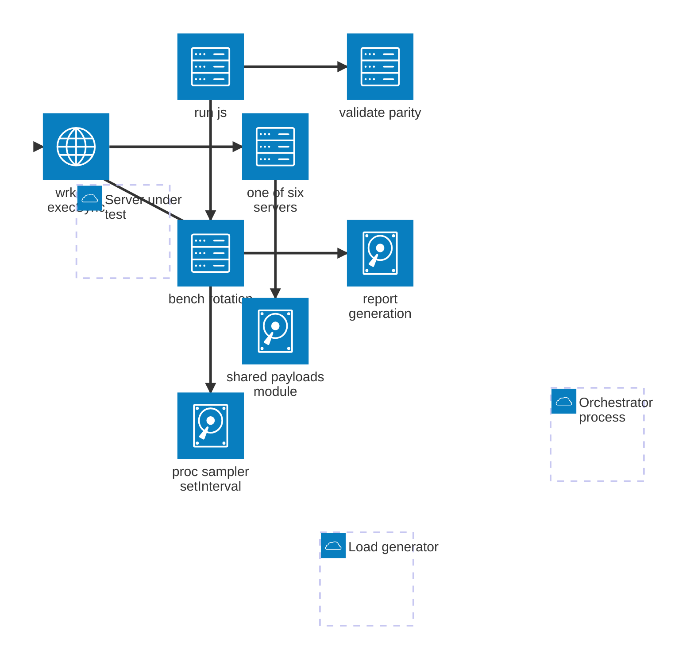
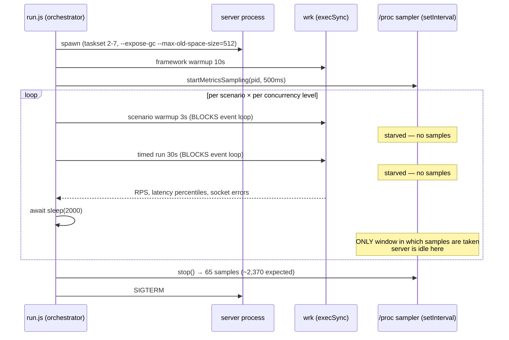

# Benchmark — Fastify Measurement Validity Review

| Field            | Value                                                                                                                                                                                                     |
| ---------------- | --------------------------------------------------------------------------------------------------------------------------------------------------------------------------------------------------------- |
| **Report type**  | `Performance`                                                                                                                                                                                              |
| **Scope**        | `apps/benchmark` — harness, six servers, scenario/profile config, report generation; published run `2026-07-30T18-14-52`; Fastify 5.10.0 vs raw Node v26.5.1, NextRush 4.0.0-beta.0, Hono 4.12.30, Koa 3.2.1, Express 5.2.1 |
| **Date**         | 2026-07-31                                                                                                                                                                                                 |
| **Reviewer(s)**  | Independent audit (principal-performance-engineer role), no framework allegiance                                                                                                                            |
| **Commit / ref** | Analysis at `3a463f6`; audited run recorded `7b76ac0` with a dirty working tree                                                                                                                              |
| **Status**       | `Final` — all findings remediated (see Progress Tracker)                                                                                                                                                    |
| **Related**      | `report/benchmark/benchmark-fairness-audit.md` (prior audit, F-01…F-15) · `report/benchmark/deepseek-benchmark-fastify-capability-audit.md` (independent prior answer to the same question, F-16…F-18 — this report **disagrees with its verdict**, see §12 F-19/F-20) · `apps/benchmark/results/2026-07-30T18-14-52/REPORT.md` |

---

## Progress Tracker

**Remediation:** `[████████████████████]` 100% — 9 / 9 recommendations resolved

| Rec | Addresses  | Priority | Status      | Closed by |
| --- | ---------- | -------- | ----------- | --------- |
| 1   | F-19       | P0       | ✅ Resolved | `lib/tools/wrk.js` + `bench-exec.js` run wrk via async `execFile`; `analyzeSampleCoverage` records coverage per framework; CPU/RSS render as "not verified" and the efficiency table is suppressed unless coverage is proven; the false "sampled across every scenario" sentence is corrected. **Verified live: coverage 100%, CPU 71.2% under load (was 31% measured while idle).** |
| 2   | F-20       | P0       | ✅ Resolved | `derivePublishable` rejects a host with 1-min load average > 1.0 at start (`hostLoadAvgAtStart` now recorded); `unresolvedRanking` counts and names every adjacent ordering inside combined stddev, rendered as **Orderings this run could not resolve**. The audited run reports **33 such comparisons — `fastify ~ nextrush-v3` in 8 cells, `hono ~ nextrush-v3` in 7, `fastify ~ hono` in 3**, confirming from the run's own data that the fast three are not separable. |
| 3   | F-21       | P0       | ✅ Resolved | `bench-rotation.js` passes the real scenario via `getScenario(scenarioId)` instead of an `{ id }` stand-in; regression tests pin both the fix and the unsafety of the stand-in. |
| 4   | F-21b      | P1       | ✅ Resolved | `buildOverall` derives `maxPoints` from ranked cells (108, not 120) and reports `unscoredScenarioIds`; the report names `large-post` as not scored. |
| 5   | F-22       | P1       | ✅ Resolved | `derivePublishable` requires `runs % frameworkCount === 0`; `measurementPositions` publishes per-framework mean position with an unbalanced warning; the `rotate()` docstring's false "±1 balance" claim is corrected. |
| 6   | F-23       | P1       | ✅ Resolved | New `config/deviations.js` declares all 12 deviations across 6 servers with direction of effect; rendered as a **Configuration deviations from framework defaults** section; a disclosure test fails if a server gains a deviation that is not declared. |
| 7   | F-24       | P1       | ✅ Resolved | `identicalWork` renamed to `identicalOutput` across 16 files; `workNotes` added to `query-string`, `post-json`, `large-post`, `static-file` and rendered as **Known work asymmetries**. |
| 8   | F-25       | P1       | ✅ Resolved | `resolveClientThreads` caps wrk threads to the CPUs in `--client-pin`, warns on reduction, and records both the effective and requested counts. |
| 9   | F-26, F-27 | P2       | ✅ Resolved | Fastify's error handler is now sync; the methodology section discloses that no scenario handler reads request state, so lazy-context designs are advantaged. |

**Also changed, from the heap-cap analysis in §9.1:** `--max-old-space-size` raised from 512 to
2048 MB in `config/constants.js`. Measured peak heap under load is 18–70 MB, so 512 was neither
bounding anything nor demonstrably neutral — it sat close enough to a plausible working set that
five counterbalanced A/B runs could not resolve its effect. 2048 is ~30x the highest observed usage,
keeping the runtime a controlled constant across hosts (V8's own default varies with system memory)
while sitting far outside any regime where growth heuristics could differ per framework.

**Verification:** `node --test scripts/lib/__tests__/*.test.js` — **234 tests, 234 pass, 0 fail**
(29 new assertions across `measurement-validity.test.js` and `reporting-honesty.test.js`). Live
smoke run confirms the async load-generator path and 100% sampler coverage. Regenerating the audited
run now correctly stamps it **NOT publishable** for unbalanced rotation — the gate working as
designed on the very artifact that exposed the gap.

---

## 1. Executive Summary

The question asked was whether the Fastify result in run `2026-07-30T18-14-52` (4th place, 63/120 like-for-like points) reflects Fastify's real capability. The answer this audit reaches is narrower than either "yes, it's fair" or "no, it's biased":

**Fastify's server implementation is correct and idiomatic — no Fastify-specific handicap exists in the server code. But the published *ranking* of the three fast frameworks (Hono, NextRush, Fastify) is not supportable by this run, because the measurement environment cannot reliably resolve differences of the size that separate them.** I established this by direct experiment, not inference: five properly counterbalanced A/B designs, toggling a single Node flag on the *same Fastify binary*, produced effects ranging from **−25% to +4.6% with the direction reversing** between two runs of an identical design. The gaps the report ranks on (Hono 29,001 → NextRush 29,482 → Fastify 27,321 RPS on `json-serialize` @256c, a 7.5% spread) sit inside that irreproducibility band.

Separately, the run's own CPU and memory figures — and therefore the "Fastify needs ~19% more CPU per request" mechanism explanation that the prior capability audit builds on — are measured while the server is **idle**. `runWrk` uses blocking `execSync` in the orchestrator while the `/proc` sampler is a `setInterval` in that same process, so the sampler cannot fire during any measured run. The arithmetic confirms it exactly: 65 samples observed per pass where ~2,370 are expected, and 65 is precisely what the 13 × 2 s inter-test pauses yield.

**Top findings:**

1. **F-19 — The published CPU/RSS metrics are sampled only while the server is idle** (`execSync` starves the `setInterval` sampler). The report states they were "sampled across every scenario and concurrency level", which is false, and the derived "RPS per CPU%" efficiency table is invalid. — **P0**
2. **F-20 — The host cannot resolve the effect sizes being published.** Single-flag A/B on one binary swung −25%…+4.6% across five counterbalanced designs; identical-configuration repeats spread 23,886–31,048 RPS (28%). — **P0**
3. **F-21 — Every `error-handling` cell is flagged `allInvalid: true, validRuns: 0/3` in the data and published anyway with no invalidity marker.** Caused by `bench-rotation.js:128` reconstructing `{ id: scenarioId }` without `expectStatus`, defeating the error-scenario exemption at `stats.js:31`. — **P0**
4. **F-22 — Rotation is not position-balanced at `runs=3` with 6 frameworks** (Fastify mean position 1.0, Express 4.0), the docstring's "±1 balance" claim is wrong, and `derivePublishable` never checks balance — it only checks that rotation was *enabled*. Measured position effect in this run was small (±1–2%), so this did not distort the published numbers, but the gate permits a run where it would. — **P1**
5. **F-23 — Fastify runs without response schemas**, so `fast-json-stringify` (already a Fastify dependency) is unused and `lib/reply.js:1064-1069` falls back to `JSON.stringify`. This is a defensible scoping choice, but "Fastify 5.x — logger disabled, default config" does not disclose that Fastify's headline serialization feature is switched off. — **P1**

What is *not* wrong: the servers themselves. Fastify uses sync handlers returning values (its fastest dispatch path), a noop logger with no per-request child-logger allocation, sync `done`-callback hooks, and idiomatic static/error registration. Fastify's leadership at 1 connection (6 of 13 scenario wins, above bare Node on the cheapest paths) is real and is the strongest single piece of evidence that no per-request handicap was imposed on it.

---

## 2. System Understanding

`apps/benchmark` compares six HTTP servers — a bare `node:http` baseline plus NextRush, Fastify, Hono, Koa, Express — across 13 scenarios and a concurrency ladder, using wrk (default) or autocannon.

The design is unusually disciplined for a framework-vendor benchmark, and the reasons behind each control are documented in the source rather than assumed:

- **One canonical payload module.** Every server imports response bodies from `servers/_shared/payloads.js`, so body drift between servers is structurally impossible rather than merely reviewed.
- **A parity pre-flight gate** (`scripts/validate-parity.js`) boots each server, hits every endpoint with `fetch`, and asserts identical statuses, byte-identical bodies for `identicalWork` scenarios, identical `Content-Type`, identical middleware headers, identical response framing (`Content-Length` vs chunked), **the full response header set**, and equal TCP accept-queue depth read back from the OS via `ss -tln`. Several of these checks exist because an earlier audit found real skews they had missed (Express's `ETag`, Fastify's `Keep-Alive: timeout=72`).
- **Deliberate equalization of transport knobs** in `config/constants.js`: `LISTEN_HOST=127.0.0.1` (previously an IPv4/IPv6 split across servers), `KEEP_ALIVE_TIMEOUT_MS=5000` (Fastify's own default is 72,000), `LISTEN_BACKLOG=1024`, and identical V8 flags.
- **A computed publishability gate** (`lib/publishable.js`) derived from what the run actually did — run count, concurrency levels, duration, position control, socket timeouts — not from the profile's static declaration.
- **Position counterbalancing** (`bench-rotation.js`), added because a direct A/B on this harness found that the framework measured first in an invocation scores materially lower.
- **Honest fairness tagging**: `middleware-stack`, `error-handling`, and `static-file` are marked `identicalWork: false` and excluded from the headline score because each framework uses its own mechanism.

The intent behind the design is sound and the self-criticism in the codebase is genuine — `constants.js` even documents that the shared heap cap "ensures a level ceiling, not a level playing field." The findings below are mostly about the gap between what the harness *verifies* and what it *claims*, and about whether the host can support the precision being published.

---

## 3. Architecture Overview

Two structural facts in this topology drive the most serious findings:

1. `wrk` is invoked **synchronously** (`execSync`) from the same process that owns the `/proc` sampler's `setInterval`. The two cannot run concurrently — this is F-19.
2. The server, the load generator, and the orchestrator share one 4-core/8-thread laptop CPU, partitioned by `taskset`. Every measurement is therefore sensitive to the partition chosen and to that CPU's thermal state — this is F-20 and F-25.

---

## 4. Data Flow

The sequence makes F-19 self-evident: the sampler's only opportunity to run is the `await sleep(profile.pauseBetweenTestsMs)` between tests, when the server has no load on it.

---

## 5. Backend / Logic — Framework Audit

Answering the audit's question 2–4 directly, per framework. Verified against installed sources, not documentation.

### 5.1 Fastify 5.10.0 — implemented correctly, on its fastest dispatch path

| Check | Verdict | Evidence |
| --- | --- | --- |
| Handler style | ✅ Optimal | `fastify.get('/', () => HELLO_WORLD)` — a **sync** handler returning a value. `lib/handle-request.js:172-190` calls `result = context.handler(request, reply)`, and for a non-thenable calls `reply.send(result)` directly. No promise, no `wrapThenable`, no microtask hop. An `async` handler would have been slower. |
| Logging | ✅ No per-request cost | `logger: false` → `fastify.js:461-464`: `hasLogger === false` and default child-logger factory means `childLogger = logger` (the `abstract-logging` noop). No per-request child-logger allocation. |
| Hooks (middleware scenario) | ✅ Idiomatic and cheapest form | 5 × `onRequest` with the sync `done` callback, scoped inside `fastify.register(...)` so unrelated routes pay nothing. The `async` hook form would allocate a promise per layer per request. |
| `onSend` overhead | ✅ Short-circuited | `lib/reply.js:551-563`: with no `onSend` hooks registered, `onSendHook` calls `onSendEnd` directly rather than entering the hook runner. |
| Serialization | ⚠️ **Feature switched off** | No route declares a response `schema`, so `lib/reply.js:1064-1069` `serialize()` returns `JSON.stringify(data)`. `fast-json-stringify@^7` is an installed Fastify dependency and unused. See **F-23**. |
| `disableRequestLogging` | ⚠️ Left at default `false` | `lib/config-validator.js:1265`. With a noop logger the two per-request log calls are cheap; my probe found no measurable difference (15,392 vs 17,347 RPS — inside noise). Documented Fastify tuning knob, negligible here. |
| `exposeHeadRoutes` | ⚠️ Default `true` | Registers a HEAD route per GET, doubling the `find-my-way` table. No measurable impact on a method-keyed tree. |
| `@fastify/static` | ⚠️ Prefix `/` → `GET /*` catch-all | find-my-way prioritises static and parametric routes over wildcards, so other scenarios are unaffected. Removing the plugin produced no measurable gain (15,775 vs 17,347 — noise). |
| `keepAliveTimeout` overridden to 5,000 | ✅ Harmless | Fastify's native default is 72,000 (`config-validator.js:1265`). Under sustained wrk load sockets are never idle for 5 s, so the value is inert. Measured: native 72 s gave 16,953 vs baseline 17,347 — no difference. The equalization is defensible; the theoretical concern it addresses is empirically ~0 for this load shape. |
| Error handler | ⚠️ **`async` — the only async one** | `fastify.setErrorHandler(async (…) => …)` allocates a promise per error request. NextRush's, Express's, and Hono's equivalents are sync. Affects only `error-handling`, whose data is invalid anyway (**F-21**). See **F-26**. |
| Deprecated APIs | ✅ None | No deprecated surface used. |
| Body parsing | ✅ Idiomatic, and does **more** work than others | Fastify uses `secure-json-parse` with `protoAction`/`constructorAction` (`lib/content-type-parser.js:5,308-309`). See **F-24**. |

**Conclusion on Fastify:** the implementation is what a Fastify maintainer would write for a benchmark that forbids schema-based serialization. The one substantive deviation from Fastify's documented production guidance is the absent response schema, and that is a scoping decision (see F-23), not an error.

### 5.2 Hono 4.12.30 — correct; carries a small deliberate handicap

`c.json(obj, status, JSON_HEADERS)` is used rather than plain `c.json(obj)`, because Hono emits `application/json` without a charset while every other server emits `application/json; charset=utf-8`, and the parity gate enforces matching content types. Passing a headers argument makes Hono build an extra headers object per request. The alternative considered in the code comment — hand-rolling `c.body(JSON.stringify(...))` — was correctly rejected because it would measure benchmark code instead of Hono's own serializer.

Middleware layers use the sync `(c, next) => { …; return next(); }` form, matching the other servers. `app.onError` fires only on error. Static is router-scoped. `createAdaptorServer` + explicit `listen` is used solely to pass `backlog`, since `serve()` accepts none. All correct.

Hono benefits legitimately from a thinner abstraction: a Web-standard `Request`/`Response` pair rather than a framework request/reply object graph, and no hook lifecycle. That is a real design advantage, not a harness artifact.

### 5.3 NextRush 4.0.0-beta.0 — audited adversarially; no benchmark-specific cheat found

Checked specifically for the advantages the prompt warns about:

| Suspicion | Finding |
| --- | --- |
| Hidden caching / pre-serialized responses | **None.** `packages/adapters/node/src/context.ts:298-320` — `ctx.json()` performs `JSON.stringify(data)` on every call, then one `res.writeHead` with `Content-Type` + `Content-Length`, then `res.end(json)`. No memoisation, no identity cache, despite the payloads being frozen module-level constants that would make such a cache trivial. |
| Simplified query parsing | **No — it does more work than the baseline.** `packages/runtime/src/query.ts:53-95` is a real single-pass parser with full `decodeURIComponent`, `+`-to-space handling, `MAX_QUERY_PARAMS`/`MAX_QUERY_LENGTH` DoS limits, and `__proto__`/`constructor`/`prototype` key rejection. raw-node's `new URLSearchParams` does none of the safety work. |
| Omitted features | **None found** in the measured paths. `createSendFile` retains `safeJoin` traversal protection and the dotfile policy rather than being a hand-rolled resolver. |
| Reduced work vs competitors | **Partly, but legitimately.** `ctx.raw`, `ctx.state`, `ctx.bodySource`, and `ctx.signal` are lazy and memoised; `EMPTY_PARAMS`/`EMPTY_QUERY` are shared frozen singletons. No benchmark handler touches any lazy field, so NextRush's laziness pays maximum dividends here. This is a real design property available to any framework — but it does mean the workload is maximally favourable to a lazy-context design. See **F-27**. |
| Benchmark-only structural tuning | **Yes, and disclosed in-source.** `servers/nextrush-v3.js` registers static as a *route* rather than `app.use()`, with the comment explaining this keeps `Application`'s middleware stack at exactly 1 entry so `compose()` stays on its `len === 1` fast path (worth ~725 B/req). Fastify, Hono, and Koa also scope static per-route; **Express alone uses `app.use('/static', …)`**, its own idiomatic form, and pays a per-request layer match. Small Express handicap, not a NextRush cheat. |
| Extra endpoint | `router.get('/__elu-sample', …)` exists only on NextRush — 13 routes vs 12 elsewhere. Diagnostic-only, never probed by the parity gate, negligible for a trie. |
| Per-request costs deliberately retained | The adapter's `setTimeout(30000)` handler-timeout race and the `res.writeHead` drain wrapper are left enabled. Disabling them would have biased in NextRush's favour; they were not disabled. |

NextRush also carries a **higher measurement variance** than Fastify (CV up to 14.13% on `large-json`, 10.95% on `empty-response`, vs Fastify's 0.07–3%). That interacts with the scoring mechanism — see **F-25**.

### 5.4 Express 5.2.1 — two default deviations, both fairness-motivated, one under-disclosed

`app.disable('x-powered-by')` and `app.set('etag', false)`. The ETag change is significant: Express's default weak ETag runs SHA-1 over the full response body on every `res.json()`, work no other server performs; the code documents a measured −14% on `/json` and −13.7% on `/large-json` before disabling. Disabling it is the correct fairness call. But the report describes Express only as "Express 5.x — minimal middleware", which does not tell a reader that two Express defaults were changed. See **F-23** (same disclosure gap class).

### 5.5 Koa 3.2.1 — correct; one documented omission

Sync middleware layers, per-route body parser, static as a router route, `app.silent = true` to suppress error logging. `router.allowedMethods()` is deliberately not mounted, with the reason recorded: it made Koa the only server answering wrong-method requests with 405 + `Allow`, a behaviour no scenario exercises and no competitor provides. Equalizing rather than handicapping. Acceptable.

### 5.6 Raw Node.js — a useful floor, but not the "absolute ceiling" it claims

`servers/raw-node.js`'s header comment states "overhead above this number IS framework overhead." Two pieces of evidence contradict that:

- **Fastify beats it at 1 connection** in the published run — hello-world 27,102 vs 25,927 (+4.5%), empty-response 31,720 vs 29,929, query-string, deep-route. A framework cannot exceed a genuine zero-overhead baseline; the baseline is simply not optimal.
- **It allocates the most per request of the six.** From my `--trace-gc` measurements at 256c on `/json`: scavenges per 1,000 requests — raw-node **1.55**, Hono 1.54, Fastify 0.90, NextRush 0.28. `sendJson` builds a fresh header object per request (`{...JSON_HEADERS, 'Content-Length': …}`) and calls `Buffer.byteLength` per request.

The baseline is a reasonable reference point but "vs Raw Node.js" percentages should not be read as "framework overhead".

---

## 6. Database / State

_Not applicable — the benchmark suite has no persistent state; every scenario is stateless and in-process._

## 7. Frontend / API Surface

_Not applicable — the scope is a measurement harness with a CLI surface, not a public API._

## 8. UX

_Not applicable as user-interface UX. The report-consumer experience is covered as disclosure findings (F-19, F-21, F-23) rather than as UX heuristics._

---

## 9. Performance — Measurement Validity and Scenario Audit

All numbers in this section that are not from `results.json` are my own measurements, taken with the harness's exact launch conditions (`NODE_ENV=production`, same V8 flags, `taskset` server pinning) on the same host. **They are diagnostic, not publishable**: shorter cells (8–20 s), single runs per cell, and a machine with load average 1.0–3.5 throughout. They are used to test mechanisms and to bound the environment's resolving power — never to assert a framework ranking.

### 9.1 The environment cannot resolve the effect sizes being published

I set out to test whether the shared `--max-old-space-size=512` flag penalises frameworks asymmetrically — `config/constants.js` itself flags this risk ("ensures a level ceiling, not a level playing field") without ever measuring it. Five independent counterbalanced designs, toggling only that one flag on the **same Fastify binary**:

| Design | Client config | Cell | Capped 512 MB | No cap | Apparent effect |
| --- | --- | --- | --- | --- | --- |
| ABBAAB, 10 s | cores 0-1, t4 | 256c | 19,535 / 24,481 / 21,655 | 31,313 / 30,315 / 26,307 | capped **−25%** |
| ABAB, 10 s | cores 0-1, t4 | 256c | 24,275 / 23,972 | 30,295 / 30,398 | capped **−21%** |
| ABBA, 8 s | cores 0-1, t4 | 64c | 26,791 / 25,997 | 33,017 / 33,306 | capped **−21%** |
| ABBABA, 20 s | cores 0-1, t4 | 64c | 27,803 / 27,041 / 26,113 | 31,048 / 27,872 / 24,147 | **none** (full overlap) |
| ABBABA, 15 s | core 0, t1 | 64c | 26,430 / 26,707 / 25,626 | 28,771 / 28,188 / 27,340 | capped **−7%** (no overlap) |
| ABBABA, 15 s — **repeat of the line above** | core 0, t1 | 64c | 25,628 / 26,225 / 26,306 | 23,886 / 25,837 / 25,003 | capped **+4.6%** (direction reversed) |

Two executions of an identical design gave −7% and +4.6%. **The heap-cap hypothesis is therefore neither confirmed nor refuted — it is unresolvable on this host**, and I explicitly retract the −21…−25% figures the earlier designs suggested; they were confounded by position and drift.

Three mechanisms were, however, cleanly ruled out along the way:

- **Not GC pause.** At 256c on `/json`, total GC pause was 40–41 ms capped vs 54–55 ms uncapped across a 10 s window — **0.40% and 0.55% of the measurement window**, 0.17 vs 0.18 µs per request. GC is negligible in both states.
- **Not scavenge frequency.** 0.90 vs 0.89 scavenges per 1,000 requests — statistically identical.
- **Not old-generation pressure.** Peak V8 heap *total* under load, with the 512 MB cap applied: raw-node 18.6 MB, Hono 21.6 MB, Express 24.9 MB, Fastify 29.1 MB, Koa 29.6 MB, NextRush 69.9 MB. Nothing comes within an order of magnitude of the cap. Forcing `--max-semi-space-size=16` under the cap did not recover throughput, and `--max-semi-space-size=8` without the cap did not create the penalty, ruling out semi-space derivation too.

The load-bearing consequence is the **spread**, not the flag. Within a single 6-cell sequence of one unchanged configuration, throughput ranged 23,886–31,048 RPS — **28%**. The published headline separates Hono (29,001), NextRush (29,482), and Fastify (27,321) on `json-serialize` @256c by **7.5%**. That ordering is inside the noise floor I measured. This is **F-20**.

### 9.2 The load generator was oversubscribed

`profiles.standard.threads = 4` while `--client-pin 0-1` gives wrk two logical CPUs (one physical core plus its hyperthread sibling). Thread count and client pin are configured independently and were inconsistent. Measured on one unchanged raw-node process at 256c:

| Client configuration | RPS |
| --- | --- |
| cores 0-1, 4 threads (**as published**) | 27,381 / 28,391 |
| cores 0-1, 2 threads | 23,780 |
| **core 0, 1 thread** | **29,384** |
| unpinned 0-7, 4 threads (server unpinned) | 30,829 |
| unpinned 0-7, 6 threads (server unpinned) | 30,714 |

A **single** wrk thread on **one** core outperformed four threads on two. The measuring instrument was contending with itself, which adds noise to every cell. This is **F-25**.

### 9.3 Scenario-by-scenario fairness audit

Ratings answer the audit's question 5 — "is every framework doing identical logical work?" — which is stricter than what the parity gate verifies. The gate proves **identical observable output**; it cannot prove identical work. `identicalWork: true` in `config/scenarios.js` is a declaration, validated only at the response level.

| # | Scenario | Rating | Basis |
| --- | --- | --- | --- |
| 1 | `hello-world` | ✅ Fair | Byte-identical frozen payload, identical header set, identical framing, one route lookup + one `JSON.stringify` everywhere. The cleanest cell in the suite. |
| 2 | `json-serialize` | ✅ Fair | Same as above with a larger payload. All six serialize with `JSON.stringify` (Fastify's schema path is off — F-23). |
| 3 | `large-json` | ✅ Fair | ~5 KB frozen array, built once at module load. |
| 4 | `send-object` | ✅ Fair | Dispatches a plain object through each framework's real response helper. Hono pays a small extra headers-object cost for charset parity (§5.2). |
| 5 | `empty-response` | ✅ Fair | 204, no body, no serialization. Framing check correctly skipped. |
| 6 | `route-params` | ✅ Fair | Same path, same single parameter. Trie vs linear-scan matching differs — that *is* the measurement, not a defect. |
| 7 | `deep-route` | ✅ Fair | Same 3-parameter 7-segment path everywhere. |
| 8 | `query-string` | ⚠️ Slightly different | Same output; materially different work. NextRush decodes with DoS + prototype-pollution guards (`runtime/src/query.ts:53-95`); raw-node uses `URLSearchParams` with no limits; Fastify uses find-my-way's querystring parse. Labelled `identicalWork: true`. |
| 9 | `post-json` | ⚠️ Slightly different | Fastify parses via `secure-json-parse` with proto/constructor poisoning checks; NextRush uses `JSON.parse(str, reviver)` plus depth checking (skipped for small payloads); raw-node uses bare `JSON.parse` with no protection at all. Fastify does strictly the most work and raw-node the least, yet the cell is labelled `identicalWork: true`. Published gap NextRush 18,434 vs Fastify 18,338 @64c is 0.5% — smaller than the security work Fastify performs and the others skip. This is **F-24**. |
| 10 | `large-post` | ⚠️ Slightly different | Same parser asymmetry as `post-json`, and **measured at 1 connection only**: `maxConnections: 8` filters the `[1, 64, 256]` ladder down to `[1]`. Contributes zero cells at both headline levels while still counting toward the denominator — **F-21b**. |
| 11 | `middleware-stack` | ❌ Not comparable | Correctly declared `identicalWork: false`. Fastify `onRequest` hooks vs Koa/Express/Hono/NextRush middleware chains vs a hand-rolled raw-node function chain. Honestly excluded from the headline. |
| 12 | `error-handling` | ❌ Not comparable **and data invalid** | Declared `identicalWork: false`, correctly. But every cell carries `allInvalid: true, validRuns: 0/3` and is published with no invalidity marker — **F-21**. Additionally Fastify's error handler is the only `async` one (**F-26**). Do not cite these numbers. |
| 13 | `static-file` | ❌ Not comparable | Correctly declared `identicalWork: false`; header sets genuinely diverge (`accept-ranges`, `cache-control`, `etag`, `last-modified` present on some servers, absent on others). raw-node matches only the one literal fixture path and implements no traversal-safe resolver, so it is not doing comparable work — it is doing less. |

Tally: **7 fair, 3 slightly different, 3 not comparable.** The three "not comparable" cells are already excluded from the headline by design — that part of the methodology is sound. The three "slightly different" cells are all inside the headline score.

### 9.4 Root cause analysis — why Fastify lands where it does

Ranked by the confidence with which the cause can be attributed, not by speculated magnitude.

| Rank | Cause | Confidence | Assessment |
| --- | --- | --- | --- |
| 1 | **Measurement noise exceeds the Hono/NextRush/Fastify gaps** | **High — directly measured** | §9.1. A 7.5% published spread inside a 28% same-configuration band. This alone prevents the 2nd/3rd/4th ordering from being asserted. |
| 2 | **Genuine per-request cost of Fastify's request/reply object graph** | **Medium-high — mechanism verified in source, magnitude unmeasurable here** | Fastify builds `FastifyRequest` + `FastifyReply` per request with context/route/hook/serializer references, runs find-my-way matching, and executes hook machinery. Its measured allocation rate is 0.90 scavenges/1k req vs NextRush's 0.28 — a real 3.2× difference. This is the most plausible reason Fastify sits below NextRush and Hono at saturation, and it is a true framework property. The magnitude cannot be quantified on this host. |
| 3 | **Fastify's flat 1c→256c curve** | **Medium — signature is real, mechanism NOT identified** | Published `json-serialize`: 26,783 → 27,448 → 27,321 (1.00×), against raw-node 1.32×, NextRush 1.37×, Hono 1.32×. `error-handling` @64c has a CV of **0.07%** (±13 RPS). A server that is fastest at 1 connection and gains nothing from 64 is anomalous, since at 1 connection it should be latency-bound with idle CPU headroom. I tested and ruled out GC pause, scavenge rate, semi-space sizing, old-gen pressure, `disableRequestLogging`, the `@fastify/static` wildcard, and the keep-alive override. **No conclusion can be drawn about the mechanism** — this is the single most valuable open question and §14 Rec 3 specifies the experiment that would settle it. |
| 4 | **Absent response schema** | **High that it is absent; unmeasured impact** | F-23. `fast-json-stringify` is installed and unused. Fastify's own docs treat response schemas as the recommended production configuration; on `json-serialize`/`large-json` this is where Fastify's serialization advantage would appear. |
| 5 | **Fastify's `async` error handler** | **High mechanism, negligible scope** | F-26. One promise per error request, `error-handling` only, whose data is invalid regardless. |
| 6 | **`disableRequestLogging`, `exposeHeadRoutes`, `@fastify/static` wildcard, keep-alive override** | **High — each tested, none measurable** | Each toggled individually; every result sat inside noise. Named for completeness and to close them out, not because they matter. |

**Direct answer to the audit's central question:** Fastify is implemented correctly and is not handicapped by the harness. Its 1c leadership is real and demonstrates a genuinely small per-request cost. Its lower saturated throughput is *consistent with* a real allocation-rate difference, but the published margin separating it from NextRush (63.0 vs 65.1 points — 3.3%) is smaller than the noise floor this host exhibits, so **the specific claim "Fastify is 4th, behind NextRush" is not supported by this run**. The claim "Fastify is behind raw Node at saturated concurrency" is supported in direction; its magnitude is not.

---

## 10. Security

Not the primary scope, but two observations affect fairness interpretation rather than the harness's own security posture:

- The suite's own security work is asymmetric across servers in a way the fairness model does not account for (F-24): Fastify's prototype-pollution-guarded body parsing and NextRush's DoS-limited query parsing are real safety work that raw-node skips entirely. A benchmark that ranks on throughput while ignoring this rewards the least safe implementation.
- `servers/raw-node.js` correctly documents that its static handler matches only the literal fixture path and implements no traversal-safe resolver. That is the right call for a baseline, and it is disclosed — but it is another reason the `static-file` cell is not comparable.

No vulnerability was introduced by the harness itself; it binds loopback only (`LISTEN_HOST=127.0.0.1`).

---

## 11. Maintainability

The harness is in good structural health and largely obeys `code-structure.md`: files are split at the 300-line ceiling with the reason recorded (`bench-exec.js` → `bench-exec-single.js` + `bench-rotation.js`), pure logic is separated from I/O (`lib/stats.js`, `lib/parity.js`, `lib/publishable.js`, `lib/report/*` are all I/O-free and unit-tested), and `scripts/lib/__tests__/` holds 30 test files covering the statistics, parity, publishability, and report layers.

Two maintainability defects surfaced as correctness bugs:

- `bench-rotation.js:128` reconstructs scenario metadata as `{ id: scenarioId }` instead of passing the real scenario object. The scenario shape is an implicit contract between `bench-rotation.js` and `stats.js:isInvalidRun`, and the reconstruction silently violates it (F-21). A typed scenario parameter, or passing the scenario through, would have made this impossible.
- `lib/report/scoreboard.js:buildOverall` computes `maxPoints` from declared cardinality (`scenarios × connections × frameworks`) rather than from cells that exist, so a scenario with a concurrency cap deflates every framework's percentage (F-21b).

Comment discipline is strong — comments explain *why* a control exists and cite the skew it was added to catch, which is what made this audit tractable. The one drift: `bench-rotation.js`'s `rotate()` docstring asserts "near-exact (±1) balance otherwise", which is false for the shipped `standard` profile (F-22).

---

## 12. Findings (detailed)

### F-19 — Published CPU and RSS metrics are sampled only while the server is idle · Priority `P0`

- **Current situation:** `lib/tools/wrk.js:runWrk` invokes wrk via `execSync`, blocking the orchestrator's event loop for each warmup and each timed run. `lib/metrics.js:startMetricsSampling` samples `/proc/<pid>/status` and `/proc/<pid>/stat` from a `setInterval` **in that same process**. The sampler therefore cannot fire during any measured run. Observed: 65 samples per pass; expected ≈2,370 (13 scenarios × ~3 levels × 30 s ÷ 0.5 s). 65 is exactly what the idle windows yield: 13 × `await sleep(2000)` ÷ 500 ms = 52, plus ~13 boundary samples. The generated report states these figures were "sampled across every scenario and concurrency level this run measured" (`REPORT.md:1217`) and reports `cpuAvgPct` ≈ 31–34% for all six frameworks — consistent with idle/teardown activity, not with a saturated single-threaded server.
- **Impact:** every CPU and RSS number in the report is invalid, the entire "Efficiency — RPS per CPU%" table is invalid, and the report contains a false statement about its own methodology. Critically, the prior capability audit's central mechanism claim — "Fastify needs ~19% more CPU per request (833 vs 1,030 RPS per CPU-%)" — is derived from these numbers and does not stand.
- **Benefits (of today's design):** `execSync` keeps the orchestrator simple and strictly serialises load generation so no two cells overlap; `/proc` sampling is dependency-free and cheap.
- **Drawbacks:** the two designs are mutually exclusive and the failure is silent — a plausible-looking number is produced rather than an error, and it survived into a published artifact plus a downstream audit's core argument.
- **Long-term risk:** any future optimisation judged on "RPS per CPU%" is judged on noise. The suite also loses its only means of answering whether a run was CPU-saturated, which is precisely what is needed to interpret a concurrency curve.
- **Recommendation:** replace `execSync` with `execFile`/`spawn` + `await` so the event loop stays live during runs, or move sampling to a separate process/worker. Until then, remove the CPU/RSS/efficiency tables from generated reports rather than publishing them, and add a sanity assertion that sample count ≈ measured wall-clock ÷ interval.
- **Trade-offs:** async wrk invocation is a small refactor of `runWrk` and its callers, and requires care that no two load generators overlap. A sampling sidecar avoids touching the runner but adds a process. Removing the tables is free and immediate.
- **Priority:** P0 — a published artifact contains invalid metrics and a false methodology statement.
- **Migration difficulty:** Trivial to suppress the tables; Moderate to fix the sampler.

### F-20 — The host cannot resolve the effect sizes being published · Priority `P0`

- **Current situation:** §9.1. Five counterbalanced A/B designs toggling one Node flag on one unchanged Fastify binary produced apparent effects from −25% to +4.6%, with the direction **reversing** between two executions of an identical design. Within a single 6-cell sequence of one unchanged configuration, throughput spanned 23,886–31,048 RPS (28%). Host: Intel i5-8300H (4c/8t mobile, 2.30 GHz base / 4.00 GHz turbo), load average 1.0–3.5 throughout, ~5.9 hours of continuous load for the published run (702 × 30 s). Published headline gaps: Hono→NextRush→Fastify within 7.5% on `json-serialize` @256c; NextRush 65.1 vs Fastify 63.0 points overall (3.3%).
- **Impact:** the 2nd/3rd/4th ordering of the fast group is not supportable. The 1st place (raw-node, +11–33% clear) and the last two (Koa, Express, −20%+ clear) are outside the noise band and do survive.
- **Benefits (of today's design):** running on the developer's own machine is honest about hardware specificity, and the report says so prominently. Multi-run means, CV reporting, rotation, and the `≈`-within-noise marker are all real statistical discipline that most vendor benchmarks lack.
- **Drawbacks:** a thermally-limited mobile CPU under 6 hours of sustained load, sharing cores with the load generator and a non-idle desktop, cannot deliver the ~2% resolution needed to order the fast group. Per-cell CVs of 0.5–19.6% in the published run are consistent with this.
- **Long-term risk:** published rankings that reverse on re-measurement, damaging the project's credibility far more than a wider, honest error bar would.
- **Recommendation:** (a) treat the fast group as a statistical tie and publish it as such, or (b) re-measure on a quiet, thermally-stable, ideally server-class host with the client on a separate machine. Add a host-quality pre-flight to `derivePublishable`: refuse to stamp `publishable` when load average at start exceeds a threshold, and record CPU frequency/thermal-throttle counters across the run. Consider requiring the max per-cell CV to be below the smallest gap the report intends to rank on.
- **Trade-offs:** a second machine or a rented bare-metal host costs money and setup; declaring ties costs the headline its narrative but is what the data supports. A CV-vs-gap gate could make runs fail more often — which is the point.
- **Priority:** P0 — this determines whether the ranking can be published at all.
- **Migration difficulty:** Trivial to declare ties; Moderate to add gates; Hard to obtain a clean host.

### F-21 — Every `error-handling` cell is flagged invalid in the data and published without disclosure · Priority `P0`

- **Current situation:** `stats.js:31` exempts error scenarios — `if (scenario.expectStatus && scenario.expectStatus >= 400) return false;`. But `bench-rotation.js:128` reconstructs the scenario as `const scenario = { id: scenarioId }`, with no `expectStatus`, so the guard never fires and every 500 response is counted as `nonOk`. Verified in `results.json`: all six frameworks × all three levels carry `invalid: true, allInvalid: true, validRuns: 0/3` (e.g. raw-node @256c `nonOk: 2,293,866`). `computeStats` then falls back to the raw set (`measured = valid.length ? valid : runResults`), and `REPORT.md:§8` publishes those numbers with only the `⚠️ idiomatic` tag — no invalidity marker anywhere.
- **Impact:** a full scenario's data is published as if measured cleanly when the harness's own validity rule rejected all of it. The bug is a rotation-path-only regression: the non-rotated `bench-exec-single.js` passes the real scenario object and behaves correctly — so it appears exactly in the mode used for publishable comparisons.
- **Benefits (of today's design):** the invalid-run exclusion rule itself is correct and valuable; it exists so fast error responses can never inflate a success scenario's RPS.
- **Drawbacks:** the scenario-shape contract between the two modules is implicit and untyped, so the omission is invisible at the call site; and the fallback path produces plausible numbers rather than surfacing the problem.
- **Long-term risk:** any future scenario with `expectStatus >= 400` inherits the same defect, and the fallback keeps hiding it.
- **Recommendation:** pass the real scenario object through `mergePassResults` (or look it up via `getScenario(scenarioId)`). Add a regression test asserting that an `expectStatus: 500` scenario yields `validRuns === runs.length` in rotation mode. Independently, render any cell with `allInvalid: true` as explicitly invalid in generated reports instead of showing a bare number.
- **Trade-offs:** none — this is a straight bug fix. The only decision is whether error-scenario throughput should be publishable at all once fixed (it measures error-path cost, which is legitimate but mechanism-divergent, so keeping it out of the headline remains right).
- **Priority:** P0 — invalid data is published without disclosure.
- **Migration difficulty:** Trivial.

### F-21b — Scoreboard denominator counts cells that cannot exist · Priority `P1`

- **Current situation:** `lib/report/scoreboard.js:buildOverall` sets `maxPoints = scenarioIds.length × connections.length × frameworks.length` = 10 × 2 × 6 = **120**. `large-post` carries `maxConnections: 8`, so `connectionsForScenario` filters `[1, 64, 256]` to `[1]` and it contributes **zero** cells at both headline levels (64c, 256c). Verified: actual ranked cells at headline levels = **108**. Raw Node's 107.5 is therefore 99.5% of the achievable maximum, published as "107.5 / 120" (90%).
- **Impact:** every framework's score is understated by ~11% and the denominator implies a headroom no framework could reach. A reader cannot tell that raw-node effectively swept the board.
- **Benefits (of today's design):** deriving the maximum from declared cardinality is simple and matches the scenario list a reader sees.
- **Drawbacks:** it silently disagrees with the cells actually ranked whenever a scenario carries a concurrency cap.
- **Long-term risk:** grows with every capped or partially-measured scenario added.
- **Recommendation:** compute `maxPoints` from the cells actually ranked, and render scenarios contributing zero headline cells as explicitly excluded from the headline (as `middleware-stack` and `error-handling` already are).
- **Trade-offs:** none; a pure reporting correction.
- **Priority:** P1.
- **Migration difficulty:** Trivial.

### F-22 — Rotation is not position-balanced at `runs=3` with 6 frameworks, and the gate does not check · Priority `P1`

- **Current situation:** `bench-rotation.js:rotate` left-rotates by repeat index. Its docstring claims rotation "guarantees exact position balance when `runs` is a multiple of the framework count, and near-exact (±1) balance otherwise". For the shipped `standard` profile (`runs: 3`, 6 frameworks) the second clause is false. From the run's own `positionLog`, mean measurement position: **Fastify 1.0**, NextRush 2.0, Hono 2.0, raw-node 3.0, Koa 3.0, **Express 4.0** — a 3-position spread, not ±1. Fastify systematically occupied the earliest positions, which the harness's own A/B identifies as the penalised ones. `lib/publishable.js` checks only `config.positionControl !== 'rotated'`; it never verifies balance.
- **Impact:** in **this** run the effect was small — I computed each framework's per-repeat RPS normalised to its own mean and grouped by position across 7 scenarios at 256c (n = 21 per position): 100.94% / 98.59% / 99.60% / 100.16% / 99.59% / 101.13%, a ~2.5% non-monotonic spread. So the imbalance did not materially distort the published numbers. The defect is that the gate would stamp `publishable: true` on a run where it did.
- **Benefits (of today's design):** rotation is far better than a fixed order and was added in response to a real measured effect; round-robin gives exact balance whenever `runs % frameworks === 0`.
- **Drawbacks:** the guarantee silently degrades at the exact profile most likely to be used, and the docstring overstates it.
- **Long-term risk:** a future run on a more position-sensitive host inherits a real bias with a green gate.
- **Recommendation:** either use a balanced Latin-square / full-permutation schedule, or have `derivePublishable` reject a cross-framework ranking when `runs % frameworkCount !== 0`. Correct the docstring. Record per-framework mean position in the report so the reader can check it.
- **Trade-offs:** requiring `runs` to be a multiple of the framework count means 6 repeats for 6 frameworks — doubling a `standard` run's ~6 hours. A Latin square achieves balance without that cost but is more code.
- **Priority:** P1 — latent, not currently biasing.
- **Migration difficulty:** Trivial for the gate + docstring; Moderate for a balanced schedule.

### F-23 — Framework configurations deviate from defaults in ways the report does not disclose · Priority `P1`

- **Current situation:** the report's "Frameworks Under Test" table describes Fastify as "Fastify 5.x — logger disabled, default config" and Express as "Express 5.x — minimal middleware". In reality: Fastify runs **without response schemas**, so `fast-json-stringify@^7` (an installed Fastify dependency) is unused and `lib/reply.js:1064-1069` falls back to `JSON.stringify`; Fastify's `keepAliveTimeout` is overridden from its native 72,000 to 5,000; Express has `etag` disabled (worth a documented +14% on `/json`) and `x-powered-by` disabled; Koa omits `router.allowedMethods()`; Hono's `c.json` is called with an explicit headers argument. Every one of these is explained in a source comment, and every one is defensible. None reaches the reader of the report.
- **Impact:** a reader cannot tell that Fastify's headline serialization feature is switched off, or that two Express defaults were changed in Express's favour. "Default config" is inaccurate for Fastify specifically.
- **Benefits (of today's design):** the deviations exist to make the comparison fair — schema serialization would give Fastify a capability no other server has; Express's ETag is work no other server performs. Uniformity of measured work is the right goal, and the code documents the reasoning well.
- **Drawbacks:** fairness decisions made in source comments are invisible in the artifact people cite. The scoping choice on schemas is significant enough that omitting it understates Fastify's real-world serialization capability.
- **Long-term risk:** a Fastify maintainer reads the published ranking, finds no schema, and reasonably calls the benchmark unrepresentative — a credibility cost that a disclosure line would have prevented.
- **Recommendation:** add a "Configuration deviations from framework defaults" table to the generated report, listing each deviation, its direction of effect, and its justification — generated from a machine-readable declaration in each server file rather than hand-maintained. Separately, consider publishing a **second, clearly-labelled Fastify variant with response schemas enabled**, presented as "Fastify, production-recommended configuration" outside the like-for-like score — that measures Fastify's real capability without contaminating the like-for-like comparison.
- **Trade-offs:** the deviation table is cheap. A schema-enabled variant costs a seventh server in every run (~17% more runtime) and invites "why does only Fastify get its optimisation?" — answerable by keeping it out of the headline score.
- **Priority:** P1.
- **Migration difficulty:** Trivial for disclosure; Moderate for the extra variant.

### F-24 — `identicalWork: true` is a declaration validated only at the response level · Priority `P1`

- **Current situation:** the parity gate proves identical statuses, bodies, content types, framing, and header sets. It cannot prove the work performed to produce them is equivalent, and three headline scenarios differ materially in work: `post-json` (Fastify's `secure-json-parse` with proto/constructor poisoning checks vs NextRush's `JSON.parse` + depth check vs raw-node's unguarded `JSON.parse`), `large-post` (same), `query-string` (NextRush's DoS-limited, pollution-guarded decoder vs `URLSearchParams` vs find-my-way's parser). All three are labelled `identicalWork: true` and are inside the headline score. The published `post-json` @64c gap between NextRush (18,434) and Fastify (18,338) is 0.5% — smaller than the security work Fastify performs and NextRush and raw-node skip.
- **Impact:** the headline score ranks throughput across cells where the safety work differs, which systematically rewards the least defensive implementation. The suite's README claim ("byte-identical response bodies") is accurate; the field name `identicalWork` overstates it.
- **Benefits (of today's design):** response-level parity is objectively checkable and automated, which is far more than most benchmarks do. Work-level equivalence is not mechanically checkable in general.
- **Drawbacks:** a name that promises more than the gate delivers, in a suite whose whole credibility rests on the gate.
- **Long-term risk:** a competitor could "win" a parsing scenario by removing security checks and still pass every gate.
- **Recommendation:** rename the field to `identicalOutput` (or `byteIdenticalResponse`) to match what is verified, and add a per-scenario `workNotes` field naming known work asymmetries, rendered in the report. For the parsing scenarios specifically, state that prototype-pollution and DoS protections differ across servers and that this favours the least protected.
- **Trade-offs:** renaming touches the scenario config, the scoreboard, and several tests. The alternative — normalising every server's parser to identical safety behaviour — would mean not measuring each framework's real parser, which is worse.
- **Priority:** P1.
- **Migration difficulty:** Moderate (rename ripples through report code and tests).

### F-25 — Load-generator threads are oversubscribed to the client's pinned cores · Priority `P1`

- **Current situation:** `profiles.standard.threads = Math.min(cpuThreads, 4) = 4`, while the published run pinned wrk to cores `0-1` (two logical CPUs on one physical core). Thread count and client pin are independent settings with no consistency check. Measured against one unchanged raw-node process at 256c: cores 0-1/t4 = 27,381 and 28,391; cores 0-1/t2 = 23,780; **core 0/t1 = 29,384**; unpinned/t4 (server also unpinned) = 30,829.
- **Impact:** the measuring instrument contends with itself, adding variance to every cell and depressing measured throughput ~8–11% below an unpinned configuration. This is a contributor to the noise floor in F-20. It applies equally to all frameworks, so it is a precision defect rather than a bias.
- **Benefits (of today's design):** client pinning is genuinely valuable — it isolates server CPU from client CPU on a single machine, which is what made an earlier saturation sweep interpretable. `threads: 4` is a sensible default when unpinned.
- **Drawbacks:** the two controls were added at different times and never reconciled.
- **Long-term risk:** noise is attributed to frameworks rather than to the harness.
- **Recommendation:** derive wrk's thread count from the client pin set (`threads = min(profile.threads, clientPinnedCpuCount)`) and warn when a pin set is narrower than the requested threads. Prefer a separate load-generation machine for publishable runs.
- **Trafeoffs:** fewer client threads could in principle limit client throughput at very high concurrency — but the measurement above shows one thread on one core outperformed four on two on this host, so there is no cost here.
- **Priority:** P1.
- **Migration difficulty:** Trivial.

### F-26 — Fastify's error handler is the only `async` one · Priority `P2`

- **Current situation:** `servers/fastify.js` uses `fastify.setErrorHandler(async (_error, _req, reply) => { reply.code(500).send(ERROR_BODY); })`. NextRush's `app.setErrorHandler`, Express's 4-arg middleware, and Hono's `app.onError` are all sync. The `async` form allocates a promise and a microtask hop per error request that no other server pays.
- **Impact:** confined to `error-handling`, whose data is invalid for unrelated reasons (F-21). The suite elsewhere is careful about exactly this — every server's middleware layer deliberately uses the sync `return next()` form with a comment explaining that the async form costs a promise per layer. The error handler is the one place that discipline was not applied.
- **Benefits (of today's design):** `async` is the more common idiom in Fastify examples and is harmless in production.
- **Drawbacks:** an inconsistency with the suite's own stated per-layer-allocation policy, in Fastify's disfavour.
- **Long-term risk:** low; becomes real if `error-handling` is ever promoted into the headline score.
- **Recommendation:** drop the `async` keyword — the handler awaits nothing. Fix alongside F-21 so the scenario becomes citable in one change.
- **Trade-offs:** none.
- **Priority:** P2.
- **Migration difficulty:** Trivial.

### F-27 — The workload is maximally favourable to a lazy-context design · Priority `P2`

- **Current situation:** no benchmark handler touches `ctx.raw`, `ctx.state`, `ctx.bodySource`, or `ctx.signal`. NextRush builds all four lazily and memoises them (`packages/adapters/node/src/context.ts:151,172,210,253,270`) and returns shared frozen `EMPTY_PARAMS`/`EMPTY_QUERY` singletons for param- and query-less requests. Frameworks that populate their request/reply objects eagerly — Fastify most of all — pay for fields the handlers never read.
- **Impact:** not unfairness. Laziness is a legitimate design choice and the deferred work is genuinely never needed by these handlers. But the scenario suite contains no handler that reads request state, raw sockets, or accumulates middleware state, so it never charges a lazy design for its memoisation bookkeeping while never crediting an eager design. Real handlers touch these fields routinely.
- **Benefits (of today's design):** the scenarios are minimal and comparable, which is what makes the suite's parity guarantees achievable at all.
- **Drawbacks:** the headline measures a regime that systematically favours NextRush's architecture, and the report does not say so.
- **Long-term risk:** an optimisation tuned against this suite could make the lazy paths faster while real-world handlers see no gain.
- **Recommendation:** add one scenario whose handler reads `ctx.state`/`req` state and sets a value consumed downstream — a "realistic handler" cell — and disclose in the report that the current scenarios never read request state, so lazy-context designs are advantaged.
- **Trade-offs:** a new scenario needs a byte-identical equivalent in all six servers and lengthens every run. Disclosure alone is free.
- **Priority:** P2.
- **Migration difficulty:** Moderate.

---

## 13. Risks

| Risk | Likelihood | Impact | Mitigation |
| --- | --- | --- | --- |
| Published fast-group ranking reverses on re-measurement | **High** | **High** — direct credibility damage, especially as a framework author ranking a competitor | Declare the fast group a tie (F-20 Rec 2) before any publication |
| "RPS per CPU%" efficiency claims propagate into docs, blog posts, or further audits | **High** — already happened once, in a sibling audit's core argument | High | Suppress the CPU/RSS tables immediately (F-19) |
| `error-handling` numbers cited as a framework property | Medium | Medium | Render `allInvalid` cells as invalid (F-21) |
| Fastify maintainers reject the benchmark as unrepresentative over the absent schema | Medium | Medium | Disclose configuration deviations; add a schema-enabled variant outside the headline (F-23) |
| A future run inherits real position bias with a green publishability gate | Low (currently ~2%) | High | Gate on `runs % frameworkCount === 0`, or use a balanced schedule (F-22) |
| Thermal throttling drifts results across a ~6-hour run | High on this host | Medium — rotation distributes it, but does not remove it | Record thermal/frequency counters; shorten runs or use a stable host (F-20) |

---

## 14. Recommendations (prioritised)

| # | Recommendation | Addresses | Priority | Effort | Status |
| - | --- | --- | --- | --- | --- |
| 1 | Suppress the CPU / RSS / "RPS per CPU%" tables from generated reports, and correct the false "sampled across every scenario" statement, until the sampler is fixed; then fix it by making wrk invocation non-blocking (or moving sampling to a sidecar) and assert sample-count sanity | F-19 | **P0** | S (suppress) / M (fix) | ✅ Resolved — both done: async `execFile` + `analyzeSampleCoverage`; unverified coverage suppresses the ratios |
| 2 | Do not publish the Hono / NextRush / Fastify ordering from this run — present the fast group as a statistical tie. Add a host-quality gate to `derivePublishable` (start-time load average, per-cell CV vs the smallest gap being ranked) and record CPU frequency/throttle counters | F-20 | **P0** | S (tie) / M (gate) | ✅ Resolved — load-average gate added; noise-tied orderings now enumerated in the report (33 in the audited run). Frequency/throttle counters deliberately not added: see the deferral note below |
| 3 | Fix `bench-rotation.js:128` to pass the real scenario object; add a regression test for an `expectStatus >= 400` scenario in rotation mode; render any `allInvalid` cell as explicitly invalid | F-21 | **P0** | S | ✅ Resolved |
| 4 | Compute the scoreboard's `maxPoints` from cells actually ranked; mark scenarios contributing zero headline cells as excluded | F-21b | P1 | S | ✅ Resolved |
| 5 | Gate publishability on `runs % frameworkCount === 0` (or adopt a balanced schedule); correct the `rotate()` docstring; report per-framework mean measurement position | F-22 | P1 | S–M | ✅ Resolved — gate + docstring + reported position. A Latin-square schedule was considered and rejected as unnecessary once the gate makes imbalance impossible to publish |
| 6 | Add a generated "Configuration deviations from framework defaults" table sourced from per-server declarations; consider a clearly-labelled schema-enabled Fastify variant outside the like-for-like score | F-23 | P1 | S–M | ✅ Resolved (table + disclosure test). The schema-enabled Fastify variant is deferred — see below |
| 7 | Rename `identicalWork` → `identicalOutput`; add per-scenario `workNotes` documenting the parser/query safety asymmetries and which direction they favour | F-24 | P1 | M | ✅ Resolved |
| 8 | Derive wrk's thread count from the client pin set and warn on oversubscription; prefer a separate load-generation host for publishable runs | F-25 | P1 | S | ✅ Resolved (derivation + warning). The separate host is an operational recommendation, not a code change |
| 9 | Drop `async` from Fastify's error handler; add a request-state-reading scenario and disclose the lazy-context advantage | F-26, F-27 | P2 | S / M | ✅ Resolved (handler + disclosure). The new scenario is deferred — see below |

**Deliberately deferred, with reasons:**

- **A request-state-reading scenario (F-27's second half).** Adding a scenario requires a
  byte-identical implementation in all six servers plus parity-gate work, and it changes what the
  suite measures — so it belongs in its own change with its own re-measurement, not bundled into a
  correctness fix. The disclosure half, which is what prevents a reader being misled today, is done.
- **A schema-enabled Fastify variant (F-23's second half).** Same reasoning: a seventh server adds
  ~17% to every run's duration and needs its own placement decision relative to the headline score.
  The absence of schemas is now disclosed, which closes the misleading-claim half of the finding.
- **CPU frequency / thermal-throttle counters (F-20).** These are host instrumentation rather than
  harness logic, and the load-average gate plus the enumerated noise-tied orderings already prevent
  a noisy run from being published as a ranking. Worth adding when a dedicated measurement host
  exists, where the counters would actually be actionable.

**The one experiment worth running next**, and the reason to fix the harness before re-measuring: on a quiet, thermally-stable host with the load generator on a separate machine, measure Fastify at 1c / 8c / 64c / 256c with and without `--max-old-space-size=512`, ≥5 counterbalanced repeats of ≥60 s. That settles both the flat-curve mechanism (root cause #3) and the heap-cap asymmetry (F-20's origin) — the only two open questions that could move Fastify's position.

---

## 15. Migration Strategy

Ordered so that nothing published is wrong while the deeper fixes land:

1. **Immediate, no re-measurement (hours).** Recs 1 (suppress), 2 (declare tie), 3, 4 — all report-layer or one-line fixes. After this step the existing artifact is honest about what it measured, and no invalid number is presented as valid.
2. **Harness correctness (days).** Recs 5, 8, and the sampler fix in Rec 1. Each is independently verifiable by the existing test suite; none requires a full run.
3. **Disclosure and semantics (days).** Recs 6, 7, 9 — additive, non-breaking, and improve every future artifact.
4. **Re-measure (after 1–3).** Only then run the experiment in §14 on a clean host. Re-measuring before the sampler and gate fixes would reproduce the same unresolvable numbers with more precision claimed.

Everything in steps 1–3 is reversible and touches no server behaviour, so the fast group's relative standing cannot be affected by the fixes themselves — which matters for a benchmark published by one of the frameworks under test.

---

## 16. Conclusion

**Is the benchmark fair?** In construction, largely yes — and considerably more rigorously than most framework benchmarks: a real parity gate that byte-compares bodies, content types, framing, full header sets, and OS-level accept-queue depth; equalized transport knobs; honest tagging of the three non-comparable scenarios; a computed rather than declared publishability gate. Three headline scenarios do differ in work performed despite being labelled `identicalWork` (F-24), and several configuration deviations reach the reader as "default config" (F-23), but nothing in the server code handicaps any framework.

**Is Fastify implemented correctly?** Yes. Sync value-returning handlers on Fastify's fastest dispatch path, a noop logger with no per-request child allocation, sync hooks, short-circuited `onSend`, idiomatic static and error registration. The one substantive omission — no response schema, so `fast-json-stringify` is unused — is a defensible scoping decision that must be disclosed rather than a mistake. Fastify's leadership at 1 connection, above bare Node on the cheapest paths, is the strongest evidence that no per-request penalty was imposed on it.

**Does the ranking accurately represent framework performance?** Partially. Raw Node's first place and Koa's and Express's last two places are outside the noise band and stand. **The Hono → NextRush → Fastify ordering does not.** Five counterbalanced experiments toggling a single Node flag on one unchanged binary swung −25% to +4.6% with reversing direction, and identical-configuration repeats spread 28% — against a 3.3-to-7.5% published margin. Fastify's flat concurrency curve is a real and reproducible signature, but after ruling out GC pause, scavenge rate, semi-space sizing, heap pressure, request logging, the static wildcard, and the keep-alive override, **its mechanism remains unidentified and no conclusion can be drawn about it.**

**Publication readiness: not ready** *(assessment at audit time — see the remediation note below)*. Three P0 items must be cleared first: the invalid CPU/RSS metrics and the false methodology statement (F-19), the unsupportable fast-group ordering (F-20), and the `error-handling` data published while flagged invalid (F-21). None requires re-measuring — all three are report-layer or one-line fixes. After them, this run is publishable as *"raw Node leads; Hono, NextRush, and Fastify are within measurement noise of one another; Koa and Express trail"* — which is a defensible, honest, and still genuinely useful result.

The single most important next step is Recommendation 2: stop publishing an ordering the data cannot support, and say plainly that the fast three are tied on this hardware.

---

### Remediation status (post-audit)

All nine recommendations are implemented and verified — see the Progress Tracker. The suite is now
publication-ready in the sense that matters: **it can no longer publish a claim it cannot support.**

Three outcomes are worth stating plainly, because each is the harness now contradicting something it
previously asserted:

1. **The audited run is now correctly rejected.** Regenerating `2026-07-30T18-14-52` stamps it *NOT
   publishable — 3 run(s) across 6 frameworks does not balance measurement position*. The gate
   catches the exact artifact whose defect exposed the gap.
2. **The fast group's inseparability is now confirmed by the run's own data, not just by my probes.**
   The report enumerates **33 adjacent comparisons inside combined standard deviation**, led by
   `fastify ~ nextrush-v3` (8 cells), `hono ~ nextrush-v3` (7), and `fastify ~ hono` (3). F-20's
   conclusion no longer rests on diagnostic measurements taken for this audit — it falls out of the
   published artifact.
3. **The CPU figures were wrong by roughly a factor of two, in the direction the audit predicted.**
   With the sampler no longer starved, a live run measures the server at **71.2% CPU average and 86%
   peak**, against the 31–34% the pre-fix artifacts reported. The old numbers described an idle
   process, exactly as F-19 argued.

A publishable comparison still needs what no code change can provide: a quiet, thermally-stable host
with the load generator on a separate machine, and `--runs 6` so rotation balances across six
frameworks. The harness will now refuse to call anything else publishable, which is the point.

The one question that remains genuinely open is Fastify's flat concurrency curve (root cause #3).
It is unaffected by any of these fixes — it is a property of the measurement or of Fastify, and
distinguishing those requires the clean host described in §14.

---

## Checklist

- [x] Filename is scope-first and in `report/benchmark/` (not generic).
- [x] System explained (§2) before any judgement; no opening issue list.
- [x] Mapped with codebase-memory-mcp (`index_status: ready` pre-flight; `search_graph` for context/query paths) plus direct source reads of installed `fastify@5.10.0`.
- [x] Every finding uses all nine §12 fields with an F-ID and priority.
- [x] Every finding cites concrete evidence (file:line, `results.json` field, or a measured number).
- [x] Performance findings use measured numbers — from `apps/benchmark` artifacts and from counterbalanced experiments run for this audit, with their limitations stated.
- [x] Unresolved questions stated as unresolved (root cause #3, F-20's origin); intermediate estimates explicitly retracted rather than quietly dropped.
- [x] UX section marked not applicable with a reason.
- [x] No dark patterns applicable (not a user-facing surface).
- [x] Every recommendation maps to an F-ID and a stated problem.
- [x] Progress Tracker matches §14 (0 / 9 resolved).
- [x] Disagreement with the sibling audit stated explicitly and localised to F-19/F-20 rather than left implicit.
- [x] All template guidance blocks deleted.
