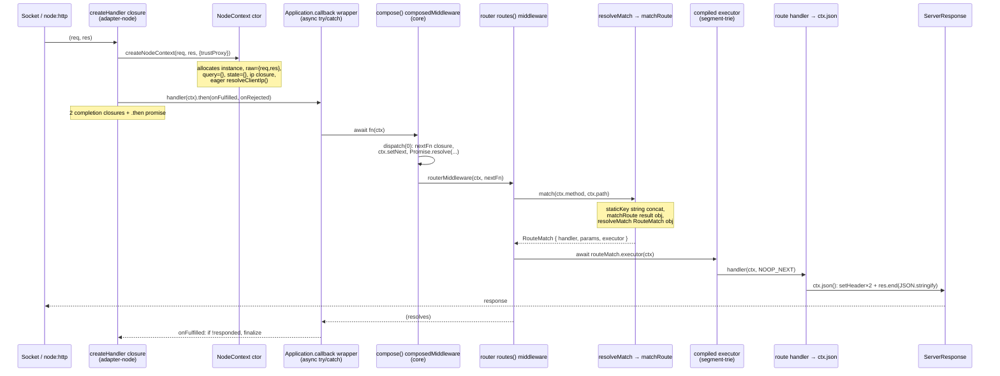

# NextRush Core — Hot-Path Performance Review

**Scope:** the request-execution pipeline only — Core (`@nextrush/core`), Router
(`@nextrush/router`), the Node adapter (`@nextrush/adapter-node`), and the runtime leaf
helpers (`@nextrush/runtime`) that run on the per-request path. Plugins, middleware
packages, DI/class runtime, other adapters, docs, tests, and tooling are out of scope
except where a middleware package sits directly on a measured benchmark path (called out
explicitly, e.g. body-parser on POST).

**Baseline commit:** branch `opt/core` @ `aadb7d8`.
**Benchmark source:** `apps/benchmark/results/latest/` (run `2026-07-17T15-56-38`).

---

## 1. Executive Summary

NextRush v3 is the **3rd-fastest** framework in the suite on Hello World (28,005 RPS),
ahead of Hono and Koa, behind Fastify — but it carries **20.1% overhead over raw Node.js**,
versus Fastify's **9.7%**. The whole of the improvement opportunity is that ~10-point gap.

The pipeline is already carefully engineered: the obvious per-request allocations most
frameworks miss are already eliminated (shared frozen empty-params, singleton empty
body-source, a cached resolved promise for the no-op `next`, executors compiled at
registration rather than per request, an O(1) static-route map, and a root-mount fast
path). This review is therefore **not** a list of beginner mistakes; it is a hunt for the
residual per-request work that separates a good framework from Fastify's tier.

The core finding is structural, not algorithmic: **every request allocates on the order of
a dozen short-lived objects and spins up ~5 promise/async frames** to move a request from
the socket to the handler, where raw Node allocates essentially none. No single one is
expensive; their sum is the overhead. The highest-leverage work is:

1. **Stop resolving `ctx.ip` eagerly** and stop allocating its lookup closure on every
   request (it is computed for 100% of requests and read by almost none). *(P1)*
2. **Remove the redundant composition layer** the app wraps around a single router
   middleware — the common case pays a full `compose` dispatch + async wrapper + closures
   just to call one function that then runs its own dispatch. *(P0/P1)*
3. **Collapse the two match-result object allocations and the per-request `staticKey`
   string** in the router into a single allocation / method-nested map. *(P2)*
4. **Kill the per-segment tuple-array allocations** in parameter matching, which is why the
   route-params gap to Fastify is wider than the hello-world gap. *(P2)*

> **Progress (2026-07-18):** items 1 and 2 (P0 + P1) have **shipped and been archived**, and P1
> was extended across all four adapters. Allocation wins are measured (P0 −47.6% B/op; adapter
> context path −85.6% / −48 B/req), but **RPS confirmation via `--profile full` is still pending**.
> Items 3 and 4 (the P2 router batch) are the **next change** to implement. Full status in §9.

**Every RPS figure below is a hypothesis, not a promise.** The baseline is a single-run
`quick` profile (the report file states it is *not publishable*; `CV 0%` only means one
run), and the harness's GC counter reads 0 for every framework — including Express — which
means it is not capturing scavenge GCs and cannot be used as evidence either way. Each
recommendation therefore ships with an A/B validation step under `--profile full`.

---

## 2. Methodology, Baseline, and Two Data-Integrity Caveats

### 2.1 Baseline numbers (wrk, 64 connections, 10s, no pipelining)

| Scenario | NextRush | Fastify | Hono | Raw Node | NextRush vs Fastify | NextRush vs Raw |
|---|---|---|---|---|---|---|
| Hello World | 28,005 | 31,627 | 27,351 | 35,035 | −11.5% | −20.1% |
| Route Params | 25,751 | 29,608 | 25,625 | 30,041 | −13.0% | −14.3% |
| POST JSON | 16,848 | 18,013 | 18,414 | 22,230 | −6.5% | −24.2% |
| Middleware Stack¹ | 22,629 | 26,580 | 21,398 | 26,181 | −14.9% | −13.6% |

¹ The middleware-stack and error scenarios are **explicitly not like-for-like** across
frameworks (per the harness README and REPORT.md methodology note — chains vs hooks vs
manual). Treat that row as directional only, never as a head-to-head.

Resource use: NextRush RSS avg **108.0 MB** vs raw Node **96.9 MB** (~11 MB higher), roughly
tied with Hono (108.0) and Fastify (106.3). CPU averages are within noise of each other
(~52%). So NextRush is **CPU-bound on framework work, not memory-starved** — consistent with
"lots of small allocations and async frames" rather than "large buffers."

### 2.2 What each scenario actually exercises

The NextRush benchmark server (`apps/benchmark/servers/nextrush-v3.js`) wires the app in a
way that matters for the trace:

```js
const app = createApp();               // @nextrush/core — NO app-owned router
const router = createRouter();
router.get('/', (ctx) => ctx.json(HELLO_WORLD));
router.get('/users/:id', (ctx) => ctx.json(userById(ctx.params.id)));
router.post('/users', json(), (ctx) => ctx.json(postUserResponse(ctx.body)));
// ...
app.setErrorHandler((_err, ctx) => { ctx.status = 500; ctx.json(ERROR_BODY); });
app.route('/', router);                // root mount → fast path
```

Consequences that shape the whole review:

- `app.route('/', router)` hits the **root-mount fast path** in `Application.route()`
  (`path === '/'`), which pushes `router.routes()` directly and **skips `createPrefixMount`
  entirely**. So `createPrefixMount` (`packages/core/src/route-mount.ts`) is **off** the
  measured hot path. It is reviewed in §7 for apps that *do* mount at a prefix, but it does
  not affect these numbers.
- The application middleware stack is therefore exactly **one entry**: `[router.routes()]`.
  This is the single most important fact for Finding **HP-6**.
- Errors use `setErrorHandler` (fires only on throw) rather than a per-request try/catch
  middleware — a deliberately fair, zero-per-request-overhead choice. The error path is
  **not** a per-request cost here.
- `json()` body-parser is attached only to the POST route, so it burdens only the POST-JSON
  scenario.

### 2.3 Caveat 1 — the GC counter is unreliable, so allocation claims rest on code, not GC

`nextrush-v3.json` reports `"gc": { "count": 0, ... }`, and so does **every** framework file
including Express. Over 280,110 Hello-World requests, with each request provably allocating
multiple short-lived objects (§3.3), the V8 scavenger must have run many times. A literal 0
across all six servers means the harness's `perf_hooks` GC observer is **not capturing minor
(scavenge) collections** in this profile. It is a measurement gap, not evidence of zero GC
pressure.

**Therefore:** every allocation finding below is justified by *counted allocations in the
code* and the RSS delta, and explicitly **not** by the GC counter. Where the benchmark and
the code disagree (GC says "no pressure," code says "lots of young-gen garbage"), the code
wins and the counter is treated as broken.

### 2.4 Caveat 2 — single-run quick profile

The baseline is `--profile quick`, 1 run per config. The file header says verbatim: *"This
profile is NOT publishable."* There is no variance data (`CV 0%` is an artifact of n=1). All
comparisons above can carry several-percent run-to-run noise. Every optimization in this
report must be validated with an A/B under `--profile full` (5 runs, mean ± stddev) on a
CPU-pinned host before it is believed — see §8.

---

## 3. System Understanding — the Traced Runtime Flow

### 3.1 Request lifecycle (socket → finish)



### 3.2 Step-by-step responsibilities and allocations

| # | Step | File | Per-request allocations / async |
|---|------|------|---------------------------------|
| 1 | Handler entry | `adapter-node/src/adapter.ts` `createHandler` | `{ trustProxy }` options object; 2 `.then` completion closures; 1 `.then` promise |
| 2 | Context creation | `adapter-node/src/context.ts` `NodeContext` ctor | instance; `raw={req,res}`; `query={}` (even with no query); `state={}`; `getClientIp` lookup closure; eager `resolveClientIp()` call |
| 3 | App callback | `core/src/application.ts` `callback()` | 1 async frame + promise (try/catch wrapper) |
| 4 | Compose dispatch | `core/src/middleware.ts` `compose` | `dispatch` closure; `nextFn` closure; `Promise.resolve(...)` wrap; `ctx.setNext` call |
| 5 | Router dispatch | `router/src/dispatch.ts` `createRoutesMiddleware` | 1 async frame + promise |
| 6 | Match | `router/src/match-route.ts` `matchRoute` + `resolveMatch` | `staticKey` string; `matchRoute` result object; `resolveMatch` `RouteMatch` object |
| 7 | Executor | `router/src/segment-trie.ts` `compileExecutor` (len=0 fast path) | 1 async frame + promise; `ctx.setNext(NOOP_NEXT)` |
| 8 | Handler + response | `adapter-node/src/context.ts` `json()` | `JSON.stringify`; 2× `res.setHeader`; `Buffer.byteLength` |

### 3.3 The cost model, quantified (Hello World)

Counting the concrete per-request allocations on the static path:

- **Objects (~11–13):** `{trustProxy}`, `NodeContext`, `{req,res}`, `query {}`, `state {}`,
  `getClientIp` closure, `matchRoute` result, `RouteMatch`, `staticKey` string, plus the two
  `.then` completion closures and the `dispatch`/`nextFn` closures.
- **Promise / async frames (~5):** the `.then` promise, the `callback` async wrapper, the
  `Promise.resolve` in compose, the router middleware async frame, and the executor async
  frame.

Raw Node's Hello World (`(req, res) => res.end(body)`) allocates ~0 of either. **That
delta is the 20.1% overhead.** Fastify narrows it by not building a Context object
(it augments `req`/`reply` with prototype methods), by compiling per-route JSON serializers,
and by a router that avoids per-request key strings. NextRush has consciously chosen a
richer Context object as a DX feature (AGENTS.md §2/§4 — "the framework owns complexity");
the goal here is to make that object cheaper, not to remove it.

### 3.4 What is already done well (credit before critique)

These are correct and should **not** be "optimized" away:

- `EMPTY_PARAMS` — shared frozen null-prototype object (`router/src/constants.ts`), reused
  for every param-less match instead of a fresh `{}`.
- `EMPTY_BODY_SOURCE` + `EMPTY_BUFFER` — singletons for bodyless requests
  (`adapter-node/src/body-source.ts`).
- `NOOP_NEXT` — a cached resolved promise, not a fresh `Promise.resolve()` per call
  (`router/src/segment-trie.ts`).
- **Executors compiled at registration**, not per request (`compileExecutor`) — the single
  biggest thing most frameworks get wrong, done right here.
- **O(1) static-route map** with an index-based tree walk (`matchNodeIndexed`) that avoids
  `split('/')`, and a `//`-regex fast-path skip in `normalizePathForMatch`.
- **Lazy `AbortController`** for `ctx.signal` — the streaming machinery allocates nothing on
  the non-streaming path.
- **Cached runtime detection** (`getRuntime()` uses `??=`).
- **Root-mount fast path** in `Application.route()`.

---

## 4. Findings — Context Creation

### HP-1 — `ctx.ip` is resolved eagerly and allocates a lookup closure on every request

- **Severity:** High (fires on 100% of requests; read by ~0% of benchmark handlers)
- **File:** `packages/adapters/node/src/context.ts` — `NodeContext` constructor + `getClientIp`
- **Evidence:**
  ```js
  // constructor:
  this.ip = this.getClientIp(req, options.trustProxy ?? false);

  // getClientIp:
  private getClientIp(req, trustProxy) {
    const directIp = req.socket.remoteAddress ?? '';
    return resolveClientIp(
      (name) => {                              // <-- fresh closure every request
        const value = req.headers[name];
        return Array.isArray(value) ? value[0] : value;
      },
      { trustProxy, directIp }                 // <-- options object every request
    );
  }
  ```
- **Why it's slow:** `ctx.ip` is computed for every request during construction, even though
  no Hello-World / route-params / POST handler reads it. Worse, a header-lookup arrow
  closure and an options object are allocated per request *regardless of `trustProxy`*. When
  `trustProxy` is false (the default and the benchmark's setting), `resolveClientIp` does
  nothing but `return directIp` (`packages/runtime/src/headers.ts`) — so the closure and the
  call are pure waste in the common case.
- **Runtime impact:** 1 closure + 1 options object + 1 function call on every request across
  **all** scenarios. Small individually, but it is unconditional overhead on the hottest
  path.
- **Proposed optimization:** Two options, both behavior-preserving:
  1. **Short-circuit the common case** (lowest risk): when `trustProxy` is false, set
     `this.ip = req.socket.remoteAddress ?? ''` directly — no closure, no `resolveClientIp`
     call. Only build the closure + call the shared policy when `trustProxy` is true.
  2. **Make `ip` a lazy getter** so the whole computation is deferred until first read.
     Keep `directIp` capture eager (a cheap string read) so the value is stable even after
     socket close. `readonly ip: string` on the interface is satisfied by a getter.
- **Expected benefit:** Removes one closure + one call from every request. Hypothesis:
  low-single-digit % on the static path; validate via A/B. Zero behavior change (`ctx.ip`
  yields the identical value), no breaking change.

### HP-2 — `ctx.query = {}` allocates a fresh empty object when there is no query string

- **Severity:** Low–Medium (every query-less request — i.e. Hello World, route-params)
- **File:** `packages/adapters/node/src/context.ts` — constructor URL-parse branch
- **Evidence:**
  ```js
  if (questionIndex !== -1) {
    this.path = this.url.slice(0, questionIndex);
    this.query = parseQueryString(this.url.slice(questionIndex + 1));
  } else {
    this.path = this.url;
    this.query = {};        // <-- fresh object per request, no query present
  }
  ```
- **Why it's slow:** A new object is allocated on every query-less request purely to give
  `ctx.query` a non-undefined value. This is the same class of waste that `EMPTY_PARAMS`
  already solves for params.
- **Runtime impact:** 1 object per query-less request (the majority of the suite).
- **Proposed optimization:** Reference a shared frozen empty object (mirroring
  `EMPTY_PARAMS`) for the no-query case. Note the semantic difference vs params: some user
  code may *assign* to `ctx.query`; a frozen shared object forbids mutation of individual
  keys. If handlers are expected to mutate `ctx.query`, keep a per-request object but
  consider a null-prototype `Object.create(null)` (marginally cheaper and safer). The frozen
  shared instance is only safe if `ctx.query` is contractually read-only.
- **Expected benefit:** Removes 1 allocation per query-less request. Sub-1% individually;
  banked with the rest. Breaking risk only if `query` mutation is a supported pattern —
  confirm the contract first.

### HP-4 — per-request `{ trustProxy }` options object in the adapter handler

- **Severity:** Low
- **File:** `packages/adapters/node/src/adapter.ts` — `createHandler` returned closure
- **Evidence:**
  ```js
  return (req, res) => {
    const ctx = createNodeContext(req, res, { trustProxy });  // <-- new object per request
    handler(ctx).then( () => {...}, (error) => {...} );        // <-- 2 closures per request
  };
  ```
- **Why it's slow:** `trustProxy` is constant for the server's lifetime, yet a new
  `{ trustProxy }` object is built for every request. Additionally the two `.then`
  completion arrows are allocated per request (they close over `ctx`/`res`/`logger`).
- **Runtime impact:** 1 options object + 2 closures + 1 promise per request.
- **Proposed optimization:** Hoist a single frozen `contextOptions = { trustProxy }` object
  into the `createHandler` closure and reuse it (the constructor only reads
  `options.trustProxy`, never mutates or retains it). The completion closures are harder to
  hoist because they capture per-request state; an `async` handler with a `try/finally` that
  finalizes inline is one alternative, but it trades the closures for an async frame — must
  be measured, not assumed (the existing `.then` form has a comment claiming it "avoids an
  extra microtask," which is a deliberate choice).
- **Expected benefit:** Removes 1 allocation per request cheaply; the options-object hoist is
  a zero-risk change. Behavior identical.

### HP-5 — `raw = { req, res }` wrapper object per request *(note, not a priority)*

- **Severity:** Low
- **File:** `packages/adapters/node/src/context.ts` — constructor
- **Evidence:** `this.raw = { req, res };`
- **Why it's slow / impact:** One extra object per request to bundle two fields that could be
  stored directly on the instance (`this._req`, `this._res`) with `raw` exposed via a getter
  that builds the pair only when accessed. Most hot handlers never touch `ctx.raw`.
- **Proposed optimization:** Store `req`/`res` as instance fields; expose `raw` lazily. This
  is a micro-optimization and only worth doing if it can be bundled into a broader Context
  refactor — on its own the churn-to-benefit ratio is poor. Recorded for completeness.

---

## 5. Findings — Dispatch & Middleware Pipeline

### HP-6 — the app wraps a full `compose` layer around a single router middleware

- **Severity:** High (structural; every request, every scenario)
- **Files:** `packages/core/src/application.ts` `callback()`; `packages/core/src/middleware.ts` `compose`
- **Evidence:** In the benchmark the app's entire middleware stack is `[router.routes()]`
  (§2.2). Yet `callback()` always routes it through `compose`, and `compose` has a fast path
  only for **zero** middleware, not one:
  ```js
  // middleware.ts — fast path exists for len===0 only:
  if (len === 0) { return function (_ctx, next) { return next ? next() : Promise.resolve(); }; }

  // len>=1 always builds the full machinery per request:
  return function composedMiddleware(ctx, next) {
    let index = -1;
    function dispatch(i) { /* ... */
      const nextFn = () => { /* double-response warn */ return dispatch(i + 1); };
      if (ctx.setNext) ctx.setNext(nextFn);
      try { return Promise.resolve(fn(ctx, nextFn)); } catch { /* ... */ }
    }
    return dispatch(0);
  };
  ```
  So a single-middleware app pays, per request: the `callback` async wrapper, a `dispatch`
  closure, a `nextFn` closure, a `Promise.resolve` wrap, and a `ctx.setNext` call — **just to
  invoke the one router middleware, which then runs its *own* dispatch loop
  (`compileExecutor`) to reach the handler.** Two independent index-based dispatch engines
  are nested for what is conceptually one hop.
- **Why it's slow:** Duplicated dispatch machinery and an extra async frame on the universal
  path. This is the single largest *structural* contributor to the flat overhead across all
  four scenarios.
- **Runtime impact:** ~2 closures + 1 promise-wrap + 1 async frame on every request that
  most apps (router-only, or router + a couple of `app.use`) never needed.
- **Proposed optimization (two complementary levers):**
  1. **`len===1` fast path in `compose`:** return a thin wrapper that calls the single
     middleware directly with a cached tail-`next`, skipping the `dispatch`/`nextFn`
     construction. Trade-off: the single layer loses the "next() called multiple times"
     guard — acceptable for one terminal middleware, but must be covered by a test asserting
     the observable behavior is unchanged.
  2. **Direct-invoke in `callback()`:** when `middlewareStack.length === 1`, invoke that
     middleware inside the existing try/catch instead of calling `compose` at all. Lower risk
     than editing `compose`, and it targets exactly the common shape.
  Longer term, evaluate whether the router's `routes()` can expose a "match + run executor"
  entry the app can call without a second dispatch wrapper when there is no app-level
  middleware (unifying the two dispatch engines — larger, RFC-gated).
- **Expected benefit:** This is the most promising single lever because it fires on 100% of
  requests in the dominant app shape. Hypothesis: mid-single-digit % on Hello World; **must**
  be A/B measured. No public API change; behavior preserved modulo the documented
  double-next edge case.

### HP-7 — `ctx.next()` adds an async frame + promise on top of the dispatch `next` closure

- **Severity:** Medium (middleware-heavy paths; the middleware-stack scenario)
- **File:** `packages/adapters/node/src/context.ts` — `next()`
- **Evidence:**
  ```js
  async next() {
    if (this._next) {
      await this._next();
    }
  }
  ```
- **Why it's slow:** The modern `ctx.next()` style (used by the 5-layer middleware scenario)
  routes through this `async` method, which allocates its own promise and async state machine
  on **every** layer — *in addition to* the `next` closure the dispatch engine already
  created and wired via `setNext`. So each `return ctx.next()` is two frames deep where one
  would do.
- **Runtime impact:** 1 extra promise/async frame per middleware layer that uses
  `ctx.next()`. In the 5-layer scenario that is 5 extra frames per request.
- **Proposed optimization:** Drop the `async`/`await` and forward the stored thunk directly:
  ```js
  next() { return this._next ? this._next() : Promise.resolve(); }
  ```
  `this._next` is already the dispatch `nextFn`, which returns a promise; returning it
  directly preserves ordering and error propagation without the extra frame. (Consider a
  shared cached resolved promise for the `null` branch, mirroring `NOOP_NEXT`.)
- **Expected benefit:** Removes one async frame per `ctx.next()` call. Concentrated in
  middleware-heavy apps; the benchmark's middleware row is not like-for-like, so validate on
  a controlled internal micro-bench as well as `--profile full`. Behavior-preserving.

---

## 6. Findings — Router & Route Matching

> **Status (2026-07):** HP-9, HP-10, HP-11, HP-12, and HP-13 in this section were all
> implemented by the OpenSpec change `router-match-path-allocation-trim` (commits `8338116`
> → `0c80e87` on `opt/core`): method-nested static map (HP-9), single-allocation `RouteMatch`
> (HP-10), unicode-correct normalize fast-path + no second pass (HP-12), and an iterative,
> deferred-materialize, null-prototype param walk (HP-11 + HP-13) that also closes the latent
> stack-overflow DoS and the `__proto__`-param mis-bind. Behavior is byte-identical (66-probe
> differential golden + 15 safety scenarios; `bench:validate` parity green). The transient-
> allocation reductions are verified structurally + by deterministic spies (per Caveat 1, §2.3 —
> the GC counter is unreliable); the Route-Params RPS A/B is deferred to CPU-pinned hardware.

### HP-9 — a `staticKey` string is concatenated on every request for the static-map probe

- **Severity:** Medium (every request that hits a static route — Hello World, /json, etc.)
- **File:** `packages/router/src/match-route.ts` — `matchRoute`
- **Evidence:**
  ```js
  const staticKey =
    normalized.length > 1 && normalized.endsWith('/')
      ? `${method} ${normalized.slice(0, -1)}`
      : `${method} ${normalized}`;
  const staticEntry = staticRoutes.get(staticKey);   // Map<string, HandlerEntry>
  ```
- **Why it's slow:** Every static lookup allocates a new key string (`"GET /"`) purely to
  probe a `Map`. String concatenation + hashing per request is exactly what find-my-way and
  Fastify avoid by keying on **method first, then path** with nested maps.
- **Runtime impact:** 1 string allocation + 1 concat + full-key hash per request.
- **Proposed optimization:** Replace `Map<"METHOD path", entry>` with
  `Map<method, Map<path, entry>>` (or a per-method object of maps). The path segment is then
  used as-is (no concatenation), and the method selects the inner map. Registration changes
  correspondingly. Internal-only structure; the public router API is unaffected.
- **Expected benefit:** Removes a per-request string allocation and replaces a longer-key
  hash with a short-key hash. Hypothesis: low-single-digit % on static routes. Breaking:
  none (internal storage).

### HP-10 — two result objects are allocated for every match (`matchRoute` + `resolveMatch`)

- **Severity:** Medium (every matched request)
- **File:** `packages/router/src/match-route.ts` — `matchRoute` returns one object,
  `resolveMatch` wraps it in another
- **Evidence:**
  ```js
  // matchRoute (static hit):
  return { handler: staticEntry.handler, params: EMPTY_PARAMS, executor: staticEntry.executor };
  // ...
  // resolveMatch, immediately after:
  return { handler: result.handler, params: result.params,
           middleware: state.routerMiddleware, executor: result.executor };
  ```
  `RouteMatch` (`packages/types/src/router.ts`) is `{ handler, params, middleware, executor }`.
- **Why it's slow:** For every match, `matchRoute` builds a `RouteMatchResult` and
  `resolveMatch` builds a second, nearly identical `RouteMatch` — two short-lived objects per
  request where one would do. The only field `resolveMatch` adds is `middleware`, a stable
  reference known at router construction.
- **Runtime impact:** 2 object allocations per matched request (all four scenarios match).
- **Proposed optimization:** Collapse to a single allocation — have `matchRoute` produce the
  final `RouteMatch` shape directly (accepting `routerMiddleware` as a parameter, or letting
  `resolveMatch` attach `middleware` by mutating the object `matchRoute` returned rather than
  spreading into a new one). A reused per-router scratch object is **not** safe here because
  matching is re-entrant across `await` boundaries; stick to one allocation per request.
- **Expected benefit:** Halves match-result allocations. Low-single-digit %. Breaking: none
  (both types are internal; `RouteMatch` is the stable shape and is preserved).

### HP-11 — `extractSegment` allocates a 2-tuple array per segment (and twice when case-insensitive)

- **Severity:** Medium (parameter/wildcard routes — the route-params scenario)
- **File:** `packages/router/src/matching.ts` — `extractSegment`, called by `matchNodeIndexed`
- **Evidence:**
  ```js
  export function extractSegment(path, start) {
    const slashPos = path.indexOf('/', start);
    if (slashPos === -1) return [path.slice(start), path.length];      // array + slice
    return [path.slice(start, slashPos), slashPos + 1];                // array + slice
  }
  // matchNodeIndexed:
  const [segment, nextPos] = extractSegment(path, pos);
  // ... in the param branch, when originalPath is set (caseSensitive:false):
  const [origSeg] = extractSegment(originalPath, pos);                  // SECOND extract
  ```
- **Why it's slow:** Each segment of a param path allocates a fresh 2-element array (the
  tuple return) plus the sliced substring, and the caller immediately destructures and
  discards the array. For `/users/:id` that is 2 segments → 2 tuple arrays; with the default
  `caseSensitive: false`, the param branch extracts the original-case segment **again** → a
  third array + slice. This per-segment array churn is why the **route-params gap to Fastify
  (−13.0%) is wider than the Hello-World gap (−11.5%)** — Fastify's matcher does not allocate
  per segment.
- **Runtime impact:** ~N tuple arrays + N slices per param request (N = segment count),
  up to ~1.5×N with case-insensitive default.
- **Proposed optimization:** Eliminate the tuple. Options: (a) scan segments with a small
  mutable cursor/state object reused across the walk; (b) return the segment string and
  advance `pos` via an out-parameter or by returning the next index as a number the caller
  tracks, avoiding the array entirely; (c) since the value slice is unavoidable when a param
  actually binds, defer the slice until a param node is matched rather than slicing every
  segment probed. Combine with HP-12 to avoid the second extraction.
- **Expected benefit:** Directly targets the route-params weakness. Hypothesis: mid-single-digit
  % on param routes. Breaking: none (internal matcher).

### HP-12 — default `caseSensitive: false` forces `toLowerCase()` + a second normalize pass per param request

- **Severity:** Low–Medium (every request; compounded for param routes)
- **Files:** `packages/router/src/state.ts` (default); `packages/router/src/matching.ts`
  (`normalizePathForMatch`); `packages/router/src/match-route.ts` (second pass)
- **Evidence:**
  ```js
  // state.ts — default:
  caseSensitive: options.caseSensitive ?? false,
  // matching.ts:
  let normalized = caseSensitive ? path : path.toLowerCase();   // allocation when default
  // match-route.ts — param routes, case-insensitive:
  const originalPath = caseSensitive ? undefined : normalizePathForMatch(path, true, strict);
  ```
- **Why it's slow:** With the shipped default, every request lowercases its path (a string
  allocation), and every **param** request runs `normalizePathForMatch` a *second* time to
  recover the original-case path for param-value extraction.
- **Runtime impact:** 1 `toLowerCase` allocation per request; a second full normalize pass
  per param request.
- **Proposed optimization:** (a) Fast-path `toLowerCase`: scan for any uppercase byte first
  and skip the allocation when the path is already lowercase (the common case for
  lower-cased URLs). (b) Avoid the second normalize by extracting the original-case segment
  lazily from the raw path only when a param node actually binds (ties into HP-11). Changing
  the *default* to `caseSensitive: true` would remove the work outright but is a **breaking
  behavior change** — defer to an RFC; do not flip silently.
- **Expected benefit:** Removes one allocation on lowercase paths and one normalize pass on
  param routes. Low-single-digit %. Breaking: none for the fast-path options; the default
  flip is breaking and out of scope for a patch.

### HP-13 — post-match `Object.keys(params)` loop the code itself documents as "buys nothing"

- **Severity:** Low (param routes)
- **File:** `packages/router/src/match-route.ts` — `matchRoute` tail
- **Evidence:**
  ```js
  let hasParams = false;
  for (const key of Object.keys(params)) {           // allocates a keys array per match
    if (params[key] === undefined) {
      Reflect.deleteProperty(params, key);           // "cannot occur today" per the comment
    } else {
      hasParams = true;
    }
  }
  ```
  The inline comment concedes: *"an undefined-valued key cannot occur today ... removing the
  loop buys nothing (Object.keys still runs to decide hasParams) ... hot-path rewrites are
  deferred to the radix RFC's benchmark."*
- **Why it's slow:** `Object.keys(params)` allocates an array per param match solely to
  compute a boolean (`hasParams`) and run a defensive delete that is currently unreachable.
- **Runtime impact:** 1 array allocation + a full key iteration per param match.
- **Proposed optimization:** Track whether any param bound *during the walk* — `matchNodeIndexed`
  is the only writer of `params`, so it can return a `boundParamCount` (or the caller can
  flip a flag when it assigns), letting `matchRoute` choose `EMPTY_PARAMS` vs `params` with
  **no** `Object.keys` call and no defensive loop. The unreachable delete can go under test
  coverage.
- **Expected benefit:** Removes an allocation + iteration per param match. Low but free once
  HP-11 restructures the walk. Breaking: none.

---

## 7. Findings — Response, Body, and Cleanup

### HP-14 — `ctx.json` issues two separate `setHeader` calls

- **Severity:** Low (every JSON response — i.e. almost every scenario)
- **File:** `packages/adapters/node/src/context.ts` — `json()`
- **Evidence:**
  ```js
  res.statusCode = this.status;
  res.setHeader('Content-Type', 'application/json; charset=utf-8');
  res.setHeader('Content-Length', Buffer.byteLength(json));
  ```
- **Why it's slow:** Two calls into Node's header machinery per response, plus a
  `Buffer.byteLength` scan of the serialized string. Setting both headers in one
  `res.writeHead(status, { ... })` call touches the outgoing-header map once.
- **Runtime impact:** 1 extra `setHeader` call per JSON response.
- **Proposed optimization:** Use a single `res.writeHead(this.status, headers)` for the
  common non-suppressed case. Measure carefully: `writeHead` vs `setHeader` performance is
  Node-version-dependent, and `writeHead` bypasses some setter paths — validate byte-identical
  output against the parity harness before adopting.
- **Expected benefit:** Small; validate. Breaking: none.

### HP-15 — `ctx.set` calls `field.toLowerCase()` on every header set

- **Severity:** Low (header-heavy paths — the middleware scenario sets 5)
- **File:** `packages/adapters/node/src/context.ts` — `set()`
- **Evidence:**
  ```js
  if (!Array.isArray(value) && field.toLowerCase() === 'set-cookie') { /* cookie path */ }
  ```
- **Why it's slow:** Every `ctx.set(name, value)` lowercases the field name to detect
  `set-cookie`, allocating a string even for the 99% of headers that are not cookies. The
  5-layer middleware scenario does this 5× per request.
- **Runtime impact:** 1 string allocation per `ctx.set` call.
- **Proposed optimization:** Cheap pre-check before lowercasing — e.g. compare
  `field.length === 10` and the first char in `{'s','S'}` before falling back to a full
  `toLowerCase()` comparison; or compare via `charCodeAt`. `assertHeaderSafe` (the CRLF
  guard) should **stay** — it is a security control (`project-rules` §3/§4), not overhead to
  remove — but it need not run through a lowercased copy.
- **Expected benefit:** Removes an allocation per header set; concentrated in middleware-heavy
  responses. Breaking: none (behavior identical for real `set-cookie`).

### HP-16 — `NodeBodySource.buffer()` uses `for await…of` async iteration *(partial scope)*

- **Severity:** Medium for POST, **but mostly outside the audited core** — see caveat
- **File:** `packages/adapters/node/src/body-source.ts` — `buffer()`
- **Evidence:**
  ```js
  for await (const rawChunk of this.req) {      // async iterator + a promise per chunk
    const chunk = chunkToBuffer(rawChunk);
    totalLength += chunk.length;
    if (totalLength > this.options.limit) { this.req.destroy(); throw new BodyTooLargeError(...); }
    chunks.push(chunk);
  }
  const buffer = Buffer.concat(chunks);
  ```
- **Why it's slow:** `for await…of` over an `IncomingMessage` allocates an async iterator and
  resolves a promise per chunk, which is measurably heavier than the classic
  `req.on('data', ...)` / `req.on('end', ...)` accumulation used by fast body readers. This is
  a plausible contributor to **POST JSON being NextRush's weakest relative scenario**
  (16,848 RPS — behind Hono's 18,414 and Fastify's 18,013).
- **Caveat (scope honesty):** The dominant cost of the POST scenario is `JSON.parse` plus the
  `json()` middleware, both in **`@nextrush/body-parser`, which is out of scope**. This
  finding is strictly the **core-adapter stream-read** contribution. Do not attribute the
  whole POST gap to it; it is one input among several, and the parse itself is not ours to
  change here.
- **Runtime impact:** async-iterator + per-chunk promise overhead on every body read.
- **Proposed optimization:** Offer an event-listener-based fast path (`req.on('data')` into a
  chunk array, resolve on `end`, reject on `error`, enforce the size limit inline) for the
  common buffered read, keeping the async-iterator path for the streaming API. Preserve the
  size-limit and `BodyTooLargeError`/`BodyConsumedError` semantics exactly.
- **Expected benefit:** Targets POST latency specifically; validate against POST-JSON under
  `--profile full`. Breaking: none (observable behavior and errors preserved).

### HP-17 / HP-18 — cleanup, not hot-path (P4)

- **`findNode` duplication** (`matching.ts`): the recursive `findNode` is used only by
  `findAllowedMethods` (405/OPTIONS), i.e. **not** the primary match path. It duplicates
  traversal logic with `matchNodeIndexed`. No runtime impact on the measured scenarios;
  consolidation is a maintainability/clarity gain only.
- **Defensive dead branches** (`matchNodeIndexed`'s `Reflect.deleteProperty` on backtrack and
  the HP-13 `Object.keys` guard): self-documented as currently unreachable. Removing them
  under test coverage trims hot-path work; keep them until HP-11/HP-13 land with tests so the
  removal is provably safe.

### Note — `createPrefixMount` is off the benchmark path but relevant for mounted apps

`packages/core/src/route-mount.ts` is **not** exercised by the benchmark (root mount uses the
`path === '/'` fast path). For apps that mount at a prefix (`app.route('/api', router)`),
each request through the mount does a `startsWith` check, a `charCodeAt` boundary check, two
`ctx.state` symbol writes, an `adjustedPath` slice, and wraps the downstream in a `try`/
`finally` with an extra `next` closure that re-rewrites `ctx.path` around the boundary. That
is reasonable and allocation-light, but the two `ctx.state[symbol]` writes + the wrapper
closure are per-request costs those apps pay. Not a benchmark finding; flagged so it is not
mistaken for free.

---

## 8. Correlation Matrix — Finding ↔ Benchmark ↔ Code

| Finding | Primary scenario(s) affected | Benchmark signal | Code evidence | Confidence |
|---|---|---|---|---|
| HP-1 ip eager+closure | All | Flat overhead across all rows | `context.ts` ctor / `getClientIp` | High (code); RPS unmeasured |
| HP-6 redundant compose layer | All | Flat overhead; Hello −11.5% vs Fastify | `application.ts` `callback`, `middleware.ts` | High (code); highest-leverage hypothesis |
| HP-7 `ctx.next()` async | Middleware stack | −14.9% row (not like-for-like) | `context.ts` `next()` | Med (row is directional only) |
| HP-9 staticKey concat | Static (Hello, /json) | Hello −11.5% vs Fastify | `match-route.ts` `matchRoute` | High (code) |
| HP-10 two match objects | All matched | Flat overhead | `match-route.ts` + `RouteMatch` type | High (code) |
| HP-11 extractSegment tuples | Route params | **Route-params gap (−13.0%) > Hello (−11.5%)** | `matching.ts` `extractSegment` | High — benchmark *and* code agree |
| HP-12 toLowerCase + 2× normalize | All; params×2 | Route-params widening | `state.ts`, `matching.ts`, `match-route.ts` | High (code) |
| HP-13 Object.keys loop | Route params | Route-params widening | `match-route.ts` (self-documented) | High (code) |
| HP-16 body `for await` | POST JSON | **POST JSON weakest: behind Hono & Fastify** | `body-source.ts` `buffer()` | Med — shares blame with body-parser (out of scope) |
| HP-2/4/5/14/15 micro-allocs | Various | Cumulative flat overhead | cited per finding | High (code); individually sub-1% |

**Reconciliation of disagreements:**
- *GC counter (0) vs code (many young-gen allocations):* the counter is not capturing
  scavenges (§2.3) — code evidence wins; allocation findings stand on counted objects + the
  ~11 MB RSS delta.
- *Middleware-stack row vs code:* the −14.9% row is **not like-for-like** and cannot confirm
  or refute HP-7 on its own; that finding is validated by code plus a controlled micro-bench,
  not by this row.
- *Where benchmark and code AGREE and reinforce each other:* HP-11/HP-12/HP-13 (route-params
  gap wider than hello-world ⇢ param-matching allocations) and HP-16 (POST is the weakest
  relative scenario ⇢ body-read + parse cost). These are the highest-confidence findings.

---

## 9. Prioritized Optimization Roadmap

Estimates are **hypotheses** pending `--profile full` A/B (§2.4). "RPS est." is the plausible
directional gain on the *affected* scenario, not the whole suite; they are deliberately given
as ranges, not false-precise numbers. The **Status** column tracks implementation as of
2026-07-18.

### Progress snapshot (2026-07-18)

- ✅ **P0 — HP-6** shipped as `core-single-middleware-fastpath` (archived). Allocation gate met
  (−47.6% B/op on the compose path, CV <0.1%); RPS confirmation via a CPU-pinned `--profile full`
  A/B still **pending**.
- ✅ **P1 — HP-1 / HP-4 / HP-7** shipped as `node-adapter-per-request-work-trim` (archived), then
  extended to Bun/Deno/Edge as `web-adapters-per-request-work-trim` (archived). HP-4 applies to
  **Node only** — the siblings pass `trustProxy` positionally, so there is no options object to
  hoist. Allocation gates met; RPS A/B **pending** (and out of the `wrk` harness's reach for the
  non-Node adapters).
- ⬜ **P2 router batch — HP-11 / HP-9 / HP-10 (+ HP-13 / HP-12 folded in)** is the **next change**
  (`router-match-path-allocation-trim`). **HP-16** (POST body-read) is tracked **independently**.
- ⬜ **P3 remainder (HP-2 / HP-14 / HP-15)** and **P4 cleanup (HP-17 / HP-18 / HP-5)** pending.
- ⏳ **Cross-cutting open item:** the CPU-pinned `--profile full` A/B that turns the shipped P0/P1
  allocation wins into publishable RPS numbers has **not** been run on a clean environment yet.

### P0 — Critical RPS improvements (structural, universal path)

| ID | Change | RPS est. (affected) | Complexity | Risk | Breaking | Status |
|----|--------|---------------------|------------|------|----------|--------|
| HP-6 | Single-middleware fast path (compose `len===1` and/or direct-invoke in `callback`) | mid single-digit % (all) | Medium | Medium (double-next edge case; cover with tests) | No | ✅ **Shipped** — `core-single-middleware-fastpath` (archived); −47.6% B/op, RPS A/B pending |

Rationale for P0: it is the only change that fires on 100% of requests in the dominant app
shape *and* removes an entire async frame plus closures, not just one allocation.

### P1 — Remove unnecessary per-request work

| ID | Change | RPS est. (affected) | Complexity | Risk | Breaking | Status |
|----|--------|---------------------|------------|------|----------|--------|
| HP-1 | Short-circuit / lazily resolve `ctx.ip`; drop the per-request lookup closure | low single-digit % (all) | Low | Low | No | ✅ **Shipped** — Node + Bun/Deno/Edge (archived) |
| HP-7 | Non-async `ctx.next()` forwarding the stored thunk | low–mid single-digit % (mw paths) | Low | Low | No | ✅ **Shipped** — all four adapters (archived) |
| HP-4 | Hoist the constant `{ trustProxy }` options object | <1% (all) | Trivial | Very low | No | ✅ **Shipped** — Node only; N/A on siblings (positional `trustProxy`) |

### P2 — Router optimizations

| ID | Change | RPS est. (affected) | Complexity | Risk | Breaking | Status |
|----|--------|---------------------|------------|------|----------|--------|
| HP-11 | Remove per-segment tuple arrays; single extraction path | mid single-digit % (params) | Medium | Low | No | ⬜ **Next** — `router-match-path-allocation-trim` |
| HP-9 | Method-nested static map (drop per-request `staticKey` concat) | low single-digit % (static) | Medium | Low | No | ⬜ **Next** — same change |
| HP-10 | Collapse the two match-result objects into one allocation | low single-digit % (all matched) | Low–Medium | Low | No | ⬜ **Next** — same change |
| HP-16 | Event-listener buffered body-read fast path | POST-focused; validate | Medium | Medium (preserve limits/errors) | No | ⬜ Pending — tracked independently (POST body-read) |

### P3 — Memory-allocation reductions (small, bankable)

| ID | Change | RPS est. | Complexity | Risk | Breaking | Status |
|----|--------|----------|------------|------|----------|--------|
| HP-12 | `toLowerCase` fast-path skip; avoid second normalize on param routes | low % | Low–Medium | Low | No (default flip is separate/breaking) | ⬜ **Next** — folded into `router-match-path-allocation-trim` |
| HP-13 | Drop `Object.keys` post-match loop via a walk-time param flag | low % (params) | Low | Low | No | ⬜ **Next** — folded into the router pass |
| HP-2 | Shared empty `query` object (if `query` is read-only by contract) | <1% | Trivial | Low (contract-dependent) | Confirm first | ⬜ Pending |
| HP-14 | Single `writeHead` in `ctx.json` | <1% | Low | Low (Node-version sensitive) | No | ⬜ Pending |
| HP-15 | Cheap `set-cookie` pre-check before `toLowerCase` in `ctx.set` | <1% (mw) | Low | Low | No | ⬜ Pending |

### P4 — Code cleanup (maintainability; negligible direct RPS)

| ID | Change | Complexity | Risk | Breaking | Status |
|----|--------|------------|------|----------|--------|
| HP-17 | Consolidate `findNode` traversal with `matchNodeIndexed` | Low | Low | No | ⬜ Pending |
| HP-18 | Remove provably-unreachable defensive branches under test coverage | Low | Low | No | ⬜ Pending |
| HP-5 | Lazy `ctx.raw` (only if bundled into a Context refactor) | Medium | Low | No | ⬜ Pending |

### Sequencing recommendation

**Done:** HP-4/HP-1/HP-7 (P1) landed first, then HP-6 (P0) — all shipped and archived, extended
cross-adapter. **Next:** the router batch **HP-11 → HP-9 → HP-10 → HP-13 → HP-12** as one cohesive
router pass (`router-match-path-allocation-trim`), landed as ordered, individually-benchmarked
commits. Treat **HP-16** independently against the POST scenario. Do cleanup (P4) alongside the
router pass so the defensive branches are removed only once their replacements have tests.

---

## 10. Validation Plan (the closed-loop verifier)

Because the baseline profile is not publishable and the GC counter is unreliable, **no
finding is "done" until measured independently.** For each change:

1. **Micro-evidence:** add an allocation/timing micro-benchmark (or a targeted V8
   `--prof` / heap-snapshot delta) proving the specific allocation or frame is gone. This is
   the objective, per-change done-condition — not "looks faster."
2. **Scenario A/B:** run `pnpm bench:compare --profile full` (5 runs, mean ± stddev, CV) on a
   **CPU-pinned** host, before vs after, on the specific affected scenario(s) from the
   correlation matrix (§8) — not just Hello World.
3. **Parity gate:** run `pnpm bench:validate` to confirm response bodies + Content-Type stay
   byte-identical (mandatory before any `writeHead`/header change, HP-14 especially).
4. **Correctness gate:** the package test suites (`@nextrush/core`, `@nextrush/router`,
   `@nextrush/adapter-node`) stay green; add a regression test for each behavior-adjacent
   change (double-next for HP-6, `ctx.ip` value for HP-1, param values for HP-11/HP-12, body
   limits/errors for HP-16). This follows the repo's "correctness → tests → benchmark →
   optimize" order (`tdd-workflow.md`).
5. **Accept only measured wins:** a change that does not move `--profile full` numbers beyond
   stddev is reverted or parked, regardless of how clean the code looks — the point is RPS,
   not aesthetics.

A change that fails the parity or correctness gate is rejected outright, no matter its RPS
gain.

---

## 11. Conclusion

NextRush's request pipeline is well-built and already avoids the allocation traps that sink
Express and Koa; it is genuinely in Fastify/Hono's tier. The remaining ~10-point gap to
Fastify is not one bug but the **accumulated cost of a richer-than-raw request model**: a
Context object, two nested dispatch engines, and a handful of small per-request allocations
and async frames that each look harmless in isolation.

The best returns come from **removing whole layers and frames** (HP-6, HP-1, HP-7) rather
than shaving individual bytes, and from a focused **router allocation pass** (HP-9–HP-13)
that the route-params benchmark independently points at. The POST-JSON weakness is real but
is shared with the out-of-scope body-parser; the in-scope lever there (HP-16) is worth
testing but should not be oversold.

Above all: the baseline is a single-run, non-publishable profile with a broken GC counter, so
this report deliberately frames every number as a hypothesis and pairs every recommendation
with an A/B step. Optimize proven bottlenecks — measure first, keep only what the full
profile confirms.
