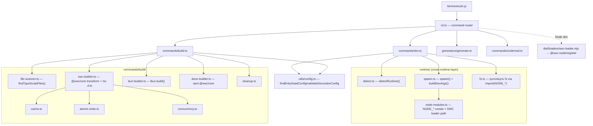

# Dev Tooling — @nextrush/dev Toolchain Review

| Field           | Value                                                              |
| --------------- | ------------------------------------------------------------------ |
| **Report type** | `Architecture` (Developer Tooling / Build Systems)                 |
| **Scope**       | `@nextrush/dev` — CLI, dev server, SWC build pipeline, watch/restart, generators, codemods, cross-runtime layer |
| **Date**        | 2026-07-20                                                         |
| **Reviewer(s)** | Developer Tooling / Build Systems review                           |
| **Commit / ref**| `ef95e3f` (branch `feat/dev`)                                     |
| **Status**      | Draft                                                             |
| **Related**     | `packages/dev/ARCHITECTURE.md`, `packages/dev/README.md`, `docs/adr/ADR-0005` |

---

## Progress Tracker

**Remediation:** `[░░░░░░░░░░░░░░░░░░░░]` 0% — 0 / 16 recommendations resolved

| Rec | Addresses | Priority | Status  |
| --- | --------- | -------- | ------- |
| 1   | F-01      | P1       | ⬜ Open  |
| 2   | F-02      | P1       | ⬜ Open  |
| 3   | F-03      | P1       | ⬜ Open  |
| 4   | F-04      | P2       | ⬜ Open  |
| 5   | F-05      | P2       | ⬜ Open  |
| 6   | F-06      | P2       | ⬜ Open  |
| 7   | F-07      | P2       | ⬜ Open  |
| 8   | F-08      | P2       | ⬜ Open  |
| 9   | F-09      | P2       | ⬜ Open  |
| 10  | F-10      | P2       | ⬜ Open  |
| 11  | F-11      | P2       | ⬜ Open  |
| 12  | F-12      | P2       | ⬜ Open  |
| 13  | F-13      | P3       | ⬜ Open  |
| 14  | F-14      | P3       | ⬜ Open  |
| 15  | F-15      | P3       | ⬜ Open  |
| 16  | F-16      | P3       | ⬜ Open  |

---

## 1. Executive Summary

`@nextrush/dev` is a genuinely thoughtful multi-runtime toolchain. Its core thesis — "fast bundlers strip decorator metadata and break DI, so use SWC everywhere" — is correct and well executed on the Node path, and several details show real engineering care: the Deno permission model (validate → extend-only → fail-fast), the destructive-clean guards, atomic temp-file+rename writes, workspace-boundary build scoping, and a real spawned-CLI integration test for loader-path resolution. The primary developer journey (create → `nextrush dev` → edit → auto-restart → `nextrush build`) works on the Node path across Linux, macOS, and Windows on current Node.

**No P0 was found.** Notably, an early hypothesis — that `node --watch-path` breaks `nextrush dev` on Linux (Node's own current docs mark the flag macOS/Windows-only) — was **empirically disproven** on this Linux host (Node v26.4.0): it works; the Node docs are stale. This is recorded as F-05 at a much lower severity (a portability/robustness risk, not a breakage).

The real problems are correctness-and-confidence issues that the test suite structurally cannot see. The suite is green (208 tests) yet line coverage is **39.79%**, with **0%** on exactly the files that carry the defects below.

**Top findings:**
1. **F-01 (P1)** — The **Deno production build is broken**: it passes `TypeScriptFile` objects to `node:path` string APIs (`node:path.relative` throws on a non-string), so `nextrush build` under Deno fails on the first file and its native fallback repeats the same bug — while README/ARCHITECTURE advertise Deno build as "✅ Stable". `tsc` never caught it because `import(NODE_PATH)` (variable specifier) types the module as `any` (F-06).
2. **F-02 (P1)** — The **incremental build cache is dead by default**: the cache is written inside `<outDir>/.nextrush/`, but `--clean` (default `true`) wipes `<outDir>` at the start of every build, so the cache never survives. Every rebuild is a full rebuild unless `--no-clean` is passed.
3. **F-03 (P1)** — **`.d.ts` emission is gated on the wrong flag**: `--no-decorator-metadata` silently disables declaration generation regardless of `--dts`.
4. **F-07 (P2)** — **Verification gap**: 39.79% line coverage (project rule is 90%), with the dev-server, SWC-builder, Deno-builder, and Bun-builder at 0%. The one `dev` integration test asserts a banner printed *before* the child is spawned and the absence of one specific error string — never an HTTP liveness probe — so a dev server whose child crashed still passes green.
5. **F-14 (P3)** — **`ARCHITECTURE.md` materially contradicts the code** (documents `tsx` + `--experimental-strip-types` and Deno `--allow-all`, none of which the code uses), which will actively mislead contributors.

Headline recommendation: treat the 40%/0%-coverage command layer as the root cause — the shipped correctness bugs (F-01, F-02, F-03) all live in untested code — then close the type-safety hole (F-06) that let a runtime type error compile clean.

---

## 2. System Understanding

`@nextrush/dev` is the single package a NextRush developer interacts with for the whole local lifecycle: scaffolding (`generate`), running (`dev`), building (`build`), and migrating (`codemod`). It ships two bins (`nextrush`, `nextrush-dev`) and is pure ESM, Node `>=22`.

Its reason to exist is specific and sound. TypeScript DI (`@nextrush/di` → tsyringe) needs `emitDecoratorMetadata` — the `Reflect.defineMetadata("design:paramtypes", …)` calls that let the container resolve constructor types at runtime. The fast tools most developers reach for (esbuild, tsup, `tsx`, `node --strip-types`) strip types without emitting that metadata, so DI silently fails at runtime. SWC is the one fast compiler that emits it. The package therefore standardizes on SWC (`@swc-node/register` for dev, `@swc/core` for build) and wraps the runtime differences (Node/Bun/Deno) behind a thin abstraction.

The design intent is "zero-config, convention over configuration": auto-detect the entry file, auto-detect the runtime from the project's adapter dependency, read the user's `tsconfig.json` natively through SWC, and lean on each runtime's *native* watcher (`node --watch`, `bun --watch`, `deno run --watch`) for restart rather than shipping a bespoke file watcher. That is a defensible, low-surface choice: it means the tool does not own debounce, ignore-globs, or recursive-watch logic — it delegates to the runtime. The cost of that choice (no ignore config, no debounce control) is discussed in F-05.

The cross-runtime layer solves a concrete portability problem well: it references Node built-ins through `const NODE_FS = 'node:fs'` variables and `import(NODE_FS)` so the bundler (esbuild/tsup) cannot rewrite or strip the `node:` prefix (Deno requires it). That same trick, however, is the source of a type-safety hole (F-06).

---

## 3. Architecture Overview



Layering is clean and matches the package-graph philosophy: `runtime/` is the platform-isolation layer, `commands/` is orchestration, `build/` is the compilation pipeline, `generators/` and `codemods/` are independent leaf features. File sizes are within the repo's 300-line ceiling; the `build/` folder was correctly split into focused modules. There are no god files here.

---

## 4. Data Flow

```mermaid
sequenceDiagram
  participant Dev as Developer
  participant CLI as nextrush (parent)
  participant Node as node --watch (child)
  participant App as app (grandchild)

  Dev->>CLI: nextrush dev
  CLI->>CLI: initFsSync(); findEntry(); detectProjectRuntime()
  CLI->>CLI: banner("Dev Server")  %% printed BEFORE spawn (see F-07)
  CLI->>CLI: buildDevArgs('node', entry, watchPaths)
  CLI->>Node: spawn(node --import swc-loader --watch-path=src entry)
  Node->>App: run entry (SWC transpiles on import)
  Note over Node,App: file change → Node restarts App
  Dev->>CLI: Ctrl-C (SIGINT)
  CLI->>Node: child.kill('SIGTERM')
  CLI->>CLI: process.exit(0)  %% does NOT await child exit (F-04)
```

The `build` flow is: `initFsSync` → resolve options → decorator-config preflight (throws on mismatch) → optional `clean` → `findTypeScriptFiles` (walk to package boundary) → per-file SWC transform with bounded concurrency → atomic writes → save cache → `tsc --emitDeclarationOnly` for `.d.ts`.

---

## 5. Project Bootstrap & Configuration

Scaffolding lives in `create-nextrush` (out of scope); this package owns `generate` and config discovery. Entry detection (`findEntry`) is sensible: `package.json` `main`/`module` (mapping `dist/*.js` → `src/*.ts`), then a candidate list, then `src/index.ts`. `loadConfig` reads `nextrush.config.ts` (dynamic import) or a `package.json` `nextrush` field; both failure paths swallow errors and fall back to `{}` — acceptable for optional config, though a malformed `nextrush.config.ts` fails **silently** with no diagnostic (minor DX gap; the developer's config is simply ignored with no warning).

`validateDecoratorConfig` is a strong DX touch: it parses `tsconfig.json` (comment-stripped), and if exactly one of `experimentalDecorators`/`emitDecoratorMetadata` is set it emits actionable remediation. `dev` warns-and-continues; `build` throws (fail-fast). This is the right split.

`generate` validates names against `^[a-z][a-z0-9-]*$`, refuses to overwrite, and the adapter scaffold (`generate adapter`) is a standout — it emits a conformance-wired, certifiable-from-day-one package. Templates correctly import from `nextrush/class`. (README's "Generated Controller Example" shows `from 'nextrush'` — stale doc, folded into F-14.)

## 6. Compilation Pipeline

The Node SWC path (`swc-builder.ts`) is the mature one: per-file `swc.transform` with `legacyDecorator + decoratorMetadata + keepClassNames`, atomic writes, content-hash cache, bounded concurrency, then `tsc --emitDeclarationOnly` for declarations via the project's local TypeScript (resolved through `createRequire`, no `npx`/network — good). Three defects sit inside it:

- **The cache cannot survive a default build (F-02).** `clean` defaults `true` and deletes all of `<outDir>`; the cache file is `<outDir>/.nextrush/build-cache.json`. So every default `nextrush build` starts by deleting its own cache, then rebuilds everything. The elaborate hashing/`isCached` machinery is inert unless the user discovers `--no-cache`'s opposite, `--no-clean`.
- **Declarations are gated on `decoratorMetadata`, not `dts` (F-03):** `if (decoratorMetadata !== false) generateDeclarations(..., options.dts)`. Passing `--no-decorator-metadata` (legitimate for a functional, DI-free project) silently drops all `.d.ts` output.
- **`tsc` declaration emit is a full type-check** run against the project `tsconfig`, so its file set (`include`) and output layout (`rootDir` inference) are governed by `tsconfig`, while the JS layout is governed by SWC stripping `dirname(entry)`. For a flat single-file project (the e2e fixture) these coincide; for nested sources they can diverge, putting `.d.ts` and `.js` at different relative paths. This is a documented-but-unverified risk (the e2e fixture is a single file).

The Bun path (`Bun.build`) *bundles* rather than transpiling per-file — a fundamentally different output shape than the Node path — and passes no decorator option (F-10). The Deno path is broken (F-01).

## 7. Watch & Restart

Watch is delegated to the runtime's native watcher — a reasonable, low-surface choice. Two consequences:

- **No ignore/debounce control.** Because the tool doesn't own the watcher, there is no way to ignore paths or tune debounce. If the app writes into a watched tree (logs, a SQLite file, generated output under `src`), the native watcher can trigger restart loops with no mitigation available to the developer.
- **Restart/shutdown is fire-and-forget (F-04).** On SIGINT/SIGTERM, `cleanup` sends `SIGTERM` to the direct child and immediately `process.exit(0)` without awaiting the child; and `dev()` registers `onError` but **no `onExit`**, so if the app crashes at startup or runtime, the parent neither reports it, restarts it, nor exits with a meaningful code.

`buildDevArgs` maps watch paths per runtime; the `--watch-path` portability caveat is F-05 (downgraded after empirical testing).

## 8. Runtime Compatibility

Node is the first-class path and it is solid: `process.execPath` is used for the `node` command (avoids Windows PATH/`.cmd` issues), the SWC loader is resolved as a `file://` URL, and `--import` ordering is correct. Bun and Deno are second-class: Bun build differs structurally (bundle vs per-file) and its metadata claim is untested (F-10); the Deno build is broken (F-01). The `engines` floor is `>=22.0.0`; F-05 flags that the Node-Linux `--watch-path`/recursive-watch support the tool relies on may not exist across that entire floor.

## 9. Cross-Platform

Positives: `file://` URL loader resolution, `node:path` for the Node/Bun path, `process.execPath` spawning. Gaps: the Deno branches of `resolvePath`/`joinPath` use manual `paths.join('/')` that always emits `/` and ignores `..`/absolute-segment semantics (F-13); `codemod` builds `` `${cwd}/${file}` `` with a hardcoded `/`; and `resolveLoaderFromUrl` anchors on the **first** `/dist/` in the path, which misresolves if any ancestor directory is named `dist` (F-12). None are current Node breakages; they are latent portability defects concentrated on the Deno path and unusual install paths.

## 10. Developer Experience & Diagnostics

Output is clean and consistent (timestamped, colored, actionable entry-not-found and decorator-config messages). The strongest DX gaps are diagnostic *blind spots*, not noise:

- Spawning a target runtime binary that isn't installed surfaces as a raw `spawn bun ENOENT` with no "install bun / or run under Node" guidance (F-11).
- A crashed dev child produces no framework-level message (F-04).
- A malformed `nextrush.config.ts` is silently ignored (§5).

## 11. Maintainability

Code shape is good: focused modules, within size limits, no god files, clear separation. The maintainability risk is **verification**, not structure (F-07): 39.79% line coverage with the command/build/dev layer at 0% means the pieces most likely to regress are the least covered — which is precisely how F-01/F-02/F-03 shipped. `ARCHITECTURE.md` drift (F-14) compounds this: a contributor reading it will implement against a `tsx`/`--allow-all` design that no longer exists.

---

## 12. Findings (detailed)

### F-01 — Deno production build is broken (objects passed to `node:path` string APIs)  ·  Priority `P1`

- **Current situation:** `packages/dev/src/commands/build/deno-builder.ts` (`buildWithDeno`, `buildWithDenoNative`) iterates `const files = await findTypeScriptFiles(...)` and then calls `path.relative(srcDir, file)`, `fs.readFile(file, ...)`, `filename: file`. But `findTypeScriptFiles` returns `TypeScriptFile[]` = `{ path, ext }[]` (see `file-scanner.ts`); the Node builder correctly uses `file.path`/`file.ext`, the Deno builder still treats `file` as a string. It also only maps `.ts` → `.js` (`.replace(/\.ts$/, '.js')`), ignoring `.tsx/.mts/.cts`.
- **Impact:** `node:path.relative` validates its args and throws `ERR_INVALID_ARG_TYPE` on a non-string, so the transform loop throws on the first file; the `catch` falls back to `buildWithDenoNative`, which contains the identical bug and throws again → `nextrush build` fails outright on Deno. README and ARCHITECTURE advertise Deno build as "✅ Stable / Full decorator metadata".
- **Benefits (of today's design):** Routing Deno through `@swc/core` (via `npm:`) to get the same decorator-metadata guarantee as Node is the right intent.
- **Drawbacks:** A documented, "stable"-labeled feature is non-functional; the false "stable" claim erodes trust when a Deno user hits it.
- **Long-term risk:** As Deno adoption grows, this becomes a visible credibility problem; the mismatched extension mapping would also silently drop `.mts/.cts/.tsx` outputs even after the object bug is fixed.
- **Recommendation:** Use `file.path`/`file.ext` and the shared `mapExtension` in both Deno builders; align the SWC options with the Node builder. Add a Deno-runtime build integration test (see F-07). Until covered by a test, downgrade the README/ARCHITECTURE claim from "Stable" to "experimental".
- **Trade-offs:** Requires a Deno runtime in CI for the test (a real cost); alternatively mark Deno build experimental and keep it out of the "stable" matrix until CI can exercise it.
- **Priority:** P1 (P0 for a Deno user — their build cannot complete).
- **Migration difficulty:** Trivial (mechanical fix); Moderate to add Deno CI coverage.

### F-02 — Incremental build cache is defeated by the default `--clean`  ·  Priority `P1`

- **Current situation:** `build.ts` runs `cleanDirectory(outPath)` whenever `resolved.clean` (default `true`), which `fs.rm(<outDir>, { recursive: true })`. `swc-builder.ts` then loads/saves the cache at `path.join(outPath, '.nextrush', 'build-cache.json')` — inside the directory that was just deleted.
- **Impact:** Every default `nextrush build` deletes its own cache before reading it, so `loadCache` returns `null`, `skipped` is always 0, and every build is a full rebuild. The cache only ever helps if the developer passes `--no-clean` (undocumented as the cache-enabling flag).
- **Benefits (of today's design):** `clean: true` guarantees no stale outputs; content-hash caching is a correct design in isolation.
- **Drawbacks:** The advertised incremental cache (`--cache` default on) provides zero speedup on the default path — pure dead complexity and a misleading capability.
- **Long-term risk:** As projects grow, developers perceive `nextrush build` as "always slow" and never learn the cache exists; maintainers keep cache code that is never exercised on the default path.
- **Recommendation:** Store the cache outside `outDir` (e.g. `node_modules/.cache/nextrush/` or a project-root `.nextrush/`) so `clean` and `cache` are orthogonal; or make `clean` preserve the cache subdirectory. Then measure a warm-rebuild delta to prove the cache earns its complexity.
- **Trade-offs:** A project-root cache dir needs its own `.gitignore` guidance; `node_modules/.cache` is conventional and ignored already.
- **Priority:** P1 (advertised performance feature is inert; rebuild latency is a core DX metric).
- **Migration difficulty:** Trivial.

### F-03 — `.d.ts` generation is gated on `decoratorMetadata` instead of `dts`  ·  Priority `P1`

- **Current situation:** `swc-builder.ts`: `if (decoratorMetadata !== false) { await generateDeclarations(cwd, outDir, options.dts ?? true); }`.
- **Impact:** `nextrush build --no-decorator-metadata` (valid for a functional, DI-free library) silently emits **no** `.d.ts` files even though `--dts` defaults on — a library ships without types and the developer gets no warning. Conversely the two concerns are conceptually unrelated.
- **Benefits (of today's design):** None specific; appears to be an accidental coupling.
- **Drawbacks:** Surprising, silent loss of declaration output; violates least-astonishment.
- **Long-term risk:** Hard-to-diagnose "my published package has no types" reports.
- **Recommendation:** Gate declaration emit on `options.dts` only. Separately, verify `.d.ts`/`.js` output-layout parity for nested source trees (tsc `rootDir` inference vs SWC `dirname(entry)` stripping) and pin `rootDir`/`--outDir` explicitly so declarations sit beside their JS.
- **Trade-offs:** None for the gating fix; the layout parity work needs a nested-source fixture.
- **Priority:** P1 (silent, incorrect build output for a supported flag combination).
- **Migration difficulty:** Trivial (gating); Moderate (layout parity + fixture).

### F-04 — Dev shutdown does not await the child; no child-exit handling  ·  Priority `P2`

- **Current situation:** `commands/dev.ts`: `const cleanup = () => { child.kill('SIGTERM'); exitProcess(0); };` bound to SIGINT/SIGTERM. `exitProcess` calls `process.exit(0)` synchronously. `dev()` registers `child.onError` but never `child.onExit`.
- **Impact:** (a) On Ctrl-C the parent exits immediately without confirming the child (and the grandchild app under `node --watch`) terminated and released the port — a race that can leave a briefly-orphaned process or an unreleased port before the next `dev` run. (b) If the app crashes on startup/at runtime, the parent stays silent — no framework error, no restart, no non-zero exit.
- **Benefits (of today's design):** Simple; native `--watch` handles most restart-on-change cases, so the missing exit handler is rarely felt during normal editing.
- **Drawbacks:** Poor crash diagnostics and a shutdown race, both of which surface exactly when a developer is already frustrated (a crash or a stuck port).
- **Long-term risk:** "Port already in use" and zombie-process reports that are hard to reproduce.
- **Recommendation:** Await child exit (or a bounded grace period then `SIGKILL`) before the parent exits; add an `onExit` handler that surfaces a clear message and mirrors the child's exit code. Consider spawning in a process group and signalling the group for reliable grandchild cleanup.
- **Trade-offs:** A grace-period wait adds a few hundred ms to shutdown; acceptable for correctness.
- **Priority:** P2.
- **Migration difficulty:** Moderate (cross-runtime signal/exit handling).

### F-05 — Dev watch relies on `--watch-path`, which Node documents as macOS/Windows-only, with no guard/fallback  ·  Priority `P2`

- **Current situation:** For Node, `buildDevArgs` emits `--watch-path=<p>` whenever `watchPaths` is non-empty, and `getDefaultWatchPaths()` **always** returns a non-empty array (`['src']` or `['.']`) — so the Node path always uses `--watch-path`, never the bare `--watch`. Node's current CLI docs (v26.x) state `--watch-path` "is only supported on macOS and Windows. An `ERR_FEATURE_UNAVAILABLE_ON_PLATFORM` exception will be thrown when the option is used on a platform that does not support it."
- **Impact:** **Empirically, this is not a current breakage:** on this Linux host with Node v26.4.0, `node --watch-path=src src/index.js` runs and watches correctly (verified directly — the Node docs are stale re: Linux). The residual risk is (a) the package's `engines` floor is `>=22.0.0`, and Linux recursive-watch/`--watch-path` support did not exist across that entire range, so early-22.x Linux users may hit the documented throw; (b) there is no platform/version guard or fallback, so where it *does* throw the developer sees a raw `ERR_FEATURE_UNAVAILABLE_ON_PLATFORM` with no guidance; (c) defaulting to `--watch-path` forgoes the more portable bare `--watch` (stable since Node 22, watches imported files on all platforms) for no benefit in the default case.
- **Benefits (of today's design):** `--watch-path` scopes watching to source dirs, avoiding restarts on unrelated file churn; on supported platforms it is precise.
- **Drawbacks:** Relies on behavior the vendor documents as unsupported on the platform most CI/containers use, with no fallback.
- **Long-term risk:** A future Node change, an older-22.x user, or an exotic filesystem re-triggers the documented throw and `dev` dies cryptically.
- **Recommendation:** Default to bare `--watch` for Node; use `--watch-path` only for explicitly-provided `--watch <path>` and guard it (`process.platform`/Node version) with an actionable fallback to bare `--watch` + a one-line warning. Re-confirm the minimum Node version where Linux `--watch-path` works and either raise `engines` or keep the fallback.
- **Trade-offs:** Bare `--watch` watches imported modules rather than a directory, so newly-created-but-not-yet-imported files won't trigger until imported — a minor behavior change worth documenting.
- **Priority:** P2 (robustness/portability + DX; not a current breakage on modern Node).
- **Migration difficulty:** Trivial.

### F-06 — `import(NODE_*)` variable specifiers erase types on all node built-ins  ·  Priority `P2`

- **Current situation:** The bundler workaround imports built-ins via `import(NODE_PATH)` / `import(NODE_FS_PROMISES)` where the specifier is a `const` string variable. TypeScript can only type dynamic imports with **string-literal** specifiers; a variable specifier yields `any`. So `fs`/`path`/`child_process` are `any` throughout `fs.ts`, `swc-builder.ts`, `deno-builder.ts`, `cleanup.ts`, etc.
- **Impact:** All type safety on filesystem/path/process operations is lost. This is precisely why F-01 (`path.relative(srcDir, <object>)`) compiled cleanly and `tsc --noEmit` returned exit 0 — verified during this review.
- **Benefits (of today's design):** The variable-specifier trick genuinely prevents esbuild/tsup from stripping the `node:` prefix, which Deno requires. The goal is correct.
- **Drawbacks:** It silently disables the compiler on the highest-risk (I/O) code, converting would-be compile errors into runtime failures in the least-tested layer.
- **Long-term risk:** More F-01-class bugs land undetected; refactors of the fs/build layer have no type backstop.
- **Recommendation:** Keep the runtime trick but restore types via a thin typed wrapper: `const fs = (await import(NODE_FS_PROMISES)) as typeof import('node:fs/promises')` (and likewise for `path`/`child_process`). This preserves the anti-stripping behavior while re-enabling type checking.
- **Trade-offs:** A one-line cast per import site; negligible.
- **Priority:** P2 (systemic; the enabler for correctness bugs).
- **Migration difficulty:** Trivial.

### F-07 — Verification gap: 40% coverage, 0% on the command/build layer; dev integration test can't detect a dead server  ·  Priority `P2`

- **Current situation:** `coverage/coverage-summary.json`: 39.79% lines overall (project rule: 90% per package). `dev.ts`, `dev-cli.ts`, `codemod.ts`, `swc-builder.ts`, `bun-builder.ts`, `deno-builder.ts` are at **0%**. `cli-dev-integration.test.ts` spawns the real CLI but keys success on the `"NextRush Dev Server"` banner — which `dev()` prints **before** it spawns the child — plus the absence of the string `ERR_MODULE_NOT_FOUND`; it never issues an HTTP request to the started server.
- **Impact:** A dev server whose child crashes for any reason other than `ERR_MODULE_NOT_FOUND` still passes green (the banner was already printed). The suite is green (208 tests) while the actual "does the server serve?" property is unverified. The 0%-coverage files are exactly where F-01/F-02/F-03 live. The generator/template/cache/codemod pure functions are well covered (80–100%) — coverage is concentrated where testing is easy, absent where it matters.
- **Benefits (of today's design):** The pure-function tests are good; spawning the real built CLI for loader resolution was the right instinct.
- **Drawbacks:** The verifier cannot fail on the failures that matter — the canonical "weak done-condition" problem.
- **Long-term risk:** Every future command/build regression ships green.
- **Recommendation:** Make the dev integration test assert an actual HTTP 200 from `127.0.0.1:<port>` after startup (liveness), and assert a restart after a file touch. Add a Deno build integration test (F-01). Raise command/build-layer coverage toward the 90% bar; treat the banner-only assertion as insufficient.
- **Trade-offs:** Liveness/restart tests are slower and need a real port; gate them as integration tests.
- **Priority:** P2 (root cause enabling the P1s).
- **Migration difficulty:** Moderate.

### F-08 — Unused runtime dependency `tsx` (still documented as used)  ·  Priority `P2`

- **Current situation:** `package.json` declares `tsx@^4.23.1` as a runtime dependency. A source search of `packages/dev/src` finds no import or spawn of `tsx` (the only textual match is an unrelated `*.{ts,tsx}` glob example in codemod help). The Node dev path uses `@swc-node/register` via the SWC loader, not `tsx`. `ARCHITECTURE.md` still documents `node --import tsx --experimental-strip-types` as the dev mechanism.
- **Impact:** Every install of `@nextrush/dev` pulls `tsx` (and its esbuild dependency) for nothing — install size, install time, and supply-chain surface with zero functional use; the doc actively misleads.
- **Benefits (of today's design):** None; likely a leftover from an earlier design where `tsx` was the dev loader.
- **Drawbacks:** Dependency bloat and a maintenance/security-surface cost for an unused package.
- **Long-term risk:** Confusion about which loader is authoritative; unnecessary CVE exposure.
- **Recommendation:** Remove `tsx` from dependencies; fix `ARCHITECTURE.md` (F-14). If `tsx` is intended as a fallback, wire it in explicitly and test it; otherwise drop it.
- **Trade-offs:** If any undocumented workflow relies on `tsx` being present transitively, that breaks — unlikely given no source reference.
- **Priority:** P2 (dependency hygiene; engineering-standards "shallow dependency tree").
- **Migration difficulty:** Trivial.

### F-09 — `consolidate-imports` codemod is regex-based; relocates header comments and reorders all imports  ·  Priority `P2`

- **Current situation:** `codemods/consolidate-imports.ts` parses imports with a regex, then `removeImports` strips **every** `import { … } from '…'` and re-prepends a serialized block. Empirically (verified this review), input with a leading `/* @license MIT */` header and two shim imports produced: `import { Controller, Get } from 'nextrush/class';` **followed by** the license header (moved from line 1 to below the import), plus extra blank lines.
- **Impact:** Any file the codemod touches has its license/header comment relocated below the imports, all brace-imports reordered/reformatted (even non-target ones), and default/namespace imports left un-relocated (scrambling their relative order). The package depends on `@swc/core` — a real parser — yet the codemod uses regex.
- **Benefits (of today's design):** Regex is simple and dependency-free; `--dry-run` exists; the happy path (consolidating shim imports) works.
- **Drawbacks:** Lossy and surprising on real files (headers, mixed import forms); not reliably idempotent across default/namespace imports.
- **Long-term risk:** Developers run the codemod, see churn/moved headers, and distrust the tool.
- **Recommendation:** Reimplement on the SWC AST (already a dependency) to touch only `@nextrush/decorators`/`@nextrush/controllers`/`nextrush/class` specifiers and preserve everything else verbatim; at minimum, preserve leading comments and leave non-target imports untouched.
- **Trade-offs:** AST work is more code than a regex, but correctness for a code-mutating tool is non-negotiable.
- **Priority:** P2 (opt-in tool, but it mutates source).
- **Migration difficulty:** Moderate.

### F-10 — Bun build decorator-metadata is claimed "verified" but untested and unconfigured  ·  Priority `P2`

- **Current situation:** `bun-builder.ts` calls `Bun.build({ entrypoints, outdir, target: 'bun', sourcemap, minify })` — no decorator option — and has 0% test coverage. README/ARCHITECTURE state Bun "preserves decorator metadata (verified!)".
- **Impact:** Whether `emitDecoratorMetadata`-equivalent output is produced depends entirely on the Bun version and the project `tsconfig`, and is asserted with no automated conformance test. If Bun does not emit it, DI silently breaks in Bun production builds — the exact failure this package exists to prevent.
- **Benefits (of today's design):** Using Bun's native bundler is fast and simple where it does work.
- **Drawbacks:** An unverified correctness claim on the package's headline guarantee; also Bun *bundles* (single output) vs the Node per-file transpile, an undocumented output-shape divergence.
- **Long-term risk:** A Bun runtime/tsconfig combination silently ships DI-broken output under a "verified" banner.
- **Recommendation:** Add a Bun build test that compiles a decorated class and asserts `Reflect.getMetadata('design:paramtypes', …)` is present; if it can't be guaranteed across supported Bun versions, soften the claim and document the requirement. Document the bundle-vs-per-file output difference.
- **Trade-offs:** Needs Bun in CI.
- **Priority:** P2.
- **Migration difficulty:** Moderate.

### F-11 — Missing target-runtime binary yields a raw `ENOENT` with no guidance  ·  Priority `P2`

- **Current situation:** `detectProjectRuntime()` can select `bun`/`deno` from the project's adapter dependency even when the CLI runs under Node; `dev()` then spawns that binary. If it isn't installed, `spawn` emits `error` → `child.onError` logs `Process error: spawn bun ENOENT`.
- **Impact:** A developer whose project targets Bun/Deno but who hasn't installed that runtime gets a cryptic `spawn bun ENOENT` with no remediation.
- **Benefits (of today's design):** Cross-runtime targeting is a nice capability; `onError` at least surfaces something.
- **Drawbacks:** Poor first-run diagnostics for a predictable, common setup mistake.
- **Long-term risk:** Support burden from confusing errors.
- **Recommendation:** Pre-flight check the target binary (e.g. resolve on PATH) and, on absence, emit an actionable message ("Project targets Bun (via @nextrush/adapter-bun) but `bun` isn't installed — install it or run under Node"). Map `ENOENT` in `onError` to the same guidance.
- **Trade-offs:** A small PATH lookup before spawn.
- **Priority:** P2.
- **Migration difficulty:** Trivial.

### F-12 — SWC loader path anchors on the first `/dist/`, misresolving under a `dist`-named ancestor  ·  Priority `P2`

- **Current situation:** `node-modules.ts` `resolveLoaderFromUrl` uses `fileUrlBase.indexOf(DIST_SEGMENT)` (first occurrence of `/dist/`). If the install path contains an ancestor directory named `dist` (e.g. `/home/u/dist/app/node_modules/@nextrush/dev/dist/cli.js`), it anchors on the ancestor, producing a wrong loader URL.
- **Impact:** The `--import` loader path points at a non-existent file → `nextrush dev` fails at startup with a module-not-found error unrelated to the user's code. The extensive, well-reasoned doc comment on this function chose `indexOf` deliberately but the first-match assumption is the bug.
- **Benefits (of today's design):** The `/dist/`-anchor approach (vs a fixed relative climb) correctly handles the `splitting:false` multi-depth-bundle problem it was designed for, and stays I/O-free/testable.
- **Drawbacks:** First-match breaks for legitimate install paths containing `dist` as an ancestor segment.
- **Long-term risk:** Rare but baffling "works on my machine" startup failures tied to directory naming.
- **Recommendation:** Use `lastIndexOf(DIST_SEGMENT)` (the package's own `dist/` is the last such segment); add a test fixture with a `dist`-named ancestor.
- **Trade-offs:** None.
- **Priority:** P2 (low probability, high confusion).
- **Migration difficulty:** Trivial.

### F-13 — Deno `resolvePath`/`joinPath` diverge from `node:path` semantics  ·  Priority `P3`

- **Current situation:** `runtime/fs.ts` Deno branches implement `resolvePath`/`joinPath` as `segments.join('/').replace(/\/+/g, '/')` — no `..` resolution, no absolute-segment reset, always `/`.
- **Impact:** Under Deno, path composition diverges from `node:path` (which the Node/Bun path uses): a later absolute segment isn't honored, `..` isn't collapsed, and Windows separators aren't produced — a source of subtle path bugs specifically on Deno.
- **Benefits (of today's design):** Avoids importing a path module in Deno; works for simple relative joins.
- **Drawbacks:** Behavioral divergence between runtimes for the same inputs violates the "identical behavior across runtimes" mandate.
- **Long-term risk:** Deno-only path bugs that the Node test matrix can't catch.
- **Recommendation:** Use Deno's `jsr:@std/path` (or `node:path`, which Deno supports) so all runtimes share one path semantics.
- **Trade-offs:** A Deno-specific import; acceptable for correctness parity.
- **Priority:** P3 (Deno-only, and current usage is mostly simple joins).
- **Migration difficulty:** Moderate.

### F-14 — `ARCHITECTURE.md` materially contradicts the implementation and README  ·  Priority `P3`

- **Current situation:** `ARCHITECTURE.md` documents Node dev as `node --watch --import tsx --experimental-strip-types` and Deno dev as `deno run --allow-all --watch --node-modules-dir`. The code uses `@swc-node/register` (no `tsx`, no `--experimental-strip-types`) and a fixed extend-only Deno permission set (`--allow-net --allow-read --allow-env`, never `--allow-all`) — and the README explicitly states the CLI never adds `--allow-all`. It also pins `npm:@swc/core@1.11.1` (older than `package.json`'s `^1.15.43`), and the file-structure/section content is stale. README also says "29 tests passing" (actual run: 208) and shows a generated controller importing from `'nextrush'` (template uses `'nextrush/class'`).
- **Impact:** A contributor implementing against ARCHITECTURE.md would reintroduce `tsx` and an `--allow-all` Deno sandbox — the latter a security regression directly contradicting the README's stated policy.
- **Benefits (of today's design):** The doc's conceptual "why SWC / decorator metadata" narrative is accurate and valuable.
- **Drawbacks:** The mechanism-level content is wrong; per AGENTS.md §13/§17 outdated docs are a defect.
- **Long-term risk:** Doc-driven regressions and eroded trust in the package's docs.
- **Recommendation:** Rewrite ARCHITECTURE.md's mechanism sections to match the code (SWC loader, `--watch-path`/`--watch`, extend-only Deno permissions), align the SWC version, refresh the file tree, and fix the README test count and generated-import path.
- **Trade-offs:** Doc effort only.
- **Priority:** P3.
- **Migration difficulty:** Trivial.

### F-15 — Caret ranges on native/toolchain dependencies  ·  Priority `P3`

- **Current situation:** `dependencies` use `@swc/core ^1.15.43`, `@swc-node/register ^1.12.0`, `tsx ^4.23.1` (unused — F-08).
- **Impact:** SWC ships prebuilt native binaries and its transform output can shift across minors; a caret range lets a lockfile-less install (or a fresh CI without a committed lockfile) pull a newer SWC whose decorator-metadata/codegen differs from what was validated — non-reproducible builds of the tool that generates other builds. Repo engineering-standards call for pinned/narrow ranges.
- **Benefits (of today's design):** Carets pick up patch fixes automatically.
- **Drawbacks:** Reproducibility risk on the compiler that underpins the framework's DI guarantee.
- **Long-term risk:** "Build output changed and no NextRush code changed" incidents traced to an SWC minor bump.
- **Recommendation:** Pin `@swc/core`/`@swc-node/register` to exact or tight ranges; rely on Renovate/Changesets for controlled bumps; drop `tsx`.
- **Trade-offs:** More frequent dependency-bump PRs.
- **Priority:** P3.
- **Migration difficulty:** Trivial.

### F-16 — `getDefaultConcurrency()` never runs in ESM; build concurrency is hardcoded to 4  ·  Priority `P3`

- **Current situation:** `build/concurrency.ts` `getDefaultConcurrency()` calls `require('node:os')` inside an ESM bundle (`require` is undefined) → throws → `catch` returns 4. Separately, `swc-builder.ts` calls `runConcurrent(tasks, { concurrency: 4 })` with a hardcoded 4, so `getDefaultConcurrency` isn't even used on the build path.
- **Impact:** CPU count is never detected; large projects transform at fixed 4-way concurrency regardless of available cores — leaving rebuild throughput on the table — and `getDefaultConcurrency` is effectively dead code.
- **Benefits (of today's design):** A fixed 4 is a safe, predictable default.
- **Drawbacks:** No scaling on high-core machines; misleading dead code implying CPU-based scaling exists.
- **Long-term risk:** Perceived slow builds on capable hardware.
- **Recommendation:** Use `os.availableParallelism()` via a proper ESM import (or `import(NODE_OS)` with a typed cast per F-06), and pass that into `buildWithSwc` instead of a literal 4; benchmark to confirm the speedup before committing to it.
- **Trade-offs:** More concurrency can raise peak memory; cap it (e.g. `min(cores, 8)`).
- **Priority:** P3.
- **Migration difficulty:** Trivial.

---

## 13. Risks

| Risk | Likelihood | Impact | Mitigation |
| ---- | ---------- | ------ | ---------- |
| Correctness bugs ship green because the command/build layer is at 0% coverage (F-07) | High | High | Liveness + Deno/Bun build integration tests; raise coverage to the 90% bar |
| Type errors in the I/O layer compile clean due to `any`-typed built-ins (F-06) | High | Medium | Typed casts on `import(NODE_*)`; re-enable `tsc` as a backstop |
| Deno/Bun users hit broken/unverified builds despite "Stable" docs (F-01, F-10) | Medium | High | Fix Deno build; add Bun metadata test; correct the support matrix |
| Node/`--watch-path` throw on an older-22.x Linux or exotic FS with no fallback (F-05) | Low | Medium | Default to bare `--watch`; guard + fallback; re-check `engines` floor |
| ARCHITECTURE-driven regression reintroduces `tsx`/`--allow-all` (F-08, F-14) | Medium | Medium | Rewrite ARCHITECTURE.md to match code; remove `tsx` |
| Non-reproducible tool builds from an SWC minor bump (F-15) | Low | Medium | Pin SWC/@swc-node versions |

## 13.1 Comparison with peer tooling (context, not a mandate to copy)

- **tsx / ts-node (dev execution):** faster to start, but — as this package's own thesis correctly argues — they do **not** emit decorator metadata, so NextRush is right to reject them for the DI path. NextRush's SWC-register choice is the correct differentiator; keep it. (The residual issue is only that `tsx` is still *listed* as a dep — F-08.)
- **tsup / esbuild (build):** faster than the SWC-per-file + `tsc`-declarations combo, but again strip metadata. Worth adopting from tsup: it keeps its **cache outside the cleaned output dir**, which is exactly the fix for F-02.
- **Vite / Next.js dev servers:** offer HMR (state-preserving) and debounced, ignore-aware watching. NextRush deliberately chose auto-restart over HMR (documented, reasonable for a backend framework). The gap worth borrowing is not HMR but **watch ergonomics** — an ignore list and debounce (F-05's neighborhood) — and a **liveness-verified** startup, which they all have and NextRush's test does not (F-07).
- **tsc (declarations):** NextRush already shells to the project's local `tsc` for `.d.ts` — the right call over a bespoke emitter. The improvement is decoupling it from `decoratorMetadata` (F-03) and guaranteeing layout parity.
- **Bun/Deno native builders:** fast and simple, but their metadata/output-shape behavior differs from the Node path; NextRush should *verify* (F-10) and *document* the divergence rather than assert parity.

Net: the architecture's core choices (SWC everywhere, native watchers, local `tsc` for types, thin runtime abstraction) are sound and should be preserved. The work is in correctness and verification, not a redesign.

## 14. Recommendations (prioritised)

| # | Recommendation | Addresses | Priority | Effort | Status |
| - | -------------- | --------- | -------- | ------ | ------ |
| 1 | Fix Deno builders to use `file.path`/`file.ext` + `mapExtension`; add Deno build integration test (or mark Deno build experimental) | F-01 | P1 | M | ⬜ Open |
| 2 | Move the build cache outside `outDir` so `clean` and `cache` are orthogonal; prove the warm-rebuild speedup | F-02 | P1 | S | ⬜ Open |
| 3 | Gate `.d.ts` emit on `--dts` only; verify `.d.ts`/`.js` layout parity for nested sources | F-03 | P1 | S–M | ⬜ Open |
| 4 | Await child exit on shutdown; add an `onExit` handler (report + mirror exit code); consider process-group signalling | F-04 | P2 | M | ⬜ Open |
| 5 | Default Node dev to bare `--watch`; use `--watch-path` only for explicit paths, guarded + fallback; re-check `engines` | F-05 | P2 | S | ⬜ Open |
| 6 | Add typed casts to `import(NODE_*)` so fs/path/child_process are type-checked | F-06 | P2 | S | ⬜ Open |
| 7 | Make dev integration test assert an HTTP 200 (liveness) + restart-on-change; raise command/build coverage to 90% | F-07 | P2 | M | ⬜ Open |
| 8 | Remove the unused `tsx` dependency | F-08 | P2 | S | ⬜ Open |
| 9 | Reimplement `consolidate-imports` on the SWC AST; preserve header comments and non-target imports | F-09 | P2 | M | ⬜ Open |
| 10 | Add a Bun-build decorator-metadata conformance test or soften the "verified" claim; document bundle-vs-per-file | F-10 | P2 | M | ⬜ Open |
| 11 | Pre-flight the target runtime binary; emit actionable guidance on `ENOENT` | F-11 | P2 | S | ⬜ Open |
| 12 | Use `lastIndexOf('/dist/')` in `resolveLoaderFromUrl`; add a `dist`-ancestor fixture | F-12 | P2 | S | ⬜ Open |
| 13 | Share one path semantics across runtimes (Deno `@std/path` or `node:path`) | F-13 | P3 | M | ⬜ Open |
| 14 | Rewrite ARCHITECTURE.md to match code; fix README test count + generated-import path | F-14 | P3 | S | ⬜ Open |
| 15 | Pin `@swc/core`/`@swc-node/register` to exact/tight ranges | F-15 | P3 | S | ⬜ Open |
| 16 | Wire real CPU-based concurrency into `buildWithSwc`; remove dead `getDefaultConcurrency` path | F-16 | P3 | S | ⬜ Open |

## 15. Migration Strategy

Sequence by "fixes a shipped correctness bug" first, then the verification backstop that prevents recurrence, then hygiene:

1. **Land the verification backstop first (Rec 6 + Rec 7).** Typed built-ins re-enable `tsc`; the liveness/Deno/Bun integration tests give a real done-condition. Doing this first means the correctness fixes below are actually validated rather than self-reported.
2. **Correctness P1s (Rec 1, 2, 3).** Each is small and independently revertible; each should land with the test that now exists to catch it (Rec 7).
3. **Robustness/DX P2s (Rec 4, 5, 11, 12).** Behavior-affecting; ship behind the new integration tests.
4. **Codemod + Bun claim (Rec 9, 10).** Independent, opt-in surfaces.
5. **Hygiene P3s (Rec 8, 13, 14, 15, 16).** Docs/deps/parity; batch them.

Every step is a single-concern, revertible change; no destructive or cross-package migration is required.

## 16. Conclusion

`@nextrush/dev` is architecturally sound and, on the primary Node path, delivers the low-friction experience it promises — the SWC-for-decorator-metadata thesis is correct and the runtime abstraction, permission model, clean guards, and workspace scoping are well built. There is **no P0**; development works across platforms on the Node path with current Node, and the one scary-looking cross-platform hypothesis (`--watch-path` on Linux) was empirically disproven and downgraded.

The gap between "green CI" and "actually correct" is the real story. Three shipped correctness bugs (broken Deno build, dead-by-default cache, mis-gated `.d.ts`) all live in files at 0% coverage, hidden by a type-safety hole that makes `tsc` blind to I/O-layer misuse and by an integration test that checks a banner instead of a live server. The single most valuable next step is to **make the verifier real**: typed built-ins (Rec 6) plus a liveness-and-restart integration test and Deno/Bun build coverage (Rec 7). With that backstop in place, the P1 correctness fixes become quick and durable. Do that, correct the misleading "Stable/verified" claims and the ARCHITECTURE drift, and this becomes one of the more trustworthy multi-runtime dev toolchains in the ecosystem.

---

## Checklist

- [x] Filename is scope-first and in the right `report/<domain>/` folder (`report/dev/dev-tooling-review.md`).
- [x] System explained (§2) before any judgement — no opening with an issue list.
- [x] The system was mapped with codebase-memory-mcp where possible; the dev package is **not in the graph index** (`get_architecture`/`search_graph` returned 0 nodes for `packages/dev`), so source was read directly by path per the tool-preference "genuinely not indexed" exception — noted for transparency.
- [x] Every significant finding uses all nine §12 fields and has an F-ID + priority.
- [x] Every finding cites concrete evidence (file/function, coverage numbers, an empirical probe) — no "feels".
- [x] Behavioral claims verified against the real toolchain (Node `--watch-path` probe; `tsc --noEmit`; codemod header probe; test-log/coverage inspection), not asserted from docs.
- [x] Performance findings (cache, concurrency) tie to measured/observed behavior; where a speedup is only hypothesized (Rec 2, 16) it is flagged as "prove before committing".
- [x] UX/diagnostics findings name the concrete trigger (raw `ENOENT`, silent config drop, banner-before-spawn).
- [x] No dark patterns applicable (developer tooling).
- [x] Every recommendation (§14) maps to an F-ID and a real, stated problem.
- [x] Progress Tracker matches §14 (16 recommendations, 0 resolved).
- [x] Sections that don't apply are marked or folded (no DB/UX sections — non-applicable for a CLI toolchain, covered under DX/Diagnostics).
- [x] Guidance blocks removed.
