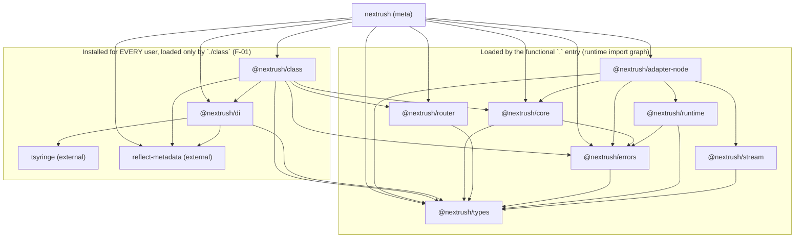
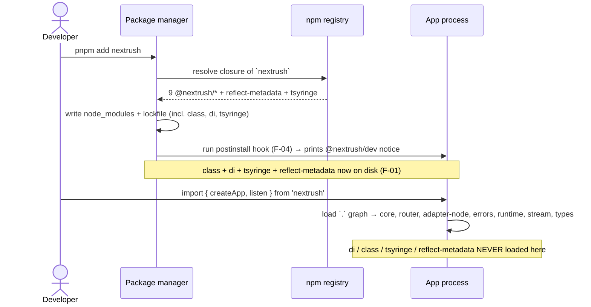

# Framework — `nextrush` Meta-Package Composition Review

| Field            | Value                                                                 |
| ---------------- | --------------------------------------------------------------------- |
| **Report type**  | Architecture                                                          |
| **Scope**        | `packages/nextrush` (meta-package) + its dependency/install closure and public export surface. Excludes runtime hot path, router algorithms, middleware internals (reviewed separately). |
| **Date**         | 2026-07-22                                                            |
| **Reviewer(s)**  | Framework Architecture Review                                          |
| **Commit / ref** | `6ab26e9b` (branch `docs/v4-rebuild`)                                  |
| **Status**       | Final                                                                  |
| **Related**      | `docs/adr/ADR-0005-package-tiers-sealed-surface-deprecation.md`, `docs/RFC/class-runtime/006-di-container-ownership.md`, `docs/RFC/request-data/002-route-metadata.md` |

---

## Progress Tracker

**Remediation:** `[░░░░░░░░░░░░░░░░░░░░]` 0% — 0 / 8 recommendations resolved

| Rec | Addresses | Priority | Status  |
| --- | --------- | -------- | ------- |
| 1   | F-03      | P0       | ⬜ Open  |
| 2   | F-01      | P1       | ⬜ Open  |
| 3   | F-02      | P1       | ⬜ Open  |
| 4   | F-04      | P1       | ⬜ Open  |
| 5   | F-05      | P2       | ⬜ Open  |
| 6   | F-06      | P2       | ⬜ Open  |
| 7   | F-07      | P2       | ⬜ Open  |
| 8   | F-08      | P2       | ⬜ Open  |

---

## 1. Executive Summary

`nextrush` is a thin meta-package. It ships almost no code of its own — one `createApp`
wrapper plus two barrel files — and its job is composition: it re-exports a curated slice of
the ~35-package workspace behind two entry points, `.` (functional API) and `./class`
(class/DI API). Judged as a composition artifact, the **structural core is genuinely well
built**: the dependency graph is acyclic and strictly downward-layered, the `.`/`./class`
subpath split correctly isolates the `reflect-metadata` side effect so the functional path
stays tree-shakeable, the public runtime surface is sealed by a contract test, and releases
run through disciplined changesets with migration guides. This is not a package in trouble.

The findings are concentrated in three places: a **gap between the install graph and the
import graph**, a **small number of public-surface defects**, and **documentation that
contradicts the code on the most-read page of all** (the npm landing README). None are
architecture-breaking; most are correctness-and-honesty issues where the framework's stated
principles ("install only what you need", "zero-dependency functional core") are true at
runtime but not at install time, and where the docs describe a framework slightly different
from the one that ships.

**Top findings:**
1. **F-03 — The npm README documents exports that do not exist (`VERSION`) or were removed (`catchAsync`), and prints benchmark numbers the project itself withdrew.** Priority P0 (highest-visibility surface, docs-only fix).
2. **F-01 — Every functional-only user still installs the entire class/DI stack** (`@nextrush/class`, `@nextrush/di`, `tsyringe`, `reflect-metadata`) even though their runtime never loads it. Priority P1.
3. **F-02 — `RouteMetadata` is two structurally-unrelated public types under one name**, one per subpath. Priority P1.
4. **F-04 — A `postinstall` hook runs on every install** to advertise an optional CLI — a recognized ecosystem/supply-chain anti-pattern. Priority P1.
5. **F-05/F-06/F-07/F-08 — composition and manifest tidiness**: `@nextrush/stream` is mandatory-but-advertised-as-optional; `@nextrush/class` double-declares deps as peers; legacy manifest fields and an empty `bin/`; and satellite-package discoverability rests entirely on docs. Priority P2.

---

## 2. System Understanding

**What `nextrush` is for.** In this monorepo every capability lives in its own package
(`@nextrush/core`, `@nextrush/router`, `@nextrush/errors`, twelve middleware packages, and so
on). Installing and wiring each of those by hand is a poor first-run experience. `nextrush`
exists to be the one package a developer installs to get a working, batteries-included
starting point, and to define the *stable public surface* — the set of names the framework
promises to keep — separate from the churn of the internal packages.

**How it is composed.** The package itself contains three meaningful source artifacts:

- `src/index.ts` — the `.` entry (functional API). It defines one wrapper, `createApp()`,
  which injects a default router into `@nextrush/core`'s bare `createApp`, and re-exports
  `createRouter`/`Router`/`endpoint` (router), `listen`/`serve`/`createHandler` (node
  adapter), the full `HttpError` hierarchy + error middleware (errors), and the essential
  types/constants (types). It deliberately does **not** touch DI.
- `src/class.ts` — the `./class` entry (class API). It `import 's reflect-metadata` for its
  side effect, then re-exports the DI container (`@nextrush/di`) and the decorator/controller/
  module surface (`@nextrush/class`).
- `scripts/postinstall.js` — an install-time hook that prints a one-line notice pointing at
  the optional `@nextrush/dev` CLI (auto-install is opt-in only).

**Why the design likely looks this way.** The two-entry split is a direct, documented response
to a real cost: loading `reflect-metadata` + `tsyringe` eagerly for functional users who never
use decorators. `src/index.ts` says so explicitly in a comment ("The functional `nextrush`
entry is deliberately DI-free … Doing so would transitively load `reflect-metadata` + tsyringe,
making functional users pay a cost that belongs only to the class-based paradigm"). The
`sideEffects: ["./dist/class.js"]` manifest field is the other half of that decision: it tells
bundlers everything *except* `class.js` is pure and tree-shakeable. Read together, these two
choices are a correct and deliberate solution to the "don't make functional users pay for DI
at runtime" problem — and they work. The findings below are about the seams that this design
left unaddressed, not about the design being wrong.

---

## 3. Architecture Overview

The install closure of `pnpm add nextrush` is a clean, acyclic DAG. Lower layers never import
upward (verified by reading every manifest in the closure; `get_architecture` reports no
package cycle). The diagram below shows the closure and — critically — splits it into what a
**functional** user actually loads at runtime versus what is installed regardless.

Layering (bottom to top): `types` → `errors`/`runtime`/`stream` → `core`/`router` → `di` →
`adapter-node`/`class` → `nextrush`. Direction is consistent with the hierarchy in
`.kiro/steering/architecture.instructions.md`. **No boundary violations or cycles were
found** — this is a genuine strength.

---

## 4. Data Flow

The "data" in a composition review is the install/resolution/import lifecycle. The sequence
below shows where the install graph and the import graph diverge for a functional user.

The split is the whole story: **at import time** the functional path is DI-free exactly as
advertised; **at install time** it is not.

---

## 5. Backend / Logic

The meta-package contains almost no logic to review — the one behavioral unit is the
`createApp()` wrapper in `src/index.ts`, which is a thin, well-documented delegation to
`@nextrush/core`'s `createApp` with a default router injected. It is correct, single-purpose,
and its JSDoc explains *why* it exists (batteries-included router vs. core's bring-your-own).
No findings here. Composition and API-surface findings are in §7 and §12.

## 6. Database / State

_Not applicable — the meta-package has no persistence or stateful component._

## 7. Frontend / API Surface

The public API surface is two entry points. The `.` runtime surface is **sealed** by
`src/__tests__/public-surface.test.ts` (an explicit allow-list of 34 runtime symbols plus a
type-only surface check) — strong discipline that makes accidental additions fail CI.

Two surface-level problems exist despite the seal, because the seal only guards the `.` entry
and only the symbol *set*, not the *meaning* or the *docs*:

- The `RouteMetadata` type name resolves to two unrelated interfaces depending on which subpath
  you import from (**F-02**).
- The published README documents a `VERSION` export and a `catchAsync` export that the sealed
  surface does not contain (**F-03**) — the seal protects the code, but nothing cross-checks
  the code against the README.

The functional/class separation itself is clean: `./class` does not re-export
`createApp`/`listen` (no functional duplication), and `.` does not leak any decorator/DI
symbol. That is the right boundary.

## 8. UX

_Not applicable in the end-user-UI sense._ The developer-experience dimension (installation,
discoverability, first-run) is covered as first-class findings: install honesty (F-01),
install-time noise (F-04), and satellite-package discoverability (F-08). Where a named
principle applies it is cited in those findings (e.g. Jakob's Law of least surprise for the
`RouteMetadata` collision in F-02).

## 9. Performance

_Not applicable to this review by scope._ One adjacent, positive observation: the
`sideEffects: ["./dist/class.js"]` field means the functional `.` path is fully tree-shakeable
and the `reflect-metadata` side effect cannot leak into a functional bundle. That is the
correct performance-of-composition decision and needs no change. Runtime throughput is out of
scope (reviewed separately).

## 10. Security

No vulnerabilities in the meta-package itself. Two supply-chain-surface observations, both
folded into findings rather than rated as vulnerabilities:

- The `postinstall` hook (**F-04**) executes a Node script on every install. It is
  defensively written (opt-in auto-install, CI skip, monorepo re-entrancy guard), but *any*
  install script is a flag in enterprise security review and is skipped entirely under
  `npm install --ignore-scripts`.
- Every `nextrush` install pulls `tsyringe` + `reflect-metadata` onto disk (**F-01**), so a
  future advisory in either would surface in `npm audit` for functional-only users who never
  execute that code — a wider blast radius than the runtime graph implies.

## 11. Maintainability

The meta-package is small and clean; no file-size or god-module concerns. Maintainability risk
is concentrated in **documentation drift** (F-03): the README is the artifact most likely to
rot because nothing binds it to the sealed surface, and it has already drifted on four separate
points (a removed export, a non-existent export, withdrawn benchmark numbers, and a stale
TypeScript version). AGENTS.md §13 treats outdated docs as a defect; by that standard the
README is currently defective. The manifest inconsistencies (F-07) and the class package's
dep/peer double-declaration (F-06) are low-severity drift of the same kind — small
incoherences that accumulate against the "intentionally designed" bar.

---

## 12. Findings (detailed)

### F-01 — Functional users install the entire class/DI stack (install graph ≠ import graph) · Priority P1

- **Current situation:** `packages/nextrush/package.json` lists `@nextrush/class`,
  `@nextrush/di`, and `reflect-metadata` in `dependencies` (not optional/peer). `@nextrush/di`
  in turn depends on `tsyringe@^4.10.0`. So `pnpm add nextrush` always writes
  `@nextrush/class`, `@nextrush/di`, `tsyringe`, and `reflect-metadata` into `node_modules` and
  the lockfile — even for an app that only does `import { createApp, listen } from 'nextrush'`.
  The `.` barrel (`src/index.ts`) imports only from `core`/`router`/`adapter-node`/`errors`/
  `types`, none of which depend on `di` or `class` (verified across all five manifests), so the
  *runtime import graph* is genuinely DI-free. The gap is entirely in the *install graph*.
- **Impact:** functional users carry four extra packages (two of them third-party) they never
  execute — on disk, in the lockfile, and in their SCA / `npm audit` / supply-chain surface.
  This directly contradicts the framework's own stated principles ("Modular — Install only what
  you need", "you only pay for what you use") and the boast in `src/index.ts` that functional
  users are spared the DI cost. The claim is true at runtime, false at install.
- **Benefits (of today's design):** one install command yields both paradigms; `nextrush/class`
  works with zero extra setup ("batteries-included"), mirroring NestJS's single-install model.
  No class user ever hits a "module not found". Simplicity of a single dependency line.
- **Drawbacks:** the "zero-dependency functional core" story only holds for the import graph;
  a `tsyringe`/`reflect-metadata` advisory flags every NextRush install regardless of paradigm;
  the lockfile and disk footprint carry an unused paradigm.
- **Long-term risk:** `@nextrush/class` is already the second-largest package in the workspace
  (684 graph nodes). As it grows, the mandatory install cost for functional users grows with a
  paradigm they do not use, and the principle/reality gap widens.
- **Recommendation:** decide and document the trade-off explicitly — pick one of:
  **(A) keep the monolithic install** but drop the "install only what you need" framing *for the
  meta-package specifically* and state plainly that `nextrush` bundles both paradigms; or
  **(B) move `@nextrush/class` + `@nextrush/di` + `reflect-metadata` to optional
  `peerDependencies`** (`peerDependenciesMeta.optional: true`), have `create-nextrush` add them
  for the class/full templates, and make the `nextrush/class` subpath throw a clear, actionable
  error when the peer is absent ("`nextrush/class` requires `@nextrush/class` — run
  `pnpm add @nextrush/class`").
- **Trade-offs:** (A) is zero-effort and honest but leaves the footprint. (B) restores the
  pay-for-what-you-use property but adds a setup step for *manual* class users (the scaffolder
  covers templated users), and relies on a good error message — note pnpm does **not**
  auto-install peers by default, so the scaffolder must carry that weight. `optionalDependencies`
  is **not** a solution: those are still installed when resolvable.
- **Priority:** P1.
- **Migration difficulty:** Moderate for (B) — manifest change + scaffolder change + subpath
  guard + docs + a minor release with a migration note. Trivial for (A) — docs only.

### F-02 — `RouteMetadata` is two different public types under one name across `.` and `/class` · Priority P1

- **Current situation:** `import type { RouteMetadata } from 'nextrush'` resolves to
  `@nextrush/types`'s `RouteMetadata` (`packages/types/src/route-metadata.ts`) — a
  renderer/OpenAPI-facing contract: `request`, `responses`, `summary`, `tags`, `deprecated`,
  `visibility`. `import type { RouteMetadata } from 'nextrush/class'` resolves to
  `@nextrush/class`'s `RouteMetadata` (`packages/class/src/decorators/route-types.ts`) — a
  decorator-storage record: `method`, `path`, `methodName`, `propertyKey`, `middleware`,
  `statusCode`. Same identifier, same package, two subpaths, structurally disjoint (they share
  only `description?`/`deprecated?`). Both are intentional re-exports (`index.ts` from types,
  `class.ts` from class).
- **Impact:** a developer importing `RouteMetadata` from the "wrong" entry gets a silently
  incompatible type; editor autocomplete and generated docs show two conflicting shapes under
  one name (a direct violation of Jakob's Law — the name sets an expectation the other subpath
  breaks). Violates the framework philosophy's "every capability has exactly one owner". The
  class variant additionally *leaks decorator-storage internals* (`propertyKey`, `methodName`
  are implementation details of how decorators record routes) through a public barrel.
- **Benefits (of today's design):** within its own package each type is locally well-named; the
  collision only manifests when a codebase imports from both subpaths.
- **Drawbacks:** a latent DX trap and a leaked internal on the public surface of a single
  package.
- **Long-term risk:** OpenAPI/SDK/RPC generators are being built on the `@nextrush/types`
  `RouteMetadata` (per its own docstring and `docs/RFC/request-data/002-route-metadata.md`); the
  class metadata will keep diverging. Renaming becomes a more expensive breaking change the
  longer it waits.
- **Recommendation:** reserve `RouteMetadata` for the single renderer-facing contract in
  `@nextrush/types`, and **rename the class-package public type** to an intent-revealing name
  (e.g. `ControllerRouteMetadata` / `DecoratorRouteMetadata`) — or stop exporting it entirely if
  it is genuinely decorator-internal (it reads as internal). Ship a deprecated type alias for one
  minor to soften the change.
- **Trade-offs:** renaming is a breaking change to `nextrush/class`'s type surface, mitigated by
  the deprecated alias and a changeset; leaving it keeps the trap and the leaked internal.
- **Priority:** P1.
- **Migration difficulty:** Moderate — type-only rename + deprecated alias + update the sealed
  type-surface check.

### F-03 — The published meta README documents removed/non-existent exports and withdrawn numbers · Priority P0

- **Current situation:** `packages/nextrush/README.md` (the npm landing page) contains:
  (a) a `## Version` section with `import { VERSION } from 'nextrush'; console.log(VERSION); //
  '3.0.5'` — but `VERSION` is **not exported**; `src/index.ts` explicitly documents that it is
  intentionally omitted for edge-runtime compatibility, the sealed `public-surface.test.ts` does
  not list it, and a graph search finds no such source symbol; (b) `catchAsync` listed as a
  current "deprecated" export in the "What's Included" table — but `catchAsync` has been
  **removed** (the docs site page is literally titled "catchAsync() — removed"; it is absent from
  the barrel and the sealed test); (c) a full benchmark table with specific RPS figures on
  "Node.js v25.9.0", while the **root** README states those single-run numbers "have been
  withdrawn pending re-measurement"; (d) a `TypeScript 5.x` badge, while the package builds on
  TypeScript 6 (`tsconfig.json` sets `"ignoreDeprecations": "6.0"`, devDep is `typescript@^6.0.3`);
  (e) the version example prints `3.0.5` while the package is `3.1.0`.
- **Impact:** the *first* artifact a prospective adopter reads instructs them to use APIs that
  evaluate to `undefined` or fail to import, and cites performance numbers the project itself has
  retracted. This is the highest-visibility surface in the whole package. AGENTS.md §13:
  "Outdated documentation is a bug."
- **Benefits (of today's design):** none — this is pure drift, not a deliberate choice.
- **Drawbacks:** erodes trust at first contact; creates a visible contradiction between the meta
  README and the root README on benchmarks.
- **Long-term risk:** nothing binds the README to the sealed surface, so it will keep drifting on
  every release that changes exports.
- **Recommendation:** rewrite the meta README from `docs/templates/package-readme.template.md`:
  remove the `VERSION` section (the omission is deliberate — do not re-add the export) and the
  `catchAsync` row; replace the benchmark table with the root README's "withdrawn / measure it
  yourself" stance; correct the TypeScript badge to the real major; and regenerate the "What's
  Included" table directly from the sealed surface list. Consider a lightweight CI check that
  greps the published README for symbol names absent from the sealed surface.
- **Trade-offs:** none meaningful; modest writing effort. A README↔surface CI check adds a small
  maintenance rule but prevents recurrence.
- **Priority:** P0 (highest-visibility surface; docs-only and non-breaking, hence fast).
- **Migration difficulty:** Trivial.

### F-04 — `postinstall` hook in the meta-package · Priority P1

- **Current situation:** `packages/nextrush/package.json` declares
  `"postinstall": "node scripts/postinstall.js"`, so a Node process runs on every install of
  `nextrush`. The script (`scripts/postinstall.js`) is defensively written: it prints a one-line
  notice about the optional `@nextrush/dev` CLI by default, only auto-installs when
  `NEXTRUSH_AUTO_INSTALL_DEV=1`, skips in CI, skips when `@nextrush/dev` is already resolvable,
  and guards against monorepo re-entrancy/recursion. The CHANGELOG (3.0.7) shows the auto-install
  feature landed and was subsequently walked back to print-only.
- **Impact:** `postinstall` scripts are a recognized ecosystem anti-pattern and a standard
  supply-chain review flag. Under `npm install --ignore-scripts` (common in hardened orgs) the
  notice never prints — so it is unreliable even for its own purpose — while still counting as an
  install-script against adoption gates. It adds a moving part and a Node execution to the install
  path purely to surface an advisory message.
- **Benefits (of today's design):** nudges users toward `@nextrush/dev` so `nextrush dev` /
  `nextrush build` work out of the box; the current implementation is careful and non-destructive
  by default.
- **Drawbacks:** executes code on every install for a hint; invisible to exactly the audience
  most likely to want it (script-disabling orgs); the opt-in `pnpm add`-from-postinstall path
  remains a footgun even while off by default.
- **Long-term risk:** install-time execution is precisely the kind of thing that blocks
  enterprise adoption and that a future maintainer could re-enable to auto-install by default.
  The value (advertising an optional CLI) is disproportionate to the risk it carries.
- **Recommendation:** remove the `postinstall` hook and move `@nextrush/dev` discovery to
  (a) the README quick-start, (b) `create-nextrush` (which already selects templates and can add
  `@nextrush/dev` directly), and (c) a clear "install `@nextrush/dev`" message if a user runs the
  `nextrush` CLI without it present. This aligns with "convention over configuration / the
  scaffolder owns setup" and removes the supply-chain flag. Drop `scripts` from the `files` array
  once the hook is gone.
- **Trade-offs:** manual `pnpm add nextrush` users lose the install-time hint; mitigated by the
  README + scaffolder + an actionable CLI error. Net simplification.
- **Priority:** P1.
- **Migration difficulty:** Trivial.

### F-05 — `@nextrush/stream` and `@nextrush/runtime` are always installed but advertised "install separately" · Priority P2

- **Current situation:** `@nextrush/adapter-node` depends on both `@nextrush/runtime` and
  `@nextrush/stream`, and `@nextrush/stream` is a real runtime import in
  `packages/adapters/node/src/context.ts:22` (streaming responses), not a vestigial dependency.
  Because `nextrush` depends on `adapter-node`, both are always in the install closure. Yet the
  root README lists `@nextrush/stream` under "Extensions (install separately)" and the meta README
  lists it under "Advanced (install separately)". The meta "What's Included" table also omits
  `runtime` and `stream` even though they always ship.
- **Impact:** low but real incoherence — a developer told to `pnpm add @nextrush/stream` is adding
  a package that is already on disk transitively. Not technically wrong (you should not import a
  transitive dep directly without declaring it), but the "install separately" framing muddies the
  core-vs-optional composition story: `stream` is a *mandatory transitive dependency* but an
  *optional-to-use API*.
- **Benefits (of today's design):** keeping `stream` out of the meta re-exports keeps the `.`
  surface minimal; the SSE/NDJSON API is genuinely optional to *use*.
- **Drawbacks:** the composition narrative ("is stream core or optional?") is ambiguous.
- **Long-term risk:** low; mainly ongoing doc confusion.
- **Recommendation:** clarify one way or the other — either (a) expose the stream API via a
  `nextrush/stream` subpath (it always ships anyway), making it discoverable without a second
  install and consistent with "discoverable over hidden"; or (b) keep it separate but correct the
  docs to state it ships with the node adapter and only needs a direct dependency entry for direct
  import. (a) is more consistent with the framework philosophy.
- **Trade-offs:** (a) grows the meta's subpath count (more surface to keep stable); (b) is
  docs-only and cheaper.
- **Priority:** P2.
- **Migration difficulty:** Trivial (docs) / Moderate (new subpath).

### F-06 — `@nextrush/class` declares `core` + `router` as both `dependencies` and `peerDependencies` · Priority P2

- **Current situation:** `packages/class/package.json` lists `@nextrush/core` and
  `@nextrush/router` in **both** `dependencies` (`workspace:*`) and `peerDependencies`
  (`workspace:*`), with no `peerDependenciesMeta.optional`. Declaring the same package as a hard
  dependency *and* a required peer is contradictory. By contrast, `@nextrush/router` models this
  cleanly: it declares `@nextrush/core` as an **optional** peer
  (`peerDependenciesMeta["@nextrush/core"].optional: true`) plus a devDep, expressing "I work with
  or without core."
- **Impact:** ambiguous intent; some package managers emit warnings; a consumer cannot tell whether
  `core`/`router` are meant to be deduped against the app's copy (peer) or bundled (dependency).
- **Benefits (of today's design):** none evident — likely an artifact of iterative manifest edits.
- **Drawbacks:** manifest smell; inconsistent with the router's cleaner pattern in the same repo.
- **Long-term risk:** low; contributes to overall manifest incoherence.
- **Recommendation:** pick one. Since `@nextrush/class` genuinely needs `core`+`router` at runtime
  (it reads `app.router`/`app.container`), keep them as `dependencies` and drop the peer entries;
  or, if the intent is deduplication with the app's instance, make them optional peers only. Use
  the router's optional-peer pattern as the model.
- **Trade-offs:** minimal — correctness/consistency of the manifest only.
- **Priority:** P2.
- **Migration difficulty:** Trivial.

### F-07 — Manifest cleanliness: legacy `main`/`module` fields, target/engine mismatch, empty `bin/` · Priority P2

- **Current situation:** (a) Every package carries `main` + `types` and *most* carry the
  non-standard `module` field alongside `exports`; for a pure-ESM package with an `exports` map,
  `main` is only a legacy fallback and `module` (a bundler convention) is redundant. It is applied
  inconsistently — `@nextrush/adapter-node` and `@nextrush/class` omit `module`, while `core`/`di`/
  `router`/`types`/`errors`/`stream`/`runtime` include it. (b) The meta `tsup.config.ts` sets
  `target: 'node20'` while `engines.node` is `">=22.0.0"`. (c) `packages/nextrush/bin/` is an
  empty directory (not in `files`, so unpublished, but dead scaffolding in the working tree —
  AGENTS.md §20 forbids dead weight in the tree).
- **Impact:** low — cosmetic. The `main`/`module` fields are harmless fallbacks; a `node20` build
  target is a subset of `node22` so output runs; the empty `bin/` is inert. But these are exactly
  the small inconsistencies that undercut "the framework should feel coherent, intentionally
  designed."
- **Benefits (of today's design):** `main`/`types` provide a fallback for very old tooling that
  ignores `exports`.
- **Drawbacks:** inconsistency across sibling packages; a build target below the declared engine
  floor.
- **Long-term risk:** negligible.
- **Recommendation:** standardize the manifests — either drop `module` everywhere (pure ESM +
  `exports` on Node ≥22 does not need it) or include it everywhere; align the tsup `target` with
  the ≥22 engine floor; delete the empty `packages/nextrush/bin/` directory.
- **Trade-offs:** none.
- **Priority:** P2.
- **Migration difficulty:** Trivial.

### F-08 — Satellite-package discoverability rests entirely on documentation · Priority P2

- **Current situation:** `nextrush` re-exports only the functional core + errors + types (`.`) and
  DI + decorators + controllers (`./class`). The remaining ~20+ packages — twelve middleware,
  `stream`, `websocket`, `events`, `static`, `template`, `logger`, `openapi`, `validation`,
  `health`, `testing` — are discoverable only via the README tables or the docs site. There is no
  `nextrush/middleware` index, no programmatic capability registry, no typed "here is what exists".
  (`get_architecture` shows the middleware cluster is the single largest package group at 832
  nodes.)
- **Impact:** the minimal-core decision is defensible and matches Hono/Fastify, but capability
  discovery is a documentation lookup rather than an in-editor affordance — a developer cannot find
  `@nextrush/cors` without leaving their code. This is the "discoverable over hidden" principle in
  genuine tension with "small surface over large surface".
- **Benefits (of today's design):** a tiny, stable core surface; clean tree-shaking; each package
  evolves independently; no meta-package bloat.
- **Drawbacks:** discovery friction; the ecosystem's breadth is invisible from the code.
- **Long-term risk:** low, but it caps the perceived completeness of the framework for newcomers.
- **Recommendation (Recommended, not Essential):** keep the small runtime surface — do **not**
  barrel everything into the meta (that would regress the core-size principle). Improve discovery
  out-of-band: `create-nextrush` middleware presets (already present per the root README), a docs
  "package catalog" page, and the already-consistent `@nextrush/*` naming. This is a
  documented-but-deferred DX enhancement, not a defect.
- **Trade-offs:** none if kept out-of-band; barreling would trade the minimal-core property for
  discoverability, which the framework has deliberately chosen against.
- **Priority:** P2.
- **Migration difficulty:** N/A (additive / docs).

---

## 13. Risks

| Risk | Likelihood | Impact | Mitigation |
| ---- | ---------- | ------ | ---------- |
| README drift keeps recurring (new export added, README not updated) | High | Medium | F-03 rewrite + a CI check that greps the README for symbols absent from the sealed surface |
| A `tsyringe`/`reflect-metadata` advisory flags every NextRush install, incl. functional-only | Medium | Medium | F-01 option (B) removes them from the functional install graph; option (A) at least documents the exposure |
| Enterprise adoption blocked by the `postinstall` hook in a security review | Medium | Medium | F-04 — remove the hook |
| `RouteMetadata` collision hardens as OpenAPI/SDK generators build on it, making the rename costlier | Medium | Medium | F-02 — rename the class-side type now, while the cost is a one-line alias |
| Manifest incoherence accumulates as more packages are added | Low | Low | F-06/F-07 — standardize the manifest shape once and lint it |

---

## 14. Recommendations (prioritised)

| # | Recommendation | Addresses | Priority | Effort | Status |
| - | -------------- | --------- | -------- | ------ | ------ |
| 1 | Rewrite the meta README from the package template: remove `VERSION` + `catchAsync`, replace withdrawn benchmarks with the "measure it yourself" stance, fix the TS badge, regenerate "What's Included" from the sealed surface; add a README↔surface CI grep. | F-03 | P0 | S | ⬜ Open |
| 2 | Decide and document the install trade-off — either state that `nextrush` bundles both paradigms (A), or move `class`+`di`+`reflect-metadata` to optional peers with scaffolder support and a guarded `nextrush/class` error (B). | F-01 | P1 | S (A) / M (B) | ⬜ Open |
| 3 | Reserve `RouteMetadata` for `@nextrush/types`; rename (or unexport) the `@nextrush/class` type; ship a deprecated alias for one minor. | F-02 | P1 | M | ⬜ Open |
| 4 | Remove the `postinstall` hook; move `@nextrush/dev` discovery to README + scaffolder + a CLI-not-found message. | F-04 | P1 | S | ⬜ Open |
| 5 | Resolve the `@nextrush/stream` "optional vs always-installed" ambiguity — expose a `nextrush/stream` subpath or correct the docs. | F-05 | P2 | S/M | ⬜ Open |
| 6 | Fix `@nextrush/class`'s dep/peer double-declaration (follow the router's optional-peer pattern). | F-06 | P2 | S | ⬜ Open |
| 7 | Standardize manifest fields (`main`/`module`), align tsup target with the ≥22 engine floor, delete the empty `bin/`. | F-07 | P2 | S | ⬜ Open |
| 8 | Improve satellite-package discovery out-of-band (docs catalog + scaffolder presets); keep the meta surface small. | F-08 | P2 | S | ⬜ Open |

---

## 15. Migration Strategy

Order by visibility and reversibility; nothing here needs to ship together.

1. **Ship first — docs-only, non-breaking, highest visibility:** Rec 1 (F-03 README) and Rec 7
   (F-07 manifest tidy + empty `bin/`). Zero API impact, fully reversible.
2. **Next — non-breaking manifest/behavior:** Rec 4 (F-04 remove postinstall) and Rec 6
   (F-06 dep/peer). Behavioral only at install time; reversible.
3. **Decide, then ship — the trade-off calls:** Rec 2 (F-01). If option (A), it collapses into a
   docs change and joins step 1. If option (B), it is a minor release with a migration note and
   scaffolder change — gate it behind a changeset and verify class/full templates still install
   cleanly.
4. **Batch into a minor with a deprecation window:** Rec 3 (F-02 rename) — land the new name plus a
   deprecated alias in one minor, remove the alias in the next major.
5. **Deferred / additive:** Rec 5 (F-05) and Rec 8 (F-08) as documentation and scaffolder
   enhancements when convenient.

Any change touching an exported symbol updates `public-surface.test.ts` and ships a changeset, per
the repo's existing (and well-followed) release discipline.

---

## 16. Conclusion

The `nextrush` meta-package is structurally sound: an acyclic, strictly-layered dependency graph,
a genuinely well-engineered `.`/`./class` split that keeps the functional path DI-free at runtime,
a sealed public surface, and disciplined semver. It does not need re-architecting. What it needs is
**honesty and tidiness at the seams** — closing the gap between what the framework *says* (install
only what you need, zero-dependency functional core, these exports exist, these numbers hold) and
what it *ships* (a monolithic dual-paradigm install, a `RouteMetadata` name that means two things, a
README describing removed APIs, an install-time script).

The single most important next step is **Rec 1 (F-03): fix the npm README.** It is docs-only,
non-breaking, and it is the first thing every prospective adopter reads — and today it tells them to
use APIs that do not exist. Everything else can follow on the normal release cadence.
