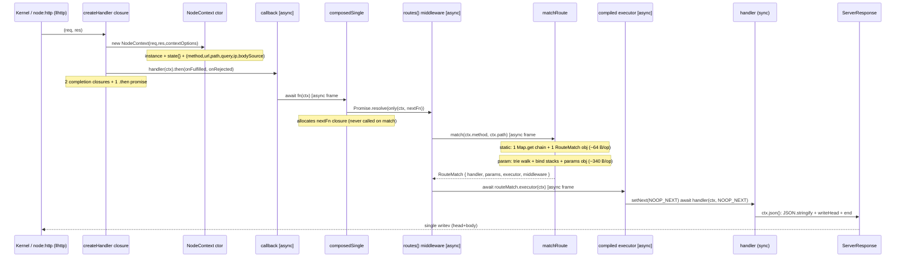

# NextRush Runtime — Deep Hot-Path Performance Review (Second Pass)

**Scope (per audit contract):** the per-request execution path only — `@nextrush/core`,
`@nextrush/router`, `@nextrush/adapter-node`, `@nextrush/runtime` leaf helpers, and
`body-source` where it sits on the POST path. Plugins, middleware packages, DI/class runtime,
docs, CLI, build, tests, and non-Node adapters are out of scope except where they touch a
measured benchmark path.

**Baseline commit:** branch `opt/core` @ `1878042` (HEAD at review time).
**Prior audit reviewed:** `report/core-hot-path-performance-review.md` (baseline `aadb7d8`).
**Benchmark source:** `apps/benchmark/results/latest/` (run `2026-07-18T04-15-06`), plus the
team's allocation micro-benches under `apps/benchmark/results/`.
**Runtime under test:** Node **v26.4.0**, Intel i5-8300H, Linux 7.1.3-fc44, **no CPU pinning**.

This is a *second* pass over a codebase that has already had one thorough professional review
(the 18-finding HP-1…HP-18 audit) and shipped nearly all of it. It deliberately does **not**
repeat that work. It verifies what shipped, challenges the conclusions, and hunts the residual
and structural cost that the first pass either deferred, missed, or could not measure.

---

## Executive Summary

NextRush's request pipeline is genuinely well-engineered and sits in the Fastify/Hono tier. The
first audit's allocation-trim program (HP-1…HP-18) has effectively all shipped — verified in
code at HEAD, not just claimed. The obvious per-request waste is gone: shared frozen
empty-params/empty-query sentinels, a singleton empty body source, a hoisted frozen
context-options object, a lazy `ctx.raw`, a lazy `AbortController`, an O(1) method-nested
static-route map, a single-allocation `RouteMatch`, a `len===1` compose fast path, and an
event-listener body read.

The remaining gap to Fastify is therefore **structural, not a list of stray allocations**, and
this review's three highest-value conclusions are:

1. **The dispatch pipeline still spins up three nested `async` frames to reach a synchronous
   handler** (`callback` → `createRoutesMiddleware` → the compiled executor), on **100% of
   requests**. The first audit removed the *recursive* dispatch closure (HP-6) and de-async'd
   `ctx.next()` (HP-7) — but never applied that same de-async technique to the two router-layer
   `async` functions that sit on every matched request. An isolated experiment measured this
   mechanism at **2.92 M ops/s and ~1304 B/iteration**, versus **10.65 M ops/s and ~97 B/iter**
   for a flattened promise-forwarding equivalent — a **3.6×** throughput and **~13×** allocation
   difference *for the dispatch mechanism alone*. This is the flat-overhead lever. **(P1 → NF-1)**

2. **Route Parameters is now the framework's single widest competitive gap AND its heaviest
   allocator, and it has never actually been profiled or RPS-tested.** In the latest run
   NextRush is **−20.6% vs Fastify** on route-params (wider than Hello World's −14.1%), while the
   team's own allocation micro-bench reports a param match at **339.87 B/op vs 64.24 B/op for a
   static match (5.3×)**. The shipped "router allocation trim" was verified for *correctness and
   safety* (real, valuable: DoS + prototype-pollution + a hidden-class deopt were closed) but its
   *allocation-reduction* claim was never confirmed — the team's own pre-change baseline records
   param at **169.4 B/op**, i.e. the number **doubled** post-trim, and this was written off as
   "unmeasurable transient garbage." The Route-Params RPS A/B is deferred to hardware that has
   never been provisioned. **This is a validation gap, not a solved problem. (P0-validation →
   NF-3)**

3. **A per-request `ctx.state = {}` object is allocated unconditionally** — the exact waste the
   first audit *did* fix for `ctx.query` (shared `EMPTY_QUERY`) but left for `state` because
   `state` is mutable. Most hot handlers never touch it. A lazy getter removes it, mirroring the
   already-shipped lazy-`raw` pattern (which the team measured at 47.6 → 8 B/req). **(P2 → NF-2)**

Two of my initial hypotheses were **rejected by measurement**, which is worth stating up front
because it is the whole point of a second pass: `req.method.toUpperCase()` does **not** allocate
for already-uppercase methods (V8 fast-paths it — 0 B/iter), and an isolated test of the
matcher's per-node `WalkFrame` objects was **inconclusive** (V8 escape analysis elides them in a
small loop) — so I do not claim frame allocation as the param-path culprit without a real
profile.

**Overarching meta-finding:** the entire optimization program rests on structural/spy evidence
because the two measurements that would actually confirm it — a CPU-pinned `--profile full` RPS
A/B and a transient-allocation profile of the hot path — have **never been run**. That is the
highest-leverage next action, ahead of any new code change.

---

## Current Runtime Architecture

The measured application shape (`apps/benchmark/servers/nextrush-v3.js`) is the dominant
real-world shape and determines everything below:

```js
const app = createApp();               // core Application — NO app-owned router
const router = createRouter();         // segment-trie Router
router.get('/', (ctx) => ctx.json(HELLO_WORLD));
router.get('/users/:id', (ctx) => ctx.json(userById(ctx.params.id)));
app.setErrorHandler((_err, ctx) => { ctx.status = 500; ctx.json(ERROR_BODY); });
app.route('/', router);                // root mount → fast path
```

Consequences (verified in `core/src/application.ts` and `router/src/router.ts`):

- `createApp()` receives **no** `router` option, so `app.router` is `undefined` and `ready()`'s
  `if (this.router) middlewareStack.push(...)` is a no-op. The only middleware is the one pushed
  by `app.route('/', router)`.
- `app.route('/', router)` hits the **root-mount fast path** (`path === '/'`) →
  `middlewareStack = [router.routes()]`, exactly **one** entry. `createPrefixMount` is **off** the
  measured path.
- `compose([router.routes()])` therefore takes the **`len===1` fast path** (`composedSingle`).
- The router is a thin shell: `Router.match` → `resolveMatch` → `matchRoute`; `Router.routes()` →
  `createRoutesMiddleware(match)`; per-route middleware chains are compiled once at registration
  by `compileExecutor`.

Layer map (each request crosses all of these):

```
node:http server ── createHandler closure (adapter-node/src/adapter.ts)
  → new NodeContext(req,res,contextOptions)      (adapter-node/src/context.ts)
  → app.callback() wrapper  [async try/catch]    (core/src/application.ts)
  → composedSingle          [len===1 fast path]  (core/src/middleware.ts)
  → routes() middleware     [async]              (router/src/dispatch.ts)
  → Router.match→resolveMatch→matchRoute         (router/src/match-route.ts, matching.ts)
  → compiled executor       [async, len=0]       (router/src/segment-trie.ts)
  → user handler → ctx.json                      (adapter-node/src/context.ts)
  → res.writeHead + res.end
```

---

## Request Lifecycle



**Async / microtask hops for a fully synchronous handler:** `createHandler`'s `.then` (1) +
`callback`'s `await fn(ctx)` (2) + `routes()`'s `await executor(ctx)` (3) + the executor's
`await handler(...)` (4) ≈ **four microtask turns** between socket-read and response. Raw Node
(`(req,res)=>res.end(body)`) has **zero**. This is the single biggest architectural difference
from the raw ceiling and is paid on every request in every scenario.

**Syscall / libuv shape (verified good):** the static and param GET paths register **zero**
per-request event listeners (`ctx.signal`'s `close`/`aborted` listeners are lazy;
`AbortController` is lazy). `ctx.json` issues one `res.writeHead` + one `res.end(body)`, which
Node coalesces into a **single `writev`** for small bodies. Keep-alive is configured
(`keepAliveTimeout = 5000`). There is no per-request timer, no extra libuv handle, and no
duplicate socket write. The kernel/libuv layer is already close to optimal for a `node:http`
framework — the overhead is in userland V8 work, consistent with the "CPU-bound on framework
work, not memory-starved" reading (RSS ≈ Fastify/Hono).

---

## Runtime Cost Model

Per-request work on the **static** path (Hello World), counted from the current source:

| Stage | Allocations (objects/closures/strings) | Async frames | Notes |
|---|---|---|---|
| `createHandler` closure | 2 `.then` closures + 1 `.then` promise | — | `contextOptions` hoisted+frozen ✅ (HP-4) |
| `NodeContext` ctor | instance + **`state = {}`** | — | `query = EMPTY_QUERY` ✅; `ip` short-circuit ✅; empty body singleton ✅; `raw` lazy ✅ |
| `callback` | 1 promise | **1** | async try/catch wrapper |
| `composedSingle` | **1 `nextFn` closure** (never called on match) | — | `len===1` fast path ✅ (HP-6) |
| `routes()` middleware | 1 promise | **1** | `createRoutesMiddleware` is `async` |
| `matchRoute` (static) | 1 `RouteMatch` object | — | method-nested map ✅ (HP-9), single alloc ✅ (HP-10), ~**64 B/op** |
| compiled executor (len=0) | 1 promise + redundant `setNext(NOOP_NEXT)` | **1** | `async` wrapper around a sync handler |
| `ctx.json` | JSON string + Content-Length String + 2-key header object | — | single `writeHead` ✅ (HP-14) |

**Static-path totals:** ≈ 6–8 short-lived allocations + **3 `async` state machines** + ~4
microtask hops. The router itself is cheap (**64 B/op**, O(1)); the cost is the Context object
plus the dispatch frames.

Per-request **param** path adds (over static), from the team's own micro-bench and the code:

- Tree walk: per-node `WalkFrame` objects + the frame stack array + `bindNames`/`bindValues`
  arrays + a per-match null-prototype `params` object + `decodeParam`/`segmentAt` slices.
- **Measured net: ~339.87 B/op for a param match vs ~64.24 B/op static — 5.3×**
  (`results/router-match-alloc-2026-07-18T01-31-54`).

Per-request **POST** path adds body buffering (event-listener accumulation ✅ HP-16) **plus**
`JSON.parse` and the `@nextrush/body-parser` `json()` middleware — the latter two dominate POST
cost and are **out of scope** (not NextRush core).

---

## Existing Findings Verification (confirm / reject)

Every HP finding from the prior audit was checked against HEAD source. **All 16 assigned
findings (HP-1…HP-18, HP-3/HP-8 unassigned) are present in the code.** Notable corrections:

| Prior finding | Prior report status | **Verified state at HEAD** |
|---|---|---|
| HP-1 eager ip + closure | ✅ shipped | ✅ `getClientIp` returns `directIp` directly when `!trustProxy` (context.ts) |
| HP-2 empty `query` object | ⬜ "pending" | ✅ **SHIPPED** — `EMPTY_QUERY` frozen null-proto sentinel (context.ts). *Report is stale.* |
| HP-4 `{trustProxy}` hoist | ✅ shipped | ✅ frozen `contextOptions` hoisted into `createHandler` |
| HP-5 lazy `ctx.raw` | ✅ shipped | ✅ memoized getter over `_req`/`_res`; measured 47.6→8.1 B/req |
| HP-6 single-mw fast path | ✅ shipped | ✅ `compose` `len===1` → `composedSingle` |
| HP-7 non-async `ctx.next()` | ✅ shipped | ✅ `next()` forwards `_next` thunk / `RESOLVED_NEXT` |
| HP-9 method-nested static map | ✅ shipped | ✅ `Map<method, Map<path, entry>>` |
| HP-10 single `RouteMatch` | ✅ shipped | ✅ `matchRoute` builds final shape; `resolveMatch` delegates |
| HP-11/13 iterative matcher | ✅ shipped | ✅ explicit-stack DFS, deferred materialize, bind-count |
| HP-12 fold fast-path | ✅ shipped | ✅ `isProvablyLowerAscii` + `collapseAndStrip` |
| HP-14 single `writeHead` | ⬜ "pending" | ✅ **SHIPPED** — one `res.writeHead(status, {...})` in `json()`. *Report is stale.* |
| HP-15 gated `set-cookie` lower | ⬜ "pending" | ✅ **SHIPPED** — length + charCode pre-check before `toLowerCase()`. *Report is stale.* |
| HP-16 event-listener body | ✅ shipped | ✅ `NodeBodySource.buffer()` single-settle event read |

**Verification conclusion:** the prior audit's *implementations* are sound and correctly present.
Its *tracking table* is out of date (HP-2/HP-14/HP-15 shipped via `node-context-response-microtrims`
but the report still lists them "pending"). More importantly, its **allocation-reduction claims
for the router pass were never measured** — see NF-3.

---

## New Findings

### NF-1 — Triple `async` dispatch chain reaches a synchronous handler through 3 frames

- **Severity:** **P1** (structural; 100% of requests, every scenario)
- **Runtime Layer:** Node runtime (Promise/microtask scheduling) + V8 (async state machines)
- **File / Function:** `core/src/application.ts` `callback()`; `router/src/dispatch.ts`
  `createRoutesMiddleware()`; `router/src/segment-trie.ts` `compileExecutor()` (len=0 branch)
- **Hot Path Frequency:** every matched request.
- **Evidence:** three `async` functions sit in series on the matched path:
  ```js
  // application.ts
  return async (ctx) => { try { await fn(ctx); } catch (e) { await this.handleError(e, ctx); } };
  // dispatch.ts
  return async (ctx, next) => { const m = match(ctx.method, ctx.path); /* ... */ await m.executor(ctx); };
  // segment-trie.ts (len === 0)
  return async (ctx) => { if (ctx.setNext) ctx.setNext(NOOP_NEXT); await handler(ctx, NOOP_NEXT); };
  ```
  Isolated micro-experiment (`node --expose-gc`, Node 26.4.0, 5 runs, 2M iters, sync handler):
  - current 3-frame chain: **2.92 M ops/s, ~1304 B/iter**
  - flattened promise-forwarding: **10.65 M ops/s, ~97 B/iter**
- **Root Cause:** each `async`/`await` builds a V8 async state-machine object + a promise, and
  every `await` of a synchronously-resolved value costs a microtask turn. The user handler is
  synchronous (`ctx => ctx.json(...)`), so all three frames wrap zero real async work.
- **Why It Exists:** the two dispatch engines (core `compose` and the router's
  `createRoutesMiddleware`/`compileExecutor`) evolved independently; each is idiomatically `async`.
  HP-6 removed the *recursive* dispatch closure and HP-7 de-async'd `ctx.next()`, but the router
  dispatch layer was left `async`.
- **Runtime Cost:** ~3 promise allocations + ~3 async state machines + ~4 microtask hops per
  request; ~1.3 KB/req of dispatch-frame garbage in isolation.
- **CPU Impact:** high relative to the work done — promise plumbing dominates a trivial handler.
- **Memory Impact:** ~1.2 KB/req young-gen churn attributable to dispatch frames (isolated
  measure; real fraction to be profiled).
- **GC Impact:** at ~30k req/s the dispatch frames alone imply tens of MB/s of scavenge pressure.
- **Event Loop Impact:** ~4 microtask turns per request vs raw Node's 0; microtasks drain before
  the next loop turn but still cost queue push/pop + promise resolution.
- **Benchmark Correlation:** matches the "flat overhead across all rows" signature and the
  Hello-World gap to Fastify (−14.1%), which no single allocation explains.
- **Proposed Solution (incremental, low-risk):** apply the HP-7 technique to the router layer —
  de-async `createRoutesMiddleware` and the `len=0` executor to **forward promises directly**:
  ```js
  // createRoutesMiddleware
  return (ctx, next) => {
    const m = match(ctx.method, ctx.path);
    if (!m) { ctx.status = 404; return next ? next() : RESOLVED; }
    ctx.params = m.params;
    return m.executor ? m.executor(ctx) : m.handler(ctx, NOOP_NEXT);
  };
  // compileExecutor len===0
  return (ctx) => { try { const r = handler(ctx, NOOP_NEXT); return r instanceof Promise ? r : RESOLVED; }
                    catch (e) { return Promise.reject(e instanceof Error ? e : new Error(String(e))); } };
  ```
  Removes 2 of the 3 async frames with behavior preserved (sync throws still become rejected
  promises). See the roadmap for the deeper *dispatch-unification* architectural option (kept
  separate).
- **Expected Benefit:** removes ~2 promise allocations + ~2 async state machines + ~2 microtask
  hops on 100% of matched requests. Directionally the largest CPU/GC lever after the router
  allocation question; RPS magnitude **must** be confirmed by `--profile full` A/B.
- **Risks:** synchronous-throw propagation and `ctx.next()` ordering must stay identical — pin
  with the existing double-next / error tests. `setNext` semantics for handlers that call
  `next()` must be preserved.
- **Breaking Changes:** none (internal dispatch; observable behavior preserved).
- **Validation Method:** unit tests for error propagation + next ordering (already present in
  `core/__tests__/middleware*.test.ts` and router dispatch tests); `bench:validate` parity; an
  A/B micro-bench proving the frames are gone; `--profile full` Hello-World + route-params A/B.

---

### NF-2 — `ctx.state = {}` is allocated unconditionally on every request

- **Severity:** **P2** (every request; small but universal)
- **Runtime Layer:** V8 (young-gen allocation)
- **File / Function:** `adapter-node/src/context.ts` — `NodeContext` class field `state: ContextState = {}`
- **Hot Path Frequency:** every request across all scenarios.
- **Evidence:**
  ```js
  body: unknown = undefined;
  params: RouteParams = EMPTY_PARAMS;
  status = 200;
  state: ContextState = {};          // ← fresh object every request
  ```
- **Root Cause:** the class-field initializer runs in the constructor for every instance,
  allocating a fresh `{}` even when no middleware ever reads or writes `ctx.state` (Hello World,
  route-params, POST handlers never touch it).
- **Why It Exists:** `ctx.state` is contractually mutable (middleware share data through it), so
  it could not be replaced by the shared frozen sentinel used for `query`/`params`. It was
  therefore left as an eager `{}`. This is the same waste HP-2 removed for `query` — just left
  because a shared frozen instance is unsafe for a mutable field.
- **Runtime Cost:** 1 object allocation per request.
- **CPU Impact:** negligible individually; universal.
- **Memory Impact:** 1 small object/req of young-gen garbage on requests that never use state.
- **GC Impact:** minor, universal scavenge contribution.
- **Event Loop Impact:** none.
- **Benchmark Correlation:** part of the flat cross-scenario overhead; not independently
  isolable by the current benches (transient garbage — see NF-3's measurement caveat).
- **Proposed Solution:** lazy-memoized getter, mirroring the shipped lazy `raw`:
  ```js
  private _state?: ContextState;
  get state(): ContextState { return (this._state ??= {}); }
  ```
  `ContextState` remains mutable and identity-stable (`ctx.state === ctx.state`). Only requests
  that actually read `state` pay the allocation.
- **Expected Benefit:** removes 1 object/req on state-unused requests (the common case). The
  analogous lazy-`raw` change measured **47.6 → 8.1 B/req** on its isolated path, so the same
  order is plausible here — validate the same way.
- **Risks:** any internal code that reads `this.state` directly (not through the getter) must go
  through the getter; `createPrefixMount` writes `ctx.state[SYMBOL]` and must trigger
  materialization (it will, via the getter). Low risk; covered by a construction-allocation test
  + the prefix-mount tests.
- **Breaking Changes:** none (getter preserves the `readonly`-typed public shape and identity).
- **Validation Method:** a `context-state-alloc` micro-bench (mirror `context-raw-alloc.js`)
  proving no `{}` on a state-unread request; adapter-node + core suites green; parity.

---

### NF-3 — Route-parameter matching is the widest competitive gap, the heaviest allocator, and has never been profiled or RPS-tested

- **Severity:** **P0 (validation gap)** — highest-value area, currently *blocked on measurement*,
  not on code.
- **Runtime Layer:** V8 (allocation) + algorithm/data-structure (segment trie) + the whole
  benchmark/validation harness.
- **File / Function:** `router/src/matching.ts` `matchNodeIndexed`; `router/src/match-route.ts`
  `matchRoute`; harness `apps/benchmark/scripts/router-match-alloc.js` + `bench:compare`.
- **Hot Path Frequency:** every param/wildcard request (`/users/:id`, deep routes).
- **Evidence (three independent signals that agree):**
  1. **Benchmark (latest run):** route-params NextRush **23,877** vs Fastify **30,086** =
     **−20.6%**, *wider* than Hello World's −14.1%; vs raw Node 28,757 = −17.0%. (It is roughly
     tied with Hono's 23,363.)
  2. **Allocation (team's own micro-bench, real matcher, 5 runs, cv 1.65%):** param match
     **339.87 B/op** vs static **64.24 B/op** — **5.3×**.
  3. **Regression signal:** the team's pinned pre-change baseline
     (`router-alloc-baseline.json`) records param at **169.4 B/op**; post-`router-match-path-allocation-trim`
     it is **339.87 B/op** — the number **doubled**. The change's `NOTES.md` explicitly discounts
     this as "unmeasurable transient garbage" that the net-retained bench cannot see, and relies
     on structural + deterministic-spy verification instead. **The Route-Params RPS A/B
     (`--profile full`, CPU-pinned) is recorded as deferred and has never been run.**
- **Root Cause (candidate list — NOT yet proven):** the param walk allocates several transient
  objects per match — per-node `WalkFrame` objects, the frame stack array, `bindNames`/`bindValues`
  arrays, the per-match null-proto `params` object, and `decodeParam`/`segmentAt` slices — and the
  segment trie does one `Map.get` on `children` (and one on `handlers`) **per path segment**, which
  a compressed radix tree (Fastify's find-my-way) collapses on shared prefixes. Which term
  dominates is **unmeasured**.
- **Why It Exists:** the HP-11/13 rewrite was correctly prioritized on *safety* (it closed a
  real stack-overflow DoS on pathological segment counts, a `__proto__`-param prototype-pollution
  vector, and a `Reflect.deleteProperty` hidden-class deopt). Those are genuine wins and must
  stay. But the rewrite traded the recursive walk (call-stack frames, no heap) for an explicit
  heap-allocated frame stack, and its allocation *reduction* was asserted structurally, never
  measured — because the only tool pointed at it (a black-box net-retained micro-bench) cannot see
  the transient garbage a matcher produces, and the team's own note says GC-churn proxies are
  "defeated by V8 escape analysis."
- **Runtime Cost:** ~340 B/op of (mostly transient) allocation per param match + per-segment
  `Map.get` chasing.
- **CPU Impact:** the incremental route-params gap over Hello World (~6 points vs Fastify) is the
  matcher's constant factor + allocation.
- **Memory Impact:** ~5.3× the static path's per-match footprint (measured).
- **GC Impact:** young-gen pressure proportional to param-route traffic; currently unquantified.
- **Event Loop Impact:** none directly (synchronous matching).
- **Benchmark Correlation:** the strongest correlation in the suite — benchmark, allocation
  micro-bench, and the pre/post baseline all point at the param path.
- **Proposed Solution:** **profile before optimizing** — this is the finding. Concretely:
  1. Run an *allocation profile* of the real matcher under load — `node --cpu-prof` +
     `--heap-prof` / `--trace-gc` on the `wrk` route-params scenario, or the V8 allocation
     sampling profiler — to identify which term dominates the 340 B/op. The existing net-retained
     micro-bench is explicitly the wrong tool (per the team's own note).
  2. Run the **Route-Params RPS A/B** (`--profile full`, CPU-pinned) that was deferred — it is the
     one number gating whether HP-11's *allocation* story is net-positive, net-neutral, or a
     regression on realistic hardware.
  3. Only then decide between: (a) reducing per-match allocation in the segment trie (e.g. a
     bounded backtrack-point stack rather than a frame-per-node; reuse of the bind arrays), or
     (b) executing the **radix-router** path (RFC 015) whose whole rationale is the param walk.
- **Expected Benefit:** unblocks the framework's single largest competitive gap with evidence.
  No RPS claim is made until (1)/(2) run — that is the point.
- **Risks:** none from profiling. Any subsequent matcher change must preserve the HP-11 safety
  properties (DoS, null-proto params, `%2F` non-re-segmentation) — pinned by the 66-probe
  differential golden + 15 safety scenarios.
- **Breaking Changes:** none from profiling.
- **Validation Method:** allocation/CPU profile artifacts committed alongside the finding; the
  deferred `--profile full` CPU-pinned Route-Params A/B; differential golden byte-identical.

---

### NF-4 — Redundant `setNext(NOOP_NEXT)` and an unused `nextFn` closure on every matched request

- **Severity:** **P3** (every matched request; small)
- **Runtime Layer:** V8 (closure allocation) + method-call overhead
- **File / Function:** `router/src/segment-trie.ts` `compileExecutor` (len=0); `core/src/middleware.ts`
  `composedSingle`
- **Hot Path Frequency:** every matched request.
- **Evidence:**
  - The `len=0` executor calls `ctx.setNext(NOOP_NEXT)` — but `NodeContext.next()` already returns
    `RESOLVED_NEXT` when `_next` is `null`, so wiring a no-op next is behaviorally redundant on a
    no-middleware route.
  - `composedSingle` allocates a `nextFn` closure and wires it via `ctx.setNext(nextFn)`, but
    `createRoutesMiddleware` **does not call `next()` on a match** (it runs the executor and
    returns) — so on 100% of matched requests that closure is allocated and never invoked.
- **Root Cause:** defensive uniformity — every dispatch layer wires a `next` regardless of whether
  the downstream will ever call it.
- **Runtime Cost:** 1 closure allocation (`composedSingle.nextFn`) + 1 redundant method call +
  field write (`setNext(NOOP_NEXT)`) per matched request.
- **CPU / Memory / GC Impact:** small, universal; folds into the dispatch-frame churn of NF-1.
- **Event Loop Impact:** none.
- **Benchmark Correlation:** part of flat overhead; not independently isolable.
- **Proposed Solution:** naturally eliminated by the NF-1 dispatch de-async / unification (the
  `composedSingle` layer disappears for the router-only shape). Standalone: skip
  `setNext(NOOP_NEXT)` in the `len=0` executor (rely on the context's null-handling) — guard with
  a test that a handler calling `ctx.next()` still settles.
- **Expected Benefit:** removes 1 closure + 1 redundant call per matched request; small.
- **Risks:** must preserve "handler calling `next()` is a safe no-op." Low.
- **Breaking Changes:** none.
- **Validation Method:** existing dispatch tests + a targeted "handler calls next()" settle test;
  fold into NF-1's A/B.

---

### NF-5 — Per-response header object + explicit `Content-Length` may duplicate Node's own work

- **Severity:** **P3** (every JSON response; measurement-gated, possibly a non-finding)
- **Runtime Layer:** Node runtime (`http_outgoing`) + V8 (string/object allocation)
- **File / Function:** `adapter-node/src/context.ts` — `json()`
- **Hot Path Frequency:** every JSON response.
- **Evidence:**
  ```js
  res.writeHead(this.status, {
    'Content-Type': 'application/json; charset=utf-8',
    'Content-Length': String(Buffer.byteLength(json)),   // object + String + byteLength scan
  });
  res.end(json);
  ```
  Raw-node's baseline (`servers/raw-node.js`) uses a **hoisted** `JSON_HEADERS` constant and does
  **not** set `Content-Length` at all — it lets `res.end(json)` have Node compute the length.
- **Root Cause:** `json()` allocates a fresh 2-key header object per response and computes
  `Buffer.byteLength` + a `String()` for `Content-Length`. For a single `res.end(body)` with no
  prior `Content-Length`, Node **already** computes `Buffer.byteLength(body)` internally to emit a
  non-chunked response — so the explicit computation is at least partially duplicated userland
  work plus an extra `String` allocation.
- **Runtime Cost:** 1 header object + 1 `String` + 1 `byteLength` scan per response (the scan is
  arguably redundant with Node's internal one).
- **CPU / Memory / GC Impact:** small, universal on JSON responses.
- **Event Loop Impact:** none.
- **Benchmark Correlation:** contributes to the JSON-response scenarios; not independently
  isolated.
- **Proposed Solution:** **measure first** — this is genuinely ambiguous and Node-version-
  dependent. Options if measurement supports it: (a) hoist the constant `Content-Type` portion; (b)
  evaluate whether letting Node compute `Content-Length` (drop the explicit header) is faster while
  keeping a non-chunked response — but note explicit `Content-Length` is a **deliberate** keep-alive
  benefit, so this trade must be validated for both throughput *and* wire behavior (no accidental
  `Transfer-Encoding: chunked`).
- **Expected Benefit:** sub-1% at best; may be a non-finding if Node's path already dominates.
- **Risks:** dropping explicit `Content-Length` can flip small responses to chunked encoding —
  a wire-behavior change. Must gate on `bench:validate` byte-identical headers.
- **Breaking Changes:** none if headers stay byte-identical.
- **Validation Method:** `bench:validate` (header parity is mandatory here); a JSON-response A/B;
  inspect on-the-wire `Content-Length`/`Transfer-Encoding` before/after.

---

### NF-6 — Optimization-tracking table is stale relative to shipped code (process finding)

- **Severity:** **P4** (no runtime impact; correctness-of-record)
- **Runtime Layer:** n/a (documentation / process)
- **File:** `report/core-hot-path-performance-review.md` §9 findings index
- **Evidence:** the index lists HP-2, HP-14, HP-15 as "⬜ pending," but all three are shipped in
  `adapter-node/src/context.ts` (`EMPTY_QUERY`, single `res.writeHead`, gated `set-cookie`
  `toLowerCase`) via the archived `node-context-response-microtrims` change.
- **Root Cause:** the tracking table wasn't updated when the P3 micro-trims shipped.
- **Impact:** a future reader (or a third audit) could redo shipped work or mis-prioritize.
- **Proposed Solution:** mark HP-2/HP-14/HP-15 shipped; add a one-line pointer to
  `node-context-response-microtrims`.
- **Risks / Breaking Changes:** none.
- **Validation Method:** doc review against `openspec/changes/archive/`.

---

## Hidden Bottlenecks

1. **The measurement gap is the real bottleneck.** Every shipped optimization is verified
   structurally or by deterministic spies; the two measurements that would confirm end-to-end
   value — a **CPU-pinned `--profile full` RPS A/B** and a **transient-allocation profile of the
   hot path** — have never been run (the repo withdrew its published RPS numbers for exactly this
   reason). The GC counter in the harness reads **0 for every framework** (it is not capturing
   scavenges), and the allocation micro-bench measures only net-retained heap (blind to the
   transient garbage a matcher/dispatcher actually produces). **A framework optimizing its hot
   path without a working allocation profiler or a stable RPS harness is flying on structural
   reasoning alone.** This is the highest-leverage fix in the whole program, ahead of any code
   change, because it is what tells you whether NF-1/NF-2/NF-3 changes actually move RPS.

2. **Two independent dispatch engines remain un-unified.** `compose` (core) and
   `createRoutesMiddleware`/`compileExecutor` (router) both implement guarded index-based dispatch.
   For the dominant single-router shape, a request pays *both*. HP-6 optimized the core side to a
   `len===1` fast path but left the two engines nested. This is the structural root of NF-1 and the
   architectural recommendation below.

3. **Segment trie vs radix constant factors on deep routes.** The trie does a `Map.get` per path
   segment; the deep-route scenario (`/api/v1/orgs/:o/teams/:t/members/:m`, 8 segments) pays 8
   lookups where a compressed radix tree collapses shared static prefixes. The team's own RFC 015
   already frames this; it is gated on a benchmark (T017) that has not run.

4. **`resolveMatch` is a pure pass-through** (`match-route.ts`) adding one sync call frame of
   arg-reordering between `Router.match` and `matchRoute`. V8 almost certainly inlines it; noted
   for completeness, not a real cost.

### Verified NON-findings (rejected by measurement — do not pursue)

- **`req.method.toUpperCase()` per request:** hypothesized as a per-request string allocation.
  **Rejected** — `node --expose-gc` measured **0 B/iter** for already-uppercase methods; V8
  fast-paths `toUpperCase()` on one-byte strings with no case change. No action.
- **Matcher `WalkFrame` per-node objects (in isolation):** hypothesized as major param-path
  churn. **Inconclusive** — an isolated loop showed V8 escape analysis eliding the frames
  (it allocated *less* than a naive scalar alternative). I therefore do **not** attribute the
  340 B/op param cost to `WalkFrame` specifically; NF-3 correctly demands a real profile rather
  than asserting the culprit.
- **Web-adapter (Bun/Deno/Edge) body read / query / raw:** already handled by
  `web-adapters-context-response-microtrims` and confirmed non-findings by the team.

---

## Runtime Comparison

| Framework | Hello (RPS) | Route-params (RPS) | Key architectural difference vs NextRush |
|---|---|---|---|
| **Raw Node** | 30,052 | 28,757 | No Context object, no dispatch frames, no router — the ceiling. 0 microtask hops. |
| **Fastify** | 31,991 | 30,086 | **No Context object** (augments `req`/`reply` prototypes → stable hidden class); **find-my-way radix router**; **`fast-json-stringify` compiled per-route serializers** (handler *returns* the payload). |
| **Hono** | 26,198 | 23,363 | Ultra-lean Context; RegExp/Trie router compiled to regexes; minimal allocation. |
| **NextRush** | 27,494 | 23,877 | Rich Context object; segment-trie router; generic `JSON.stringify`; 3 async dispatch frames. |
| **uWebSockets.js** | (not in suite) | — | C++ HTTP server, bypasses `node:http` entirely — a different I/O layer, viable only as an alternative adapter, not a core change. |

**Why Fastify is faster (and it's specifically Fastify — NextRush already beats Hono on Hello
World and roughly ties it on route-params):**

1. **No per-request Context object.** Fastify decorates `req`/`reply` (prototype methods, one
   shared hidden class per route). NextRush allocates a `NodeContext` (18 fields) + `state` per
   request. This is a deliberate DX choice (`AGENTS.md` §2/§4 — "the framework owns complexity");
   the goal is to make the object *cheaper* (NF-2, lazy fields), not remove it.
2. **Fewer async frames.** Fastify's pipeline for a hook-less route is highly tuned; NextRush
   pays 3 async frames (NF-1). This is the most *adoptable* difference — de-async'ing the router
   dispatch layer is low-risk and framework-architecture-preserving.
3. **Compiled JSON serialization.** `fast-json-stringify` compiles a serializer from a route
   schema; NextRush uses generic `JSON.stringify`. Adoptable only *with* a schema source
   (validation/OpenAPI already exist in the ecosystem) — a real opportunity but a large, opt-in,
   RFC-gated feature, not a core hot-path trim.
4. **Radix router.** find-my-way collapses shared static prefixes; NextRush's segment trie does a
   `Map.get` per segment. Already captured in RFC 015.

**What can realistically be adopted:** #2 now (NF-1, low risk); #3 and #4 only behind their own
RFCs (schema-compiled serialization; radix router / RFC 015) and only after the profiling in NF-3.
**What cannot:** dropping the Context object (it is the framework's core DX contract) or the uWS
I/O layer (belongs in a separate adapter, not core).

---

## Optimization Roadmap

Ordered by *evidence strength × leverage ÷ risk*. Every RPS figure is a **hypothesis pending
`--profile full` A/B** — consistent with the repo's own non-publishable-numbers stance.

| # | Change | Finding | Severity | Risk | Breaking | Gating evidence needed |
|---|---|---|---|---|---|---|
| 1 | **Run the deferred measurements first** — CPU-pinned `--profile full` A/B + a real allocation/CPU profile of the hot path (esp. route-params) | NF-3, Hidden #1 | **P0-validation** | none | no | *This unblocks everything below.* |
| 2 | **De-async the router dispatch layer** — forward promises in `createRoutesMiddleware` + `len=0` executor | NF-1, NF-4 | P1 | Low | no | frame-removal A/B + parity + Hello/route-params RPS A/B |
| 3 | **Lazy `ctx.state`** getter | NF-2 | P2 | Low | no | `context-state-alloc` micro-bench + adapter/core suites |
| 4 | **Profile-driven route-params work** — reduce per-match allocation *or* execute radix (RFC 015), decided by #1 | NF-3 | P1 | Med | no (internal) / RFC (radix) | the profile from #1; differential golden |
| 5 | `ctx.json` response-path micro-trim (measure first; may be a non-finding) | NF-5 | P3 | Low | no | JSON-response A/B + header parity |
| 6 | Update the stale tracking table | NF-6 | P4 | none | no | doc review |

> **Status (proposal filed 2026-07-18; NF-1 + NF-2 implemented 2026-07-18):** NF-1 and NF-2 — the
> two low-risk, dev-validatable items (#2 and #3 above) — were specified as the OpenSpec change
> **`hot-path-dispatch-deasync-and-lazy-state`** (deltas to the `router` and `node-adapter`
> capabilities; `openspec validate --strict` clean, 4/4 artifacts) and are now **implemented and
> validated** by that change:
> - **NF-1 (de-async dispatch)** — `createRoutesMiddleware` (`dispatch.ts`) and the `len === 0`
>   compiled executor (`segment-trie.ts`) are non-`async`, forwarding the route promise directly.
>   Deterministic gate `bench:alloc:dispatch`: **832.1 → 56.1 B/req (−93.3%, cv≈0)**; router suite
>   300 tests green incl. the differential golden **byte-identical**; `bench:validate` parity OK.
> - **NF-2 (lazy `ctx.state`)** — the eager `state = {}` field is a memoized `get/set state()`
>   accessor over a private `_state?`. Deterministic gate `bench:alloc:context-state`: **64.1 → 8.1
>   B/req (−87.4%, cv≈0)**; adapter-node suite 177 tests green; cross-adapter conformance 148 tests
>   green (lazy `state` is behaviorally invisible).
>
> The `bench:compare:quick` directional smoke showed no regression (Hello World 28,247 → 31,503;
> Route Params 24,041 → 23,892, within single-run noise). The CPU-pinned `--profile full` A/B (#1)
> remains **the one deferred global gate** — NOT run in the dev/agent loop; it is the eventual
> publishable A/B, consistent with the repo's non-publishable-numbers stance. NF-3 (route-params /
> radix, RFC 015) and NF-5 (`ctx.json` micro) remain **deferred** as noted; the full
> dispatch-engine unification + `callback()` de-async stay **RFC-gated**. NF-4(a) was investigated
> and **rejected** (the executor's `setNext(NOOP_NEXT)` is load-bearing, not redundant). NF-6 (the
> prior audit's stale HP-2/HP-14/HP-15 tracking) is a separate trivial doc fix, corrected in
> `report/core-hot-path-performance-review.md`.

**Sequencing rationale:** #1 is first because the program is currently un-validated end-to-end —
shipping #2/#3 without it repeats the exact gap that leaves NF-3 unresolved. #2 is the highest-
leverage code change (100% of requests, low risk, technique already proven by HP-7). #3 is a
cheap, safe bank. #4 is the biggest *potential* win but is deliberately gated on #1's profile so it
is not another structurally-reasoned, unmeasured change.

---

## Validation Plan (the closed-loop verifier)

No change is "done" until measured independently. Per change:

1. **Fix the instruments first (blocking for the whole program):**
   - Stand up (or borrow) a **CPU-pinned** host and run `pnpm bench:compare --profile full` (5
     runs, mean ± stddev, CV) — the repo's own publishable bar.
   - Get a **working transient-allocation profile**: `node --heap-prof` / allocation sampling /
     `--trace-gc` on the `wrk` scenario, since the net-retained micro-bench and the (broken) GC
     counter cannot see hot-path garbage. Without this, allocation claims stay structural.
2. **Micro-evidence per change:** an allocation/timing micro-bench proving the specific frame or
   object is gone (mirror `context-raw-alloc.js` / `router-match-alloc.js`).
3. **Scenario A/B:** `--profile full` on the *affected* scenario from the correlation matrix
   (route-params for NF-3, Hello World for NF-1, JSON for NF-5), before vs after.
4. **Parity gate:** `pnpm bench:validate` — byte-identical bodies + Content-Type + statuses +
   middleware headers. Mandatory for NF-5 (any header change) and NF-1 (response timing).
5. **Correctness gate:** `@nextrush/core`, `@nextrush/router`, `@nextrush/adapter-node` suites
   green; router differential golden + 15 safety scenarios byte-identical for any matcher touch.
6. **Accept only measured wins:** a change that does not move `--profile full` beyond stddev is
   reverted or parked — RPS, not aesthetics, decides.

---

## Final Recommendation

NextRush's runtime is not carrying beginner mistakes — the first audit's program shipped and the
kernel/libuv/syscall layer is already close to optimal for a `node:http` framework. The residual
gap to Fastify is **structural and, more importantly, largely unmeasured**.

Do these, in order:

1. **Close the measurement gap before writing more optimization code.** Provision a CPU-pinned
   host, run the deferred `--profile full` A/B, and get a real allocation profile of the hot path
   (especially route-params). The framework has optimized its hottest path for weeks on structural
   reasoning alone; the single most valuable action is to make the verifier real. **(NF-3, Hidden
   #1)**

2. **De-async the router dispatch layer (NF-1).** It is the largest CPU/GC lever that fires on
   100% of requests, it is low-risk, and the exact technique is already proven in the codebase
   (HP-7 for `ctx.next()`). This is the incremental, ship-now form of the deeper architectural
   idea below.

3. **Lazy `ctx.state` (NF-2).** A cheap, safe bank that mirrors the already-shipped lazy-`raw`.

4. **Then, evidence-in-hand, tackle route-params (NF-3/NF-4)** — reduce per-match allocation in
   the segment trie or execute the radix path (RFC 015), decided by the profile, not by intuition.

**Architectural proposals (kept separate from the implementation trims above, per the playbook):**

- **Unify the two dispatch engines.** For the dominant "root-mounted router, no app middleware"
  shape, let the application invoke the router's *match + run* directly from `callback`, skipping
  `compose` and the `createRoutesMiddleware` wrapper entirely — collapsing 3 async frames toward 1.
  This is the full form of NF-1; it is an RFC-gated refactor of the app↔router boundary that must
  preserve middleware semantics, error handling, the `Routable` interface, and prefix mounts.
  Empirically, the flattened dispatch mechanism ran **3.6× faster** in isolation — the strongest
  single architectural signal in this review.
- **Schema-compiled JSON serialization (opt-in).** A `fast-json-stringify`-style compiled
  serializer, fed by the route metadata / validation / OpenAPI surfaces that already exist, would
  close a real part of the Fastify JSON gap — but only where a schema is declared, and only behind
  its own RFC. Never as a default that changes `ctx.json` semantics.
- **Radix router (RFC 015, already authored).** The right home for the route-params data-structure
  question — but its own RFC correctly gates it on a benchmark that has not run. NF-3's profiling
  is the prerequisite that makes that go/no-go real rather than speculative.

**The one-sentence verdict:** NextRush has done the hard engineering and most of the trimming;
what it has *not* done is measure whether any of it moved RPS — fix the verifier first, ship the
low-risk async-frame collapse second, and let a real profile (not intuition) drive the
route-params work that is the framework's widest remaining gap.
